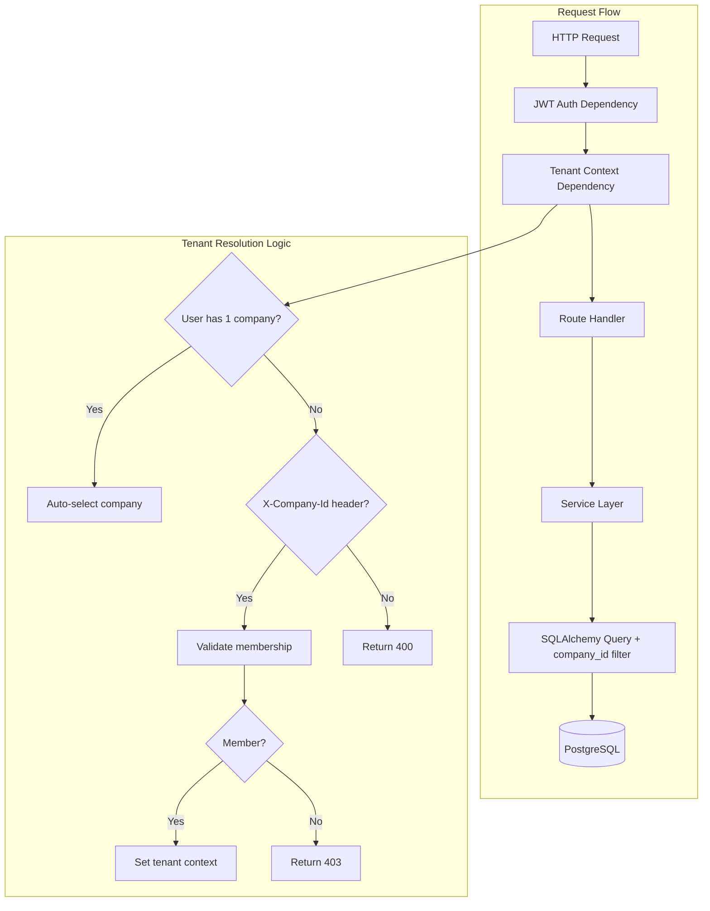
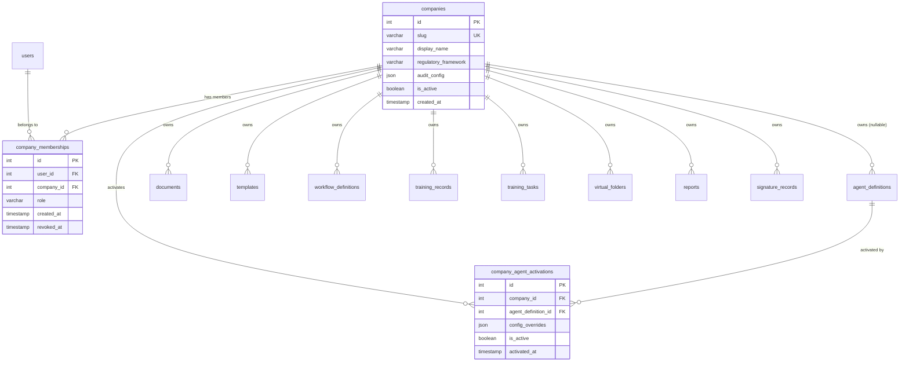

# Design Document: Multi-Tenancy

## Overview

This design introduces multi-tenancy to AlcoaBase by adding a `companies` table as the tenant entity and a `company_memberships` table for user-company associations. Every tenant-scoped table receives a `company_id` foreign key, and a FastAPI dependency (`get_tenant_context`) resolves the active company from the authenticated user's JWT and an optional `X-Company-Id` request header. All existing service queries are augmented with a mandatory `company_id` filter, enforced at the SQLAlchemy query layer so that no endpoint can accidentally leak cross-tenant data.

The design prioritizes:
- **Data isolation at the query layer** — every SELECT, INSERT, UPDATE, DELETE on tenant-scoped tables includes a `company_id` predicate.
- **Minimal disruption to existing code** — tenant context is injected via a FastAPI dependency, not middleware state, keeping the pattern explicit and testable.
- **Backward compatibility** — a migration backfills existing records with a default company, so single-tenant deployments upgrade seamlessly.

## Architecture



### Key Architectural Decisions

1. **Shared-schema multi-tenancy** (single database, `company_id` discriminator) rather than schema-per-tenant or database-per-tenant. This keeps operational complexity low for the expected scale (tens of companies, not thousands).

2. **Dependency injection over middleware** for tenant context. A `get_tenant_context` FastAPI dependency is explicit in function signatures, making it impossible to forget tenant scoping in a new endpoint. Middleware would hide the dependency and make testing harder.

3. **Non-nullable `company_id` on tenant-scoped tables** (except `agent_definitions` where NULL = global). This ensures the database itself rejects records without a tenant association.

4. **Composite indexes** on `(company_id, <lookup_column>)` for frequently queried tables to maintain query performance under tenant filtering.

## Components and Interfaces

### New SQLAlchemy Models

#### `Company` Model (`src/backend/src/alcoabase/models/company.py`)

```python
class Company(Base):
    __tablename__ = "companies"

    id: Mapped[int] = mapped_column(primary_key=True)
    slug: Mapped[str] = mapped_column(String(100), unique=True, index=True)
    display_name: Mapped[str] = mapped_column(String(300))
    regulatory_framework: Mapped[str] = mapped_column(String(50))
    audit_config: Mapped[dict] = mapped_column(JSON, default=dict)
    is_active: Mapped[bool] = mapped_column(default=True)
    created_at: Mapped[datetime] = mapped_column(
        DateTime(timezone=True), server_default=func.now()
    )

    memberships: Mapped[list["CompanyMembership"]] = relationship(
        back_populates="company"
    )
```

#### `CompanyMembership` Model (`src/backend/src/alcoabase/models/company.py`)

```python
class CompanyMembership(Base):
    __tablename__ = "company_memberships"

    id: Mapped[int] = mapped_column(primary_key=True)
    user_id: Mapped[int] = mapped_column(ForeignKey("users.id"), index=True)
    company_id: Mapped[int] = mapped_column(ForeignKey("companies.id"), index=True)
    role: Mapped[str] = mapped_column(String(50))  # "admin", "member", "viewer"
    created_at: Mapped[datetime] = mapped_column(
        DateTime(timezone=True), server_default=func.now()
    )
    revoked_at: Mapped[datetime | None] = mapped_column(
        DateTime(timezone=True), nullable=True
    )

    user: Mapped["User"] = relationship()
    company: Mapped["Company"] = relationship(back_populates="memberships")

    __table_args__ = (
        UniqueConstraint("user_id", "company_id", name="uq_company_memberships_user_company"),
    )
```

#### `CompanyAgentActivation` Model (`src/backend/src/alcoabase/models/company.py`)

```python
class CompanyAgentActivation(Base):
    __tablename__ = "company_agent_activations"

    id: Mapped[int] = mapped_column(primary_key=True)
    company_id: Mapped[int] = mapped_column(ForeignKey("companies.id"), index=True)
    agent_definition_id: Mapped[int] = mapped_column(
        ForeignKey("agent_definitions.id"), index=True
    )
    config_overrides: Mapped[dict] = mapped_column(JSON, default=dict)
    is_active: Mapped[bool] = mapped_column(default=True)
    activated_at: Mapped[datetime] = mapped_column(
        DateTime(timezone=True), server_default=func.now()
    )

    company: Mapped["Company"] = relationship()
    agent_definition: Mapped["AgentDefinition"] = relationship()

    __table_args__ = (
        UniqueConstraint(
            "company_id", "agent_definition_id",
            name="uq_company_agent_activations_company_agent"
        ),
    )
```

### Tenant Context Dependency (`src/backend/src/alcoabase/dependencies/tenant.py`)

```python
from dataclasses import dataclass

@dataclass(frozen=True)
class TenantContext:
    """Resolved tenant context for the current request."""
    company_id: int
    company_slug: str
    user_id: int
    membership_role: str  # "admin", "member", "viewer"


async def get_tenant_context(
    request: Request,
    session: AsyncSession = Depends(get_db_session),
    current_user: User = Depends(get_current_user),
) -> TenantContext:
    """Resolve the active tenant from JWT + optional X-Company-Id header.

    Resolution logic:
    1. Query all active memberships for the authenticated user.
    2. If exactly one membership → auto-select that company.
    3. If multiple memberships → require X-Company-Id header.
    4. Validate the target company is active.
    5. Return TenantContext dataclass.

    Raises:
        HTTPException 400: Multi-company user without X-Company-Id header.
        HTTPException 403: User not a member of specified company, or company inactive.
    """
    ...
```

### Modified Existing Tables (FK additions)

The following tables receive a new `company_id: Mapped[int] = mapped_column(ForeignKey("companies.id"))` column:

| Table | Nullable? | Notes |
|-------|-----------|-------|
| `documents` | No | All documents belong to a company |
| `templates` | No | All templates belong to a company |
| `workflow_definitions` | No | Workflows are company-specific |
| `training_records` | No | Training is company-scoped |
| `training_tasks` | No | Training tasks are company-scoped |
| `virtual_folders` | No | Folders are company-scoped |
| `reports` | No | Reports are company-scoped |
| `signature_records` | No | Signatures are company-scoped |
| `agent_definitions` | **Yes** | NULL = global agent definition |

### API Endpoints

#### Company Management (`/api/companies`)

| Method | Path | Description | Auth |
|--------|------|-------------|------|
| POST | `/api/companies` | Create a new company | System Admin |
| GET | `/api/companies` | List all companies | System Admin |
| GET | `/api/companies/{slug}` | Get company details | System Admin or Company Member |
| PATCH | `/api/companies/{slug}` | Update company config | System Admin or Company Admin |
| POST | `/api/companies/{slug}/deactivate` | Deactivate company | System Admin |
| POST | `/api/companies/{slug}/reactivate` | Reactivate company | System Admin |

#### Membership Management (`/api/companies/{slug}/members`)

| Method | Path | Description | Auth |
|--------|------|-------------|------|
| POST | `/api/companies/{slug}/members` | Add user to company | System Admin |
| GET | `/api/companies/{slug}/members` | List company members | Company Admin |
| PATCH | `/api/companies/{slug}/members/{user_id}` | Update member role | System Admin or Company Admin |
| DELETE | `/api/companies/{slug}/members/{user_id}` | Revoke membership | System Admin or Company Admin |

#### Agent Activation (`/api/companies/{slug}/agents`)

| Method | Path | Description | Auth |
|--------|------|-------------|------|
| POST | `/api/companies/{slug}/agents/{agent_id}/activate` | Activate global agent for company | Company Admin |
| DELETE | `/api/companies/{slug}/agents/{agent_id}/deactivate` | Deactivate agent for company | Company Admin |
| GET | `/api/companies/{slug}/agents` | List activated agents | Company Member |

### Tenant-Scoping Existing Endpoints

All existing endpoints that operate on tenant-scoped resources will add `TenantContext` as a dependency parameter:

```python
@router.get("", response_model=DocumentSearchResponse)
async def search_documents(
    tenant: TenantContext = Depends(get_tenant_context),  # NEW
    session: AsyncSession = Depends(get_db_session),
    service: DocumentService = Depends(get_document_service),
    ...
) -> DocumentSearchResponse:
    result = await service.search_documents(
        session=session,
        company_id=tenant.company_id,  # NEW - passed to all queries
        ...
    )
```

Service methods will add `company_id` as a required parameter and apply it as a filter:

```python
class DocumentService:
    async def search_documents(
        self, session: AsyncSession, company_id: int, ...
    ) -> dict:
        query = select(Document).where(
            Document.company_id == company_id  # Tenant filter
        )
        ...
```

### Pydantic Schemas (`src/backend/src/alcoabase/schemas/company.py`)

```python
class CompanyCreate(BaseModel):
    slug: str = Field(..., pattern=r"^[a-z0-9][a-z0-9-]{1,98}[a-z0-9]$")
    display_name: str = Field(..., min_length=1, max_length=300)
    regulatory_framework: Literal[
        "ISO_13485", "GMP", "GDP", "ISO_9001", "ISO_17025", "CUSTOM"
    ]
    audit_config: dict = Field(default_factory=dict)

class CompanyResponse(BaseModel):
    id: int
    slug: str
    display_name: str
    regulatory_framework: str
    audit_config: dict
    is_active: bool
    created_at: datetime

    model_config = ConfigDict(from_attributes=True)

class MembershipCreate(BaseModel):
    user_id: int
    role: Literal["admin", "member", "viewer"]

class MembershipResponse(BaseModel):
    id: int
    user_id: int
    company_id: int
    role: str
    created_at: datetime
    revoked_at: datetime | None

    model_config = ConfigDict(from_attributes=True)
```

## Data Models

### Entity Relationship Diagram



### Migration Strategy

The Alembic migration will:

1. **Create new tables**: `companies`, `company_memberships`, `company_agent_activations`
2. **Insert default company**: A "default" company with slug `"default"` for backfill
3. **Add `company_id` columns**: Initially nullable on existing tables
4. **Backfill**: Set all existing records' `company_id` to the default company's ID
5. **Alter to non-nullable**: Make `company_id` NOT NULL on all tables except `agent_definitions`
6. **Add indexes**: Composite indexes on `(company_id, document_uuid)`, `(company_id, slug)`, etc.
7. **Add foreign key constraints**: FK references to `companies.id`

This two-phase approach (add nullable → backfill → alter to non-null) avoids downtime and works with existing data.

### New Indexes

| Table | Index | Purpose |
|-------|-------|---------|
| `documents` | `(company_id, document_uuid)` | Tenant-scoped document lookup |
| `documents` | `(company_id, created_at)` | Tenant-scoped listing by date |
| `templates` | `(company_id, document_uuid)` | Tenant-scoped template lookup |
| `workflow_definitions` | `(company_id, document_tag)` | Tenant-scoped workflow binding |
| `training_tasks` | `(company_id, assigned_user_id)` | Tenant-scoped task assignment |
| `company_memberships` | `(user_id, company_id)` | Membership lookup (unique) |

## Correctness Properties

*A property is a characteristic or behavior that should hold true across all valid executions of a system — essentially, a formal statement about what the system should do. Properties serve as the bridge between human-readable specifications and machine-verifiable correctness guarantees.*

### Property 1: Company creation produces a valid record

*For any* valid company creation input (slug, display_name, regulatory_framework), calling the Company_Service create method SHALL produce a persisted Company record whose attributes exactly match the input values, with `is_active=True` and a non-null `created_at` timestamp.

**Validates: Requirements 1.1, 1.2**

### Property 2: Duplicate slug rejection

*For any* valid company slug, creating a company with that slug and then attempting to create another company with the same slug SHALL result in a conflict error, and the total number of companies with that slug SHALL remain exactly one.

**Validates: Requirements 1.4**

### Property 3: Missing required fields rejection

*For any* company creation payload where one or more required fields (slug, display_name, regulatory_framework) are absent or empty, the Company_Service SHALL reject the request with a validation error and no Company record SHALL be persisted.

**Validates: Requirements 1.5**

### Property 4: Membership creation and multi-membership support

*For any* valid user and any set of N distinct active companies, assigning the user to all N companies SHALL result in exactly N active membership records, each queryable independently.

**Validates: Requirements 2.1, 2.2**

### Property 5: Tenant context requires explicit selection for multi-company users

*For any* user with N > 1 active company memberships, a request without an explicit company identifier SHALL be rejected with HTTP 400, and a request with a valid company identifier for one of their memberships SHALL succeed.

**Validates: Requirements 2.3, 9.2, 9.3, 9.4**

### Property 6: Membership revocation prevents access

*For any* user with an active membership in a company, after that membership is revoked, subsequent requests specifying that company SHALL be rejected with HTTP 403.

**Validates: Requirements 2.5**

### Property 7: Tenant-scoped resource isolation (documents, templates, workflows, training, virtual folders, reports)

*For any* set of resources distributed across N companies, querying resources from company X's tenant context SHALL return only resources where `company_id = X`, and the count of returned resources SHALL equal the count of resources belonging to company X.

**Validates: Requirements 3.2, 3.3, 4.2, 4.4, 5.3, 6.2, 7.2**

### Property 8: Auto-scoping on resource creation

*For any* user with an active tenant context for company X, creating a tenant-scoped resource (document, template, workflow, report, virtual folder, training task) SHALL result in that resource having `company_id = X`.

**Validates: Requirements 3.1, 4.1, 4.3, 5.1, 6.1, 7.1**

### Property 9: Cross-tenant access returns forbidden

*For any* resource belonging to company A and any user whose active tenant context is company B (where A ≠ B), attempting to read, update, or delete that resource SHALL return HTTP 403.

**Validates: Requirements 3.4, 4.5, 5.4, 6.4**

### Property 10: Cross-tenant template reference rejection

*For any* template belonging to company A and any user in company B (A ≠ B), attempting to create a report referencing that template SHALL be rejected with HTTP 403.

**Validates: Requirements 4.5**

### Property 11: Virtual folder tag filter respects tenant boundary

*For any* virtual folder in company X with a tag filter, and documents with matching tags distributed across multiple companies, applying the filter SHALL return only documents where `company_id = X`.

**Validates: Requirements 7.3**

### Property 12: Workflow evaluation uses only tenant's workflows

*For any* document in company X, when evaluating workflow transitions, the system SHALL consider only workflow definitions where `company_id = X`, even if workflows with matching `document_tag` exist in other companies.

**Validates: Requirements 5.2**

### Property 13: Training compliance evaluation is tenant-scoped

*For any* document in company X, the training gate evaluation SHALL consider only training records where `company_id = X`, ignoring training records for the same SOP in other companies.

**Validates: Requirements 6.3**

### Property 14: Unauthorized company access returns forbidden

*For any* authenticated user and any company where the user has no active membership, specifying that company in the `X-Company-Id` header SHALL result in HTTP 403.

**Validates: Requirements 9.5**

### Property 15: Company deactivation blocks access

*For any* active company with N members, after deactivation, all requests specifying that company's tenant context SHALL return HTTP 403, and after reactivation, all N members SHALL regain access without re-assignment.

**Validates: Requirements 13.1, 13.2, 13.4**

### Property 16: Audit trail entries retain company_id after deactivation

*For any* company with audit trail entries, after deactivation, the count and content of audit entries for that company SHALL remain unchanged.

**Validates: Requirements 13.3**

### Property 17: Global agent modification rejection

*For any* global agent definition (company_id = NULL) and any company admin, attempting to modify the global definition SHALL be rejected with HTTP 403.

**Validates: Requirements 10.5**

### Property 18: Agent activation scoping

*For any* global agent definition and any company, activating the agent for that company SHALL create an activation record, and document evaluation in that company SHALL include the activated agent while evaluation in other companies SHALL not.

**Validates: Requirements 10.2, 10.3**

### Property 19: Migration backfill completeness

*For any* set of pre-existing records in tenant-scoped tables, after running the migration, all records SHALL have a non-null `company_id` equal to the default company's ID.

**Validates: Requirements 12.6**

## Error Handling

| Scenario | HTTP Status | Error Response |
|----------|-------------|----------------|
| Multi-company user without `X-Company-Id` | 400 | `{"detail": "Company selection required. Set X-Company-Id header."}` |
| User not a member of specified company | 403 | `{"detail": "Not a member of the specified company."}` |
| Company is deactivated | 403 | `{"detail": "Company is inactive."}` |
| Duplicate company slug | 409 | `{"detail": "Company with slug '{slug}' already exists."}` |
| Cross-tenant resource access | 403 | `{"detail": "Access denied: resource belongs to a different company."}` |
| Cross-tenant template reference | 403 | `{"detail": "Template belongs to a different company."}` |
| Non-existent user/company in membership | 404 | `{"detail": "User or company not found."}` |
| Missing required fields on company create | 422 | Standard Pydantic validation error |
| Attempt to modify global agent | 403 | `{"detail": "Cannot modify global agent. Create a company-scoped override instead."}` |

### Error Handling Strategy

- **Tenant context errors** are raised in the `get_tenant_context` dependency before the route handler executes. This ensures no service code runs without a valid tenant.
- **Cross-tenant access errors** are raised in service methods when a resource's `company_id` doesn't match the active tenant context.
- **All 403 responses** use a consistent format and are logged to the audit trail for security monitoring.
- **Database constraint violations** (e.g., unique slug) are caught at the service layer and translated to appropriate HTTP responses.

## Testing Strategy

### Property-Based Testing (Hypothesis)

The project already uses Hypothesis (listed in dev dependencies). Property-based tests will validate the correctness properties defined above.

**Configuration:**
- Library: `hypothesis` (already in `pyproject.toml` dev dependencies)
- Minimum iterations: 100 per property (via `@settings(max_examples=100)`)
- Each test tagged with: `# Feature: multi-tenancy, Property {N}: {title}`

**Test structure:**
- `tests/properties/test_tenant_isolation.py` — Properties 7, 8, 9, 11, 12, 13
- `tests/properties/test_company_crud.py` — Properties 1, 2, 3
- `tests/properties/test_membership.py` — Properties 4, 5, 6, 14
- `tests/properties/test_company_lifecycle.py` — Properties 15, 16
- `tests/properties/test_agents.py` — Properties 17, 18
- `tests/properties/test_migration.py` — Property 19

**Generators:**
- `st_company_slug()` — URL-safe slugs matching `^[a-z0-9][a-z0-9-]{1,98}[a-z0-9]$`
- `st_company()` — Full company creation payloads
- `st_membership()` — User-company-role tuples
- `st_tenant_scoped_resource()` — Documents/templates/etc. with company_id

### Unit Tests (pytest)

- Specific examples for error paths (deactivated company access, invalid slug formats)
- Edge cases: single-character slugs, maximum-length display names, empty audit_config
- Integration points: JWT decoding + tenant resolution, Alembic migration verification

### Integration Tests

- Full request lifecycle: authenticate → resolve tenant → create resource → query resource
- Migration test: seed data → run migration → verify backfill
- Cross-tenant isolation: two companies, verify complete data separation end-to-end
