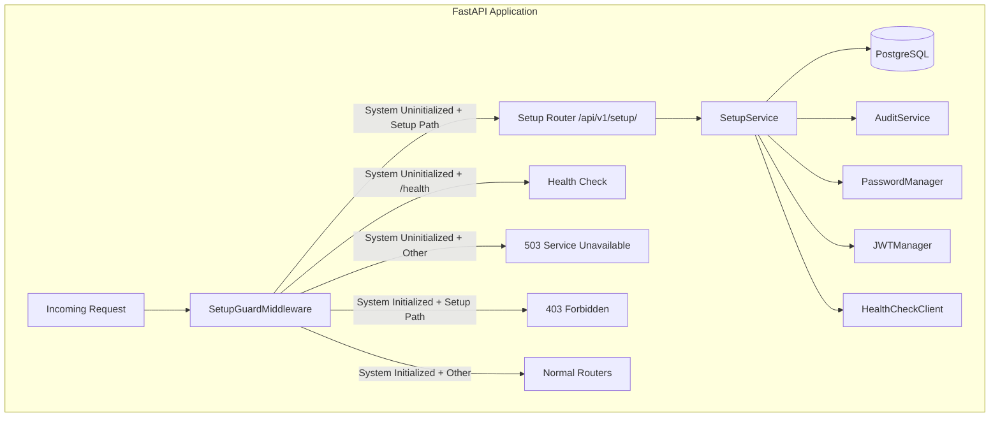
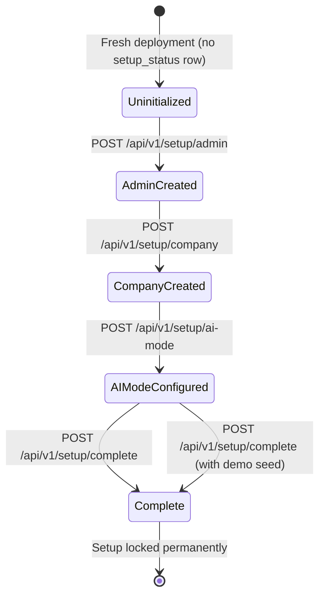
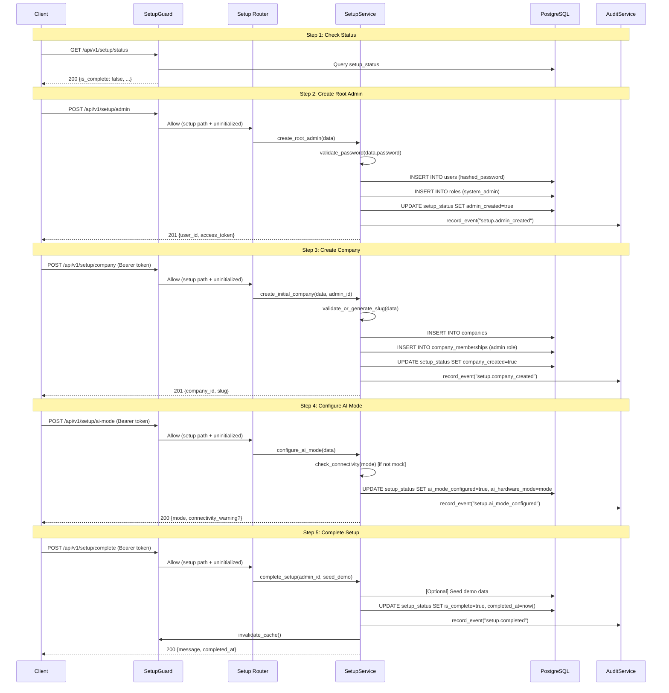

# Design Document: Setup Wizard

## Overview

The Setup Wizard is a first-run initialization subsystem that bootstraps a fresh AlcoaBase deployment. It integrates into the existing FastAPI application as a combination of:

1. **A Setup Guard middleware** that intercepts all requests and enforces access control based on initialization state.
2. **A dedicated API router** (`/api/v1/setup/`) exposing step-by-step setup endpoints.
3. **A service layer** encapsulating setup business logic (user creation, company creation, AI mode configuration, demo seeding).
4. **A persistent `setup_status` database table** tracking initialization state and step completion.

The wizard runs exactly once. After completion, the setup endpoints become permanently inaccessible (HTTP 403), and the guard allows normal application traffic. The design prioritizes:

- **Atomicity**: Each step is independently persisted so interrupted setups can resume.
- **Security**: No regulated operations are possible until setup completes.
- **Auditability**: All setup actions are recorded in the audit trail for GxP compliance.
- **Idempotency**: Repeated requests with identical parameters do not create duplicates.

## Architecture

### High-Level Integration



### Middleware Stack Order

The Setup Guard middleware must be registered **before** the Audit middleware in the stack (added last so it executes first in Starlette's middleware chain):

```python
# main.py middleware registration order:
app.add_middleware(CORSMiddleware, ...)
app.add_middleware(AuditMiddleware)
app.add_middleware(CSVTaggingMiddleware)
app.add_middleware(SetupGuardMiddleware)  # Executes first (LIFO)
```

This ensures that when the system is uninitialized, blocked requests never reach the audit middleware (which would fail without proper context).

### State Machine



## Components and Interfaces

### 1. SetupGuardMiddleware

**Location**: `src/backend/src/alcoabase/middleware/setup_guard.py`

```python
class SetupGuardMiddleware(BaseHTTPMiddleware):
    """Guards all endpoints based on system initialization state.
    
    Caches the setup status in-memory with invalidation on state change
    to avoid querying the database on every request.
    """
    
    async def dispatch(self, request: Request, call_next) -> Response:
        """Route or block requests based on initialization state."""
        ...
```

**Behavior**:
- Maintains an in-memory cached flag (`_is_initialized: bool | None`) to avoid DB queries on every request.
- On first request (or after cache invalidation), queries `setup_status` table.
- Allowed paths when uninitialized: `/health`, `/api/v1/setup/**`, `/docs`, `/openapi.json`.
- Returns `503 {"detail": "System setup required", "setup_url": "/api/v1/setup/"}` for blocked paths.
- Returns `403 {"detail": "Setup already completed"}` for setup paths when initialized.
- Exposes `invalidate_cache()` class method for the service layer to call after setup completion.

### 2. Setup API Router

**Location**: `src/backend/src/alcoabase/api/setup.py`

| Method | Path | Description | Auth Required |
|--------|------|-------------|---------------|
| GET | `/api/v1/setup/status` | Get current setup progress | No |
| POST | `/api/v1/setup/admin` | Create root admin account | No |
| POST | `/api/v1/setup/company` | Create initial company | JWT (root admin) |
| POST | `/api/v1/setup/ai-mode` | Configure AI hardware mode | JWT (root admin) |
| POST | `/api/v1/setup/complete` | Finalize setup (optional demo seed) | JWT (root admin) |

**Design decisions**:
- The `/status` and `/admin` endpoints require no authentication (no user exists yet).
- After admin creation, subsequent steps require the JWT returned from the admin creation step.
- The `/complete` endpoint accepts an optional `seed_demo_data: bool` flag.

### 3. SetupService

**Location**: `src/backend/src/alcoabase/services/setup_service.py`

```python
class SetupService:
    """Orchestrates the setup wizard business logic."""
    
    def __init__(self, session: AsyncSession):
        self.session = session
    
    async def get_status(self) -> SetupProgress: ...
    async def create_root_admin(self, data: RootAdminCreate) -> RootAdminResult: ...
    async def create_initial_company(self, data: CompanySetupCreate, admin_id: int) -> CompanyResult: ...
    async def configure_ai_mode(self, data: AIModeConfig) -> AIModeResult: ...
    async def complete_setup(self, admin_id: int, seed_demo: bool) -> SetupCompleteResult: ...
    async def is_initialized(self) -> bool: ...
```

### 4. PasswordValidator

**Location**: `src/backend/src/alcoabase/services/password_validator.py`

```python
class PasswordValidator:
    """Validates passwords against the GxP password policy."""
    
    MIN_LENGTH: int = 12
    
    def validate(self, password: str) -> list[str]:
        """Return list of unmet policy requirements (empty = valid)."""
        ...
```

**Policy rules**:
- Minimum 12 characters
- At least one uppercase letter
- At least one lowercase letter
- At least one digit
- At least one special character (non-alphanumeric)

### 5. SlugGenerator

**Location**: `src/backend/src/alcoabase/services/slug_generator.py`

```python
class SlugGenerator:
    """Generates and validates URL-safe slugs."""
    
    VALID_SLUG_PATTERN: re.Pattern = re.compile(r'^[a-z0-9]+(?:-[a-z0-9]+)*$')
    
    def generate(self, display_name: str) -> str:
        """Generate a URL-safe slug from a display name."""
        ...
    
    def validate(self, slug: str) -> bool:
        """Return True if slug contains only valid characters."""
        ...
```

## Data Models

### setup_status Table

**Location**: `src/backend/src/alcoabase/models/setup_status.py`

```python
class SetupStatus(Base):
    """Persistent setup wizard state.
    
    This table has at most ONE row. Its existence and state determine
    whether the system is initialized.
    """
    __tablename__ = "setup_status"
    
    id: Mapped[int] = mapped_column(primary_key=True)
    is_complete: Mapped[bool] = mapped_column(default=False)
    
    # Step completion tracking
    admin_created: Mapped[bool] = mapped_column(default=False)
    company_created: Mapped[bool] = mapped_column(default=False)
    ai_mode_configured: Mapped[bool] = mapped_column(default=False)
    demo_data_seeded: Mapped[bool] = mapped_column(default=False)
    
    # References
    root_admin_id: Mapped[int | None] = mapped_column(
        ForeignKey("users.id"), nullable=True
    )
    company_id: Mapped[int | None] = mapped_column(
        ForeignKey("companies.id"), nullable=True
    )
    ai_hardware_mode: Mapped[str | None] = mapped_column(String(10), nullable=True)
    
    # Timestamps
    started_at: Mapped[datetime] = mapped_column(
        DateTime(timezone=True), server_default=func.now()
    )
    completed_at: Mapped[datetime | None] = mapped_column(
        DateTime(timezone=True), nullable=True
    )
```

**Design rationale**:
- Single-row table pattern: simpler than a key-value store, strongly typed.
- Step completion booleans enable resumption after interruption.
- Foreign keys to `users` and `companies` tables provide referential integrity.
- `ai_hardware_mode` is stored here (in addition to env vars) for persistence across restarts.

### Pydantic Schemas

**Location**: `src/backend/src/alcoabase/schemas/setup.py`

```python
class RootAdminCreate(BaseModel):
    username: str = Field(min_length=3, max_length=100)
    email: EmailStr
    password: str = Field(min_length=12, max_length=128)
    full_name: str = Field(min_length=1, max_length=200)

class CompanySetupCreate(BaseModel):
    display_name: str = Field(min_length=1, max_length=300)
    slug: str | None = Field(default=None, max_length=100)
    regulatory_framework: str = Field(max_length=50)

class AIModeConfig(BaseModel):
    mode: Literal["gpu", "cpu", "mock"]

class SetupCompleteRequest(BaseModel):
    seed_demo_data: bool = False

class SetupProgress(BaseModel):
    is_complete: bool
    admin_created: bool
    company_created: bool
    ai_mode_configured: bool
    demo_data_seeded: bool

class RootAdminResult(BaseModel):
    user_id: int
    username: str
    access_token: str
    token_type: str = "bearer"

class CompanyResult(BaseModel):
    company_id: int
    slug: str
    display_name: str

class AIModeResult(BaseModel):
    mode: str
    connectivity_warning: str | None = None

class SetupCompleteResult(BaseModel):
    message: str
    completed_at: datetime
```

### Data Flow: Complete Setup Sequence



## Correctness Properties

*A property is a characteristic or behavior that should hold true across all valid executions of a system — essentially, a formal statement about what the system should do. Properties serve as the bridge between human-readable specifications and machine-verifiable correctness guarantees.*

### Property 1: Setup Guard Routing Correctness

*For any* API request path and any system initialization state (uninitialized or initialized), the Setup Guard SHALL:
- Return 503 for non-exempt, non-setup paths when uninitialized
- Allow setup paths (`/api/v1/setup/**`) and exempt paths (`/health`, `/docs`, `/openapi.json`) when uninitialized
- Return 403 for setup paths when initialized
- Allow all non-setup paths when initialized

**Validates: Requirements 1.2, 2.1, 2.2, 2.3, 7.3**

### Property 2: Password Policy Validation Completeness

*For any* string input, the password validator SHALL reject it if and only if it violates at least one policy rule, and the returned error list SHALL contain exactly the set of rules that the input violates (minimum 12 characters, uppercase, lowercase, digit, special character).

**Validates: Requirements 3.2, 3.3**

### Property 3: Password Hashing Round-Trip

*For any* valid password string, hashing it with bcrypt and then verifying the original password against the hash SHALL return True, and verifying any different string against the hash SHALL return False.

**Validates: Requirements 3.4**

### Property 4: Root Admin Creation Preserves Identity

*For any* valid root admin creation input (username, email, full_name, valid password), the created user record SHALL have matching username, email, and full_name fields, and the returned JWT access token SHALL decode to a payload whose subject identifies the created user.

**Validates: Requirements 3.1, 3.6**

### Property 5: Company Creation Preserves Fields

*For any* valid company creation input (display_name, slug, regulatory_framework), the created company record SHALL have matching display_name, slug, and regulatory_framework fields.

**Validates: Requirements 4.1**

### Property 6: Slug Validity

*For any* display name string, the auto-generated slug SHALL contain only lowercase letters, digits, and hyphens, and SHALL NOT be empty. Conversely, *for any* explicitly provided slug, the validator SHALL accept it if and only if it matches the pattern `^[a-z0-9]+(-[a-z0-9]+)*$`.

**Validates: Requirements 4.2, 4.3**

### Property 7: Demo Data Tagging Invariant

*For any* set of records created during demo data seeding, every record SHALL have `is_demo_data=True`, and no record created outside of demo seeding SHALL have this flag set.

**Validates: Requirements 6.4**

### Property 8: Setup Progress Accuracy

*For any* combination of completed setup steps (admin_created, company_created, ai_mode_configured, demo_data_seeded), the progress endpoint SHALL return a response where each boolean field matches the actual database state.

**Validates: Requirements 8.1**

### Property 9: Setup Step Idempotency

*For any* valid setup step input, submitting the same request twice with identical parameters SHALL NOT create duplicate database records — the total count of the relevant entity (users, companies) SHALL remain the same after the second submission.

**Validates: Requirements 8.4**

## Error Handling

### Error Response Format

All setup endpoints use a consistent error response structure:

```json
{
    "detail": "Human-readable error message",
    "error_code": "SETUP_ADMIN_EXISTS",
    "violations": ["optional", "list", "of", "specific", "issues"]
}
```

### Error Scenarios

| Scenario | HTTP Status | Error Code | Description |
|----------|-------------|------------|-------------|
| System uninitialized, non-setup request | 503 | `SETUP_REQUIRED` | System not yet configured |
| Setup already complete, setup request | 403 | `SETUP_ALREADY_COMPLETE` | Cannot re-run setup |
| Invalid password | 422 | `PASSWORD_POLICY_VIOLATION` | Lists all unmet requirements |
| Invalid slug characters | 422 | `INVALID_SLUG` | Slug contains invalid characters |
| Root admin already exists | 409 | `ADMIN_ALREADY_EXISTS` | Cannot create duplicate admin |
| Company already exists | 409 | `COMPANY_ALREADY_EXISTS` | Cannot create duplicate company |
| AI mode connectivity failure | 200 | N/A (warning in response) | Non-blocking warning |
| Missing required setup steps | 400 | `SETUP_INCOMPLETE` | Cannot complete with missing steps |
| Invalid JWT / expired token | 401 | `UNAUTHORIZED` | Token validation failed |
| Database connection failure | 500 | `INTERNAL_ERROR` | Unexpected infrastructure error |

### Connectivity Check Behavior

The AI mode connectivity check is **non-blocking** — it returns a warning in the response body rather than failing the request. This allows administrators to configure the mode even if the vLLM service isn't running yet (it may be started later).

```python
class AIModeResult(BaseModel):
    mode: str
    connectivity_warning: str | None = None  # e.g., "vLLM GPU endpoint unreachable at http://..."
```

## Testing Strategy

### Property-Based Testing (Hypothesis)

This feature is well-suited for property-based testing because it contains:
- Pure validation logic (password policy, slug validation)
- Universal routing rules (setup guard path matching)
- Data preservation invariants (creation preserves fields)
- Idempotency guarantees

**Library**: `hypothesis` (already in dev dependencies)

**Configuration**: Minimum 100 examples per property test.

**Tag format**: `# Feature: setup-wizard, Property {N}: {title}`

Each correctness property (1–9) maps to a dedicated Hypothesis test:

| Property | Test File | What Varies |
|----------|-----------|-------------|
| 1: Guard Routing | `test_setup_guard_properties.py` | Random paths × initialization states |
| 2: Password Validation | `test_password_validator_properties.py` | Random strings with controlled character classes |
| 3: Password Hashing | `test_password_hashing_properties.py` | Random valid passwords |
| 4: Admin Creation | `test_setup_service_properties.py` | Random valid usernames, emails, passwords |
| 5: Company Creation | `test_setup_service_properties.py` | Random valid company names, slugs, frameworks |
| 6: Slug Validity | `test_slug_properties.py` | Random unicode strings for generation; random ASCII for validation |
| 7: Demo Data Tagging | `test_demo_seed_properties.py` | Random regulatory frameworks |
| 8: Progress Accuracy | `test_setup_progress_properties.py` | Random boolean step combinations |
| 9: Idempotency | `test_setup_idempotency_properties.py` | Random valid inputs submitted twice |

### Unit Tests (Example-Based)

- Setup guard allows `/health` when uninitialized
- Setup guard transitions behavior immediately after completion (no restart)
- Root admin gets system administrator role
- Company `is_active` defaults to True
- Root admin gets company admin membership
- AI mode "mock" skips connectivity check
- Each of the three AI modes persists correctly
- Conflict errors (409) on duplicate admin/company creation
- Completion records timestamp and admin ID

### Integration Tests

- Full setup flow end-to-end (status → admin → company → ai-mode → complete)
- Audit trail entries created for each setup step
- Audit entry for admin creation has no user context (first step)
- AI mode connectivity check against mock vLLM endpoint
- Setup status survives application restart (DB persistence)
- Demo data seeding creates expected record types

### Test Organization

```
src/backend/tests/
├── properties/
│   ├── test_setup_guard_properties.py
│   ├── test_password_validator_properties.py
│   ├── test_password_hashing_properties.py
│   ├── test_slug_properties.py
│   ├── test_setup_service_properties.py
│   ├── test_setup_progress_properties.py
│   ├── test_setup_idempotency_properties.py
│   └── test_demo_seed_properties.py
├── unit/
│   └── test_setup_wizard.py
└── integration/
    └── test_setup_flow.py
```
