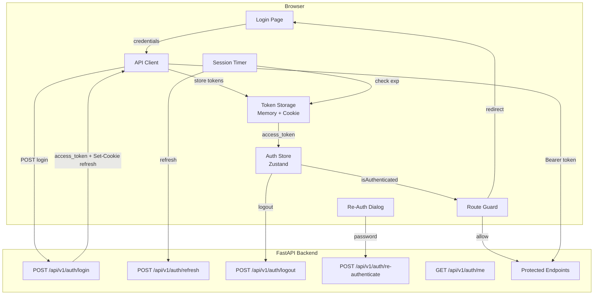
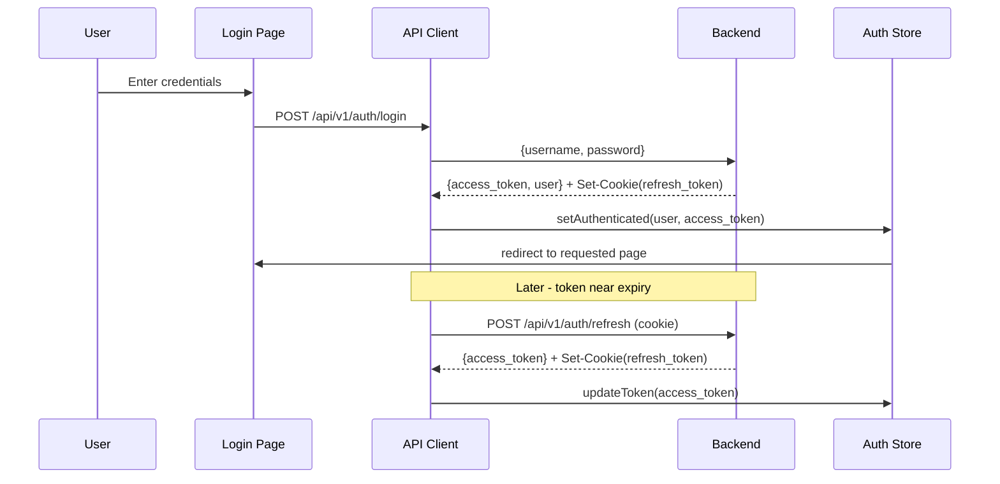

# Design Document: Authentication & Session Management - Frontend

## Overview

This design covers the full-stack authentication system for AlcoaBase, including new backend auth endpoints (login, refresh, logout, re-authenticate) and the frontend implementation (login page, token management, route guards, session handling, and re-authentication dialog). The system operates under GxP regulatory constraints (CFR 21 Part 11) requiring strict session management and re-authentication for electronic signatures.

### Design Decisions

1. **Access tokens in memory, refresh via httpOnly cookie**: Access tokens are stored in a module-scoped variable (not localStorage/sessionStorage) to prevent XSS theft. Refresh tokens are delivered as httpOnly cookies by the backend, making them inaccessible to JavaScript.

2. **Native fetch with a custom wrapper**: No HTTP client library is installed. We use a thin `apiClient` wrapper around native `fetch` that handles token attachment, 401 retry with refresh, and multi-tenant headers.

3. **Zustand for auth state**: Consistent with the existing store pattern (`useAuthStore`). The store is refactored from the current placeholder to a real implementation.

4. **Backend token design**: Short-lived access tokens (15 minutes) with longer-lived refresh tokens (7 days). Refresh tokens are stored server-side for revocation support (logout invalidates them).

5. **Proactive token refresh**: The frontend decodes the JWT `exp` claim and refreshes 60 seconds before expiry, avoiding mid-request 401 errors.

6. **Inactivity timeout**: A configurable client-side timer (default 30 minutes) warns the user and then logs them out if no interaction is detected.

## Architecture



### Request Flow



## Components and Interfaces

### Backend Auth Endpoints (New)

#### POST /api/v1/auth/login

```typescript
// Request
interface LoginRequest {
  username: string;
  password: string;
}

// Response (200 OK)
interface LoginResponse {
  access_token: string;
  token_type: "bearer";
  expires_in: number; // seconds until access_token expires
  user: {
    id: number;
    username: string;
    email: string;
    full_name: string;
    roles: string[];
  };
}
// Also sets httpOnly cookie: refresh_token
// Error: 401 { detail: "Invalid credentials" }
```

#### POST /api/v1/auth/refresh

```typescript
// Request: No body. Refresh token sent via httpOnly cookie.
// Response (200 OK)
interface RefreshResponse {
  access_token: string;
  token_type: "bearer";
  expires_in: number;
}
// Also rotates the httpOnly refresh_token cookie
// Error: 401 { detail: "Invalid or expired refresh token" }
```

#### POST /api/v1/auth/logout

```typescript
// Request: No body. Refresh token sent via httpOnly cookie.
// Response (200 OK)
interface LogoutResponse {
  message: "Logged out successfully";
}
// Clears the refresh_token cookie and invalidates server-side
```

#### POST /api/v1/auth/re-authenticate

```typescript
// Request
interface ReAuthRequest {
  password: string;
}

// Response (200 OK)
interface ReAuthResponse {
  verified: true;
  signature_token: string; // short-lived token for the signature operation
  expires_in: number; // seconds (e.g., 120)
}
// Error: 401 { detail: "Invalid credentials" }
// Requires Bearer token (user must already be authenticated)
```

#### GET /api/v1/auth/me

```typescript
// Request: Bearer token in Authorization header
// Response (200 OK)
interface MeResponse {
  id: number;
  username: string;
  email: string;
  full_name: string;
  roles: string[];
  companies: Array<{
    company_id: number;
    company_slug: string;
    role: string;
  }>;
}
```

### Frontend Components

#### Token Storage Module (`src/frontend/src/lib/tokenStorage.ts`)

```typescript
interface TokenStorage {
  getAccessToken(): string | null;
  setAccessToken(token: string): void;
  clearAccessToken(): void;
  getTokenExpiry(): number | null; // Unix timestamp from JWT exp claim
}
```

Stores access token in a module-scoped closure variable. Refresh token is managed entirely via httpOnly cookie (no JS access needed).

#### API Client (`src/frontend/src/lib/apiClient.ts`)

```typescript
interface ApiClientOptions {
  skipAuth?: boolean; // For public endpoints (login, health)
}

interface ApiClient {
  get<T>(url: string, options?: ApiClientOptions): Promise<T>;
  post<T>(url: string, body?: unknown, options?: ApiClientOptions): Promise<T>;
  put<T>(url: string, body?: unknown, options?: ApiClientOptions): Promise<T>;
  delete<T>(url: string, options?: ApiClientOptions): Promise<T>;
}
```

Key behaviors:
- Attaches `Authorization: Bearer <token>` for authenticated requests
- Attaches `X-User-Id` and `X-Company-Id` headers when tenant context is available
- On 401 response: attempts refresh once, retries original request
- On refresh failure: clears auth state, redirects to login
- Sets `Content-Type: application/json` for non-GET requests
- Uses `credentials: 'include'` to send httpOnly cookies

#### Auth Store (`src/frontend/src/stores/authStore.ts`)

```typescript
interface User {
  id: number;
  username: string;
  email: string;
  full_name: string;
  roles: string[];
}

interface AuthState {
  user: User | null;
  isAuthenticated: boolean;
  isLoading: boolean; // true during initialization/refresh
  sessionExpired: boolean;
  
  // Actions
  login(username: string, password: string): Promise<void>;
  logout(): Promise<void>;
  refreshToken(): Promise<boolean>;
  initialize(): Promise<void>; // Called on app mount
  reAuthenticate(password: string): Promise<{ verified: boolean; signatureToken?: string }>;
  clearSession(reason?: string): void;
}
```

#### Route Guard (`src/frontend/src/components/auth/RouteGuard.tsx`)

```typescript
interface RouteGuardProps {
  children: React.ReactNode;
}
// Wraps protected routes. Checks isAuthenticated from AuthStore.
// Shows loading spinner during initialization.
// Redirects to /login with ?redirect= param if unauthenticated.
```

#### Login Page (`src/frontend/src/pages/LoginPage.tsx`)

Uses `react-hook-form` for form management. Fields: username, password. Includes password visibility toggle, loading state, error display, and accessibility attributes.

#### Re-Authentication Dialog (`src/frontend/src/components/auth/ReAuthDialog.tsx`)

```typescript
interface ReAuthDialogProps {
  open: boolean;
  onSuccess: (signatureToken: string) => void;
  onCancel: () => void;
}
// Modal overlay with password field.
// Shows current username as read-only.
// Enforces max 5 failed attempts then locks session.
```

#### Session Timer Hook (`src/frontend/src/hooks/useSessionTimer.ts`)

```typescript
interface SessionTimerConfig {
  inactivityTimeoutMs: number; // default 30 minutes
  warningBeforeMs: number; // default 60 seconds before logout
  refreshBeforeExpiryMs: number; // default 60 seconds before token expiry
}

interface UseSessionTimerReturn {
  showInactivityWarning: boolean;
  showExpiryWarning: boolean;
  remainingSeconds: number;
  dismissWarning(): void;
  extendSession(): void;
}
```

## Data Models

### JWT Access Token Payload (Backend)

```python
{
    "sub": str(user_id),       # User ID as string
    "username": username,       # For display purposes
    "exp": datetime,           # 15 minutes from issuance
    "iat": datetime,           # Issued at
    "type": "access"           # Token type discriminator
}
```

### JWT Refresh Token Payload (Backend)

```python
{
    "sub": str(user_id),
    "exp": datetime,           # 7 days from issuance
    "iat": datetime,
    "jti": str(uuid4()),       # Unique token ID for revocation
    "type": "refresh"
}
```

### Refresh Token Server-Side Storage (Backend)

```python
class RefreshToken(Base):
    __tablename__ = "refresh_tokens"
    
    id: Mapped[int] = mapped_column(primary_key=True)
    jti: Mapped[str] = mapped_column(String(36), unique=True, index=True)  # JWT ID
    user_id: Mapped[int] = mapped_column(ForeignKey("users.id"))
    expires_at: Mapped[datetime] = mapped_column(DateTime(timezone=True))
    revoked_at: Mapped[datetime | None] = mapped_column(DateTime(timezone=True), nullable=True)
    created_at: Mapped[datetime] = mapped_column(DateTime(timezone=True), server_default=func.now())
```

### Frontend Auth State Shape

```typescript
// Persisted in Zustand store (memory only, not persisted to storage)
interface AuthStoreState {
  user: User | null;
  isAuthenticated: boolean;
  isLoading: boolean;
  sessionExpired: boolean;
  activeCompanyId: number | null;
  activeCompanySlug: string | null;
}
```

### Login Form Data

```typescript
interface LoginFormData {
  username: string;
  password: string;
}

// Validation rules (react-hook-form)
const loginValidation = {
  username: { required: "Username is required" },
  password: { required: "Password is required" },
};
```


## Correctness Properties

*A property is a characteristic or behavior that should hold true across all valid executions of a system — essentially, a formal statement about what the system should do. Properties serve as the bridge between human-readable specifications and machine-verifiable correctness guarantees.*

### Property 1: Token storage round-trip and clear

*For any* valid token string, storing it in TokenStorage and then retrieving it SHALL return the identical string, and after clearing, retrieval SHALL return null. At no point SHALL localStorage or sessionStorage contain the token.

**Validates: Requirements 2.1, 2.4, 2.5**

### Property 2: Login form validation rejects empty fields

*For any* pair of (username, password) inputs where at least one is empty or composed entirely of whitespace, submitting the login form SHALL produce a validation error for the empty field(s) and SHALL NOT trigger an API request. Conversely, for any pair where both are non-empty non-whitespace strings, no client-side validation error SHALL be produced.

**Validates: Requirements 1.2**

### Property 3: Post-login redirect preserves requested URL

*For any* valid URL path stored as a `redirect` query parameter on the login page, a successful login SHALL navigate the user to that exact path. When no redirect parameter is present, navigation SHALL go to the default landing page ("/").

**Validates: Requirements 1.4**

### Property 4: API client attaches Bearer token for protected endpoints

*For any* non-public endpoint URL and any access token currently stored, the API client SHALL include an `Authorization: Bearer <token>` header in the outgoing request.

**Validates: Requirements 3.1**

### Property 5: API client 401 retry with refresh

*For any* API request that receives an HTTP 401 response, the API client SHALL attempt exactly one token refresh. If the refresh succeeds, the original request SHALL be retried with the new token. If the refresh fails, no further retry SHALL occur and the auth state SHALL be cleared.

**Validates: Requirements 3.3, 3.4**

### Property 6: API client attaches tenant headers when context exists

*For any* request made while an active tenant context (userId, companyId) is set, the API client SHALL include `X-User-Id` and `X-Company-Id` headers with the correct values. When no tenant context is set, these headers SHALL be absent.

**Validates: Requirements 3.5**

### Property 7: API client JSON serialization for non-GET requests

*For any* non-GET request with a body object, the API client SHALL serialize the body as JSON and set the `Content-Type` header to `application/json`. For GET requests, no Content-Type header SHALL be set and no body SHALL be sent.

**Validates: Requirements 3.6**

### Property 8: Route guard redirects unauthenticated users with URL preservation

*For any* protected route path, when the auth state is unauthenticated (and not loading), the Route Guard SHALL redirect to `/login?redirect=<encoded_path>` preserving the originally requested URL.

**Validates: Requirements 4.1, 4.2**

### Property 9: JWT exp claim decoding round-trip

*For any* valid JWT token containing an `exp` claim (a Unix timestamp), decoding the token payload and extracting the `exp` field SHALL return the original timestamp value. For tokens without an `exp` claim, the result SHALL be null.

**Validates: Requirements 5.1**

### Property 10: Logout resets all application state regardless of API outcome

*For any* initial auth state (any user, any tokens, any tenant context) and any logout API outcome (success, network error, server error), after logout completes: the user SHALL be null, isAuthenticated SHALL be false, all tokens SHALL be cleared, tenant context SHALL be null, and navigation SHALL be at the login page.

**Validates: Requirements 6.1, 6.3, 6.4, 6.5**

### Property 11: Re-auth lockout after 5 consecutive failures

*For any* sequence of N consecutive failed re-authentication attempts where N >= 5, the system SHALL lock the session and redirect to the login page on the 5th failure. For N < 5, the dialog SHALL remain open and allow retry.

**Validates: Requirements 7.6**

### Property 12: Password visibility toggle state

*For any* number N of toggle activations on the password visibility control, the password field type SHALL be "text" when N is odd and "password" when N is even (including N=0 for the initial masked state).

**Validates: Requirements 9.2, 9.3**

## Error Handling

### Network Errors

| Scenario | Behavior |
|----------|----------|
| Login request network failure | Display "Unable to connect. Please check your network and try again." Allow retry. |
| Token refresh network failure | Display session expiry warning with re-login option. |
| Logout request network failure | Clear local state anyway (fail-open). Redirect to login. |
| Re-auth request network failure | Display "Connection error. Please try again." in the dialog. Do not count as failed attempt. |
| General API request network failure | Propagate error to calling component. Do not trigger auth state changes. |

### Authentication Errors

| Scenario | Behavior |
|----------|----------|
| Login 401 (invalid credentials) | Display generic "Invalid username or password" message. No detail about which field is wrong. |
| API request 401 (token expired) | Silently attempt refresh. If refresh succeeds, retry request. If refresh fails, redirect to login. |
| Refresh 401 (refresh token expired) | Clear all auth state. Redirect to login with "Session expired" message. |
| Re-auth 401 (wrong password) | Increment failure counter. Display "Incorrect password" in dialog. Lock session at 5 failures. |

### Rate Limiting and Server Errors

| Scenario | Behavior |
|----------|----------|
| 429 Too Many Requests | Display "Too many attempts. Please wait and try again." Disable submit for the retry-after duration. |
| 500 Internal Server Error | Display "An unexpected error occurred. Please try again later." |
| Request timeout (30s) | Treat as network error. Display connection problem message. |

### State Recovery

- If the auth store enters an inconsistent state (e.g., `isAuthenticated=true` but no access token), the next API request will trigger a 401 → refresh flow, self-healing the state.
- If refresh fails during recovery, the user is cleanly redirected to login.
- The `initialize()` function on app mount always attempts to establish a consistent state from whatever tokens are available.

## Testing Strategy

### Property-Based Testing

**Library**: [fast-check](https://github.com/dubzzz/fast-check) (TypeScript PBT library)

**Configuration**: Minimum 100 iterations per property test.

**Tag format**: `Feature: auth-session-frontend, Property {number}: {property_text}`

Property-based tests target the pure logic layers:
- `tokenStorage` module (store/retrieve/clear)
- `apiClient` header attachment logic (can be tested with a mock fetch)
- `decodeTokenExpiry` utility function
- Login form validation rules
- Route guard redirect logic
- Re-auth attempt counter logic
- Password toggle state machine

Each correctness property (1-12) maps to a single property-based test file.

### Unit Tests (Example-Based)

Using Vitest (compatible with the Vite build tool):

- **LoginPage component**: Render tests for form elements, loading state, error display, accessibility attributes
- **RouteGuard component**: Render tests for loading state, authenticated redirect away from login
- **ReAuthDialog component**: Render tests for modal appearance, success/cancel callbacks
- **Session timer hook**: Timer-based tests with fake timers for proactive refresh and inactivity warning
- **Auth store initialization**: Mock refresh endpoint, verify state transitions

### Integration Tests

- **Full login flow**: Mount app → navigate to protected route → redirected to login → enter credentials → redirected back
- **Session refresh flow**: Authenticated state → token expires → automatic refresh → continued access
- **Logout flow**: Authenticated state → logout → all state cleared → at login page
- **Re-auth flow**: Authenticated → trigger signature → re-auth dialog → enter password → signature proceeds

### Accessibility Testing

- axe-core integration for automated WCAG 2.1 AA checks on LoginPage
- Manual testing with screen readers for aria-live announcements
- Keyboard navigation verification for tab order and Enter key submission

### Backend Auth Endpoint Tests

Using pytest with httpx AsyncClient:

- **Login endpoint**: Valid credentials → 200 + token + cookie, invalid → 401, missing fields → 422
- **Refresh endpoint**: Valid cookie → 200 + new token, expired → 401, revoked → 401
- **Logout endpoint**: Valid session → 200 + cookie cleared + token revoked
- **Re-authenticate endpoint**: Valid password → 200 + signature token, invalid → 401
- **Me endpoint**: Valid token → 200 + user profile, expired → 401
