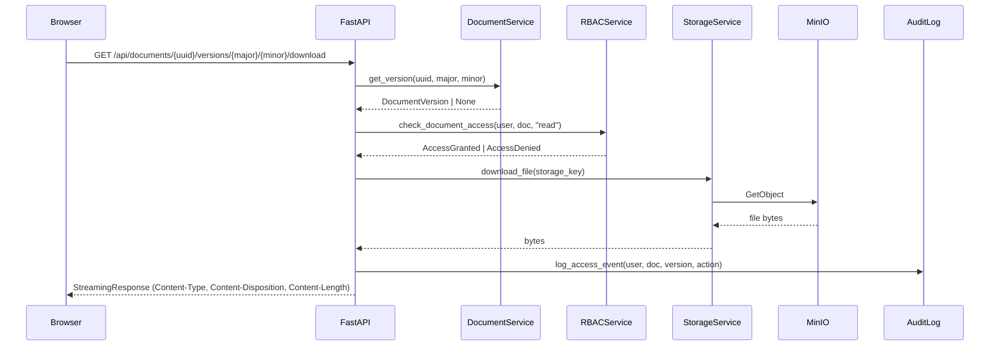
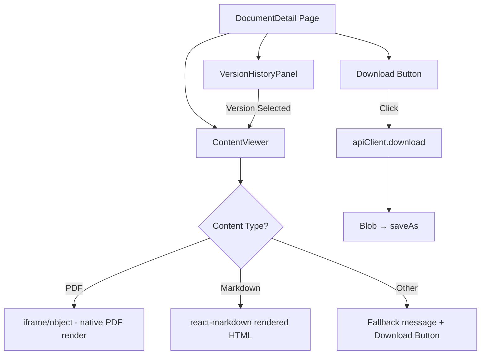

# Design Document: Document Content Viewer

## Overview

This feature adds document content viewing and downloading capabilities to AlcoaBase. It introduces two new backend endpoints (download and inline content preview), a frontend `ContentViewer` component integrated into the document detail page, download buttons across search and knowledge chat surfaces, and an extension to the frontend API client for authenticated binary downloads.

The design follows the existing layered architecture: thin API routes delegate to the `DocumentService` which coordinates RBAC checks and `StorageService` calls. The frontend uses the existing Zustand-based `documentStore` pattern and extends `apiClient` with a `download` method returning `Blob` objects.

### Key Design Decisions

1. **Streaming via `StreamingResponse`**: The backend uses FastAPI's `StreamingResponse` to avoid loading entire files into memory before responding. For the current `StorageService.download_file()` which returns `bytes`, we wrap in a single-chunk stream. This allows future migration to true streaming without API changes.

2. **Content-type classification as a pure function**: A standalone `resolve_content_type()` and `is_previewable()` utility handles MIME type resolution and disposition decisions. This keeps the logic testable and reusable.

3. **Reuse existing RBAC pattern**: The download endpoints use the same `DocumentService.check_document_access()` call as other document operations, maintaining the "most restrictive wins" policy.

4. **No presigned URLs for MVP**: Direct proxy streaming through the backend maintains consistent auth/audit enforcement without exposing MinIO topology. Presigned URLs can be added later as a performance optimization.

5. **Audit logging via existing middleware**: Download/content GET requests are logged through a lightweight audit helper (not the `X-Change-Reason` middleware which only applies to mutations).

## Architecture



### Component Interaction (Frontend)



## Components and Interfaces

### Backend

#### New Endpoint Routes (`api/documents.py` — additions)

```python
@router.get(
    "/{document_uuid}/versions/{major_version}/{minor_version}/download",
    responses={401: {}, 403: {}, 404: {}, 502: {}},
)
async def download_document_version(
    document_uuid: str,
    major_version: int,
    minor_version: int,
    session: AsyncSession = Depends(get_db_session),
    service: DocumentService = Depends(get_document_service),
    tenant: TenantContext = Depends(get_tenant_context),
) -> StreamingResponse: ...

@router.get(
    "/{document_uuid}/versions/{major_version}/{minor_version}/content",
    responses={401: {}, 403: {}, 404: {}, 502: {}},
)
async def get_document_content(
    document_uuid: str,
    major_version: int,
    minor_version: int,
    session: AsyncSession = Depends(get_db_session),
    service: DocumentService = Depends(get_document_service),
    tenant: TenantContext = Depends(get_tenant_context),
) -> StreamingResponse: ...
```

#### Content Type Utilities (`services/content_type_utils.py` — new file)

```python
def resolve_content_type(stored_content_type: str | None, storage_key: str) -> str:
    """Determine MIME type from stored value or file extension fallback."""
    ...

def is_previewable(content_type: str) -> bool:
    """Return True if the content type can be rendered inline in a browser."""
    ...

def build_content_disposition(disposition: str, filename: str) -> str:
    """Build RFC 6266 Content-Disposition header value with UTF-8 filename encoding."""
    ...
```

#### Audit Access Logger (`services/audit_access_logger.py` — new file)

```python
async def log_document_access(
    session: AsyncSession,
    user_id: int,
    document_uuid: str,
    major_version: int,
    minor_version: int,
    action: str,  # "download" | "content_preview"
) -> None:
    """Record a document access event to the audit trail."""
    ...
```

### Frontend

#### API Client Extension (`lib/apiClient.ts`)

```typescript
// New method on apiClient
download(url: string, options?: ApiClientOptions): Promise<Blob>
```

#### Utility (`lib/fileDownload.ts` — new file)

```typescript
export function triggerBrowserDownload(blob: Blob, filename: string): void;
```

#### ContentViewer Component (`components/documents/ContentViewer.tsx` — new file)

```typescript
interface ContentViewerProps {
  documentUuid: string;
  majorVersion: number;
  minorVersion: number;
  contentType: string;
}

export function ContentViewer(props: ContentViewerProps): JSX.Element;
```

#### DownloadButton Component (`components/documents/DownloadButton.tsx` — new file)

```typescript
interface DownloadButtonProps {
  documentUuid: string;
  version?: { major_version: number; minor_version: number };
  documentTitle: string;
  variant?: "icon" | "button";
}

export function DownloadButton(props: DownloadButtonProps): JSX.Element;
```

## Data Models

### Existing Models Used (no schema changes required)

The feature relies entirely on existing database models:

| Model | Key Fields Used |
|-------|----------------|
| `Document` | `document_uuid`, `title`, `document_type`, `company_id` |
| `DocumentVersion` | `major_version`, `minor_version`, `storage_key`, `document_id` |

### Content Type Resolution Logic

```
Priority:
1. DocumentVersion has content_type stored at upload → use it
2. Infer from storage_key extension:
   .pdf  → application/pdf
   .docx → application/vnd.openxmlformats-officedocument.wordprocessingml.document
   .md   → text/markdown
   .txt  → text/plain
   .png  → image/png
   .jpg  → image/jpeg
3. Fallback → application/octet-stream
```

**Note**: The `DocumentVersion` model does not currently have a `content_type` column. The content type was passed to `StorageService.upload_file()` at upload time but not persisted in the DB. Two options:

- **Option A (chosen)**: Infer from the `storage_key` extension for now. Since files are stored as `documents/{uuid}/{version}/document` (no extension), we add a new nullable `content_type` column to `DocumentVersion` via Alembic migration. New uploads will populate it; existing rows use `application/octet-stream` as fallback.
- **Option B**: Store content type as MinIO object metadata and retrieve it with a HEAD request. More complex, higher latency.

### Alembic Migration

```python
# Add content_type column to document_versions
op.add_column(
    "document_versions",
    sa.Column("content_type", sa.String(200), nullable=True),
)
```

### Previewable Content Types

```python
PREVIEWABLE_TYPES: set[str] = {
    "application/pdf",
    "text/markdown",
    "text/plain",
    "image/png",
    "image/jpeg",
    "image/gif",
    "image/webp",
    "image/svg+xml",
}
```

## Correctness Properties

*A property is a characteristic or behavior that should hold true across all valid executions of a system — essentially, a formal statement about what the system should do. Properties serve as the bridge between human-readable specifications and machine-verifiable correctness guarantees.*

### Property 1: Response Header Correctness

*For any* valid document version with a known content type and any document title, the download endpoint SHALL return a response where:
- `Content-Type` equals the resolved MIME type
- `Content-Disposition` contains the sanitized filename
- `Content-Length` equals the byte length of the file content

**Validates: Requirements 1.1, 2.1, 5.3**

### Property 2: Content-Type Disposition Classification

*For any* MIME type string, if it belongs to the set of previewable types (PDF, markdown, plain text, images), the content endpoint SHALL set `Content-Disposition: inline`; otherwise it SHALL set `Content-Disposition: attachment`.

**Validates: Requirements 2.4**

### Property 3: RBAC Enforcement Consistency

*For any* user and document combination, the download/content endpoints SHALL grant access if and only if `DocumentService.check_document_access(user, document, "read")` returns `True`. No file bytes are transmitted when access is denied.

**Validates: Requirements 1.4, 6.2, 6.3**

### Property 4: Content-Type Resolution

*For any* document version, if a stored `content_type` value is present and non-empty, the resolved content type SHALL equal the stored value. If no stored value exists, the resolved type SHALL match the extension-to-MIME mapping for the storage key's extension, or `application/octet-stream` if no mapping exists.

**Validates: Requirements 5.1, 5.2**

### Property 5: Latest Version Resolution

*For any* non-empty list of document versions, the "latest version" SHALL be the version with the maximum `(major_version, minor_version)` tuple when compared lexicographically.

**Validates: Requirements 4.3**

### Property 6: Markdown Rendering Produces Valid HTML Structure

*For any* valid markdown string containing headers, the rendered HTML output SHALL contain a corresponding `<h1>`–`<h6>` element for each markdown header. For any markdown string containing links, the rendered HTML SHALL contain corresponding `<a>` elements with the correct href.

**Validates: Requirements 3.3**

## Error Handling

| Scenario | HTTP Status | Response Body | Frontend Behavior |
|----------|-------------|---------------|-------------------|
| Document version not found in DB | 404 | `{"detail": "Document version not found"}` | Toast notification |
| File not found in MinIO | 404 | `{"detail": "File not found in storage"}` | Toast notification |
| User not authenticated | 401 | `{"detail": "Not authenticated"}` | Redirect to login |
| User lacks read permission | 403 | `{"detail": "Insufficient permissions"}` | Toast notification |
| StorageService raises exception | 502 | `{"detail": "Storage retrieval failure"}` | Toast + retry option |
| Content-type cannot be determined | 200 | Fallback to `application/octet-stream` + attachment disposition | Download triggered |

### Frontend Error States

The `ContentViewer` component handles three error states:
1. **Loading failure**: Displays error message with retry button
2. **Unsupported format**: Displays informational message with download fallback
3. **Network timeout**: 30-second timeout on fetch, displays timeout message

## Testing Strategy

### Backend Testing

**Unit Tests** (pytest + pytest-asyncio):
- Endpoint handler tests with mocked `DocumentService` and `StorageService`
- Individual error cases (404, 403, 502)
- `resolve_content_type()` with specific extension mappings
- `build_content_disposition()` with filenames containing special characters
- Audit log creation verification

**Property Tests** (Hypothesis):
- Property 1: Generate random titles (unicode, special chars, long strings) and content types → verify header construction
- Property 2: Generate random MIME type strings → verify disposition classification
- Property 4: Generate random (stored_type, storage_key) pairs → verify resolution logic
- Property 5: Generate random lists of (major, minor) tuples → verify max selection

Configuration: minimum 100 iterations per property test.
Tag format: `Feature: document-content-viewer, Property {N}: {description}`

Library: **Hypothesis** (already in project dependencies)

### Frontend Testing

**Unit Tests** (Vitest + Testing Library):
- `ContentViewer` renders iframe for PDF content type
- `ContentViewer` renders markdown as HTML
- `ContentViewer` shows fallback for unsupported types
- `DownloadButton` triggers download flow
- `apiClient.download()` returns Blob on success
- `apiClient.download()` throws ApiError on 401/403/404
- Version selector updates ContentViewer props

**Property Tests** (fast-check):
- Property 5: Generate random version arrays → verify latest resolution
- Property 6: Generate random markdown strings → verify rendered HTML contains expected elements

Configuration: minimum 100 iterations per property test.
Library: **fast-check** (already in project dependencies)

### Integration Tests

- Full endpoint test with real DB session + mocked MinIO
- RBAC enforcement end-to-end (user with permission vs. without)
- Audit trail entry creation after download
