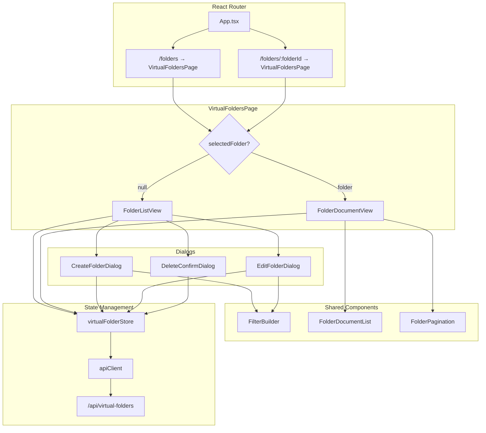
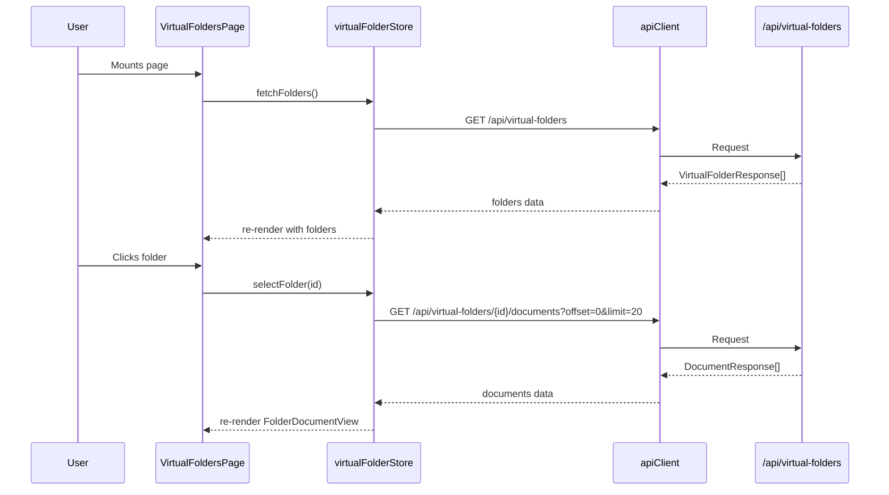

# Design Document: Virtual Folders Frontend

## Overview

This design describes the frontend implementation for connecting the existing static Virtual Folders page to the live FastAPI backend at `/api/virtual-folders`. The feature replaces hardcoded folder data with real API calls, implements full CRUD (create, edit, delete), provides a tag-based filter builder UI, and enables browsing documents within a selected folder with pagination.

The backend is already complete. This is a frontend-only effort that introduces:
- A new Zustand store (`virtualFolderStore`) for state management
- CRUD dialog components (create, edit, delete confirmation)
- A `FilterBuilder` component for visual tag_filter construction
- A `FolderDocumentView` for browsing documents within a folder
- Route-based navigation between folder list and folder detail views
- Extension of `apiClient` to support the `X-Change-Reason` header on mutating JSON requests

### Key Design Decisions

1. **Component-state navigation with route params**: The `VirtualFoldersPage` uses React Router with a `/folders/:folderId` sub-route for deep-linking. It reads `folderId` from `useParams()` and renders the folder list vs. document view accordingly — matching the existing `DocumentsPage` pattern of toggling views via component state.

2. **apiClient extension for X-Change-Reason**: Rather than modifying the existing `post`/`put`/`delete` signatures (which would break existing callers), we extend the `ApiClientOptions` interface with an optional `changeReason` field. The `buildHeaders` function adds `X-Change-Reason` when this field is provided on non-GET requests. This is backward-compatible.

3. **Portal-based dialogs**: Following the existing `UploadDialog` pattern — dialogs use `createPortal` to render at the document body level with focus trapping and escape-key handling.

4. **fast-check for property-based testing**: The project already has `fast-check` as a dev dependency, so property tests will use it with Vitest.

## Architecture



### Data Flow



## Components and Interfaces

### API Client Extension

```typescript
// Extended ApiClientOptions in src/frontend/src/lib/apiClient.ts
export interface ApiClientOptions {
  skipAuth?: boolean;
  changeReason?: string; // NEW: populates X-Change-Reason header
}
```

The `buildHeaders` function is updated to include `X-Change-Reason` when `options.changeReason` is provided and the method is not GET:

```typescript
function buildHeaders(method: string, options?: ApiClientOptions): Record<string, string> {
  const headers: Record<string, string> = {};
  // ... existing auth + tenant logic ...

  // Attach change reason for audit compliance on mutating requests
  if (options?.changeReason && method !== 'GET') {
    headers['X-Change-Reason'] = options.changeReason;
  }

  return headers;
}
```

This is backward-compatible — existing callers that don't pass `changeReason` are unaffected.

### TypeScript Types

```typescript
// src/frontend/src/types/virtualFolder.ts

export interface VirtualFolderResponse {
  id: number;
  name: string;
  tag_filter: TagFilter;
  sort_order: string;
  is_system_default: boolean;
  created_by: number;
  created_at: string | null;
}

export interface TagFilter {
  tags?: string[];
  status?: string;
}

export interface VirtualFolderCreate {
  name: string;
  tag_filter: TagFilter;
  sort_order: string;
}

export interface VirtualFolderUpdate {
  name?: string;
  tag_filter?: TagFilter;
  sort_order?: string;
}
```

### Virtual Folder Store

```typescript
// src/frontend/src/stores/virtualFolderStore.ts

export interface VirtualFolderState {
  // Data
  folders: VirtualFolderResponse[];
  selectedFolder: VirtualFolderResponse | null;
  selectedFolderDocuments: DocumentResponse[];

  // Pagination
  documentsOffset: number;
  documentsLimit: number;

  // UI state
  isFoldersLoading: boolean;
  foldersError: string | null;
  isDocumentsLoading: boolean;
  documentsError: string | null;

  // Cache
  lastFetchedAt: number | null;

  // Actions
  fetchFolders: () => Promise<void>;
  createFolder: (name: string, tag_filter: TagFilter, sort_order: string) => Promise<void>;
  updateFolder: (id: number, updates: VirtualFolderUpdate) => Promise<void>;
  deleteFolder: (id: number, changeReason: string) => Promise<void>;
  fetchFolderDocuments: (folderId: number) => Promise<void>;
  selectFolder: (folder: VirtualFolderResponse | null) => void;
  nextDocumentsPage: () => void;
  prevDocumentsPage: () => void;
}
```

**Store action details:**

- `fetchFolders`: Sets `isFoldersLoading=true`, `foldersError=null`, calls `GET /api/virtual-folders`, updates `folders` and `lastFetchedAt`. Uses `AbortController` with 15s timeout.
- `createFolder`: Calls `POST /api/virtual-folders` with `{ changeReason: "Created virtual folder: {name}" }` in options. On success, calls `fetchFolders`.
- `updateFolder`: Calls `PUT /api/virtual-folders/{id}` with only changed fields. Uses `{ changeReason: "Updated virtual folder: {name}" }`. On success, calls `fetchFolders`.
- `deleteFolder`: Calls `DELETE /api/virtual-folders/{id}` with `{ changeReason: userProvidedReason }`. On success, removes from local state, calls `fetchFolders`, clears `selectedFolder` if it was the deleted folder.
- `fetchFolderDocuments`: Sets `isDocumentsLoading=true`, calls `GET /api/virtual-folders/{id}/documents?offset={N}&limit={M}`, updates `selectedFolderDocuments`.
- `selectFolder`: Sets `selectedFolder`, resets `documentsOffset=0`, triggers `fetchFolderDocuments` if folder is non-null.
- `nextDocumentsPage`: Sets `documentsOffset += documentsLimit`, triggers `fetchFolderDocuments`.
- `prevDocumentsPage`: Sets `documentsOffset = max(0, documentsOffset - documentsLimit)`, triggers `fetchFolderDocuments`.

### Component Tree

| Component | Responsibility |
|-----------|---------------|
| `VirtualFoldersPage` | Top-level page; reads route params; toggles between list/detail view |
| `FolderListView` | Renders folder list, header, create button; handles empty/error/loading states |
| `FolderListItem` | Single folder row with name, filter summary, badge, action menu |
| `FolderDocumentView` | Renders documents for selected folder with heading, back nav, pagination |
| `FolderDocumentRow` | Single document row within folder view |
| `FolderPagination` | Prev/next controls for folder documents |
| `CreateFolderDialog` | Modal for creating a new folder (name + FilterBuilder + sort order) |
| `EditFolderDialog` | Modal for editing a folder (pre-populated name + FilterBuilder + sort order) |
| `DeleteConfirmDialog` | Confirmation modal with change reason text input |
| `FilterBuilder` | Tag multi-select + status dropdown + JSON preview |

### FilterBuilder Component

```typescript
interface FilterBuilderProps {
  value: TagFilter;
  onChange: (filter: TagFilter) => void;
}
```

The FilterBuilder:
- Renders a multi-select for tags (checkbox list with known tags: SOP, Protocol, Report, General, Policy, Form)
- Renders a dropdown for status (Draft, Active, Approved, InTraining, Retired)
- Displays a live JSON preview of the resulting `TagFilter`
- Calls `onChange` whenever selection changes
- Available tags are derived from the known document types used in the system

### Folder Display Text Derivation

A pure utility function converts `tag_filter` to a human-readable summary:

```typescript
// src/frontend/src/lib/virtualFolderUtils.ts

export function formatTagFilter(filter: TagFilter): string {
  const parts: string[] = [];
  if (filter.tags && filter.tags.length > 0) {
    parts.push(filter.tags.join(", "));
  }
  if (filter.status) {
    parts.push(filter.status);
  }
  return parts.join(" · ") || "No filter";
}
```

### Folder Name Validation

```typescript
export function validateFolderName(name: string): { valid: boolean; error?: string } {
  const trimmed = name.trim();
  if (trimmed.length === 0) {
    return { valid: false, error: "Folder name is required." };
  }
  if (trimmed.length > 200) {
    return { valid: false, error: "Folder name must not exceed 200 characters." };
  }
  return { valid: true };
}
```

### Update Diff Calculation

A pure utility function computes the minimal update payload:

```typescript
export function computeFolderDiff(
  original: VirtualFolderResponse,
  edited: { name: string; tag_filter: TagFilter; sort_order: string }
): VirtualFolderUpdate {
  const diff: VirtualFolderUpdate = {};
  if (edited.name !== original.name) diff.name = edited.name;
  if (JSON.stringify(edited.tag_filter) !== JSON.stringify(original.tag_filter)) {
    diff.tag_filter = edited.tag_filter;
  }
  if (edited.sort_order !== original.sort_order) diff.sort_order = edited.sort_order;
  return diff;
}
```

### Filter Builder Logic

```typescript
export function buildTagFilter(
  selectedTags: string[],
  selectedStatus: string | null
): TagFilter {
  const filter: TagFilter = {};
  if (selectedTags.length > 0) {
    filter.tags = selectedTags;
  }
  if (selectedStatus) {
    filter.status = selectedStatus;
  }
  return filter;
}
```

## Data Models

### Frontend State Shape

```typescript
// virtualFolderStore initial state
{
  folders: [],
  selectedFolder: null,
  selectedFolderDocuments: [],
  documentsOffset: 0,
  documentsLimit: 20,
  isFoldersLoading: false,
  foldersError: null,
  isDocumentsLoading: false,
  documentsError: null,
  lastFetchedAt: null,
}
```

### API Request/Response Mapping

| Operation | Method | URL | Request Body | Response | X-Change-Reason |
|-----------|--------|-----|-------------|----------|-----------------|
| List folders | GET | `/api/virtual-folders` | — | `VirtualFolderResponse[]` | No |
| Get folder | GET | `/api/virtual-folders/{id}` | — | `VirtualFolderResponse` | No |
| Create folder | POST | `/api/virtual-folders` | `{ name, tag_filter, sort_order }` | `VirtualFolderResponse` (201) | Yes: "Created virtual folder: {name}" |
| Update folder | PUT | `/api/virtual-folders/{id}` | `{ name?, tag_filter?, sort_order? }` | `VirtualFolderResponse` | Yes: "Updated virtual folder: {name}" |
| Delete folder | DELETE | `/api/virtual-folders/{id}` | — | 204 No Content | Yes: user-provided reason |
| List folder docs | GET | `/api/virtual-folders/{id}/documents?offset=N&limit=M` | — | `DocumentResponse[]` | No |

### Route Configuration

```
/folders              → VirtualFoldersPage (list view)
/folders/:folderId    → VirtualFoldersPage (document view for folder)
```

The page reads `folderId` from `useParams()`. If present and valid, it loads the folder document view. If absent, it shows the folder list.

**App.tsx route update:**
```tsx
<Route path="folders" element={<VirtualFoldersPage />} />
<Route path="folders/:folderId" element={<VirtualFoldersPage />} />
```

## Correctness Properties

*A property is a characteristic or behavior that should hold true across all valid executions of a system — essentially, a formal statement about what the system should do. Properties serve as the bridge between human-readable specifications and machine-verifiable correctness guarantees.*

### Property 1: Tag filter display text derivation

*For any* valid `TagFilter` object, the `formatTagFilter` function SHALL produce a string that contains every tag name from `tag_filter.tags` (if present and non-empty) and the status value from `tag_filter.status` (if present), and SHALL return "No filter" only when both fields are absent or empty.

**Validates: Requirements 1.3**

### Property 2: Folder name validation rejects whitespace-only input

*For any* string composed entirely of whitespace characters (spaces, tabs, newlines), the folder name validation logic SHALL reject it. *For any* string of 1–200 characters that contains at least one non-whitespace character, the validation logic SHALL accept it.

**Validates: Requirements 2.2, 3.2**

### Property 3: Update payload contains only changed fields

*For any* original `VirtualFolderResponse` and any set of edited values (name, tag_filter, sort_order), the `computeFolderDiff` function SHALL produce an update object containing only the fields whose values differ from the original, and SHALL produce an empty object when no values have changed.

**Validates: Requirements 3.5**

### Property 4: System default folder protection in rendering

*For any* `VirtualFolderResponse` where `is_system_default` is true, the rendered folder list item SHALL display a "System" badge AND SHALL NOT render edit or delete action controls.

**Validates: Requirements 4.8, 5.1, 5.2, 5.3**

### Property 5: Document row renders all required fields

*For any* valid `DocumentResponse` object, the rendered document row in the Folder_Document_View SHALL display the document's title, document_type, current_status, tag names, and created_at timestamp.

**Validates: Requirements 6.3**

### Property 6: Pagination offset calculation

*For any* non-negative integer `offset` and positive integer `limit`, calling `nextDocumentsPage` SHALL produce `offset + limit`, and calling `prevDocumentsPage` SHALL produce `max(0, offset - limit)`.

**Validates: Requirements 7.2, 7.3**

### Property 7: Filter builder produces correct TagFilter structure

*For any* combination of selected tags (0–20 strings) and optional status value (one of "Draft", "Active", "Approved", "InTraining", "Retired", or none), the `buildTagFilter` function SHALL produce a `TagFilter` where: if tags are non-empty, `tags` contains exactly those strings; if status is non-null, `status` equals that value; if both are present, both fields exist; if neither is present, the result is an empty object `{}`.

**Validates: Requirements 8.3, 8.4, 8.5, 8.6, 8.9**

### Property 8: Mutating store actions refresh folder list on success

*For any* successful execution of `createFolder`, `updateFolder`, or `deleteFolder`, the store SHALL call `fetchFolders` to refresh the folder list afterward.

**Validates: Requirements 9.5**

### Property 9: Failed store actions set error and clear loading

*For any* store action (`fetchFolders`, `createFolder`, `updateFolder`, `deleteFolder`, `fetchFolderDocuments`) that encounters an API error, the store SHALL set the corresponding error property to a non-empty string and set the corresponding loading property to false.

**Validates: Requirements 9.6**

## Error Handling

### API Error Classification

| HTTP Status | Context | User-Facing Behavior |
|-------------|---------|---------------------|
| 400 (duplicate name) | Create/Edit | Inline validation: "A folder with this name already exists" |
| 400 (system default) | Delete/Edit | Inline error: "System default folders cannot be modified" |
| 404 | Delete/View | "Folder not found" + refresh list |
| 401 | Any | Handled by apiClient (token refresh → retry → session clear) |
| 5xx / Network | Any | Generic error: "Something went wrong. Please try again." |
| Timeout (15s) | Fetch folders | AbortController timeout → same as network error |

### Error Detection Strategy

The backend returns error details in the response body. The store parses the error body to distinguish between error types:

```typescript
// In catch block of store actions
if (error instanceof ApiError) {
  if (error.status === 400 && error.body.includes("already exists")) {
    // Duplicate name error — throw to let dialog handle it
    throw { type: "DUPLICATE_NAME", message: "A folder with this name already exists." };
  }
  if (error.status === 400 && error.body.includes("system default")) {
    throw { type: "SYSTEM_DEFAULT", message: "System default folders cannot be modified." };
  }
  if (error.status === 404) {
    // Folder not found — refresh list
    await get().fetchFolders();
    throw { type: "NOT_FOUND", message: "Folder not found." };
  }
}
// Generic error
set({ foldersError: "Something went wrong. Please try again.", isFoldersLoading: false });
```

### Error State Management

- **Store-level errors** (`foldersError`, `documentsError`): For list/fetch failures shown on the page
- **Dialog-level errors**: Managed in component state within each dialog to avoid polluting global state
- Errors are cleared when the user retries or when a new request starts

### Timeout Implementation

```typescript
const controller = new AbortController();
const timeoutId = setTimeout(() => controller.abort(), 15_000);
try {
  const response = await apiClient.get<VirtualFolderResponse[]>(
    '/api/virtual-folders',
    { signal: controller.signal }
  );
  // ...
} finally {
  clearTimeout(timeoutId);
}
```

The store's `fetchFolders` action uses an `AbortController` with a 15-second timeout. On abort, it sets `foldersError` to a timeout message. Note: this requires passing `signal` through apiClient, which can be added to `ApiClientOptions`.

## Testing Strategy

### Unit Tests (Vitest + Testing Library)

Focus on specific examples and edge cases:
- Component rendering in various states (loading, error, empty, populated)
- Dialog open/close behavior
- Form validation edge cases (boundary lengths: 0, 1, 200, 201 characters)
- API error handling (400 duplicate, 400 system default, 404, 500)
- Navigation between list and detail views
- Cache staleness logic (300-second threshold)
- Timeout behavior (15-second abort)

### Property-Based Tests (fast-check + Vitest)

Each property test runs a minimum of 100 iterations and references its design property.

| Property | Test Target | Generator Strategy |
|----------|-------------|-------------------|
| Property 1 | `formatTagFilter` | Random `TagFilter` objects with 0–20 tags and optional status |
| Property 2 | `validateFolderName` | Random whitespace strings (reject) + random valid strings (accept) |
| Property 3 | `computeFolderDiff` | Random original folder + random edits |
| Property 4 | `FolderListItem` render | Random system-default `VirtualFolderResponse` objects |
| Property 5 | `FolderDocumentRow` render | Random `DocumentResponse` objects |
| Property 6 | `nextDocumentsPage` / `prevDocumentsPage` | Random offset (0–1000) and limit (1–100) |
| Property 7 | `buildTagFilter` | Random tag arrays (0–20) + optional status from valid set |
| Property 8 | Store mutating actions | Mock API success for each action, verify fetchFolders called |
| Property 9 | Store actions with failures | Mock API errors for each action, verify error/loading state |

### Test Configuration

```typescript
// Property test tag format:
// Feature: virtual-folders-frontend, Property {N}: {property_text}

import * as fc from "fast-check";
import { describe, it, expect } from "vitest";

describe("virtual-folders-frontend properties", () => {
  it("Feature: virtual-folders-frontend, Property 1: Tag filter display text derivation", () => {
    fc.assert(
      fc.property(
        fc.record({
          tags: fc.option(fc.array(fc.string({ minLength: 1, maxLength: 50 }), { maxLength: 20 }), { nil: undefined }),
          status: fc.option(fc.constantFrom("Draft", "Active", "Approved", "InTraining", "Retired"), { nil: undefined }),
        }),
        (filter) => {
          const result = formatTagFilter(filter);
          if (filter.tags?.length && filter.status) {
            expect(result).toContain(filter.status);
            for (const tag of filter.tags) {
              expect(result).toContain(tag);
            }
          } else if (!filter.tags?.length && !filter.status) {
            expect(result).toBe("No filter");
          }
        }
      ),
      { numRuns: 100 }
    );
  });
});
```

### Integration Tests

- Full page render with mocked API responses
- Navigation flow: list → folder detail → back
- CRUD flow: create → appears in list → edit → delete → removed from list
- Verify `X-Change-Reason` header is sent on POST, PUT, DELETE requests to `/api/virtual-folders`
