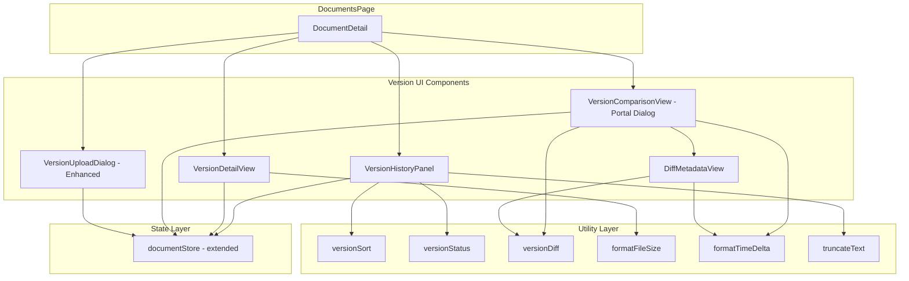
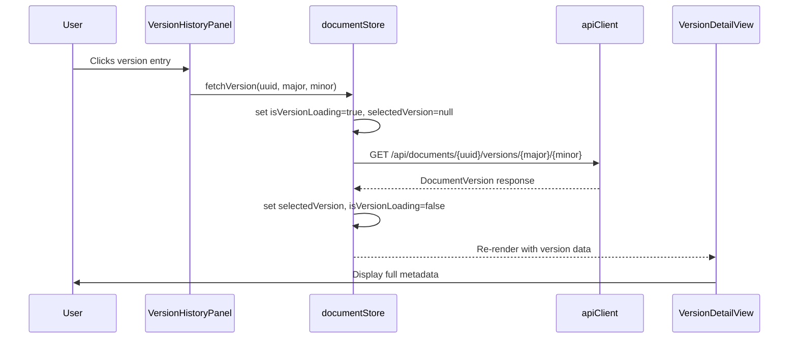

# Design Document: Document Versioning UI

## Overview

This design covers the frontend implementation of an enhanced document versioning interface for AlcoaBase. The feature transforms the existing minimal version history list into a rich, interactive versioning experience with dedicated panels for version timeline display, individual version detail inspection, metadata diff comparison, side-by-side version comparison, file download, and enhanced upload validation.

The backend API is already complete. This design focuses exclusively on React component architecture, Zustand state management extensions, data flow patterns, and accessibility within the existing tech stack (React 19, TypeScript, Zustand v5, Tailwind CSS v4, shadcn/ui pattern).

### Design Decisions

1. **Enhance existing components in-place** rather than creating a parallel component tree. The `DocumentDetail` component remains the entry point; new panels render within it.
2. **Extend the existing `documentStore`** with version-specific state slices rather than creating a separate store, keeping all document-related state co-located.
3. **Use portal-based dialogs** for the comparison view (consistent with existing `VersionUploadDialog` pattern) while rendering the version history panel and detail view inline.
4. **Pure utility functions** for version sorting, status determination, metadata diffing, and file size formatting — enabling property-based testing without DOM dependencies.
5. **No new dependencies** — all UI is built with existing Tailwind + Lucide icons + Radix patterns.
6. **Download via storage_key** — The backend GET `/api/documents/{uuid}/versions/{major}/{minor}` returns version metadata including `storage_key`. Download is implemented by fetching the file blob from a storage URL derived from the storage key, using the existing `apiClient` auth headers.

### Backend API Endpoints Used

| Endpoint | Method | Purpose |
|----------|--------|---------|
| `/api/documents/{uuid}` | GET | Fetch document with all versions |
| `/api/documents/{uuid}/versions/{major}/{minor}` | GET | Fetch specific version metadata |
| `/api/documents/{uuid}/versions` | POST | Create new version (multipart, requires X-Change-Reason) |

## Architecture



### Component Hierarchy

```
DocumentDetail
├── Document Metadata (existing)
├── VersionHistoryPanel (replaces inline version list)
│   ├── Version Timeline Entries
│   │   ├── VersionStatusBadge
│   │   └── Download Button
│   ├── Empty State
│   └── "Compare Versions" Button
├── VersionDetailView (shown when a version is selected)
│   ├── Full Metadata Display
│   ├── Copy Hash Button
│   └── Download Button
├── VersionComparisonView (portal dialog)
│   ├── Version Selector Dropdowns (left/right)
│   ├── Side-by-Side Metadata Grid
│   └── DiffMetadataView (highlights + summary)
└── VersionUploadDialog (enhanced, existing portal pattern)
```

## Components and Interfaces

### VersionHistoryPanel

Replaces the existing inline version list in `DocumentDetail`. Renders a vertical timeline with rich metadata per entry.

```typescript
interface VersionHistoryPanelProps {
  versions: DocumentVersion[];
  documentTitle: string;
  onSelectVersion: (version: DocumentVersion) => void;
  onDownload: (version: DocumentVersion) => void;
  onCompare: () => void;
}
```

**Responsibilities:**
- Sort versions descending by (major, minor)
- Render timeline with visual connectors (left border + dot indicators)
- Display version number, locale-formatted date, uploader ID, truncated change reason (120 chars), truncated file hash (12 chars)
- Show `VersionStatusBadge` for each entry
- Show download button per entry
- Disable "Compare Versions" button when fewer than 2 versions exist
- Show empty state when no versions

### VersionStatusBadge

A small presentational component for the "Current" / "Previous" badge.

```typescript
interface VersionStatusBadgeProps {
  isCurrent: boolean;
}
```

**Rendering:**
- "Current" badge: `bg-primary/15 text-primary` with `aria-label="Current version"`
- "Previous" badge: `bg-muted text-muted-foreground` with `aria-label="Previous version"`

### VersionDetailView

Displays full metadata for a single selected version. Renders inline below the history panel (not a dialog).

```typescript
interface VersionDetailViewProps {
  version: DocumentVersion | null;
  isLoading: boolean;
  error: string | null;
  onRetry: () => void;
  onDownload: (version: DocumentVersion) => void;
  onClose: () => void;
}
```

**Responsibilities:**
- Display all fields: version number, storage key, full file hash (monospace), uploaded by, uploaded at (locale format), change reason
- Copy-to-clipboard button for file hash with 3-second confirmation
- Download button
- Loading state with spinner
- Error state with retry button
- "No reason provided" placeholder for null change_reason

### VersionComparisonView

Portal-based dialog for side-by-side version comparison. Follows the same portal + focus trap pattern as `VersionUploadDialog`.

```typescript
interface VersionComparisonViewProps {
  open: boolean;
  onOpenChange: (open: boolean) => void;
  versions: DocumentVersion[];
}
```

**Responsibilities:**
- Two dropdown selectors for left/right version
- Default to two most recent versions (second-most-recent on left, most-recent on right)
- Side-by-side metadata grid with row alignment
- Highlight differing fields with distinct background color
- Show notice when same version selected on both sides
- Embed `DiffMetadataView` for summary information

### DiffMetadataView

Presentational component showing computed differences between two versions.

```typescript
interface DiffMetadataViewProps {
  left: DocumentVersion;
  right: DocumentVersion;
}
```

**Responsibilities:**
- Show whether file hash changed (with "file content unchanged" notice if identical)
- Show time elapsed between uploads (days, hours, minutes)
- Show whether uploader changed
- Highlight changed fields with `bg-amber-50 dark:bg-amber-950/20` background

### Enhanced VersionUploadDialog

Extends the existing `VersionUploadDialog` with additional validation:

```typescript
// Same interface as existing — no prop changes needed
// Internal enhancements:
// - File size validation: > 0 bytes AND ≤ 500 MB (524,288,000 bytes)
// - Change reason validation: trimmed length 1–2000 chars
// - Display file name + formatted size (KB < 1MB, MB ≥ 1MB with 1 decimal)
// - Version type required validation with error message
```

## Data Models

### Store Extensions

```typescript
// Added to DocumentState interface in documentStore.ts
interface VersionSlice {
  // Version detail
  selectedVersion: DocumentVersion | null;
  isVersionLoading: boolean;
  versionError: string | null;

  // Download
  downloadingVersionId: number | null;

  // Comparison
  comparisonOpen: boolean;

  // Actions
  fetchVersion: (uuid: string, major: number, minor: number) => Promise<void>;
  selectVersionFromCache: (version: DocumentVersion) => void;
  clearSelectedVersion: () => void;
  downloadVersion: (
    documentUuid: string,
    version: DocumentVersion,
    documentTitle: string
  ) => Promise<void>;
  setComparisonOpen: (open: boolean) => void;
}
```

**`fetchVersion` action flow:**
1. Set `isVersionLoading: true`, `versionError: null`, `selectedVersion: null`
2. Call `apiClient.get<DocumentVersion>(`/api/documents/${uuid}/versions/${major}/${minor}`)`
3. On success: set `selectedVersion` to response, `isVersionLoading: false`
4. On 404: set `versionError: "Version not found"`, `selectedVersion: null`, `isVersionLoading: false`
5. On other error: set `versionError` from error message, `selectedVersion: null`, `isVersionLoading: false`

**`downloadVersion` action flow:**
1. Set `downloadingVersionId` to `version.id`
2. Create `AbortController` with 30-second timeout
3. Fetch file blob from `/api/documents/${uuid}/versions/${major}/${minor}/download` with auth headers
4. Create object URL from blob
5. Create temporary anchor element with `download` attribute set to `"{title}_v{major}.{minor}"`
6. Trigger click, revoke object URL
7. Clear `downloadingVersionId`
8. On error/timeout: show error notification, clear `downloadingVersionId`

### Utility Function Signatures

```typescript
// src/frontend/src/lib/versionUtils.ts

/** Sort versions descending by (major, minor) */
export function sortVersionsDescending(versions: DocumentVersion[]): DocumentVersion[];

/** Determine if a version is the current (latest) one */
export function isCurrentVersion(
  version: DocumentVersion,
  allVersions: DocumentVersion[]
): boolean;

/** Truncate text to maxLength, appending ellipsis if truncated */
export function truncateText(text: string, maxLength: number): string;

/** Format file size: KB for < 1MB, MB with 1 decimal for >= 1MB */
export function formatFileSize(bytes: number): string;

/** Compute absolute time delta between two ISO date strings */
export interface TimeDelta {
  days: number;
  hours: number;
  minutes: number;
}
export function computeTimeDelta(dateA: string, dateB: string): TimeDelta;

/** Format time delta as human-readable string e.g. "3 days, 2 hours, 15 minutes" */
export function formatTimeDelta(delta: TimeDelta): string;

/** Compare two versions and return diff metadata */
export interface VersionDiff {
  hashChanged: boolean;
  uploaderChanged: boolean;
  changeReasonChanged: boolean;
  timeDelta: TimeDelta;
}
export function computeVersionDiff(
  left: DocumentVersion,
  right: DocumentVersion
): VersionDiff;

/** Validate upload file: size > 0 and <= 500MB */
export function validateFileSize(file: File): { valid: boolean; error?: string };

/** Validate change reason: trimmed length 1-2000 */
export function validateChangeReason(reason: string): { valid: boolean; error?: string };
```

### Data Flow Diagram



## Correctness Properties

*A property is a characteristic or behavior that should hold true across all valid executions of a system — essentially, a formal statement about what the system should do. Properties serve as the bridge between human-readable specifications and machine-verifiable correctness guarantees.*

### Property 1: Version sorting is stable descending

*For any* array of `DocumentVersion` objects with distinct (major, minor) tuples, `sortVersionsDescending` SHALL return them ordered such that for every adjacent pair (versions[i], versions[i+1]), versions[i] has a strictly greater (major, minor) tuple than versions[i+1].

**Validates: Requirements 1.1**

### Property 2: Current version identification is unique and maximal

*For any* non-empty array of `DocumentVersion` objects with distinct (major, minor) tuples, exactly one version SHALL be identified as "current" by `isCurrentVersion`, and that version SHALL have the maximum (major, minor) tuple when compared lexicographically (major first, then minor).

**Validates: Requirements 2.1, 2.2**

### Property 3: Text truncation preserves content within limit

*For any* string `text` and positive integer `maxLength`, `truncateText(text, maxLength)` SHALL return a string whose length is at most `maxLength + 1` (accounting for the ellipsis character), AND if `text.length <= maxLength` the output SHALL equal the input exactly, AND if `text.length > maxLength` the output SHALL end with "…" and the non-ellipsis prefix SHALL be a prefix of the original text.

**Validates: Requirements 1.2, 1.3**

### Property 4: File size formatting is consistent with threshold

*For any* non-negative integer `bytes`, `formatFileSize(bytes)` SHALL return a string containing "KB" when `bytes < 1_048_576` (1 MB), and a string containing "MB" when `bytes >= 1_048_576`. The numeric value SHALL be mathematically correct (bytes/1024 for KB, bytes/1048576 with 1 decimal for MB).

**Validates: Requirements 7.3**

### Property 5: Time delta computation is non-negative and reversible

*For any* two valid ISO date strings `dateA` and `dateB`, `computeTimeDelta(dateA, dateB)` SHALL return a `TimeDelta` where all fields (days, hours, minutes) are non-negative integers, AND the total minutes represented SHALL equal the absolute difference in minutes between the two timestamps (within 1 minute tolerance due to flooring).

**Validates: Requirements 4.2**

### Property 6: Version diff detects all field changes correctly

*For any* two `DocumentVersion` objects `left` and `right`, `computeVersionDiff(left, right).hashChanged` SHALL equal `(left.file_hash !== right.file_hash)`, `uploaderChanged` SHALL equal `(left.uploaded_by !== right.uploaded_by)`, and `changeReasonChanged` SHALL equal `(left.change_reason !== right.change_reason)`.

**Validates: Requirements 4.1, 4.3, 4.4**

### Property 7: File validation rejects invalid sizes

*For any* file with `size <= 0` OR `size > 524_288_000`, `validateFileSize` SHALL return `{ valid: false }` with an error message. *For any* file with `0 < size <= 524_288_000`, `validateFileSize` SHALL return `{ valid: true }`.

**Validates: Requirements 7.1**

### Property 8: Change reason validation enforces length bounds

*For any* string `reason`, `validateChangeReason(reason)` SHALL return `{ valid: true }` if and only if `reason.trim().length >= 1 AND reason.trim().length <= 2000`. Otherwise it SHALL return `{ valid: false }` with an error message.

**Validates: Requirements 7.2**

## Error Handling

| Scenario | Handling |
|----------|----------|
| `fetchVersion` returns 404 | Show "Version not found" in VersionDetailView with retry button |
| `fetchVersion` network error | Show error message from response in VersionDetailView with retry button |
| Download fails (non-2xx) | Show error notification toast, re-enable download button |
| Download timeout (30s) | Abort request, show timeout notification, re-enable download button |
| Upload validation failure | Show inline field errors, keep dialog open |
| Upload API failure | Show API error message in dialog, keep dialog open for correction |
| Copy-to-clipboard fails | Gracefully degrade — no confirmation shown, no crash |

### Error State Management

The store maintains `versionError: string | null` which is:
- Cleared at the start of every `fetchVersion` call
- Set on API failure with a descriptive message
- Displayed by `VersionDetailView` with a retry action
- Independent from the main `error` field (which covers document-level errors)

## Testing Strategy

### Property-Based Tests (fast-check)

The project already has `fast-check` v4.7.0 installed. All pure utility functions in `src/frontend/src/lib/versionUtils.ts` are tested with property-based tests.

**Configuration:**
- Minimum 100 iterations per property test
- Each test tagged with: `Feature: document-versioning-ui, Property {N}: {title}`
- Test file: `src/frontend/src/lib/versionUtils.test.ts`

**Properties to implement:**
1. Version sorting (Property 1)
2. Current version identification (Property 2)
3. Text truncation (Property 3)
4. File size formatting (Property 4)
5. Time delta computation (Property 5)
6. Version diff correctness (Property 6)
7. File validation (Property 7)
8. Change reason validation (Property 8)

### Unit Tests (Vitest + Testing Library)

- **Component rendering**: Verify VersionHistoryPanel renders correct number of entries, empty state, disabled compare button
- **VersionStatusBadge**: Verify correct label and aria attributes
- **VersionDetailView**: Verify loading/error/success states, copy button behavior
- **VersionComparisonView**: Verify default selection, same-version notice, field highlighting
- **Store actions**: Mock `apiClient` and verify state transitions for `fetchVersion`, `downloadVersion`

### Integration Tests

- **Full flow**: Select document → view history → click version → see detail → download
- **Upload flow**: Open dialog → fill form → submit → verify history refreshes
- **Comparison flow**: Open comparison → change selectors → verify diff highlights

### Accessibility Testing

- Keyboard navigation through version timeline entries
- Screen reader announcements for status badges
- Focus management in comparison dialog (trap + restore)
- ARIA labels on all interactive elements
