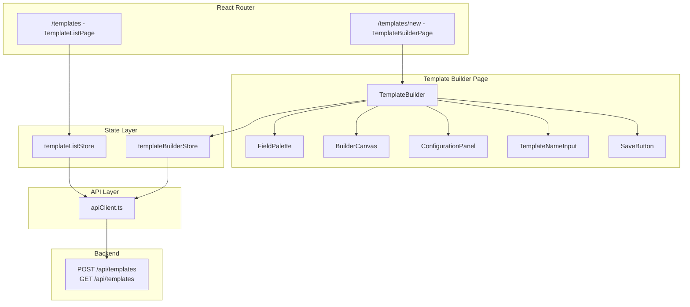
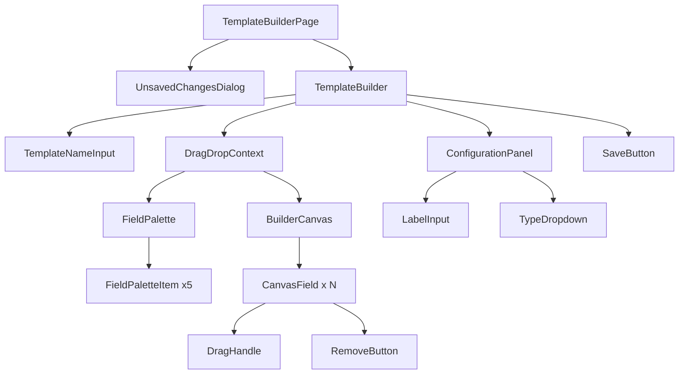

# Design Document: Template Builder Frontend

## Overview

The Template Builder Frontend is a React-based visual form builder that enables template authors to compose JSON-driven template schemas through a drag-and-drop interface. The feature integrates with the existing ALC frontend architecture (React 19, Zustand, Vite, Tailwind CSS) and communicates with the FastAPI backend via `POST /api/templates` and `GET /api/templates`.

The builder uses a three-panel layout pattern:
- **Field Palette** (left): Draggable field type items (Text, Float, Integer, Date, Boolean)
- **Builder Canvas** (center): Drop zone where fields are arranged via @hello-pangea/dnd
- **Configuration Panel** (right): Property editor for the selected field

Key design decisions:
- **@hello-pangea/dnd** for drag-and-drop (already in package.json, provides keyboard accessibility out of the box)
- **Zustand** for state management (consistent with existing stores: authStore, documentStore)
- **Existing apiClient.ts** for API calls (handles auth, tenant headers, token refresh)
- **Two-route approach**: Template list view (`/templates`) and builder view (`/templates/new`)

## Architecture



### Routing

The existing `App.tsx` has a single `/templates` route pointing to `TemplatesPage`. The design introduces a nested route structure:

| Route | Component | Purpose |
|-------|-----------|---------|
| `/templates` | `TemplateListPage` | List existing templates |
| `/templates/new` | `TemplateBuilderPage` | Create a new template |

### State Architecture

Two separate Zustand stores handle distinct concerns:

1. **`templateBuilderStore`** — Manages the builder canvas state (fields, selection, dirty tracking, serialization, save)
2. **`templateListStore`** — Manages the template list fetching and display (replaces the current placeholder `templateStore.ts`)

This separation keeps the builder's complex state isolated from the simpler list-fetching logic.

## Components and Interfaces

### Component Hierarchy



### Component Specifications

#### `TemplateBuilderPage`
- **Path**: `src/frontend/src/pages/TemplateBuilderPage.tsx`
- **Responsibility**: Route-level component. Wraps `TemplateBuilder` with navigation guards (unsaved changes dialog, beforeunload listener).
- **Props**: None (reads route params if needed)

#### `TemplateBuilder`
- **Path**: `src/frontend/src/components/templates/TemplateBuilder.tsx`
- **Responsibility**: Orchestrates the three-panel layout, wraps children in `DragDropContext`, handles `onDragEnd` callback.
- **Props**: None (connects to `templateBuilderStore`)

#### `FieldPalette`
- **Path**: `src/frontend/src/components/templates/FieldPalette.tsx`
- **Responsibility**: Renders 5 draggable field type items inside a `Droppable` (with `isDropDisabled={true}` to prevent drops back into palette).
- **Props**: None

#### `BuilderCanvas`
- **Path**: `src/frontend/src/components/templates/BuilderCanvas.tsx`
- **Responsibility**: `Droppable` zone that renders `CanvasField` items or an empty placeholder.
- **Props**: None (reads fields from store)

#### `CanvasField`
- **Path**: `src/frontend/src/components/templates/CanvasField.tsx`
- **Responsibility**: Single draggable field item with drag handle, label display, type badge, remove button, and selection highlight.
- **Props**: `field: CanvasFieldData`, `index: number`, `isSelected: boolean`

#### `ConfigurationPanel`
- **Path**: `src/frontend/src/components/templates/ConfigurationPanel.tsx`
- **Responsibility**: Displays label input and type dropdown for the selected field, or empty state message.
- **Props**: None (reads selectedField from store)

#### `TemplateNameInput`
- **Path**: `src/frontend/src/components/templates/TemplateNameInput.tsx`
- **Responsibility**: Controlled text input for template name with inline validation.
- **Props**: None (reads/writes templateName from store)

#### `SaveButton`
- **Path**: `src/frontend/src/components/templates/SaveButton.tsx`
- **Responsibility**: Save action with loading state, disabled logic, and validation gating.
- **Props**: None (reads isSaving, canSave from store)

#### `UnsavedChangesDialog`
- **Path**: `src/frontend/src/components/templates/UnsavedChangesDialog.tsx`
- **Responsibility**: Modal confirmation dialog for navigation away with unsaved changes.
- **Props**: `open: boolean`, `onConfirm: () => void`, `onCancel: () => void`

### TypeScript Interfaces

```typescript
// src/frontend/src/types/template.ts

/** Supported field types matching backend Literal type */
export type FieldType = "Text" | "Float" | "Integer" | "Date" | "Boolean";

/** Client-side canvas field representation */
export interface CanvasFieldData {
  id: string;              // Client-generated UUID v4 (temporary)
  label: string;           // User-editable label (1-200 chars)
  type: FieldType;         // Field data type
  fieldOrder: number;      // 0-based display order
}

/** Template creation payload sent to POST /api/templates */
export interface TemplateCreatePayload {
  name: string;
  json_schema: {
    fields: Array<{
      label: string;
      type: FieldType;
    }>;
  };
  user_id: number;
}

/** Backend template response (from GET /api/templates and POST /api/templates) */
export interface TemplateResponse {
  id: number;
  document_uuid: string;
  name: string;
  json_schema: Record<string, unknown>;
  status: string;
  created_by: number;
  fields: TemplateFieldResponse[];
}

/** Backend field response */
export interface TemplateFieldResponse {
  id: number;
  field_uuid: string;
  field_type: string;
  field_label: string;
  field_order: number;
}
```

## Data Models

### templateBuilderStore

```typescript
// src/frontend/src/stores/templateBuilderStore.ts

interface TemplateBuilderState {
  // Canvas state
  fields: CanvasFieldData[];
  templateName: string;
  selectedFieldId: string | null;

  // Save state
  isSaving: boolean;
  saveError: string | null;
  saveSuccess: boolean;
  savedTemplate: TemplateResponse | null;

  // Dirty tracking
  isDirty: boolean;

  // Validation
  nameError: string | null;
  fieldErrors: Record<string, string>; // keyed by field id

  // Computed (derived in selectors or inline)
  // canSave: name valid, fields.length > 0, no field errors, not saving

  // Actions
  addField: (type: FieldType, dropIndex: number) => void;
  removeField: (fieldId: string) => void;
  reorderField: (sourceIndex: number, destinationIndex: number) => void;
  selectField: (fieldId: string | null) => void;
  updateFieldLabel: (fieldId: string, label: string) => void;
  updateFieldType: (fieldId: string, type: FieldType) => void;
  setTemplateName: (name: string) => void;
  saveTemplate: () => Promise<void>;
  resetBuilder: () => void;
  markClean: () => void;
}
```

### templateListStore

```typescript
// src/frontend/src/stores/templateListStore.ts

interface TemplateListState {
  templates: TemplateResponse[];
  isLoading: boolean;
  error: string | null;

  fetchTemplates: () => Promise<void>;
}
```

### DnD Data Flow

The `onDragEnd` handler in `TemplateBuilder` distinguishes two operations:

1. **Palette → Canvas** (cross-droppable): Calls `addField(type, destinationIndex)`
2. **Canvas → Canvas** (same droppable): Calls `reorderField(sourceIndex, destinationIndex)`

The `draggableId` for palette items encodes the field type (e.g., `palette-Text`). The `draggableId` for canvas items uses the field's client-side UUID.

```typescript
function onDragEnd(result: DropResult) {
  const { source, destination } = result;
  if (!destination) return; // dropped outside

  if (source.droppableId === "field-palette" && destination.droppableId === "builder-canvas") {
    const fieldType = source.draggableId.replace("palette-", "") as FieldType;
    addField(fieldType, destination.index);
  } else if (source.droppableId === "builder-canvas" && destination.droppableId === "builder-canvas") {
    reorderField(source.index, destination.index);
  }
}
```

### API Integration

#### Create Template (POST /api/templates)

The backend router at `src/backend/src/alcoabase/api/templates.py` defines:
- **Endpoint**: `POST /api/templates` (router prefix `/templates` mounted under `/api`)
- **Request body**: `TemplateCreate` schema — `{ name: string, json_schema: { fields: [{ label, type }] }, user_id: int }`
- **Required header**: `X-Change-Reason` (enforced by AuditMiddleware)
- **Response**: `TemplateResponse` with status 201
- **Error**: 400 for validation errors (e.g., duplicate name, invalid schema)

```typescript
async saveTemplate() {
  const { fields, templateName } = get();
  const userId = useAuthStore.getState().user?.id ?? 1;

  const payload: TemplateCreatePayload = {
    name: templateName.trim(),
    json_schema: {
      fields: [...fields]
        .sort((a, b) => a.fieldOrder - b.fieldOrder)
        .map(f => ({ label: f.label, type: f.type })),
    },
    user_id: userId,
  };

  const response = await apiClient.post<TemplateResponse>(
    "/api/templates",
    payload,
    { changeReason: "Template created via builder" }
  );

  return response;
}
```

#### List Templates (GET /api/templates)

The backend router defines:
- **Endpoint**: `GET /api/templates`
- **Required headers**: `Authorization`, `X-User-Id`, `X-Company-Id` (handled automatically by apiClient)
- **Response**: `list[TemplateResponse]`

```typescript
async fetchTemplates() {
  const response = await apiClient.get<TemplateResponse[]>("/api/templates");
  set({ templates: response, isLoading: false });
}
```

### Serialization Logic

The serialization function transforms client-side `CanvasFieldData[]` into the backend-expected format:

| Client Field | Serialized | Included? |
|---|---|---|
| `id` (UUID v4) | — | ❌ Excluded |
| `label` | `fields[].label` | ✅ |
| `type` | `fields[].type` | ✅ |
| `fieldOrder` | — | ❌ Excluded (used only for sorting) |

The `field_order` is implicit in array position (sorted ascending before serialization).

### Validation Rules

| Field | Rule | Error Message |
|-------|------|---------------|
| Template Name | 1–500 chars, not whitespace-only | "Template name is required" / "Template name must not exceed 500 characters" |
| Field Label | 1–200 chars, not empty | "Label is required" / "Label must not exceed 200 characters" |
| Field Count | 1–50 fields | "At least one field is required" / "Maximum of 50 fields reached" |

## Correctness Properties

*A property is a characteristic or behavior that should hold true across all valid executions of a system — essentially, a formal statement about what the system should do. Properties serve as the bridge between human-readable specifications and machine-verifiable correctness guarantees.*

### Property 1: Field-order contiguous invariant

*For any* sequence of builder operations (add, remove, reorder) applied to any initial field list, the resulting `fieldOrder` values SHALL always form a contiguous zero-based sequence (0, 1, 2, ..., n-1) where n is the number of fields.

**Validates: Requirements 2.2, 3.1, 5.2**

### Property 2: Add field produces correct Canvas_Field

*For any* valid field type and any valid drop index (0 to current field count), adding a field SHALL produce a new `CanvasFieldData` with the correct type, a default label of `"{Type} Field"`, a UUID v4 format id, and a `fieldOrder` equal to the drop index.

**Validates: Requirements 2.1**

### Property 3: Reorder to same position is idempotent

*For any* field list and any field index, reordering a field from index `i` to index `i` SHALL leave all `fieldOrder` values and field identities unchanged.

**Validates: Requirements 3.5**

### Property 4: Selection preserved across reorder

*For any* field list with a selected field, after any valid reorder operation, the `selectedFieldId` SHALL remain equal to the previously selected field's id.

**Validates: Requirements 3.6**

### Property 5: Field property update propagation

*For any* canvas field and any valid label string (1–200 chars) or valid field type, calling `updateFieldLabel` or `updateFieldType` SHALL update that field's property in the store such that reading the field back returns the new value.

**Validates: Requirements 4.3, 4.4**

### Property 6: Field label validation

*For any* string, the label validation function SHALL return an error if the string is empty and SHALL return an error if the string length exceeds 200 characters, and SHALL return no error otherwise.

**Validates: Requirements 4.5**

### Property 7: Template name validation

*For any* string, the template name validation function SHALL return an error if the string is empty or contains only whitespace characters, SHALL return an error if the string length exceeds 500 characters, and SHALL return no error for all other strings.

**Validates: Requirements 6.2**

### Property 8: Remove field correctness

*For any* non-empty field list and any field id present in that list, removing that field SHALL decrease the list length by exactly 1 and the removed field's id SHALL not appear in the resulting list.

**Validates: Requirements 5.1**

### Property 9: Selection consistency on removal

*For any* field list with a selected field: (a) if the removed field is the selected field, then `selectedFieldId` SHALL be null after removal; (b) if the removed field is NOT the selected field, then `selectedFieldId` SHALL remain unchanged after removal.

**Validates: Requirements 5.3, 5.4**

### Property 10: Serialization correctness

*For any* valid canvas state (name with 1–500 non-whitespace chars, 1–50 fields each with 1–200 char labels and valid types), the `serializeTemplate` function SHALL produce a `TemplateCreatePayload` where: (a) `name` equals the trimmed template name, (b) `json_schema.fields` is ordered by ascending `fieldOrder`, (c) each entry contains only `label` and `type` (no `id`, `field_uuid`, or `field_order`), and (d) the array length equals the number of canvas fields.

**Validates: Requirements 7.1, 9.1, 9.2, 9.4**

### Property 11: Serialization round-trip preserves field data

*For any* valid canvas state with at least one field, serializing to `TemplateCreatePayload` and then mapping back to a field list SHALL preserve each field's label and type in the same order.

**Validates: Requirements 9.3**

### Property 12: Submission guard

*For any* canvas state where the field list is empty OR any field has an empty label OR the template name is empty/whitespace-only, the `canSave` computed value SHALL be `false`.

**Validates: Requirements 9.5**

### Property 13: Dirty state tracking

*For any* clean builder state, after any mutation (addField, removeField, reorderField, updateFieldLabel, updateFieldType, setTemplateName), the `isDirty` flag SHALL be `true`. After a successful save (markClean), the `isDirty` flag SHALL be `false`.

**Validates: Requirements 11.1, 11.6**

## Error Handling

### API Errors

| Scenario | HTTP Status | Frontend Behavior |
|----------|-------------|-------------------|
| Validation error (e.g., duplicate name) | 400 | Parse `detail` from response body, display inline error |
| Authentication expired | 401 | apiClient handles retry with token refresh; if refresh fails, redirect to login |
| Server error | 500 | Display generic "Save failed. Please try again." notification |
| Network failure | — | Display "Network error. Check your connection." notification |
| Timeout (list fetch) | — | After 30s, abort request and display timeout message |

### Client-Side Validation Errors

- Validation errors are displayed inline adjacent to the invalid input
- The Save button is disabled when `canSave` is false
- Validation runs on every input change (not just on submit)
- Field label validation prevents the store from accepting empty strings (preserves last valid value)

### Error State Recovery

- API errors on save: Re-enable the Save button, preserve all canvas state
- API errors on list fetch: Display error banner with retry option
- Session expiry during save: apiClient handles token refresh transparently; if session is truly expired, user is redirected to login

### Notification Pattern

Success and error notifications use a toast-style component that auto-dismisses after 5 seconds. The notification state is managed via `useState` in `TemplateBuilderPage` since notifications are scoped to the builder flow.

## Testing Strategy

### Property-Based Tests (fast-check)

The project already includes `fast-check` (v4.7.0) in devDependencies. Property-based tests validate the 13 correctness properties defined above.

**Configuration:**
- Library: `fast-check` (already installed)
- Minimum iterations: 100 per property
- Test runner: `vitest` (already configured)
- Test file: `src/frontend/src/__tests__/templates/templateBuilder.property.test.ts`
- Each test tagged with comment: `// Feature: template-builder-frontend, Property {N}: {title}`

**What to test with PBT:**
- Store mutation logic (addField, removeField, reorderField, updateFieldLabel, updateFieldType)
- Validation functions (validateLabel, validateTemplateName)
- Serialization function (serializeTemplate)
- Dirty state tracking
- Selection consistency

### Unit Tests (vitest + @testing-library/react)

**What to test with unit tests:**
- Component rendering (empty states, populated states, selected states)
- User interactions (click to select, type in inputs, click remove)
- API integration (mocked apiClient calls verifying correct URL `/api/templates`, headers including `X-Change-Reason`, and body format)
- Error display (400 errors with detail parsing, network errors, timeout)
- Navigation guards (unsaved changes dialog behavior)
- DnD interactions (onDragEnd handler logic)

**Test files:**
- `src/frontend/src/__tests__/templates/TemplateBuilder.test.tsx`
- `src/frontend/src/__tests__/templates/FieldPalette.test.tsx`
- `src/frontend/src/__tests__/templates/BuilderCanvas.test.tsx`
- `src/frontend/src/__tests__/templates/ConfigurationPanel.test.tsx`
- `src/frontend/src/__tests__/templates/TemplateListPage.test.tsx`

### Integration Tests

- Full builder flow: add fields → configure → save → verify API call with correct payload
- Template list: mount → fetch → render list items with document_uuid, name, status, field count
- Navigation guard: dirty state → navigate → dialog → confirm/cancel

### Accessibility Testing

- Keyboard navigation flow (Tab order: name input → palette → canvas → config panel → save button)
- Screen reader announcements during drag operations (@hello-pangea/dnd provides these via `liveRegion`)
- Focus indicator contrast (manual verification with WCAG tools — minimum 3:1 contrast, 2px thickness)
- ARIA attributes on interactive elements (role, aria-label, aria-describedby for validation errors)

**Note:** Full WCAG compliance validation requires manual testing with assistive technologies and expert accessibility review.
