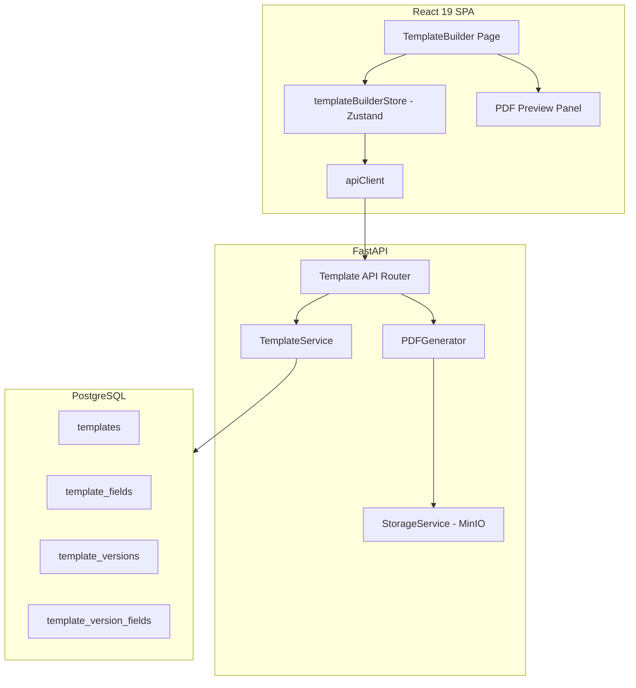
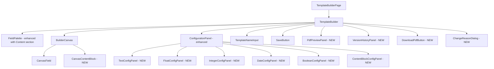
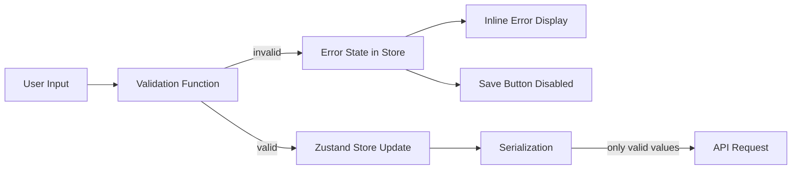

# Design Document: Template Builder Enhancements

## Overview

This design extends the existing Template Builder (React 19 + Zustand + FastAPI + PostgreSQL) with five major capabilities:

1. **Rich Field Configuration** — Type-specific properties (max_length, precision, min/max, units, regex, etc.) on each field type, plus common properties (required, help_text, default_value).
2. **Non-Editable Content Blocks** — Section headers (H1/H2/H3), paragraph text, and horizontal dividers that appear in the PDF but don't collect data.
3. **Template Versioning** — Immutable version snapshots with ALCOA+ audit trail, version history UI, and version numbers in PDFs.
4. **Live PDF Preview** — A client-side preview panel rendering an approximation of the generated PDF in real-time as the user edits.
5. **PDF Download Integration** — Frontend-triggered PDF download with loading states, error handling, and browser file save.

The enhanced serialization format introduces an `element_type` discriminator (`"field"` vs `"content_block"`) to support interleaved fields and content blocks in a single ordered array.

### Design Decisions and Rationale

| Decision | Rationale |
|----------|-----------|
| Client-side PDF preview (HTML/CSS approximation) | Avoids repeated backend round-trips; 500ms update target requires local rendering |
| `element_type` discriminator in JSON schema | Clean polymorphic serialization; backend can validate with Pydantic discriminated unions |
| Separate `template_versions` table (not modifying existing `templates`) | Preserves backward compatibility; existing templates become v1 implicitly |
| Version immutability enforced at DB + API layer | ALCOA+ "Original" principle — once created, versions cannot be altered |
| Field config stored as JSONB column on version fields | Flexible schema per field type without requiring type-specific tables |
| Debounced preview updates (500ms) | Prevents excessive re-renders during rapid typing |

## Architecture

### System Context



### Component Hierarchy (Enhanced)



## Components and Interfaces

### Frontend Components

#### FieldPalette (Enhanced)

Adds a "Content" section below the existing "Field Types" section with draggable items:
- Section Header (H1)
- Section Header (H2)
- Section Header (H3)
- Paragraph Text
- Divider

Drag IDs use prefix `palette-content-` (e.g., `palette-content-heading_h1`).

#### BuilderCanvas (Enhanced)

Renders both `CanvasField` and `CanvasContentBlock` components based on `element_type`. The shared `fieldOrder` sequence allows interleaving. Drop target remains `"builder-canvas"`.

#### CanvasContentBlock (New)

Renders content blocks on the canvas with type-appropriate styling:
- `heading_h1`: Large bold text (text-xl font-bold)
- `heading_h2`: Medium bold text (text-lg font-semibold)
- `heading_h3`: Small bold text (text-base font-semibold)
- `paragraph`: Body text with lighter background (bg-muted/20)
- `divider`: Horizontal rule (border-t)

Supports selection (click to configure), drag handle for reorder, and delete button.

#### ConfigurationPanel (Enhanced)

Detects whether the selected element is a field or content block via `element_type` and renders the appropriate sub-panel:
- For fields: Common properties section (required toggle, help_text input, default_value input) + type-specific panel
- For content blocks: Text editor (headers/paragraphs) or "No configurable properties" message (dividers)

#### Type-Specific Config Panels

| Panel | Properties | Validation Rules |
|-------|-----------|-----------------|
| TextConfigPanel | min_length, max_length, placeholder, regex_pattern | min_length ≤ max_length; regex must be syntactically valid |
| FloatConfigPanel | decimal_precision, min_value, max_value, unit_label | precision 0–10; min ≤ max; unit_label ≤ 50 chars |
| IntegerConfigPanel | min_value, max_value, step_size, unit_label | min ≤ max; step > 0; unit_label ≤ 50 chars |
| DateConfigPanel | min_date, max_date, date_format | dates valid ISO 8601; min ≤ max |
| BooleanConfigPanel | true_label, false_label | non-empty; ≤ 50 chars each |

#### PdfPreviewPanel (New)

- Opens via "Preview" toggle button; renders as a right-side panel replacing the ConfigurationPanel when active
- Renders HTML/CSS approximation of the PDF layout using Tailwind utility classes
- Subscribes to store state via Zustand selector; re-renders on change with 500ms debounce
- Shows: template name, version number or "Draft", all fields with labels/required indicators/help text/unit labels, all content blocks with appropriate heading sizes
- Closes via toggle button; all builder state preserved

#### VersionHistoryPanel (New)

- Displayed on template detail page (route: `/templates/:uuid`)
- Lists all versions descending (newest first)
- Each entry shows: version number badge (e.g., "v2"), creation timestamp, creator name, active indicator
- Click on a version loads its schema into a read-only canvas view
- "Create New Version" button at top (only shown for ReadOnly templates)

#### DownloadPdfButton (New)

- Triggers `POST /api/templates/{document_uuid}/download-pdf` via apiClient
- Includes `X-Change-Reason: "PDF downloaded for offline data collection"` header
- Shows loading spinner during request, button disabled
- On success: creates blob URL from response, triggers `<a download>` click
- On 404/400/network error: shows error toast notification, re-enables button

#### ChangeReasonDialog (New)

- Modal dialog prompted before version creation or any mutating version action
- Contains a textarea with minimum 10 character validation
- Submit button disabled until ≥10 characters entered
- On submit: passes the reason string to the store action which includes it as `X-Change-Reason`

### Backend Services

#### TemplateService (Enhanced)

New methods:

```python
async def create_version(
    self,
    session: AsyncSession,
    document_uuid: str,
    json_schema: dict,
    user_id: int,
    change_reason: str,
) -> TemplateVersion:
    """Create a new version for an existing template.
    
    - Validates template exists and is ReadOnly
    - Determines next version number (max existing + 1)
    - Deactivates current active version (is_active = False)
    - Creates new TemplateVersion with is_active = True
    - Assigns Field-UUIDs to new fields
    - Uses SELECT FOR UPDATE to prevent race conditions
    """

async def get_version_history(
    self, session: AsyncSession, document_uuid: str
) -> list[TemplateVersion]:
    """Return all versions for a template, ordered by version_number DESC."""

async def get_version(
    self, session: AsyncSession, document_uuid: str, version_number: int
) -> TemplateVersion | None:
    """Return a specific version by template UUID and version number."""
```

#### PDFGenerator (Enhanced)

Extended `generate_offline_pdf` to handle:
- Content blocks: headers rendered with font sizes (H1=16pt bold, H2=13pt bold, H3=11pt bold), paragraphs as 10pt body text, dividers as horizontal rules
- Rich field config: required asterisks next to labels, help text as 8pt italic below labels, unit labels rendered adjacent to field boxes, default values pre-filled in AcroForm fields, field width scaled by max_length
- Version number rendered in header: `"{template_name} — v{version_number}"`
- Hidden `__VERSION__` AcroForm field with value = version number string

### API Endpoints

| Method | Path | Request Body | Response | Description |
|--------|------|-------------|----------|-------------|
| POST | `/api/templates` | `TemplateCreate` (enhanced with elements) | `TemplateResponse` | Create template (backward compatible) |
| POST | `/api/templates/{uuid}/versions` | `VersionCreate` | `TemplateVersionResponse` | Create new version |
| GET | `/api/templates/{uuid}/versions` | — | `list[TemplateVersionResponse]` | List version history |
| GET | `/api/templates/{uuid}/versions/{num}` | — | `TemplateVersionResponse` | Get specific version |
| POST | `/api/templates/{uuid}/download-pdf` | — | PDF bytes | Download PDF (version-aware) |

All POST/PUT endpoints require `X-Change-Reason` header per audit middleware.

### Pydantic Schemas (Backend)

```python
from typing import Literal
from pydantic import BaseModel, Field, field_validator

class FieldConfigBase(BaseModel):
    """Base for type-specific field configuration."""
    pass

class TextFieldConfig(FieldConfigBase):
    min_length: int | None = Field(default=None, ge=0)
    max_length: int | None = Field(default=None, ge=1)
    placeholder: str | None = Field(default=None, max_length=200)
    regex_pattern: str | None = Field(default=None, max_length=500)

class FloatFieldConfig(FieldConfigBase):
    decimal_precision: int | None = Field(default=None, ge=0, le=10)
    min_value: float | None = None
    max_value: float | None = None
    unit_label: str | None = Field(default=None, max_length=50)

class IntegerFieldConfig(FieldConfigBase):
    min_value: int | None = None
    max_value: int | None = None
    step_size: int | None = Field(default=1, gt=0)
    unit_label: str | None = Field(default=None, max_length=50)

class DateFieldConfig(FieldConfigBase):
    min_date: str | None = None  # ISO 8601
    max_date: str | None = None  # ISO 8601
    date_format: Literal["YYYY-MM-DD", "DD/MM/YYYY", "MM/DD/YYYY", "DD-MMM-YYYY"] | None = None

class BooleanFieldConfig(FieldConfigBase):
    true_label: str = Field(default="True", min_length=1, max_length=50)
    false_label: str = Field(default="False", min_length=1, max_length=50)

class SerializedFieldElement(BaseModel):
    element_type: Literal["field"]
    label: str = Field(..., min_length=1, max_length=200)
    type: Literal["Text", "Float", "Integer", "Date", "Boolean"]
    required: bool = False
    help_text: str | None = Field(default=None, max_length=500)
    default_value: str | None = None
    config: dict | None = None  # Validated per type in service layer

class SerializedContentBlockElement(BaseModel):
    element_type: Literal["content_block"]
    content_type: Literal["heading_h1", "heading_h2", "heading_h3", "paragraph", "divider"]
    text: str | None = None

class EnhancedTemplateSchema(BaseModel):
    elements: list[SerializedFieldElement | SerializedContentBlockElement] = Field(
        ..., min_length=1
    )

class VersionCreate(BaseModel):
    json_schema: EnhancedTemplateSchema
    user_id: int = Field(default=1)

class TemplateVersionResponse(BaseModel):
    id: int
    version_number: int
    document_uuid: str
    json_schema: dict
    status: str
    is_active: bool
    created_by: int
    change_reason: str
    created_at: str
    fields: list[TemplateVersionFieldResponse] = Field(default_factory=list)
    
    model_config = {"from_attributes": True}
```

## Data Models

### Database Schema Changes

#### New Table: `template_versions`

```sql
CREATE TABLE template_versions (
    id SERIAL PRIMARY KEY,
    template_id INTEGER NOT NULL REFERENCES templates(id),
    version_number INTEGER NOT NULL,
    document_uuid VARCHAR(12) NOT NULL,
    json_schema JSONB NOT NULL,
    status VARCHAR(20) NOT NULL DEFAULT 'ReadOnly',
    is_active BOOLEAN NOT NULL DEFAULT TRUE,
    created_by INTEGER NOT NULL REFERENCES users(id),
    change_reason TEXT NOT NULL,
    created_at TIMESTAMP WITH TIME ZONE NOT NULL DEFAULT NOW(),
    
    CONSTRAINT uq_template_versions_template_version 
        UNIQUE (template_id, version_number),
    CONSTRAINT ck_template_versions_version_positive 
        CHECK (version_number > 0)
);

CREATE INDEX ix_template_versions_template_id ON template_versions(template_id);
CREATE INDEX ix_template_versions_active 
    ON template_versions(template_id, is_active) WHERE is_active = TRUE;
```

#### New Table: `template_version_fields`

```sql
CREATE TABLE template_version_fields (
    id SERIAL PRIMARY KEY,
    version_id INTEGER NOT NULL REFERENCES template_versions(id),
    field_uuid VARCHAR(40) NOT NULL,
    field_type VARCHAR(20) NOT NULL,
    field_label VARCHAR(200) NOT NULL,
    field_order INTEGER NOT NULL,
    element_type VARCHAR(20) NOT NULL DEFAULT 'field',
    content_type VARCHAR(20),
    text_content TEXT,
    config JSONB,
    required BOOLEAN NOT NULL DEFAULT FALSE,
    help_text VARCHAR(500),
    default_value TEXT,
    
    CONSTRAINT uq_template_version_fields_uuid 
        UNIQUE (version_id, field_uuid)
);

CREATE INDEX ix_template_version_fields_version_id 
    ON template_version_fields(version_id);
```

#### Modified Table: `template_fields` (add columns for enhanced config)

```sql
ALTER TABLE template_fields 
    ADD COLUMN element_type VARCHAR(20) NOT NULL DEFAULT 'field',
    ADD COLUMN content_type VARCHAR(20),
    ADD COLUMN text_content TEXT,
    ADD COLUMN config JSONB,
    ADD COLUMN required BOOLEAN NOT NULL DEFAULT FALSE,
    ADD COLUMN help_text VARCHAR(500),
    ADD COLUMN default_value TEXT;
```

### SQLAlchemy Models

```python
class TemplateVersion(Base, AuditMixin):
    """Immutable version snapshot of a template schema."""
    __tablename__ = "template_versions"

    id: Mapped[int] = mapped_column(primary_key=True)
    template_id: Mapped[int] = mapped_column(ForeignKey("templates.id"))
    version_number: Mapped[int] = mapped_column()
    document_uuid: Mapped[str] = mapped_column(String(12))
    json_schema: Mapped[dict] = mapped_column(JSON)
    status: Mapped[str] = mapped_column(String(20), default="ReadOnly")
    is_active: Mapped[bool] = mapped_column(default=True)
    created_by: Mapped[int] = mapped_column(ForeignKey("users.id"))
    change_reason: Mapped[str] = mapped_column(Text)
    created_at: Mapped[datetime] = mapped_column(
        DateTime(timezone=True), server_default=func.now()
    )

    template: Mapped["Template"] = relationship(back_populates="versions")
    fields: Mapped[list["TemplateVersionField"]] = relationship(
        back_populates="version", order_by="TemplateVersionField.field_order"
    )


class TemplateVersionField(Base):
    """Individual element (field or content block) within a template version."""
    __tablename__ = "template_version_fields"

    id: Mapped[int] = mapped_column(primary_key=True)
    version_id: Mapped[int] = mapped_column(ForeignKey("template_versions.id"))
    field_uuid: Mapped[str] = mapped_column(String(40))
    field_type: Mapped[str] = mapped_column(String(20))
    field_label: Mapped[str] = mapped_column(String(200))
    field_order: Mapped[int] = mapped_column()
    element_type: Mapped[str] = mapped_column(String(20), default="field")
    content_type: Mapped[str | None] = mapped_column(String(20), nullable=True)
    text_content: Mapped[str | None] = mapped_column(Text, nullable=True)
    config: Mapped[dict | None] = mapped_column(JSON, nullable=True)
    required: Mapped[bool] = mapped_column(default=False)
    help_text: Mapped[str | None] = mapped_column(String(500), nullable=True)
    default_value: Mapped[str | None] = mapped_column(Text, nullable=True)

    version: Mapped["TemplateVersion"] = relationship(back_populates="fields")
```

### TypeScript Interfaces (Frontend)

```typescript
// Element type discriminator
type ElementType = "field" | "content_block";

// Content block types
type ContentBlockType = "heading_h1" | "heading_h2" | "heading_h3" | "paragraph" | "divider";

// Field types (unchanged from existing)
type FieldType = "Text" | "Float" | "Integer" | "Date" | "Boolean";

// Type-specific configuration interfaces
interface TextFieldConfig {
  min_length?: number;
  max_length?: number;
  placeholder?: string;
  regex_pattern?: string;
}

interface FloatFieldConfig {
  decimal_precision?: number;
  min_value?: number;
  max_value?: number;
  unit_label?: string;
}

interface IntegerFieldConfig {
  min_value?: number;
  max_value?: number;
  step_size?: number;
  unit_label?: string;
}

interface DateFieldConfig {
  min_date?: string;
  max_date?: string;
  date_format?: "YYYY-MM-DD" | "DD/MM/YYYY" | "MM/DD/YYYY" | "DD-MMM-YYYY";
}

interface BooleanFieldConfig {
  true_label?: string;
  false_label?: string;
}

type FieldConfig =
  | TextFieldConfig
  | FloatFieldConfig
  | IntegerFieldConfig
  | DateFieldConfig
  | BooleanFieldConfig;

// Canvas element base
interface CanvasElementBase {
  id: string;
  element_type: ElementType;
  fieldOrder: number;
}

// Canvas field element
interface CanvasFieldElement extends CanvasElementBase {
  element_type: "field";
  label: string;
  type: FieldType;
  required: boolean;
  help_text: string | null;
  default_value: string | null;
  config: FieldConfig;
}

// Canvas content block element
interface CanvasContentBlockElement extends CanvasElementBase {
  element_type: "content_block";
  content_type: ContentBlockType;
  text: string | null;
}

// Union type for all canvas items
type CanvasItem = CanvasFieldElement | CanvasContentBlockElement;

// Serialization payload
interface TemplateCreatePayload {
  name: string;
  json_schema: {
    elements: SerializedElement[];
  };
  user_id: number;
}

interface SerializedFieldElement {
  element_type: "field";
  label: string;
  type: FieldType;
  required: boolean;
  help_text: string | null;
  default_value: string | null;
  config: FieldConfig;
}

interface SerializedContentBlockElement {
  element_type: "content_block";
  content_type: ContentBlockType;
  text: string | null;
}

type SerializedElement = SerializedFieldElement | SerializedContentBlockElement;

// Version creation payload
interface VersionCreatePayload {
  json_schema: {
    elements: SerializedElement[];
  };
  user_id: number;
}

// Version response from backend
interface TemplateVersionResponse {
  id: number;
  version_number: number;
  document_uuid: string;
  json_schema: Record<string, unknown>;
  status: string;
  is_active: boolean;
  created_by: number;
  change_reason: string;
  created_at: string;
  fields: TemplateVersionFieldResponse[];
}

interface TemplateVersionFieldResponse {
  id: number;
  field_uuid: string;
  field_type: string;
  field_label: string;
  field_order: number;
  element_type: ElementType;
  content_type: ContentBlockType | null;
  text_content: string | null;
  config: Record<string, unknown> | null;
  required: boolean;
  help_text: string | null;
  default_value: string | null;
}
```

### Serialization Format Example

```json
{
  "name": "Batch Release Form",
  "json_schema": {
    "elements": [
      {
        "element_type": "content_block",
        "content_type": "heading_h1",
        "text": "Section 1: Product Information"
      },
      {
        "element_type": "field",
        "label": "Batch Number",
        "type": "Text",
        "required": true,
        "help_text": "Enter the batch number from the production label",
        "default_value": null,
        "config": {
          "min_length": 5,
          "max_length": 20,
          "placeholder": "e.g., BN-2024-001",
          "regex_pattern": "^BN-\\d{4}-\\d{3}$"
        }
      },
      {
        "element_type": "field",
        "label": "pH Value",
        "type": "Float",
        "required": true,
        "help_text": null,
        "default_value": "7.0",
        "config": {
          "decimal_precision": 2,
          "min_value": 0.0,
          "max_value": 14.0,
          "unit_label": "pH"
        }
      },
      {
        "element_type": "content_block",
        "content_type": "divider",
        "text": null
      },
      {
        "element_type": "field",
        "label": "Passed QC",
        "type": "Boolean",
        "required": true,
        "help_text": null,
        "default_value": null,
        "config": {
          "true_label": "Pass",
          "false_label": "Fail"
        }
      }
    ]
  },
  "user_id": 1
}
```


## Correctness Properties

*A property is a characteristic or behavior that should hold true across all valid executions of a system — essentially, a formal statement about what the system should do. Properties serve as the bridge between human-readable specifications and machine-verifiable correctness guarantees.*

### Property 1: Serialization Round-Trip

*For any* valid canvas state containing at least one field element (with any combination of field types, configurations, content blocks, and ordering), serializing the canvas to the backend payload format and then deserializing back to a canvas element list SHALL preserve each element's type, label/text, configuration properties, and relative order.

**Validates: Requirements 18.5, 18.1, 18.2, 18.3, 18.4, 1.7, 2.8, 3.7, 4.6, 5.6, 6.5, 7.7, 8.7, 9.5**

### Property 2: Cross-Field Min/Max Constraint Validation

*For any* field configuration where both a minimum and maximum bound are specified (min_length/max_length for Text, min_value/max_value for Float and Integer, min_date/max_date for Date), the validation function SHALL return an error if and only if the minimum exceeds the maximum, and SHALL return no error when minimum is less than or equal to maximum.

**Validates: Requirements 2.4, 3.5, 4.4, 5.4, 20.3, 20.4, 20.5**

### Property 3: Default Value Type Validation

*For any* field type and any candidate default value string, the default value validation function SHALL accept the value if and only if it conforms to the type constraints (parseable as integer for Integer, parseable as float for Float, valid ISO 8601 date for Date, "true" or "false" for Boolean, any non-empty string for Text).

**Validates: Requirements 1.5, 1.6**

### Property 4: Regex Pattern Validity

*For any* string provided as a regex pattern, the regex validation function SHALL accept the string if and only if it is a syntactically valid JavaScript regular expression (i.e., `new RegExp(pattern)` does not throw).

**Validates: Requirements 2.5, 2.6**

### Property 5: Field Order Contiguous Invariant

*For any* canvas state after any sequence of add, remove, and reorder operations on a mix of fields and content blocks, the fieldOrder values SHALL form a contiguous 0-based sequence (0, 1, 2, ..., n-1) with no gaps or duplicates.

**Validates: Requirements 9.6, 7.2, 8.2, 9.2**

### Property 6: Version Creation Invariant

*For any* template with existing versions, when a new version is created: (a) the new version number SHALL equal the maximum existing version number plus one, (b) the new version SHALL have is_active=true and status="ReadOnly", (c) all previous versions SHALL have is_active=false, and (d) exactly one version per template SHALL have is_active=true at any point in time.

**Validates: Requirements 10.5, 10.6, 10.7, 13.3, 13.4**

### Property 7: Version Immutability

*For any* template version that has been created, any attempt to modify its json_schema, version_number, status, change_reason, or created_at fields SHALL be rejected by the API, preserving the original values unchanged.

**Validates: Requirements 21.6, 10.7**

### Property 8: canSave Reflects Validation State

*For any* canvas state, the `canSave()` function SHALL return false if any of the following conditions hold: (a) template name is empty or exceeds 500 characters, (b) no field elements exist, (c) any field has an empty label, (d) any field has a cross-field constraint violation (min > max), (e) any field has an invalid regex pattern, (f) any content block with required text has empty text, or (g) a save is already in progress. Otherwise it SHALL return true.

**Validates: Requirements 20.1, 20.6, 18.6, 18.7**

### Property 9: Preview Completeness

*For any* valid canvas state, the PDF preview rendering function SHALL produce output containing: (a) every field's label text, (b) an asterisk or "Required" indicator for every field with required=true, (c) the help_text for every field that has it configured, (d) the unit_label for every numeric field that has it configured, (e) the text content of every heading and paragraph content block, and (f) a divider element for every divider content block.

**Validates: Requirements 14.2, 14.4, 14.5, 14.6, 15.1, 15.2, 15.3, 15.4, 15.5, 15.6**

### Property 10: PDF Filename Version Format

*For any* template name and version number, the generated PDF filename SHALL follow the format `"{sanitized_name}_{document_uuid}_v{version_number}.pdf"` where the version number matches the stored version number exactly.

**Validates: Requirements 12.3, 12.1, 12.2**

## Error Handling

### Frontend Error Handling

| Scenario | Behavior |
|----------|----------|
| Field configuration validation error | Inline error message adjacent to the input; Save button disabled |
| Template name empty/too long | Inline error below name input; Save button disabled |
| Save API returns 400/422 | Parse error detail from response body; display in error toast |
| Save API returns 500 | Generic "Save failed" error toast with retry suggestion |
| Save API returns 401 | Token refresh attempted; if fails, redirect to login |
| PDF download returns 404 | Toast: "Template not found" |
| PDF download returns 400 | Toast: "Template is not in a downloadable state" |
| PDF download network error | Toast: "Download failed. Please try again."; re-enable button |
| Version creation returns 409 (conflict) | Toast: "Another version is being created. Please try again." |
| Version creation missing change reason | Dialog prevents submission until ≥10 chars entered |
| Preview rendering error | Graceful degradation — preview shows "Unable to render preview" message |

### Backend Error Handling

| Scenario | HTTP Status | Response |
|----------|-------------|----------|
| Invalid JSON schema structure | 400 | `{"detail": "json_schema must contain an 'elements' key"}` |
| No field elements in schema | 400 | `{"detail": "Template must contain at least one field element"}` |
| Invalid field config (e.g., min > max) | 422 | `{"detail": [{"loc": [...], "msg": "..."}]}` |
| Template not found | 404 | `{"detail": "Template not found: {uuid}"}` |
| Template not ReadOnly for PDF | 400 | `{"detail": "PDF generation requires a ReadOnly template"}` |
| Concurrent version creation | 409 | `{"detail": "Version creation in progress for this template"}` |
| Missing X-Change-Reason | 400 | `{"detail": "X-Change-Reason header is required for mutating requests to GxP-relevant endpoints."}` |
| Version modification attempt | 403 | `{"detail": "Template versions are immutable after creation"}` |
| Field-UUID uniqueness violation | 500 | `{"detail": "Internal error: UUID collision"}` |

### Validation Error Propagation



## Testing Strategy

### Testing Approach

This feature uses a dual testing approach:
- **Property-based tests** for universal correctness properties (serialization, validation, invariants)
- **Unit tests** for specific examples, edge cases, and component rendering
- **Integration tests** for API endpoint behavior and database interactions

### Property-Based Testing

**Library:** [fast-check](https://github.com/dubzzz/fast-check) for TypeScript/JavaScript frontend tests; [hypothesis](https://hypothesis.readthedocs.io/) for Python backend tests.

**Configuration:** Minimum 100 iterations per property test.

**Tag format:** Each test tagged with comment `Feature: template-builder-enhancements, Property {N}: {title}`

#### Property Tests to Implement

| Property | Test File | Generator Strategy |
|----------|-----------|-------------------|
| 1: Serialization Round-Trip | `templateSerializer.property.test.ts` | Generate random `CanvasItem[]` arrays with mixed fields/content blocks, random configs per type |
| 2: Cross-Field Min/Max | `fieldValidation.property.test.ts` | Generate random numeric pairs `(min, max)` and date pairs |
| 3: Default Value Type Validation | `fieldValidation.property.test.ts` | Generate random `(FieldType, string)` pairs |
| 4: Regex Pattern Validity | `fieldValidation.property.test.ts` | Generate random strings (mix of valid regex patterns and invalid ones) |
| 5: Field Order Contiguous | `canvasOperations.property.test.ts` | Generate random sequences of add/remove/reorder operations |
| 6: Version Creation Invariant | `test_version_service_property.py` | Generate random sequences of version creations on a template |
| 7: Version Immutability | `test_version_service_property.py` | Generate versions then attempt random field mutations |
| 8: canSave Reflects Validation | `templateBuilderStore.property.test.ts` | Generate random canvas states with various error conditions |
| 9: Preview Completeness | `pdfPreview.property.test.ts` | Generate random valid canvas states, verify preview output contains all required elements |
| 10: PDF Filename Version Format | `test_pdf_generator_property.py` | Generate random template names and version numbers |

### Unit Tests

| Area | Test File | Coverage |
|------|-----------|----------|
| ConfigurationPanel rendering | `ConfigurationPanel.test.tsx` | Each field type shows correct config inputs |
| FieldPalette Content section | `FieldPalette.test.tsx` | Content items rendered and draggable |
| CanvasContentBlock rendering | `CanvasContentBlock.test.tsx` | Each content type renders correctly |
| VersionHistoryPanel | `VersionHistoryPanel.test.tsx` | Versions listed descending, active highlighted |
| DownloadPdfButton | `DownloadPdfButton.test.tsx` | Loading states, error handling, download trigger |
| ChangeReasonDialog | `ChangeReasonDialog.test.tsx` | Min 10 char validation, submission |
| PdfPreviewPanel | `PdfPreviewPanel.test.tsx` | Renders fields, content blocks, config hints |
| PDFGenerator content blocks | `test_pdf_generator.py` | Headers, paragraphs, dividers rendered in PDF |
| PDFGenerator rich config | `test_pdf_generator.py` | Required asterisks, help text, units, defaults |
| TemplateService versioning | `test_template_service.py` | Version creation, history retrieval, active enforcement |
| API endpoint validation | `test_templates_api.py` | Schema validation, error responses, header requirements |

### Integration Tests

| Area | Test File | Coverage |
|------|-----------|----------|
| Version creation flow | `test_versioning_integration.py` | Full create → list → get flow with database |
| PDF download flow | `test_pdf_download_integration.py` | Template → PDF generation → download response |
| Concurrent version creation | `test_versioning_integration.py` | Race condition handling with SELECT FOR UPDATE |
| Audit trail logging | `test_audit_integration.py` | Version events logged via SQLAlchemy-Continuum |

### Test Execution

```bash
# Frontend property + unit tests (Vitest)
npx vitest --run src/frontend/src/**/*.property.test.ts
npx vitest --run src/frontend/src/**/*.test.tsx

# Backend property + unit + integration tests (pytest + hypothesis)
uv run pytest src/backend/tests/ --tb=short -q
```
