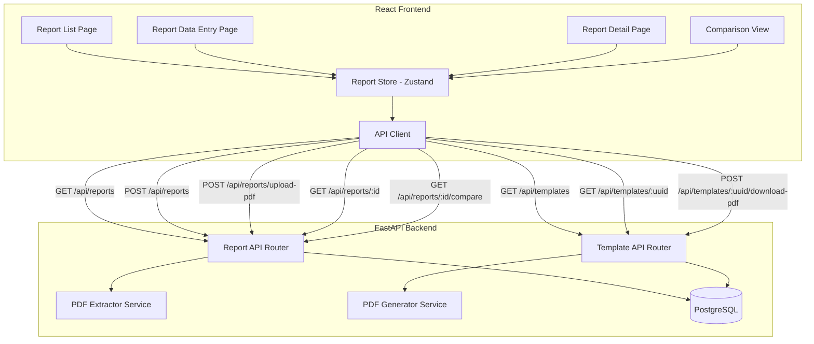
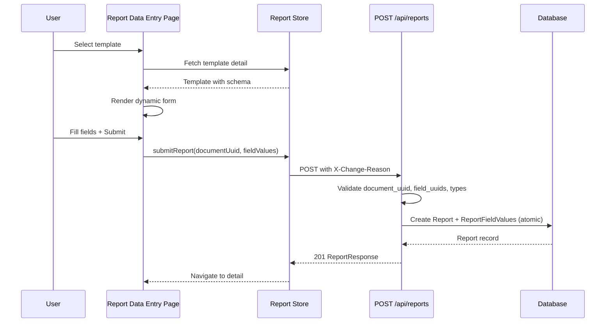
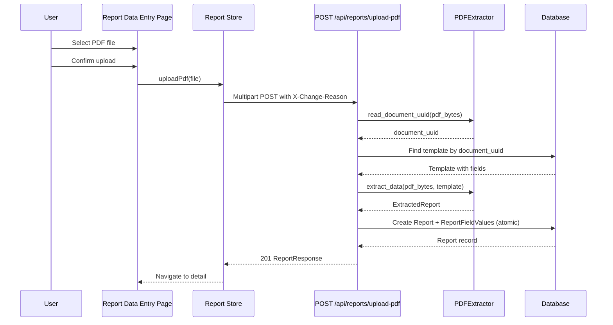
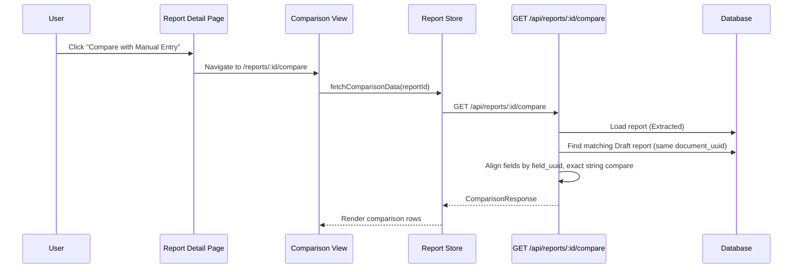
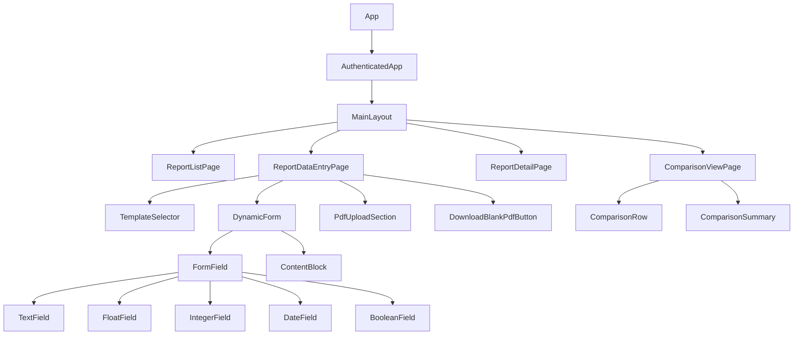

# Design Document: Report Data Entry & PDF Extraction

## Overview

This feature implements the complete report lifecycle in AlcoaBase: creating reports via dynamic form entry, uploading completed offline PDFs for automated extraction, viewing report details, and comparing extracted vs. manually entered data for integrity verification. It builds on the existing backend infrastructure (Report model, PDFExtractor service, upload-pdf endpoint) and the frontend template system (Zustand stores, apiClient, template types).

The system follows a dual-path data entry model:
1. **Manual Entry**: Users select a template, fill out a dynamically rendered form, and submit field values via `POST /api/reports`
2. **PDF Upload**: Users upload a completed offline PDF, and the existing PDFExtractor service extracts field values via `POST /api/reports/upload-pdf`

Both paths produce Report records with ReportFieldValue entries, enabling side-by-side comparison for data integrity verification.

## Architecture

### System Context Diagram



### Data Flow: Manual Entry



### Data Flow: PDF Upload



### Data Flow: Comparison



## Components and Interfaces

### Frontend Component Hierarchy



### Frontend Pages

#### ReportListPage (`/reports`)

```typescript
// src/frontend/src/pages/ReportListPage.tsx
export function ReportListPage(): JSX.Element;
```

Responsibilities:
- Fetch and display paginated report list (50 per page) via `useReportStore().fetchReportList()`
- Table columns: report ID, template name, Document_UUID, status badge, uploaded-by, relative timestamp (hover shows ISO 8601)
- Navigate to `/reports/:reportId` on row click
- "New Report" button navigates to `/reports/new`
- Loading spinner, error banner with retry, empty state with "New Report" CTA

#### ReportDataEntryPage (`/reports/new`, `/reports/new/:documentUuid`)

```typescript
// src/frontend/src/pages/ReportDataEntryPage.tsx
export function ReportDataEntryPage(): JSX.Element;
```

Responsibilities:
- Template selection: fetch ReadOnly templates from `GET /api/templates`, display selector
- If `:documentUuid` route param present, auto-select that template
- Dynamic form rendering from template's `json_schema.elements` array
- Client-side validation on blur + on submit attempt
- Submit button calls `reportStore.submitReport()`
- PDF upload section with 20MB limit, file preview, calls `reportStore.uploadPdf()`
- "Download Blank PDF" button (visible after template selection)

#### ReportDetailPage (`/reports/:reportId`)

```typescript
// src/frontend/src/pages/ReportDetailPage.tsx
export function ReportDetailPage(): JSX.Element;
```

Responsibilities:
- Fetch report via `GET /api/reports/:reportId`
- Display metadata: ID, Document_UUID, template name, status, uploaded-by, formatted timestamp
- Display field values with labels (resolved from template schema), validation indicators
- "Compare with Manual Entry" button (visible when status is "Extracted")
- Loading, 404, and error states

#### ComparisonViewPage (`/reports/:reportId/compare`)

```typescript
// src/frontend/src/pages/ComparisonViewPage.tsx
export function ComparisonViewPage(): JSX.Element;
```

Responsibilities:
- Fetch comparison data via `GET /api/reports/:reportId/compare`
- Two-column layout: "Extracted (PDF)" left, "Manual Entry" right
- Rows aligned by Field_UUID with field label
- Discrepancy rows highlighted, match rows with checkmark
- Missing values shown with placeholder
- Summary bar: total fields, matches, discrepancies
- "Data integrity verified" message when zero discrepancies

### Frontend Components

#### TemplateSelector

```typescript
// src/frontend/src/components/reports/TemplateSelector.tsx
interface TemplateSelectorProps {
  onSelect: (template: TemplateResponse) => void;
  disabled?: boolean;
  preSelectedUuid?: string;
}
export function TemplateSelector(props: TemplateSelectorProps): JSX.Element;
```

Displays ReadOnly templates with name, Document_UUID, and field count. Loading/error/empty states.

#### DynamicForm

```typescript
// src/frontend/src/components/reports/DynamicForm.tsx
interface DynamicFormProps {
  elements: SerializedElement[];
  templateFields: TemplateFieldResponse[];
  onSubmit: (fieldValues: FieldValueEntry[]) => void;
  isSubmitting: boolean;
  serverErrors?: Record<string, string>;
}
export function DynamicForm(props: DynamicFormProps): JSX.Element;
```

Iterates `elements` array in order. For `element_type: "field"`, renders the appropriate typed input. For `element_type: "content_block"`, renders headings/paragraphs/dividers. Manages form state internally, validates on blur, disables submit when errors exist.

#### PdfUploadSection

```typescript
// src/frontend/src/components/reports/PdfUploadSection.tsx
interface PdfUploadSectionProps {
  onUpload: (file: File) => void;
  isUploading: boolean;
  uploadError?: string | null;
}
export function PdfUploadSection(props: PdfUploadSectionProps): JSX.Element;
```

File input accepting `.pdf` only, 20MB max. Shows filename + size after selection. "Change File" option. Upload confirmation button.

#### Field Components

```typescript
// src/frontend/src/components/reports/fields/index.ts
export { TextField } from "./TextField";
export { FloatField } from "./FloatField";
export { IntegerField } from "./IntegerField";
export { DateField } from "./DateField";
export { BooleanField } from "./BooleanField";
export { ContentBlock } from "./ContentBlock";

// Common field props interface
interface BaseFieldProps {
  fieldUuid: string;
  label: string;
  required: boolean;
  helpText: string | null;
  defaultValue: string | null;
  value: string;
  onChange: (value: string) => void;
  onBlur: () => void;
  error: string | null;
  disabled?: boolean;
}

// Type-specific props extend BaseFieldProps with config
interface TextFieldProps extends BaseFieldProps {
  config: TextFieldConfig;
}
interface FloatFieldProps extends BaseFieldProps {
  config: FloatFieldConfig;
}
// ... etc.
```

### Report Store (Zustand)

```typescript
// src/frontend/src/stores/reportStore.ts
import { create } from "zustand";
import { apiClient, ApiError } from "../lib/apiClient";
import type {
  ReportResponse,
  FieldValueEntry,
  ComparisonData,
} from "../types/report";

interface ReportState {
  // List state
  reports: ReportResponse[];
  isLoadingList: boolean;
  listError: string | null;

  // Detail state
  currentReport: ReportResponse | null;
  isLoadingDetail: boolean;
  detailError: string | null;

  // Submission state
  isSubmitting: boolean;
  submitError: string | null;

  // Upload state
  isUploading: boolean;
  uploadError: string | null;

  // Comparison state
  comparisonData: ComparisonData | null;
  isLoadingComparison: boolean;
  comparisonError: string | null;

  // PDF download state
  isDownloadingPdf: boolean;
  downloadPdfError: string | null;

  // Actions
  fetchReportList: () => Promise<void>;
  fetchReportDetail: (reportId: number) => Promise<void>;
  submitReport: (documentUuid: string, fieldValues: FieldValueEntry[]) => Promise<ReportResponse>;
  uploadPdf: (file: File) => Promise<ReportResponse>;
  fetchComparisonData: (reportId: number) => Promise<void>;
  downloadBlankPdf: (documentUuid: string) => Promise<void>;
}

export const useReportStore = create<ReportState>((set, get) => ({
  // Initial state
  reports: [],
  isLoadingList: false,
  listError: null,
  currentReport: null,
  isLoadingDetail: false,
  detailError: null,
  isSubmitting: false,
  submitError: null,
  isUploading: false,
  uploadError: null,
  comparisonData: null,
  isLoadingComparison: false,
  comparisonError: null,
  isDownloadingPdf: false,
  downloadPdfError: null,

  fetchReportList: async () => {
    set({ isLoadingList: true, listError: null });
    try {
      const reports = await apiClient.get<ReportResponse[]>("/api/reports");
      set({ reports, isLoadingList: false });
    } catch (err) {
      const message = err instanceof ApiError ? err.body : "Failed to load reports";
      set({ listError: message, isLoadingList: false });
    }
  },

  fetchReportDetail: async (reportId: number) => {
    set({ isLoadingDetail: true, detailError: null });
    try {
      const report = await apiClient.get<ReportResponse>(`/api/reports/${reportId}`);
      set({ currentReport: report, isLoadingDetail: false });
    } catch (err) {
      const message = err instanceof ApiError ? err.body : "Failed to load report";
      set({ detailError: message, isLoadingDetail: false });
    }
  },

  submitReport: async (documentUuid: string, fieldValues: FieldValueEntry[]) => {
    set({ isSubmitting: true, submitError: null });
    try {
      const report = await apiClient.post<ReportResponse>("/api/reports", {
        document_uuid: documentUuid,
        field_values: fieldValues,
      }, { changeReason: "Report created via manual data entry" });
      // Prepend to list if previously fetched
      const { reports } = get();
      set({
        currentReport: report,
        isSubmitting: false,
        reports: reports.length > 0 ? [report, ...reports] : reports,
      });
      return report;
    } catch (err) {
      const message = err instanceof ApiError ? err.body : "Failed to submit report";
      set({ submitError: message, isSubmitting: false });
      throw err;
    }
  },

  uploadPdf: async (file: File) => {
    set({ isUploading: true, uploadError: null });
    try {
      const formData = new FormData();
      formData.append("file", file);
      const report = await apiClient.upload<ReportResponse>(
        "/api/reports/upload-pdf",
        formData,
        undefined,
        "Report created via PDF extraction"
      );
      const { reports } = get();
      set({
        currentReport: report,
        isUploading: false,
        reports: reports.length > 0 ? [report, ...reports] : reports,
      });
      return report;
    } catch (err) {
      const message = err instanceof ApiError ? err.body : "Failed to upload PDF";
      set({ uploadError: message, isUploading: false });
      throw err;
    }
  },

  fetchComparisonData: async (reportId: number) => {
    set({ isLoadingComparison: true, comparisonError: null, comparisonData: null });
    try {
      const data = await apiClient.get<ComparisonData>(`/api/reports/${reportId}/compare`);
      set({ comparisonData: data, isLoadingComparison: false });
    } catch (err) {
      const message = err instanceof ApiError ? err.body : "Failed to load comparison";
      set({ comparisonError: message, isLoadingComparison: false, comparisonData: null });
    }
  },

  downloadBlankPdf: async (documentUuid: string) => {
    set({ isDownloadingPdf: true, downloadPdfError: null });
    try {
      const response = await fetch(`/api/templates/${documentUuid}/download-pdf`, {
        method: "POST",
        headers: {
          "X-Change-Reason": "PDF downloaded for offline data collection from report page",
          // Auth + tenant headers added by interceptor pattern
        },
        credentials: "include",
      });
      if (!response.ok) throw new Error(`Download failed: ${response.status}`);
      const blob = await response.blob();
      const disposition = response.headers.get("Content-Disposition");
      const filename = disposition?.match(/filename="?(.+?)"?$/)?.[1] ?? `${documentUuid}.pdf`;
      const url = URL.createObjectURL(blob);
      const a = document.createElement("a");
      a.href = url;
      a.download = filename;
      a.click();
      URL.revokeObjectURL(url);
      set({ isDownloadingPdf: false });
    } catch (err) {
      const message = err instanceof Error ? err.message : "Download failed";
      set({ downloadPdfError: message, isDownloadingPdf: false });
    }
  },
}));
```

### Backend Endpoints

#### POST /api/reports (New)

```python
# Added to src/backend/src/alcoabase/api/reports.py

@router.post(
    "",
    response_model=ReportResponse,
    status_code=201,
    responses={400: {"model": UploadErrorResponse}},
)
async def create_report(
    payload: ReportCreateRequest,
    session: AsyncSession = Depends(get_db_session),
    tenant: TenantContext = Depends(get_tenant_context),
) -> ReportResponse:
    """Create a report from manually entered field values.

    Validates document_uuid belongs to tenant, all field_uuids exist in
    the template, and all values pass type validation. Persists atomically.

    Args:
        payload: ReportCreateRequest with document_uuid and field_values.
        session: Async database session.
        tenant: Resolved tenant context.

    Returns:
        201 ReportResponse on success.

    Raises:
        HTTPException 400: Invalid document_uuid, unknown field_uuids,
            type validation failures, or empty field_values.
    """
```

**Validation algorithm:**
1. Query template by `document_uuid` + `company_id == tenant.company_id`
2. If not found → 400 "No template found for document_uuid"
3. Build `field_map: dict[str, TemplateField]` from template.fields (element_type="field" only)
4. Check each submitted `field_uuid` exists in `field_map` → collect unknowns → 400 if any
5. For each field value, validate against field type using same logic as `PDFExtractor._validate_single_value` (reuse or extract to shared utility)
6. If validation errors → 400 with `validation_errors` array
7. Create `Report(status="Draft", company_id=tenant.company_id, uploaded_by=tenant.user_id)`
8. Create `ReportFieldValue` for each entry
9. Flush + reload with relationships → return ReportResponse

#### GET /api/reports (New)

```python
@router.get("", response_model=list[ReportResponse])
async def list_reports(
    session: AsyncSession = Depends(get_db_session),
    tenant: TenantContext = Depends(get_tenant_context),
) -> list[ReportResponse]:
    """List all reports for the current tenant, newest first.

    Filters by company_id, orders by uploaded_at descending.
    Eagerly loads field_values relationship.
    """
```

#### GET /api/reports/{report_id} (New)

```python
@router.get("/{report_id}", response_model=ReportResponse)
async def get_report(
    report_id: int,
    session: AsyncSession = Depends(get_db_session),
    tenant: TenantContext = Depends(get_tenant_context),
) -> ReportResponse:
    """Get a single report by ID, scoped to tenant.

    Returns 404 for both not-found and cross-tenant access
    to prevent information leakage.
    """
```

#### GET /api/reports/{report_id}/compare (New)

```python
@router.get("/{report_id}/compare", response_model=ComparisonResponse)
async def compare_report(
    report_id: int,
    session: AsyncSession = Depends(get_db_session),
    tenant: TenantContext = Depends(get_tenant_context),
) -> ComparisonResponse:
    """Compare an extracted report with a manual entry report.

    Finds the source report (must be status "Extracted"), then finds
    a matching "Draft" report with the same document_uuid. Aligns
    fields by field_uuid and performs exact string comparison.

    Returns 400 if no matching manual entry report exists.
    """
```

**Comparison algorithm:**
1. Load source report (must belong to tenant, must be "Extracted")
2. Query for a "Draft" report with same `document_uuid` and `company_id`
3. If not found → return response with `compared_with_report_id: null` and message
4. Build maps: `extracted_map[field_uuid] = value`, `entered_map[field_uuid] = value`
5. Union all field_uuids from both maps
6. For each field_uuid: resolve label from template, compare values (exact string, case-sensitive)
7. Count matches and discrepancies
8. Return ComparisonResponse

### Validation Logic (Frontend)

```typescript
// src/frontend/src/lib/reportValidation.ts

export type FieldType = "Text" | "Float" | "Integer" | "Date" | "Boolean";

export interface ValidationRule {
  fieldUuid: string;
  fieldType: FieldType;
  required: boolean;
  config: Record<string, unknown>;
}

/**
 * Validate a single field value against its type and config.
 * Returns error message string or null if valid.
 */
export function validateField(value: string, rule: ValidationRule): string | null {
  // Required check
  if (rule.required && value.trim() === "") {
    return "This field is required";
  }
  // Skip further validation if empty and not required
  if (value.trim() === "") return null;

  switch (rule.fieldType) {
    case "Float": {
      if (isNaN(Number(value)) || value.trim() === "") {
        return "Must be a valid decimal number";
      }
      const num = Number(value);
      const min = rule.config.min_value as number | undefined;
      const max = rule.config.max_value as number | undefined;
      if (min !== undefined && num < min) return `Minimum value is ${min}`;
      if (max !== undefined && num > max) return `Maximum value is ${max}`;
      return null;
    }
    case "Integer": {
      const parsed = Number(value);
      if (isNaN(parsed) || !Number.isInteger(parsed)) {
        return "Must be a valid whole number";
      }
      const min = rule.config.min_value as number | undefined;
      const max = rule.config.max_value as number | undefined;
      if (min !== undefined && parsed < min) return `Minimum value is ${min}`;
      if (max !== undefined && parsed > max) return `Maximum value is ${max}`;
      return null;
    }
    case "Date": {
      const date = new Date(value);
      if (isNaN(date.getTime())) {
        return "Must be a valid date";
      }
      return null;
    }
    case "Text": {
      const minLen = rule.config.min_length as number | undefined;
      const maxLen = rule.config.max_length as number | undefined;
      if (minLen !== undefined && value.length < minLen) {
        return `Minimum length is ${minLen} characters`;
      }
      if (maxLen !== undefined && value.length > maxLen) {
        return `Maximum length is ${maxLen} characters`;
      }
      return null;
    }
    case "Boolean":
      return null; // Always valid (toggle/checkbox)
  }
}

/**
 * Validate all fields. Only validates touched fields unless forceAll=true.
 */
export function validateAllFields(
  values: Record<string, string>,
  rules: ValidationRule[],
  touchedFields: Set<string>,
  forceAll = false
): Record<string, string> {
  const errors: Record<string, string> = {};
  for (const rule of rules) {
    if (!forceAll && !touchedFields.has(rule.fieldUuid)) continue;
    const value = values[rule.fieldUuid] ?? "";
    const error = validateField(value, rule);
    if (error) errors[rule.fieldUuid] = error;
  }
  return errors;
}
```

### Routing Integration

```typescript
// Added to AuthenticatedApp in src/frontend/src/App.tsx
<Route path="reports" element={<ReportListPage />} />
<Route path="reports/new" element={<ReportDataEntryPage />} />
<Route path="reports/new/:documentUuid" element={<ReportDataEntryPage />} />
<Route path="reports/:reportId" element={<ReportDetailPage />} />
<Route path="reports/:reportId/compare" element={<ComparisonViewPage />} />
```

Route ordering ensures `/reports/new` is matched before `/reports/:reportId`.

Sidebar navigation adds a "Reports" link to `/reports` following the existing pattern in `MainLayout`.

## Data Models

### Frontend Types

```typescript
// src/frontend/src/types/report.ts

export interface ReportResponse {
  id: number;
  document_uuid: string;
  template_id: number;
  uploaded_by: number;
  uploaded_at: string | null;
  status: "Draft" | "Extracted" | "Validated";
  field_values: ReportFieldValueResponse[];
}

export interface ReportFieldValueResponse {
  field_uuid: string;
  value: string | null;
  validated: boolean;
}

export interface FieldValueEntry {
  field_uuid: string;
  value: string | null;
}

export interface ReportCreatePayload {
  document_uuid: string;
  field_values: FieldValueEntry[];
}

export interface ComparisonData {
  report_id: number;
  compared_with_report_id: number | null;
  total_fields: number;
  matches: number;
  discrepancies: number;
  rows: ComparisonFieldRow[];
}

export interface ComparisonFieldRow {
  field_uuid: string;
  field_label: string;
  extracted_value: string | null;
  entered_value: string | null;
  is_match: boolean;
}
```

### Backend Schemas (New/Extended)

```python
# Additions to src/backend/src/alcoabase/schemas/report.py

class ReportFieldValueInput(BaseModel):
    """Input for a single field value in manual report creation."""
    field_uuid: str = Field(max_length=40)
    value: str | None = Field(default=None, max_length=10000)

class ReportCreateRequest(BaseModel):
    """Request body for POST /api/reports."""
    document_uuid: str = Field(max_length=12)
    field_values: list[ReportFieldValueInput] = Field(min_length=1)

class ComparisonFieldRow(BaseModel):
    """A single row in the comparison response."""
    field_uuid: str
    field_label: str
    extracted_value: str | None
    entered_value: str | None
    is_match: bool

class ComparisonResponse(BaseModel):
    """Response for GET /api/reports/{report_id}/compare."""
    report_id: int
    compared_with_report_id: int | None
    total_fields: int
    matches: int
    discrepancies: int
    rows: list[ComparisonFieldRow]
```

### Database (No Schema Changes Required)

The existing `reports` and `report_field_values` tables support both manual entry and PDF extraction without modification. The `status` column distinguishes the source:
- `"Draft"` — created via manual entry (`POST /api/reports`)
- `"Extracted"` — created via PDF upload (`POST /api/reports/upload-pdf`)
- `"Validated"` — after QA review (future feature)

The `company_id` column on `reports` already exists for tenant scoping.


## Correctness Properties

*A property is a characteristic or behavior that should hold true across all valid executions of a system — essentially, a formal statement about what the system should do. Properties serve as the bridge between human-readable specifications and machine-verifiable correctness guarantees.*

### Property 1: Field type validation correctly accepts and rejects values

*For any* field type (Text, Float, Integer, Date, Boolean) and *for any* string value, the `validateField` function SHALL return `null` (valid) if and only if the value conforms to the type's rules: Float accepts only strings parseable as decimal numbers, Integer accepts only strings parseable as whole numbers without decimal points, Date accepts only valid ISO 8601 date strings (YYYY-MM-DD), Boolean is always valid (toggle control), and Text accepts any string within configured length constraints.

**Validates: Requirements 4.1, 4.2, 4.3, 11.4**

### Property 2: Range and length constraint validation

*For any* numeric field (Float or Integer) with `min_value` and `max_value` configured, and *for any* valid numeric value, `validateField` SHALL return an error if and only if the numeric value is strictly less than `min_value` or strictly greater than `max_value`. Similarly, *for any* Text field with `min_length` or `max_length` configured, `validateField` SHALL return an error if and only if the string length violates the constraint.

**Validates: Requirements 4.4, 4.5**

### Property 3: Required field validation on submit

*For any* set of field validation rules where some fields have `required=true`, and *for any* form state where some required fields have empty values, calling `validateAllFields` with `forceAll=true` SHALL return errors for exactly the set of required fields that are empty, and no errors for non-required empty fields.

**Validates: Requirements 4.6, 4.9**

### Property 4: Untouched fields produce no validation errors

*For any* set of field validation rules and *for any* form state, calling `validateAllFields` with a `touchedFields` set SHALL only produce errors for fields whose `fieldUuid` is in the `touchedFields` set. Fields not in the set SHALL have no errors regardless of their value.

**Validates: Requirements 4.8, 4.9**

### Property 5: Comparison field alignment and exact string matching

*For any* two sets of field values (extracted and entered) keyed by Field_UUID, the comparison logic SHALL: (a) produce one row for every unique Field_UUID across both sets, (b) mark a row as `is_match=true` if and only if both values are present and are exactly equal (case-sensitive, no trimming), (c) mark a row as `is_match=false` (discrepancy) if values differ or one side is missing, and (d) the summary SHALL satisfy the invariant: `total_fields == matches + discrepancies`.

**Validates: Requirements 8.2, 8.3, 8.4, 8.5, 8.6**

### Property 6: Backend type validation rejects invalid values and accepts valid ones

*For any* template field type and *for any* string value, the backend `_validate_single_value` function SHALL return a `ValidationError` if and only if: for Float the value is not parseable as `float()`, for Integer the value is not parseable as `int()`, for Date the value is not parseable as `date.fromisoformat()`, for Boolean the value is not in the accepted set ("true", "false" case-insensitive for manual entry). Text always passes.

**Validates: Requirements 11.4, 11.9**

### Property 7: Backend report list is tenant-isolated and ordered

*For any* set of reports across multiple tenants, `GET /api/reports` for a given tenant SHALL return only reports where `company_id` matches the tenant's company ID, and the returned list SHALL be ordered by `uploaded_at` descending (each report's `uploaded_at` is greater than or equal to the next report's `uploaded_at`).

**Validates: Requirements 12.1, 12.3, 12.4**

### Property 8: Backend report detail enforces tenant isolation

*For any* report belonging to tenant A, a `GET /api/reports/{report_id}` request from tenant B (where B != A) SHALL return a 404 response that is indistinguishable from the response for a non-existent report ID.

**Validates: Requirements 13.2, 13.4**

### Property 9: Backend submission response contains all submitted field values

*For any* valid report submission with N field values, the 201 response SHALL contain a `field_values` array of exactly N entries, where each entry's `field_uuid` matches one of the submitted field UUIDs and the `value` matches the submitted value.

**Validates: Requirements 11.6**

### Property 10: Template selector filters to ReadOnly status only

*For any* list of templates with mixed statuses (Draft, ReadOnly), the template selector SHALL display only templates where `status === "ReadOnly"`. The count of displayed templates SHALL equal the count of ReadOnly templates in the source list.

**Validates: Requirements 2.1**

### Property 11: Content-Disposition filename extraction

*For any* Content-Disposition header string matching the pattern `attachment; filename="..."` or `attachment; filename=...`, the filename extraction function SHALL return the filename value. *For any* missing, empty, or malformed Content-Disposition header, the function SHALL return the fallback filename `{documentUuid}.pdf`.

**Validates: Requirements 14.3**

## Error Handling

### Frontend Error Strategy

| Error Source | Handling | User Feedback |
|---|---|---|
| Network failure (fetch throws) | Catch in store action, set error state | Error banner with retry button |
| API 400 (validation) | Parse error body, map to field errors | Inline field errors + banner |
| API 400 (business logic) | Parse `detail` message | Error notification with specific message |
| API 403 (permissions) | Set error state | "Insufficient permissions" message |
| API 404 (not found) | Set error state | "Not found" message with back link |
| API 5xx (server error) | Set error state | Generic "Something went wrong" notification |
| File too large (>20MB) | Client-side check before upload | Inline error on file input |
| Session expired (401) | apiClient handles refresh + retry | Redirect to login if refresh fails |

### Backend Error Strategy

| Error Condition | HTTP Status | Response Body |
|---|---|---|
| Missing X-Company-Id / unauthorized | 400/401/403 | TenantContext dependency handles |
| Unknown document_uuid | 400 | `{"detail": "No template found for document_uuid: ..."}` |
| Invalid field_uuids | 400 | `{"detail": "Unknown field UUIDs", "invalid_uuids": [...]}` |
| Type validation failures | 400 | `{"detail": "Type validation failed", "validation_errors": [...]}` |
| Empty field_values array | 400 | `{"detail": "At least one field value is required"}` |
| Report not found / cross-tenant | 404 | `{"detail": "Report not found"}` |
| Invalid report_id type | 422 | FastAPI validation error |
| PDF missing __DOC_UUID__ | 400 | `{"detail": "PDF does not contain a valid __DOC_UUID__ field..."}` |
| PDF unknown Document_UUID | 400 | `{"detail": "Unknown Document-UUID: '...'..."}` |

### Error State Cleanup

The Report Store clears the corresponding error property when a new request of the same type is initiated:
- `fetchReportList()` clears `listError`
- `fetchReportDetail()` clears `detailError`
- `submitReport()` clears `submitError`
- `uploadPdf()` clears `uploadError`
- `fetchComparisonData()` clears `comparisonError`

### Atomic Persistence

Both `POST /api/reports` and `POST /api/reports/upload-pdf` use a single database transaction. If any step fails (validation, field value creation), the entire operation is rolled back — no partial data is persisted. This is achieved by SQLAlchemy's session-level transaction management with `await session.flush()` within the same session scope.

## Testing Strategy

### Unit Tests (Example-Based)

**Frontend (Vitest + React Testing Library):**
- Component rendering tests:
  - ReportListPage: loading, error, empty, populated states
  - ReportDataEntryPage: template selection flow, form rendering, submission
  - ReportDetailPage: metadata display, field values, validation indicators
  - ComparisonViewPage: two-column layout, discrepancy highlighting, summary
- Store action tests (mocked apiClient):
  - Each action's state transitions (loading -> success/error)
  - Error mapping and cleanup
  - List prepend on creation

**Backend (pytest + httpx AsyncClient):**
- Endpoint integration tests:
  - `POST /api/reports`: valid submission, missing template, invalid fields, type failures
  - `GET /api/reports`: tenant isolation, ordering, empty list
  - `GET /api/reports/{id}`: found, not found, cross-tenant 404
  - `GET /api/reports/{id}/compare`: matching reports, missing counterpart

### Property-Based Tests

**Libraries:**
- Frontend: `fast-check` (TypeScript property-based testing)
- Backend: `hypothesis` (Python property-based testing)

**Configuration:** Minimum 100 iterations per property test.

**Frontend property tests (fast-check):**

```typescript
// Feature: Step_2-5_report-data-entry-pdf-extraction, Property 1: Field type validation
describe("validateField - Float type", () => {
  it("accepts valid decimal strings", () => {
    fc.assert(fc.property(
      fc.double({ noNaN: true, noDefaultInfinity: true }),
      (num) => {
        const result = validateField(String(num), { fieldUuid: "f1", fieldType: "Float", required: false, config: {} });
        expect(result).toBeNull();
      }
    ), { numRuns: 100 });
  });

  it("rejects non-numeric strings", () => {
    fc.assert(fc.property(
      fc.string().filter(s => s.trim() !== "" && isNaN(Number(s))),
      (str) => {
        const result = validateField(str, { fieldUuid: "f1", fieldType: "Float", required: false, config: {} });
        expect(result).not.toBeNull();
      }
    ), { numRuns: 100 });
  });
});

// Feature: Step_2-5_report-data-entry-pdf-extraction, Property 5: Comparison alignment
describe("computeComparison", () => {
  it("total always equals matches + discrepancies", () => {
    fc.assert(fc.property(
      fc.dictionary(fc.hexaString({ minLength: 1, maxLength: 12 }), fc.option(fc.string())),
      fc.dictionary(fc.hexaString({ minLength: 1, maxLength: 12 }), fc.option(fc.string())),
      (extracted, entered) => {
        const result = computeComparison(extracted, entered);
        expect(result.total_fields).toBe(result.matches + result.discrepancies);
      }
    ), { numRuns: 100 });
  });
});
```

**Backend property tests (hypothesis):**

```python
# Feature: Step_2-5_report-data-entry-pdf-extraction, Property 6: Backend type validation
@given(value=st.text(min_size=1), field_type=st.sampled_from(["Float", "Integer", "Date", "Boolean", "Text"]))
@settings(max_examples=100)
def test_type_validation_consistency(value: str, field_type: str):
    """Backend type validation is consistent with Python parsing."""
    result = validate_single_value(value, field_type, "FLD-TEST", "Test")
    if field_type == "Text":
        assert result is None
    elif field_type == "Float":
        try:
            float(value)
            assert result is None
        except ValueError:
            assert result is not None

# Feature: Step_2-5_report-data-entry-pdf-extraction, Property 9: Submission round-trip
@given(field_values=st.lists(
    st.fixed_dictionaries({"field_uuid": st.from_regex(r"FLD-[0-9a-f]{8}"), "value": st.text(max_size=100)}),
    min_size=1, max_size=10
))
@settings(max_examples=100)
def test_submission_response_contains_all_values(field_values):
    """Response field_values matches submitted field_values."""
    # Setup: create template with matching field_uuids
    # Submit report with field_values
    # Assert response.field_values has same count and matching uuids/values
    ...
```

### Integration Tests

- Full request lifecycle: create report -> fetch detail -> verify data matches
- PDF upload -> extraction -> comparison with manual entry
- Cross-tenant access attempts (verify 404, not 403)
- Concurrent submissions (verify atomic persistence)

### Test File Locations

```
src/frontend/src/lib/__tests__/reportValidation.test.ts       # Properties 1-4
src/frontend/src/lib/__tests__/comparison.test.ts             # Property 5
src/frontend/src/lib/__tests__/filenameExtraction.test.ts     # Property 11
src/frontend/src/components/reports/__tests__/                # Component unit tests
src/frontend/src/stores/__tests__/reportStore.test.ts         # Store action tests
src/frontend/src/pages/__tests__/                             # Page integration tests
src/backend/tests/test_reports_api.py                         # Properties 7-9, endpoint tests
src/backend/tests/test_report_validation.py                   # Property 6
src/backend/tests/test_report_comparison.py                   # Property 5 (backend)
```
