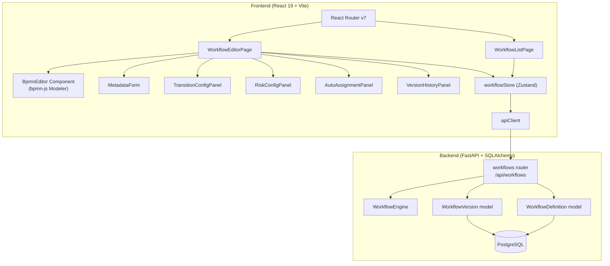
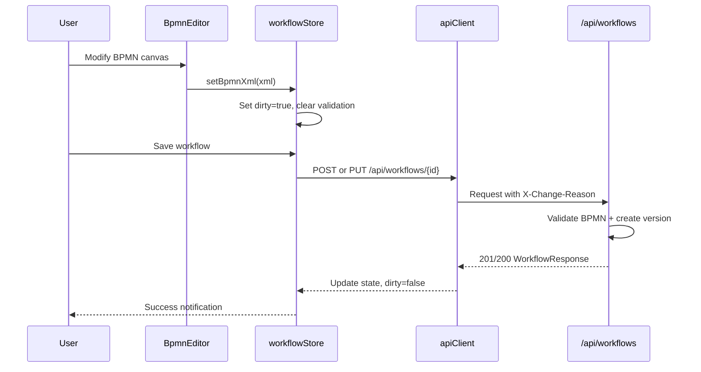

# Design Document: BPMN Workflow Visual Editor

## Overview

This design implements a visual BPMN workflow editor for AlcoaBase, enabling document administrators to design, validate, and manage document lifecycle workflows through a drag-and-drop interface. The system integrates the [bpmn-js](https://bpmn.io/toolkit/bpmn-js/) library (open-source BPMN 2.0 modeler) into the React frontend, backed by existing FastAPI workflow endpoints enhanced with versioning, tenant scoping, and a GET-by-ID endpoint.

Key design decisions:
- **bpmn-js Modeler** for the visual canvas — it's the industry-standard open-source BPMN editor with React-compatible lifecycle management
- **Zustand store** (`workflowStore`) for centralized state — consistent with the existing `templateBuilderStore` pattern
- **WorkflowVersion model** for immutable version history — enables audit compliance without modifying the existing `WorkflowDefinition` table structure significantly
- **Custom BPMN extensions** for risk levels and auto-assignment config — stored within the BPMN XML itself, avoiding backend schema changes for future features
- **Restricted palette** — only Start Event, End Event, Task, and Sequence Flow are exposed, matching the backend parser's capabilities

## Architecture



### Request Flow



## Components and Interfaces

### Frontend Component Hierarchy

```
App.tsx
└── AuthenticatedApp (RouteGuard)
    └── MainLayout
        ├── /workflows → WorkflowListPage
        │   ├── WorkflowTable (list of workflows)
        │   │   └── WorkflowPreview (miniature bpmn-js viewer)
        │   └── EmptyState / LoadingState / ErrorState
        ├── /workflows/new → WorkflowEditorPage (mode="create")
        │   ├── MetadataForm (name, document_tag)
        │   ├── BpmnEditor (bpmn-js Modeler, restricted palette)
        │   ├── TransitionConfigPanel
        │   │   ├── TransitionList (checkboxes for sig/training)
        │   │   ├── RiskConfigSection
        │   │   └── AutoAssignmentSection (disabled)
        │   ├── ValidationResultsPanel
        │   └── VersionHistoryPanel (hidden in create mode)
        └── /workflows/:workflowId/edit → WorkflowEditorPage (mode="edit")
            └── (same children as create mode)
```

### BpmnEditor Component

```typescript
interface BpmnEditorProps {
  /** Initial BPMN XML to render (empty string for new canvas) */
  initialXml: string;
  /** Called on every canvas change with updated XML */
  onXmlChange: (xml: string) => void;
  /** Called when transitions change (extracted from sequence flows) */
  onTransitionsChange: (transitions: string[]) => void;
  /** Whether the editor is read-only (for version preview) */
  readOnly?: boolean;
}
```

The component:
1. Mounts a `div` ref and instantiates `BpmnJS` (Modeler or Viewer based on `readOnly`)
2. Configures a custom palette provider that restricts elements to Start Event, End Event, Task, Sequence Flow
3. Registers `commandStack.changed` event listener to extract XML and transitions on every change
4. Handles `importXML` on mount and when `initialXml` prop changes
5. Cleans up the bpmn-js instance on unmount

### workflowStore (Zustand)

```typescript
interface WorkflowStoreState {
  // List state
  workflows: WorkflowResponse[];
  isLoadingList: boolean;
  listError: string | null;

  // Editor state
  currentWorkflow: WorkflowResponse | null;
  bpmnXml: string;
  workflowName: string;
  documentTag: string;
  signatureRequiredTransitions: string[];
  trainingTriggerTransitions: string[];
  riskLevels: Record<string, "Standard" | "High">;
  autoAssignmentConfig: Record<string, AssigneeConfig>;

  // Validation
  validationErrors: string[] | null;
  isValidating: boolean;

  // Save
  isSaving: boolean;
  saveError: string | null;

  // Dirty tracking
  isDirty: boolean;

  // Versioning
  versions: WorkflowVersionSummary[];
  selectedVersion: WorkflowVersionDetail | null;
  isLoadingVersions: boolean;

  // Actions
  fetchWorkflowList: () => Promise<void>;
  fetchWorkflow: (id: number) => Promise<void>;
  createWorkflow: () => Promise<boolean>;
  updateWorkflow: (id: number) => Promise<boolean>;
  validateWorkflow: () => Promise<void>;
  setBpmnXml: (xml: string) => void;
  setWorkflowName: (name: string) => void;
  setDocumentTag: (tag: string) => void;
  setSignatureTransitions: (transitions: string[]) => void;
  setTrainingTransitions: (transitions: string[]) => void;
  setRiskLevel: (stateName: string, level: "Standard" | "High") => void;
  clearValidation: () => void;
  resetEditor: () => void;
  fetchVersionHistory: (workflowId: number) => Promise<void>;
  fetchVersion: (workflowId: number, versionNumber: number) => Promise<void>;
  restoreVersion: (version: WorkflowVersionDetail) => void;
}
```

### bpmn-js Integration Approach

**Installation**: Add `bpmn-js` as a dependency in `src/frontend/package.json`.

**Custom Palette Provider**: A custom module that overrides the default palette to only show:
- `create.start-event` — Start Event
- `create.end-event` — End Event
- `create.task` — Task (workflow state)
- Connection tool (Sequence Flow)

```typescript
// src/frontend/src/components/workflows/customPalette.ts
export default class RestrictedPaletteProvider {
  static $inject = ['palette', 'create', 'elementFactory', 'spaceTool', 'lassoTool'];

  constructor(palette, create, elementFactory, spaceTool, lassoTool) {
    palette.registerProvider(this);
    // store references...
  }

  getPaletteEntries() {
    return {
      'create.start-event': { /* StartEvent entry */ },
      'create.end-event': { /* EndEvent entry */ },
      'create.task': { /* Task entry */ },
      'tool-separator': { separator: true },
      'space-tool': { /* Space tool */ },
      'lasso-tool': { /* Lasso tool */ },
      'global-connect-tool': { /* Connect tool for Sequence Flows */ },
    };
  }
}
```

**Custom Extension Elements** (for risk levels and auto-assignment):

A custom BPMN moddle extension defines `alcoa:RiskLevel` and `alcoa:AutoAssignment` properties on Task elements. These are stored within the BPMN XML `<bpmn:extensionElements>` and survive round-trips through the backend.

```json
{
  "name": "Alcoa",
  "prefix": "alcoa",
  "uri": "http://alcoa.io/bpmn/extensions",
  "types": [
    {
      "name": "RiskLevel",
      "superClass": ["Element"],
      "properties": [
        { "name": "level", "type": "String", "isAttr": true }
      ]
    },
    {
      "name": "AutoAssignment",
      "superClass": ["Element"],
      "properties": [
        { "name": "config", "type": "String", "isAttr": true }
      ]
    }
  ]
}
```

**Transition Extraction**: On every `commandStack.changed` event, the editor:
1. Calls `modeler.saveXML()` to get current XML
2. Parses element registry to extract all sequence flows between tasks
3. Formats transitions as `"SourceTaskName→TargetTaskName"` strings (using Unicode U+2192)
4. Emits both XML and transitions to the store

### Backend Changes

#### New Endpoint: GET /api/workflows/{workflow_id}

Returns a single workflow by ID, scoped to the tenant. Returns 404 if not found or belongs to different tenant.

#### New Endpoint: GET /api/workflows/{workflow_id}/versions

Returns version history (summary) for a workflow, ordered by version_number descending.

#### New Endpoint: GET /api/workflows/{workflow_id}/versions/{version_number}

Returns a specific version's full data including bpmn_xml and transition arrays.

#### Modified: POST /api/workflows

Now creates a `WorkflowVersion` record (version 1) alongside the `WorkflowDefinition`. Sets `company_id` from tenant context.

#### Modified: PUT /api/workflows/{workflow_id}

When `bpmn_xml`, `signature_required_transitions`, or `training_trigger_transitions` change, increments version and creates a new `WorkflowVersion` record. Adds tenant scoping filter.

#### Modified: GET /api/workflows (list)

Adds tenant scoping filter (`company_id = tenant.company_id`).

#### Tenant Scoping

All queries filter by `company_id = tenant.company_id`. The existing `TODO` comments in the workflow router are resolved.

## Data Models

### WorkflowVersion (New Model)

```python
class WorkflowVersion(Base, AuditMixin):
    """Immutable version record for a workflow definition.

    Each structural change (bpmn_xml, transitions) creates a new version.
    Metadata-only changes (name, is_active) do not create versions.
    """
    __tablename__ = "workflow_versions"
    __table_args__ = (
        UniqueConstraint("workflow_id", "version_number", name="uq_workflow_version"),
    )

    id: Mapped[int] = mapped_column(primary_key=True)
    workflow_id: Mapped[int] = mapped_column(
        ForeignKey("workflow_definitions.id"), index=True
    )
    version_number: Mapped[int] = mapped_column()
    bpmn_xml: Mapped[str] = mapped_column(Text)
    signature_required_transitions: Mapped[list] = mapped_column(JSON, default=list)
    training_trigger_transitions: Mapped[list] = mapped_column(JSON, default=list)
    created_by: Mapped[int] = mapped_column(ForeignKey("users.id"))
    created_at: Mapped[datetime] = mapped_column(
        DateTime(timezone=True), server_default=func.now()
    )
    change_reason: Mapped[str] = mapped_column(String(500))
    company_id: Mapped[int] = mapped_column(ForeignKey("companies.id"))
```

### WorkflowDefinition (Modified)

Add `current_version` column:

```python
current_version: Mapped[int] = mapped_column(default=1)
```

### API Schemas (New/Modified)

```python
# New response schema for version summary (list endpoint)
class WorkflowVersionSummary(BaseModel):
    version_number: int
    created_by: int
    created_at: datetime
    change_reason: str

# New response schema for version detail (single version endpoint)
class WorkflowVersionDetail(BaseModel):
    version_number: int
    bpmn_xml: str
    signature_required_transitions: list[str]
    training_trigger_transitions: list[str]
    created_by: int
    created_at: datetime
    change_reason: str

# Modified WorkflowResponse — add version field
class WorkflowResponse(BaseModel):
    id: int
    name: str
    document_tag: str
    bpmn_xml: str
    signature_required_transitions: list[str]
    training_trigger_transitions: list[str]
    is_active: bool
    version: int  # NEW: current version number
```

### Alembic Migration

A single migration that:
1. Creates the `workflow_versions` table with all columns and the unique constraint
2. Adds `current_version` column (integer, default=1, NOT NULL) to `workflow_definitions`
3. Backfills existing workflows: creates a version 1 record for each existing `WorkflowDefinition` using its current `bpmn_xml` and transition arrays

### Frontend Route Changes

```typescript
// In AuthenticatedApp routes (replacing existing single /workflows route):
<Route path="workflows" element={<WorkflowListPage />} />
<Route path="workflows/new" element={<WorkflowEditorPage mode="create" />} />
<Route path="workflows/:workflowId/edit" element={<WorkflowEditorPage mode="edit" />} />
```

The existing `WorkflowsPage` placeholder is replaced by `WorkflowListPage`. Unmatched `/workflows/*` paths redirect to `/workflows`.


## Correctness Properties

*A property is a characteristic or behavior that should hold true across all valid executions of a system — essentially, a formal statement about what the system should do. Properties serve as the bridge between human-readable specifications and machine-verifiable correctness guarantees.*

### Property 1: BPMN XML state and transition extraction consistency

*For any* valid BPMN XML containing Task elements and Sequence Flows between them, the `parse_bpmn_xml` function SHALL extract the same set of states (Task names) and transitions (SourceTask→TargetTask strings) regardless of element ordering in the XML, and the extracted states SHALL equal the set of all Task `name` attributes, and the extracted transitions SHALL equal the set of all Sequence Flows connecting Task elements.

**Validates: Requirements 1.2, 4.1, 10.4**

### Property 2: Metadata field validation

*For any* string input for the `document_tag` field, the validation function SHALL accept the input if and only if it matches the pattern `^[a-zA-Z0-9_-]+$` (non-empty, alphanumeric plus hyphens and underscores). *For any* empty or whitespace-only string for `name` or `document_tag`, the validation SHALL reject the input.

**Validates: Requirements 3.4, 3.5, 3.6**

### Property 3: Transition toggle set membership

*For any* transition string and initial array of selected transitions, toggling the transition "on" SHALL result in an array containing that transition, and toggling it "off" SHALL result in an array not containing that transition, with all other elements unchanged.

**Validates: Requirements 4.5, 4.6**

### Property 4: Client-side BPMN pre-validation

*For any* BPMN XML that is missing a Start Event, the client-side validation SHALL return an error mentioning "Start Event". *For any* BPMN XML missing an End Event, it SHALL return an error mentioning "End Event". *For any* BPMN XML missing at least one Task element, it SHALL return an error mentioning "Task". *For any* BPMN XML containing all three, client-side pre-validation SHALL pass.

**Validates: Requirements 5.2**

### Property 5: Store dirty flag and validation clearing

*For any* store state where `isDirty` is false and `validationErrors` is non-null, calling `setBpmnXml` with any new XML string SHALL set `isDirty` to true and `validationErrors` to null. Similarly, *for any* modification action (`setWorkflowName`, `setDocumentTag`, `setSignatureTransitions`, `setTrainingTransitions`), the `isDirty` flag SHALL be set to true.

**Validates: Requirements 6.7, 11.2**

### Property 6: BPMN XML extension elements round-trip

*For any* valid BPMN XML containing `alcoa:RiskLevel` and `alcoa:AutoAssignment` extension elements on Task nodes, serializing the XML to a string and then parsing it back SHALL preserve all extension element attributes and values without data loss.

**Validates: Requirements 7.5, 8.5, 10.3**

### Property 7: BPMN XML workflow structure round-trip

*For any* valid BPMN XML produced by the bpmn-js editor, parsing it with `parse_bpmn_xml` SHALL produce a `BPMNWorkflow` with `states`, `transitions`, `initial_state`, and `terminal_states`. Re-serializing an equivalent XML (same structure) and parsing again SHALL produce an identical `BPMNWorkflow` (same sets of states, same transitions, same initial_state, same terminal_states).

**Validates: Requirements 10.2**

### Property 8: Backend validation rejects invalid workflows

*For any* BPMN XML containing unreachable states (states not reachable from the initial state via transitions), `validate_bpmn_workflow` SHALL return `is_valid=False` with an error mentioning "unreachable". *For any* list of `signature_required_transitions` containing a transition string not present in the BPMN XML's actual transitions, validation SHALL return `is_valid=False` with an error mentioning the invalid transition reference.

**Validates: Requirements 14.2, 14.4, 14.9**

### Property 9: Tenant isolation

*For any* workflow query (list, get by ID, update), the result set SHALL only contain workflows where `company_id` matches the requesting tenant's `company_id`. *For any* workflow belonging to a different tenant, GET SHALL return 404 and PUT SHALL return 404.

**Validates: Requirements 14.11, 16.5**

### Property 10: Version increment on structural changes only

*For any* PUT request to `/api/workflows/{id}` that modifies `bpmn_xml`, `signature_required_transitions`, or `training_trigger_transitions`, the workflow's `current_version` SHALL increment by exactly 1 and a new `WorkflowVersion` record SHALL be created. *For any* PUT request that only modifies `name` or `is_active`, the `current_version` SHALL remain unchanged and no new `WorkflowVersion` record SHALL be created.

**Validates: Requirements 15.2, 15.3**

### Property 11: Version restore sets editor state

*For any* `WorkflowVersionDetail` object, calling `restoreVersion` SHALL set the store's `bpmnXml` to the version's `bpmn_xml`, `signatureRequiredTransitions` to the version's `signature_required_transitions`, `trainingTriggerTransitions` to the version's `training_trigger_transitions`, and `isDirty` to true.

**Validates: Requirements 15.12**

## Error Handling

### Frontend Error Handling

| Scenario | Handling |
|----------|----------|
| API returns 400 (validation error) | Display error detail from response body in validation panel or inline error message. Preserve all editor state. |
| API returns 404 (workflow not found) | Display "Workflow not found" message with link back to list. |
| API returns 401 (unauthorized) | `apiClient` handles token refresh automatically. If refresh fails, redirect to login. |
| API returns 5xx (server error) | Display generic error notification ("Server error, please try again"). Preserve editor state. |
| Network failure | Display "Network error" notification with retry option. Preserve editor state. |
| bpmn-js import fails (malformed XML) | Display error message in editor area. In list preview, show fallback text. |
| BPMN XML too large (>1MB) | Client-side warning before save. Backend accepts up to TEXT column limit. |

### Backend Error Handling

| Scenario | Response |
|----------|----------|
| Invalid BPMN XML (parse error) | 400 with `detail: "Workflow validation failed: Invalid BPMN XML: {parse_error}"` |
| Unreachable states | 400 with `detail: "Workflow validation failed: Unreachable states detected: [...]"` |
| Duplicate document_tag | 400 with `detail: "Workflow validation failed: document_tag '{tag}' is already used..."` |
| Invalid signature transition reference | 400 with `detail: "Workflow validation failed: signature_required_transitions references invalid transition: '{t}'"` |
| Workflow not found / wrong tenant | 404 with `detail: "Workflow not found"` |
| Version not found | 404 with `detail: "Version not found"` |
| Missing X-Change-Reason header | 400 (handled by AuditMiddleware) |

### Unsaved Changes Protection

The `beforeunload` browser event and React Router's navigation blocker (`useBlocker`) are used together:
- `window.addEventListener('beforeunload', ...)` — catches browser close/refresh
- `useBlocker(() => isDirty)` — catches in-app navigation via React Router

## Testing Strategy

### Property-Based Testing (PBT)

This feature is suitable for property-based testing in several areas:
- **BPMN XML parsing** — pure function with clear input/output, large input space
- **Validation logic** — pure functions with universal properties
- **Store state transitions** — deterministic state machine behavior
- **Versioning logic** — clear invariants about version numbering

**Libraries:**
- Frontend: `fast-check` (already in devDependencies)
- Backend: `hypothesis` (standard for pytest)

**Configuration:**
- Minimum 100 iterations per property test
- Each test tagged with: `Feature: bpmn-workflow-visual-editor, Property {N}: {title}`

### Unit Tests (Example-Based)

| Area | Tests |
|------|-------|
| `parse_bpmn_xml` | Specific BPMN XML samples with expected states/transitions |
| `validate_bpmn_workflow` | Known-invalid XMLs with expected error messages |
| `workflowStore` actions | Specific action sequences with expected state |
| `BpmnEditor` component | Mount/unmount lifecycle, XML import |
| Metadata validation | Specific valid/invalid inputs |
| Route rendering | Each route renders correct component |

### Integration Tests

| Area | Tests |
|------|-------|
| POST /api/workflows | Create workflow with valid data, expect 201 |
| PUT /api/workflows/{id} | Update with structural change, version incremented |
| GET /api/workflows/{id} | Tenant scoping verified |
| GET /api/workflows/{id}/versions | Version history returned correctly |
| Tenant isolation | Cross-tenant access returns 404 |
| Full editor flow | Create, validate, save, reload, verify round-trip |

### Test File Organization

```
src/frontend/src/
  components/workflows/__tests__/
    BpmnEditor.test.tsx
    WorkflowListPage.test.tsx
    WorkflowEditorPage.test.tsx
  stores/__tests__/
    workflowStore.test.ts
    workflowStore.property.test.ts  (PBT)
  lib/__tests__/
    bpmnValidation.property.test.ts  (PBT)

src/backend/tests/
  test_workflow_api.py
  test_workflow_engine.py
  test_workflow_engine_property.py  (PBT)
  test_workflow_versioning.py
```
