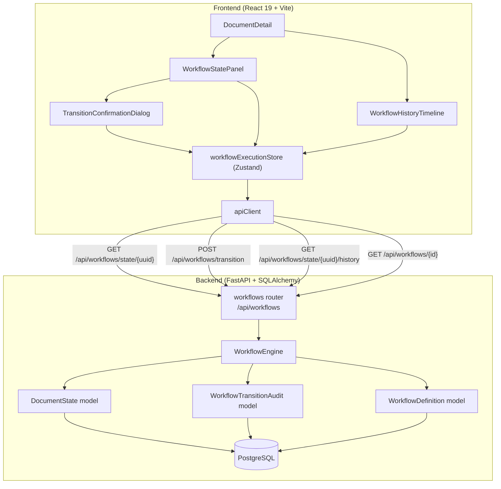
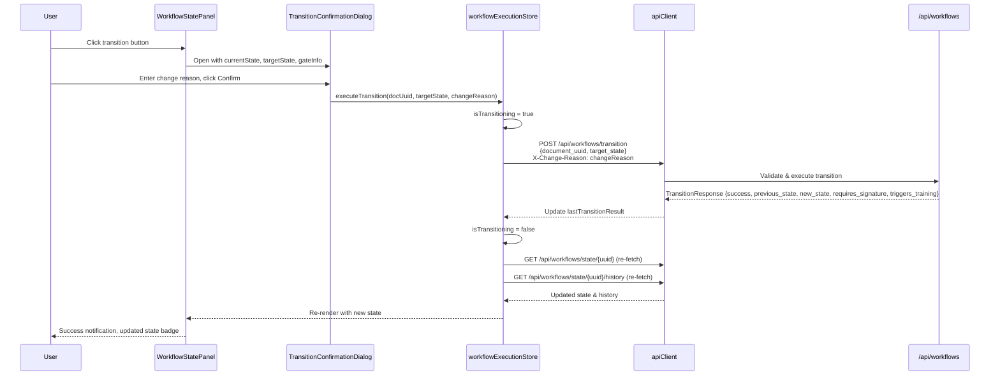
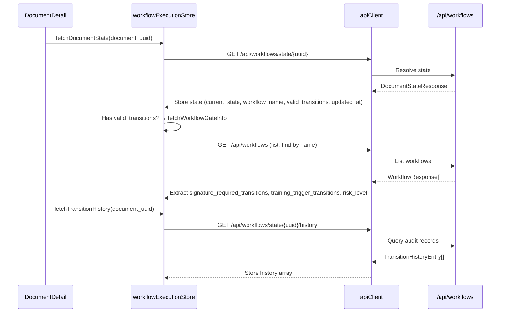

# Design Document: Workflow Execution & State Transitions (Frontend)

## Overview

This design implements the frontend workflow execution layer for AlcoaBase, enabling users to view document workflow state, trigger state transitions with audit-compliant confirmation dialogs, see gate indicators (signature/training requirements), and review a chronological workflow history timeline. The system integrates into the existing `DocumentDetail` component and communicates with the backend via the existing `POST /api/workflows/transition` and `GET /api/workflows/state/{document_uuid}` endpoints, plus a new `GET /api/workflows/state/{document_uuid}/history` endpoint.

Key design decisions:
- **Zustand store** (`workflowExecutionStore`) for centralized workflow execution state — separate from the existing `workflowStore` (which manages workflow definitions/editor) to maintain single-responsibility
- **Embedded panel architecture** — the Workflow_State_Panel and Workflow_History_Timeline are rendered within `DocumentDetail` as collapsible sections, not separate pages
- **Gate info pre-fetching** — workflow gate configuration (signature/training arrays) is fetched once when the document state loads, enabling immediate icon display on transition buttons
- **Optimistic refresh** — after a successful transition, both document state and history are re-fetched to ensure consistency with the backend
- **Backend `change_reason` column** — added to `WorkflowTransitionAudit` via Alembic migration, populated from the `X-Change-Reason` header on each transition

## Architecture



### Request Flow: State Transition



### Request Flow: Initial Load



## Components and Interfaces

### Frontend Component Hierarchy

```
DocumentDetail.tsx (existing)
├── Document Metadata Section (existing)
├── WorkflowStatePanel (NEW - collapsible, default expanded)
│   ├── PanelHeader (workflow name, risk badge, state badge, updated_at)
│   ├── TransitionButtons (one per valid_transition, with gate icons)
│   ├── GateIndicatorBanners (signature/training post-transition)
│   └── LoadingState / ErrorState / NoWorkflowState
├── WorkflowHistoryTimeline (NEW - collapsible, default collapsed)
│   ├── TimelineEntry[] (prev→new state, user, timestamp, reason)
│   ├── ShowAllButton (when > 5 entries)
│   └── LoadingState / ErrorState / EmptyState
├── TransitionConfirmationDialog (NEW - modal, portal)
│   ├── StateTransitionSummary (current → target)
│   ├── GateWarnings (signature/training messages)
│   ├── RiskWarning (high/critical workflows)
│   ├── ChangeReasonInput (textarea, 3-500 chars, counter)
│   └── ActionButtons (Confirm, Cancel)
└── VersionHistoryPanel (existing)
```

### WorkflowStatePanel Component

```typescript
// src/frontend/src/components/documents/WorkflowStatePanel.tsx

interface WorkflowStatePanelProps {
  /** The document's UUID for API calls */
  documentUuid: string;
  /** Whether the panel should start expanded */
  defaultExpanded?: boolean;
}
```

### TransitionConfirmationDialog Component

```typescript
// src/frontend/src/components/documents/TransitionConfirmationDialog.tsx

interface TransitionConfirmationDialogProps {
  /** Whether the dialog is open */
  open: boolean;
  /** Callback to close the dialog */
  onOpenChange: (open: boolean) => void;
  /** The current workflow state name */
  currentState: string;
  /** The target state for the transition */
  targetState: string;
  /** Whether this transition requires an electronic signature */
  requiresSignature: boolean;
  /** Whether this transition triggers training assignment */
  triggersTraining: boolean;
  /** The workflow risk level */
  riskLevel: "low" | "medium" | "high" | "critical";
  /** Callback when the user confirms the transition */
  onConfirm: (changeReason: string) => void;
  /** Whether a transition is currently in progress */
  isTransitioning: boolean;
  /** Error message from a failed transition attempt */
  transitionError: string | null;
}
```

### WorkflowHistoryTimeline Component

```typescript
// src/frontend/src/components/documents/WorkflowHistoryTimeline.tsx

interface WorkflowHistoryTimelineProps {
  /** The document's UUID for API calls */
  documentUuid: string;
  /** Whether the timeline should start expanded */
  defaultExpanded?: boolean;
}
```

### workflowExecutionStore (Zustand)

```typescript
// src/frontend/src/stores/workflowExecutionStore.ts

interface TransitionHistoryEntry {
  id: number;
  document_id: number;
  user_id: number;
  user_display_name?: string;
  previous_state: string;
  new_state: string;
  timestamp: string; // ISO 8601
  change_reason: string | null;
}

interface WorkflowExecutionState {
  // Document workflow state
  currentState: string | null;
  workflowName: string | null;
  validTransitions: string[];
  updatedAt: string | null;
  isLoadingState: boolean;
  stateError: string | null;

  // Transition execution
  isTransitioning: boolean;
  transitionError: string | null;
  lastTransitionResult: {
    success: boolean;
    previous_state: string;
    new_state: string;
    requires_signature: boolean;
    triggers_training: boolean;
  } | null;

  // Workflow history
  history: TransitionHistoryEntry[];
  isLoadingHistory: boolean;
  historyError: string | null;

  // Gate status (from workflow definition)
  signatureRequiredTransitions: string[];
  trainingTriggerTransitions: string[];
  riskLevel: "low" | "medium" | "high" | "critical";
  isLoadingGateInfo: boolean;

  // Actions
  fetchDocumentState: (documentUuid: string) => Promise<void>;
  executeTransition: (
    documentUuid: string,
    targetState: string,
    changeReason: string
  ) => Promise<boolean>;
  fetchTransitionHistory: (documentUuid: string) => Promise<void>;
  fetchWorkflowGateInfo: (workflowName: string) => Promise<void>;
  clearTransitionState: () => void;
  reset: () => void;
}
```

### Utility Functions

```typescript
// src/frontend/src/lib/workflowUtils.ts

/**
 * Maps a workflow state name to a badge color class.
 * Known states: Draft=gray, Review=blue, Approved=green, Rejected=red.
 * Unknown states get a neutral/default color.
 */
export function getStateBadgeColor(state: string): string;

/**
 * Maps a risk level to a color class.
 * low=gray, medium=blue, high=orange, critical=red.
 */
export function getRiskLevelColor(riskLevel: string): string;

/**
 * Validates a change reason string.
 * Returns true if trimmed length is between 3 and 500 characters.
 */
export function isValidChangeReason(reason: string): boolean;

/**
 * Truncates a string to maxLength characters, appending "…" if truncated.
 */
export function truncateText(text: string, maxLength: number): string;

/**
 * Formats a transition string for gate matching.
 * Format: "CurrentState→TargetState" (Unicode U+2192)
 */
export function formatTransitionString(
  currentState: string,
  targetState: string
): string;

/**
 * Checks if a transition has a specific gate requirement.
 */
export function hasGate(
  currentState: string,
  targetState: string,
  gateTransitions: string[]
): boolean;
```

### Backend Changes

#### New Endpoint: GET /api/workflows/state/{document_uuid}/history

Returns the transition audit history for a document, ordered by timestamp descending.

```python
# Added to src/backend/src/alcoabase/api/workflows.py

@router.get(
    "/state/{document_uuid}/history",
    response_model=list[TransitionHistoryResponse],
)
async def get_transition_history(
    document_uuid: str,
    session: AsyncSession = Depends(get_db_session),
    tenant: TenantContext = Depends(get_tenant_context),
) -> list[TransitionHistoryResponse]:
    """Get the transition history for a document.

    Returns all WorkflowTransitionAudit records for the document,
    ordered by timestamp descending, limited to 1000 records.
    Scoped to the tenant via X-Company-Id header.

    Args:
        document_uuid: The document's unique identifier.
        session: Database session.
        tenant: Resolved tenant context.

    Returns:
        List of TransitionHistoryResponse records.

    Raises:
        HTTPException: 404 if no workflow state found for the document.
        HTTPException: 422 if document_uuid is not a valid UUID format.
    """
```

#### New Schema: TransitionHistoryResponse

```python
# Added to src/backend/src/alcoabase/schemas/workflow.py

class TransitionHistoryResponse(BaseModel):
    """Response schema for a single transition history entry.

    Attributes:
        id: Audit record primary key.
        document_id: The document's primary key.
        user_id: The user who triggered the transition.
        previous_state: State before the transition.
        new_state: State after the transition.
        timestamp: ISO 8601 datetime with timezone.
        change_reason: The reason provided for the transition (nullable).
    """

    id: int
    document_id: int
    user_id: int
    previous_state: str
    new_state: str
    timestamp: datetime
    change_reason: str | None = None
```

#### Modified: WorkflowTransitionAudit Model

Add `change_reason` column:

```python
# In src/backend/src/alcoabase/services/workflow_engine.py
# WorkflowTransitionAudit class

change_reason: Mapped[str | None] = mapped_column(String(500), nullable=True)
```

#### Modified: WorkflowEngine._record_transition_audit

Updated to accept and store the change reason:

```python
async def _record_transition_audit(
    self,
    session: AsyncSession,
    document_id: int,
    user_id: int,
    previous_state: str,
    new_state: str,
    change_reason: str | None = None,
) -> None:
    """Record a state transition in the audit trail.

    Args:
        session: Active async database session.
        document_id: The document's primary key.
        user_id: The user who triggered the transition.
        previous_state: The state before the transition.
        new_state: The state after the transition.
        change_reason: The reason for the transition (from X-Change-Reason header).
            Truncated to 500 chars. Empty/whitespace-only values stored as None.
    """
    # Normalize change_reason
    normalized_reason: str | None = None
    if change_reason and change_reason.strip():
        normalized_reason = change_reason.strip()[:500]

    audit_entry = WorkflowTransitionAudit(
        document_id=document_id,
        user_id=user_id,
        previous_state=previous_state,
        new_state=new_state,
        timestamp=datetime.now(UTC),
        change_reason=normalized_reason,
    )
    session.add(audit_entry)
```

#### Modified: POST /api/workflows/transition

Updated to extract `X-Change-Reason` header and pass it to the engine:

```python
@router.post("/transition", response_model=TransitionResponse)
async def request_transition(
    body: TransitionRequest,
    request: Request,
    session: AsyncSession = Depends(get_db_session),
    engine: WorkflowEngine = Depends(_get_workflow_engine),
    tenant: TenantContext = Depends(get_tenant_context),
) -> TransitionResponse:
    change_reason = request.headers.get("x-change-reason")
    result = await engine.request_transition(
        session=session,
        document_uuid=body.document_uuid,
        target_state=body.target_state,
        user_id=tenant.user_id,
        change_reason=change_reason,
    )
    # ...
```

## Data Models

### WorkflowTransitionAudit (Modified)

```python
class WorkflowTransitionAudit(Base):
    """Audit trail record for workflow state transitions."""

    __tablename__ = "workflow_transition_audits"

    id: Mapped[int] = mapped_column(Integer, primary_key=True)
    document_id: Mapped[int] = mapped_column(ForeignKey("documents.id"))
    user_id: Mapped[int] = mapped_column(ForeignKey("users.id"))
    previous_state: Mapped[str] = mapped_column(String(50))
    new_state: Mapped[str] = mapped_column(String(50))
    timestamp: Mapped[datetime] = mapped_column(DateTime(timezone=True))
    change_reason: Mapped[str | None] = mapped_column(String(500), nullable=True)  # NEW
```

### Frontend TypeScript Types

```typescript
// src/frontend/src/types/workflow.ts (new file or extend existing)

/** Response from GET /api/workflows/state/{document_uuid} */
export interface DocumentStateResponse {
  document_uuid: string;
  current_state: string;
  workflow_name: string;
  valid_transitions: string[];
  updated_at: string | null;
}

/** Response from POST /api/workflows/transition */
export interface TransitionResponse {
  success: boolean;
  previous_state: string;
  new_state: string;
  requires_signature: boolean;
  triggers_training: boolean;
}

/** Response from GET /api/workflows/state/{document_uuid}/history */
export interface TransitionHistoryEntry {
  id: number;
  document_id: number;
  user_id: number;
  previous_state: string;
  new_state: string;
  timestamp: string;
  change_reason: string | null;
}

/** Workflow definition response (subset needed for gate info) */
export interface WorkflowGateInfo {
  signature_required_transitions: string[];
  training_trigger_transitions: string[];
  risk_level: "low" | "medium" | "high" | "critical";
}

/** Risk level type */
export type RiskLevel = "low" | "medium" | "high" | "critical";
```

### Alembic Migration

A single migration that:
1. Adds `change_reason` column (String(500), nullable, default null) to `workflow_transition_audits` table
2. No data backfill needed — existing records will have `null` for `change_reason`

```python
# alembic/versions/xxxx_add_change_reason_to_transition_audit.py

def upgrade() -> None:
    op.add_column(
        "workflow_transition_audits",
        sa.Column("change_reason", sa.String(500), nullable=True),
    )

def downgrade() -> None:
    op.drop_column("workflow_transition_audits", "change_reason")
```

### API Endpoint Summary

| Method | Path | Purpose | Headers |
|--------|------|---------|---------|
| GET | `/api/workflows/state/{document_uuid}` | Get current document state + valid transitions | Auth, X-User-Id, X-Company-Id |
| POST | `/api/workflows/transition` | Execute a state transition | Auth, X-User-Id, X-Company-Id, X-Change-Reason |
| GET | `/api/workflows/state/{document_uuid}/history` | Get transition audit history | Auth, X-User-Id, X-Company-Id |
| GET | `/api/workflows` | List workflow definitions (for gate info lookup) | Auth, X-User-Id, X-Company-Id |


## Correctness Properties

*A property is a characteristic or behavior that should hold true across all valid executions of a system — essentially, a formal statement about what the system should do. Properties serve as the bridge between human-readable specifications and machine-verifiable correctness guarantees.*

### Property 1: State badge and risk level color mapping

*For any* state name string, the `getStateBadgeColor` function SHALL return "gray" for "Draft", "blue" for "Review", "green" for "Approved", "red" for "Rejected", and a neutral default color for any other string. Similarly, *for any* risk level string, the `getRiskLevelColor` function SHALL return "gray" for "low", "blue" for "medium", "orange" for "high", "red" for "critical", and "gray" for any unrecognized value.

**Validates: Requirements 1.2, 10.1, 10.3, 10.4**

### Property 2: Change reason validation

*For any* string input, the `isValidChangeReason` function SHALL return `true` if and only if the trimmed string length is between 3 and 500 characters (inclusive). *For any* string where the trimmed length is less than 3 or greater than 500, the function SHALL return `false`.

**Validates: Requirements 2.2**

### Property 3: Gate indicator matching

*For any* pair of state names (currentState, targetState) and *for any* array of gate transition strings, the `hasGate` function SHALL return `true` if and only if the formatted transition string `"currentState→targetState"` (using Unicode U+2192) is a member of the gate array. The transition button SHALL display a lock icon if `hasGate(current, target, signatureRequiredTransitions)` is true, and a book icon if `hasGate(current, target, trainingTriggerTransitions)` is true.

**Validates: Requirements 3.3, 9.3, 9.4, 9.5, 9.6**

### Property 4: Transition history reverse chronological ordering (backend)

*For any* set of WorkflowTransitionAudit records belonging to a document, the `GET /api/workflows/state/{document_uuid}/history` endpoint SHALL return them ordered by timestamp descending (newest first), and the response SHALL contain at most 1000 records.

**Validates: Requirements 4.1, 5.1**

### Property 5: Change reason text truncation (frontend display)

*For any* string, the `truncateText(text, 120)` function SHALL return the original string unchanged if its length is ≤ 120 characters, and SHALL return the first 120 characters followed by "…" if the length exceeds 120 characters.

**Validates: Requirements 4.3**

### Property 6: History timeline collapse threshold

*For any* history array, the WorkflowHistoryTimeline component SHALL display all entries if the array length is ≤ 5, and SHALL display exactly 5 entries with a "Show all" button if the array length exceeds 5. After clicking "Show all", all entries up to 50 SHALL be displayed inline, with a scrollable container for arrays exceeding 50 entries.

**Validates: Requirements 4.8**

### Property 7: Change reason normalization (backend)

*For any* `X-Change-Reason` header value, the WorkflowEngine SHALL: (a) store `null` if the value is empty or contains only whitespace characters, (b) truncate to exactly 500 characters if the trimmed value exceeds 500 characters, and (c) store the trimmed value as-is if it is between 1 and 500 characters.

**Validates: Requirements 6.1, 6.2, 6.3**

### Property 8: Store loading state machine (fetchDocumentState)

*For any* call to `fetchDocumentState(documentUuid)`, the store SHALL transition through states: (1) set `isLoadingState=true` and `stateError=null`, (2) make the GET request, (3) on success: store the response fields and set `isLoadingState=false`, OR on failure: set `stateError` to the error message and set `isLoadingState=false`. At no point SHALL `isLoadingState` remain `true` after the request completes or fails.

**Validates: Requirements 7.3, 7.7**

### Property 9: executeTransition API call construction

*For any* valid documentUuid, targetState, and changeReason strings, calling `executeTransition(documentUuid, targetState, changeReason)` SHALL result in a POST request to `/api/workflows/transition` with body `{ document_uuid: documentUuid, target_state: targetState }` and the `changeReason` passed via the apiClient's `changeReason` option (which sets the `X-Change-Reason` header).

**Validates: Requirements 2.3, 7.4**

### Property 10: Successful transition triggers state and history refresh

*For any* successful transition (backend returns `success: true`), the store SHALL automatically invoke `fetchDocumentState` and `fetchTransitionHistory` for the same documentUuid, ensuring the UI reflects the new state and updated history without manual refresh.

**Validates: Requirements 2.5, 7.5**

### Property 11: Transition history response schema completeness

*For any* WorkflowTransitionAudit record in the database, the serialized response from `GET /api/workflows/state/{document_uuid}/history` SHALL include all required fields: `id` (integer), `document_id` (integer), `user_id` (integer), `previous_state` (string), `new_state` (string), `timestamp` (ISO 8601 datetime with timezone), and `change_reason` (string or null).

**Validates: Requirements 5.2**

## Error Handling

### Frontend Error Handling

| Scenario | Handling |
|----------|----------|
| GET /api/workflows/state/{uuid} returns 404 | Display "No workflow assigned to this document" message. Hide transition buttons and history. |
| GET /api/workflows/state/{uuid} returns 5xx or network error | Display error message with retry button. Preserve any previously loaded state. |
| POST /api/workflows/transition returns 400 (invalid transition) | Display backend error detail in the confirmation dialog. Retain user's change reason text. Re-enable buttons. |
| POST /api/workflows/transition returns 403 | Display "You do not have permission to perform this transition" in dialog. Re-enable buttons. |
| POST /api/workflows/transition returns 5xx or network error | Display generic "Transition could not be completed" error in dialog. Retain change reason. Re-enable buttons. |
| POST /api/workflows/transition times out (30s) | Abort request. Display timeout error in dialog. Re-enable buttons. |
| GET /api/workflows/state/{uuid}/history returns error | Display error message with retry button in the history timeline section. |
| GET /api/workflows (gate info) fails | Render transition buttons without gate indicators. Do not block transitions. Log warning to console. |
| apiClient returns 401 (session expired) | Handled automatically by apiClient's token refresh logic. If refresh fails, redirect to login. |

### Backend Error Handling

| Scenario | Response |
|----------|----------|
| document_uuid not found or no workflow state | 404 with `detail: "No workflow state found for document: {uuid}"` |
| Invalid transition (not allowed by workflow) | 400 with `detail: "Invalid transition: '{current}' → '{target}' is not allowed by the workflow definition"` |
| document_uuid not valid UUID format (history endpoint) | 422 with validation error |
| Document belongs to different tenant | 404 (same as not found, for security) |
| Missing X-Change-Reason header on POST | 400 from AuditMiddleware |

## Testing Strategy

### Property-Based Testing (PBT)

This feature is suitable for property-based testing in several areas:
- **Utility functions** — pure functions with clear input/output (color mapping, validation, truncation, gate matching)
- **Store state transitions** — deterministic state machine behavior
- **Backend change reason normalization** — pure transformation logic
- **API response ordering** — ordering invariant on history endpoint

**Libraries:**
- Frontend: `fast-check` (already in devDependencies)
- Backend: `hypothesis` (standard for pytest)

**Configuration:**
- Minimum 100 iterations per property test
- Each test tagged with: `Feature: Step_3-2_workflow-execution-state-transitions, Property {N}: {title}`

### Unit Tests (Example-Based)

| Area | Tests |
|------|-------|
| `WorkflowStatePanel` | Renders state badge, transition buttons, loading/error/empty states |
| `TransitionConfirmationDialog` | Opens/closes, validates input, shows gate warnings, shows risk warning |
| `WorkflowHistoryTimeline` | Renders entries, collapse/expand, empty state, error state |
| `workflowExecutionStore` | fetchDocumentState success/failure, executeTransition success/failure, clearTransitionState |
| `workflowUtils` | Specific known inputs for color mapping, validation, truncation |
| Backend history endpoint | 404 for missing document, empty array for no history, tenant scoping |
| Backend transition with change_reason | Stored correctly, null for whitespace, truncated at 500 |
| Accessibility | ARIA attributes, keyboard navigation, focus trapping in dialog |

### Integration Tests

| Area | Tests |
|------|-------|
| Full transition flow | Load document → see state → click transition → confirm → see updated state |
| History display | Execute transitions → verify history shows correct entries in order |
| Gate indicators | Load document with gated transitions → verify icons appear |
| Tenant isolation | Attempt to access another tenant's document state → 404 |
| DocumentDetail integration | Verify panel renders only when document has matching workflow |

### Test File Organization

```
src/frontend/src/
  components/documents/__tests__/
    WorkflowStatePanel.test.tsx
    TransitionConfirmationDialog.test.tsx
    WorkflowHistoryTimeline.test.tsx
  stores/__tests__/
    workflowExecutionStore.test.ts
    workflowExecutionStore.property.test.ts  (PBT)
  lib/__tests__/
    workflowUtils.test.ts
    workflowUtils.property.test.ts  (PBT)

src/backend/tests/
  test_workflow_transition_history.py
  test_workflow_change_reason.py
  test_workflow_change_reason_property.py  (PBT)
```
