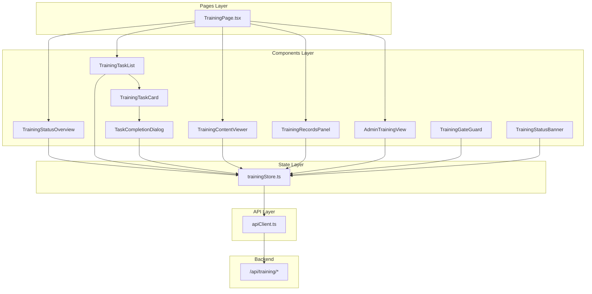
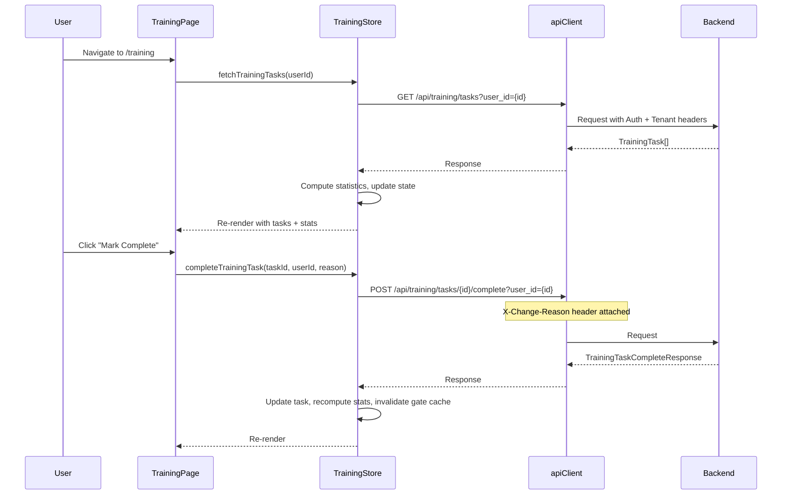
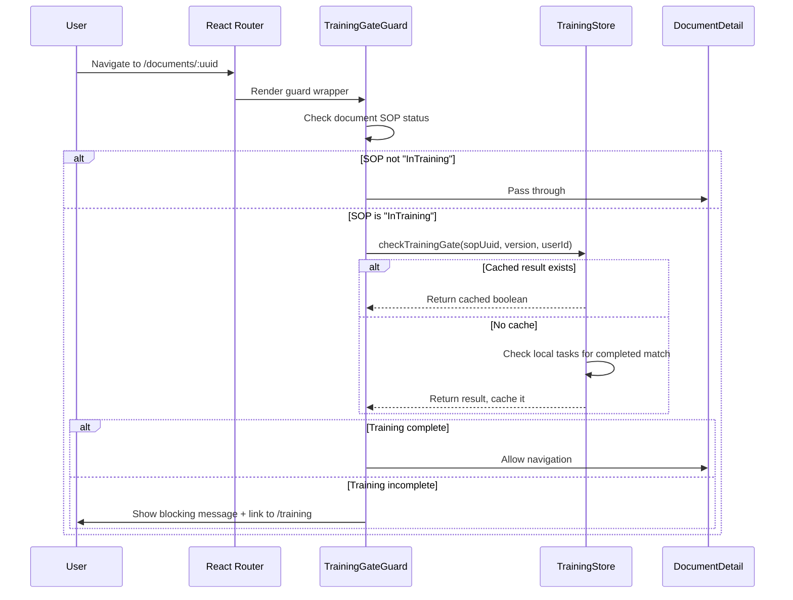

# Design Document: Training Management UI

## Overview

This design implements the frontend Training Management UI for AlcoaBase, replacing the placeholder `TrainingPage.tsx` with a fully functional training dashboard. The system integrates with the existing backend training service endpoints to provide:

- A training dashboard with statistics, task lists, and content viewing
- Task completion flow with ALCOA+ audit-compliant change reason capture
- Training content viewer for AI-generated materials (summary, quiz, procedural steps, safety points)
- Admin training status view with per-SOP progress tracking and content review
- Training Gate Guard for frontend route protection based on training completion
- Integration with the document detail page for inline training status banners

The UI follows the existing project patterns: Zustand for state management, React Router for navigation, Tailwind CSS for styling, and the `apiClient` wrapper for all API calls with proper auth/tenant/audit headers.

## Architecture

The Training Management UI follows a layered architecture consistent with the existing frontend:



### Data Flow



### Training Gate Guard Flow



## Components and Interfaces

### Component Hierarchy

```
TrainingPage (page-level)
├── TrainingStatusOverview
│   └── StatCard (×3: Pending, Completed, Total)
├── Tab Navigation ("My Tasks" | "Records" | "Admin: SOP Training Status")
├── [Tab: My Tasks]
│   ├── TrainingTaskList
│   │   ├── FilterControls (All | Pending | Completed)
│   │   └── TrainingTaskCard (×N)
│   │       └── TaskCompletionDialog (modal, on "Mark Complete")
│   └── TrainingContentViewer (side panel or below)
│       ├── ContentSummary
│       ├── ProceduralSteps
│       ├── SafetyPoints
│       └── QuizQuestions
├── [Tab: Records]
│   └── TrainingRecordsPanel
│       └── RecordGroup (×N, collapsible per SOP)
└── [Tab: Admin] (admin-only)
    └── AdminTrainingView
        ├── SOPSelector
        ├── ProgressBar
        ├── UserBreakdownTable
        └── ContentReviewSection
            └── TrainingContentViewer (with approve/reject)

TrainingGateGuard (route wrapper, used in App.tsx)
TrainingStatusBanner (embedded in DocumentDetail page)
```

### Component Interfaces

```typescript
// TrainingStatusOverview
interface TrainingStatusOverviewProps {
  pending: number;
  completed: number;
  total: number;
  completionPercentage: number | null; // null when total is 0
  isLoading: boolean;
}

// TrainingTaskList
interface TrainingTaskListProps {
  tasks: TrainingTask[];
  filter: TaskFilter;
  onFilterChange: (filter: TaskFilter) => void;
  onTaskSelect: (task: TrainingTask) => void;
  onMarkComplete: (task: TrainingTask) => void;
  selectedTaskId: number | null;
  isLoading: boolean;
  error: string | null;
  onRetry: () => void;
}

// TrainingTaskCard
interface TrainingTaskCardProps {
  task: TrainingTask;
  isSelected: boolean;
  onSelect: () => void;
  onMarkComplete: () => void;
}

// TaskCompletionDialog
interface TaskCompletionDialogProps {
  task: TrainingTask;
  isOpen: boolean;
  onClose: () => void;
  onConfirm: (changeReason: string) => void;
  isSubmitting: boolean;
  error: string | null;
}

// TrainingContentViewer
interface TrainingContentViewerProps {
  content: TrainingContent | null;
  isLoading: boolean;
  error: string | null;
  onRetry: () => void;
  mode: 'view' | 'review'; // 'review' shows approve/reject buttons
  onApprove?: (notes: string) => void;
  onReject?: (notes: string) => void;
  isReviewing?: boolean;
}

// TrainingRecordsPanel
interface TrainingRecordsPanelProps {
  tasks: TrainingTask[];
  isLoading: boolean;
  error: string | null;
  onRetry: () => void;
}

// AdminTrainingView
interface AdminTrainingViewProps {
  isAdmin: boolean;
}

// TrainingGateGuard
interface TrainingGateGuardProps {
  sopDocumentUuid: string;
  sopVersion: string;
  sopStatus: string;
  sopName: string;
  children: React.ReactNode;
}

// TrainingStatusBanner
interface TrainingStatusBannerProps {
  sopDocumentUuid: string;
  sopVersion: string;
  sopName: string;
  sopStatus: string;
}
```

### File Structure

```
src/frontend/src/
├── components/training/
│   ├── TrainingStatusOverview.tsx
│   ├── TrainingTaskList.tsx
│   ├── TrainingTaskCard.tsx
│   ├── TaskCompletionDialog.tsx
│   ├── TrainingContentViewer.tsx
│   ├── TrainingRecordsPanel.tsx
│   ├── AdminTrainingView.tsx
│   ├── TrainingGateGuard.tsx
│   ├── TrainingStatusBanner.tsx
│   └── index.ts
├── stores/
│   └── trainingStore.ts
└── pages/
    └── TrainingPage.tsx (replace placeholder)
```

## Data Models

### Frontend TypeScript Types

```typescript
// Training task from API response
interface TrainingTask {
  id: number;
  sop_document_uuid: string;
  sop_version: string;
  assigned_user_id: number;
  task_title: string;
  is_completed: boolean;
  completed_at: string | null;
}

// Training status from API response
interface TrainingStatus {
  sop_document_uuid: string;
  sop_version: string;
  total_tasks: number;
  completed_tasks: number;
  is_complete: boolean;
}

// Training content from API response
interface TrainingContent {
  content_id: string;
  sop_document_uuid: string;
  sop_version: string;
  summary: string;
  quiz_questions: QuizQuestion[];
  procedural_steps: ProceduralStep[];
  safety_points: string[];
  status: 'draft' | 'pending_review' | 'approved' | 'rejected';
  generated_at: string;
  reviewed_by: number | null;
  reviewed_at: string | null;
  review_notes: string;
}

interface QuizQuestion {
  question_id: string;
  question: string;
  correct_answer: string;
  distractors: string[];
  sop_section_ref: string;
}

interface ProceduralStep {
  step_number: number;
  description: string;
  is_safety_critical: boolean;
  safety_note: string;
}

// Filter type for task list
type TaskFilter = 'all' | 'pending' | 'completed';

// Training statistics (computed client-side)
interface TrainingStatistics {
  pending: number;
  completed: number;
  total: number;
  completionPercentage: number | null; // null when total is 0
}

// Gate cache entry
type GateCache = Record<string, boolean>; // key: `${sop_document_uuid}_${sop_version}`
```

### Zustand Store Shape

```typescript
interface TrainingStoreState {
  // Task state
  tasks: TrainingTask[];
  isLoadingTasks: boolean;
  tasksError: string | null;
  filter: TaskFilter;
  hasFetchedTasks: boolean; // tracks if initial fetch completed

  // Statistics (computed from tasks)
  statistics: TrainingStatistics;

  // Task completion
  isCompleting: boolean;
  completionError: string | null;

  // Content state
  currentContent: TrainingContent | null;
  isLoadingContent: boolean;
  contentError: string | null;

  // Admin status
  sopStatus: TrainingStatus | null;
  isLoadingStatus: boolean;
  statusError: string | null;

  // Content review
  pendingReviewItems: TrainingContent[];
  isReviewing: boolean;
  reviewError: string | null;

  // Gate state
  gateCache: GateCache;
  isCheckingGate: boolean;

  // Actions
  fetchTrainingTasks: (userId: number) => Promise<void>;
  completeTrainingTask: (taskId: number, userId: number, changeReason: string) => Promise<boolean>;
  fetchTrainingContent: (contentId: string) => Promise<void>;
  fetchTrainingStatus: (sopUuid: string, version: string) => Promise<void>;
  approveContent: (contentId: string, reviewerId: number, notes: string) => Promise<boolean>;
  rejectContent: (contentId: string, reviewerId: number, notes: string) => Promise<boolean>;
  setFilter: (filter: TaskFilter) => void;
  checkTrainingGate: (sopDocumentUuid: string, sopVersion: string, userId: number) => boolean | null;
  clearGateCache: () => void;
}
```

### API Endpoint Mapping

| Store Action | HTTP Method | Endpoint | Headers |
|---|---|---|---|
| `fetchTrainingTasks` | GET | `/api/training/tasks?user_id={id}` | Auth, Tenant |
| `completeTrainingTask` | POST | `/api/training/tasks/{taskId}/complete?user_id={id}` | Auth, Tenant, X-Change-Reason |
| `fetchTrainingContent` | GET | `/api/training/content/{contentId}` | Auth, Tenant |
| `fetchTrainingStatus` | GET | `/api/training/status/{sopUuid}/{version}` | Auth, Tenant |
| `approveContent` | POST | `/api/training/content/{contentId}/approve` | Auth, Tenant, X-Change-Reason |
| `rejectContent` | POST | `/api/training/content/{contentId}/reject` | Auth, Tenant, X-Change-Reason |


## Correctness Properties

*A property is a characteristic or behavior that should hold true across all valid executions of a system—essentially, a formal statement about what the system should do. Properties serve as the bridge between human-readable specifications and machine-verifiable correctness guarantees.*

### Property 1: Statistics computation is correct

*For any* array of TrainingTask objects, the computed statistics SHALL satisfy: `pending` equals the count of tasks where `is_completed` is false, `completed` equals the count of tasks where `is_completed` is true, `total` equals the array length, and `completionPercentage` equals `Math.round(completed / total * 100)` when total > 0, or `null` when total is 0.

**Validates: Requirements 1.1, 1.5**

### Property 2: Title truncation preserves content within bounds

*For any* string, the truncation function SHALL return the original string unchanged if its length is 80 characters or fewer, and SHALL return the first 80 characters followed by "…" (ellipsis) if its length exceeds 80 characters.

**Validates: Requirements 2.1**

### Property 3: Client-side filtering returns correct subset

*For any* array of TrainingTask objects and any filter value ("all", "pending", "completed"), the filtered result SHALL contain: all tasks when filter is "all", only tasks where `is_completed` is false when filter is "pending", and only tasks where `is_completed` is true when filter is "completed". The filtered result SHALL be a subset of the original array.

**Validates: Requirements 2.3, 5.2**

### Property 4: Task sorting maintains ordering invariants

*For any* array of TrainingTask objects, the sorted result SHALL place all pending tasks (is_completed=false) before all completed tasks (is_completed=true). Within the pending group, tasks SHALL be ordered by `created_at` ascending. Within the completed group, tasks SHALL be ordered by `completed_at` descending.

**Validates: Requirements 2.4**

### Property 5: Bounded-length input validation

*For any* string input and bounds (minLength, maxLength), after trimming leading and trailing whitespace, the validation function SHALL return valid=true if and only if the trimmed length is >= minLength AND <= maxLength. Specifically: for change reason (min=3, max=500) and for rejection notes (min=10, max=1000).

**Validates: Requirements 3.2, 7.4**

### Property 6: Content ID derivation is deterministic

*For any* `sop_document_uuid` string and `sop_version` string, the derived content ID SHALL equal `${sop_document_uuid}_v${sop_version}`, and this derivation SHALL be a pure function (same inputs always produce same output).

**Validates: Requirements 4.1**

### Property 7: Content sections render only when non-empty

*For any* TrainingContent object with status "approved", the rendered output SHALL include a section if and only if that section's data is non-empty: summary section if `summary` is non-empty, procedural steps section if `procedural_steps` array length > 0, safety points section if `safety_points` array length > 0, and quiz section if `quiz_questions` array length > 0.

**Validates: Requirements 4.2**

### Property 8: Quiz answer options preserve the complete answer set

*For any* QuizQuestion, the displayed answer options SHALL contain exactly the set `{correct_answer} ∪ {distractors}` — no duplicates added, no options removed. The total count of displayed options SHALL equal `1 + distractors.length`.

**Validates: Requirements 4.4**

### Property 9: Training record validity determination

*For any* set of completed training tasks grouped by `sop_document_uuid`, a record is "valid" if and only if it has the highest `sop_version` (lexicographically or numerically) among all completed tasks for that same `sop_document_uuid`. All other records for the same SOP SHALL be marked "invalidated".

**Validates: Requirements 5.3**

### Property 10: Records sorting maintains order for each sort key

*For any* array of training records and any sort key (sop_document_uuid alphabetical, completion_date newest-first, sop_version descending), the sorted output SHALL satisfy the ordering invariant for the selected key: for adjacent elements at indices i and i+1, `records[i][key] >= records[i+1][key]` (for descending) or `records[i][key] <= records[i+1][key]` (for ascending).

**Validates: Requirements 5.4**

### Property 11: Records grouping produces correct partitions

*For any* array of training records, grouping by `sop_document_uuid` SHALL produce groups where: every record within a group has the same `sop_document_uuid`, no two groups share the same `sop_document_uuid`, and the union of all groups equals the original array (no records lost or duplicated).

**Validates: Requirements 5.6**

### Property 12: SOP selector contains unique pairs

*For any* array of TrainingTask objects, the derived SOP selector options SHALL contain only unique `(sop_document_uuid, sop_version)` pairs with no duplicates, and every unique pair present in the tasks array SHALL appear in the selector options.

**Validates: Requirements 6.7**

### Property 13: Training gate enforcement scope

*For any* document with an associated SOP status, the Training_Gate_Guard SHALL perform a training check if and only if the SOP status equals "InTraining". For all other statuses ("Active", "Draft", or any other value), the guard SHALL pass through without checking training.

**Validates: Requirements 8.1, 8.7**

### Property 14: Training gate check with caching

*For any* `sop_document_uuid`, `sop_version`, and tasks array, `checkTrainingGate` SHALL return `true` if the tasks array contains at least one task where `sop_document_uuid` matches AND `sop_version` matches AND `is_completed` is true; otherwise it SHALL return `false`. Once computed, subsequent calls with the same parameters SHALL return the cached result without recomputation.

**Validates: Requirements 8.4, 9.5**

### Property 15: Gate cache invalidation on task completion

*For any* gate cache state and a completed task with `sop_document_uuid` D and `sop_version` V, after `completeTrainingTask` succeeds, the gate cache entry for key `${D}_${V}` SHALL be removed (invalidated), while all other cache entries SHALL remain unchanged.

**Validates: Requirements 9.4**

### Property 16: Error message extraction from API errors

*For any* ApiError instance, the extraction function SHALL: parse the body as JSON and return the `detail` field if it exists, fall back to the `message` field if `detail` is absent, fall back to the raw body string if JSON parsing fails, and fall back to the Error message property if body is empty.

**Validates: Requirements 9.7**

### Property 17: Request deduplication prevents concurrent fetches

*For any* store state where `isLoadingTasks` is true, calling `fetchTrainingTasks` SHALL NOT initiate a new API request. The same applies to all other fetch actions with their corresponding loading flags.

**Validates: Requirements 12.6**

### Property 18: Task card aria-label format

*For any* TrainingTask, the generated aria-label SHALL equal `"${task_title} - ${status}"` where status is "Pending" when `is_completed` is false and "Completed" when `is_completed` is true.

**Validates: Requirements 11.3**

## Error Handling

### Error Classification and Response

| Error Type | HTTP Status | User Message | Retry Available | Action |
|---|---|---|---|---|
| Network error | No response / timeout | "Network error: Unable to reach the server. Please check your connection." | Yes | Show retry button |
| Server error | 500+ | "Server error: Something went wrong. Please try again later." | Yes | Show retry button |
| Access denied | 403 | "Access denied: You do not have permission to perform this action." | No | No retry button |
| Validation error | 400 | Backend `detail` message | No | Show inline error, retain form data |
| Not found | 404 | Context-specific message | No | Show informational message |
| Session expired | 401 (after refresh) | Redirect to login | No | apiClient handles redirect |

### Error Handling Patterns

1. **Store-level error extraction**: All store actions use a shared `extractErrorMessage` helper that parses ApiError bodies for the `detail` field, with fallbacks to raw message strings.

2. **Component-level error display**: Each component checks its corresponding error state from the store and renders an inline error panel with:
   - Error icon (AlertCircle from Lucide)
   - Error message text
   - Retry button (when applicable) that clears error state and re-invokes the action

3. **Dialog error handling**: The TaskCompletionDialog and rejection dialog retain user input on error, display the error below the form fields, and re-enable action buttons.

4. **Timeout handling**: The TrainingGateGuard implements a 10-second timeout. If no response is received within 10 seconds, it treats the check as failed and shows the network error state.

5. **Request deduplication**: Each fetch action checks its corresponding `isLoading` flag before initiating a request. If already loading, the call is a no-op.

### Error State Recovery

```typescript
// Pattern used across all components
function ErrorPanel({ message, onRetry }: { message: string; onRetry?: () => void }) {
  return (
    <div role="alert" aria-live="assertive" className="...">
      <AlertCircle className="h-4 w-4" aria-hidden="true" />
      <p>{message}</p>
      {onRetry && (
        <button onClick={onRetry} aria-label="Retry loading">
          Retry
        </button>
      )}
    </div>
  );
}
```

## Testing Strategy

### Property-Based Tests (Vitest + fast-check)

Property-based testing is appropriate for this feature because it contains multiple pure computation functions (statistics, filtering, sorting, validation, grouping) where universal properties hold across a wide input space.

**Library**: `fast-check` with Vitest
**Configuration**: Minimum 100 iterations per property test
**Tag format**: `Feature: training-management-ui, Property {N}: {description}`

Property tests target the following pure logic modules:
- `computeStatistics(tasks: TrainingTask[]): TrainingStatistics`
- `truncateTitle(title: string, maxLength: number): string`
- `filterTasks(tasks: TrainingTask[], filter: TaskFilter): TrainingTask[]`
- `sortTasks(tasks: TrainingTask[]): TrainingTask[]`
- `validateInputLength(input: string, min: number, max: number): boolean`
- `deriveContentId(sopUuid: string, version: string): string`
- `shouldRenderSection(data: unknown[]): boolean`
- `shuffleAnswerOptions(question: QuizQuestion): string[]`
- `determineRecordValidity(records: TrainingTask[]): ValidityMap`
- `sortRecords(records: TrainingRecord[], key: SortKey): TrainingRecord[]`
- `groupRecordsBySop(records: TrainingRecord[]): Record<string, TrainingRecord[]>`
- `deriveUniqueSopPairs(tasks: TrainingTask[]): SopVersionPair[]`
- `shouldEnforceGate(sopStatus: string): boolean`
- `checkGateFromTasks(tasks: TrainingTask[], uuid: string, version: string): boolean`
- `extractErrorMessage(error: unknown): string`
- `formatAriaLabel(task: TrainingTask): string`

### Unit Tests (Vitest + React Testing Library)

Unit tests cover:
- Component rendering in various states (loading, error, empty, populated)
- User interactions (click handlers, dialog open/close, filter selection)
- Accessibility attributes (ARIA roles, labels, live regions)
- Focus management (dialog focus trap, focus return)
- Keyboard navigation (Escape to close, Tab order)

### Integration Tests (Vitest + MSW)

Integration tests cover:
- Store actions with mocked API responses (success and error paths)
- Full user flows: navigate → load tasks → select task → view content → mark complete
- Training Gate Guard with mocked store state
- Document detail page banner integration

### Test File Organization

```
src/frontend/src/__tests__/
├── stores/
│   └── trainingStore.test.ts          # Store action tests with mocked API
├── components/training/
│   ├── TrainingStatusOverview.test.tsx
│   ├── TrainingTaskList.test.tsx
│   ├── TrainingTaskCard.test.tsx
│   ├── TaskCompletionDialog.test.tsx
│   ├── TrainingContentViewer.test.tsx
│   ├── TrainingRecordsPanel.test.tsx
│   ├── AdminTrainingView.test.tsx
│   ├── TrainingGateGuard.test.tsx
│   └── TrainingStatusBanner.test.tsx
├── properties/
│   └── training.property.test.ts      # All property-based tests
└── pages/
    └── TrainingPage.test.tsx           # Page-level integration tests
```
