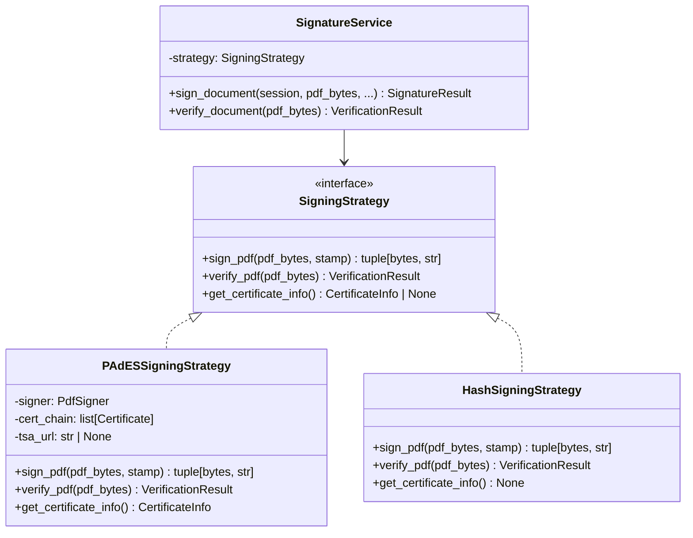
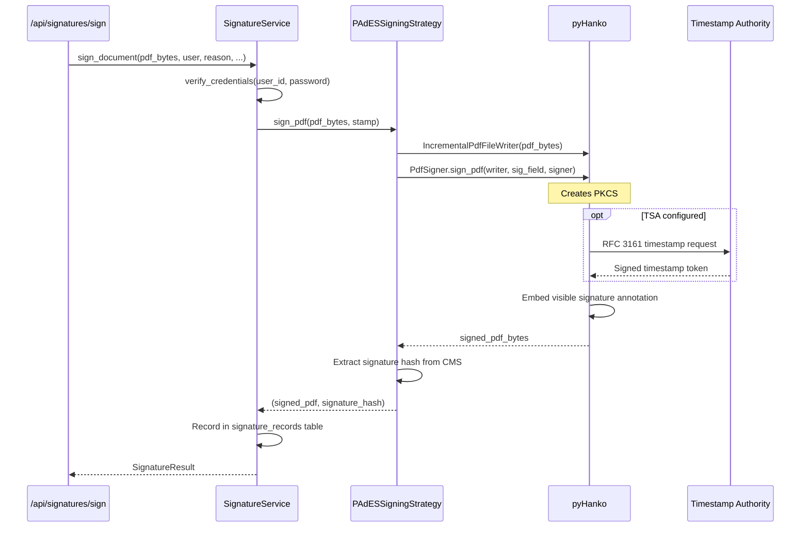
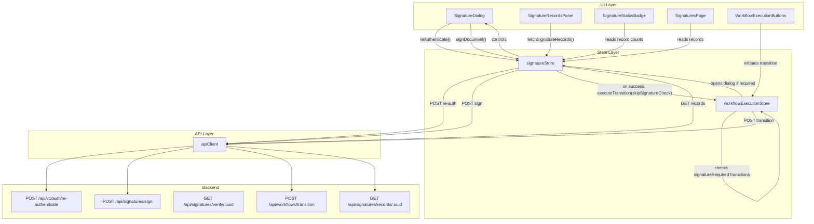
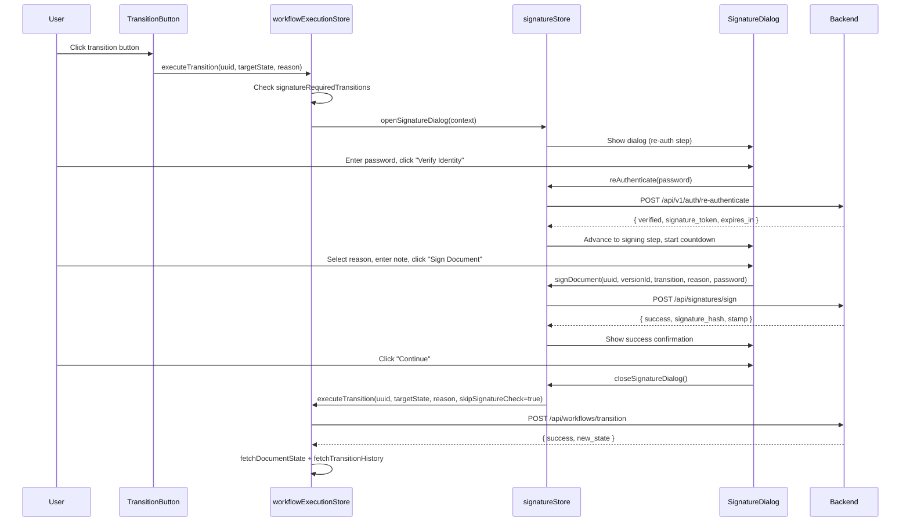

# Design Document: Electronic Signatures UI

## Overview

This design implements the Electronic Signatures system for AlcoaBase, covering both the frontend UI and the backend upgrade to real cryptographic PAdES signatures. The system provides a complete 21 CFR Part 11 / EU Annex 11 / eIDAS compliant electronic signature experience.

The implementation includes:
- **Backend**: Upgrade from SHA-256 hash-based signing to real asymmetric cryptographic PAdES-B-LT signatures using pyHanko + x.509 certificates, configurable via `SIGNATURE_MODE` environment variable
- **Frontend**: A modal Signature Dialog that intercepts workflow transitions requiring signatures, re-authentication with a 120-second token countdown, reason selection (Author/Review/Approval), PAdES signing execution, signature records display, status badges, verification UI, and a dedicated Signatures Overview page

The design follows existing patterns: Zustand for state management, Tailwind CSS with shadcn-style components, Lucide React icons, and the shared `apiClient` for all HTTP communication.

## Backend Signature Architecture

### Configuration (.env)

```bash
# Signature mode: "pades" (production, real crypto) or "hash" (dev/test, SHA-256 only)
SIGNATURE_MODE=hash

# Required when SIGNATURE_MODE=pades:
SIGNATURE_KEY_PATH=/certs/signing-key.pem
SIGNATURE_CERT_PATH=/certs/signing-cert-chain.pem
SIGNATURE_KEY_PASSWORD=              # empty for unencrypted keys

# Optional: RFC 3161 Timestamp Authority for long-term validation
SIGNATURE_TSA_URL=http://timestamp.digicert.com
```

### Signing Strategy Pattern



### PAdES Signing Flow (pyHanko)



### Database Schema Extension

```sql
-- Migration: add certificate fields to signature_records
ALTER TABLE signature_records
    ADD COLUMN certificate_subject VARCHAR(500) NULL,
    ADD COLUMN certificate_issuer VARCHAR(500) NULL,
    ADD COLUMN certificate_serial VARCHAR(128) NULL,
    ADD COLUMN signature_mode VARCHAR(10) NOT NULL DEFAULT 'hash';
```

### New Endpoint: Signature Verification

```
GET /api/signatures/verify/{document_uuid}

Response:
{
  "is_valid": true,
  "signature_count": 2,
  "signatures": [
    {
      "signer_name": "John Doe",
      "signed_at": "2025-01-15T10:30:00Z",
      "reason": "Approval: Approved by QA Manager",
      "is_valid": true,
      "certificate_subject": "CN=John Doe, O=ALC Corp, C=DE",
      "certificate_issuer": "CN=ALC Internal CA, O=ALC Corp, C=DE"
    }
  ],
  "tampered_from_index": -1
}
```

## Architecture



### Flow Sequence: Signature-Required Transition



## Components and Interfaces

### New Components

| Component | Path | Responsibility |
|-----------|------|----------------|
| `SignatureDialog` | `src/frontend/src/components/signatures/SignatureDialog.tsx` | Modal dialog orchestrating re-auth → reason → sign → success flow |
| `ReAuthForm` | `src/frontend/src/components/signatures/ReAuthForm.tsx` | Password input with validation, loading, and error states |
| `ReasonSelector` | `src/frontend/src/components/signatures/ReasonSelector.tsx` | Reason category dropdown + signature note input with character counter |
| `TokenCountdown` | `src/frontend/src/components/signatures/TokenCountdown.tsx` | Visual countdown timer with warning state at ≤30s |
| `SignatureRecordsPanel` | `src/frontend/src/components/signatures/SignatureRecordsPanel.tsx` | Collapsible panel showing signature records on document detail |
| `SignatureStatusBadge` | `src/frontend/src/components/signatures/SignatureStatusBadge.tsx` | Badge with pen icon + count for document list items |
| `SignaturesPage` | `src/frontend/src/pages/SignaturesPage.tsx` | Full page with paginated, filterable, sortable signature records |

### Modified Components/Stores

| File | Change |
|------|--------|
| `workflowExecutionStore.ts` | Add `skipSignatureCheck` parameter to `executeTransition`; add signature-required check logic |
| `WorkflowExecutionButtons` (in workflows/) | Add signature icon indicators on transition buttons |
| Document detail page | Integrate `SignatureRecordsPanel` |
| Document list component | Integrate `SignatureStatusBadge` |

### New Store

| Store | Path | Responsibility |
|-------|------|----------------|
| `signatureStore` | `src/frontend/src/stores/signatureStore.ts` | Manages re-auth, signing, token lifecycle, records, dialog state |

### Component Interfaces

```typescript
// SignatureDialog props
interface SignatureDialogProps {
  // Controlled by signatureStore.isDialogOpen — no props needed
  // Reads all state from signatureStore
}

// ReAuthForm props
interface ReAuthFormProps {
  onSuccess: () => void;
  isLocked: boolean;
  lockoutRemaining: number;
}

// ReasonSelector props
interface ReasonSelectorProps {
  reasonCategory: string;
  signatureNote: string;
  onReasonCategoryChange: (category: string) => void;
  onSignatureNoteChange: (note: string) => void;
  disabled: boolean;
}

// TokenCountdown props
interface TokenCountdownProps {
  remainingSeconds: number;
}

// SignatureRecordsPanel props
interface SignatureRecordsPanelProps {
  documentUuid: string;
}

// SignatureStatusBadge props
interface SignatureStatusBadgeProps {
  documentUuid: string;
  signatureCount: number;
  latestSigner?: {
    displayName: string;
    transition: string;
    signedAt: string;
  };
}
```

## Data Models

### TypeScript Types (new file: `src/frontend/src/types/signature.ts`)

```typescript
/** Reason categories compliant with 21 CFR Part 11 */
export type SignatureReasonCategory = "Author" | "Review" | "Approval";

/** Response from POST /api/signatures/sign */
export interface SignResponse {
  success: boolean;
  signature_hash: string;
  signature_record_id: number | null;
  stamp: SignatureStamp;
  certificate_subject?: string | null;
  certificate_issuer?: string | null;
  certificate_serial?: string | null;
}

/** Visual stamp data embedded in the signed PDF */
export interface SignatureStamp {
  signer_name: string;
  signed_at: string; // ISO 8601
  reason: string;
  transition: string;
}

/** Response from GET /api/signatures/records/{document_uuid} */
export interface SignatureRecordResponse {
  id: number;
  document_uuid: string;
  signer_user_id: number;
  transition: string;
  reason: string | null;
  signed_at: string; // ISO 8601
  signature_hash: string;
  certificate_subject?: string | null;
  certificate_issuer?: string | null;
  certificate_serial?: string | null;
  signature_mode?: "pades" | "hash";
}

/** Response from GET /api/signatures/verify/{document_uuid} */
export interface VerifyResponse {
  is_valid: boolean;
  signature_count: number;
  signatures: VerifySignatureEntry[];
  tampered_from_index: number;
}

export interface VerifySignatureEntry {
  signer_name: string;
  signed_at: string;
  reason: string;
  is_valid: boolean;
  certificate_subject?: string | null;
  certificate_issuer?: string | null;
}

/** Context passed when opening the signature dialog */
export interface SignatureDialogContext {
  document_uuid: string;
  document_version_id: number;
  transition: string;
  documentTitle: string;
}

/** Re-authentication response from POST /api/v1/auth/re-authenticate */
export interface ReAuthResponse {
  verified: boolean;
  signature_token: string;
  expires_in: number;
}
```

### Signature Store State Shape

```typescript
interface SignatureStoreState {
  // Re-authentication
  isReAuthenticating: boolean;
  reAuthError: string | null;
  signatureToken: string | null;
  tokenExpiresAt: number | null; // Unix timestamp ms

  // Signing
  isSigning: boolean;
  signError: string | null;
  lastSignResult: SignResponse | null;

  // Signature records (keyed by document_uuid)
  records: Record<string, SignatureRecordResponse[]>;
  isLoadingRecords: boolean;
  recordsError: string | null;

  // Token countdown
  remainingSeconds: number;

  // Dialog state
  isDialogOpen: boolean;
  dialogContext: SignatureDialogContext | null;

  // Password retained for signing step
  _password: string | null;

  // Actions
  openSignatureDialog: (context: SignatureDialogContext) => void;
  closeSignatureDialog: () => void;
  reAuthenticate: (password: string) => Promise<void>;
  signDocument: (
    document_uuid: string,
    document_version_id: number,
    transition: string,
    reason: string,
    password: string
  ) => Promise<void>;
  fetchSignatureRecords: (document_uuid: string) => Promise<void>;
  startTokenCountdown: () => void;
  clearToken: () => void;
  reset: () => void;
}
```

### Modified `executeTransition` Signature

```typescript
// Updated signature in workflowExecutionStore
executeTransition: (
  documentUuid: string,
  targetState: string,
  changeReason: string,
  skipSignatureCheck?: boolean  // NEW — default false
) => Promise<boolean>;
```

### Signatures Page Pagination/Filter State

```typescript
interface SignaturesPageState {
  page: number;
  pageSize: number; // fixed at 25
  totalCount: number;
  sortField: "signed_at" | "signer_user_id" | "document_uuid";
  sortDirection: "asc" | "desc";
  filters: {
    documentUuid: string;
    transition: string;
    dateStart: string | null;
    dateEnd: string | null;
  };
}
```


## Correctness Properties

*A property is a characteristic or behavior that should hold true across all valid executions of a system — essentially, a formal statement about what the system should do. Properties serve as the bridge between human-readable specifications and machine-verifiable correctness guarantees.*

### Property 1: Transition signature-required matching

*For any* current workflow state, target state, and array of signature-required transition names (formatted as "Source→Target"), the matching function SHALL return true if and only if there exists a transition in the array whose source matches the current state and whose target matches the target state.

**Validates: Requirements 1.1, 10.1**

### Property 2: Token countdown warning threshold

*For any* positive integer representing remaining seconds, the countdown display SHALL show a warning indicator if and only if the value is less than or equal to 30.

**Validates: Requirements 3.2, 3.3**

### Property 3: Signature note validation

*For any* string input, the signature note validation function SHALL return valid if and only if the trimmed string (leading and trailing whitespace removed) has a length of at least 3 characters AND the raw (untrimmed) string has a length of at most 200 characters.

**Validates: Requirements 4.2, 4.4**

### Property 4: Reason string formatting

*For any* valid reason category (one of "Author", "Review", "Approval") and any valid signature note (passing validation), the formatting function SHALL produce a string equal to "{Category}: {trimmedNote}" where trimmedNote is the note with leading and trailing whitespace removed.

**Validates: Requirements 4.5**

### Property 5: Sign button enablement

*For any* combination of reason category selection and signature note text, the "Sign Document" button SHALL be enabled if and only if the category is one of the three valid values (not the placeholder) AND the signature note passes validation (trimmed length ≥ 3).

**Validates: Requirements 4.6**

### Property 6: Error message extraction from ApiError

*For any* ApiError instance with a `body` string, the error extraction function SHALL return the `detail` field value if the body is valid JSON containing a `detail` string field; otherwise it SHALL return the ApiError's `message` property.

**Validates: Requirements 5.5, 9.9**

### Property 7: Signature records sorting

*For any* non-empty array of signature records with `signed_at` timestamps, the sort function SHALL produce an array where each element's `signed_at` is greater than or equal to the next element's `signed_at` (descending order). When sort direction is ascending, each element's `signed_at` SHALL be less than or equal to the next element's.

**Validates: Requirements 6.3, 8.4**

### Property 8: Badge count display

*For any* non-negative integer signature count, the badge display function SHALL return the string representation of the count when count ≤ 99, and SHALL return "99+" when count > 99.

**Validates: Requirements 7.2**

### Property 9: Signature records filtering

*For any* array of signature records and any combination of filter criteria (document UUID substring, transition name, date range start, date range end), the filter function SHALL return only records that satisfy ALL active (non-empty) filter criteria simultaneously. A record passes the document UUID filter if its document_uuid contains the filter substring (case-insensitive). A record passes the transition filter if its transition equals the filter value. A record passes the date range filter if its signed_at falls within the inclusive start/end bounds.

**Validates: Requirements 8.3**

### Property 10: Signing strategy selection

*For any* value of the `SIGNATURE_MODE` environment variable, the strategy factory SHALL return a `PAdESSigningStrategy` instance if and only if the value equals "pades" (case-sensitive). For all other values (including "hash", empty string, or undefined), the factory SHALL return a `HashSigningStrategy` instance.

**Validates: Requirements 11.1, 11.7**

### Property 11: PAdES signature round-trip integrity

*For any* valid PDF byte sequence and any valid signing parameters, signing the PDF with `PAdESSigningStrategy` and then verifying the result with `verify_pdf` SHALL return `is_valid=True` with exactly one more signature than the input had. Modifying any byte of the signed PDF after signing SHALL cause `verify_pdf` to return `is_valid=False`.

**Validates: Requirements 11.2, 11.9**

### Property 12: Configuration validation at startup

*For any* configuration where `SIGNATURE_MODE` is "pades", the startup validator SHALL raise an error if and only if `SIGNATURE_KEY_PATH` is None/empty OR `SIGNATURE_CERT_PATH` is None/empty OR the key file does not exist OR the cert file does not exist OR the private key cannot be loaded OR the certificate does not match the private key.

**Validates: Requirements 11.3, 11.11**

## Error Handling

### Error Categories and User Messaging

| Error Source | HTTP Status | User Message | Recovery Action |
|---|---|---|---|
| Re-auth invalid password | 401 | "Invalid password. Please try again." | Clear password, re-focus input |
| Re-auth rate limited | 429 | "Account temporarily locked due to too many failed attempts." | Disable input for 60s with countdown |
| Re-auth network error | N/A | "Network error: Unable to reach the server. Please check your connection." | Retain password, re-enable form |
| Re-auth server error | 500/502/503 | "A server error occurred. Please try again shortly." | Retain password, re-enable form |
| Sign auth expired | 401 | "Authentication expired. Please re-authenticate." | Return to re-auth step, preserve reason |
| Sign validation error | 400 | Extract from `response.detail` or "An unexpected error occurred. Please try again." | Re-enable sign button |
| Sign network error | N/A | "Network error: Unable to complete the signing operation. Please check your connection and try again." | Re-enable sign button |
| Sign server error | 500/502/503 | "Server error: The signing service is temporarily unavailable. Please try again shortly." | Re-enable sign button |
| Transition failed post-sign | varies | "Transition failed despite signature being recorded. Please contact an administrator." | Show "Close" button only (no retry) |
| Records fetch failed | 4xx/5xx/network | "Unable to load signature records." | Show "Retry" button |
| Gate info unavailable | any | "Workflow gate information is unavailable." | Show "Retry" button to re-fetch gate info |

### Error Extraction Logic

```typescript
function extractErrorMessage(error: unknown): string {
  if (error instanceof ApiError) {
    try {
      const parsed = JSON.parse(error.body);
      return parsed.detail || parsed.message || error.message;
    } catch {
      return error.body || error.message;
    }
  }
  if (error instanceof Error) {
    return error.message;
  }
  return "An unexpected error occurred";
}
```

### Token Expiry Handling

When the signature token expires (countdown reaches 0):
1. Clear `signatureToken` and `tokenExpiresAt` from store
2. Disable the "Sign Document" button
3. Display "Session expired. Please re-authenticate to continue."
4. Show the Re_Auth_Form again
5. Preserve any previously entered reason category and signature note

### Concurrent Request Prevention

- Re-auth button disabled while `isReAuthenticating` is true
- Sign button disabled while `isSigning` is true
- Transition button disabled immediately on click to prevent duplicate dialog invocations
- `openSignatureDialog` closes any existing dialog before opening a new one

## Testing Strategy

### Property-Based Tests

Property-based testing is appropriate for this feature because several core functions are pure with clear input/output behavior and large input spaces (arbitrary strings, arrays of transition names, timestamps, error bodies).

**Library**: [fast-check](https://github.com/dubzzz/fast-check) (TypeScript PBT library)

**Configuration**: Minimum 100 iterations per property test.

**Tag format**: `Feature: Step_3-4_electronic-signatures-ui, Property {N}: {title}`

Each correctness property (1–9) maps to a single property-based test:

| Property | Function Under Test | Generator Strategy |
|----------|--------------------|--------------------|
| 1: Transition matching | `isSignatureRequired(currentState, targetState, transitions[])` | Random strings for states, random arrays of "X→Y" formatted strings |
| 2: Warning threshold | `shouldShowWarning(remainingSeconds)` | Random integers 1–120 |
| 3: Note validation | `isValidSignatureNote(note)` | Random strings including whitespace-heavy, empty, long strings |
| 4: Reason formatting | `formatSignatureReason(category, note)` | Random category from enum, random valid notes |
| 5: Button enablement | `isSignButtonEnabled(category, note)` | Random category (including placeholder), random strings |
| 6: Error extraction | `extractErrorMessage(apiError)` | Random JSON bodies with/without detail, invalid JSON, empty strings |
| 7: Records sorting | `sortSignatureRecords(records[], direction)` | Random arrays of records with random ISO timestamps |
| 8: Badge display | `formatBadgeCount(count)` | Random non-negative integers |
| 9: Records filtering | `filterSignatureRecords(records[], filters)` | Random records arrays, random filter criteria |

### Unit Tests (Example-Based)

Focus on specific scenarios, UI rendering, and integration points:

- **SignatureDialog**: Renders correct step (re-auth → reason → signing → success)
- **ReAuthForm**: Button disabled when empty, enabled when non-empty; error messages display correctly
- **ReasonSelector**: Dropdown has 3 options + placeholder; character counter updates
- **TokenCountdown**: Displays correct format; stops on sign success
- **SignatureRecordsPanel**: Renders records, empty state, loading skeletons, error with retry
- **SignatureStatusBadge**: Renders with correct count, tooltip on hover, aria-label
- **SignaturesPage**: Pagination controls, filter inputs, sort indicators, empty state
- **signatureStore actions**: State transitions for reAuthenticate, signDocument, fetchSignatureRecords, clearToken, reset, openSignatureDialog, closeSignatureDialog

### Integration Tests

- Full signing flow: open dialog → re-auth → select reason → sign → continue → transition executes
- Token expiry mid-flow: re-auth → wait for expiry → re-auth again → sign succeeds with preserved reason
- Transition interception: executeTransition detects signature-required → opens dialog
- skipSignatureCheck: executeTransition with flag=true bypasses check
- Records panel auto-refresh after signing
- Retroactive signature dialog when server returns requires_signature=true unexpectedly

### Test File Organization

```
src/frontend/src/
├── stores/__tests__/
│   ├── signatureStore.test.ts          # Store action unit tests
│   └── signatureStore.property.test.ts # Property tests for pure functions
├── components/signatures/__tests__/
│   ├── SignatureDialog.test.tsx
│   ├── ReAuthForm.test.tsx
│   ├── ReasonSelector.test.tsx
│   ├── TokenCountdown.test.tsx
│   ├── SignatureRecordsPanel.test.tsx
│   └── SignatureStatusBadge.test.tsx
├── pages/__tests__/
│   └── SignaturesPage.test.tsx
└── lib/__tests__/
    └── signatureUtils.property.test.ts # Property tests for utility functions
```
