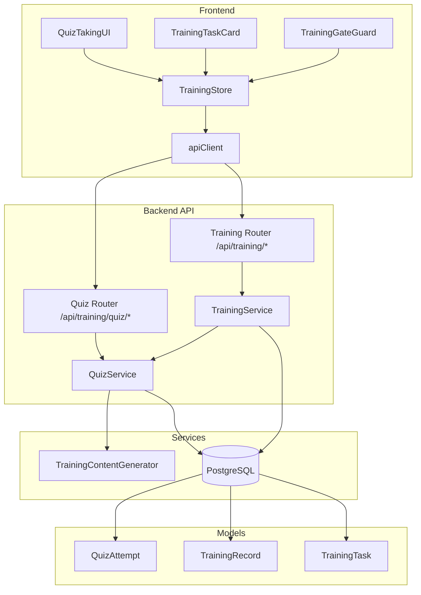

# Design Document: Training-Gated Access Control

## Overview

This design extends AlcoaBase's existing training enforcement (Phase 3.3) with a comprehension quiz requirement (Phase 3.5). Currently, users only need a completed `TrainingTask` and valid `TrainingRecord` to access regulated documents. Phase 3.5 adds a `QuizAttempt` model and requires users to pass an AI-generated quiz before they can mark their training task complete or pass the training gate.

The system leverages existing `TrainingContent.quiz_questions` (generated by the `TrainingContentGenerator`) and adds:
- A `QuizAttempt` SQLAlchemy model with `AuditMixin` for ALCOA+ compliance
- A `QuizService` for answer evaluation, scoring, and pass/fail determination
- Three new API endpoints under `/api/training/quiz/`
- Enhanced `TrainingService.complete_training_task` with quiz prerequisite check
- Enhanced `TrainingService.check_training_gate` with dual verification
- Frontend `QuizTakingUI` component, `TrainingTaskCard` guard, and enhanced `TrainingGateGuard`
- `TrainingStore` extensions for quiz state management

**Design Rationale:** The quiz gate is enforced at both the backend (authoritative) and frontend (UX) layers. The backend is the single source of truth — the frontend gate is a convenience to prevent unnecessary round-trips and provide clear user messaging. Quiz attempts are immutable for audit compliance, and version-specific `content_id` keys ensure users must re-qualify when SOP content changes.

## Architecture



**Request Flow — Quiz Submission:**
1. User answers questions in `QuizTakingUI`
2. `TrainingStore.submitQuiz()` sends `POST /api/training/quiz/submit` with `X-Change-Reason` header
3. `QuizService.evaluate_and_persist()` retrieves `TrainingContent`, compares answers, computes score, persists `QuizAttempt`
4. Response includes score, pass/fail, and correct answers for review
5. On pass: `TrainingStore` updates `quizPassCache`, invalidates gate cache

**Request Flow — Task Completion (with quiz guard):**
1. User clicks "Mark Complete" on `TrainingTaskCard`
2. `TrainingStore.completeTrainingTask()` sends `POST /api/training/tasks/{id}/complete`
3. `TrainingService.complete_training_task()` checks quiz pass via `QuizService`
4. If quiz not passed → HTTP 400; if passed → proceeds with existing completion flow

**Request Flow — Training Gate Check:**
1. User navigates to gated document route
2. `TrainingGateGuard` calls `TrainingStore.checkTrainingGate()` (checks cache first)
3. Backend `check_training_gate()` verifies both `TrainingRecord` validity AND `QuizAttempt.passed` for exact `content_id`
4. If either condition fails → HTTP 403 with specific message

## Components and Interfaces

### Backend Components

#### QuizAttempt Model (`src/backend/src/alcoabase/models/training.py`)

New SQLAlchemy model added to the existing training models file.

```python
class QuizAttempt(Base, AuditMixin):
    __tablename__ = "quiz_attempts"

    id: Mapped[int] = mapped_column(primary_key=True)
    user_id: Mapped[int] = mapped_column(ForeignKey("users.id"), index=True)
    content_id: Mapped[str] = mapped_column(String(255), index=True)
    sop_document_uuid: Mapped[str] = mapped_column(String(36), index=True)
    sop_version: Mapped[str] = mapped_column(String(20))
    answers: Mapped[dict] = mapped_column(JSON)  # {question_id: selected_answer}
    score: Mapped[int] = mapped_column()
    total_questions: Mapped[int] = mapped_column()
    passed: Mapped[bool] = mapped_column()
    attempted_at: Mapped[datetime] = mapped_column(
        DateTime(timezone=True), server_default=func.now()
    )
    company_id: Mapped[int] = mapped_column(ForeignKey("companies.id"))
```

#### QuizService (`src/backend/src/alcoabase/services/quiz_service.py`)

New service responsible for quiz evaluation logic.

```python
class QuizService:
    async def evaluate_and_persist(
        self, session: AsyncSession, content_id: str, user_id: int,
        answers: dict[str, str], company_id: int
    ) -> QuizAttempt: ...

    async def has_user_passed(
        self, session: AsyncSession, user_id: int, content_id: str
    ) -> bool: ...

    async def get_best_score(
        self, session: AsyncSession, user_id: int, content_id: str
    ) -> int | None: ...

    async def get_user_results(
        self, session: AsyncSession, user_id: int, content_id: str, limit: int = 50
    ) -> list[QuizAttempt]: ...

    def compute_pass_threshold(self, total_questions: int) -> int: ...
```

**Key Methods:**
- `evaluate_and_persist`: Retrieves `TrainingContent`, validates status is "approved", compares answers via exact string match, computes score, determines pass/fail using `ceil(total_questions * 0.8)`, persists `QuizAttempt`
- `has_user_passed`: Checks existence of any `QuizAttempt` with `passed=True` for user+content_id
- `compute_pass_threshold`: Pure function: `math.ceil(total_questions * 0.8)`

#### Quiz API Router (`src/backend/src/alcoabase/api/training.py`)

Three new endpoints added to the existing training router:

| Method | Path | Purpose |
|--------|------|---------|
| POST | `/api/training/quiz/submit` | Submit quiz answers for evaluation |
| GET | `/api/training/quiz/results/{content_id}` | Get quiz attempt history |
| GET | `/api/training/quiz/passed/{content_id}` | Lightweight pass check |

#### Enhanced TrainingService

Two methods modified:
- `complete_training_task`: Added quiz pass verification before marking complete
- `check_training_gate`: Added quiz pass verification alongside TrainingRecord check

### Frontend Components

#### QuizTakingUI (`src/frontend/src/components/training/QuizTakingUI.tsx`)

React component rendered within the `TrainingContentViewer`. States:
- **idle**: Shows "Take Quiz" button (or "Quiz Passed" badge if already passed)
- **taking**: Sequential question form with radio buttons, progress indicator
- **submitting**: Loading state on submit button
- **results**: Score display, per-question feedback, pass/fail messaging
- **error**: Error message with conditional retry

#### TrainingTaskCard Enhancement

The existing `TrainingTaskCard` component gains:
- Disabled "Mark Complete" button with tooltip when quiz not passed
- Loading spinner while checking quiz pass status
- Error icon with retry on network failure

#### TrainingGateGuard Enhancement

The existing `TrainingGateGuard` wrapper gains:
- Additional `checkQuizPassed` call alongside existing task completion check
- Specific messaging for "task complete but quiz not passed" state
- Combined cache key invalidation

#### TrainingStore Extensions

New state fields and actions added to the existing Zustand store:

```typescript
// New state
currentQuizAttempt: QuizAttemptResult | null;
isSubmittingQuiz: boolean;
quizSubmitError: string | null;
quizResults: Record<string, QuizAttemptResult[]>;
isLoadingQuizResults: boolean;
quizResultsError: string | null;
quizPassCache: Record<string, boolean>;
isCheckingQuizPass: boolean;
quizPassError: string | null;

// New actions
submitQuiz(contentId: string, userId: number, answers: Record<string, string>): Promise<QuizAttemptResult | null>;
fetchQuizResults(contentId: string, userId: number): Promise<void>;
checkQuizPassed(contentId: string, userId: number): Promise<boolean | null>;
clearQuizPassCache(): void;
```

## Data Models

### QuizAttempt Entity

| Field | Type | Constraints | Description |
|-------|------|-------------|-------------|
| id | integer | PK, auto-increment | Primary key |
| user_id | integer | FK → users.id, indexed | User who took the quiz |
| content_id | string(255) | indexed | Training content identifier (`{sop_uuid}_v{version}`) |
| sop_document_uuid | string(36) | indexed | SOP document reference |
| sop_version | string(20) | | SOP version string |
| answers | JSON | max 50 entries | Map of question_id → selected answer |
| score | integer | 0 ≤ score ≤ total_questions | Number of correct answers |
| total_questions | integer | ≥ 1 | Total questions in the quiz |
| passed | boolean | | score ≥ ceil(total_questions × 0.8) |
| attempted_at | datetime(tz) | server_default=now() | When the attempt was made |
| company_id | integer | FK → companies.id | Tenant isolation |

**Indexes:**
- `ix_quiz_attempts_user_id` on `user_id`
- `ix_quiz_attempts_content_id` on `content_id`
- `ix_quiz_attempts_sop_document_uuid` on `sop_document_uuid`
- Composite index on `(user_id, content_id, passed)` for fast pass checks

**Versioning:** Inherits `AuditMixin` → automatic `quiz_attempts_version` table via SQLAlchemy-Continuum.

**Immutability:** No UPDATE or DELETE operations exposed via API. The model is append-only.

### API Request/Response Schemas

#### POST /api/training/quiz/submit

**Request:**
```json
{
  "content_id": "abc123_v2.0",
  "user_id": 42,
  "answers": {
    "q1-uuid": "Selected answer text",
    "q2-uuid": "Another answer"
  }
}
```

**Response (200):**
```json
{
  "attempt_id": 1,
  "score": 4,
  "total_questions": 5,
  "passed": true,
  "passing_score_threshold": 0.8,
  "correct_answers": {
    "q1-uuid": "Correct answer text",
    "q2-uuid": "Correct answer text"
  },
  "attempted_at": "2024-01-15T10:30:00Z"
}
```

#### GET /api/training/quiz/results/{content_id}?user_id=42

**Response (200):**
```json
{
  "results": [
    {
      "attempt_id": 2,
      "score": 4,
      "total_questions": 5,
      "passed": true,
      "attempted_at": "2024-01-15T10:30:00Z",
      "answers": {"q1": "answer1", "q2": "answer2"}
    }
  ],
  "has_passed": true
}
```

#### GET /api/training/quiz/passed/{content_id}?user_id=42

**Response (200):**
```json
{
  "content_id": "abc123_v2.0",
  "user_id": 42,
  "has_passed": true,
  "best_score": 4
}
```

### Frontend Type Additions (`src/frontend/src/components/training/types.ts`)

```typescript
/** Quiz submission result from POST /api/training/quiz/submit */
export interface QuizAttemptResult {
  attempt_id: number;
  score: number;
  total_questions: number;
  passed: boolean;
  passing_score_threshold: number;
  correct_answers: Record<string, string>;
  attempted_at: string;
}

/** Quiz pass check from GET /api/training/quiz/passed/{content_id} */
export interface QuizPassStatus {
  content_id: string;
  user_id: number;
  has_passed: boolean;
  best_score: number | null;
}

/** Quiz results from GET /api/training/quiz/results/{content_id} */
export interface QuizResultsResponse {
  results: QuizAttemptHistoryEntry[];
  has_passed: boolean;
}

export interface QuizAttemptHistoryEntry {
  attempt_id: number;
  score: number;
  total_questions: number;
  passed: boolean;
  attempted_at: string;
  answers: Record<string, string>;
}
```

## Correctness Properties

*A property is a characteristic or behavior that should hold true across all valid executions of a system — essentially, a formal statement about what the system should do. Properties serve as the bridge between human-readable specifications and machine-verifiable correctness guarantees.*

### Property 1: Quiz attempt persistence round-trip

*For any* valid quiz attempt data (user_id, content_id, answers, score, total_questions, passed, company_id), persisting a `QuizAttempt` and then querying it back by id SHALL return a record with all fields matching the original input values.

**Validates: Requirements 1.1, 11.1**

### Property 2: Pass threshold computation

*For any* positive integer `total_questions` (≥ 1) and any integer `score` (0 ≤ score ≤ total_questions), the `passed` field SHALL be true if and only if `score >= ceil(total_questions * 0.8)`.

**Validates: Requirements 1.2**

### Property 3: Score computation with partial and extraneous answers

*For any* set of quiz questions (with known correct answers) and any submitted answers map (which may be missing some question_ids or contain extra question_ids not in the quiz), the computed score SHALL equal the count of submitted answers where the question_id exists in the quiz AND the submitted answer exactly matches (case-sensitive) the correct answer for that question_id.

**Validates: Requirements 2.2, 2.5, 2.6**

### Property 4: Attempt history completeness

*For any* sequence of N quiz attempts submitted by the same user for the same content_id (with varying scores and pass/fail outcomes), querying the results SHALL return all N attempts as separate records, preserving both passed and failed attempts.

**Validates: Requirements 1.4, 11.3**

### Property 5: has_passed aggregation

*For any* list of quiz attempts for a given user and content_id, the `has_passed` field SHALL be true if and only if at least one attempt in the list has `passed` equal to true.

**Validates: Requirements 3.3, 4.2**

### Property 6: best_score computation

*For any* non-empty list of quiz attempts for a given user and content_id, the `best_score` field SHALL equal the maximum `score` value among all attempts. For an empty list, `best_score` SHALL be null.

**Validates: Requirements 4.3**

### Property 7: Results ordering

*For any* set of quiz attempts for a given user and content_id, the results list SHALL be ordered by `attempted_at` descending (most recent first) and limited to the 50 most recent attempts.

**Validates: Requirements 3.1**

### Property 8: Quiz attempt immutability

*For any* persisted `QuizAttempt` record, any attempt to update or delete the record via the API SHALL be rejected with HTTP 405, and the record SHALL remain unchanged in the database.

**Validates: Requirements 11.2**

### Property 9: Task completion requires quiz pass

*For any* training task and user, attempting to complete the task SHALL succeed only if the user has at least one `QuizAttempt` with `passed=true` for the content_id derived from the task's `sop_document_uuid` and `sop_version`. If no passing attempt exists, the completion SHALL be rejected with HTTP 400.

**Validates: Requirements 5.1**

### Property 10: Backend training gate dual verification

*For any* user, SOP document, and SOP version, the `check_training_gate` method SHALL allow the action if and only if BOTH a valid `TrainingRecord` exists (where `is_valid=true`) AND at least one `QuizAttempt` with `passed=true` exists for the derived content_id. If either condition fails, it SHALL raise HTTP 403.

**Validates: Requirements 6.1**

### Property 11: Frontend training gate dual verification

*For any* user navigating to a gated document route, the `TrainingGateGuard` SHALL allow navigation if and only if BOTH the user has a completed training task for the SOP version AND the user has passed the quiz for the corresponding content_id. If either condition fails, navigation SHALL be blocked with the appropriate message.

**Validates: Requirements 9.1**

### Property 12: Version-specific quiz pass enforcement

*For any* user who has passed the quiz for content_id `{sop_uuid}_v{N}`, the training gate for a different version `{sop_uuid}_v{M}` (where M ≠ N) SHALL deny access, because quiz pass status is evaluated exclusively by exact content_id match.

**Validates: Requirements 12.1, 12.2**

### Property 13: Quiz pass cache consistency

*For any* sequence of `checkQuizPassed` calls for the same content_id, the first call SHALL make a network request and cache the result. Subsequent calls with the same content_id SHALL return the cached value without making additional network requests, until the cache is explicitly invalidated.

**Validates: Requirements 10.5**

### Property 14: Gate cache invalidation on state change

*For any* state change event (quiz pass or task completion) for a given SOP document and version, the corresponding gate cache entry AND quizPassCache entry for the derived content_id SHALL be invalidated, causing subsequent gate checks to fetch fresh data from the backend.

**Validates: Requirements 9.5, 10.8**

## Error Handling

### Backend Error Responses

| Scenario | HTTP Status | Detail Message |
|----------|-------------|----------------|
| Content not found | 404 | "Training content not found: {content_id}" |
| Content not approved | 400 | "Quiz is not available: training content is not in approved status" |
| Missing required fields | 422 | Pydantic validation error with field details |
| User not found | 404 | "User not found: {user_id}" |
| Quiz not passed (task completion) | 400 | "Cannot complete training task: quiz has not been passed..." |
| Content not generated (task completion) | 400 | "Cannot complete training task: training content and quiz are not yet available..." |
| SOP reference missing (task completion) | 400 | "Cannot complete training task: SOP reference information is missing..." |
| Gate: record exists, quiz not passed | 403 | "Action denied: Valid training record exists but quiz for {SOP_Name} Version {version} has not been passed." |
| Gate: no valid record | 403 | "Action denied: Valid training record for {SOP_Name} Version {version} is missing." |
| Update/delete quiz attempt | 405 | "Quiz attempt records are immutable and cannot be modified or deleted." |
| Invalid user_id parameter | 422 | Validation error indicating parameter constraint |

### Frontend Error Handling

- **Network errors**: Display inline error message with retry button; retain user state (selected answers)
- **HTTP 400/404 (non-retryable)**: Display error detail from response body; no retry button
- **HTTP 422 (validation)**: Should not occur in normal flow (frontend validates before submit)
- **Quiz pass check failure**: Keep "Mark Complete" disabled; show error icon with retry
- **Gate check failure**: Block navigation; show "verification could not be completed" with retry

### Graceful Degradation

- If `checkQuizPassed` fails, the frontend keeps the button disabled (fail-closed)
- If the gate check fails, navigation is blocked (fail-closed)
- The backend is always authoritative — even if the frontend cache is stale, the backend will reject unauthorized actions

## Testing Strategy

### Property-Based Testing (Backend — Python/Hypothesis)

The backend uses **Hypothesis** (already in `pyproject.toml` dev dependencies) for property-based testing. Each property test runs a minimum of 100 iterations.

**Target file:** `src/backend/tests/test_quiz_properties.py`

Properties to implement:
- Property 2: Pass threshold computation — pure function, ideal for PBT
- Property 3: Score computation — pure function with varied inputs
- Property 5: has_passed aggregation — logical property over generated attempt lists
- Property 6: best_score computation — max over generated score lists
- Property 7: Results ordering — ordering invariant over generated timestamps
- Property 8: Immutability — constraint verification
- Property 9: Task completion guard — state-dependent property
- Property 10: Backend gate dual verification — boolean logic property
- Property 12: Version-specific enforcement — string matching property

**Tag format:** `# Feature: Step_3-5_training-gated-access-control, Property {N}: {title}`

### Property-Based Testing (Frontend — TypeScript/fast-check)

The frontend uses **fast-check** (already in `package.json` devDependencies) with **Vitest** for property-based testing.

**Target file:** `src/frontend/src/__tests__/stores/quizProperties.test.ts`

Properties to implement:
- Property 2: Pass threshold computation (shared logic if computed client-side for display)
- Property 5: has_passed aggregation (store logic)
- Property 11: Frontend gate dual verification
- Property 13: Cache consistency
- Property 14: Cache invalidation

**Tag format:** `// Feature: Step_3-5_training-gated-access-control, Property {N}: {title}`

### Unit Tests (Example-Based)

**Backend (`src/backend/tests/test_quiz_service.py`):**
- Submit valid quiz → 200 with correct response shape
- Submit to non-existent content → 404
- Submit to non-approved content → 400
- Missing required fields → 422
- Non-existent user → 404
- Task completion without quiz pass → 400
- Task completion with quiz pass → success
- Gate: record + pass → allow
- Gate: record + no pass → 403
- Gate: no record → 403
- SOP name fallback to UUID in error messages

**Frontend (`src/frontend/src/__tests__/components/QuizTakingUI.test.tsx`):**
- Renders "Take Quiz" button for approved content
- Shows "Quiz Passed" badge when already passed
- Disables submit until all questions answered
- Shows loading state during submission
- Displays results panel on success
- Shows success message on pass
- Shows failure message with retake on fail
- Handles network error with retry
- Handles 400/404 without retry

**Frontend (`src/frontend/src/__tests__/components/TrainingTaskCard.test.tsx`):**
- "Mark Complete" disabled when quiz not passed
- "Mark Complete" enabled when quiz passed
- Loading spinner during pass check
- Error icon with retry on network failure

### Integration Tests

- Full flow: submit quiz → pass → complete task → gate allows access
- Full flow: submit quiz → fail → task completion rejected → gate blocks
- Version invalidation: pass quiz v1 → new version v2 → gate blocks for v2
- Concurrent submissions: multiple rapid submits → only one persisted (backend handles, frontend deduplicates)

### Test Configuration

- Backend: `pytest` with `pytest-asyncio`, Hypothesis with `@settings(max_examples=100)`
- Frontend: `vitest --run` with fast-check `fc.assert(property, { numRuns: 100 })`
