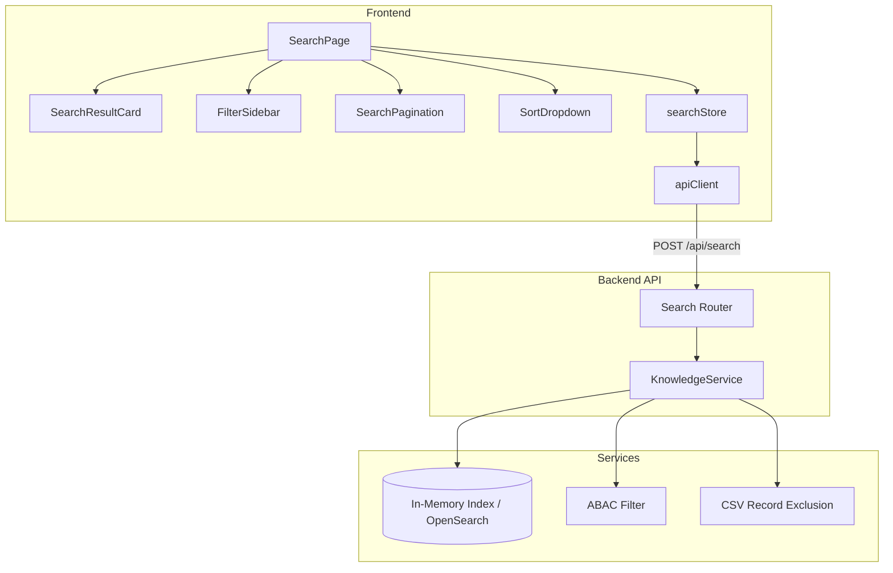

# Design Document: Search UI Integration

## Overview

This design transforms the static SearchPage shell and no-op searchStore into a fully functional search experience by wiring the frontend to the existing `POST /api/search` backend endpoint. The implementation extends both sides of the API contract:

**Backend extensions:**
- Extended `SearchRequest` schema with `filters`, `offset`, and `sort_by` parameters
- Extended `SearchResponse` schema with `total_available`, `offset`, `filters_applied`, and per-result metadata (`document_type`, `status`, `tags`, `created_at`, `updated_at`)
- Extended `KnowledgeService.hybrid_search` signature to accept and apply filters, offset, and sort parameters

**Frontend implementation:**
- Full `searchStore` with state management for query, results, filters, pagination, sorting, loading, and error states
- Decomposed `SearchPage` with `SearchResultCard`, `FilterSidebar`, `SearchPagination`, and `SortDropdown` components
- Debounced search-as-you-type (300ms), keyboard navigation (Enter/Escape), and comprehensive ARIA accessibility
- Relevance score visualization, excerpt highlighting, and faceted filtering

**Design Rationale:** The backend remains the authoritative source for filtering, pagination, and ABAC enforcement. The frontend manages UX state (debounce, loading indicators, filter chips) but never performs client-side filtering or pagination — all filtering and slicing happens server-side to ensure consistent results regardless of page size or client state. The `KnowledgeService` placeholder logic is extended with filter/sort/offset support so the API contract is fully exercisable even before OpenSearch integration.

## Architecture



**Request Flow — Search Query:**
1. User types in search input → `SearchPage` updates `searchStore.query` on each keystroke
2. After 300ms debounce (or Enter/button click), `searchStore.search()` fires
3. `searchStore` sets `isSearching=true`, sends `POST /api/search` via `apiClient` with `query`, `filters`, `offset`, `limit`, `sort_by`, and `X-Change-Reason: "Document search query"`
4. Backend `KnowledgeService.hybrid_search` applies ABAC filtering, CSV exclusion, metadata filters, sorting, and offset/limit slicing
5. Response includes `results`, `total`, `total_available`, `offset`, `filters_applied`, `query`
6. `searchStore` stores results, updates `totalAvailable`, sets `isSearching=false`
7. `SearchPage` re-renders with result cards, filter sidebar populated from result metadata, and pagination controls

**Request Flow — Filter Toggle:**
1. User checks/unchecks a filter checkbox in `FilterSidebar`
2. `searchStore.setFilter(category, value)` toggles the value, resets `offset` to 0
3. Automatically triggers `searchStore.search()` with updated filters
4. Results update, filter chips reflect active selections

**Request Flow — Pagination:**
1. User clicks Next/Previous in `SearchPagination`
2. `searchStore.nextPage()` / `previousPage()` adjusts `offset` by `limit`
3. Triggers `searchStore.search()` with new offset
4. Results area scrolls to top, new page renders

## Components and Interfaces

### Backend Components

#### Extended SearchRequest Schema (`src/backend/src/alcoabase/api/search.py`)

```python
class SearchFilters(BaseModel):
    """Optional filters for narrowing search results."""
    document_type: list[str] = Field(default_factory=list)
    status: list[str] = Field(default_factory=list)
    tags: list[str] = Field(default_factory=list)


class SearchRequest(BaseModel):
    """Request body for hybrid search."""
    query: str = Field(..., min_length=1, max_length=1000)
    user_id: int = Field(..., description="User ID for ABAC filtering")
    limit: int = Field(default=20, ge=1, le=100)
    filters: SearchFilters | None = Field(default=None)
    offset: int = Field(default=0, ge=0)
    sort_by: Literal["relevance", "date"] = Field(default="relevance")
```

#### Extended SearchResponse Schema (`src/backend/src/alcoabase/api/search.py`)

```python
class SearchResultResponse(BaseModel):
    """A single search result in the response."""
    document_uuid: str
    title: str
    version: str
    excerpt: str
    relevance_score: float
    document_type: str | None = None
    status: str | None = None
    tags: list[str] = Field(default_factory=list)
    created_at: str | None = None
    updated_at: str | None = None


class SearchResponse(BaseModel):
    """Response body for hybrid search."""
    results: list[SearchResultResponse]
    total: int
    total_available: int
    query: str
    offset: int
    filters_applied: dict[str, list[str]] = Field(default_factory=dict)
```

#### Extended KnowledgeService.hybrid_search (`src/backend/src/alcoabase/services/knowledge_service.py`)

```python
def hybrid_search(
    self,
    query: str,
    user_id: int,
    limit: int = 20,
    filters: dict[str, list[str]] | None = None,
    offset: int = 0,
    sort_by: str = "relevance",
) -> tuple[list[SearchResult], int]:
    """Perform hybrid search with filtering, sorting, and pagination.

    Args:
        query: Search query string.
        user_id: ID of the user performing the search (for ABAC filtering).
        limit: Maximum number of results to return.
        filters: Optional dict of filter category → list of values.
        offset: Number of results to skip (for pagination).
        sort_by: Sort order — "relevance" or "date".

    Returns:
        Tuple of (paginated results list, total_available count before pagination).
    """
    ...
```

**Key change:** The method now returns a tuple `(results, total_available)` so the router can include `total_available` in the response for frontend pagination calculation.

#### Search Router Endpoint Update

The `hybrid_search` endpoint handler maps the extended request fields to the service call and constructs the enriched response:

```python
@router.post("", response_model=SearchResponse)
async def hybrid_search(request: SearchRequest) -> SearchResponse:
    service = _get_knowledge_service()

    filters_dict = None
    if request.filters:
        filters_dict = {
            k: v for k, v in request.filters.model_dump().items() if v
        }

    results, total_available = service.hybrid_search(
        query=request.query,
        user_id=request.user_id,
        limit=request.limit,
        filters=filters_dict if filters_dict else None,
        offset=request.offset,
        sort_by=request.sort_by,
    )

    filters_applied = {}
    if request.filters:
        filters_applied = {
            k: v for k, v in request.filters.model_dump().items() if v
        }

    return SearchResponse(
        results=[...],
        total=len(results),
        total_available=total_available,
        query=request.query,
        offset=request.offset,
        filters_applied=filters_applied,
    )
```

### Frontend Components

#### searchStore (`src/frontend/src/stores/searchStore.ts`)

Complete Zustand store managing the search lifecycle:

```typescript
interface SearchFilters {
  document_type: string[];
  status: string[];
  tags: string[];
}

interface SearchResult {
  document_uuid: string;
  title: string;
  version: string;
  excerpt: string;
  relevance_score: number;
  document_type: string | null;
  status: string | null;
  tags: string[];
  created_at: string | null;
  updated_at: string | null;
}

interface SearchState {
  query: string;
  results: SearchResult[];
  isSearching: boolean;
  error: string | null;
  filters: SearchFilters;
  offset: number;
  limit: number;
  totalAvailable: number;
  sortBy: "relevance" | "date";

  setQuery: (query: string) => void;
  search: () => Promise<void>;
  setFilter: (category: keyof SearchFilters, value: string) => void;
  setSortBy: (sortBy: "relevance" | "date") => void;
  nextPage: () => void;
  previousPage: () => void;
  clearResults: () => void;
}
```

**Key behaviors:**
- `search()`: Guards against concurrent calls (`isSearching` check), sends POST via `apiClient.post('/api/search', body, { changeReason: "Document search query" })`
- `setFilter()`: Toggles value in category array, resets offset to 0, calls `search()`
- `setSortBy()`: Updates sortBy, resets offset to 0, calls `search()`
- `nextPage()`: Increments offset by limit (only if `offset + limit < totalAvailable`), calls `search()`
- `previousPage()`: Decrements offset by limit (min 0), calls `search()`
- `clearResults()`: Resets all state to defaults

#### SearchPage (`src/frontend/src/pages/SearchPage.tsx`)

Orchestrating page component with layout:

```
┌─────────────────────────────────────────────────────┐
│  Search Input [icon] [_______________] [Search btn] │
│  Sort: [Most Relevant ▼]                            │
├──────────────┬──────────────────────────────────────┤
│ FilterSidebar│  Active filter chips: [x] [x]        │
│              │  "42 results found for 'query'"       │
│ □ Doc Type   │  ┌─────────────────────────────────┐ │
│   □ SOP      │  │ SearchResultCard                │ │
│   □ Policy   │  │  Title (link) | v1.0 badge      │ │
│              │  │  ████████░░ 82% relevance       │ │
│ □ Status     │  │  ...excerpt with <mark>...      │ │
│   □ Draft    │  │  [SOP] [Active]                 │ │
│   □ Active   │  └─────────────────────────────────┘ │
│              │  ┌─────────────────────────────────┐ │
│ □ Tags       │  │ SearchResultCard                │ │
│   □ GxP      │  └─────────────────────────────────┘ │
│              │                                       │
│ [Clear all]  │  [◀ Prev] Page 1 of 3 [Next ▶]      │
└──────────────┴──────────────────────────────────────┘
```

#### SearchResultCard (`src/frontend/src/components/search/SearchResultCard.tsx`)

```typescript
interface SearchResultCardProps {
  result: SearchResult;
  query: string;
}
```

Renders:
- Document title as clickable link → `/documents/{document_uuid}`
- Version badge
- Relevance score bar (`role="meter"`, `aria-valuenow`, `aria-valuemin="0"`, `aria-valuemax="100"`)
- Excerpt with query terms wrapped in `<mark>` elements
- Metadata badges for `document_type` and `status`

#### FilterSidebar (`src/frontend/src/components/search/FilterSidebar.tsx`)

```typescript
interface FilterSidebarProps {
  results: SearchResult[];
  activeFilters: SearchFilters;
  onFilterToggle: (category: keyof SearchFilters, value: string) => void;
  onClearAll: () => void;
  disabled: boolean;
}
```

Derives available filter options from the distinct metadata values in the current result set. Each section is collapsible with a count badge showing active selections.

#### SearchPagination (`src/frontend/src/components/search/SearchPagination.tsx`)

```typescript
interface SearchPaginationProps {
  offset: number;
  limit: number;
  totalAvailable: number;
  onNext: () => void;
  onPrevious: () => void;
}
```

Follows the same pattern as the existing `Pagination` component in `src/frontend/src/components/documents/Pagination.tsx`.

#### SortDropdown (`src/frontend/src/components/search/SortDropdown.tsx`)

```typescript
interface SortDropdownProps {
  value: "relevance" | "date";
  onChange: (value: "relevance" | "date") => void;
}
```

Simple select/dropdown with two options: "Most Relevant" and "Most Recent".

## Data Models

### Extended SearchRequest (Backend)

| Field | Type | Constraints | Default | Description |
|-------|------|-------------|---------|-------------|
| query | string | min_length=1, max_length=1000 | required | Search query text |
| user_id | integer | required | required | User ID for ABAC filtering |
| limit | integer | ge=1, le=100 | 20 | Max results per page |
| filters | SearchFilters \| null | optional | null | Faceted filter criteria |
| offset | integer | ge=0 | 0 | Results to skip for pagination |
| sort_by | "relevance" \| "date" | enum | "relevance" | Sort order |

### SearchFilters (Backend)

| Field | Type | Constraints | Default | Description |
|-------|------|-------------|---------|-------------|
| document_type | list[str] | optional | [] | Filter by document type (OR within) |
| status | list[str] | optional | [] | Filter by status (OR within) |
| tags | list[str] | optional | [] | Filter by tags (OR within) |

**Filter logic:** AND between categories, OR within a category. A document matches if it satisfies ALL non-empty filter categories, where satisfying a category means the document's value for that field is in the filter list.

### Extended SearchResultResponse (Backend)

| Field | Type | Constraints | Description |
|-------|------|-------------|-------------|
| document_uuid | string | required | Document UUID |
| title | string | required | Document title |
| version | string | required | Version string |
| excerpt | string | required | Matching text excerpt |
| relevance_score | float | 0.0–1.0 | Combined relevance score |
| document_type | string \| null | optional | Document type category |
| status | string \| null | optional | Document lifecycle status |
| tags | list[str] | default=[] | Document tags |
| created_at | string \| null | ISO 8601 | Creation timestamp |
| updated_at | string \| null | ISO 8601 | Last update timestamp |

### Extended SearchResponse (Backend)

| Field | Type | Description |
|-------|------|-------------|
| results | list[SearchResultResponse] | Paginated result list |
| total | integer | Count of results in this page |
| total_available | integer | Total matching results before pagination |
| query | string | Echoed query string |
| offset | integer | Echoed offset value |
| filters_applied | dict[str, list[str]] | Echoed active filters (empty dict if none) |

### Frontend State Shape (searchStore)

| Field | Type | Default | Description |
|-------|------|---------|-------------|
| query | string | "" | Current search query |
| results | SearchResult[] | [] | Current page of results |
| isSearching | boolean | false | Loading state |
| error | string \| null | null | Error message |
| filters | SearchFilters | {document_type:[], status:[], tags:[]} | Active filters |
| offset | number | 0 | Current pagination offset |
| limit | number | 20 | Results per page |
| totalAvailable | number | 0 | Total matching results |
| sortBy | "relevance" \| "date" | "relevance" | Current sort order |

## Correctness Properties

*A property is a characteristic or behavior that should hold true across all valid executions of a system — essentially, a formal statement about what the system should do. Properties serve as the bridge between human-readable specifications and machine-verifiable correctness guarantees.*

### Property 1: Filter logic preserves AND/OR semantics

*For any* set of indexed documents with varied metadata and *any* non-empty filter combination, the search results SHALL contain only documents where: for each filter category with a non-empty list, the document's metadata value for that category is contained in the filter list (OR within category), AND this condition holds for ALL non-empty filter categories simultaneously (AND between categories).

**Validates: Requirements 1.2**

### Property 2: Offset pagination produces correct slice

*For any* search query that produces N total results and *any* valid offset (0 ≤ offset < N), the paginated results SHALL equal the slice `full_results[offset:offset+limit]` of the unfiltered-by-pagination result set, and `total_available` SHALL equal N.

**Validates: Requirements 1.3, 2.2**

### Property 3: Date sort produces descending order

*For any* set of indexed documents with varied `updated_at` timestamps, when `sort_by` is "date", the returned results SHALL be ordered such that each result's `updated_at` is greater than or equal to the next result's `updated_at` (descending chronological order).

**Validates: Requirements 1.4**

### Property 4: Response echoes request parameters

*For any* valid search request with offset O and filters F, the response SHALL contain `offset` equal to O and `filters_applied` equal to the non-empty filter categories from F (or empty dict if no filters active).

**Validates: Requirements 2.3, 2.4**

### Property 5: Store pagination arithmetic

*For any* store state with offset O, limit L, and totalAvailable T: calling `nextPage` SHALL set offset to `O + L` if and only if `O + L < T` (otherwise offset remains O); calling `previousPage` SHALL set offset to `max(0, O - L)`.

**Validates: Requirements 3.6, 3.7**

### Property 6: Store filter toggle and offset reset

*For any* store state with filters F and *any* category C and value V: calling `setFilter(C, V)` SHALL add V to F[C] if V is not present, or remove V from F[C] if V is already present; in both cases offset SHALL be reset to 0.

**Validates: Requirements 3.4**

### Property 7: Store error state consistency

*For any* failed search request (network error, HTTP 500, etc.), the store SHALL transition to a state where `error` is a non-empty string, `results` is an empty array, `totalAvailable` is 0, and `isSearching` is false.

**Validates: Requirements 3.3**

### Property 8: Store request deduplication

*For any* store state where `isSearching` is true, calling `search()` SHALL not initiate a new network request and SHALL leave the store state unchanged.

**Validates: Requirements 3.9**

### Property 9: Whitespace query rejection

*For any* string composed entirely of whitespace characters (spaces, tabs, newlines), attempting to trigger a search SHALL not send a network request and SHALL call `clearResults`, resetting the store to its default state.

**Validates: Requirements 4.5**

### Property 10: Relevance score clamping

*For any* search result with a `relevance_score` value (including values < 0.0 or > 1.0), the displayed relevance bar width SHALL be clamped to the range [0, 100]% (i.e., `Math.max(0, Math.min(1, score)) * 100`).

**Validates: Requirements 9.5**

### Property 11: Query truncation at maximum length

*For any* input string longer than 1000 characters, the search request body SHALL contain a `query` field of exactly 1000 characters (the first 1000 characters of the input).

**Validates: Requirements 9.4**

### Property 12: Sort change resets offset and triggers search

*For any* store state with offset O > 0 and *any* sort value change, calling `setSortBy` SHALL reset offset to 0 and trigger a new search with the updated sort parameter.

**Validates: Requirements 10.2**

### Property 13: Result metadata fields always present

*For any* search result returned by the API, the response object SHALL contain the fields `document_type`, `status`, `tags`, `created_at`, and `updated_at` (with null/empty-list as valid values when metadata is absent).

**Validates: Requirements 2.1**

## Error Handling

### Backend Error Responses

| Scenario | HTTP Status | Detail Message |
|----------|-------------|----------------|
| Query too short (empty) | 422 | Pydantic validation: "String should have at least 1 character" |
| Query too long (>1000 chars) | 422 | Pydantic validation: "String should have at most 1000 characters" |
| Negative offset | 422 | Pydantic validation: "Input should be greater than or equal to 0" |
| Invalid sort_by value | 422 | Pydantic validation: "Input should be 'relevance' or 'date'" |
| Limit out of range | 422 | Pydantic validation: "Input should be greater than or equal to 1" |
| Missing user_id | 422 | Pydantic validation: "Field required" |
| Internal search error | 500 | "Internal server error during search" |

### Frontend Error Handling

| Scenario | Behavior |
|----------|----------|
| HTTP 422 (validation) | Display inline error below search input with detail from response |
| HTTP 500 / network timeout | Display error alert: "Search is temporarily unavailable. Please try again." with Retry button |
| Session expired (401 → refresh fails) | No search error displayed; `apiClient` handles redirect to login |
| Query > 1000 chars | Truncate to 1000 chars before sending; show brief toast notification |
| Relevance score out of range | Clamp to [0, 1] for visual bar; no error displayed |
| Concurrent search attempt | Silently skip (deduplication in store) |

### Graceful Degradation

- **Fail-closed on errors:** If search fails, the UI shows an error state with retry — never stale results from a previous query
- **Backend authoritative:** All filtering, pagination, and ABAC enforcement happens server-side; the frontend never performs client-side filtering
- **Session handling:** The `apiClient`'s existing 401 retry + redirect flow handles auth expiry transparently

## Testing Strategy

### Property-Based Testing (Backend — Python/Hypothesis)

The backend uses **Hypothesis** for property-based testing. Each property test runs a minimum of 100 iterations.

**Target file:** `src/backend/tests/test_search_properties.py`

Properties to implement:
- Property 1: Filter logic AND/OR semantics — generate random document sets and filter combinations, verify filtering correctness
- Property 2: Offset pagination slice — generate result sets with various offsets, verify correct slicing and total_available
- Property 3: Date sort ordering — generate documents with random timestamps, verify descending order
- Property 4: Response echoes request parameters — generate random requests, verify echo fields
- Property 13: Result metadata fields present — generate documents with varied metadata, verify response shape

**Tag format:** `# Feature: Step_4-1_search-ui-integration, Property {N}: {title}`

### Property-Based Testing (Frontend — TypeScript/fast-check)

The frontend uses **fast-check** with **Vitest** for property-based testing. Each property test runs a minimum of 100 iterations.

**Target file:** `src/frontend/src/__tests__/stores/searchProperties.test.ts`

Properties to implement:
- Property 5: Store pagination arithmetic — generate random offset/limit/totalAvailable, verify nextPage/previousPage math
- Property 6: Store filter toggle and offset reset — generate random filter states and toggle operations
- Property 7: Store error state consistency — generate various error scenarios
- Property 8: Store request deduplication — verify no duplicate requests
- Property 9: Whitespace query rejection — generate whitespace strings, verify no request sent
- Property 10: Relevance score clamping — generate random floats, verify clamping
- Property 11: Query truncation — generate long strings, verify truncation to 1000
- Property 12: Sort change resets offset — generate random states, verify reset behavior

**Tag format:** `// Feature: Step_4-1_search-ui-integration, Property {N}: {title}`

### Unit Tests (Example-Based)

**Backend (`src/backend/tests/test_search_api.py`):**
- Valid search request → 200 with correct response shape
- Empty query → 422
- Negative offset → 422
- Invalid sort_by → 422
- Filters with empty lists → treated as unfiltered
- No matching results → empty results with total_available=0
- ABAC filtering excludes unauthorized documents
- CSV records excluded from results
- Offset beyond total results → empty results page

**Frontend — Store (`src/frontend/src/__tests__/stores/searchStore.test.ts`):**
- Initial state has correct defaults
- search() sends POST with correct body and headers
- search() sets isSearching during request
- search() stores results on success
- search() handles error response
- setFilter() toggles value correctly
- setQuery() updates without triggering search
- clearResults() resets all state
- nextPage()/previousPage() at boundaries

**Frontend — Components (`src/frontend/src/__tests__/components/search/`):**
- SearchPage renders search input with placeholder and icon
- SearchPage shows initial placeholder state
- SearchPage shows loading skeleton during search
- SearchPage shows empty state when no results
- SearchPage shows error alert with retry
- SearchResultCard renders all required elements
- SearchResultCard highlights query terms in excerpt
- SearchResultCard navigates on click
- FilterSidebar renders three sections
- FilterSidebar disabled when no results
- FilterSidebar shows count badges
- SearchPagination hidden when totalAvailable ≤ limit
- SearchPagination disables Previous at offset=0
- SearchPagination disables Next at last page
- SortDropdown renders both options
- Debounce fires after 300ms
- Enter key triggers immediate search
- Escape key clears input and results
- aria-live region announces result count
- aria-busy set during loading
- Relevance meter has correct ARIA attributes

### Integration Tests

- Full flow: type query → debounce → results displayed → click result → navigate
- Full flow: search → apply filter → results narrow → remove filter → results restore
- Full flow: search → paginate through pages → verify offset progression
- Full flow: search → change sort → verify results reorder and offset resets
- Error recovery: search fails → retry button → successful search

### Test Configuration

- Backend: `pytest` with `pytest-asyncio`, Hypothesis with `@settings(max_examples=100)`
- Frontend: `vitest --run` with fast-check `fc.assert(property, { numRuns: 100 })`
