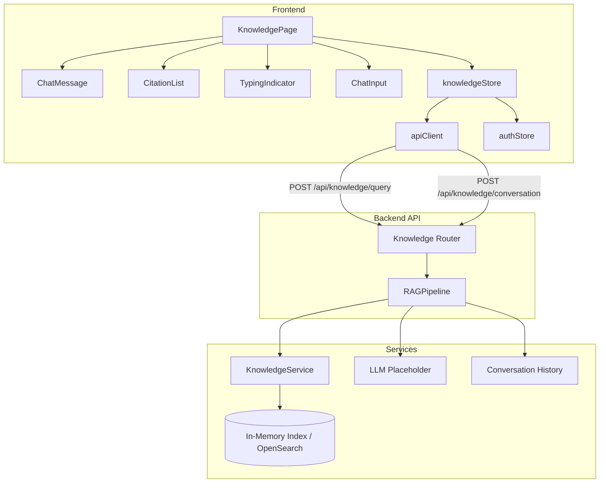

# Design Document: RAG Knowledge Base UI

## Overview

This design transforms the static KnowledgePage shell into a fully functional chat-style interface for querying the document knowledge base using the existing RAG pipeline backend. The implementation connects the frontend to the existing `POST /api/knowledge/query` and `POST /api/knowledge/conversation` endpoints.

**Frontend implementation:**
- New `knowledgeStore` (Zustand) managing conversation state, messages, loading/error states, and actions for querying and conversation management
- Decomposed `KnowledgePage` with `ChatMessage`, `CitationList`, `TypingIndicator`, and `ChatInput` components
- Chat-style message bubbles with markdown rendering, source citations with document links, and conversation management (new/clear)
- Request deduplication, 30-second timeout handling, retry logic (max 3 attempts), and comprehensive ARIA accessibility
- Auto-scroll behavior with "New message" indicator when scrolled away

**Design Rationale:** The backend RAG pipeline and API endpoints already exist and are fully functional. This phase is purely frontend integration — no backend changes are required. The `knowledgeStore` manages optimistic UI updates (appending user messages immediately) with rollback on failure. The store routes requests to either `/api/knowledge/query` (new conversation) or `/api/knowledge/conversation` (follow-up) based on whether a `conversationId` exists. The `user_id` is obtained from the authenticated session via `useAuthStore`.

## Architecture



**Request Flow — New Question (no existing conversation):**
1. User types question in `ChatInput` textarea and presses Enter or clicks Send
2. `KnowledgePage` calls `knowledgeStore.sendMessage(trimmedInput)`
3. Store validates input (non-empty, not whitespace-only), checks `isLoading` guard
4. Store appends user `ChatMessage` (with UUID id, timestamp, role="user"), sets `isLoading=true`, clears `error` and `inputValue`
5. Since `conversationId` is null, store sends `POST /api/knowledge/query` via `apiClient.post` with `{ question, user_id, top_k: 5 }` and `changeReason: "Knowledge base query"`
6. Backend `RAGPipeline.query()` retrieves chunks, generates response, returns `{ answer, citations, grounded, conversation_id }`
7. Store receives response, appends assistant `ChatMessage` (with answer, citations, grounded flag, timestamp), stores `conversation_id`, sets `isLoading=false`
8. `KnowledgePage` re-renders: typing indicator removed, assistant bubble with markdown answer and collapsible citations displayed

**Request Flow — Follow-up Question (existing conversation):**
1. Same as above through step 4
2. Since `conversationId` is not null, store sends `POST /api/knowledge/conversation` via `apiClient.post` with `{ question, user_id, conversation_id, top_k: 5 }` and `changeReason: "Knowledge base conversation query"`
3. Backend uses conversation history for context resolution, returns response
4. Same as steps 7-8 above

**Request Flow — Error with Retry:**
1. API request fails (network error, HTTP 500, or 30-second timeout)
2. Store sets `error` message, sets `isLoading=false`, removes the optimistically-added user message
3. `KnowledgePage` renders inline error message with "Retry" button
4. User clicks Retry → store re-sends the last failed question (up to 3 consecutive retries)
5. On success: error cleared, assistant message appended normally

## Components and Interfaces

### Frontend Components

#### knowledgeStore (`src/frontend/src/stores/knowledgeStore.ts`)

Complete Zustand store managing the knowledge chat lifecycle:

```typescript
interface ChatMessage {
  id: string;                    // UUID v4
  role: "user" | "assistant";
  content: string;               // max 10,000 chars
  citations: SourceCitation[];   // 0-20 items, empty for user messages
  grounded: boolean;             // always true for user messages
  timestamp: string;             // ISO 8601 UTC
}

interface SourceCitation {
  document_uuid: string;
  title: string;                 // max 255 chars
  version: string;               // semver-like, e.g. "1.0", "2.1"
  page_or_section: string;       // max 100 chars
}

interface KnowledgeState {
  messages: ChatMessage[];       // max 200 per conversation
  conversationId: string | null;
  isLoading: boolean;
  error: string | null;
  inputValue: string;
  retryCount: number;
  lastFailedQuestion: string | null;

  sendMessage: (question: string) => Promise<void>;
  retryLastMessage: () => Promise<void>;
  startNewConversation: () => void;
  clearConversation: () => void;
  setInputValue: (value: string) => void;
}
```

**Key behaviors:**
- `sendMessage(question)`: Guards against concurrent calls (`isLoading` check), rejects whitespace-only input, appends user message optimistically, routes to correct endpoint based on `conversationId`, handles success/failure with rollback
- `retryLastMessage()`: Re-sends `lastFailedQuestion` if `retryCount < 3`, increments `retryCount`
- `startNewConversation()`: Resets messages, conversationId, error, inputValue, retryCount
- `clearConversation()`: Same reset behavior as startNewConversation
- `setInputValue(value)`: Updates inputValue (capped at 2000 chars)

#### KnowledgePage (`src/frontend/src/pages/KnowledgePage.tsx`)

Orchestrating page component with layout:

```
┌─────────────────────────────────────────────────────────┐
│  Knowledge Chat                                          │
│  Ask questions about your documents with source citations│
│  [New Conversation] [Clear]  Status: "Ongoing convo"    │
├─────────────────────────────────────────────────────────┤
│  role="log" aria-label="Conversation messages"           │
│                                                          │
│                          ┌──────────────────────────┐   │
│                          │ User bubble (right)       │   │
│                          │ "What is the SOP for..."  │   │
│                          │              2 min ago    │   │
│                          └──────────────────────────┘   │
│  ┌──────────────────────────┐                           │
│  │ Assistant bubble (left)   │                           │
│  │ **Markdown** rendered     │                           │
│  │ answer content...         │                           │
│  │                           │                           │
│  │ ▶ 3 sources (collapsed)   │                           │
│  │   • SOP-001 v1.0 §3.2    │                           │
│  │   • Policy-X v2.1 Page 5 │                           │
│  │   • Guide-Y v1.0 §1.1    │                           │
│  │              just now     │                           │
│  └──────────────────────────┘                           │
│                                                          │
│  ┌──────────────────────────┐                           │
│  │ ● ● ● (typing indicator) │                           │
│  └──────────────────────────┘                           │
│                                                          │
├─────────────────────────────────────────────────────────┤
│  [textarea: Ask a question...]  [1234/2000]  [Send ▶]   │
└─────────────────────────────────────────────────────────┘
```

#### ChatMessage (`src/frontend/src/components/knowledge/ChatMessage.tsx`)

```typescript
interface ChatMessageProps {
  message: ChatMessage;
  onCitationClick?: (documentUuid: string) => void;
}
```

Renders:
- User messages: right-aligned bubble with distinct background, plain text content, relative timestamp
- Assistant messages: left-aligned bubble with distinct background, markdown-rendered content (via a lightweight markdown renderer), collapsible citation list below, relative timestamp
- Ungrounded assistant messages: muted styling with info icon, no citations section

#### CitationList (`src/frontend/src/components/knowledge/CitationList.tsx`)

```typescript
interface CitationListProps {
  citations: SourceCitation[];
  defaultExpanded?: boolean;
}
```

Renders:
- Summary label showing count (e.g., "3 sources") — collapsed by default
- Expandable list with each citation showing: title as `<Link to="/documents/{document_uuid}">`, version badge, page_or_section text
- Each link has `aria-label="Open document: {title} version {version}"`
- Maximum 50 citations displayed

#### TypingIndicator (`src/frontend/src/components/knowledge/TypingIndicator.tsx`)

```typescript
// No props — purely visual component
```

Renders:
- Left-aligned assistant-style bubble with animated dots (CSS animation)
- `aria-live="polite"` region with text "Assistant is typing"

#### ChatInput (`src/frontend/src/components/knowledge/ChatInput.tsx`)

```typescript
interface ChatInputProps {
  value: string;
  onChange: (value: string) => void;
  onSubmit: () => void;
  disabled: boolean;
  maxLength: number;
}
```

Renders:
- Multi-line `<textarea>` with placeholder "Ask a question about your documents..."
- Character count indicator (e.g., "1234/2000") when approaching limit
- Send button with `<Send>` Lucide icon
- Enter submits (when not empty), Shift+Enter inserts newline
- Both textarea and button disabled when `disabled=true`
- `aria-label="Chat message input"` on textarea, `aria-label="Send message"` on button

### Backend Components

No backend changes required. The existing endpoints are used as-is:

#### POST /api/knowledge/query (`src/backend/src/alcoabase/api/knowledge.py`)

```python
class KnowledgeQueryRequest(BaseModel):
    question: str = Field(..., min_length=1)
    user_id: int
    top_k: int = Field(default=5, ge=1, le=50)

class KnowledgeQueryResponse(BaseModel):
    answer: str
    citations: list[SourceCitationResponse]
    grounded: bool
    conversation_id: str
```

#### POST /api/knowledge/conversation (`src/backend/src/alcoabase/api/knowledge.py`)

```python
class ConversationQueryRequest(BaseModel):
    question: str = Field(..., min_length=1)
    user_id: int
    conversation_id: str
    top_k: int = Field(default=5, ge=1, le=50)
```

## Data Models

### ChatMessage (Frontend)

| Field | Type | Constraints | Default | Description |
|-------|------|-------------|---------|-------------|
| id | string | UUID v4 format | generated | Unique message identifier |
| role | "user" \| "assistant" | enum | required | Message sender role |
| content | string | max 10,000 chars | required | Message text content |
| citations | SourceCitation[] | 0-20 items | [] | Source citations (empty for user) |
| grounded | boolean | — | true for user | Whether response is grounded in documents |
| timestamp | string | ISO 8601 UTC | generated | When message was created |

### SourceCitation (Frontend)

| Field | Type | Constraints | Description |
|-------|------|-------------|-------------|
| document_uuid | string | UUID format | Document identifier for linking |
| title | string | max 255 chars | Document title |
| version | string | semver-like | Document version (e.g., "1.0") |
| page_or_section | string | max 100 chars | Page number or section heading |

### KnowledgeState (Frontend Store)

| Field | Type | Default | Description |
|-------|------|---------|-------------|
| messages | ChatMessage[] | [] | Conversation messages (max 200) |
| conversationId | string \| null | null | Active conversation ID |
| isLoading | boolean | false | Whether a request is in flight |
| error | string \| null | null | Current error message |
| inputValue | string | "" | Current textarea value |
| retryCount | number | 0 | Consecutive retry attempts for last failure |
| lastFailedQuestion | string \| null | null | Question to retry on failure |

### API Request Bodies

| Endpoint | Field | Type | Description |
|----------|-------|------|-------------|
| /api/knowledge/query | question | string | User's question |
| /api/knowledge/query | user_id | int | From authStore.user.id |
| /api/knowledge/query | top_k | int (default 5) | Chunks to retrieve |
| /api/knowledge/conversation | question | string | Follow-up question |
| /api/knowledge/conversation | user_id | int | From authStore.user.id |
| /api/knowledge/conversation | conversation_id | string | Existing conversation |
| /api/knowledge/conversation | top_k | int (default 5) | Chunks to retrieve |

### API Response Shape

| Field | Type | Description |
|-------|------|-------------|
| answer | string | Generated answer text |
| citations | SourceCitationResponse[] | Source citations |
| grounded | boolean | Whether answer is backed by documents |
| conversation_id | string | Conversation ID for follow-ups |

## Correctness Properties

*A property is a characteristic or behavior that should hold true across all valid executions of a system — essentially, a formal statement about what the system should do. Properties serve as the bridge between human-readable specifications and machine-verifiable correctness guarantees.*

### Property 1: sendMessage state transition

*For any* non-empty, non-whitespace question string, calling `sendMessage` when `isLoading` is false SHALL append a user ChatMessage to the messages array (with a valid UUID v4 id, role="user", the trimmed question as content, empty citations, grounded=true, and a valid ISO 8601 timestamp), set `isLoading` to true, set `error` to null, and set `inputValue` to "".

**Validates: Requirements 1.2**

### Property 2: Endpoint routing based on conversationId

*For any* valid question string, when `conversationId` is null the store SHALL send a POST request to `/api/knowledge/query` with `{ question, user_id, top_k: 5 }`, and when `conversationId` is a non-null string the store SHALL send a POST request to `/api/knowledge/conversation` with `{ question, user_id, conversation_id, top_k: 5 }`.

**Validates: Requirements 1.3, 1.4**

### Property 3: Successful response appends correct assistant message

*For any* successful API response containing an answer string, a citations array (0-20 items), a grounded boolean, and a conversation_id string, the store SHALL append an assistant ChatMessage with the answer as content, the citations array mapped to SourceCitation objects, the grounded flag, a valid ISO 8601 timestamp, and SHALL store the conversation_id and set `isLoading` to false.

**Validates: Requirements 1.5**

### Property 4: Failed request error handling and rollback

*For any* API request that fails with a network error, HTTP status >= 500, or HTTP 422, the store SHALL set `error` to a non-empty string (the error message from the response or "Network error"), set `isLoading` to false, and remove the last user message that was optimistically appended to the messages array.

**Validates: Requirements 1.6, 1.11**

### Property 5: Reset actions clear all state

*For any* store state (with any combination of messages, conversationId, error, and inputValue), calling either `startNewConversation` or `clearConversation` SHALL set messages to an empty array, conversationId to null, error to null, and inputValue to "".

**Validates: Requirements 1.7, 1.8**

### Property 6: Request deduplication when loading

*For any* store state where `isLoading` is true and *any* question string, calling `sendMessage` SHALL not modify the messages array, SHALL not change `isLoading`, SHALL not change `error`, and SHALL not initiate a network request.

**Validates: Requirements 1.9**

### Property 7: Whitespace-only input rejection

*For any* string composed entirely of whitespace characters (spaces, tabs, newlines, or empty string), calling `sendMessage` SHALL not modify the messages array, SHALL not change `isLoading`, SHALL not change `error`, and SHALL not initiate a network request.

**Validates: Requirements 1.10**

### Property 8: Ungrounded messages have empty citations

*For any* assistant ChatMessage where `grounded` is false, the `citations` array SHALL be empty (length 0).

**Validates: Requirements 2.4**

### Property 9: Timestamp formatting

*For any* timestamp less than 60 seconds ago, the formatted output SHALL be "just now". *For any* timestamp between 60 seconds and 60 minutes ago, the output SHALL be "N minutes ago". *For any* timestamp between 60 minutes and 24 hours ago, the output SHALL be "N hours ago". *For any* timestamp more than 24 hours ago, the output SHALL be in "HH:MM" 24-hour format.

**Validates: Requirements 3.6**

### Property 10: Citation link correctness

*For any* SourceCitation with a document_uuid, title, and version, the rendered citation link SHALL have an `href` pointing to `/documents/{document_uuid}` and an `aria-label` of "Open document: {title} version {version}".

**Validates: Requirements 4.2, 9.7**

### Property 11: New question clears previous error

*For any* store state where `error` is not null, successfully calling `sendMessage` with a valid non-empty question SHALL set `error` to null before the API request is made.

**Validates: Requirements 8.7**

## Error Handling

### Frontend Error Handling

| Scenario | Behavior |
|----------|----------|
| HTTP 500 / network error | Display inline error in chat: "Something went wrong. Please try again." with Retry button |
| HTTP 422 (validation) | Display inline error with validation detail from response body |
| Network timeout (30s) | Remove typing indicator, display timeout error with Retry button |
| Session expired (apiClient throws "Session expired") | No chat error displayed; apiClient handles redirect to login |
| Retry exhausted (3 attempts) | Disable Retry button, show "Retries exhausted. Please try a different question." |
| Input > 2000 chars | Prevent further input, show character count indicator |
| Whitespace-only input | Send button disabled, Enter does not submit |
| Concurrent request (isLoading=true) | Silently skip (deduplication in store) |

### Error State Recovery

- **Optimistic rollback:** When a request fails, the user message that was optimistically appended is removed from the messages array, so the conversation state accurately reflects what was successfully processed
- **Error clearing:** Any new successful submission or retry clears the error state
- **Input re-enabled on error:** When an error occurs, the input field and Send button are re-enabled so the user can try a different question
- **Session handling:** The `apiClient`'s existing 401 retry + redirect flow handles auth expiry transparently — no knowledge-specific handling needed

### Backend Error Responses (existing, no changes)

| Scenario | HTTP Status | Detail |
|----------|-------------|--------|
| Empty question | 422 | Pydantic: "String should have at least 1 character" |
| Invalid top_k | 422 | Pydantic: "Input should be greater than or equal to 1" |
| Missing user_id | 422 | Pydantic: "Field required" |
| Missing conversation_id (on /conversation) | 422 | Pydantic: "Field required" |
| Internal pipeline error | 500 | "Internal server error" |

## Testing Strategy

### Property-Based Testing (Frontend — TypeScript/fast-check)

The frontend uses **fast-check** with **Vitest** for property-based testing. Each property test runs a minimum of 100 iterations.

**Target file:** `src/frontend/src/__tests__/stores/knowledgeStoreProperties.test.ts`

Properties to implement:
- Property 1: sendMessage state transition — generate random non-empty strings, verify user message appended with correct fields and state transitions
- Property 2: Endpoint routing — generate random questions with null/non-null conversationId, verify correct endpoint called
- Property 3: Successful response handling — generate random API responses, verify assistant message correctly appended
- Property 4: Failed request rollback — generate random error scenarios, verify error state and user message removal
- Property 5: Reset actions — generate random initial states, verify both reset actions produce identical clean state
- Property 6: Request deduplication — generate random states with isLoading=true, verify no state changes on sendMessage
- Property 7: Whitespace rejection — generate random whitespace strings, verify no state changes
- Property 8: Ungrounded citations invariant — generate random messages with grounded=false, verify empty citations
- Property 9: Timestamp formatting — generate random timestamps at various offsets, verify correct format
- Property 10: Citation link correctness — generate random citations, verify href and aria-label
- Property 11: Error clearing on new question — generate random error states, verify error cleared on sendMessage

**Tag format:** `// Feature: rag-knowledge-base-ui, Property {N}: {title}`

**Configuration:** `fc.assert(property, { numRuns: 100 })`

### Unit Tests (Example-Based)

**Frontend — Store (`src/frontend/src/__tests__/stores/knowledgeStore.test.ts`):**
- Initial state has correct defaults (messages=[], conversationId=null, isLoading=false, error=null, inputValue="")
- sendMessage() appends user message and calls /api/knowledge/query when no conversationId
- sendMessage() calls /api/knowledge/conversation when conversationId exists
- sendMessage() stores conversation_id from response
- sendMessage() handles successful response with citations
- sendMessage() handles ungrounded response (grounded=false, empty citations)
- sendMessage() handles HTTP 500 error with rollback
- sendMessage() handles HTTP 422 with validation detail
- sendMessage() handles network timeout (30s)
- sendMessage() skips when isLoading=true
- sendMessage() rejects empty string
- sendMessage() rejects whitespace-only string
- retryLastMessage() re-sends last failed question
- retryLastMessage() increments retryCount
- retryLastMessage() does nothing when retryCount >= 3
- retryLastMessage() does nothing when lastFailedQuestion is null
- startNewConversation() resets all state
- clearConversation() resets all state
- setInputValue() updates inputValue
- setInputValue() caps at 2000 characters

**Frontend — Components (`src/frontend/src/__tests__/components/knowledge/`):**
- KnowledgePage renders header with title "Knowledge Chat" and subtitle
- KnowledgePage renders welcome placeholder when no messages
- KnowledgePage renders New Conversation and Clear buttons
- KnowledgePage shows conversation status label ("New conversation" / "Ongoing conversation")
- KnowledgePage renders message area with role="log" and aria-label
- KnowledgePage sets aria-busy="true" during loading
- KnowledgePage shows typing indicator during loading
- KnowledgePage shows error message with Retry button on failure
- KnowledgePage disables Retry after 3 attempts
- KnowledgePage shows confirmation dialog on Clear click
- KnowledgePage Cancel on dialog preserves state
- KnowledgePage Clear button disabled when no messages
- ChatMessage renders user message right-aligned with correct background
- ChatMessage renders assistant message left-aligned with correct background
- ChatMessage renders markdown content as HTML (headings, bold, lists, code)
- ChatMessage renders ungrounded message with muted styling and info icon
- ChatMessage displays relative timestamp
- CitationList renders collapsed with source count
- CitationList expands on click to show citation details
- CitationList renders title as link to /documents/{uuid}
- CitationList renders version badge and page_or_section
- CitationList limits display to 50 citations
- CitationList link has correct aria-label
- ChatInput renders textarea with placeholder and aria-label
- ChatInput renders Send button with aria-label
- ChatInput submits on Enter when non-empty
- ChatInput inserts newline on Shift+Enter
- ChatInput disables both elements when disabled=true
- ChatInput shows character count near limit
- ChatInput prevents input beyond 2000 characters
- ChatInput does not submit when empty/whitespace
- TypingIndicator renders animated dots in assistant bubble style
- TypingIndicator has aria-live="polite" with "Assistant is typing"

### Integration Tests

- Full flow: type question → submit → typing indicator → assistant response with citations displayed
- Full flow: ask question → receive response → ask follow-up → verify conversation endpoint used
- Full flow: start new conversation → verify state reset and welcome placeholder
- Full flow: clear conversation with confirmation → verify state reset
- Error recovery: request fails → Retry button → successful retry → error cleared
- Error recovery: 3 retries exhausted → Retry disabled → new question works
- Auto-scroll: messages near bottom → new message → auto-scrolls
- Auto-scroll: scrolled up → new message → "New message" indicator shown

### Test Configuration

- Frontend: `vitest --run` with fast-check `fc.assert(property, { numRuns: 100 })`
- Mock `apiClient.post` for store tests to avoid real network calls
- Mock `useAuthStore` to provide consistent `user.id` for API calls
- Use React Testing Library for component tests with `@testing-library/user-event` for interactions
