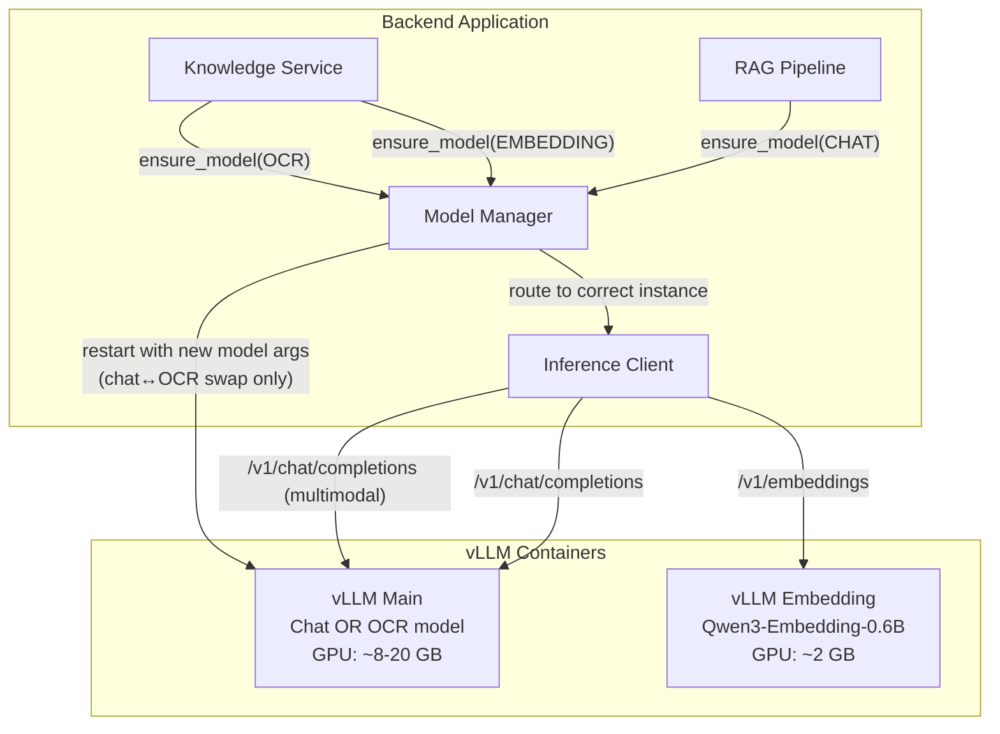
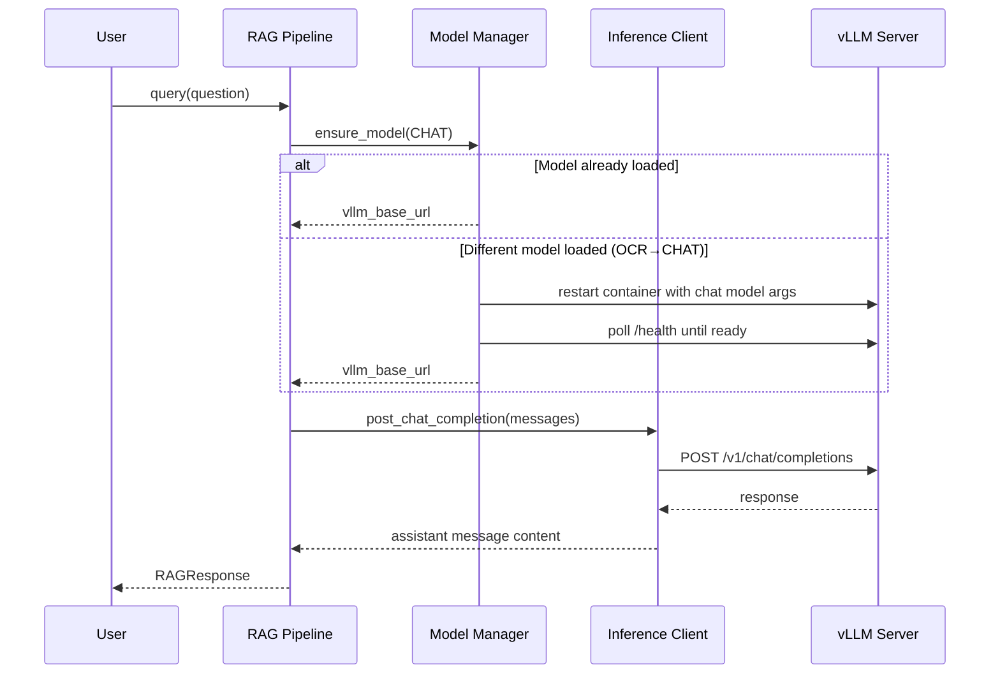

# Design Document: AI Model Integration (vLLM)

## Overview

This design replaces all placeholder/mock AI inference in the backend with real vLLM API calls. The system uses the vLLM OpenAI-compatible REST API for three inference tasks: chat completion (RAG responses), embedding generation (document indexing and search), and OCR text extraction (scanned PDFs via vision model).

**Key architectural insight:** vLLM v0.6.1 does NOT support dynamic base model loading/unloading via its REST API. The base model is loaded at server startup via command-line arguments. Therefore, the design uses a **multi-instance architecture** with separate vLLM containers per model role (chat, embedding, OCR), each pre-loaded with its respective model. The ModelManager becomes a routing layer that directs requests to the correct vLLM instance rather than orchestrating model swaps on a single server.

However, given the existing single-GPU constraint (24 GB VRAM) and the requirement that "only one large model occupies GPU memory at a time," the design supports **two operational strategies**:

1. **Multi-instance (recommended for production with sufficient VRAM):** Separate vLLM containers per role, all running simultaneously. The embedding model (0.6B) is small enough to coexist with the chat model.
2. **Container-restart swap (single GPU, memory-constrained):** The ModelManager orchestrates Docker container restarts with different model arguments. This is slower but works within 24 GB VRAM.

For the initial implementation, we adopt a **hybrid approach**: the embedding model runs in a dedicated always-on vLLM instance (it's small: ~2 GB), while the chat and OCR models share the main vLLM instance via container restart when a swap is needed. The ModelManager abstracts this complexity behind the existing `ensure_model()` interface.

**Design Decision Rationale:**
- Container restart is acceptable because model swaps (chat ↔ OCR) are infrequent — OCR only triggers for scanned PDFs, while chat handles all RAG queries.
- The embedding model is always available since it's small and runs on a separate lightweight instance.
- This avoids the complexity of managing multiple GPU-heavy containers while keeping embeddings fast.

## Architecture



### Request Flow



## Components and Interfaces

### 1. InferenceClient (`inference_client.py`)

New async HTTP client wrapper for all vLLM API communication.

```python
class InferenceClient:
    """Async HTTP client for vLLM OpenAI-compatible API.
    
    Handles connection pooling, retries with exponential backoff,
    per-operation timeouts, and structured error reporting.
    """

    def __init__(
        self,
        base_url: str,
        embedding_base_url: str | None = None,
        max_connections: int = 10,
        connect_timeout: float = 10.0,
    ) -> None: ...

    async def chat_completion(
        self,
        model: str,
        messages: list[dict[str, Any]],
        temperature: float = 0.3,
        max_tokens: int = 2048,
    ) -> str:
        """Send chat completion request, return assistant message content."""
        ...

    async def create_embeddings(
        self,
        model: str,
        inputs: list[str],
    ) -> list[list[float]]:
        """Send embedding request, return list of embedding vectors."""
        ...

    async def health_check(self, base_url: str | None = None) -> bool:
        """Check if vLLM server is healthy (GET /health)."""
        ...

    async def list_models(self, base_url: str | None = None) -> list[str]:
        """List currently loaded models (GET /v1/models)."""
        ...

    async def close(self) -> None:
        """Close the httpx client and release connections."""
        ...
```

**Retry Policy:**
- Retries: 2 additional attempts (3 total) for HTTP 503 and connection errors only
- Backoff: 1s after first failure, 2s after second failure
- No retry for 4xx errors (client-side issues)

**Timeouts (per operation):**
| Operation | Read Timeout |
|-----------|-------------|
| Chat completion | 60s |
| Embeddings | 30s |
| OCR (vision) | 90s |
| Health check | 5s |
| Connection | 10s (all) |

### 2. ModelManager (updated `model_manager.py`)

Updated to route requests to the correct vLLM instance and manage container restarts for chat↔OCR swaps.

```python
class ModelManager:
    """Routes inference requests to correct vLLM instance.
    
    - EMBEDDING requests → dedicated embedding vLLM instance (always on)
    - CHAT/OCR requests → main vLLM instance (may require restart for swap)
    """

    def __init__(
        self,
        settings: Settings | None = None,
        inference_client: InferenceClient | None = None,
    ) -> None: ...

    async def ensure_model(self, role: ModelRole) -> str:
        """Ensure the requested model is loaded and ready.
        
        For EMBEDDING: always returns embedding instance URL (no swap needed).
        For CHAT/OCR: checks if main instance has correct model, restarts if not.
        
        Returns:
            The vLLM API base URL for the loaded model.
        """
        ...

    async def get_status(self) -> ModelStatus:
        """Get status including vllm_reachable field."""
        ...

    async def shutdown(self) -> None:
        """Close inference client on application shutdown."""
        ...
```

**ModelStatus updated:**
```python
@dataclass
class ModelStatus:
    current_role: ModelRole | None = None
    current_model_name: str | None = None
    gpu_memory_used_gb: float = 0.0
    is_ready: bool = False
    mode: str = "mock"
    vllm_reachable: bool | None = None  # None in mock mode
```

**Model swap mechanism (gpu/cpu mode):**
1. For EMBEDDING role: return `embedding_base_url` immediately (always available)
2. For CHAT/OCR role: check if main vLLM instance has the correct model loaded via `GET /v1/models`
3. If wrong model: send Docker API call or subprocess to restart the vLLM container with new model args
4. Poll `/health` until ready (timeout: 120s gpu, 300s cpu)
5. Update internal state and return URL

**Simplified approach for v1:** Since container restart adds complexity, the initial implementation will use a simpler mechanism — the vLLM main container is started with the chat model by default. When OCR is needed, the ModelManager restarts it with OCR model args via a subprocess call to `docker compose`. This is acceptable because OCR is infrequent (only for scanned PDFs during document upload).

### 3. RAG Pipeline (updated `rag_pipeline.py`)

Updated `_generate_response` to make real vLLM chat completion calls.

```python
class RAGPipeline:
    def __init__(
        self,
        knowledge_service: KnowledgeService | None = None,
        model_manager: ModelManager | None = None,
        inference_client: InferenceClient | None = None,
        top_k: int = 5,
    ) -> None: ...

    async def _generate_response(
        self, question: str, context: str, history: str
    ) -> str:
        """Generate response via vLLM chat completion or mock."""
        ...

    def _build_system_prompt(self) -> str:
        """Build the grounding system prompt for the chat model."""
        ...

    def _truncate_context(
        self, search_results: list[SearchResult], max_tokens: int = 8192
    ) -> str:
        """Truncate context to fit within token limit."""
        ...
```

**System Prompt:**
```
You are a knowledgeable assistant for a GxP-regulated document management system.
Answer questions ONLY based on the provided context documents.
Rules:
1. Only use information from the provided [Source N] references.
2. Cite sources using [Source N] format when referencing information.
3. If the context does not contain sufficient information, state clearly: "The available documents do not contain enough information to answer this question."
4. Never fabricate or infer information not present in the context.
5. Be precise and factual in your responses.
```

### 4. Knowledge Service (updated `knowledge_service.py`)

Updated `generate_embeddings` and `_ocr_extract_text` for real inference.

```python
class KnowledgeService:
    def __init__(
        self,
        model_manager: ModelManager | None = None,
        inference_client: InferenceClient | None = None,
    ) -> None: ...

    async def generate_embeddings(self, chunks: list[str]) -> list[list[float]]:
        """Generate real embeddings via vLLM or mock vectors.
        
        Batches chunks into groups of 32 for API efficiency.
        """
        ...

    async def _ocr_extract_text(self, file_bytes: bytes) -> str:
        """Extract text from scanned PDF pages via vision model.
        
        Converts pages to PNG at 300 DPI, sends each to vLLM
        multimodal chat completion endpoint sequentially.
        """
        ...
```

**Embedding batching:**
- Batch size: 32 chunks per request
- Sequential batch processing (not concurrent) to avoid overwhelming vLLM
- Results concatenated in input order

**OCR multimodal message format:**
```json
{
    "model": "google/gemma-4-E4B-it",
    "messages": [
        {
            "role": "system",
            "content": "Extract all visible text from this document page image. Preserve the original layout and formatting as much as possible. Output only the extracted text, nothing else."
        },
        {
            "role": "user",
            "content": [
                {
                    "type": "image_url",
                    "image_url": {
                        "url": "data:image/png;base64,{base64_encoded_image}"
                    }
                },
                {
                    "type": "text",
                    "text": "Extract all text from this page."
                }
            ]
        }
    ],
    "max_tokens": 4096,
    "temperature": 0.1
}
```

## Data Models

### Request/Response Schemas (vLLM OpenAI-compatible)

**Chat Completion Request:**
```python
@dataclass
class ChatCompletionRequest:
    model: str
    messages: list[ChatMessage]
    temperature: float = 0.3
    max_tokens: int = 2048
    stream: bool = False

@dataclass
class ChatMessage:
    role: str  # "system", "user", "assistant"
    content: str | list[ContentPart]  # str for text, list for multimodal

@dataclass
class ContentPart:
    type: str  # "text" or "image_url"
    text: str | None = None
    image_url: dict | None = None  # {"url": "data:image/png;base64,..."}
```

**Chat Completion Response:**
```python
@dataclass
class ChatCompletionResponse:
    id: str
    choices: list[Choice]
    usage: Usage

@dataclass
class Choice:
    index: int
    message: ChatMessage
    finish_reason: str

@dataclass
class Usage:
    prompt_tokens: int
    completion_tokens: int
    total_tokens: int
```

**Embedding Request:**
```python
@dataclass
class EmbeddingRequest:
    model: str
    input: list[str]  # batch of text chunks

@dataclass
class EmbeddingResponse:
    data: list[EmbeddingData]
    usage: Usage

@dataclass
class EmbeddingData:
    index: int
    embedding: list[float]
```

### Error Types

```python
class InferenceError(Exception):
    """Base exception for inference failures."""
    def __init__(self, message: str, status_code: int | None = None, endpoint: str = ""):
        self.status_code = status_code
        self.endpoint = endpoint
        super().__init__(message)

class InferenceTimeoutError(InferenceError):
    """Raised when vLLM does not respond within the configured timeout."""
    pass

class InferenceConnectionError(InferenceError):
    """Raised when vLLM server is unreachable."""
    pass

class ModelManagerError(Exception):
    """Raised when model loading/unloading fails."""
    pass
```

### Configuration (already in `config.py`, no changes needed)

The existing `Settings` class already defines all necessary configuration:
- `vllm_base_url` — main vLLM instance URL
- `model_chat_name`, `model_chat_path`, `model_chat_max_gpu_memory_gb`
- `model_embedding_name`, `model_embedding_path`, `model_embedding_dimension`
- `model_ocr_name`, `model_ocr_path`
- `model_manager_mode` — "gpu", "cpu", or "mock"

**New setting needed in config.py:**
```python
vllm_embedding_url: str = Field(
    default="http://localhost:8001",
    description="Base URL for the dedicated embedding vLLM instance.",
    alias="VLLM_EMBEDDING_URL",
)
```


## Correctness Properties

*A property is a characteristic or behavior that should hold true across all valid executions of a system — essentially, a formal statement about what the system should do. Properties serve as the bridge between human-readable specifications and machine-verifiable correctness guarantees.*

### Property 1: Role-to-endpoint routing correctness

*For any* valid ModelRole (CHAT, EMBEDDING, OCR), calling `ensure_model` in gpu/cpu mode SHALL result in an HTTP request directed to the correct vLLM instance URL with the correct model path for that role as configured in settings.

**Validates: Requirements 1.1**

### Property 2: Model swap serialization

*For any* sequence of concurrent `ensure_model` calls requesting different ModelRoles, all model swap operations (unload + load) SHALL be serialized — no two swap operations execute simultaneously, and waiting callers are processed in FIFO order.

**Validates: Requirements 1.6, 10.1, 10.2**

### Property 3: Same-role idempotency

*For any* ModelRole that is already loaded and ready (is_ready=true, current_role matches), calling `ensure_model` with that same role SHALL return immediately without sending any HTTP requests to the vLLM server and without acquiring the model swap lock.

**Validates: Requirements 1.7, 10.2**

### Property 4: Chat completion message structure

*For any* combination of question string, context string, and conversation history, the messages array sent to `/v1/chat/completions` SHALL contain: (1) a system message with grounding instructions as the first element, (2) conversation history messages as alternating user/assistant pairs, (3) the context as a user message, and (4) the current question as the final user message.

**Validates: Requirements 2.2**

### Property 5: Chat response extraction

*For any* valid chat completion response JSON from vLLM containing `choices[0].message.content`, the extracted answer SHALL exactly equal that content string with no modification.

**Validates: Requirements 2.4**

### Property 6: Embedding batch size constraint

*For any* list of N text chunks (N > 0), the number of embedding API requests sent to vLLM SHALL equal `ceil(N / 32)`, and each individual request SHALL contain at most 32 input strings.

**Validates: Requirements 3.2**

### Property 7: Embedding order preservation

*For any* list of text chunks sent for embedding generation, the returned embedding vectors SHALL be in exactly the same order as the input chunks, regardless of batching.

**Validates: Requirements 3.3**

### Property 8: Embedding dimension validation

*For any* embedding response from vLLM where any vector has a dimension not equal to the configured `model_embedding_dimension` (default 1024), the system SHALL raise a ValueError.

**Validates: Requirements 3.4**

### Property 9: OCR page text concatenation

*For any* multi-page PDF where OCR succeeds on a subset of pages, the final extracted text SHALL be the concatenation of successful page texts in page order, separated by newline characters.

**Validates: Requirements 4.3**

### Property 10: OCR resilience — failed pages skipped

*For any* PDF with N pages where K pages fail OCR (0 ≤ K < N), the system SHALL successfully return text from the remaining (N - K) pages without raising an exception, and SHALL log a warning for each failed page.

**Validates: Requirements 4.4**

### Property 11: Mock mode isolation

*For any* inference operation (chat completion, embedding generation, OCR extraction) when `MODEL_MANAGER_MODE` is "mock", the system SHALL return mock/placeholder responses without making any HTTP requests to any vLLM server, and mock embeddings SHALL have exactly `model_embedding_dimension` dimensions.

**Validates: Requirements 2.7, 3.7, 4.8, 5.1, 5.2**

### Property 12: Retry policy correctness

*For any* HTTP request to vLLM that receives an HTTP 503 response or a connection error, the InferenceClient SHALL retry up to 2 additional times with exponential backoff (1s, 2s). *For any* HTTP request that receives a 4xx response (400, 401, 403, 404, 422), the InferenceClient SHALL NOT retry and SHALL raise an error immediately.

**Validates: Requirements 6.2, 6.3**

### Property 13: Context truncation by relevance

*For any* set of retrieved search results whose combined token count exceeds 8192 tokens, the context truncation algorithm SHALL remove chunks starting from the lowest relevance score until the total is within 8192 tokens, and SHALL always retain at least the single highest-relevance chunk regardless of its size.

**Validates: Requirements 7.5, 7.6**

### Property 14: Source citation formatting

*For any* list of SearchResult objects passed to context building, each chunk SHALL be formatted with the pattern `[Source N: {title} v{version}]` followed by the chunk text, where N is the 1-based index.

**Validates: Requirements 7.4**

### Property 15: Grounding flag correctness

*For any* RAG query where the hybrid search returns at least one result and the LLM generates a response, the `grounded` field in RAGResponse SHALL be true. *For any* RAG query where hybrid search returns zero results, `grounded` SHALL be false.

**Validates: Requirements 7.2, 7.3**

## Error Handling

### Error Hierarchy

```
Exception
├── ModelManagerError
│   ├── "Model {name} for role {role} failed to load: server unreachable at {url}"
│   ├── "Model {name} for role {role} failed to load: health check timeout after {elapsed}s"
│   ├── "Model {name} failed to unload: timeout after {elapsed}s"
│   └── "vLLM server unavailable at {url}"
├── InferenceError
│   ├── InferenceTimeoutError
│   │   └── "Request to {endpoint} timed out after {timeout}s"
│   └── InferenceConnectionError
│       └── "Cannot connect to vLLM at {url}: {reason}"
└── ValueError
    └── "Embedding dimension mismatch: expected {expected}, got {actual}"
```

### Error Handling Strategy

| Scenario | Behavior | Recovery |
|----------|----------|----------|
| vLLM unreachable on ensure_model | Raise ModelManagerError | Caller handles; no state change |
| Health check timeout during load | Raise ModelManagerError | State reset to not-ready |
| Unload fails during swap | Raise ModelManagerError, state=not-ready | Do NOT attempt new load |
| Chat completion HTTP error | Log + raise InferenceError | RAG pipeline propagates to caller |
| Chat completion timeout | Raise InferenceTimeoutError | RAG pipeline propagates to caller |
| Embedding HTTP error | Log + raise InferenceError | Knowledge service propagates |
| Embedding dimension mismatch | Raise ValueError | Indicates model misconfiguration |
| OCR page timeout/error | Log warning, skip page | Continue with remaining pages |
| All OCR pages fail | Return empty string, log error | Document marked as OCR-failed |
| Search query embedding fails | Log warning, fall back to keyword search | Degraded but functional |
| 503 from vLLM | Retry with backoff (max 3 attempts) | Transparent to caller if succeeds |
| 4xx from vLLM | No retry, raise immediately | Client-side issue, needs fix |

### Graceful Degradation

The system degrades gracefully in these scenarios:
1. **Embedding service down:** Search falls back to keyword-only (BM25) matching
2. **Chat model unavailable:** RAG query fails with clear error message to user
3. **OCR partial failure:** Returns text from successful pages, logs failures
4. **Model swap in progress:** Concurrent requests queue and wait (no errors)

## Testing Strategy

### Test Framework and Libraries

- **Framework:** pytest with pytest-asyncio
- **Property-based testing:** Hypothesis (already in use per `.hypothesis/` directory)
- **HTTP mocking:** respx (for httpx async client mocking) or pytest-httpx
- **Run command:** `uv run pytest --tb=short -q` from `src/backend/`

### Test Structure

```
src/backend/tests/
├── test_model_manager.py          # Existing + new gpu/cpu mode tests
├── test_inference_client.py       # NEW: InferenceClient unit tests
├── test_rag_pipeline_inference.py # NEW: RAG pipeline with real inference (mocked httpx)
├── test_knowledge_service_embeddings.py  # NEW: Embedding generation tests
├── test_knowledge_service_ocr.py  # NEW: OCR extraction tests
└── test_integration_vllm.py       # NEW: Integration tests (optional, needs running vLLM)
```

### Property-Based Tests (Hypothesis)

Each correctness property maps to a property-based test with minimum 100 iterations:

| Property | Test File | Strategy |
|----------|-----------|----------|
| P1: Role routing | test_model_manager.py | Generate random ModelRole, verify URL mapping |
| P3: Same-role idempotency | test_model_manager.py | Generate role sequences, verify no HTTP for same-role |
| P4: Message structure | test_rag_pipeline_inference.py | Generate random questions/contexts/histories |
| P5: Response extraction | test_inference_client.py | Generate random response JSON structures |
| P6: Batch size | test_knowledge_service_embeddings.py | Generate lists of 1-200 chunks |
| P7: Embedding order | test_knowledge_service_embeddings.py | Generate indexed chunks, verify order |
| P8: Dimension validation | test_knowledge_service_embeddings.py | Generate vectors of wrong dimensions |
| P9: OCR concatenation | test_knowledge_service_ocr.py | Generate multi-page results |
| P10: OCR resilience | test_knowledge_service_ocr.py | Generate random failure patterns |
| P11: Mock isolation | test_model_manager.py | Generate random operations in mock mode |
| P12: Retry policy | test_inference_client.py | Generate random HTTP status codes |
| P13: Context truncation | test_rag_pipeline_inference.py | Generate chunks of varying sizes/scores |
| P14: Source formatting | test_rag_pipeline_inference.py | Generate random SearchResult lists |
| P15: Grounding flag | test_rag_pipeline_inference.py | Generate queries with/without results |

**Tag format:** `# Feature: Step_4-3_ai-model-integration-vllm, Property N: {property_text}`

**Configuration:** Each property test uses `@given(...)` with `@settings(max_examples=100)`

### Unit Tests (Example-Based)

Key example-based tests for specific scenarios:

1. **Health check polling:** Mock `/health` returning 503 three times then 200, verify polling interval
2. **Timeout scenarios:** Mock slow responses exceeding each timeout threshold
3. **System prompt content:** Verify all grounding rules present in prompt
4. **OCR multimodal format:** Verify base64 image encoding and message structure
5. **Connection pooling:** Verify single httpx client instance reuse
6. **Shutdown cleanup:** Verify client.close() called on shutdown

### Integration Tests (Optional — requires running vLLM)

Marked with `@pytest.mark.integration` and skipped by default:
- Real chat completion with loaded model
- Real embedding generation and dimension check
- Real OCR on a test scanned PDF
- Health check against live vLLM instance

### Test Dependencies

Already installed:
- `pytest`, `pytest-asyncio` — test framework
- `hypothesis` — property-based testing

To add:
- `respx` or `pytest-httpx` — async HTTP mocking for httpx
