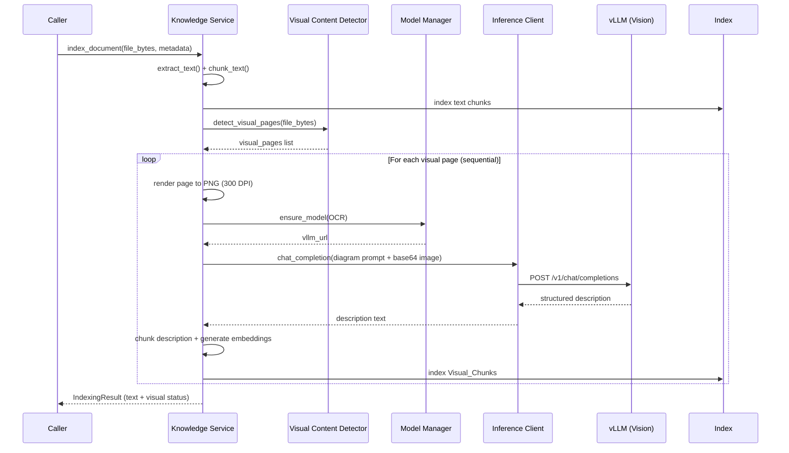
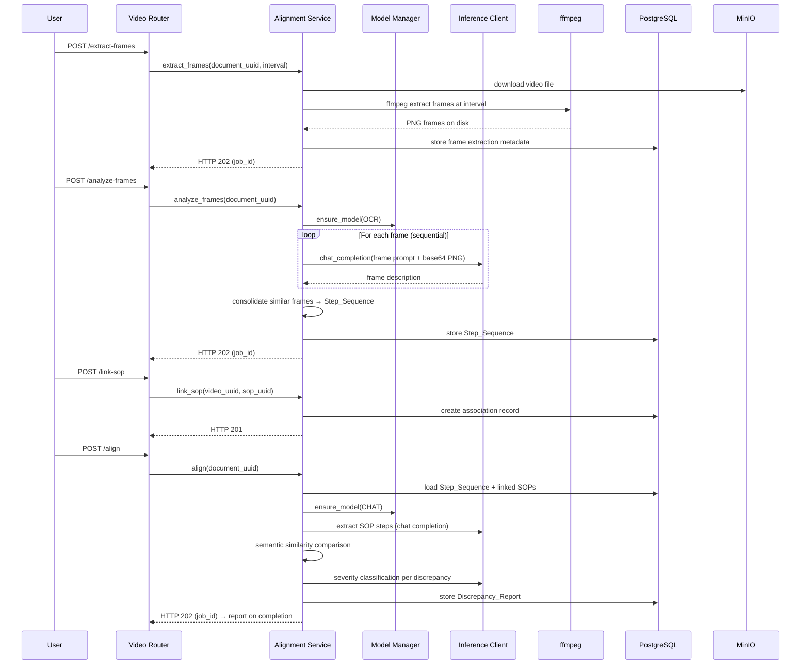

# Design Document: Multimodal Knowledge Base

## Overview

This design extends the existing Knowledge_Service and RAG_Pipeline with two multimodal capabilities:

1. **Diagram & Flowchart Understanding** — During document indexing, detect pages containing visual content (diagrams, flowcharts, charts), render them as images, send to the Vision_Model (gemma-4-E4B-it) for structured textual description, and index the resulting Visual_Chunks alongside regular text chunks for hybrid retrieval.

2. **Video-to-SOP Alignment** — Accept video uploads, extract frames via ffmpeg, analyze frames with the Vision_Model to produce a Step_Sequence, optionally transcribe audio, link videos to SOP documents, compare extracted steps against SOP procedures using semantic similarity, and generate severity-rated Discrepancy_Reports.

Both capabilities reuse the existing vLLM infrastructure (InferenceClient, ModelManager with `ensure_model(OCR)`) and integrate with the Knowledge_Service indexing and RAG_Pipeline retrieval flows. The system operates on a single GPU (24 GB VRAM) in an air-gapped network.

**Key Design Decisions:**
- Visual pages are processed sequentially (one at a time) to respect single-GPU constraints
- Frame extraction uses ffmpeg subprocess calls (already available in the container)
- The Alignment_Service is a new service class orchestrating all video operations
- Long-running operations (frame extraction, analysis, alignment) use async job tracking
- Visual_Chunks share the same index as text chunks with additional metadata fields for filtering

## Architecture

```mermaid
graph TB
    subgraph Frontend["Frontend (React)"]
        KP[Knowledge Page]
        VA[Video Alignment UI]
    end

    subgraph Backend["Backend (FastAPI)"]
        KR[Knowledge Router<br/>/api/knowledge]
        VR[Video Router<br/>/api/knowledge/videos]
        KS[Knowledge Service]
        AS[Alignment Service]
        VCD[Visual Content Detector]
        RP[RAG Pipeline]
        MM[Model Manager]
        IC[Inference Client]
        JT[Job Tracker]
    end

    subgraph Storage["Storage Layer"]
        PG[(PostgreSQL)]
        MIO[(MinIO)]
        IDX[(OpenSearch Index)]
    end

    subgraph vLLM["vLLM Instances"]
        MAIN[vLLM Main<br/>gemma-4-E4B-it (OCR/Vision)<br/>GPU: ~8 GB]
        EMB[vLLM Embedding<br/>Qwen3-Embedding-0.6B<br/>GPU: ~2 GB]
    end

    subgraph Tools["System Tools"]
        FF[ffmpeg / ffprobe]
    end

    KP --> KR
    VA --> VR

    KR --> RP
    KR --> KS
    VR --> AS

    KS --> VCD
    KS --> MM
    KS --> IC
    KS --> IDX

    AS --> MM
    AS --> IC
    AS --> FF
    AS --> JT
    AS --> PG
    AS --> MIO

    RP --> KS
    RP --> MM
    RP --> IC

    VCD --> KS

    MM --> MAIN
    MM --> EMB
    IC --> MAIN
    IC --> EMB

    JT --> PG
```

### Document Indexing Flow (Visual Content)



### Video-to-SOP Alignment Flow



## Components and Interfaces

### 1. VisualContentDetector (`visual_content_detector.py`)

New component responsible for identifying pages with visual content during indexing.

```python
from dataclasses import dataclass
from enum import Enum


class VisualType(str, Enum):
    """Classification of visual content on a page."""
    FLOWCHART = "flowchart"
    CHART = "chart"
    DIAGRAM = "diagram"
    MIXED = "mixed"


@dataclass
class VisualPageInfo:
    """Metadata about a detected visual page.

    Attributes:
        page_number: 0-indexed page number in the document.
        visual_type: Classification of the visual content.
        width: Page width in points.
        height: Page height in points.
        text_area_ratio: Ratio of text area to total page area (0.0-1.0).
    """
    page_number: int
    visual_type: VisualType
    width: float
    height: float
    text_area_ratio: float


class VisualContentDetector:
    """Detects pages containing diagrams, flowcharts, and visual elements.

    Analyzes PDF/DOCX pages by comparing extractable text area to total
    page area. Pages with text_area_ratio < 0.3 AND containing image/drawing
    objects are classified as visual content.

    Args:
        max_visual_pages: Maximum visual pages to process per document (default 100).
        page_timeout_seconds: Timeout per page analysis (default 30).
    """

    def __init__(
        self,
        max_visual_pages: int = 100,
        page_timeout_seconds: float = 30.0,
    ) -> None: ...

    def detect_visual_pages(
        self,
        file_bytes: bytes,
        content_type: str,
    ) -> list[VisualPageInfo]:
        """Analyze document pages for visual content.

        Processes pages sequentially after text extraction. Each page is
        analyzed within page_timeout_seconds; pages exceeding the timeout
        are skipped with a warning.

        Args:
            file_bytes: Raw document file content.
            content_type: MIME type (application/pdf or DOCX).

        Returns:
            List of VisualPageInfo for pages classified as visual content,
            capped at max_visual_pages.
        """
        ...

    def _classify_page(
        self,
        page: "fitz.Page",
    ) -> VisualType | None:
        """Classify a single page's visual content type.

        Returns None if the page does not meet visual content criteria.
        Classification logic:
        - "flowchart" if arrow connectors between shapes detected
        - "chart" if axis lines or data plot elements detected
        - "diagram" if shapes/images without arrow connectors
        - "mixed" if multiple categories match

        Args:
            page: PyMuPDF page object.

        Returns:
            VisualType classification or None if not visual.
        """
        ...
```

### 2. Knowledge Service Extensions (`knowledge_service.py`)

Extended with visual content indexing methods.

```python
class KnowledgeService:
    # ... existing methods ...

    async def index_document_with_visuals(
        self,
        file_bytes: bytes,
        content_type: str,
        document_uuid: str,
        version: str,
        metadata: dict[str, Any] | None = None,
    ) -> "IndexingResult":
        """Index document text and visual content.

        1. Extract text and create text chunks (existing flow)
        2. Detect visual pages via VisualContentDetector
        3. Process each visual page through Vision_Model
        4. Create Visual_Chunks with structured descriptions
        5. Index all chunks (text + visual) together

        Total visual processing capped at 300 seconds per document.

        Args:
            file_bytes: Raw document file content.
            content_type: MIME type of the document.
            document_uuid: Document UUID for indexing.
            version: Document version string.
            metadata: Optional document metadata.

        Returns:
            IndexingResult with text and visual indexing status.
        """
        ...

    async def _interpret_visual_page(
        self,
        page_png_bytes: bytes,
        visual_type: VisualType,
        page_number: int,
    ) -> str | None:
        """Send a visual page to the Vision_Model for interpretation.

        Uses a diagram-specific system prompt requesting structured output
        with Type, Elements, Connections, and Summary sections.

        Retries once on failure after 5-second delay. Returns None if
        both attempts fail or response is < 20 characters.

        Args:
            page_png_bytes: PNG image bytes of the rendered page.
            visual_type: Pre-classified visual type for prompt context.
            page_number: Page number for logging.

        Returns:
            Structured description text, or None on failure.
        """
        ...

    def _create_visual_chunks(
        self,
        description: str,
        document_uuid: str,
        version: str,
        visual_type: VisualType,
        source_page: int,
    ) -> list["VisualChunk"]:
        """Create Visual_Chunk objects from a description.

        Chunks the description using standard parameters (512 tokens,
        50 token overlap) and attaches visual metadata.

        Args:
            description: Structured description from Vision_Model.
            document_uuid: Parent document UUID.
            version: Document version.
            visual_type: Type of visual content.
            source_page: Source page number.

        Returns:
            List of VisualChunk objects ready for embedding and indexing.
        """
        ...
```

### 3. RAG Pipeline Extensions (`rag_pipeline.py`)

Extended to handle Visual_Chunks in retrieval and response formatting.

```python
class RAGPipeline:
    # ... existing methods ...

    # New configurable constants
    VISUAL_BOOST_KEYWORDS: list[str] = [
        "process", "flow", "flowchart", "diagram", "workflow",
        "steps", "procedure", "decision tree", "sequence",
    ]
    VISUAL_BOOST_FACTOR: float = 1.5  # configurable: 1.0-3.0
    MAX_VISUAL_CHUNKS_PER_QUERY: int = 3

    def _apply_visual_boost(
        self,
        query: str,
        results: list[SearchResult],
    ) -> list[SearchResult]:
        """Boost Visual_Chunk relevance for process-related queries.

        If the query contains any VISUAL_BOOST_KEYWORDS, multiply the
        relevance_score of Visual_Chunks by VISUAL_BOOST_FACTOR.

        Args:
            query: The user's search query.
            results: Search results from hybrid search.

        Returns:
            Results with boosted scores for visual chunks (if applicable).
        """
        ...

    def _limit_visual_chunks(
        self,
        results: list[SearchResult],
    ) -> list[SearchResult]:
        """Limit Visual_Chunks to MAX_VISUAL_CHUNKS_PER_QUERY.

        Selects the top-N highest-relevance Visual_Chunks and fills
        remaining slots with text chunks.

        Args:
            results: Ranked search results.

        Returns:
            Filtered results respecting the visual chunk limit.
        """
        ...

    def _build_context(self, search_results: list[SearchResult]) -> str:
        """Build context text with visual-aware formatting.

        Visual_Chunks use the pattern:
        [Source N: {title} v{version} - {visual_type} on page {source_page}]

        Regular text chunks use the existing pattern:
        [Source N: {title} v{version}]
        """
        ...
```

### 4. AlignmentService (`alignment_service.py`)

New service orchestrating all video-to-SOP operations.

```python
import uuid
from dataclasses import dataclass
from datetime import datetime
from enum import Enum
from typing import Any


class JobStatus(str, Enum):
    """Status of an async processing job."""
    PROCESSING = "processing"
    COMPLETED = "completed"
    FAILED = "failed"


class DiscrepancySeverity(str, Enum):
    """Severity rating for alignment discrepancies."""
    CRITICAL = "critical"
    MAJOR = "major"
    MINOR = "minor"


@dataclass
class StepDescription:
    """A single step extracted from video frame analysis."""
    start_timestamp: float
    end_timestamp: float
    description: str
    frame_indices: list[int]
    confidence: float
    audio_transcript: str | None = None


@dataclass
class SOPStep:
    """A procedural step extracted from an SOP document."""
    step_number: int
    description: str


@dataclass
class MatchedStep:
    """A video step matched to an SOP step."""
    video_step: StepDescription
    sop_step: SOPStep
    similarity_score: float


@dataclass
class Discrepancy:
    """A discrepancy between video and SOP."""
    step_description: str
    source: str  # "video" or "sop"
    severity: DiscrepancySeverity
    recommendation: str


@dataclass
class OrderMismatch:
    """Steps matched but in wrong order."""
    video_step: StepDescription
    sop_step: SOPStep
    video_position: int
    sop_position: int
    severity: DiscrepancySeverity


class AlignmentService:
    """Orchestrates video-to-SOP alignment operations.

    Manages frame extraction, vision analysis, audio transcription,
    SOP linking, step comparison, and discrepancy report generation.

    Args:
        model_manager: ModelManager for ensuring models are loaded.
        inference_client: InferenceClient for vLLM API calls.
        knowledge_service: KnowledgeService for embedding generation.
    """

    def __init__(
        self,
        model_manager: "ModelManager | None" = None,
        inference_client: "InferenceClient | None" = None,
        knowledge_service: "KnowledgeService | None" = None,
    ) -> None: ...

    async def extract_frames(
        self,
        document_uuid: str,
        interval_seconds: int = 5,
    ) -> str:
        """Extract frames from a video at the specified interval.

        Downloads video from MinIO, runs ffmpeg to extract PNG frames.
        Auto-adjusts interval if frame count would exceed 500.

        Args:
            document_uuid: UUID of the Video_Document.
            interval_seconds: Seconds between frame extractions (1-60).

        Returns:
            job_id for tracking the async operation.

        Raises:
            ValueError: If interval is out of range.
            FileNotFoundError: If video file not found in MinIO.
        """
        ...

    async def analyze_frames(
        self,
        document_uuid: str,
    ) -> str:
        """Analyze extracted frames via Vision_Model.

        Processes frames sequentially, consolidates similar descriptions
        into steps using embedding cosine similarity (threshold 0.85).

        Args:
            document_uuid: UUID of the Video_Document.

        Returns:
            job_id for tracking the async operation.

        Raises:
            ValueError: If frame extraction not completed.
        """
        ...

    async def transcribe_audio(
        self,
        document_uuid: str,
    ) -> str:
        """Extract and transcribe audio from video.

        Extracts audio via ffmpeg (WAV 16kHz mono), segments into
        30-second chunks, processes through speech-to-text model.

        Args:
            document_uuid: UUID of the Video_Document.

        Returns:
            job_id for tracking the async operation.
        """
        ...

    async def link_sop(
        self,
        video_document_uuid: str,
        sop_document_uuid: str,
        sop_version: str | None = None,
        company_id: int = 0,
    ) -> "SOPLinkRecord":
        """Link an SOP document to a Video_Document.

        Validates SOP exists, belongs to same tenant, and is of type SOP.
        Maximum 10 SOPs per video.

        Args:
            video_document_uuid: UUID of the Video_Document.
            sop_document_uuid: UUID of the SOP document to link.
            sop_version: Optional specific version (defaults to latest).
            company_id: Tenant company ID for validation.

        Returns:
            The created SOPLinkRecord.

        Raises:
            ValueError: If validation fails or max links reached.
        """
        ...

    async def align(
        self,
        document_uuid: str,
    ) -> str:
        """Run alignment between video steps and linked SOPs.

        1. Load Step_Sequence for the video
        2. For each linked SOP: extract procedural steps via Chat_Model
        3. Compare using semantic similarity (threshold 0.7)
        4. Classify severity of each discrepancy via Chat_Model
        5. Generate and store Discrepancy_Report

        Args:
            document_uuid: UUID of the Video_Document.

        Returns:
            job_id for tracking the async operation.

        Raises:
            ValueError: If Step_Sequence not available or no SOPs linked.
        """
        ...

    async def get_report(
        self,
        document_uuid: str,
    ) -> "DiscrepancyReport | None":
        """Retrieve the latest Discrepancy_Report for a video.

        Args:
            document_uuid: UUID of the Video_Document.

        Returns:
            The most recent DiscrepancyReport, or None if none exists.
        """
        ...
```

### 5. JobTracker (`job_tracker.py`)

New component for tracking async processing jobs.

```python
@dataclass
class JobState:
    """State of an async processing job."""
    job_id: str
    document_uuid: str
    operation: str  # "extract_frames", "analyze_frames", "transcribe_audio", "align"
    status: JobStatus
    started_at: datetime
    completed_at: datetime | None = None
    progress_percent: int = 0
    estimated_duration_seconds: int = 0
    result_reference: str | None = None
    error_message: str | None = None


class JobTracker:
    """Tracks async processing job states in PostgreSQL.

    Provides job creation, status updates, and conflict detection
    for concurrent operations on the same document.

    Args:
        db_session: SQLAlchemy async session factory.
    """

    def __init__(self) -> None: ...

    async def create_job(
        self,
        document_uuid: str,
        operation: str,
        estimated_duration_seconds: int = 0,
    ) -> JobState:
        """Create a new job, checking for conflicts.

        Raises ValueError if a job for the same document+operation
        is already in PROCESSING state.
        """
        ...

    async def update_progress(
        self,
        job_id: str,
        progress_percent: int,
    ) -> None: ...

    async def complete_job(
        self,
        job_id: str,
        result_reference: str | None = None,
    ) -> None: ...

    async def fail_job(
        self,
        job_id: str,
        error_message: str,
    ) -> None: ...

    async def get_job(self, job_id: str) -> JobState | None: ...

    async def has_active_job(
        self,
        document_uuid: str,
        operation: str,
    ) -> str | None:
        """Check if an active job exists. Returns job_id if so."""
        ...
```

### 6. Video Alignment Router (`api/video_alignment.py`)

New FastAPI router for all video alignment endpoints.

```python
from fastapi import APIRouter, Depends, Header, HTTPException

router = APIRouter(prefix="/knowledge/videos", tags=["Video Alignment"])


@router.post("/{document_uuid}/extract-frames", status_code=202)
async def extract_frames(
    document_uuid: str,
    interval_seconds: int = Query(default=5, ge=1, le=60),
    x_user_id: int = Header(..., alias="X-User-Id"),
    x_company_id: int = Header(..., alias="X-Company-Id"),
    x_change_reason: str = Header(..., alias="X-Change-Reason"),
) -> JobStatusResponse: ...


@router.post("/{document_uuid}/analyze-frames", status_code=202)
async def analyze_frames(
    document_uuid: str,
    x_user_id: int = Header(..., alias="X-User-Id"),
    x_company_id: int = Header(..., alias="X-Company-Id"),
    x_change_reason: str = Header(..., alias="X-Change-Reason"),
) -> JobStatusResponse: ...


@router.post("/{document_uuid}/transcribe-audio", status_code=202)
async def transcribe_audio(
    document_uuid: str,
    x_user_id: int = Header(..., alias="X-User-Id"),
    x_company_id: int = Header(..., alias="X-Company-Id"),
    x_change_reason: str = Header(..., alias="X-Change-Reason"),
) -> JobStatusResponse: ...


@router.post("/{document_uuid}/link-sop", status_code=201)
async def link_sop(
    document_uuid: str,
    request: LinkSOPRequest,
    x_user_id: int = Header(..., alias="X-User-Id"),
    x_company_id: int = Header(..., alias="X-Company-Id"),
    x_change_reason: str = Header(..., alias="X-Change-Reason"),
) -> SOPLinkResponse: ...


@router.post("/{document_uuid}/align", status_code=202)
async def trigger_alignment(
    document_uuid: str,
    x_user_id: int = Header(..., alias="X-User-Id"),
    x_company_id: int = Header(..., alias="X-Company-Id"),
    x_change_reason: str = Header(..., alias="X-Change-Reason"),
) -> JobStatusResponse: ...


@router.get("/{document_uuid}/report")
async def get_report(
    document_uuid: str,
    x_user_id: int = Header(..., alias="X-User-Id"),
    x_company_id: int = Header(..., alias="X-Company-Id"),
) -> DiscrepancyReportResponse: ...


@router.get("/jobs/{job_id}")
async def get_job_status(
    job_id: str,
    x_user_id: int = Header(..., alias="X-User-Id"),
    x_company_id: int = Header(..., alias="X-Company-Id"),
) -> JobStatusDetailResponse: ...
```

## Data Models

### Database Tables (SQLAlchemy)

#### `video_metadata` — Video-specific metadata for Training Video documents

```python
class VideoMetadata(Base):
    """Video-specific metadata stored alongside the Document record."""
    __tablename__ = "video_metadata"

    id: Mapped[int] = mapped_column(primary_key=True)
    document_id: Mapped[int] = mapped_column(ForeignKey("documents.id"), unique=True)
    duration_seconds: Mapped[float | None] = mapped_column(nullable=True)
    resolution_width: Mapped[int | None] = mapped_column(nullable=True)
    resolution_height: Mapped[int | None] = mapped_column(nullable=True)
    frame_count: Mapped[int | None] = mapped_column(nullable=True)
    codec: Mapped[str | None] = mapped_column(String(50), nullable=True)
    created_at: Mapped[datetime] = mapped_column(
        DateTime(timezone=True), server_default=func.now()
    )
```

#### `video_step_sequences` — Extracted steps from video frame analysis

```python
class VideoStepSequence(Base):
    """A single step in the extracted Step_Sequence for a video."""
    __tablename__ = "video_step_sequences"

    id: Mapped[int] = mapped_column(primary_key=True)
    document_id: Mapped[int] = mapped_column(ForeignKey("documents.id"), index=True)
    step_index: Mapped[int] = mapped_column()
    start_timestamp: Mapped[float] = mapped_column()
    end_timestamp: Mapped[float] = mapped_column()
    description: Mapped[str] = mapped_column(Text)
    frame_indices: Mapped[str] = mapped_column(Text)  # JSON array
    confidence: Mapped[float] = mapped_column(default=1.0)
    audio_transcript: Mapped[str | None] = mapped_column(Text, nullable=True)
    created_at: Mapped[datetime] = mapped_column(
        DateTime(timezone=True), server_default=func.now()
    )
```

#### `video_sop_links` — Association between videos and SOPs

```python
class VideoSOPLink(Base):
    """Links a Video_Document to an SOP document for alignment."""
    __tablename__ = "video_sop_links"

    id: Mapped[int] = mapped_column(primary_key=True)
    video_document_id: Mapped[int] = mapped_column(ForeignKey("documents.id"), index=True)
    sop_document_id: Mapped[int] = mapped_column(ForeignKey("documents.id"))
    sop_version: Mapped[str] = mapped_column(String(20))
    linked_at: Mapped[datetime] = mapped_column(
        DateTime(timezone=True), server_default=func.now()
    )
    linked_by: Mapped[int] = mapped_column(ForeignKey("users.id"))
    company_id: Mapped[int] = mapped_column(ForeignKey("companies.id"))

    __table_args__ = (
        UniqueConstraint("video_document_id", "sop_document_id", name="uq_video_sop_link"),
    )
```

#### `discrepancy_reports` — Generated alignment reports

```python
class DiscrepancyReport(Base):
    """Stored discrepancy report from video-to-SOP alignment."""
    __tablename__ = "discrepancy_reports"

    id: Mapped[int] = mapped_column(primary_key=True)
    video_document_id: Mapped[int] = mapped_column(ForeignKey("documents.id"), index=True)
    sop_document_id: Mapped[int] = mapped_column(ForeignKey("documents.id"))
    alignment_score: Mapped[float] = mapped_column()
    total_video_steps: Mapped[int] = mapped_column()
    total_sop_steps: Mapped[int] = mapped_column()
    matched_steps: Mapped[str] = mapped_column(Text)  # JSON
    missing_steps: Mapped[str] = mapped_column(Text)  # JSON
    extra_steps: Mapped[str] = mapped_column(Text)  # JSON
    order_mismatches: Mapped[str] = mapped_column(Text)  # JSON
    requires_review: Mapped[bool] = mapped_column(default=False)
    generated_at: Mapped[datetime] = mapped_column(
        DateTime(timezone=True), server_default=func.now()
    )
    generated_by: Mapped[int] = mapped_column(ForeignKey("users.id"))
    company_id: Mapped[int] = mapped_column(ForeignKey("companies.id"))
```

#### `processing_jobs` — Async job tracking

```python
class ProcessingJob(Base):
    """Tracks async processing jobs for video operations."""
    __tablename__ = "processing_jobs"

    id: Mapped[int] = mapped_column(primary_key=True)
    job_id: Mapped[str] = mapped_column(String(36), unique=True, index=True)
    document_id: Mapped[int] = mapped_column(ForeignKey("documents.id"), index=True)
    operation: Mapped[str] = mapped_column(String(50))  # extract_frames, analyze_frames, etc.
    status: Mapped[str] = mapped_column(String(20))  # processing, completed, failed
    progress_percent: Mapped[int] = mapped_column(default=0)
    estimated_duration_seconds: Mapped[int] = mapped_column(default=0)
    result_reference: Mapped[str | None] = mapped_column(String(500), nullable=True)
    error_message: Mapped[str | None] = mapped_column(Text, nullable=True)
    started_at: Mapped[datetime] = mapped_column(
        DateTime(timezone=True), server_default=func.now()
    )
    completed_at: Mapped[datetime | None] = mapped_column(
        DateTime(timezone=True), nullable=True
    )
    company_id: Mapped[int] = mapped_column(ForeignKey("companies.id"))
```

### Pydantic Request/Response Schemas

```python
from pydantic import BaseModel, Field
from datetime import datetime


# --- Video Alignment Schemas ---

class LinkSOPRequest(BaseModel):
    """Request to link an SOP document to a video."""
    sop_document_uuid: str = Field(..., description="UUID of the SOP document")
    sop_version: str | None = Field(None, description="Specific version, defaults to latest")


class SOPLinkResponse(BaseModel):
    """Response after successfully linking an SOP."""
    video_document_uuid: str
    sop_document_uuid: str
    sop_version: str
    linked_at: datetime


class JobStatusResponse(BaseModel):
    """Response for async job creation (HTTP 202)."""
    job_id: str
    status: str = "processing"
    estimated_duration_seconds: int


class JobStatusDetailResponse(BaseModel):
    """Detailed job status for polling."""
    job_id: str
    status: str  # processing, completed, failed
    started_at: datetime
    completed_at: datetime | None = None
    progress_percent: int = 0
    result_reference: str | None = None
    error_message: str | None = None


class MatchedStepResponse(BaseModel):
    """A matched step in the discrepancy report."""
    video_step_description: str
    sop_step_text: str
    similarity_score: float
    video_timestamp_start: float
    video_timestamp_end: float


class DiscrepancyStepResponse(BaseModel):
    """A missing or extra step in the discrepancy report."""
    step_description: str
    source: str  # "video" or "sop"
    severity: str  # critical, major, minor
    recommendation: str


class OrderMismatchResponse(BaseModel):
    """An order mismatch in the discrepancy report."""
    video_step_description: str
    sop_step_text: str
    video_position: int
    sop_position: int
    severity: str


class DiscrepancyReportResponse(BaseModel):
    """Full discrepancy report response."""
    alignment_score: float = Field(..., ge=0.0, le=1.0)
    matched_steps: list[MatchedStepResponse]
    missing_steps: list[DiscrepancyStepResponse]
    extra_steps: list[DiscrepancyStepResponse]
    order_mismatches: list[OrderMismatchResponse]
    total_video_steps: int
    total_sop_steps: int
    generated_at: datetime
    requires_review: bool


# --- Visual Content Indexing Schemas ---

class IndexingResult(BaseModel):
    """Result of document indexing with visual content."""
    document_uuid: str
    version: str
    text_chunks_count: int
    visual_chunks_count: int
    visual_indexing_status: str  # not_applicable, pending, completed, partial
    visual_pages_detected: int
    visual_pages_processed: int
    indexing_duration_ms: int


# --- Extended Source Citation ---

class VisualSourceCitationResponse(BaseModel):
    """Source citation with visual content metadata."""
    document_uuid: str
    title: str
    version: str
    page_or_section: str
    content_type: str = "text"  # "text" or "visual"
    visual_type: str | None = None  # flowchart, diagram, chart, mixed
```

### Configuration Extensions (`config.py`)

New settings added to the existing `Settings` class:

```python
# ─────────────────────────────────────────────────────────────────────
# Multimodal Knowledge Base
# ─────────────────────────────────────────────────────────────────────

enable_visual_indexing: bool = Field(
    default=True,
    description="Enable visual content detection and indexing during document processing.",
    alias="ENABLE_VISUAL_INDEXING",
)
visual_boost_factor: float = Field(
    default=1.5,
    ge=1.0,
    le=3.0,
    description="Relevance boost factor for Visual_Chunks on process-related queries.",
    alias="VISUAL_BOOST_FACTOR",
)
max_visual_pages_per_document: int = Field(
    default=100,
    ge=1,
    le=500,
    description="Maximum visual pages to process per document.",
    alias="MAX_VISUAL_PAGES_PER_DOCUMENT",
)
video_max_file_size_bytes: int = Field(
    default=2_147_483_648,  # 2 GB
    description="Maximum video file size in bytes.",
    alias="VIDEO_MAX_FILE_SIZE_BYTES",
)
video_max_frames: int = Field(
    default=500,
    description="Maximum frames to extract from a video.",
    alias="VIDEO_MAX_FRAMES",
)
frame_similarity_threshold: float = Field(
    default=0.85,
    ge=0.5,
    le=1.0,
    description="Cosine similarity threshold for consolidating consecutive frames.",
    alias="FRAME_SIMILARITY_THRESHOLD",
)
alignment_match_threshold: float = Field(
    default=0.7,
    ge=0.3,
    le=1.0,
    description="Cosine similarity threshold for step matching during alignment.",
    alias="ALIGNMENT_MATCH_THRESHOLD",
)
ffmpeg_path: str = Field(
    default="ffmpeg",
    description="Path to ffmpeg binary.",
    alias="FFMPEG_PATH",
)
ffprobe_path: str = Field(
    default="ffprobe",
    description="Path to ffprobe binary.",
    alias="FFPROBE_PATH",
)
```

## Correctness Properties

*A property is a characteristic or behavior that should hold true across all valid executions of a system — essentially, a formal statement about what the system should do. Properties serve as the bridge between human-readable specifications and machine-verifiable correctness guarantees.*

### Property 1: Visual content classification correctness

*For any* PDF page with a measurable text_area_ratio and a known presence/absence of image or drawing objects, the VisualContentDetector SHALL classify the page as visual content if and only if text_area_ratio < 0.3 AND the page contains at least one image or drawing object. Pages meeting only one condition (low text but no images, or images but high text) SHALL NOT be classified as visual.

**Validates: Requirements 1.1, 1.2, 1.7**

### Property 2: Visual classification type assignment

*For any* page classified as visual content, the assigned VisualType SHALL be: "flowchart" if arrow connectors between shapes are detected, "chart" if axis lines or data plot elements are detected, "diagram" if shapes/images without arrow connectors are present, or "mixed" if multiple categories match. The output metadata SHALL include the page number, classification type, and page dimensions.

**Validates: Requirements 1.3**

### Property 3: Visual page processing cap

*For any* document containing N pages classified as visual content where N > 100, the VisualContentDetector SHALL process only the first 100 visual pages and return exactly 100 VisualPageInfo records.

**Validates: Requirements 1.5**

### Property 4: Mock mode isolation (no HTTP requests)

*For any* inference operation (visual page interpretation, frame analysis, audio transcription, alignment) when `MODEL_MANAGER_MODE` is "mock", the system SHALL return placeholder responses without making any HTTP requests to any vLLM server, and SHALL create correctly-structured output objects with placeholder content.

**Validates: Requirements 1.6, 2.8, 6.10, 7.9**

### Property 5: Visual description minimum length validation

*For any* Vision_Model response for a visual page, if the response text has fewer than 20 characters, the system SHALL discard it and not create any Visual_Chunks for that page. If the response has 20 or more characters, it SHALL be accepted for chunking.

**Validates: Requirements 2.7**

### Property 6: Visual_Chunk metadata correctness

*For any* successfully interpreted visual page, all resulting Visual_Chunk objects SHALL contain metadata fields `content_type: "visual"`, `is_visual: true`, `visual_type` matching the page classification, `source_page` matching the page number, and the correct `document_uuid` and `version`.

**Validates: Requirements 2.3, 2.5**

### Property 7: Visual source citation formatting

*For any* Visual_Chunk included in RAG context, the formatted source reference SHALL follow the pattern `[Source N: {title} v{version} - {visual_type} on page {source_page}]` and the corresponding citation SHALL include `content_type: "visual"` and the `visual_type` field.

**Validates: Requirements 3.2, 3.3**

### Property 8: Visual chunk relevance boost for process queries

*For any* user query containing at least one keyword from the configurable VISUAL_BOOST_KEYWORDS list, the relevance_score of all Visual_Chunks in the result set SHALL be multiplied by the configured VISUAL_BOOST_FACTOR (default 1.5, range 1.0-3.0) before ranking. For queries containing no boost keywords, Visual_Chunk scores SHALL remain unmodified.

**Validates: Requirements 3.5**

### Property 9: Visual chunk limit per query

*For any* RAG query result set, the number of Visual_Chunks included in the final context SHALL not exceed 3, with the 3 highest-relevance Visual_Chunks selected when more are available, and remaining retrieval slots filled by text chunks.

**Validates: Requirements 3.6**

### Property 10: Video upload validation

*For any* file upload attempt, the system SHALL accept the file if and only if: the content type is one of (video/mp4, video/x-msvideo, video/quicktime, video/webm) AND the file size is > 0 bytes AND the file size is <= 2 GB. All other combinations SHALL be rejected with HTTP 422.

**Validates: Requirements 4.1, 4.2**

### Property 11: Frame extraction count and interval calculation

*For any* video with duration D seconds and requested interval I seconds (1 ≤ I ≤ 60), the number of extracted frames SHALL equal min(ceil(D / I), 500). If ceil(D / I) > 500, the effective interval SHALL be automatically adjusted to ceil(D / 500) to ensure no more than 500 frames are produced.

**Validates: Requirements 5.1, 5.5**

### Property 12: Concurrent operation conflict detection

*For any* Video_Document that has a processing job in "processing" state for a given operation type, a new request for the same operation on the same document SHALL be rejected with HTTP 409 and the response SHALL include the existing job_id.

**Validates: Requirements 5.8, 6.9, 7.8, 10.8**

### Property 13: Frame consolidation into steps

*For any* ordered sequence of frame descriptions with their embedding vectors, consecutive frames whose pairwise cosine similarity exceeds 0.85 SHALL be consolidated into a single step. The resulting step SHALL have start_timestamp equal to the first frame's timestamp, end_timestamp equal to the last frame's timestamp, and frame_indices listing all constituent frame indices. The confidence score SHALL equal the ratio of successfully analyzed frames to total frames within that step's range.

**Validates: Requirements 6.5, 6.6**

### Property 14: Frame analysis abort threshold

*For any* frame analysis operation where more than 50% of frames fail Vision_Model analysis, the system SHALL abort the analysis, remove any partially generated Step_Sequence data, and report failure. If 50% or fewer frames fail, the system SHALL continue and produce a Step_Sequence from the successful frames.

**Validates: Requirements 6.8**

### Property 15: Audio transcript segment merge by timestamp overlap

*For any* Step_Sequence and set of audio transcript segments, each transcript segment SHALL be assigned to the step whose timestamp range has the greatest duration of overlap with the segment's time range. Each step's audio_transcript field SHALL contain the concatenated text of all assigned segments in chronological order.

**Validates: Requirements 7.7**

### Property 16: Step comparison classification

*For any* pair of video Step_Sequence and SOP step list with computed pairwise cosine similarities, the alignment algorithm SHALL classify each pair as: "matched" if similarity ≥ 0.7, "missing" (video step with no SOP step ≥ 0.7), "extra" (SOP step with no video step ≥ 0.7), or "order_mismatch" (matched but sequence position difference ≥ 2). The alignment_score SHALL equal the count of matched video steps divided by total video steps.

**Validates: Requirements 8.7, 9.1**

### Property 17: Discrepancy severity fallback

*For any* discrepancy where the Chat_Model fails to assess severity (timeout, HTTP error, or unparseable response), the system SHALL assign a default severity of "major". For any discrepancy where recommendation generation fails, the system SHALL set a generic recommendation indicating manual review is required.

**Validates: Requirements 9.4, 9.9**

### Property 18: Requires-review flag threshold

*For any* Discrepancy_Report with an alignment_score below 0.5, the `requires_review` field SHALL be set to true. For alignment_scores of 0.5 or above, `requires_review` SHALL be false.

**Validates: Requirements 9.10**

### Property 19: Text indexing independence from visual processing

*For any* document submitted for indexing, text chunks SHALL always be successfully indexed regardless of whether visual content detection or Vision_Model interpretation succeeds or fails. Visual processing failures SHALL not prevent or delay text chunk indexing, and the visual_indexing_status SHALL be set to "partial" when some visual pages fail.

**Validates: Requirements 12.1, 12.2**

### Property 20: Visual indexing status correctness

*For any* document indexing operation, the visual_indexing_status SHALL be: "not_applicable" if no visual content was detected or ENABLE_VISUAL_INDEXING is false, "pending" if visual content was detected but not yet processed, "completed" if all visual pages were processed successfully, or "partial" if one or more visual pages failed or were skipped.

**Validates: Requirements 12.3, 12.5, 12.6**

### Property 21: Re-indexing removes stale Visual_Chunks

*For any* document that is re-indexed (new version uploaded), all previous Visual_Chunks for that document_uuid and version SHALL be removed from the index before new Visual_Chunks are created, ensuring no stale visual descriptions persist.

**Validates: Requirements 12.4**

## Error Handling

### Error Hierarchy

```
Exception
├── InferenceError (existing)
│   ├── InferenceTimeoutError
│   └── InferenceConnectionError
├── ModelManagerError (existing)
├── AlignmentError (NEW)
│   ├── FrameExtractionError
│   │   └── "Frame extraction failed for {document_uuid}: {reason}"
│   ├── FrameAnalysisError
│   │   └── "Frame analysis failed: {failed_count}/{total_count} frames failed"
│   ├── AlignmentPreconditionError
│   │   └── "Cannot align: {reason}" (no step sequence, no SOPs linked)
│   └── SOPLinkError
│       └── "Cannot link SOP: {reason}" (not found, wrong tenant, max reached)
├── VisualContentError (NEW)
│   ├── VisualDetectionError
│   │   └── "Visual detection failed for page {page}: {reason}"
│   └── VisualInterpretationError
│       └── "Vision model interpretation failed for page {page}: {reason}"
└── JobConflictError (NEW)
    └── "Operation {operation} already in progress for {document_uuid} (job: {job_id})"
```

### Error Handling Strategy

| Scenario | Behavior | HTTP Status | Recovery |
|----------|----------|-------------|----------|
| Visual detection timeout (30s/page) | Skip page, log warning | N/A (internal) | Continue with next page |
| Vision_Model interpretation failure | Retry once after 5s; if retry fails, skip page | N/A (internal) | Continue processing |
| Vision_Model response < 20 chars | Discard, log warning | N/A (internal) | Continue processing |
| All visual pages fail | Set status="partial", return success | 200 | Text indexing unaffected |
| Visual processing exceeds 300s total | Skip remaining pages, log warning | N/A (internal) | Return partial results |
| ffprobe metadata extraction failure | Store video with null metadata | 200 | Video still usable |
| ffmpeg frame extraction failure | Mark job as "failed", clean up frames | 500 (via job status) | User can retry |
| Frame analysis >50% failure rate | Abort, clean up partial data | 500 (via job status) | User can retry |
| Single frame analysis failure | Mark frame "unanalyzed", continue | N/A (internal) | Reduced confidence |
| Audio extraction failure (no track) | Return empty transcript | 200 | Optional feature |
| Audio extraction failure (corrupt) | Return error | 422 | User informed |
| Speech-to-text model unavailable | Return service unavailable | 503 | Optional feature |
| SOP not found / wrong tenant | Validation error | 404 / 403 | User corrects input |
| Max 10 SOPs reached | Validation error | 422 | User removes existing link |
| Duplicate SOP link | Conflict | 409 | Idempotent (already linked) |
| Alignment with no Step_Sequence | Precondition failure | 422 | User runs frame analysis first |
| Alignment with no linked SOPs | Precondition failure | 422 | User links SOPs first |
| Chat_Model severity assessment failure | Default to "major" severity | N/A (internal) | Report still generated |
| Chat_Model recommendation failure | Generic "manual review" text | N/A (internal) | Report still generated |
| Concurrent operation on same document | Conflict detection | 409 | User waits for current job |
| Invalid document_uuid format | Validation error | 422 | User corrects input |
| Document not found | Not found | 404 | User corrects UUID |
| Document belongs to different company | Forbidden | 403 | Tenant isolation enforced |

### Graceful Degradation

1. **Visual indexing disabled** (`ENABLE_VISUAL_INDEXING=false`): Text indexing works normally, visual features silently skipped
2. **Vision_Model unavailable**: Text indexing succeeds, visual pages marked "pending" for future processing
3. **ffmpeg not installed**: Video upload succeeds (metadata fields null), frame extraction fails with clear error
4. **Speech-to-text unavailable**: Video analysis works without audio, transcription returns 503
5. **Chat_Model unavailable during alignment**: Severity defaults to "major", recommendations use generic text
6. **Partial frame analysis**: Steps generated from successful frames with reduced confidence scores

## Testing Strategy

### Test Framework and Libraries

- **Framework:** pytest with pytest-asyncio
- **Property-based testing:** Hypothesis (already in use per `.hypothesis/` directory)
- **HTTP mocking:** respx (for httpx async client mocking)
- **Subprocess mocking:** unittest.mock for ffmpeg/ffprobe calls
- **Run command:** `uv run pytest --tb=short -q` from `src/backend/`

### Test Structure

```
src/backend/tests/
├── test_visual_content_detector.py      # NEW: Visual detection logic
├── test_knowledge_service_visual.py     # NEW: Visual indexing pipeline
├── test_rag_pipeline_visual.py          # NEW: Visual chunk retrieval + boost
├── test_alignment_service.py            # NEW: Video alignment operations
├── test_alignment_service_frames.py     # NEW: Frame extraction + analysis
├── test_alignment_service_audio.py      # NEW: Audio transcription + merge
├── test_alignment_service_comparison.py # NEW: Step comparison algorithm
├── test_job_tracker.py                  # NEW: Async job tracking
├── test_video_alignment_api.py          # NEW: API endpoint tests
└── test_video_upload.py                 # NEW: Video upload validation
```

### Property-Based Tests (Hypothesis)

Each correctness property maps to a property-based test with minimum 100 iterations:

| Property | Test File | Strategy |
|----------|-----------|----------|
| P1: Classification correctness | test_visual_content_detector.py | Generate random (ratio, has_images) pairs |
| P2: Classification type | test_visual_content_detector.py | Generate pages with various shape/connector patterns |
| P3: Visual page cap | test_visual_content_detector.py | Generate documents with 50-200 visual pages |
| P4: Mock mode isolation | test_knowledge_service_visual.py | Generate random operations in mock mode, verify no HTTP |
| P5: Description min length | test_knowledge_service_visual.py | Generate strings of length 0-100, verify accept/reject |
| P6: Visual_Chunk metadata | test_knowledge_service_visual.py | Generate random descriptions + metadata, verify fields |
| P7: Visual citation formatting | test_rag_pipeline_visual.py | Generate Visual_Chunks with random metadata |
| P8: Visual boost | test_rag_pipeline_visual.py | Generate queries with/without keywords + result sets |
| P9: Visual chunk limit | test_rag_pipeline_visual.py | Generate result sets with 0-10 visual chunks |
| P10: Video upload validation | test_video_upload.py | Generate random (content_type, file_size) pairs |
| P11: Frame count calculation | test_alignment_service_frames.py | Generate random (duration, interval) pairs |
| P12: Conflict detection | test_job_tracker.py | Generate job states + new requests |
| P13: Frame consolidation | test_alignment_service_frames.py | Generate frame embedding sequences with known similarities |
| P14: Abort threshold | test_alignment_service_frames.py | Generate random frame counts + failure patterns |
| P15: Transcript merge | test_alignment_service_audio.py | Generate step sequences + transcript segments |
| P16: Step comparison | test_alignment_service_comparison.py | Generate step pairs with known cosine similarities |
| P17: Severity fallback | test_alignment_service_comparison.py | Generate discrepancies with mock failures |
| P18: Requires-review flag | test_alignment_service_comparison.py | Generate random alignment scores |
| P19: Text indexing independence | test_knowledge_service_visual.py | Generate documents with visual failures |
| P20: Visual indexing status | test_knowledge_service_visual.py | Generate various indexing outcomes |
| P21: Re-indexing cleanup | test_knowledge_service_visual.py | Generate re-index scenarios |

**Tag format:** `# Feature: Step_4-4_multimodal-knowledge-base, Property N: {property_text}`

**Configuration:** Each property test uses `@given(...)` with `@settings(max_examples=100)`

### Unit Tests (Example-Based)

Key example-based tests for specific scenarios:

1. **Diagram prompt content:** Verify system prompt contains Type, Elements, Connections, Summary instructions
2. **Frame analysis prompt:** Verify prompt requests action, equipment, PPE, text, concise description
3. **ffprobe metadata extraction:** Mock ffprobe JSON output, verify parsing
4. **ffprobe timeout:** Mock slow ffprobe, verify null metadata stored
5. **ffmpeg frame extraction:** Mock ffmpeg subprocess, verify correct arguments
6. **Audio WAV conversion:** Verify ffmpeg called with correct format arguments (16kHz mono)
7. **SOP step extraction prompt:** Verify Chat_Model prompt structure
8. **HTTP 409 conflict response:** Verify response includes existing job_id
9. **HTTP 422 precondition failures:** Verify clear error messages for each precondition
10. **Visual page timeout (30s):** Mock slow page processing, verify skip + warning
11. **Total visual timeout (300s):** Mock slow processing, verify remaining pages skipped
12. **Frontend citation rendering:** Verify visual citations include icon indicator and badge

### Integration Tests (Optional — requires running vLLM + ffmpeg)

Marked with `@pytest.mark.integration` and skipped by default:
- Real visual page interpretation with loaded vision model
- Real frame extraction from a test video file
- Real frame analysis with vision model
- Real embedding generation for step comparison
- End-to-end alignment with a test video and SOP document

### Test Dependencies

Already installed:
- `pytest`, `pytest-asyncio` — test framework
- `hypothesis` — property-based testing
- `respx` — async HTTP mocking

To verify available:
- `ffmpeg`, `ffprobe` — system binaries (mock in unit tests)
