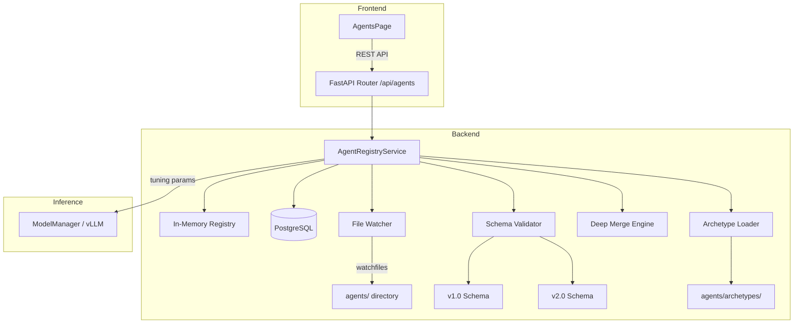
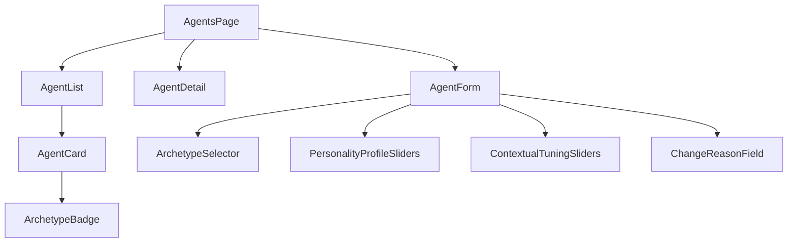

# Design Document: Modular Agent Registry & Personality Framework

## Overview

This design extends the existing Agent Registry from an in-memory, YAML-only system into a full-featured modular registry with personality framework, database persistence, hot-reload capability, and CRUD API. The architecture introduces:

1. **Agent Schema v2.0** — Backward-compatible extension adding archetype, personality_profile, contextual_tuning, and evaluation_rubric fields
2. **Predefined Archetypes** — Six role-based templates stored as YAML in `agents/archetypes/`
3. **Hot-Reload** — Filesystem watching via `watchfiles` for zero-downtime agent updates
4. **Database Persistence** — PostgreSQL storage with JSONB columns for structured data
5. **CRUD API** — Full REST endpoints with company scoping and audit compliance
6. **Frontend UI** — React-based agent management with archetype selection and parameter tuning

The system maintains full backward compatibility with v1.0 agent definitions while enabling the richer v2.0 format for new agents.

## Architecture



### Key Design Decisions

1. **Dual-schema validation**: A `SchemaValidator` class dispatches to v1.0 or v2.0 JSON Schema based on `schema_version` field, enabling backward compatibility without conditional logic scattered throughout the codebase.

2. **Database as source of truth, memory as cache**: The database holds the canonical state. The in-memory registry is a read-optimized cache rebuilt on startup and kept in sync via service-layer operations. This supports multi-instance deployments.

3. **Deep merge for archetype instantiation**: When creating agents from archetypes, a recursive deep merge allows users to override individual nested fields (e.g., just `personality_profile.strictness`) without needing to specify the entire object.

4. **Soft-delete pattern**: Agents are never physically deleted — `is_active=False` preserves audit trail integrity while removing them from active use.

5. **Company scoping via header**: All operations are scoped to `X-Company-Id` header, consistent with the existing multi-tenancy pattern used across the application.

## Components and Interfaces

### 1. Schema Validator (`alcoabase/services/schema_validator.py`)

Responsible for validating agent definitions against the appropriate JSON Schema version.

```python
class SchemaValidator:
    """Validates agent definitions against v1.0 or v2.0 JSON Schema."""

    def __init__(self, schema_dir: Path) -> None: ...
    def validate(self, data: dict[str, Any]) -> list[str]: ...
    def get_schema_version(self, data: dict[str, Any]) -> str: ...
    def is_supported_version(self, version: str) -> bool: ...
```

### 2. Agent Registry Service (`alcoabase/services/agent_registry.py`)

Extended from the existing `AgentRegistry` class to add database persistence, hot-reload, and archetype management.

```python
class AgentRegistryService:
    """Extended agent registry with DB persistence and hot-reload."""

    def __init__(
        self,
        session_factory: async_sessionmaker[AsyncSession],
        schema_validator: SchemaValidator,
        agents_dir: Path,
        archetypes_dir: Path,
    ) -> None: ...

    # CRUD operations
    async def create_agent(self, data: dict, company_id: int, user_id: int) -> AgentDefinitionDB: ...
    async def get_agent(self, agent_id: int, company_id: int) -> AgentDefinitionDB | None: ...
    async def list_agents(self, company_id: int, archetype: str | None = None) -> list[AgentDefinitionDB]: ...
    async def update_agent(self, agent_id: int, data: dict, company_id: int) -> AgentDefinitionDB: ...
    async def delete_agent(self, agent_id: int, company_id: int) -> None: ...

    # Archetype operations
    def list_archetypes(self) -> list[ArchetypeDefinition]: ...
    async def create_from_archetype(
        self, archetype_id: str, name: str, overrides: dict | None, company_id: int, user_id: int
    ) -> AgentDefinitionDB: ...

    # Hot-reload
    async def start_watcher(self) -> None: ...
    async def stop_watcher(self) -> None: ...
    async def reload(self) -> ReloadSummary: ...

    # Tuning
    def get_tuning_params(self, agent_id: int, overrides: dict | None = None) -> ContextualTuning: ...
    def get_system_prompt_with_rubric(self, agent_id: int) -> str: ...

    # Startup sync
    async def initialize(self) -> None: ...
```

### 3. Deep Merge Utility (`alcoabase/services/deep_merge.py`)

Pure function for recursively merging override dictionaries into base dictionaries.

```python
def deep_merge(base: dict[str, Any], overrides: dict[str, Any]) -> dict[str, Any]:
    """Recursively merge overrides into base dict.

    Override values at any nesting level replace corresponding base values.
    Non-overridden sibling fields are preserved from base.
    """
    ...
```

### 4. File Watcher (`alcoabase/services/agent_file_watcher.py`)

Background task using `watchfiles` to detect YAML file changes.

```python
class AgentFileWatcher:
    """Watches agents directory for YAML file changes."""

    def __init__(self, agents_dir: Path, on_change: Callable) -> None: ...
    async def start(self) -> None: ...
    async def stop(self) -> None: ...
```

### 5. FastAPI Router (`alcoabase/api/agents.py`)

Extended router with full CRUD, archetype, and reload endpoints.

| Method | Path | Description |
|--------|------|-------------|
| GET | `/api/agents` | List agents (filterable by archetype) |
| POST | `/api/agents` | Create agent |
| GET | `/api/agents/{agent_id}` | Get single agent |
| PUT | `/api/agents/{agent_id}` | Update agent |
| DELETE | `/api/agents/{agent_id}` | Soft-delete agent |
| GET | `/api/agents/archetypes` | List available archetypes |
| POST | `/api/agents/from-archetype` | Create agent from archetype |
| POST | `/api/agents/reload` | Trigger directory rescan |

### 6. Pydantic Schemas (`alcoabase/schemas/agent.py`)

```python
class PersonalityProfile(BaseModel):
    tone: str = Field(max_length=100)
    verbosity: Literal["concise", "moderate", "detailed"]
    strictness: float = Field(ge=0.0, le=1.0)
    domain_focus: list[str] = Field(max_length=20)
    communication_style: str = Field(max_length=200)

class ContextualTuning(BaseModel):
    temperature: float = Field(ge=0.0, le=2.0, default=0.3)
    max_tokens: int = Field(ge=1, le=131072, default=4096)
    top_p: float = Field(ge=0.0, le=1.0, default=1.0)
    frequency_penalty: float = Field(ge=-2.0, le=2.0, default=0.0)
    presence_penalty: float = Field(ge=-2.0, le=2.0, default=0.0)

class EvaluationCriterion(BaseModel):
    name: str
    weight: float = Field(ge=0.0, le=1.0)
    description: str

class EvaluationRubric(BaseModel):
    criteria: list[EvaluationCriterion] = Field(max_length=50)
    severity_thresholds: dict[str, float]  # critical, major, minor, informational
    scoring_method: Literal["weighted_average", "pass_fail", "tiered"]

class AgentCreateRequest(BaseModel):
    schema_version: Literal["1.0", "2.0"]
    name: str = Field(min_length=1, max_length=200)
    description: str = Field(min_length=1, max_length=2000)
    agent_type: Literal["generation", "review"] = "generation"
    archetype: str | None = Field(default=None, max_length=100)
    system_prompt: str = Field(min_length=1)
    dspy_modules: list[dict]
    knowledge_scopes: dict
    personality_profile: PersonalityProfile | None = None
    contextual_tuning: ContextualTuning | None = None
    evaluation_rubric: EvaluationRubric | None = None

class AgentResponse(BaseModel):
    id: int
    schema_version: str
    name: str
    description: str
    agent_type: str
    archetype: str | None
    personality_profile: PersonalityProfile | None
    contextual_tuning: ContextualTuning | None
    evaluation_rubric: EvaluationRubric | None
    system_prompt: str
    dspy_modules: list[dict]
    knowledge_scopes: dict
    is_active: bool
    created_at: datetime
    updated_at: datetime | None

class FromArchetypeRequest(BaseModel):
    archetype: str = Field(min_length=1, max_length=100)
    name: str = Field(min_length=1, max_length=200)
    description: str | None = None
    personality_profile: dict | None = None  # partial overrides
    contextual_tuning: dict | None = None  # partial overrides
    knowledge_scopes: dict | None = None

class ReloadSummary(BaseModel):
    loaded: list[str]
    updated: list[str]
    deactivated: list[str]
    errors: list[dict[str, str]]
```

### 7. Database Model Extension (`alcoabase/models/agent.py`)

```python
class AgentDefinition(Base, AuditMixin):
    __tablename__ = "agent_definitions"

    id: Mapped[int] = mapped_column(primary_key=True)
    name: Mapped[str] = mapped_column(String(200))
    description: Mapped[str | None] = mapped_column(Text, nullable=True)
    agent_type: Mapped[str] = mapped_column(String(50))
    schema_version: Mapped[str] = mapped_column(String(20))
    yaml_content: Mapped[str] = mapped_column(Text)
    is_active: Mapped[bool] = mapped_column(default=True)
    created_by: Mapped[int] = mapped_column(ForeignKey("users.id"))
    created_at: Mapped[datetime] = mapped_column(DateTime(timezone=True), server_default=func.now())
    company_id: Mapped[int | None] = mapped_column(ForeignKey("companies.id"), nullable=True)

    # v2.0 fields
    archetype: Mapped[str | None] = mapped_column(String(100), nullable=True, index=True)
    personality_profile: Mapped[dict | None] = mapped_column(JSONB, nullable=True)
    contextual_tuning: Mapped[dict | None] = mapped_column(JSONB, nullable=True)
    evaluation_rubric: Mapped[dict | None] = mapped_column(JSONB, nullable=True)
    updated_at: Mapped[datetime | None] = mapped_column(
        DateTime(timezone=True), server_default=func.now(), onupdate=func.now()
    )
```

### 8. Frontend Components



## Data Models

### Agent Definition v2.0 YAML Structure

```yaml
schema_version: "2.0"
name: "Environmental Impact Auditor"
description: "Reviews environmental impact assessments for regulatory compliance"
archetype: "Regulatory Compliance Auditor"
personality_profile:
  tone: "formal and precise"
  verbosity: "detailed"
  strictness: 0.9
  domain_focus: ["environmental", "regulatory", "compliance"]
  communication_style: "structured findings with regulatory citations"
contextual_tuning:
  temperature: 0.1
  max_tokens: 8192
  top_p: 0.95
  frequency_penalty: 0.1
  presence_penalty: 0.0
evaluation_rubric:
  criteria:
    - name: "Regulatory Coverage"
      weight: 0.4
      description: "All applicable regulations are addressed"
    - name: "Data Completeness"
      weight: 0.3
      description: "Supporting data and measurements are present"
    - name: "Methodology"
      weight: 0.3
      description: "Assessment methodology is sound and documented"
  severity_thresholds:
    critical: 0.9
    major: 0.7
    minor: 0.4
    informational: 0.2
  scoring_method: "weighted_average"
agent_type: "review"
system_prompt: |
  You are an environmental compliance auditor...
dspy_modules:
  - name: "analyze"
    type: "ChainOfThought"
    params:
      temperature: 0.1
      max_tokens: 4096
knowledge_scopes:
  tags: ["Environmental", "Compliance", "Assessment"]
```

### Predefined Archetypes

| Archetype | Strictness | Temperature | Verbosity | Domain Focus |
|-----------|-----------|-------------|-----------|--------------|
| Regulatory Compliance Auditor | 0.9 | 0.1 | detailed | regulatory, compliance, GxP |
| Data Integrity Specialist | 0.85 | 0.15 | detailed | data integrity, ALCOA+, CSV |
| Process Safety Reviewer | 0.95 | 0.1 | detailed | safety, process, hazard |
| Statistical Methods Auditor | 0.8 | 0.2 | moderate | statistics, validation, sampling |
| Technical Writer | 0.5 | 0.4 | detailed | documentation, SOP, procedures |
| Educational Specialist | 0.3 | 0.6 | moderate | training, education, assessment |

### Deep Merge Semantics

```
base = {
  "personality_profile": {
    "tone": "formal",
    "verbosity": "detailed",
    "strictness": 0.9,
    "domain_focus": ["regulatory"]
  }
}

overrides = {
  "personality_profile": {
    "strictness": 0.7,
    "domain_focus": ["environmental", "regulatory"]
  }
}

result = deep_merge(base, overrides)
# {
#   "personality_profile": {
#     "tone": "formal",           # preserved from base
#     "verbosity": "detailed",    # preserved from base
#     "strictness": 0.7,          # overridden
#     "domain_focus": ["environmental", "regulatory"]  # overridden (arrays replace, not merge)
#   }
# }
```

**Rule**: Scalar values and arrays are replaced entirely. Only dict values are recursively merged.

## Correctness Properties

*A property is a characteristic or behavior that should hold true across all valid executions of a system — essentially, a formal statement about what the system should do. Properties serve as the bridge between human-readable specifications and machine-verifiable correctness guarantees.*

### Property 1: Valid v2.0 agent definitions pass schema validation

*For any* agent definition dict containing all required v1.0 fields plus a valid archetype string (1-100 chars), and optional personality_profile (with strictness in [0.0, 1.0], verbosity in {concise, moderate, detailed}), contextual_tuning (with temperature in [0.0, 2.0], max_tokens in [1, 131072], top_p in [0.0, 1.0], frequency_penalty in [-2.0, 2.0], presence_penalty in [-2.0, 2.0]), and evaluation_rubric (with criteria weights in [0.0, 1.0], scoring_method in {weighted_average, pass_fail, tiered}), the schema validator SHALL return zero validation errors.

**Validates: Requirements 1.1, 1.2, 1.3, 1.4, 1.5, 1.8, 1.9, 1.10**

### Property 2: Schema version routing

*For any* agent definition dict, if schema_version is "1.0" then validation SHALL succeed without requiring archetype, personality_profile, contextual_tuning, or evaluation_rubric fields; if schema_version is "2.0" then validation SHALL require the archetype field; if schema_version is any other string then validation SHALL return an error indicating unsupported version.

**Validates: Requirements 1.6, 1.7**

### Property 3: Deep merge preserves non-overridden sibling fields

*For any* base dictionary and any overrides dictionary, the result of deep_merge(base, overrides) SHALL contain all keys from base that are not present in overrides with their original values, all keys from overrides with their override values, and for any key present in both where both values are dicts, the result SHALL be the recursive deep merge of those nested dicts.

**Validates: Requirements 2.4, 8.4**

### Property 4: Tuning parameter resolution with defaults

*For any* agent definition, if contextual_tuning is None then get_tuning_params SHALL return the default values (temperature=0.3, max_tokens=4096, top_p=1.0, frequency_penalty=0.0, presence_penalty=0.0); if contextual_tuning is specified then get_tuning_params SHALL return those specified values.

**Validates: Requirements 4.1, 4.2**

### Property 5: Invocation override precedence and range validation

*For any* agent with contextual_tuning and any set of invocation-time override parameters, if all override values are within valid ranges then get_tuning_params SHALL return the override values for overridden parameters and agent defaults for non-overridden parameters; if any override value is outside valid ranges then get_tuning_params SHALL raise a validation error indicating which parameter is out of range.

**Validates: Requirements 4.6, 4.7**

### Property 6: Evaluation rubric appended to system prompt

*For any* agent definition with a non-null evaluation_rubric containing criteria with names and descriptions, get_system_prompt_with_rubric SHALL return a string that contains the original system_prompt AND contains each criterion name and description from the rubric.

**Validates: Requirements 4.5**

### Property 7: YAML serialization round-trip

*For any* valid v2.0 agent definition (with archetype, optional personality_profile, optional contextual_tuning, optional evaluation_rubric), exporting to YAML and re-importing SHALL produce an agent definition with identical values for all schema-defined fields (schema_version, name, description, archetype, personality_profile, contextual_tuning, evaluation_rubric, agent_type, system_prompt, dspy_modules, knowledge_scopes), with null-valued optional fields omitted from the YAML output, and field ordering preserved as specified.

**Validates: Requirements 9.1, 9.2, 9.3**

### Property 8: Import validation rejects invalid definitions

*For any* YAML content that contains fields not defined in the schema, OR is missing required fields, OR contains fields with values outside their valid ranges, the import operation SHALL reject the content with a validation error listing the specific invalid fields.

**Validates: Requirements 9.4, 9.7, 5.5**

### Property 9: Company-scoped agent filtering

*For any* set of agents belonging to different companies, listing agents with a specific company_id SHALL return only agents belonging to that company, and filtering by archetype SHALL return only agents matching both the company_id and the archetype value.

**Validates: Requirements 5.6, 6.7**

### Property 10: File extension filtering

*For any* set of files in the agents directory with various extensions, the registry SHALL only load files with .yaml or .yml extensions and ignore all other files regardless of their content.

**Validates: Requirements 3.9**

## Error Handling

| Scenario | HTTP Status | Response |
|----------|-------------|----------|
| Schema validation failure (create/update) | 422 | `{"detail": "Validation failed", "errors": [...]}` |
| Agent not found or wrong company | 404 | `{"detail": "Agent not found"}` |
| Unknown archetype in from-archetype | 404 | `{"detail": "Unknown archetype", "available": [...]}` |
| Agent in use (delete conflict) | 409 | `{"detail": "Agent is assigned to active pipeline"}` |
| Missing X-Change-Reason header | 400 | `{"detail": "X-Change-Reason header is required..."}` |
| YAML parse error (import) | 422 | `{"detail": "YAML parse error", "errors": [...]}` |
| YAML file too large (>1 MB) | 422 | `{"detail": "File exceeds 1 MB size limit"}` |
| Name conflict (import) | 422 | `{"detail": "Agent with name '...' already exists"}` |
| Unsupported schema version | 422 | `{"detail": "Unsupported schema version '...'"}` |
| max_tokens exceeds model limit | 422 | `{"detail": "max_tokens ... exceeds model limit ..."}` |
| Database write failure | 500 | `{"detail": "Internal server error"}` |
| Database unreachable at startup | N/A | Log warning, fall back to YAML-only |

### Hot-Reload Error Handling

- Invalid YAML files: Logged as warning, skipped, previous valid definition retained
- YAML syntax errors: Logged as warning with parse error details, skipped
- File permission errors: Logged as warning, skipped

### Graceful Degradation

- If database is unreachable at startup: Load from YAML files only, log warning
- If watchfiles fails to start: Log error, disable hot-reload, registry still functional via API
- If archetype YAML files are missing: Log warning, archetypes endpoint returns empty list

## Testing Strategy

### Property-Based Tests (pytest + hypothesis)

Property-based testing is well-suited for this feature because:
- Schema validation has clear input/output behavior with large input spaces
- Deep merge is a pure function with well-defined semantics
- YAML serialization round-trip is a classic PBT pattern
- Parameter range validation has clear boundary conditions

**Configuration:**
- Library: `hypothesis` (already available in project)
- Minimum iterations: 100 per property test
- Tag format: `Feature: modular-agent-registry, Property {N}: {title}`

**Properties to implement:**
1. Schema validation (Property 1) — Generate random valid v2.0 definitions
2. Schema version routing (Property 2) — Generate random version strings
3. Deep merge (Property 3) — Generate random nested dicts
4. Tuning resolution (Property 4) — Generate agents with/without tuning
5. Override precedence (Property 5) — Generate random overrides
6. Rubric appending (Property 6) — Generate random rubrics
7. YAML round-trip (Property 7) — Generate random valid agent definitions
8. Import rejection (Property 8) — Generate invalid YAML content
9. Company scoping (Property 9) — Generate multi-company agent sets
10. File extension filtering (Property 10) — Generate random filenames

### Unit Tests (pytest)

- Predefined archetype loading (verify all 6 exist with correct defaults)
- CRUD endpoint responses (201, 200, 204, 404, 409, 422)
- Soft-delete behavior
- Database persistence and startup loading
- Archetype instantiation with specific overrides
- YAML file size limit (edge case at 1 MB boundary)
- Name conflict detection on import

### Integration Tests

- Hot-reload file detection (add/modify/remove YAML files)
- Database startup synchronization
- Database fallback on connection failure
- ModelManager integration for max_tokens validation
- Full API flow: create from archetype → update → export → re-import

### Frontend Tests

- Component rendering with mock API data
- Form validation (change reason required, numeric ranges)
- Archetype selection populates defaults
- Error display on API failure
- Filter dropdown functionality
