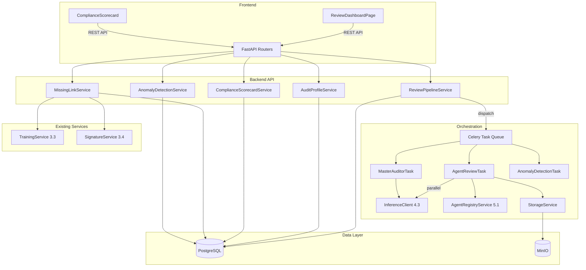

# Design Document: Multi-Agent "Always-On" Auditing

## Overview

This design implements a multi-agent review orchestration system that builds on the Agent Registry (5.1) and existing DocumentReviewer infrastructure. The architecture introduces:

1. **Review Pipeline Orchestrator** — Dispatches documents to N auditor agents in parallel via Celery tasks
2. **Master Auditor Agent** — Supervisory agent that synthesizes individual reports into a unified summary
3. **Audit Profiles** — Company-scoped configurations determining agent assignments, frameworks, and quorum
4. **Compliance Scorecards** — Real-time aggregate compliance metrics per company
5. **Missing Link Detection** — Proactive gap analysis for training and signature requirements
6. **Anomaly Detection** — Periodic audit trail scanning for suspicious patterns
7. **Review Dashboard** — React frontend with side-by-side reports, heatmaps, and action tracking

The system reuses the existing `ReviewReport`, `ReviewFinding`, and `FindingSeverity` models from `document_reviewer.py`, extending them with database persistence and multi-agent orchestration.

## Architecture



### Key Design Decisions

1. **Celery for parallel dispatch**: Individual agent reviews run as independent Celery tasks, enabling true parallelism across worker processes. A Celery chord pattern triggers the Master Auditor after all agent tasks complete (or quorum is met).

2. **Quorum-based completion**: The pipeline doesn't require all agents to succeed. If the configured quorum is met, the Master Auditor proceeds with available reports. This provides resilience against individual agent failures.

3. **Structured JSON prompting**: Agent review prompts instruct the LLM to produce JSON-structured responses matching the ReviewReport schema. A parsing layer validates and extracts the structured data, falling back to "Failed" status on parse errors.

4. **Compliance score formula**: `score = max(0, 100 - Σ(severity_weight × count))` with weights Critical=25, Major=10, Minor=3, Informational=0.5. This provides a simple, deterministic, auditable scoring mechanism.

5. **Reuse of existing models**: The `ReviewReport`, `ReviewFinding`, `FindingSeverity`, and `ReviewStatus` from `document_reviewer.py` are reused directly. The new `AgentReview` model stores the full report as JSONB.

6. **Anomaly detection as periodic task**: Rather than real-time stream processing, anomalies are detected via a Celery beat task running every 15 minutes. This is simpler, sufficient for compliance monitoring, and doesn't add latency to normal operations.

7. **Soft-delete and audit trail**: All models use AuditMixin where appropriate. Review sessions and action items are never physically deleted.

## Components and Interfaces

### 1. Review Pipeline Service (`alcoabase/services/review_pipeline.py`)

Orchestrates the full review lifecycle from submission to Master Auditor summarization.

```python
class ReviewPipelineService:
    """Orchestrates multi-agent document review pipelines."""

    def __init__(
        self,
        session_factory: async_sessionmaker[AsyncSession],
        agent_registry: AgentRegistryService,
        storage_service: StorageService,
        inference_client: InferenceClient,
    ) -> None: ...

    # Pipeline operations
    async def submit_review(
        self, document_id: int, document_version_id: int,
        audit_profile_id: int | None, company_id: int, user_id: int,
    ) -> ReviewSession: ...

    async def get_session(self, session_id: int, company_id: int) -> ReviewSession | None: ...
    async def list_sessions(
        self, company_id: int, status: str | None = None,
        document_type: str | None = None, date_from: datetime | None = None,
        date_to: datetime | None = None, min_score: float | None = None,
        max_score: float | None = None, limit: int = 20, offset: int = 0,
    ) -> tuple[list[ReviewSession], int]: ...

    async def approve_session(self, session_id: int, company_id: int) -> ReviewSession: ...
    async def reject_session(self, session_id: int, company_id: int) -> ReviewSession: ...

    # Action items
    async def create_action_item(
        self, session_id: int, finding_id: str, title: str,
        description: str, severity: str, assigned_to: int | None, company_id: int,
    ) -> ActionItem: ...
    async def update_action_item(
        self, session_id: int, item_id: int, status: str,
        resolution_note: str | None, company_id: int,
    ) -> ActionItem: ...
    async def list_action_items(self, session_id: int, company_id: int) -> list[ActionItem]: ...
```

### 2. Audit Profile Service (`alcoabase/services/audit_profile_service.py`)

CRUD operations for company-specific audit profiles.

```python
class AuditProfileService:
    """Manages company-specific audit profiles."""

    def __init__(self, session_factory: async_sessionmaker[AsyncSession]) -> None: ...

    async def create_profile(self, data: dict, company_id: int) -> AuditProfile: ...
    async def get_profile(self, profile_id: int, company_id: int) -> AuditProfile | None: ...
    async def get_default_profile(self, company_id: int) -> AuditProfile | None: ...
    async def list_profiles(self, company_id: int) -> list[AuditProfile]: ...
    async def update_profile(self, profile_id: int, data: dict, company_id: int) -> AuditProfile: ...
    async def delete_profile(self, profile_id: int, company_id: int) -> None: ...
    async def validate_agent_assignments(
        self, agent_ids: list[int], company_id: int,
    ) -> list[str]: ...  # returns validation errors
```

### 3. Compliance Scorecard Service (`alcoabase/services/compliance_scorecard.py`)

Computes and caches company-level compliance metrics.

```python
class ComplianceScorecardService:
    """Computes real-time compliance scorecards per company."""

    def __init__(self, session_factory: async_sessionmaker[AsyncSession]) -> None: ...

    async def get_scorecard(self, company_id: int) -> ComplianceScorecard: ...
    async def get_score_by_document_type(self, company_id: int) -> dict[str, float]: ...
    async def get_trend(self, company_id: int, days: int = 30) -> str: ...  # improving/stable/declining
```

### 4. Missing Link Service (`alcoabase/services/missing_link_service.py`)

Detects documents with compliance gaps.

```python
class MissingLinkService:
    """Detects approved documents missing training or signatures."""

    def __init__(self, session_factory: async_sessionmaker[AsyncSession]) -> None: ...

    async def detect_missing_links(self, company_id: int) -> list[MissingLink]: ...
    async def check_training_completeness(self, document_id: int) -> bool: ...
    async def check_signature_completeness(self, document_id: int) -> bool: ...
```

### 5. Anomaly Detection Service (`alcoabase/services/anomaly_detection.py`)

Periodic audit trail scanning for suspicious patterns.

```python
class AnomalyDetectionService:
    """Monitors audit trail for suspicious patterns."""

    def __init__(self, session_factory: async_sessionmaker[AsyncSession]) -> None: ...

    async def scan_for_anomalies(self, company_id: int, hours: int = 24) -> list[AnomalyAlert]: ...
    async def list_alerts(
        self, company_id: int, anomaly_type: str | None = None,
        severity: str | None = None, is_resolved: bool | None = None,
    ) -> list[AnomalyAlert]: ...
    async def resolve_alert(
        self, anomaly_id: int, resolution_note: str, company_id: int,
    ) -> AnomalyAlert: ...

    # Detection methods
    async def _detect_backdated_signatures(self, company_id: int, since: datetime) -> list[AnomalyAlert]: ...
    async def _detect_workflow_bypasses(self, company_id: int, since: datetime) -> list[AnomalyAlert]: ...
    async def _detect_bulk_approvals(self, company_id: int, since: datetime) -> list[AnomalyAlert]: ...
    async def _detect_off_hours_mutations(self, company_id: int, since: datetime) -> list[AnomalyAlert]: ...
    async def _detect_rapid_version_churn(self, company_id: int, since: datetime) -> list[AnomalyAlert]: ...
```

### 6. Celery Tasks (`alcoabase/tasks/review_tasks.py`)

Async task definitions for the review pipeline.

```python
@celery_app.task(bind=True, max_retries=0, time_limit=1800)
def execute_agent_review(
    self, session_id: int, agent_review_id: int,
    document_content: str, agent_id: int, company_id: int,
) -> dict: ...

@celery_app.task(bind=True, max_retries=1)
def execute_master_summary(
    self, session_id: int, agent_reports: list[dict], company_id: int,
) -> dict: ...

@celery_app.task
def check_review_completion(session_id: int) -> None: ...

@celery_app.task
def scan_anomalies_periodic() -> None: ...
```

### 7. FastAPI Routers

#### Reviews Router (`alcoabase/api/reviews.py`)

| Method | Path | Description |
|--------|------|-------------|
| POST | `/api/reviews` | Submit document for review |
| GET | `/api/reviews` | List review sessions (paginated, filterable) |
| GET | `/api/reviews/{session_id}` | Get session detail with reports |
| POST | `/api/reviews/{session_id}/approve` | Approve review |
| POST | `/api/reviews/{session_id}/reject` | Reject review |
| GET | `/api/reviews/{session_id}/action-items` | List action items |
| POST | `/api/reviews/{session_id}/action-items` | Create action item |
| PATCH | `/api/reviews/{session_id}/action-items/{item_id}` | Update action item |

#### Audit Profiles Router (`alcoabase/api/audit_profiles.py`)

| Method | Path | Description |
|--------|------|-------------|
| POST | `/api/audit-profiles` | Create audit profile |
| GET | `/api/audit-profiles` | List audit profiles |
| GET | `/api/audit-profiles/{profile_id}` | Get audit profile |
| PUT | `/api/audit-profiles/{profile_id}` | Update audit profile |
| DELETE | `/api/audit-profiles/{profile_id}` | Soft-delete audit profile |
| GET | `/api/audit-profiles/frameworks` | List supported frameworks |

#### Compliance Router (`alcoabase/api/compliance.py`)

| Method | Path | Description |
|--------|------|-------------|
| GET | `/api/compliance/scorecard` | Get company scorecard |
| GET | `/api/compliance/missing-links` | Detect missing links |
| GET | `/api/compliance/anomalies` | List anomaly alerts |
| PATCH | `/api/compliance/anomalies/{anomaly_id}/resolve` | Resolve anomaly |

### 8. Pydantic Schemas (`alcoabase/schemas/review.py`)

```python
class ReviewSubmitRequest(BaseModel):
    document_id: int
    document_version_id: int
    audit_profile_id: int | None = None

class ReviewSessionResponse(BaseModel):
    id: int
    document_id: int
    document_title: str
    document_type: str
    status: str
    compliance_score: float | None
    summary_failed: bool
    submitted_by: int
    submitted_at: datetime
    completed_at: datetime | None
    agent_reviews: list[AgentReviewResponse] | None = None
    master_summary: MasterSummaryResponse | None = None

class AgentReviewResponse(BaseModel):
    id: int
    agent_definition_id: int
    agent_name: str
    agent_archetype: str | None
    status: str
    report_data: dict | None
    error_reason: str | None
    inference_duration_ms: int | None
    started_at: datetime | None
    completed_at: datetime | None

class MasterSummaryResponse(BaseModel):
    id: int
    compliance_score: float
    risk_assessment: str
    executive_summary: str
    consensus_findings: list[dict]
    contradictions: list[dict]
    prioritized_action_items: list[dict]

class ActionItemResponse(BaseModel):
    id: int
    finding_id: str
    title: str
    description: str
    severity: str
    status: str
    assigned_to: int | None
    resolved_at: datetime | None
    resolution_note: str | None
    created_at: datetime
    updated_at: datetime | None

class AuditProfileRequest(BaseModel):
    name: str = Field(min_length=1, max_length=200)
    description: str | None = Field(default=None, max_length=2000)
    regulatory_frameworks: list[str] = Field(min_length=1)
    assigned_agent_ids: list[int] = Field(min_length=1)
    quorum: int = Field(ge=1)
    severity_thresholds: dict[str, float] | None = None
    is_default: bool = False

class AuditProfileResponse(BaseModel):
    id: int
    company_id: int
    name: str
    description: str | None
    regulatory_frameworks: list[str]
    assigned_agent_ids: list[int]
    quorum: int
    severity_thresholds: dict[str, float]
    is_default: bool
    is_active: bool
    created_at: datetime
    updated_at: datetime | None

class ComplianceScorecardResponse(BaseModel):
    overall_score: float
    risk_band: str
    trend: str
    total_documents_reviewed: int
    documents_with_critical_findings: int
    documents_with_open_action_items: int
    score_by_document_type: dict[str, float]
    last_updated: datetime

class MissingLinkResponse(BaseModel):
    document_id: int
    document_uuid: str
    document_title: str
    document_type: str
    current_status: str
    missing_items: list[str]  # ["training", "signature"]
    affected_user_count: int
    days_since_approval: int
    severity: str  # Critical or Major

class AnomalyAlertResponse(BaseModel):
    id: int
    anomaly_type: str
    severity: str
    description: str
    affected_document_id: int | None
    affected_user_id: int | None
    detected_at: datetime
    is_resolved: bool
    resolved_at: datetime | None
    resolution_note: str | None
    created_at: datetime

class AnomalyResolveRequest(BaseModel):
    resolution_note: str = Field(min_length=1, max_length=2000)
```

## Data Models

### Review Session Lifecycle

```
Pending → InProgress → Completed → Approved
                    ↘              ↘ Rejected
                     Failed
```

### Compliance Score Computation

```
score = max(0.0, 100.0 - Σ(weight[severity] × count[severity]))

Weights:
  Critical      = 25.0
  Major         = 10.0
  Minor         =  3.0
  Informational =  0.5

Example:
  2 Critical + 3 Major + 5 Minor = 100 - (2×25 + 3×10 + 5×3) = 100 - 95 = 5.0
```

### Master Auditor Prompt Structure

```
You are the Master Auditor for {company_name} operating under {regulatory_frameworks}.
Your task is to synthesize {N} individual review reports into a unified executive summary.

## Individual Agent Reports:
{serialized_reports}

## Document Metadata:
- Title: {title}
- Type: {document_type}
- Version: {version}
- Tags: {tags}

## Instructions:
1. Identify CONSENSUS findings (same chapter + same/similar severity in 2+ reports)
2. Identify CONTRADICTIONS (one agent flags Critical/Major, another finds nothing)
3. Produce PRIORITIZED action items (Critical first, then Major, then by frequency)
4. Compute compliance score using formula: 100 - Σ(severity_weight × count)
5. Assign risk assessment: Critical (0-24), At Risk (25-49), Needs Attention (50-74), Good (75-89), Excellent (90-100)

Respond in JSON format:
{schema}
```

### Anomaly Detection Rules

| Anomaly Type | Detection Logic | Severity |
|-------------|----------------|----------|
| backdated_signature | signature.timestamp < audit_log.timestamp - 5min | Critical |
| workflow_bypass | document.status changed without workflow_transition record | Critical |
| bulk_approval | user approved >10 docs in 1 hour | Major |
| off_hours_mutation | mutation outside 06:00–22:00 local time | Minor |
| rapid_version_churn | >5 versions of same doc in 1 hour | Minor |

### Supported Regulatory Frameworks

```python
SUPPORTED_FRAMEWORKS = [
    "ISO 13485",   # Medical devices QMS
    "GMP",         # Good Manufacturing Practice
    "GDP",         # Good Distribution Practice
    "GLP",         # Good Laboratory Practice
    "GCP",         # Good Clinical Practice
    "ISO 9001",    # General QMS
    "ISO 14001",   # Environmental management
    "21 CFR Part 11",  # FDA electronic records
    "EU GMP Annex 11", # EU computerized systems
    "IVDR",        # In Vitro Diagnostic Regulation
]
```

## Correctness Properties

### Property 1: Compliance score is deterministic and bounded

*For any* set of findings with severities in {Critical, Major, Minor, Informational} and counts ≥ 0, the compliance score SHALL equal max(0.0, 100.0 - Σ(weight[severity] × count[severity])) and SHALL always be in the range [0.0, 100.0].

**Validates: Requirements 3.4, 6.1**

### Property 2: Quorum enforcement

*For any* review session with N assigned agents and quorum Q, if fewer than Q agents complete successfully, the session SHALL be marked as "Failed"; if Q or more agents complete successfully, the Master Auditor SHALL be triggered regardless of how many agents failed.

**Validates: Requirements 1.4, 1.5, 1.6**

### Property 3: Consensus detection correctness

*For any* set of N agent reports, a finding is "consensus" if and only if 2 or more reports contain findings with the same severity level referencing the same chapter/section identifier. The count of consensus findings SHALL be ≤ the total unique (chapter, severity) pairs across all reports.

**Validates: Requirements 3.5, 3.6**

### Property 4: Missing link classification

*For any* document in "Approved" or "Active" status, if both training and signature are missing then severity SHALL be "Critical"; if exactly one is missing then severity SHALL be "Major"; if neither is missing then the document SHALL not appear in the missing links list.

**Validates: Requirements 7.4**

### Property 5: Anomaly deduplication

*For any* sequence of anomaly detection scans, the system SHALL not create duplicate alerts for the same (anomaly_type, affected_document_id, affected_user_id) combination within the same detection window (24 hours).

**Validates: Requirements 8.7**

### Property 6: Audit profile quorum constraint

*For any* audit profile, the quorum value SHALL be ≤ the number of assigned_agent_ids. Any attempt to set quorum > len(assigned_agent_ids) SHALL be rejected with a validation error.

**Validates: Requirements 4.5**

### Property 7: Company-scoped isolation

*For any* two companies A and B, review sessions, audit profiles, compliance scorecards, missing links, and anomaly alerts for company A SHALL never be visible to company B, and vice versa.

**Validates: Requirements 1.10, 4.6, 6.5, 7.6, 8.6**

### Property 8: Review session state machine validity

*For any* review session, the status transitions SHALL follow: Pending → InProgress → {Completed, Failed}, Completed → {Approved, Rejected}. No other transitions SHALL be permitted.

**Validates: Requirements 1.3, 10.4**

### Property 9: Action item status transitions

*For any* action item, valid status transitions SHALL be: Open → {InProgress, Resolved, Dismissed}, InProgress → {Resolved, Dismissed, Open}. Resolved and Dismissed are terminal states.

**Validates: Requirements 5.4**

### Property 10: Default audit profile uniqueness

*For any* company, there SHALL be at most one audit profile with is_default=true at any time. Setting a new default SHALL unset the previous default atomically.

**Validates: Requirements 4.2**

## Error Handling

| Scenario | HTTP Status | Response |
|----------|-------------|----------|
| Document not found | 404 | `{"detail": "Document not found"}` |
| Active review already exists | 409 | `{"detail": "Document already has an active review session"}` |
| Audit profile not found | 404 | `{"detail": "Audit profile not found"}` |
| No default audit profile | 422 | `{"detail": "No default audit profile configured for this company"}` |
| Invalid agent assignments | 422 | `{"detail": "Validation failed", "errors": [...]}` |
| Quorum exceeds agent count | 422 | `{"detail": "Quorum (N) exceeds assigned agent count (M)"}` |
| Session not found / wrong company | 404 | `{"detail": "Review session not found"}` |
| Cannot approve non-completed session | 409 | `{"detail": "Only completed sessions can be approved"}` |
| Missing X-Change-Reason | 400 | `{"detail": "X-Change-Reason header is required..."}` |
| Anomaly not found | 404 | `{"detail": "Anomaly alert not found"}` |
| Agent review timeout | N/A | Agent review marked as Failed, reason: "timeout" |
| Inference connection error | N/A | Agent review marked as Failed, reason: "connection_error" |
| Invalid LLM response | N/A | Agent review marked as Failed, reason: "invalid_response" |
| Master summary inference failure | N/A | Session completed with summary_failed=true |

## Testing Strategy

### Property-Based Tests (pytest + hypothesis)

Property-based testing is well-suited for this feature because:
- Compliance score computation has clear mathematical properties
- Quorum logic has well-defined boundary conditions
- Consensus/contradiction detection operates on combinatorial inputs
- State machine transitions have formal validity rules

**Properties to implement:**
1. Compliance score determinism and bounds (Property 1)
2. Quorum enforcement (Property 2)
3. Consensus detection (Property 3)
4. Missing link classification (Property 4)
5. Anomaly deduplication (Property 5)
6. Quorum constraint validation (Property 6)
7. Company-scoped isolation (Property 7)
8. State machine validity (Property 8)
9. Action item transitions (Property 9)
10. Default profile uniqueness (Property 10)

### Unit Tests (pytest)

- Review pipeline submission and dispatch
- Individual agent review execution (mock inference)
- Master Auditor summarization (mock inference)
- Audit profile CRUD with validation
- Compliance score computation edge cases
- Missing link detection logic
- Anomaly detection rules (each type individually)
- API endpoint responses (all status codes)

### Integration Tests

- Full pipeline flow: submit → agent reviews → master summary → completion
- Quorum handling with partial agent failures
- Concurrent review submissions for same document (conflict detection)
- Audit profile default switching
- Scorecard computation with real review data
- Anomaly detection against seeded audit trail data

### Frontend Tests

- ReviewDashboardPage rendering with mock data
- Session detail view with agent reports
- Action item status transitions
- Compliance scorecard display
- Severity heatmap rendering
- Polling behavior for in-progress sessions

