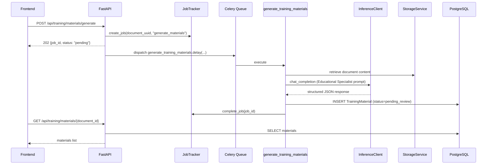
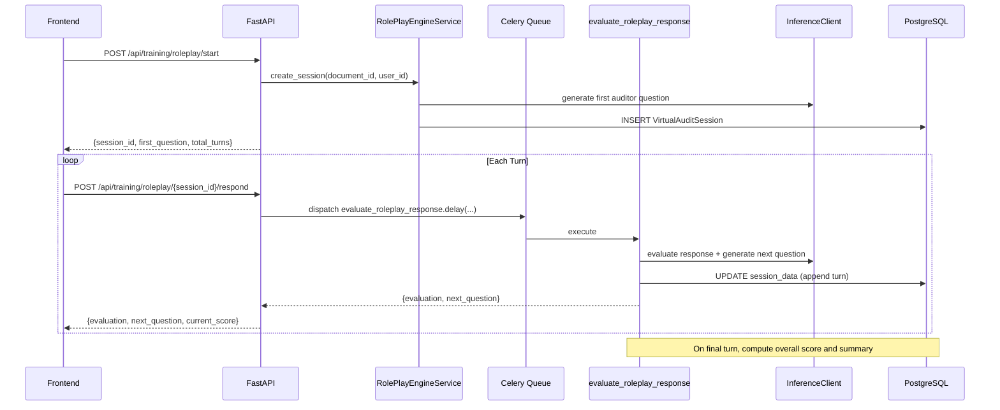
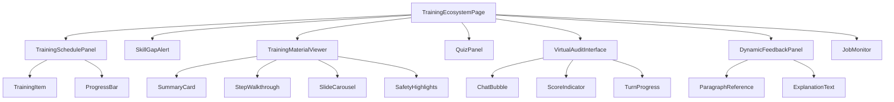
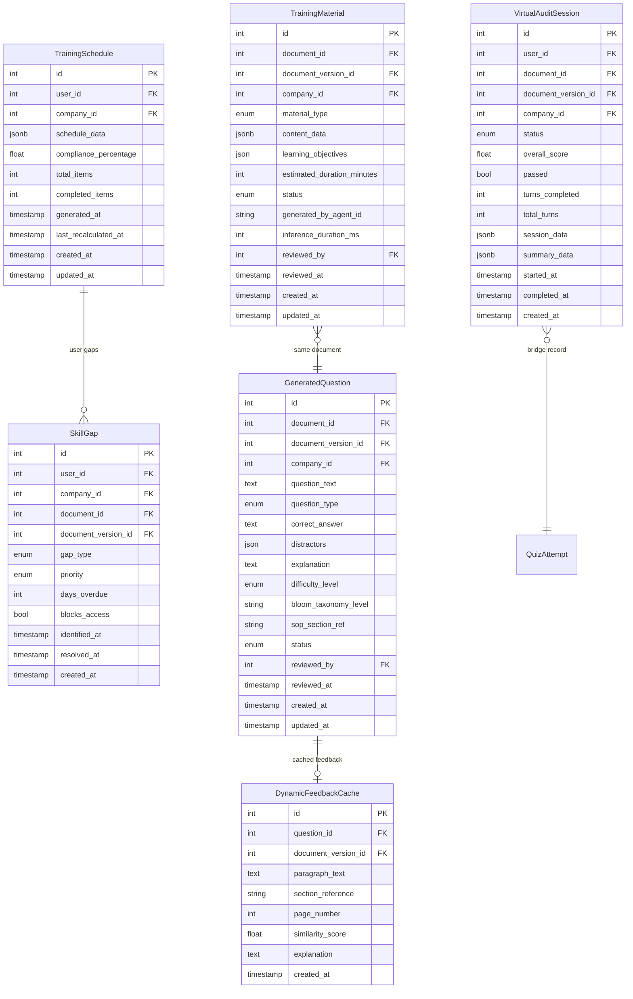

# Design Document: AI-Enhanced Training Ecosystem

## Overview

This design implements an AI-Enhanced Training Ecosystem that transforms the existing static training management system (Phase 3.3) into an intelligent, adaptive learning platform. The ecosystem introduces five interconnected AI-powered capabilities:

1. **AI Training Planner** — Generates personalized training schedules and identifies skill gaps by analyzing user roles, document assignments, and compliance deadlines via the Educational Specialist agent archetype.
2. **AI Training Material Generator** — Produces structured educational content (summaries, walkthroughs, presentations, safety highlights) from SOPs and Work Instructions using LLM inference.
3. **Automated Question Generator** — Creates comprehension assessments (multiple-choice, true/false, scenario-based, fill-in-blank) with validated answers and section references.
4. **Role-Play Virtual Audit Engine** — Conducts interactive conversational assessments where employees demonstrate document comprehension in a progressive-difficulty dialogue.
5. **Dynamic Feedback Service** — Retrieves exact source paragraphs via RAG when users answer incorrectly, providing targeted learning guidance.

All AI operations execute asynchronously via Celery tasks routed to a dedicated `ai_operations` queue. Generated content follows a coordinator review gate (pending_review → approved/rejected) before presentation to trainees. The system integrates with the existing training-gated access control (3.5) so that passed AI-generated assessments satisfy the comprehension verification requirement.

### Key Design Decisions

1. **Celery for all AI operations**: Every LLM inference call runs as an async Celery task, keeping API responses fast (HTTP 202) and isolating GPU-bound work from the web server process.

2. **Dedicated `ai_operations` queue**: Training AI tasks are routed separately from indexing and anomaly detection tasks, preventing GPU contention from blocking other background work.

3. **Reuse of existing InferenceClient**: All LLM calls go through the established `InferenceClient` (4.3) with its retry logic, timeout handling, and connection pooling. No new HTTP client is introduced.

4. **Educational Specialist archetype as prompt source**: The agent YAML definition provides system prompts, temperature settings, and evaluation rubrics. The services read this configuration at runtime via the AgentRegistryService.

5. **Semantic grading via embeddings**: Fill-in-blank and scenario-based answers use the embedding model (similarity threshold 0.85) and LLM evaluation (score threshold 0.70) respectively, with fallback to exact matching when inference is unavailable.

6. **RAG-powered dynamic feedback**: The existing KnowledgeService hybrid search provides paragraph-level retrieval for feedback, avoiding a separate vector store.

7. **Coordinator review gate**: All generated content (materials, questions) starts as `pending_review` and requires explicit approval before use in assessments. This maintains human oversight over AI-generated training content.

8. **Virtual Audit as QuizAttempt bridge**: Passed role-play sessions create synthetic QuizAttempt records, maintaining backward compatibility with the existing training gate check without modifying the gate logic.

9. **Job tracker integration**: All async tasks report progress via the existing `JobTracker` service, providing consistent status polling for the frontend.

10. **Single active schedule per user**: The TrainingSchedule model enforces a unique constraint on (user_id, company_id), simplifying schedule management and avoiding stale schedule proliferation.

## Architecture

```mermaid
graph TB
    subgraph Frontend
        TEP[TrainingEcosystemPage]
        TSP[TrainingSchedulePanel]
        TMV[TrainingMaterialViewer]
        VAI[VirtualAuditInterface]
        DFP[DynamicFeedbackPanel]
        TEP --> TSP
        TEP --> TMV
        TEP --> VAI
        TEP --> DFP
        TEP --> |REST API| API
    end

    subgraph "Backend API Layer"
        API[FastAPI Routers]
        API --> TPS[TrainingPlannerService]
        API --> TMGS[TrainingMaterialGeneratorService]
        API --> QGS[QuestionGeneratorService]
        API --> RPES[RolePlayEngineService]
        API --> DFS[DynamicFeedbackService]
        API --> QS[QuizService - extended]
    end

    subgraph "Celery Task Queue"
        CQ[ai_operations queue]
        CQ --> GST[generate_training_schedule]
        CQ --> GMT[generate_training_materials]
        CQ --> GQT[generate_questions]
        CQ --> ERT[evaluate_roleplay_response]
        CQ --> RSG[recalculate_skill_gaps]
    end

    subgraph "AI Infrastructure"
        GST --> IC[InferenceClient 4.3]
        GMT --> IC
        GQT --> IC
        ERT --> IC
        DFS --> IC
        DFS --> KS[KnowledgeService 4.2]
        IC --> vLLM[vLLM Server]
        IC --> EMB[Embedding Model]
    end

    subgraph "Data Layer"
        TPS --> DB[(PostgreSQL)]
        TMGS --> DB
        QGS --> DB
        RPES --> DB
        DFS --> DB
        TMGS --> MINIO[(MinIO Storage)]
        GST --> DB
        GMT --> DB
        GQT --> DB
        ERT --> DB
    end

    subgraph "Existing Services"
        ARS[AgentRegistryService 5.1]
        TS[TrainingService 3.3]
        SS[StorageService]
        JT[JobTracker]
        GST --> ARS
        GMT --> ARS
        GQT --> ARS
        ERT --> ARS
        GST --> JT
        GMT --> JT
        GQT --> JT
        ERT --> JT
        GMT --> SS
    end
```



### Request Flow: Material Generation



### Request Flow: Virtual Audit Session



## Components and Interfaces

### 1. Training Planner Service (`alcoabase/services/training_planner.py`)

Generates personalized training schedules and performs skill gap analysis.

```python
class TrainingPlannerService:
    """AI-powered training schedule generation and skill gap analysis."""

    def __init__(
        self,
        session_factory: async_sessionmaker[AsyncSession],
        inference_client: InferenceClient,
        agent_registry: AgentRegistryService,
    ) -> None: ...

    # Schedule generation
    async def request_schedule_generation(
        self, user_id: int, company_id: int,
    ) -> str:  # returns job_id
        """Dispatch async schedule generation task."""
        ...

    async def get_schedule(
        self, user_id: int, company_id: int,
    ) -> TrainingSchedule | None:
        """Retrieve current training schedule for a user."""
        ...

    # Skill gap analysis
    async def get_company_gaps(
        self, company_id: int, limit: int = 20, offset: int = 0,
    ) -> CompanyGapReport:
        """Aggregated skill gap report for the company."""
        ...

    async def get_user_gaps(
        self, user_id: int, company_id: int,
    ) -> list[SkillGap]:
        """Individual skill gap detail for a user."""
        ...

    async def recalculate_gaps(self, company_id: int) -> int:
        """Recalculate all skill gaps for a company. Returns count updated."""
        ...

    # Priority computation
    def compute_priority(
        self, deadline: datetime | None, blocks_access: bool,
    ) -> PriorityLevel:
        """Determine priority based on deadline proximity and access gating."""
        ...
```

### 2. Training Material Generator Service (`alcoabase/services/training_material_generator.py`)

Produces structured educational content from source documents.

```python
class TrainingMaterialGeneratorService:
    """AI-powered training material generation from documents."""

    def __init__(
        self,
        session_factory: async_sessionmaker[AsyncSession],
        inference_client: InferenceClient,
        agent_registry: AgentRegistryService,
        storage_service: StorageService,
    ) -> None: ...

    async def request_generation(
        self, document_id: int, document_version_id: int,
        company_id: int, material_types: list[str] | None = None,
    ) -> str:  # returns job_id
        """Dispatch async material generation task."""
        ...

    async def get_materials(
        self, document_id: int, company_id: int,
        material_type: str | None = None, status: str | None = None,
        limit: int = 20, offset: int = 0,
    ) -> tuple[list[TrainingMaterial], int]:
        """Retrieve generated materials with filtering and pagination."""
        ...

    async def approve_material(
        self, material_id: int, reviewer_id: int, company_id: int,
    ) -> TrainingMaterial: ...

    async def reject_material(
        self, material_id: int, reviewer_id: int, company_id: int,
    ) -> TrainingMaterial: ...

    async def generate_material_content(
        self, document_content: str, material_type: str,
        previous_content: str | None = None,
    ) -> dict:
        """Core LLM generation logic for a single material type."""
        ...
```

### 3. Question Generator Service (`alcoabase/services/question_generator.py`)

Creates comprehension assessments with validated answers.

```python
class QuestionGeneratorService:
    """AI-powered question generation and semantic grading."""

    def __init__(
        self,
        session_factory: async_sessionmaker[AsyncSession],
        inference_client: InferenceClient,
        agent_registry: AgentRegistryService,
    ) -> None: ...

    # Generation
    async def request_generation(
        self, document_id: int, document_version_id: int,
        company_id: int, question_count: int = 10,
        difficulty_distribution: dict[str, float] | None = None,
    ) -> str:  # returns job_id
        """Dispatch async question generation task."""
        ...

    async def get_questions(
        self, document_id: int, company_id: int,
        status: str | None = None, difficulty_level: str | None = None,
        question_type: str | None = None,
        limit: int = 20, offset: int = 0,
    ) -> tuple[list[GeneratedQuestion], int]:
        """Retrieve generated questions with filtering."""
        ...

    async def approve_question(
        self, question_id: int, reviewer_id: int, company_id: int,
    ) -> GeneratedQuestion: ...

    async def reject_question(
        self, question_id: int, reviewer_id: int, company_id: int,
    ) -> GeneratedQuestion: ...

    # Grading
    async def grade_answer(
        self, question: GeneratedQuestion, user_answer: str,
    ) -> GradeResult:
        """Grade a single answer using appropriate method."""
        ...

    async def grade_fill_in_blank(
        self, correct_answer: str, user_answer: str,
    ) -> tuple[bool, float]:
        """Semantic similarity grading for fill-in-blank. Returns (passed, score)."""
        ...

    async def grade_scenario_based(
        self, question_text: str, correct_answer: str,
        source_paragraph: str, user_answer: str,
    ) -> tuple[bool, float, str]:
        """LLM evaluation for scenario-based. Returns (passed, score, explanation)."""
        ...
```

### 4. Role-Play Engine Service (`alcoabase/services/roleplay_engine.py`)

Manages interactive Virtual Audit sessions.

```python
class RolePlayEngineService:
    """Virtual Audit conversational assessment engine."""

    def __init__(
        self,
        session_factory: async_sessionmaker[AsyncSession],
        inference_client: InferenceClient,
        agent_registry: AgentRegistryService,
        storage_service: StorageService,
    ) -> None: ...

    async def start_session(
        self, document_id: int, document_version_id: int,
        user_id: int, company_id: int,
    ) -> tuple[VirtualAuditSession, str]:
        """Create session and generate first question. Returns (session, first_question)."""
        ...

    async def submit_response(
        self, session_id: int, response_text: str, company_id: int,
    ) -> TurnResult:
        """Evaluate response and advance session. Returns evaluation + next question."""
        ...

    async def get_session(
        self, session_id: int, company_id: int,
    ) -> VirtualAuditSession | None: ...

    async def get_user_history(
        self, user_id: int, company_id: int,
        document_id: int | None = None, status: str | None = None,
        passed: bool | None = None, limit: int = 20, offset: int = 0,
    ) -> tuple[list[VirtualAuditSession], int]: ...

    async def abandon_stale_sessions(self) -> int:
        """Mark sessions inactive for 60+ minutes as abandoned. Returns count."""
        ...

    def compute_total_turns(self, section_count: int) -> int:
        """Determine turn count based on document sections."""
        ...

    def compute_session_score(self, turns: list[dict]) -> float:
        """Weighted average: accuracy 50%, completeness 30%, reference 20%."""
        ...
```

### 5. Dynamic Feedback Service (`alcoabase/services/dynamic_feedback.py`)

Provides paragraph-level guidance on incorrect answers.

```python
class DynamicFeedbackService:
    """RAG-powered paragraph-level feedback for incorrect quiz answers."""

    def __init__(
        self,
        session_factory: async_sessionmaker[AsyncSession],
        inference_client: InferenceClient,
        knowledge_service: KnowledgeService,
    ) -> None: ...

    async def get_feedback(
        self, question_id: int, user_id: int, company_id: int,
    ) -> FeedbackResponse:
        """Retrieve or generate feedback for a failed question."""
        ...

    async def generate_feedback(
        self, question: GeneratedQuestion,
    ) -> FeedbackResponse:
        """Generate feedback via RAG retrieval + LLM explanation."""
        ...

    async def invalidate_cache(
        self, document_version_id: int,
    ) -> int:
        """Invalidate cached feedback for a document version. Returns count deleted."""
        ...

    async def has_failed_attempt(
        self, question_id: int, user_id: int, company_id: int,
    ) -> bool:
        """Check if user has at least one failed attempt for this question."""
        ...
```

### 6. Extended Quiz Service (`alcoabase/services/quiz_service.py` — modified)

The existing QuizService is extended to support AI-generated questions and semantic grading.

```python
# Additions to existing QuizService:

async def evaluate_and_persist_enhanced(
    self, session: AsyncSession, content_id: str,
    user_id: int, answers: dict[str, str], company_id: int,
) -> QuizAttempt:
    """Enhanced evaluation supporting semantic grading for AI-generated questions.
    
    Routes each answer to the appropriate grading method:
    - multiple_choice / true_false → exact match (existing behavior)
    - fill_in_blank → semantic similarity (threshold 0.85)
    - scenario_based → LLM evaluation (threshold 0.70)
    Falls back to exact match if inference unavailable.
    """
    ...

async def register_approved_questions(
    self, document_id: int, document_version_id: int,
    document_uuid: str, sop_version: str, company_id: int,
) -> str:
    """Register approved AI-generated questions as the active question set.
    Returns the content_id ({document_uuid}_v{sop_version}).
    """
    ...

async def has_user_passed_enhanced(
    self, session: AsyncSession, user_id: int, content_id: str,
) -> bool:
    """Check if user passed via quiz OR virtual audit."""
    ...
```

### 7. FastAPI Routers

#### Training Planner Router (`alcoabase/api/training_planner.py`)

| Method | Path | Description |
|--------|------|-------------|
| POST | `/api/training/planner/generate` | Request schedule generation (async) |
| GET | `/api/training/planner/schedule/{user_id}` | Get user's training schedule |
| GET | `/api/training/planner/gaps` | Company-wide skill gap report |
| GET | `/api/training/planner/gaps/{user_id}` | Individual user skill gaps |

#### Training Materials Router (`alcoabase/api/training_materials.py`)

| Method | Path | Description |
|--------|------|-------------|
| POST | `/api/training/materials/generate` | Request material generation (async) |
| GET | `/api/training/materials/{document_id}` | List materials for document |
| PATCH | `/api/training/materials/{material_id}/approve` | Approve material |
| PATCH | `/api/training/materials/{material_id}/reject` | Reject material |

#### Training Questions Router (`alcoabase/api/training_questions.py`)

| Method | Path | Description |
|--------|------|-------------|
| POST | `/api/training/questions/generate` | Request question generation (async) |
| GET | `/api/training/questions/{document_id}` | List questions for document |
| PATCH | `/api/training/questions/{question_id}/approve` | Approve question |
| PATCH | `/api/training/questions/{question_id}/reject` | Reject question |

#### Role-Play Router (`alcoabase/api/training_roleplay.py`)

| Method | Path | Description |
|--------|------|-------------|
| POST | `/api/training/roleplay/start` | Start virtual audit session |
| POST | `/api/training/roleplay/{session_id}/respond` | Submit response to current turn |
| GET | `/api/training/roleplay/{session_id}` | Get session detail |
| GET | `/api/training/roleplay/history/{user_id}` | User's session history |

#### Dynamic Feedback Router (`alcoabase/api/training_feedback.py`)

| Method | Path | Description |
|--------|------|-------------|
| GET | `/api/training/feedback/{question_id}` | Get paragraph-level feedback |

### 8. Celery Tasks (`alcoabase/tasks/training_tasks.py` — extended)

All tasks route to the `ai_operations` queue with soft_time_limit=600.

```python
@celery_app.task(bind=True, soft_time_limit=600, max_retries=3,
                 default_retry_delay=30, queue="ai_operations")
def generate_training_schedule(
    self, user_id: int, company_id: int, job_id: str,
) -> dict:
    """Generate personalized training schedule via Educational Specialist."""
    ...

@celery_app.task(bind=True, soft_time_limit=600, max_retries=3,
                 default_retry_delay=30, queue="ai_operations")
def generate_training_materials(
    self, document_id: int, document_version_id: int,
    company_id: int, material_types: list[str], job_id: str,
) -> dict:
    """Generate training materials for each requested type."""
    ...

@celery_app.task(bind=True, soft_time_limit=600, max_retries=3,
                 default_retry_delay=30, queue="ai_operations")
def generate_questions(
    self, document_id: int, document_version_id: int,
    company_id: int, question_count: int,
    difficulty_distribution: dict[str, float], job_id: str,
) -> dict:
    """Generate comprehension questions with validated answers."""
    ...

@celery_app.task(bind=True, soft_time_limit=600, max_retries=3,
                 default_retry_delay=30, queue="ai_operations")
def evaluate_roleplay_response(
    self, session_id: int, response_text: str, job_id: str,
) -> dict:
    """Evaluate user response and generate next auditor question."""
    ...

@celery_app.task(bind=True, soft_time_limit=600, max_retries=3,
                 default_retry_delay=30, queue="ai_operations")
def recalculate_skill_gaps(self, company_id: int) -> dict:
    """Recalculate all skill gaps for a company."""
    ...
```

#### Celery Beat Schedule Addition

```python
# Added to celery_app.conf.beat_schedule:
"recalculate-skill-gaps-every-6-hours": {
    "task": "alcoabase.tasks.training_tasks.recalculate_skill_gaps",
    "schedule": crontab(minute=0, hour="*/6"),
    "options": {"queue": "ai_operations"},
    "kwargs": {"company_id": None},  # runs for all companies
},
"abandon-stale-roleplay-sessions": {
    "task": "alcoabase.tasks.training_tasks.abandon_stale_sessions",
    "schedule": crontab(minute="*/15"),
    "options": {"queue": "ai_operations"},
},
```

#### Retry Strategy

All training tasks use exponential backoff with jitter:

```python
self.retry(
    exc=exc,
    countdown=30 * (2 ** self.request.retries) + random.uniform(0, 5),
    max_retries=3,
)
```

Retryable exceptions: `ConnectionError`, `OSError`, `InferenceTimeoutError`, `InferenceConnectionError`.
Non-retryable: `InferenceError` (4xx), `ValueError`, `SoftTimeLimitExceeded`.

### 9. Pydantic Schemas (`alcoabase/schemas/training_ecosystem.py`)

```python
# --- Request Schemas ---

class ScheduleGenerateRequest(BaseModel):
    user_id: int

class MaterialGenerateRequest(BaseModel):
    document_id: int
    document_version_id: int
    material_types: list[str] | None = None  # defaults to all 5 types

class QuestionGenerateRequest(BaseModel):
    document_id: int
    document_version_id: int
    question_count: int = Field(default=10, ge=5, le=20)
    difficulty_distribution: dict[str, float] | None = None

class RolePlayStartRequest(BaseModel):
    document_id: int
    document_version_id: int
    user_id: int

class RolePlayRespondRequest(BaseModel):
    response_text: str = Field(max_length=2000)

# --- Response Schemas ---

class JobAcceptedResponse(BaseModel):
    job_id: str
    status: str = "pending"

class TrainingScheduleResponse(BaseModel):
    id: int
    user_id: int
    schedule_data: dict  # ordered training items
    compliance_percentage: float
    total_items: int
    completed_items: int
    generated_at: datetime
    last_recalculated_at: datetime

class SkillGapResponse(BaseModel):
    id: int
    document_id: int
    document_title: str
    gap_type: str
    priority: str
    days_overdue: int | None
    blocks_access: bool
    identified_at: datetime

class CompanyGapReportResponse(BaseModel):
    total_users_with_gaps: int
    company_compliance_percentage: float
    top_documents: list[dict]
    top_users: list[dict]
    by_framework: dict[str, float] | None = None
    total: int

class TrainingMaterialResponse(BaseModel):
    id: int
    document_id: int
    document_version_id: int
    material_type: str
    content_data: dict
    learning_objectives: list[str]
    estimated_duration_minutes: int
    status: str
    generated_by_agent_id: str | None
    inference_duration_ms: int | None
    reviewed_by: int | None
    reviewed_at: datetime | None
    created_at: datetime

class GeneratedQuestionResponse(BaseModel):
    id: int
    question_text: str
    question_type: str
    correct_answer: str | None = None  # hidden from trainees
    distractors: list[str] | None = None
    explanation: str | None = None  # hidden until answered
    difficulty_level: str
    bloom_taxonomy_level: str
    sop_section_ref: str
    status: str
    created_at: datetime

class VirtualAuditSessionResponse(BaseModel):
    id: int
    user_id: int
    document_id: int
    status: str
    overall_score: float | None
    passed: bool | None
    turns_completed: int
    total_turns: int
    session_data: dict | None = None
    summary_data: dict | None = None
    started_at: datetime
    completed_at: datetime | None

class TurnEvaluationResponse(BaseModel):
    evaluation: dict  # {factual_accuracy, completeness, document_reference_quality}
    next_question: str | None
    session_complete: bool
    current_score: float

class DynamicFeedbackResponse(BaseModel):
    correct_answer: str
    paragraph_text: str
    section_reference: str
    page_number: int | None
    explanation: str
```

### 10. Frontend Components (`src/frontend/src/pages/TrainingEcosystemPage.tsx`)



#### Zustand Store (`src/frontend/src/stores/trainingEcosystemStore.ts`)

```typescript
interface TrainingEcosystemState {
  // Schedule
  schedule: TrainingSchedule | null;
  skillGaps: SkillGap[];
  
  // Materials
  materials: Record<number, TrainingMaterial[]>;  // keyed by document_id
  
  // Questions
  questions: Record<number, GeneratedQuestion[]>;
  
  // Role-play
  activeSession: VirtualAuditSession | null;
  sessionHistory: VirtualAuditSession[];
  
  // Jobs
  pendingJobs: Job[];
  
  // Actions
  fetchSchedule: (userId: number) => Promise<void>;
  fetchGaps: () => Promise<void>;
  generateMaterials: (documentId: number, versionId: number) => Promise<void>;
  generateQuestions: (documentId: number, versionId: number) => Promise<void>;
  startRolePlay: (documentId: number, versionId: number) => Promise<void>;
  submitResponse: (sessionId: number, text: string) => Promise<void>;
  pollJobs: () => Promise<void>;
}
```

## Data Models

### Entity Relationship Diagram



### Model Definitions

#### TrainingSchedule (`alcoabase/models/training_ecosystem.py`)

```python
class TrainingSchedule(Base, AuditMixin):
    __tablename__ = "training_schedules"
    __table_args__ = (
        UniqueConstraint("user_id", "company_id", name="uq_training_schedule_user_company"),
        CheckConstraint("completed_items <= total_items", name="ck_schedule_completed_lte_total"),
        Index("ix_training_schedule_user_company", "user_id", "company_id"),
    )

    id: Mapped[int] = mapped_column(primary_key=True)
    user_id: Mapped[int] = mapped_column(ForeignKey("users.id"))
    company_id: Mapped[int] = mapped_column(ForeignKey("companies.id"))
    schedule_data: Mapped[dict] = mapped_column(JSONB)
    compliance_percentage: Mapped[float] = mapped_column(default=0.0)
    total_items: Mapped[int] = mapped_column(default=0)
    completed_items: Mapped[int] = mapped_column(default=0)
    generated_at: Mapped[datetime] = mapped_column(DateTime(timezone=True))
    last_recalculated_at: Mapped[datetime] = mapped_column(DateTime(timezone=True))
    created_at: Mapped[datetime] = mapped_column(DateTime(timezone=True), server_default=func.now())
    updated_at: Mapped[datetime | None] = mapped_column(DateTime(timezone=True), onupdate=func.now())
```

#### SkillGap

```python
class GapType(str, Enum):
    MISSING_TRAINING = "missing_training"
    EXPIRED_TRAINING = "expired_training"
    NEW_VERSION_AVAILABLE = "new_version_available"

class PriorityLevel(str, Enum):
    CRITICAL = "Critical"
    HIGH = "High"
    MEDIUM = "Medium"
    LOW = "Low"

class SkillGap(Base):
    __tablename__ = "skill_gaps"
    __table_args__ = (
        UniqueConstraint(
            "user_id", "document_id", "document_version_id", "gap_type",
            name="uq_skill_gap_user_doc_version_type",
        ),
        Index("ix_skill_gap_user_company", "user_id", "company_id"),
        Index("ix_skill_gap_document", "document_id", "document_version_id"),
    )

    id: Mapped[int] = mapped_column(primary_key=True)
    user_id: Mapped[int] = mapped_column(ForeignKey("users.id"))
    company_id: Mapped[int] = mapped_column(ForeignKey("companies.id"))
    document_id: Mapped[int] = mapped_column(ForeignKey("documents.id"))
    document_version_id: Mapped[int] = mapped_column(ForeignKey("document_versions.id"))
    gap_type: Mapped[GapType] = mapped_column()
    priority: Mapped[PriorityLevel] = mapped_column()
    days_overdue: Mapped[int | None] = mapped_column(nullable=True, default=0)
    blocks_access: Mapped[bool] = mapped_column(default=False)
    identified_at: Mapped[datetime] = mapped_column(DateTime(timezone=True), server_default=func.now())
    resolved_at: Mapped[datetime | None] = mapped_column(DateTime(timezone=True), nullable=True)
    created_at: Mapped[datetime] = mapped_column(DateTime(timezone=True), server_default=func.now())
```

#### TrainingMaterial

```python
class MaterialType(str, Enum):
    EXECUTIVE_SUMMARY = "executive_summary"
    DETAILED_WALKTHROUGH = "detailed_walkthrough"
    KEY_TAKEAWAYS = "key_takeaways"
    PRESENTATION_OUTLINE = "presentation_outline"
    SAFETY_HIGHLIGHTS = "safety_highlights"

class TrainingMaterial(Base, AuditMixin):
    __tablename__ = "training_materials"
    __table_args__ = (
        UniqueConstraint(
            "document_id", "document_version_id", "material_type",
            name="uq_training_material_doc_version_type",
        ),
        Index("ix_training_material_doc_version", "document_id", "document_version_id"),
        Index("ix_training_material_status", "status"),
    )

    id: Mapped[int] = mapped_column(primary_key=True)
    document_id: Mapped[int] = mapped_column(ForeignKey("documents.id"))
    document_version_id: Mapped[int] = mapped_column(ForeignKey("document_versions.id"))
    company_id: Mapped[int] = mapped_column(ForeignKey("companies.id"))
    material_type: Mapped[MaterialType] = mapped_column()
    content_data: Mapped[dict] = mapped_column(JSONB)
    learning_objectives: Mapped[list] = mapped_column(JSON)
    estimated_duration_minutes: Mapped[int] = mapped_column()
    status: Mapped[str] = mapped_column(String(20), default=ContentStatus.PENDING_REVIEW.value)
    generated_by_agent_id: Mapped[str | None] = mapped_column(String(255), nullable=True)
    inference_duration_ms: Mapped[int | None] = mapped_column(nullable=True)
    reviewed_by: Mapped[int | None] = mapped_column(ForeignKey("users.id"), nullable=True)
    reviewed_at: Mapped[datetime | None] = mapped_column(DateTime(timezone=True), nullable=True)
    created_at: Mapped[datetime] = mapped_column(DateTime(timezone=True), server_default=func.now())
    updated_at: Mapped[datetime | None] = mapped_column(DateTime(timezone=True), onupdate=func.now())
```

#### GeneratedQuestion

```python
class QuestionType(str, Enum):
    MULTIPLE_CHOICE = "multiple_choice"
    TRUE_FALSE = "true_false"
    SCENARIO_BASED = "scenario_based"
    FILL_IN_BLANK = "fill_in_blank"

class DifficultyLevel(str, Enum):
    BASIC = "basic"
    INTERMEDIATE = "intermediate"
    ADVANCED = "advanced"

class GeneratedQuestion(Base, AuditMixin):
    __tablename__ = "generated_questions"
    __table_args__ = (
        Index("ix_generated_question_doc_version", "document_id", "document_version_id"),
        Index("ix_generated_question_status", "status"),
    )

    id: Mapped[int] = mapped_column(primary_key=True)
    document_id: Mapped[int] = mapped_column(ForeignKey("documents.id"))
    document_version_id: Mapped[int] = mapped_column(ForeignKey("document_versions.id"))
    company_id: Mapped[int] = mapped_column(ForeignKey("companies.id"))
    question_text: Mapped[str] = mapped_column(Text)
    question_type: Mapped[QuestionType] = mapped_column()
    correct_answer: Mapped[str] = mapped_column(Text)
    distractors: Mapped[list | None] = mapped_column(JSON, nullable=True)
    explanation: Mapped[str] = mapped_column(Text)
    difficulty_level: Mapped[DifficultyLevel] = mapped_column()
    bloom_taxonomy_level: Mapped[str] = mapped_column(String(50))
    sop_section_ref: Mapped[str] = mapped_column(String(500))
    status: Mapped[str] = mapped_column(String(20), default=ContentStatus.PENDING_REVIEW.value)
    reviewed_by: Mapped[int | None] = mapped_column(ForeignKey("users.id"), nullable=True)
    reviewed_at: Mapped[datetime | None] = mapped_column(DateTime(timezone=True), nullable=True)
    created_at: Mapped[datetime] = mapped_column(DateTime(timezone=True), server_default=func.now())
    updated_at: Mapped[datetime | None] = mapped_column(DateTime(timezone=True), onupdate=func.now())
```

#### VirtualAuditSession

```python
class SessionStatus(str, Enum):
    IN_PROGRESS = "in_progress"
    COMPLETED = "completed"
    ABANDONED = "abandoned"

class VirtualAuditSession(Base, AuditMixin):
    __tablename__ = "virtual_audit_sessions"
    __table_args__ = (
        CheckConstraint("turns_completed <= total_turns", name="ck_session_turns_lte_total"),
        Index("ix_virtual_audit_user_company", "user_id", "company_id"),
        Index("ix_virtual_audit_user_doc", "user_id", "document_id"),
        Index("ix_virtual_audit_status", "status"),
    )

    id: Mapped[int] = mapped_column(primary_key=True)
    user_id: Mapped[int] = mapped_column(ForeignKey("users.id"))
    document_id: Mapped[int] = mapped_column(ForeignKey("documents.id"))
    document_version_id: Mapped[int] = mapped_column(ForeignKey("document_versions.id"))
    company_id: Mapped[int] = mapped_column(ForeignKey("companies.id"))
    status: Mapped[SessionStatus] = mapped_column(default=SessionStatus.IN_PROGRESS)
    overall_score: Mapped[float | None] = mapped_column(nullable=True)
    passed: Mapped[bool | None] = mapped_column(nullable=True)
    turns_completed: Mapped[int] = mapped_column(default=0)
    total_turns: Mapped[int] = mapped_column()
    session_data: Mapped[dict] = mapped_column(JSONB, default=dict)
    summary_data: Mapped[dict | None] = mapped_column(JSONB, nullable=True)
    started_at: Mapped[datetime] = mapped_column(DateTime(timezone=True), server_default=func.now())
    completed_at: Mapped[datetime | None] = mapped_column(DateTime(timezone=True), nullable=True)
    created_at: Mapped[datetime] = mapped_column(DateTime(timezone=True), server_default=func.now())
```

#### DynamicFeedbackCache

```python
class DynamicFeedbackCache(Base):
    __tablename__ = "dynamic_feedback_cache"
    __table_args__ = (
        UniqueConstraint(
            "question_id", "document_version_id",
            name="uq_feedback_cache_question_version",
        ),
        Index("ix_feedback_cache_question", "question_id"),
        Index("ix_feedback_cache_doc_version", "document_version_id"),
    )

    id: Mapped[int] = mapped_column(primary_key=True)
    question_id: Mapped[int] = mapped_column(ForeignKey("generated_questions.id"))
    document_version_id: Mapped[int] = mapped_column(ForeignKey("document_versions.id"))
    paragraph_text: Mapped[str] = mapped_column(Text)
    section_reference: Mapped[str] = mapped_column(String(500))
    page_number: Mapped[int | None] = mapped_column(nullable=True)
    similarity_score: Mapped[float] = mapped_column()
    explanation: Mapped[str] = mapped_column(Text)
    created_at: Mapped[datetime] = mapped_column(DateTime(timezone=True), server_default=func.now())
```

### Priority Computation Logic

```python
def compute_priority(deadline: datetime | None, blocks_access: bool) -> PriorityLevel:
    """Determine priority based on deadline proximity and access gating.
    
    Rules:
    - Critical: deadline within 7 days or overdue
    - High: deadline within 30 days
    - Medium: deadline within 90 days
    - Low: deadline > 90 days away or no deadline
    - If blocks_access=True, elevate by one level (Low→Medium, Medium→High, High→Critical)
    """
    if deadline is None:
        base = PriorityLevel.LOW
    else:
        days_until = (deadline - datetime.now(UTC)).days
        if days_until <= 7:
            base = PriorityLevel.CRITICAL
        elif days_until <= 30:
            base = PriorityLevel.HIGH
        elif days_until <= 90:
            base = PriorityLevel.MEDIUM
        else:
            base = PriorityLevel.LOW

    if blocks_access:
        elevation = {
            PriorityLevel.LOW: PriorityLevel.MEDIUM,
            PriorityLevel.MEDIUM: PriorityLevel.HIGH,
            PriorityLevel.HIGH: PriorityLevel.CRITICAL,
            PriorityLevel.CRITICAL: PriorityLevel.CRITICAL,
        }
        return elevation[base]
    return base
```

### Compliance Percentage Computation

```python
def compute_compliance_percentage(completed: int, total: int) -> float:
    """Compute training compliance as percentage.
    
    Formula: (completed / total) × 100, rounded to 1 decimal place.
    Returns 100.0 if total is 0 (no requirements = fully compliant).
    """
    if total == 0:
        return 100.0
    return round((completed / total) * 100, 1)
```

### Virtual Audit Score Computation

```python
def compute_session_score(turns: list[dict]) -> float:
    """Weighted average of completed turn scores.
    
    Weights: factual_accuracy=0.50, completeness=0.30, document_reference_quality=0.20
    Only completed turns are included in the average.
    """
    if not turns:
        return 0.0
    total = 0.0
    for turn in turns:
        total += (
            turn["factual_accuracy"] * 0.50
            + turn["completeness"] * 0.30
            + turn["document_reference_quality"] * 0.20
        )
    return round(total / len(turns), 4)
```

### Turn Count Determination

```python
def compute_total_turns(section_count: int) -> int:
    """Determine total turns based on document section count.
    
    - < 10 sections: 5 turns
    - 10-20 sections: 7 turns
    - > 20 sections: 10 turns
    """
    if section_count < 10:
        return 5
    elif section_count <= 20:
        return 7
    else:
        return 10
```

## Correctness Properties

*A property is a characteristic or behavior that should hold true across all valid executions of a system — essentially, a formal statement about what the system should do. Properties serve as the bridge between human-readable specifications and machine-verifiable correctness guarantees.*

### Property 1: Priority assignment is deterministic and rule-based

*For any* deadline datetime and blocks_access boolean, the computed priority SHALL equal:
- Critical if deadline ≤ 7 days away or overdue
- High if deadline ≤ 30 days away
- Medium if deadline ≤ 90 days away
- Low if deadline > 90 days or None

AND if blocks_access is True, the priority SHALL be elevated by exactly one level (Low→Medium, Medium→High, High→Critical, Critical→Critical).

**Validates: Requirements 1.3**

### Property 2: Skill gap identification is the set difference of required vs completed training

*For any* user with a set of required documents R (documents assigned to their role requiring training) and a set of completed training records C, the identified skill gaps SHALL equal R \ C (documents in R not covered by valid records in C). No document in C with a valid training record SHALL appear as a gap, and every document in R without a valid record SHALL appear as a gap.

**Validates: Requirements 1.4, 2.1**

### Property 3: Compliance percentage is bounded and correctly computed

*For any* non-negative integers completed and total where completed ≤ total, the compliance percentage SHALL equal round((completed / total) × 100, 1) and SHALL always be in the range [0.0, 100.0]. When total is 0, the result SHALL be 100.0. The passing threshold for quizzes SHALL equal ceil(total_questions × 0.8) for any total_questions ≥ 1.

**Validates: Requirements 1.7, 2.2, 5.5**

### Property 4: Company-scoped tenant isolation

*For any* two companies A and B, training schedules, skill gaps, training materials, generated questions, virtual audit sessions, and dynamic feedback for company A SHALL never be visible to or modifiable by requests scoped to company B, and vice versa.

**Validates: Requirements 1.8, 2.6, 3.10, 6.12, 7.8, 9.15**

### Property 5: All AI-generated content starts in pending_review status

*For any* generated training material or generated question, the initial status SHALL be "pending_review" regardless of the document content, material type, question type, or generation parameters. No generated content SHALL be directly accessible to trainees without explicit coordinator approval.

**Validates: Requirements 3.6, 4.7**

### Property 6: Question difficulty distribution satisfies constraints

*For any* set of N generated questions (where 5 ≤ N ≤ 20), the distribution SHALL satisfy: at least 30% basic (count ≥ ceil(N × 0.30)), at least 30% intermediate (count ≥ ceil(N × 0.30)), and at most 30% advanced (count ≤ floor(N × 0.30)). The sum of all difficulty counts SHALL equal N.

**Validates: Requirements 4.4**

### Property 7: No duplicate question (section_ref, question_type) pairs per generation batch

*For any* set of generated questions for a single document version within the same generation batch, no two questions SHALL have the same combination of (sop_section_ref, question_type).

**Validates: Requirements 4.5**

### Property 8: Grading method selection and threshold application

*For any* quiz answer submission:
- If question_type is multiple_choice or true_false, grading SHALL use exact string match (correct iff answer == correct_answer)
- If question_type is fill_in_blank, grading SHALL mark correct iff semantic_similarity(answer, correct_answer) ≥ 0.85
- If question_type is scenario_based, grading SHALL mark correct iff llm_evaluation_score ≥ 0.70
- If the answer is empty/null, grading SHALL mark incorrect with confidence_score 0.0 without invoking inference

**Validates: Requirements 5.1, 5.2, 5.3, 5.4, 5.6**

### Property 9: Virtual audit turn count is determined by document section count

*For any* document with section_count sections, the total_turns SHALL be:
- 5 if section_count < 10
- 7 if 10 ≤ section_count ≤ 20
- 10 if section_count > 20

**Validates: Requirements 6.3**

### Property 10: Virtual audit session score and pass/fail determination

*For any* completed virtual audit session with N completed turns (N ≥ 1), the overall_score SHALL equal the mean of per-turn weighted scores where each turn score = (factual_accuracy × 0.50 + completeness × 0.30 + document_reference_quality × 0.20). The session SHALL be marked "Passed" iff overall_score ≥ 0.70 AND turns_completed ≥ 3. Sessions with fewer than 3 completed turns SHALL be marked "Incomplete" regardless of score.

**Validates: Requirements 6.5, 6.6**

### Property 11: Progressive difficulty distribution across virtual audit turns

*For any* virtual audit session with T total turns, the first ceil(T × 0.40) turns SHALL be foundational questions, the next ceil(T × 0.35) turns SHALL be applied questions, and the remaining turns SHALL be analytical questions.

**Validates: Requirements 6.2**

### Property 12: Dynamic feedback requires at least one failed attempt

*For any* user and question combination, the feedback endpoint SHALL return HTTP 403 if the user has zero failed attempts for that question, and SHALL return feedback data (HTTP 200) if the user has at least one failed attempt.

**Validates: Requirements 7.7, 9.12**

### Property 13: Feedback cache invalidation on new document version

*For any* cached feedback entry keyed by (question_id, document_version_id), publishing a new document version SHALL invalidate all cache entries for the previous version. After invalidation, the next feedback request SHALL perform a fresh RAG query rather than returning stale data.

**Validates: Requirements 7.6**

### Property 14: Training gate satisfaction via quiz OR virtual audit

*For any* user and content_id, the training gate check (has_user_passed) SHALL return true if and only if at least one of the following conditions holds: (a) a QuizAttempt record exists with passed=true for that user and content_id, OR (b) a VirtualAuditSession exists with passed=true for the corresponding document version. When a virtual audit passes, a synthetic QuizAttempt record SHALL be created with content_id={document_uuid}_v{version}, maintaining backward compatibility.

**Validates: Requirements 11.2, 11.3**

### Property 15: Only approved questions are served in active assessments

*For any* quiz submission request, the system SHALL only serve questions with status="approved" for the requested content_id. Questions with status "pending_review", "rejected", or "draft" SHALL never appear in active assessments.

**Validates: Requirements 11.4, 4.10**

### Property 16: Partial records are preserved on task failure

*For any* Celery task that fails after producing partial database records (e.g., 3 of 5 TrainingMaterial rows, or 7 of 10 GeneratedQuestion rows), the successfully persisted records SHALL remain in the database. The task SHALL NOT roll back partial work, and the job_tracker SHALL record the failure with a count of successfully produced records.

**Validates: Requirements 12.9**

## Error Handling

| Scenario | HTTP Status | Response | Recovery |
|----------|-------------|----------|----------|
| Document not found | 404 | `{"detail": "Document not found"}` | — |
| User not found or not in company | 404 | `{"detail": "User not found"}` | — |
| Missing X-Company-Id header | 400 | `{"detail": "X-Company-Id header is required"}` | — |
| Missing X-Change-Reason header | 400 | `{"detail": "X-Change-Reason header is required..."}` | — |
| Non-existent company | 404 | `{"detail": "Company not found"}` | — |
| No training items for user | 422 | `{"detail": "No training items identified for user"}` | Job marked failed |
| Document content inaccessible (MinIO) | 422 | `{"detail": "Document content inaccessible"}` | Job marked failed |
| InferenceClient timeout | — | — | Job marked failed, reason: "inference_timeout" |
| InferenceClient connection error | — | — | Retry with backoff (max 3), then fail |
| InferenceClient 4xx error | — | — | Job marked failed immediately (no retry) |
| Document insufficient for min questions | 422 | `{"detail": "Document lacks sufficient content for minimum question count"}` | Job marked failed |
| Active generation job already exists | 409 | `{"detail": "Generation already in progress for this document"}` | Return existing job_id |
| Material/question not in pending_review | 409 | `{"detail": "Resource is not in pending_review status"}` | — |
| Feedback without failed attempt | 403 | `{"detail": "Feedback only available after a failed attempt"}` | — |
| Role-play session already completed/abandoned | 409 | `{"detail": "Session is no longer active"}` | — |
| Role-play response exceeds 2000 chars | 422 | `{"detail": "Response exceeds maximum length of 2000 characters"}` | — |
| Existing in-progress session for same doc | 200 | Return existing session (idempotent) | — |
| No approved questions for document | 422 | `{"detail": "No approved assessment available for this document version"}` | — |
| Celery task timeout (600s) | — | — | Job marked failed, reason: "timeout" |
| Partial task failure | — | — | Partial records preserved, job marked failed with count |
| Embedding model unavailable during grading | — | — | Fallback to exact string matching |
| RAG retrieval below 0.75 threshold | 200 | Return sop_section_ref with generic message | — |
| LLM unavailable for feedback explanation | 200 | Return paragraph without explanation | Generic message substituted |

## Testing Strategy

### Property-Based Tests (pytest + Hypothesis)

Property-based testing is well-suited for this feature because:
- Priority computation, compliance percentage, and session scoring are pure functions with clear mathematical properties
- Grading threshold logic has well-defined boundary conditions
- Difficulty distribution constraints operate on combinatorial inputs
- Tenant isolation and access control rules are universal invariants

**Library**: Hypothesis (Python, backend)
**Minimum iterations**: 100 per property test
**Tag format**: `# Feature: Step_5-3_ai-enhanced-training-ecosystem, Property {N}: {title}`

**Properties to implement:**
1. Priority assignment determinism and correctness (Property 1)
2. Skill gap set difference (Property 2)
3. Compliance percentage bounds and formula (Property 3)
4. Tenant isolation (Property 4)
5. Generated content starts pending_review (Property 5)
6. Difficulty distribution constraints (Property 6)
7. No duplicate (section_ref, type) pairs (Property 7)
8. Grading method selection and thresholds (Property 8)
9. Turn count from section count (Property 9)
10. Session score and pass/fail (Property 10)
11. Progressive difficulty distribution (Property 11)
12. Feedback requires failed attempt (Property 12)
13. Cache invalidation on new version (Property 13)
14. Training gate OR logic (Property 14)
15. Only approved questions served (Property 15)
16. Partial records preserved on failure (Property 16)

### Unit Tests (pytest)

- TrainingPlannerService: schedule generation logic, priority computation edge cases
- TrainingMaterialGeneratorService: material structure validation, chunking logic
- QuestionGeneratorService: question validation, distribution enforcement
- RolePlayEngineService: turn management, score computation, session lifecycle
- DynamicFeedbackService: cache hit/miss, fallback behavior
- QuizService extensions: enhanced grading, bridge record creation
- API endpoints: all status codes, request validation, response schemas
- Celery tasks: retry logic, timeout handling, job tracker calls

### Integration Tests

- Full material generation pipeline: request → Celery task → DB persistence → retrieval
- Full question generation pipeline: request → generation → approval → quiz availability
- Virtual audit full session: start → N responses → completion → bridge record
- Dynamic feedback with real RAG: question → retrieval → explanation
- Training gate integration: approve questions → submit quiz → verify gate passes
- Skill gap recalculation: create training record → verify gap resolved
- Concurrent generation requests: verify conflict detection

### Frontend Tests (Vitest + React Testing Library)

- TrainingEcosystemPage: renders schedule, materials, assessments
- TrainingSchedulePanel: priority sorting, progress bar, empty state
- VirtualAuditInterface: chat bubbles, score indicators, turn progress
- DynamicFeedbackPanel: paragraph highlighting, section links
- TrainingMaterialViewer: renders each material type correctly
- JobMonitor: polling behavior, status transitions
- Zustand store: state management, API integration
