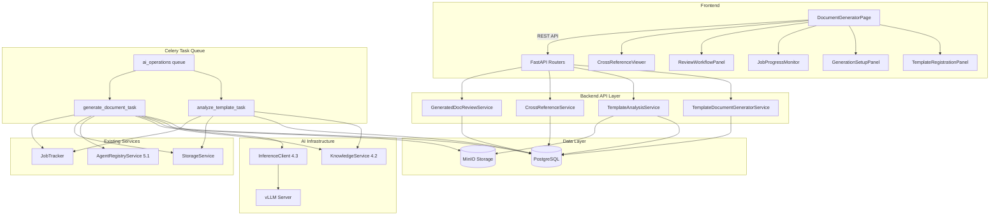
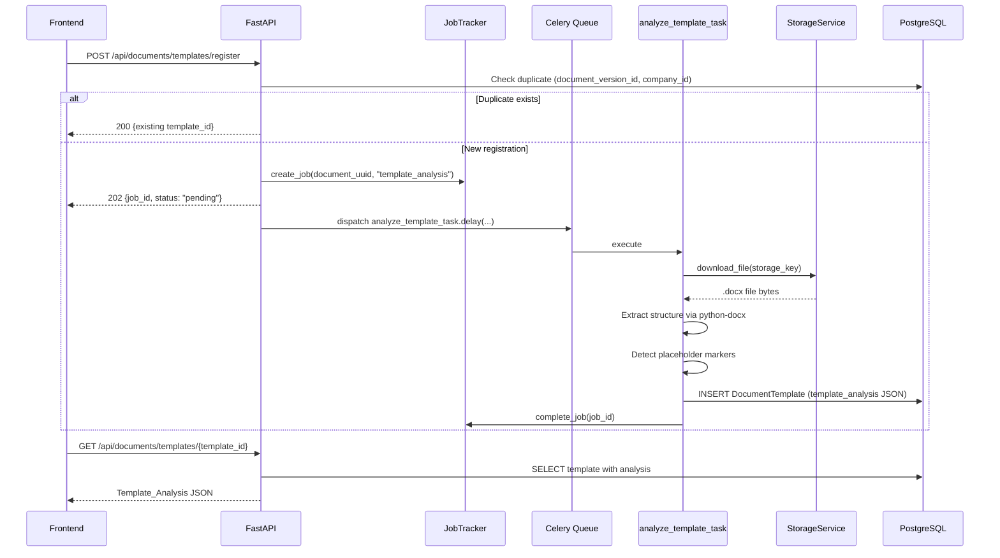
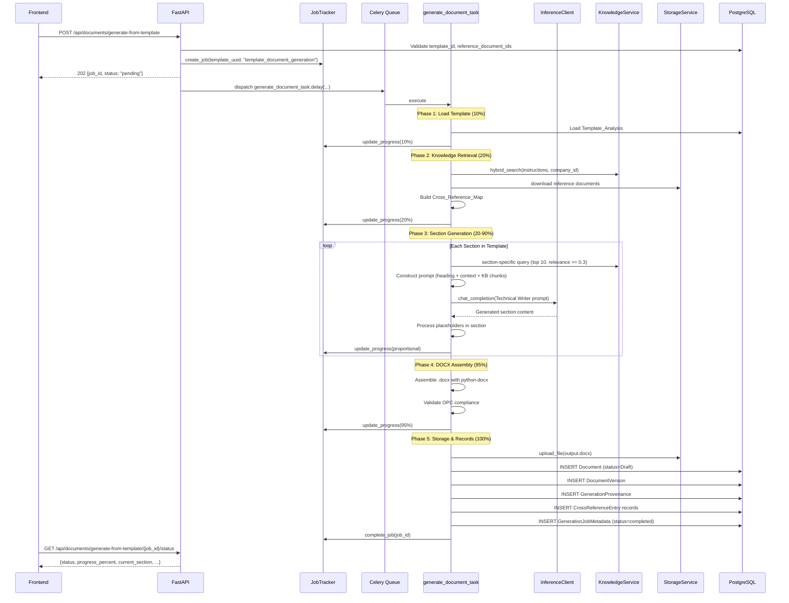

# Design Document: AI Document Generator (Template-Based)

## Overview

This design implements a Template-Based AI Document Generator (Phase 5.4) that uses existing .docx files stored in the system as "Master Templates" to guide the structural layout of newly generated regulatory documents. The system synthesizes content from the company's RAG knowledge base (4.2) into the structural layout of a selected DOCX template, using the Technical Writer agent archetype (5.1) via the vLLM inference layer (4.3).

Unlike the JSON-driven Form Builder (Phase 2.4) which produces fillable forms for structured data entry, this engine focuses on high-volume text generation within standard word-processing formats (DOCX), producing complete regulatory documents such as URS, MVP, SOPs, and similar GxP documentation.

### Key Design Decisions

1. **Replace existing placeholder DocumentGenerator**: The current `DocumentGenerator` service with its DSPy stub is replaced by a new `TemplateDocumentGeneratorService` that implements the full template-aware pipeline. The existing `/api/documents/generate` endpoint remains for backward compatibility; the new endpoint is `/api/documents/generate-from-template`.

2. **python-docx for template analysis and DOCX assembly**: Both template structure extraction and output document assembly use python-docx, ensuring consistent handling of styles, formatting, and document properties without external dependencies.

3. **Section-by-section generation with sliding context**: Each template section is generated independently with a context window containing: the section heading, its position in the hierarchy, condensed preceding sections, and relevant knowledge base excerpts. This prevents context overflow while maintaining document coherence.

4. **Cross-Reference Map for inter-document consistency**: A structured map of identifiers (requirement IDs, test case IDs, section references) is extracted from reference documents and injected into the Technical Writer's system prompt, ensuring generated text uses exact identifiers rather than fabricating references.

5. **All-or-nothing generation with section-level fallback**: If the entire pipeline fails (provenance can't be persisted, template can't be loaded), the job fails completely. However, individual section inference failures trigger a single retry followed by placeholder insertion, allowing the document to complete with clearly marked gaps.

6. **Immutable provenance records**: GenerationProvenance and CrossReferenceEntry models are append-only (no AuditMixin, no UPDATE/DELETE) to satisfy GxP audit trail requirements. A generation job that cannot persist its provenance record fails entirely.

7. **Coordinator review gate**: All generated documents start as "Draft" with ContentStatus "pending_review". They are excluded from standard search results until explicitly approved, maintaining human oversight over AI-generated content.

8. **Celery async on ai_operations queue**: All generation tasks run as Celery tasks on the dedicated `ai_operations` queue with a 600-second hard timeout, consistent with the Phase 5.3 pattern.

9. **Placeholder marker system**: Template authors can embed `{{IDENTIFIER}}` or `{{IDENTIFIER:parameter}}` tokens to control generation behavior at specific locations, enabling precision beyond section headings alone.

10. **50 MB output limit with section-boundary truncation**: Output documents are capped at 50 MB, truncating at the last complete section boundary to prevent malformed output.

## Architecture



### Request Flow: Template Registration and Analysis



### Request Flow: Template-Based Document Generation



## Components and Interfaces

### 1. Template Analysis Service (`alcoabase/services/template_analysis.py`)

Handles template registration, structural analysis, and placeholder detection.

```python
@dataclass
class TemplateSection:
    """A section extracted from the template hierarchy."""
    heading: str
    level: int  # 1-4
    position: int  # 0-indexed order in document
    has_placeholder: bool
    placeholder_markers: list[str]
    has_table: bool
    table_columns: list[str] | None = None


@dataclass
class TemplateAnalysis:
    """Complete structural analysis of a template document."""
    section_hierarchy: list[TemplateSection]
    numbering_scheme: str  # e.g., "1.1.1", "I.A.1"
    paragraph_styles: list[str]
    table_structures: list[dict[str, Any]]  # [{columns: [...], row_count: int}]
    header_footer_patterns: dict[str, str]  # {header: "...", footer: "..."}
    placeholder_markers: list[dict[str, str]]  # [{marker, position, type, parameter}]
    total_sections: int
    has_toc: bool
    page_layout: dict[str, Any]  # {margins, orientation, page_size}


class TemplateAnalysisService:
    """Service for template registration and structural analysis."""

    def __init__(
        self,
        session_factory: async_sessionmaker[AsyncSession],
        storage_service: StorageService,
        job_tracker: JobTracker,
    ) -> None: ...

    async def register_template(
        self,
        document_id: int,
        document_version_id: int,
        template_name: str,
        document_type_target: str,
        registered_by: int,
        company_id: int,
    ) -> tuple[int, str | None]:
        """Register a template. Returns (template_id, job_id).
        job_id is None if template already exists (returns existing).
        """
        ...

    async def get_template(
        self, template_id: int, company_id: int,
    ) -> DocumentTemplate | None:
        """Retrieve a registered template with its analysis."""
        ...

    async def list_templates(
        self, company_id: int,
        document_type_target: str | None = None,
        limit: int = 20, offset: int = 0,
    ) -> tuple[list[DocumentTemplate], int]:
        """List templates with optional filtering and pagination."""
        ...

    def analyze_template(self, docx_bytes: bytes) -> TemplateAnalysis:
        """Extract structural layout from a .docx file using python-docx.

        Detects: section hierarchy, numbering, styles, tables,
        headers/footers, placeholder markers, TOC, page layout.
        """
        ...

    def detect_placeholders(self, text: str) -> list[dict[str, str]]:
        """Scan text for {{IDENTIFIER}} or {{IDENTIFIER:parameter}} patterns.

        Returns list of {marker, identifier, parameter, position}.
        Pattern: {{[A-Z_]{1,50}(:[^}]{1,100})?}}
        """
        ...

    def validate_docx_extension(self, storage_key: str) -> bool:
        """Check if storage_key indicates a .docx file."""
        ...
```

### 2. Template Document Generator Service (`alcoabase/services/template_document_generator.py`)

Orchestrates the full generation pipeline: knowledge retrieval, section-by-section LLM generation, placeholder processing, and DOCX assembly.

```python
@dataclass
class SectionGenerationContext:
    """Context provided to the LLM for generating a single section."""
    section_heading: str
    section_level: int
    section_position: int
    total_sections: int
    preceding_sections_summary: str  # condensed to max 1000 tokens
    knowledge_base_chunks: list[dict[str, Any]]  # ordered by relevance desc
    reference_doc_excerpts: list[dict[str, str]]  # prioritized before KB chunks
    placeholder_instructions: list[str]
    cross_reference_map: dict[str, list[dict[str, str]]]
    generation_instructions: str
    document_type_target: str


@dataclass
class SectionResult:
    """Result of generating a single section."""
    heading: str
    content: str  # generated prose/tables/lists
    token_count: int
    inference_duration_ms: int
    kb_chunks_used: list[dict[str, Any]]  # chunk_document_uuid, chunk_text[:200], relevance_score
    placeholder_processed: list[str]
    generation_failed: bool = False
    failure_reason: str | None = None


class TemplateDocumentGeneratorService:
    """AI-powered template-based document generation service."""

    def __init__(
        self,
        session_factory: async_sessionmaker[AsyncSession],
        inference_client: InferenceClient,
        knowledge_service: KnowledgeService,
        agent_registry: AgentRegistryService,
        storage_service: StorageService,
        job_tracker: JobTracker,
        template_analysis_service: TemplateAnalysisService,
    ) -> None: ...

    async def request_generation(
        self,
        template_id: int,
        title: str,
        generation_instructions: str,
        output_folder_path: str,
        requesting_user_id: int,
        company_id: int,
        reference_document_ids: list[int] | None = None,
    ) -> str:
        """Validate inputs and dispatch async generation task. Returns job_id."""
        ...

    async def get_job_status(
        self, job_id: str, company_id: int,
    ) -> GenerationJobMetadata | None:
        """Retrieve generation job status and progress."""
        ...

    # --- Core generation pipeline (called within Celery task) ---

    async def execute_generation_pipeline(
        self,
        job_id: str,
        template_id: int,
        title: str,
        generation_instructions: str,
        output_folder_path: str,
        requesting_user_id: int,
        company_id: int,
        reference_document_ids: list[int] | None = None,
    ) -> dict[str, Any]:
        """Full generation pipeline. Returns result metadata dict."""
        ...

    async def retrieve_knowledge_context(
        self,
        generation_instructions: str,
        document_type_target: str,
        reference_document_ids: list[int] | None,
        company_id: int,
    ) -> tuple[list[dict[str, Any]], list[dict[str, str]]]:
        """Retrieve KB chunks and reference doc excerpts.
        Returns (kb_chunks, reference_excerpts).
        """
        ...

    async def generate_section(
        self, context: SectionGenerationContext,
    ) -> SectionResult:
        """Generate content for a single section via InferenceClient.
        Retries once on failure, inserts placeholder on second failure.
        """
        ...

    def build_section_prompt(
        self, context: SectionGenerationContext,
    ) -> list[dict[str, str]]:
        """Construct the messages array for the Technical Writer agent.
        Includes system prompt with cross-reference map, section context,
        and generation instructions.
        """
        ...

    def manage_context_window(
        self,
        preceding_sections: list[SectionResult],
        kb_chunks: list[dict[str, Any]],
        max_tokens: int = 6000,
    ) -> tuple[str, list[dict[str, Any]]]:
        """Summarize preceding sections and trim KB chunks if context exceeds limit.
        Returns (summarized_preceding, trimmed_chunks).
        """
        ...

    async def assemble_docx(
        self,
        template_bytes: bytes,
        sections: list[SectionResult],
        template_analysis: TemplateAnalysis,
        title: str,
        company_name: str,
        requesting_user_name: str,
    ) -> bytes:
        """Assemble output .docx preserving template formatting.
        Handles: styles, numbering, tables, headers/footers, TOC,
        images, section breaks, page breaks, document properties.
        """
        ...

    def validate_output_docx(self, docx_bytes: bytes) -> bool:
        """Validate output conforms to Open Packaging Conventions (valid ZIP)."""
        ...
```

### 3. Cross-Reference Service (`alcoabase/services/cross_reference.py`)

Extracts, stores, and validates cross-document references.

```python
@dataclass
class CrossReference:
    """A single cross-reference extracted from a document."""
    reference_type: str  # "requirement", "section", "test_case"
    reference_identifier: str  # e.g., "REQ-00123", "TC-00045", "1.2.3"
    reference_text: str  # first 150 chars of referenced content
    source_document_id: int
    source_document_title: str


class CrossReferenceService:
    """Service for cross-reference extraction, storage, and validation."""

    def __init__(
        self,
        session_factory: async_sessionmaker[AsyncSession],
        knowledge_service: KnowledgeService,
        storage_service: StorageService,
    ) -> None: ...

    async def build_cross_reference_map(
        self,
        reference_document_ids: list[int],
        company_id: int,
    ) -> dict[str, list[CrossReference]]:
        """Extract identifiable items from reference documents.

        Patterns detected:
        - REQ-\\d{1,5} or URS-\\d{1,3}\\.\\d{1,3} → requirement
        - TC-\\d{1,5} or TEST-\\d{1,5} → test_case
        - Heading-level numbering (1, 1.1, 1.1.1, 1.1.1.1) → section
        - Document titles with document_uuids

        Max 500 entries per reference document.
        Returns dict keyed by reference_type.
        """
        ...

    def extract_references_from_text(
        self, text: str, document_id: int, document_title: str,
    ) -> list[CrossReference]:
        """Parse text for reference patterns. Pure function."""
        ...

    async def validate_references_in_output(
        self,
        generated_text: str,
        cross_reference_map: dict[str, list[CrossReference]],
    ) -> list[dict[str, Any]]:
        """Check generated text for references not in the map.
        Returns list of unverified references with location info.
        """
        ...

    async def get_cross_references(
        self, document_id: int, company_id: int,
    ) -> list[CrossReferenceEntry]:
        """Retrieve stored cross-references for a generated document."""
        ...

    async def auto_select_reference_documents(
        self,
        document_type: str,
        company_id: int,
        limit: int = 5,
    ) -> list[int]:
        """Auto-select top N documents of specified type from KB."""
        ...
```

### 4. Placeholder Processor (`alcoabase/services/placeholder_processor.py`)

Processes template placeholder markers and generates appropriate content.

```python
class PlaceholderProcessor:
    """Processes {{IDENTIFIER}} and {{IDENTIFIER:parameter}} markers."""

    STANDARD_MARKERS: ClassVar[set[str]] = {
        "SECTION_CONTENT",
        "REQUIREMENT_LIST",
        "CROSS_REF",
        "TABLE",
        "PROCEDURE_STEPS",
        "RISK_ASSESSMENT",
    }
    MAX_PLACEHOLDERS_PER_TEMPLATE: ClassVar[int] = 50

    def __init__(
        self,
        inference_client: InferenceClient,
        knowledge_service: KnowledgeService,
        cross_reference_service: CrossReferenceService,
    ) -> None: ...

    async def process_placeholder(
        self,
        marker: str,
        parameter: str | None,
        section_context: SectionGenerationContext,
        cross_reference_map: dict[str, list[CrossReference]],
    ) -> str:
        """Route placeholder to appropriate handler. Returns generated content."""
        ...

    async def generate_section_content(
        self, context: SectionGenerationContext,
    ) -> str:
        """{{SECTION_CONTENT}}: Generate 1-10 paragraphs of prose."""
        ...

    async def generate_requirement_list(
        self,
        reference_docs: list[dict[str, str]],
        cross_reference_map: dict[str, list[CrossReference]],
    ) -> str:
        """{{REQUIREMENT_LIST}}: Numbered list, max 200 items, 500 chars each."""
        ...

    async def generate_cross_reference_section(
        self,
        document_type: str,
        cross_reference_map: dict[str, list[CrossReference]],
    ) -> str:
        """{{CROSS_REF:document_type}}: Table if >= 5 items, list if < 5."""
        ...

    async def generate_table(
        self,
        description: str,
        context: SectionGenerationContext,
    ) -> str:
        """{{TABLE:description}}: Header row + 2-50 data rows, max 8 columns."""
        ...

    async def generate_procedure_steps(
        self, context: SectionGenerationContext,
    ) -> str:
        """{{PROCEDURE_STEPS}}: Numbered steps, max 50, from SOPs/WIs."""
        ...

    async def generate_risk_assessment(
        self, context: SectionGenerationContext,
    ) -> str:
        """{{RISK_ASSESSMENT}}: Table with Risk ID, Description, Severity(1-5),
        Likelihood(1-5), RPN(S×L), Mitigation. 2-25 rows.
        """
        ...

    def is_recognized_marker(self, identifier: str) -> bool:
        """Check if identifier is a standard marker."""
        ...
```

### 5. Generated Document Review Service (`alcoabase/services/generated_doc_review.py`)

Manages the review workflow for AI-generated documents.

```python
class GeneratedDocReviewService:
    """Review workflow for AI-generated documents."""

    def __init__(
        self,
        session_factory: async_sessionmaker[AsyncSession],
    ) -> None: ...

    async def review_document(
        self,
        document_id: int,
        action: str,  # "approve" or "reject"
        reviewer_id: int,
        company_id: int,
        reviewer_comments: str | None = None,
    ) -> dict[str, Any]:
        """Approve or reject a generated document.
        - approve: Draft → Review (enters standard BPMN workflow)
        - reject: ContentStatus → rejected, remains Draft
        Returns {document_id, current_status, content_status}.
        """
        ...

    async def list_generated_documents(
        self,
        company_id: int,
        content_status: str | None = None,
        document_type: str | None = None,
        start_date: str | None = None,
        end_date: str | None = None,
        limit: int = 20,
        offset: int = 0,
    ) -> tuple[list[dict[str, Any]], int]:
        """List AI-generated documents with filtering and pagination."""
        ...

    async def is_ai_generated(
        self, document_id: int, company_id: int,
    ) -> bool:
        """Check if document has an associated GenerationProvenance record."""
        ...

    async def get_content_status(
        self, document_id: int, company_id: int,
    ) -> str | None:
        """Get current ContentStatus for a document."""
        ...
```

### 6. FastAPI Routers

#### Template Management Router (`alcoabase/api/document_templates.py`)

| Method | Path | Description |
|--------|------|-------------|
| POST | `/api/documents/templates/register` | Register a .docx as Master Template (async) |
| GET | `/api/documents/templates` | List registered templates (filterable, paginated) |
| GET | `/api/documents/templates/{template_id}` | Get template with full analysis |

#### Template Generation Router (`alcoabase/api/document_generation.py`)

| Method | Path | Description |
|--------|------|-------------|
| POST | `/api/documents/generate-from-template` | Start template-based generation (async) |
| GET | `/api/documents/generate-from-template/{job_id}/status` | Get generation job status |
| GET | `/api/documents/{document_id}/provenance` | Get generation provenance |
| GET | `/api/documents/{document_id}/cross-references` | Get cross-reference map |

#### Generated Document Review Router (`alcoabase/api/document_review.py`)

| Method | Path | Description |
|--------|------|-------------|
| POST | `/api/documents/{document_id}/review` | Approve or reject generated document |
| GET | `/api/documents/generated` | List AI-generated documents (filterable, paginated) |

### 7. Celery Tasks (`alcoabase/tasks/document_generation_tasks.py`)

All tasks route to the `ai_operations` queue.

```python
@celery_app.task(bind=True, soft_time_limit=120, max_retries=2,
                 default_retry_delay=10, queue="ai_operations")
def analyze_template_task(
    self,
    document_id: int,
    document_version_id: int,
    template_name: str,
    document_type_target: str,
    registered_by: int,
    company_id: int,
    job_id: str,
) -> dict:
    """Analyze a .docx template structure.

    Pipeline:
    1. Download .docx from MinIO via StorageService
    2. Validate file is .docx format
    3. Extract structural layout via python-docx
    4. Detect placeholder markers
    5. Persist Template_Analysis JSON to DocumentTemplate record
    6. Complete job via JobTracker
    """
    ...


@celery_app.task(bind=True, soft_time_limit=600, max_retries=2,
                 default_retry_delay=30, queue="ai_operations")
def generate_document_task(
    self,
    job_id: str,
    template_id: int,
    title: str,
    generation_instructions: str,
    output_folder_path: str,
    requesting_user_id: int,
    company_id: int,
    reference_document_ids: list[int] | None = None,
) -> dict:
    """Execute full template-based document generation pipeline.

    Pipeline:
    1. Load Template_Analysis (10%)
    2. Retrieve knowledge base content + build Cross_Reference_Map (20%)
    3. Generate content section-by-section (20-90%)
       - For each section: query KB, construct prompt, call InferenceClient
       - Process placeholder markers
       - Retry once on failure, insert placeholder on second failure
    4. Assemble output .docx (95%)
       - Preserve template formatting
       - Substitute header/footer tokens
       - Populate document properties
       - Add Sources appendix
       - Validate OPC compliance
    5. Store in MinIO + create DB records (100%)
       - Upload .docx to MinIO
       - Create Document (status=Draft) + DocumentVersion
       - Create GenerationProvenance (immutable)
       - Create CrossReferenceEntry records
       - Update GenerationJobMetadata (status=completed)
       - Complete job via JobTracker

    Failure modes:
    - Provenance write failure → entire job fails, no document stored
    - All KB results empty → job fails (insufficient source material)
    - Individual section failure → retry once, then placeholder
    - Timeout (600s) → job fails, partial MinIO objects cleaned up
    """
    ...
```

#### Retry Strategy

```python
# Retryable exceptions (transient):
RETRYABLE_EXCEPTIONS = (ConnectionError, OSError, InferenceTimeoutError, InferenceConnectionError)

# Non-retryable (permanent):
# InferenceError (4xx), ValueError, SoftTimeLimitExceeded

# Section-level retry (within task, not Celery retry):
# Single retry after 5-second delay for individual section inference failures
```

### 8. Pydantic Schemas (`alcoabase/schemas/document_generation.py`)

```python
# --- Request Schemas ---

class TemplateRegisterRequest(BaseModel):
    document_id: int
    document_version_id: int
    template_name: str = Field(min_length=1, max_length=500)
    document_type_target: str = Field(min_length=1, max_length=100)


class GenerateFromTemplateRequest(BaseModel):
    template_id: int
    title: str = Field(min_length=1, max_length=500)
    generation_instructions: str = Field(min_length=1, max_length=10000)
    reference_document_ids: list[int] | None = Field(default=None, max_length=20)
    output_folder_path: str = Field(min_length=1, max_length=1000)


class DocumentReviewRequest(BaseModel):
    action: Literal["approve", "reject"]
    reviewer_comments: str | None = Field(default=None, max_length=2000)


# --- Response Schemas ---

class JobAcceptedResponse(BaseModel):
    job_id: str
    status: str = "pending"


class TemplateResponse(BaseModel):
    id: int
    document_id: int
    document_version_id: int
    template_name: str
    document_type_target: str
    status: str
    registered_by: int
    registered_at: datetime
    template_analysis: dict | None = None  # included on detail endpoint


class TemplateListResponse(BaseModel):
    items: list[TemplateResponse]
    total: int


class GenerationJobStatusResponse(BaseModel):
    job_id: str
    status: str  # "processing", "completed", "failed"
    progress_percent: int
    current_section: str | None
    sections_completed: int
    sections_total: int
    estimated_time_remaining_seconds: int | None
    error_message: str | None
    # Populated on completion:
    result_document_id: int | None = None
    result_document_uuid: str | None = None
    result_storage_key: str | None = None
    file_size_bytes: int | None = None
    generation_duration_ms: int | None = None


class ProvenanceResponse(BaseModel):
    generation_id: str
    template_id: int
    template_document_uuid: str
    source_document_uuids: list[str]
    reference_document_ids: list[int]
    agent_archetype: str
    generation_parameters: dict
    requesting_user_id: int
    total_inference_duration_ms: int
    total_token_count: int
    section_provenance: list[dict]
    unverified_references: list[dict]
    generation_timestamp: datetime
    previous_generation_id: str | None = None


class CrossReferenceResponse(BaseModel):
    source_document_id: int
    source_document_title: str
    reference_type: str
    reference_identifier: str
    reference_text: str | None
    location_in_output: dict  # {section_number, paragraph_index}


class CrossReferenceListResponse(BaseModel):
    items: list[CrossReferenceResponse]
    total: int


class DocumentReviewResponse(BaseModel):
    document_id: int
    current_status: str
    content_status: str


class GeneratedDocumentResponse(BaseModel):
    id: int
    document_uuid: str
    title: str
    document_type: str
    current_status: str
    content_status: str
    template_name: str
    generated_at: datetime
    generation_duration_ms: int | None


class GeneratedDocumentListResponse(BaseModel):
    items: list[GeneratedDocumentResponse]
    total: int
```

### 9. Frontend Components (`src/frontend/src/pages/DocumentGeneratorPage.tsx`)

```mermaid
graph TB
    DGP[DocumentGeneratorPage]
    DGP --> TRP[TemplateRegistrationPanel]
    DGP --> TLP[TemplateListPanel]
    DGP --> GSP[GenerationSetupPanel]
    DGP --> JPM[JobProgressMonitor]
    DGP --> RWP[ReviewWorkflowPanel]
    DGP --> PVW[ProvenanceViewer]

    TRP --> FU[FileUploadSelector]
    TRP --> TF[TemplateForm]
    TLP --> TC[TemplateCard]
    TLP --> AF[AnalysisPreview]
    GSP --> TS[TemplateSelector]
    GSP --> II[InstructionsInput]
    GSP --> RDS[ReferenceDocSelector]
    GSP --> FPS[FolderPathSelector]
    JPM --> PB[ProgressBar]
    JPM --> SL[SectionLog]
    JPM --> ETR[EstimatedTimeRemaining]
    RWP --> DL[DocumentList]
    RWP --> RA[ReviewActions]
    RWP --> RC[ReviewComments]
    PVW --> ST[SourcesTable]
    PVW --> CRV[CrossReferenceViewer]
    PVW --> SPV[SectionProvenanceView]
```



#### Zustand Store (`src/frontend/src/stores/documentGeneratorStore.ts`)

```typescript
interface DocumentGeneratorState {
  // Templates
  templates: DocumentTemplate[];
  selectedTemplate: DocumentTemplate | null;
  templateAnalysis: TemplateAnalysis | null;

  // Generation
  activeJobs: GenerationJob[];
  generatedDocuments: GeneratedDocument[];

  // Provenance
  currentProvenance: ProvenanceData | null;
  crossReferences: CrossReference[];

  // UI State
  isRegistering: boolean;
  isGenerating: boolean;
  pollingInterval: number | null;

  // Actions
  fetchTemplates: (documentTypeTarget?: string) => Promise<void>;
  registerTemplate: (data: TemplateRegisterRequest) => Promise<string>;
  getTemplateAnalysis: (templateId: number) => Promise<void>;
  startGeneration: (data: GenerateFromTemplateRequest) => Promise<string>;
  pollJobStatus: (jobId: string) => Promise<GenerationJobStatus>;
  reviewDocument: (documentId: number, action: string, comments?: string) => Promise<void>;
  fetchGeneratedDocuments: (filters?: GeneratedDocFilters) => Promise<void>;
  fetchProvenance: (documentId: number) => Promise<void>;
  fetchCrossReferences: (documentId: number) => Promise<void>;
  startPolling: (jobId: string) => void;
  stopPolling: () => void;
}
```

## Data Models

### Entity Relationship Diagram

```mermaid
erDiagram
    DocumentTemplate {
        int id PK
        int document_id FK
        int document_version_id FK
        int company_id FK
        string template_name
        string document_type_target
        jsonb template_analysis
        string status
        int registered_by FK
        timestamp registered_at
        timestamp created_at
        timestamp updated_at
    }

    GenerationProvenance {
        int id PK
        uuid generation_id UK
        int document_id FK
        int document_version_id FK
        int template_id FK
        int company_id FK
        int requesting_user_id FK
        string agent_archetype
        jsonb generation_parameters
        json source_document_uuids
        json reference_document_ids
        jsonb section_provenance
        int total_inference_duration_ms
        int total_token_count
        json unverified_references
        timestamp generation_timestamp
        uuid previous_generation_id
        timestamp created_at
    }

    CrossReferenceEntry {
        int id PK
        int generation_provenance_id FK
        int source_document_id FK
        string reference_type
        string reference_identifier
        text reference_text
        jsonb location_in_output
        int company_id FK
        timestamp created_at
    }

    GenerationJobMetadata {
        int id PK
        string job_id UK
        int template_id FK
        int company_id FK
        int requesting_user_id FK
        string title
        text generation_instructions
        json reference_document_ids
        string output_folder_path
        string status
        int progress_percent
        string current_section
        int sections_completed
        int sections_total
        text error_message
        int result_document_id FK
        string result_storage_key
        int file_size_bytes
        int generation_duration_ms
        timestamp started_at
        timestamp completed_at
        timestamp created_at
        timestamp updated_at
    }

    Document ||--o{ DocumentTemplate : "used as template"
    DocumentVersion ||--o| DocumentTemplate : "specific version"
    DocumentTemplate ||--o{ GenerationProvenance : "generates"
    DocumentTemplate ||--o{ GenerationJobMetadata : "tracks jobs"
    GenerationProvenance ||--o{ CrossReferenceEntry : "contains refs"
    Document ||--o| GenerationProvenance : "generated from"
    GenerationJobMetadata ||--o| Document : "produces"
```



### Model Definitions

#### DocumentTemplate (`alcoabase/models/document_generation.py`)

```python
class DocumentTemplate(Base, AuditMixin):
    __tablename__ = "document_templates"
    __table_args__ = (
        UniqueConstraint("document_version_id", "company_id",
                         name="uq_document_template_version_company"),
        Index("ix_document_template_company", "company_id"),
        Index("ix_document_template_type", "document_type_target"),
    )

    id: Mapped[int] = mapped_column(primary_key=True)
    document_id: Mapped[int] = mapped_column(ForeignKey("documents.id"), nullable=False)
    document_version_id: Mapped[int] = mapped_column(
        ForeignKey("document_versions.id"), nullable=False
    )
    company_id: Mapped[int] = mapped_column(ForeignKey("companies.id"), nullable=False)
    template_name: Mapped[str] = mapped_column(String(500), nullable=False)
    document_type_target: Mapped[str] = mapped_column(String(100), nullable=False)
    template_analysis: Mapped[dict] = mapped_column(JSONB, nullable=False)
    status: Mapped[str] = mapped_column(
        String(20), nullable=False, default="active",
        # CHECK constraint: status IN ('active', 'archived')
    )
    registered_by: Mapped[int] = mapped_column(ForeignKey("users.id"), nullable=False)
    registered_at: Mapped[datetime] = mapped_column(
        DateTime(timezone=True), server_default=func.now()
    )
    created_at: Mapped[datetime] = mapped_column(
        DateTime(timezone=True), server_default=func.now()
    )
    updated_at: Mapped[datetime] = mapped_column(
        DateTime(timezone=True), server_default=func.now(), onupdate=func.now()
    )
```

#### GenerationProvenance (`alcoabase/models/document_generation.py`)

```python
class GenerationProvenance(Base):
    """Immutable provenance record. No AuditMixin, no updated_at."""
    __tablename__ = "generation_provenance"
    __table_args__ = (
        Index("ix_generation_provenance_company", "company_id"),
        Index("ix_generation_provenance_document", "document_id"),
        Index("ix_generation_provenance_generation_id", "generation_id", unique=True),
    )

    id: Mapped[int] = mapped_column(primary_key=True)
    generation_id: Mapped[str] = mapped_column(
        String(36), unique=True, nullable=False  # UUID as string
    )
    document_id: Mapped[int | None] = mapped_column(
        ForeignKey("documents.id"), nullable=True  # set after document creation
    )
    document_version_id: Mapped[int | None] = mapped_column(
        ForeignKey("document_versions.id"), nullable=True
    )
    template_id: Mapped[int] = mapped_column(
        ForeignKey("document_templates.id"), nullable=False
    )
    company_id: Mapped[int] = mapped_column(ForeignKey("companies.id"), nullable=False)
    requesting_user_id: Mapped[int] = mapped_column(
        ForeignKey("users.id"), nullable=False
    )
    agent_archetype: Mapped[str] = mapped_column(String(100), nullable=False)
    generation_parameters: Mapped[dict] = mapped_column(JSONB, nullable=False)
    source_document_uuids: Mapped[list] = mapped_column(JSON, nullable=False, default=list)
    reference_document_ids: Mapped[list] = mapped_column(JSON, nullable=False, default=list)
    section_provenance: Mapped[list] = mapped_column(JSONB, nullable=False)
    total_inference_duration_ms: Mapped[int] = mapped_column(nullable=False)
    total_token_count: Mapped[int] = mapped_column(nullable=False)
    unverified_references: Mapped[list] = mapped_column(JSON, nullable=False, default=list)
    previous_generation_id: Mapped[str | None] = mapped_column(String(36), nullable=True)
    generation_timestamp: Mapped[datetime] = mapped_column(
        DateTime(timezone=True), nullable=False
    )
    created_at: Mapped[datetime] = mapped_column(
        DateTime(timezone=True), server_default=func.now()
    )

    # Relationship to CrossReferenceEntry (no cascade delete)
    cross_references: Mapped[list["CrossReferenceEntry"]] = relationship(
        back_populates="provenance", cascade="save-update, merge"
    )
```

#### CrossReferenceEntry (`alcoabase/models/document_generation.py`)

```python
class CrossReferenceEntry(Base):
    """Immutable cross-reference record. No AuditMixin."""
    __tablename__ = "cross_reference_entries"
    __table_args__ = (
        Index("ix_cross_ref_provenance_type", "generation_provenance_id", "reference_type"),
        Index("ix_cross_ref_company", "company_id"),
    )

    id: Mapped[int] = mapped_column(primary_key=True)
    generation_provenance_id: Mapped[int] = mapped_column(
        ForeignKey("generation_provenance.id"), nullable=False
    )
    source_document_id: Mapped[int] = mapped_column(
        ForeignKey("documents.id"), nullable=False
    )
    reference_type: Mapped[str] = mapped_column(
        String(50), nullable=False
        # CHECK constraint: reference_type IN ('requirement', 'section', 'test_case')
    )
    reference_identifier: Mapped[str] = mapped_column(String(200), nullable=False)
    reference_text: Mapped[str | None] = mapped_column(Text, nullable=True)
    location_in_output: Mapped[dict] = mapped_column(JSONB, nullable=False)
    company_id: Mapped[int] = mapped_column(ForeignKey("companies.id"), nullable=False)
    created_at: Mapped[datetime] = mapped_column(
        DateTime(timezone=True), server_default=func.now()
    )

    # Back-reference
    provenance: Mapped["GenerationProvenance"] = relationship(
        back_populates="cross_references"
    )
```

#### GenerationJobMetadata (`alcoabase/models/document_generation.py`)

```python
class GenerationJobMetadata(Base, AuditMixin):
    __tablename__ = "generation_job_metadata"
    __table_args__ = (
        Index("ix_gen_job_company", "company_id"),
        Index("ix_gen_job_job_id", "job_id", unique=True),
        CheckConstraint("progress_percent >= 0 AND progress_percent <= 100",
                        name="ck_gen_job_progress_range"),
        CheckConstraint("sections_completed <= sections_total",
                        name="ck_gen_job_sections_lte_total"),
    )

    id: Mapped[int] = mapped_column(primary_key=True)
    job_id: Mapped[str] = mapped_column(String(36), unique=True, nullable=False)
    template_id: Mapped[int] = mapped_column(
        ForeignKey("document_templates.id"), nullable=False
    )
    company_id: Mapped[int] = mapped_column(ForeignKey("companies.id"), nullable=False)
    requesting_user_id: Mapped[int] = mapped_column(
        ForeignKey("users.id"), nullable=False
    )
    title: Mapped[str] = mapped_column(String(500), nullable=False)
    generation_instructions: Mapped[str] = mapped_column(Text, nullable=False)
    reference_document_ids: Mapped[list] = mapped_column(JSON, nullable=False, default=list)
    output_folder_path: Mapped[str] = mapped_column(String(1000), nullable=False)
    status: Mapped[str] = mapped_column(
        String(20), nullable=False, default="processing"
        # CHECK constraint: status IN ('processing', 'completed', 'failed')
    )
    progress_percent: Mapped[int] = mapped_column(nullable=False, default=0)
    current_section: Mapped[str | None] = mapped_column(String(500), nullable=True)
    sections_completed: Mapped[int] = mapped_column(nullable=False, default=0)
    sections_total: Mapped[int] = mapped_column(nullable=False)
    error_message: Mapped[str | None] = mapped_column(Text, nullable=True)
    result_document_id: Mapped[int | None] = mapped_column(
        ForeignKey("documents.id"), nullable=True
    )
    result_storage_key: Mapped[str | None] = mapped_column(String(500), nullable=True)
    file_size_bytes: Mapped[int | None] = mapped_column(nullable=True)
    generation_duration_ms: Mapped[int | None] = mapped_column(nullable=True)
    started_at: Mapped[datetime] = mapped_column(
        DateTime(timezone=True), server_default=func.now()
    )
    completed_at: Mapped[datetime | None] = mapped_column(
        DateTime(timezone=True), nullable=True
    )
    created_at: Mapped[datetime] = mapped_column(
        DateTime(timezone=True), server_default=func.now()
    )
    updated_at: Mapped[datetime] = mapped_column(
        DateTime(timezone=True), server_default=func.now(), onupdate=func.now()
    )
```

## Correctness Properties

*A property is a characteristic or behavior that should hold true across all valid executions of a system — essentially, a formal statement about what the system should do. Properties serve as the bridge between human-readable specifications and machine-verifiable correctness guarantees.*

### Property 1: Template Analysis Round-Trip

*For any* valid .docx file containing a known set of headings, styles, tables, and placeholder markers, analyzing the template and then inspecting the resulting `TemplateAnalysis` SHALL produce a section hierarchy, placeholder list, and style list that exactly matches the elements present in the original .docx file.

**Validates: Requirements 1.2, 1.3, 10.1**

### Property 2: Multi-Tenancy Isolation

*For any* two distinct company IDs and any template, generation, provenance, cross-reference, or review operation, the system SHALL never return data belonging to one company when queried by another company. All query results are strictly scoped to the requesting company_id.

**Validates: Requirements 1.9, 2.8, 3.7, 5.6, 6.7, 7.8, 9.7**

### Property 3: Template Formatting Preservation

*For any* template .docx containing heading styles (levels 1-4), paragraph styles, numbered lists, section breaks, and page breaks, the output .docx produced by the generation pipeline SHALL contain the same heading hierarchy, style definitions, section breaks, and page breaks as the template. Custom styles present in the template SHALL exist in the output document.

**Validates: Requirements 2.4, 4.1, 4.7, 4.10**

### Property 4: Reference Document Prioritization

*For any* generation request that includes reference_document_ids, the context provided to the Technical Writer agent for each section SHALL contain reference document excerpts positioned before general knowledge base chunks, ensuring reference documents are treated as primary source material.

**Validates: Requirements 2.5, 9.3**

### Property 5: Cross-Reference Extraction Completeness

*For any* document text containing identifiers matching the patterns `REQ-\d{1,5}`, `URS-\d{1,3}\.\d{1,3}`, `TC-\d{1,5}`, `TEST-\d{1,5}`, or heading-level numbering, the `extract_references_from_text` function SHALL include every matching identifier in the returned Cross_Reference_Map (up to the 500-entry-per-document limit).

**Validates: Requirements 3.1**

### Property 6: Cross-Reference Formatting Threshold

*For any* set of cross-reference items for a given document_type, when the count is >= 5 the output SHALL be formatted as a table, and when the count is < 5 the output SHALL be formatted as a numbered list. Each entry SHALL include reference_identifier, reference_text (first 150 characters), and source_document_title.

**Validates: Requirements 3.3**

### Property 7: Cross-Reference Validation

*For any* generated document text and its associated Cross_Reference_Map, every document_uuid, requirement ID, or section reference mentioned in the generated text that does NOT exist in the Cross_Reference_Map SHALL be flagged in the `unverified_references` list with its section_number and paragraph_index.

**Validates: Requirements 3.4**

### Property 8: Output Document Completeness

*For any* successfully generated .docx output file: (a) the file SHALL be a valid ZIP archive conforming to Open Packaging Conventions, (b) the document properties SHALL include title, author, company, created date, and the custom property "generated_by", (c) all text SHALL be valid UTF-8 without character corruption, and (d) the document SHALL contain a final section labeled "AI Generation Sources — For Audit Purposes".

**Validates: Requirements 4.2, 4.6, 4.9, 5.5**

### Property 9: Provenance Completeness and Immutability

*For any* completed generation job, a GenerationProvenance record SHALL exist with all required fields non-null (generation_id, template_id, agent_archetype, generation_parameters, total_inference_duration_ms, total_token_count, generation_timestamp), and per-section provenance SHALL include section_heading, knowledge_base_query_used, source_chunks_retrieved, token_count_for_section, and inference_duration_ms_for_section for every generated section. No UPDATE or DELETE operation SHALL succeed on provenance records.

**Validates: Requirements 5.1, 5.2, 5.4, 9.5**

### Property 10: All-or-Nothing Generation Integrity

*For any* generation job that fails (due to provenance write failure, timeout, or critical error), no Document record, DocumentVersion record, or MinIO object SHALL exist for that job's output. Conversely, for any successfully completed generation job, both the Document record and its GenerationProvenance record SHALL exist.

**Validates: Requirements 5.8, 7.5**

### Property 11: Generated Document Initial Status

*For any* document created by the generation pipeline, the document SHALL have current_status "Draft" and an associated ContentStatus of "pending_review" immediately after creation.

**Validates: Requirements 6.1**

### Property 12: Pending/Rejected Exclusion from Standard Search

*For any* standard document search query, the results SHALL NOT include documents whose ContentStatus is "pending_review" or "rejected". Only documents with ContentStatus "approved" (or non-AI-generated documents) SHALL appear in standard search results.

**Validates: Requirements 6.6**

### Property 13: Progress Monotonicity

*For any* generation job, the sequence of progress_percent values reported over time SHALL be monotonically non-decreasing, starting at 0 and reaching 100 on successful completion.

**Validates: Requirements 7.2**

### Property 14: Concurrent Generation Prevention

*For any* two generation requests with the same template_id and title within the same company submitted while the first is still processing, the second request SHALL be rejected with HTTP 409 and the response SHALL include the existing job_id.

**Validates: Requirements 7.6**

### Property 15: Knowledge Base Relevance Ordering

*For any* set of knowledge base chunks provided as context to the Technical Writer agent for a section, the chunks SHALL be ordered by descending relevance_score, and all chunks SHALL have relevance_score >= 0.3.

**Validates: Requirements 9.1, 9.2**

### Property 16: Context Window Management

*For any* section generation where the combined context (template structure + knowledge base excerpts + preceding sections) exceeds 6000 tokens, the preceding sections SHALL be summarized to no more than 1000 tokens and only the top 5 most relevant knowledge base chunks SHALL be included.

**Validates: Requirements 9.4**

### Property 17: Risk Assessment RPN Correctness

*For any* risk assessment table generated by the `{{RISK_ASSESSMENT}}` placeholder processor, every row SHALL have: Severity in range [1, 5], Likelihood in range [1, 5], and Risk Priority Number exactly equal to Severity × Likelihood. The table SHALL contain between 2 and 25 rows.

**Validates: Requirements 10.5**

### Property 18: No Raw Placeholders in Output

*For any* generated .docx output document, scanning all paragraph text SHALL find zero occurrences of the pattern `{{[A-Z_]+(?::[^}]+)?}}`. All placeholder markers SHALL be fully replaced with generated content.

**Validates: Requirements 10.7**

### Property 19: Input Validation Boundaries

*For any* string exceeding 500 characters submitted as template_name, or exceeding 100 characters as document_type_target, or exceeding 10000 characters as generation_instructions, or consisting entirely of whitespace as generation_instructions, the system SHALL reject the request with HTTP 422.

**Validates: Requirements 1.13, 2.13**

### Property 20: Header/Footer Token Substitution

*For any* template containing header/footer text with the tokens `{title}`, `{date}`, `{version}`, or `{company}`, the output .docx SHALL have those tokens replaced with the actual document title, generation date (YYYY-MM-DD), "1.0", and company name respectively. Unrecognized `{identifier}` tokens SHALL remain unchanged in the output.

**Validates: Requirements 4.3**

## Error Handling

### Service-Level Error Handling

| Error Condition | Response | Recovery |
|----------------|----------|----------|
| Non-.docx file submitted for template registration | HTTP 422 with descriptive message | User selects correct file |
| .docx file inaccessible in MinIO | Job marked as failed with reason | User retries after storage recovery |
| Template analysis exceeds 120s timeout | Job marked as failed (timeout) | User retries with simpler template |
| Template_id not found or wrong company | HTTP 404 | User selects valid template |
| Reference document_ids not found or wrong company | HTTP 422 listing invalid IDs | User corrects document selection |
| Knowledge base returns zero results | Job fails (insufficient source material) | User provides reference_document_ids or adds content to KB |
| InferenceClient unavailable for a section | Retry once after 5s; placeholder on second failure | Document completes with marked gaps |
| InferenceClient unavailable for ALL sections | Job fails after exhausting retries | User retries when vLLM recovers |
| Generated .docx exceeds 50 MB | Truncate at last complete section, record warning | User splits into multiple generations |
| Output .docx fails OPC validation | Job fails, invalid file NOT stored | System bug — investigate |
| Provenance record cannot be persisted | Entire job fails, no document stored | Database recovery needed |
| Concurrent generation for same template+title | HTTP 409 with existing job_id | User waits for existing job |
| Generation timeout (600s) | Job fails, partial MinIO objects cleaned up | User retries with fewer sections |
| Review on non-AI-generated document | HTTP 422 | User uses standard workflow |
| Review on already-reviewed document | HTTP 409 with current status | No action needed |
| Empty/whitespace generation_instructions | HTTP 422 | User provides valid instructions |

### Celery Task Error Handling

```python
# Task-level retry (Celery automatic retry for transient failures):
@celery_app.task(bind=True, soft_time_limit=600, max_retries=2,
                 default_retry_delay=30, queue="ai_operations")
def generate_document_task(self, ...):
    try:
        # ... pipeline execution ...
    except (ConnectionError, OSError, InferenceConnectionError) as exc:
        # Transient: retry with exponential backoff
        self.retry(exc=exc, countdown=30 * (2 ** self.request.retries))
    except InferenceTimeoutError as exc:
        # Timeout on task-level (not section-level): retry
        self.retry(exc=exc, countdown=30 * (2 ** self.request.retries))
    except (InferenceError, ValueError, SoftTimeLimitExceeded) as exc:
        # Permanent failure: mark job as failed
        await fail_job(job_id, str(exc))
        raise  # Let Celery record the failure

# Section-level retry (within the task, NOT Celery retry):
async def generate_section(self, context):
    try:
        return await self._call_inference(context)
    except (InferenceError, InferenceTimeoutError):
        await asyncio.sleep(5)  # 5-second delay
        try:
            return await self._call_inference(context)
        except Exception:
            return SectionResult(
                heading=context.section_heading,
                content="[GENERATION FAILED: Section requires manual completion]",
                generation_failed=True,
                ...
            )
```

## Testing Strategy

### Dual Testing Approach

This feature uses both unit tests (specific examples, edge cases) and property-based tests (universal properties across generated inputs) for comprehensive coverage.

### Property-Based Testing (Hypothesis)

Property-based testing is appropriate for this feature because:
- Template analysis is a **parsing operation** with clear input/output behavior (round-trip testable)
- Placeholder detection is **pattern matching** across a large input space
- Cross-reference extraction is **regex-based parsing** with universal properties
- Context window management involves **algorithmic decisions** based on token counts
- Input validation has **boundary conditions** across infinite string inputs
- Multi-tenancy isolation is a **universal invariant** that must hold for all operations

**Library**: Hypothesis (Python)
**Minimum iterations**: 100 per property test
**Tag format**: `# Feature: ai-document-generator-template-based, Property {N}: {title}`

### Property Tests to Implement

| Property | Test File | Strategy |
|----------|-----------|----------|
| 1: Template Analysis Round-Trip | `tests/properties/test_template_analysis_props.py` | Generate random .docx structures via python-docx, analyze, verify extraction matches |
| 2: Multi-Tenancy Isolation | `tests/properties/test_document_gen_isolation_props.py` | Generate random company contexts, verify no cross-tenant data leakage |
| 3: Template Formatting Preservation | `tests/properties/test_docx_assembly_props.py` | Generate templates with random styles/breaks, assemble, verify preservation |
| 5: Cross-Reference Extraction | `tests/properties/test_cross_reference_props.py` | Generate text with random reference patterns, verify all extracted |
| 6: Cross-Reference Formatting | `tests/properties/test_cross_reference_props.py` | Generate random item counts, verify table/list threshold |
| 7: Cross-Reference Validation | `tests/properties/test_cross_reference_props.py` | Generate text with mix of valid/invalid refs, verify flagging |
| 8: Output Document Completeness | `tests/properties/test_docx_assembly_props.py` | Generate random outputs, verify ZIP validity + properties + sources appendix |
| 15: KB Relevance Ordering | `tests/properties/test_knowledge_context_props.py` | Generate random chunks with scores, verify descending order + threshold |
| 16: Context Window Management | `tests/properties/test_knowledge_context_props.py` | Generate contexts exceeding 6000 tokens, verify truncation rules |
| 17: Risk Assessment RPN | `tests/properties/test_placeholder_props.py` | Generate risk tables, verify RPN = Severity × Likelihood for all rows |
| 18: No Raw Placeholders | `tests/properties/test_docx_assembly_props.py` | Generate outputs from templates with placeholders, verify none remain |
| 19: Input Validation | `tests/properties/test_validation_props.py` | Generate random strings at boundary lengths, verify accept/reject |
| 20: Header/Footer Token Substitution | `tests/properties/test_docx_assembly_props.py` | Generate templates with random token combinations, verify substitution |

### Unit Tests (pytest)

| Area | Test File | Coverage |
|------|-----------|----------|
| Template registration API | `tests/unit/test_template_registration.py` | Endpoint behavior, duplicate handling, validation errors |
| Generation API | `tests/unit/test_document_generation_api.py` | Request validation, job creation, status endpoint |
| Review workflow | `tests/unit/test_generated_doc_review.py` | Approve/reject transitions, state conflicts |
| Placeholder processing | `tests/unit/test_placeholder_processor.py` | Each placeholder type, unrecognized markers, edge cases |
| DOCX assembly | `tests/unit/test_docx_assembly.py` | TOC, images, tables, document properties |
| Provenance | `tests/unit/test_generation_provenance.py` | Immutability enforcement, completeness, version linking |
| Job management | `tests/unit/test_generation_job.py` | Concurrent prevention, timeout, progress tracking |
| Cross-references | `tests/unit/test_cross_references.py` | Auto-selection, inaccessible docs, empty results |

### Integration Tests

| Area | Test File | Coverage |
|------|-----------|----------|
| Full generation pipeline | `tests/integration/test_template_generation_e2e.py` | End-to-end with mocked vLLM |
| MinIO storage round-trip | `tests/integration/test_generation_storage.py` | Upload/download generated .docx |
| Database model constraints | `tests/integration/test_generation_models.py` | Unique constraints, check constraints, FK integrity |
| Celery task execution | `tests/integration/test_generation_tasks.py` | Task dispatch, progress updates, completion |

### Test Infrastructure

- **Mocking**: `respx` for InferenceClient HTTP calls, `unittest.mock` for StorageService and KnowledgeService
- **Fixtures**: Shared pytest fixtures for template .docx creation, database session, and service instantiation
- **python-docx test helpers**: Factory functions to create .docx files with specific structures for testing
