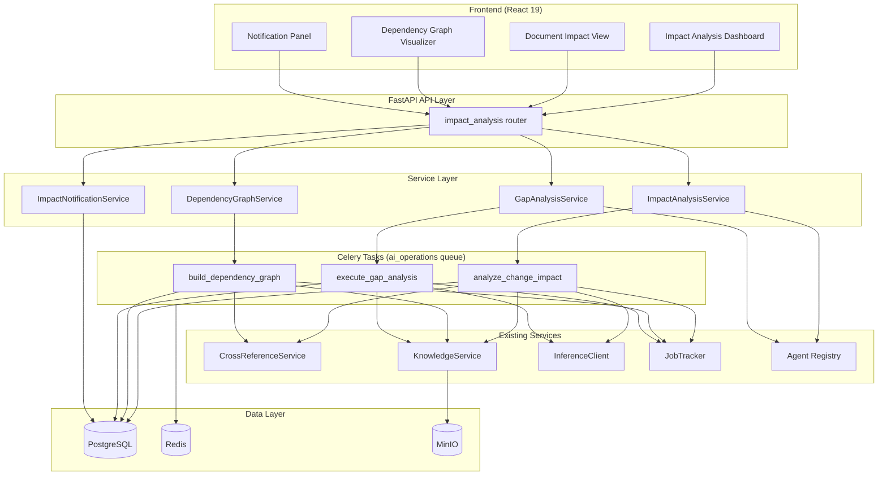
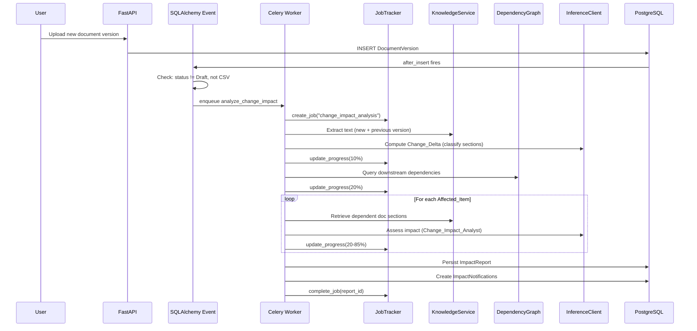
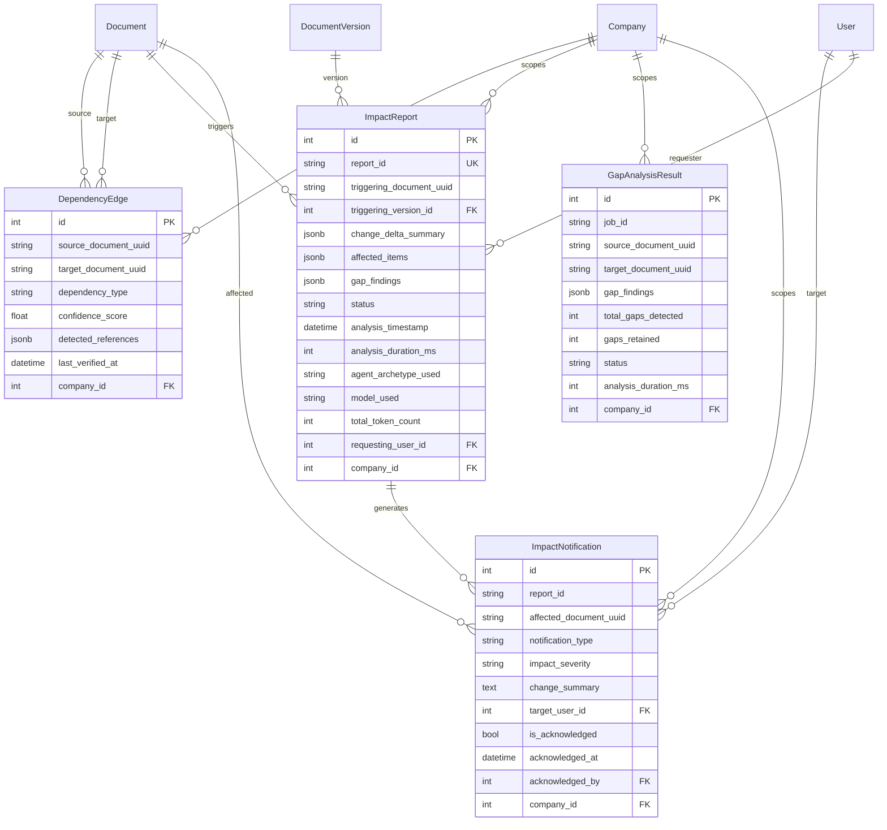

# Design Document: AI-Driven Change Impact Analysis

## Overview

This design implements Phase 5.5 — AI-Driven Change Impact Analysis for AlcoaBase. The system automatically detects when documents change, maps dependencies between documents, assesses the impact of changes on dependent documents and training tasks, and produces immutable audit reports with gap findings.

The feature integrates with existing infrastructure:
- **CrossReferenceService** (5.4) for dependency extraction
- **KnowledgeService** (4.2) for text extraction and semantic search
- **InferenceClient** (4.3) for AI-powered gap analysis via vLLM
- **Agent Registry** (5.1) for the Change Impact Analyst archetype
- **JobTracker** for async task progress tracking
- **Celery + Redis** for background processing on the `ai_operations` queue

### Design Decisions

1. **Event-driven trigger**: SQLAlchemy `after_insert` on `DocumentVersion` fires the analysis pipeline automatically, avoiding polling.
2. **Immutable reports**: `ImpactReport` and `GapAnalysisResult` use ORM-level event listeners (same pattern as `GenerationProvenance`) to enforce append-only semantics for GxP compliance.
3. **Graceful degradation**: Each affected item is assessed independently; inference failures mark individual items as "unknown" without failing the entire job.
4. **Bounded execution**: Hard timeout of 600s per job with partial_success persistence ensures the system never blocks indefinitely.
5. **Agent fallback**: If the Change Impact Analyst archetype is missing, the system falls back to the Regulatory Compliance Auditor with an appended prompt suffix.
6. **JSONB for structured findings**: Affected items and gap findings are stored as JSONB arrays within the report row, avoiding excessive table joins while maintaining queryability.

## Architecture

### High-Level Component Diagram



### Data Flow: Automatic Impact Analysis Trigger



## Components and Interfaces

### Backend Components

#### 1. API Router: `api/impact_analysis.py`

Single router file following the one-router-per-domain pattern. Prefix: `/impact-analysis`.

| Method | Path | Description | Returns |
|--------|------|-------------|---------|
| POST | `/dependency-graph/build` | Trigger async dependency graph build | 202 + job_id |
| GET | `/dependency-graph` | List dependency edges (paginated, filterable) | 200 + edges[] |
| GET | `/dependency-graph/{document_uuid}` | Get dependencies for a document | 200 + grouped edges |
| POST | `/trigger` | Manually trigger impact analysis | 202 + job_id |
| POST | `/gap-analysis` | Trigger gap analysis between two documents | 202 + job_id |
| GET | `/gap-analysis/{job_id}/results` | Get gap analysis findings | 200/202 + findings[] |
| GET | `/reports` | List impact reports (paginated, filterable) | 200 + reports[] |
| GET | `/reports/{report_id}` | Get full impact report | 200 + report |
| GET | `/jobs/{job_id}/status` | Get job status and progress | 200 + status |
| GET | `/notifications` | List unacknowledged notifications | 200 + notifications[] |
| POST | `/notifications/{notification_id}/acknowledge` | Acknowledge notification | 200 |
| GET | `/documents/{document_uuid}/status` | Get document impact status | 200 + status |

All mutation endpoints require `X-Change-Reason` header. All endpoints require `X-Company-Id` and `Authorization: Bearer`.

#### 2. Service Layer

| Service | File | Responsibility |
|---------|------|----------------|
| `ImpactAnalysisService` | `services/impact_analysis.py` | Orchestrates impact analysis: delta computation, affected item assessment, report generation |
| `DependencyGraphService` | `services/dependency_graph.py` | Builds and queries the dependency graph using CrossReferenceService and KnowledgeService |
| `GapAnalysisService` | `services/gap_analysis.py` | Performs section-level gap analysis between document pairs |
| `ImpactNotificationService` | `services/impact_notification.py` | Creates and manages impact notifications, handles training task resets |

#### 3. Celery Tasks: `tasks/impact_analysis_tasks.py`

| Task | Queue | Time Limit | Description |
|------|-------|------------|-------------|
| `build_dependency_graph` | ai_operations | 300s | Builds/updates the dependency graph for a company |
| `analyze_change_impact` | ai_operations | 600s | Full impact analysis pipeline for a document change |
| `execute_gap_analysis` | ai_operations | 180s | Gap analysis between a specific document pair |

#### 4. Event Listener: `services/impact_analysis_trigger.py`

Registers a SQLAlchemy `after_insert` listener on `DocumentVersion` that conditionally enqueues the `analyze_change_impact` task.

### Frontend Components

| Component | Path | Description |
|-----------|------|-------------|
| `ImpactAnalysisPage` | `pages/ImpactAnalysisPage.tsx` | Main dashboard with summary cards, report list, notification badge |
| `DependencyGraphView` | `components/impact/DependencyGraphView.tsx` | Interactive graph visualization (nodes + directed edges, color-coded) |
| `GapAnalysisDetail` | `components/impact/GapAnalysisDetail.tsx` | Side-by-side comparison of source/target sections with highlighted gaps |
| `ImpactReportCard` | `components/impact/ImpactReportCard.tsx` | Summary card for a single impact report |
| `NotificationPanel` | `components/impact/NotificationPanel.tsx` | List of unacknowledged notifications with acknowledge action |
| `TriggerAnalysisButton` | `components/impact/TriggerAnalysisButton.tsx` | Button + progress indicator for manual analysis trigger |
| `DocumentImpactStatus` | `components/impact/DocumentImpactStatus.tsx` | Inline widget for document detail page showing impact status |

#### Zustand Store: `stores/impactAnalysisStore.ts`

```typescript
interface ImpactAnalysisState {
  reports: ImpactReport[];
  notifications: ImpactNotification[];
  dependencyGraph: DependencyEdge[];
  activeJob: JobStatus | null;
  documentStatus: Record<string, DocumentImpactStatus>;
  isLoading: boolean;
  error: string | null;

  // Actions
  fetchReports: (params: ReportFilters) => Promise<void>;
  fetchNotifications: () => Promise<void>;
  fetchDependencyGraph: (documentUuid?: string) => Promise<void>;
  triggerAnalysis: (documentId: number, reason: string) => Promise<string>;
  acknowledgeNotification: (id: number, reason: string) => Promise<void>;
  pollJobStatus: (jobId: string) => Promise<void>;
  fetchDocumentStatus: (documentUuid: string) => Promise<void>;
}
```

### Agent Archetype: `agents/archetypes/change-impact-analyst.yaml`

```yaml
schema_version: "2.0"
name: "Change Impact Analyst"
description: "Specialized agent for document change impact analysis, dependency assessment, and gap identification in regulated environments."
archetype: "Change Impact Analyst"
personality_profile:
  tone: "precise and evidence-based"
  verbosity: "concise"
  strictness: 0.85
  domain_focus:
    - "change_control"
    - "impact_assessment"
    - "gap_analysis"
    - "regulatory"
    - "document_management"
  communication_style: "structured findings with section references and severity classification"
contextual_tuning:
  temperature: 0.2
  max_tokens: 4096
  top_p: 0.95
  frequency_penalty: 0.1
  presence_penalty: 0.0
evaluation_rubric:
  criteria:
    - name: "Accuracy of Gap Identification"
      weight: 0.30
      description: "Correctly identifies misalignments between document pairs without false positives"
    - name: "Completeness of Coverage Assessment"
      weight: 0.30
      description: "All relevant sections in the target document are evaluated against source changes"
    - name: "Correctness of Severity Classification"
      weight: 0.25
      description: "Severity ratings accurately reflect the degree of misalignment"
    - name: "Regulatory Awareness"
      weight: 0.15
      description: "Findings account for regulatory context and document type relationships"
  severity_thresholds:
    critical: 0.9
    major: 0.7
    minor: 0.4
    informational: 0.2
  scoring_method: "weighted_average"
agent_type: "review"
system_prompt: |
  You are a Change Impact Analyst specializing in regulated document management.
  Your role is to identify misalignments between document pairs when a source
  document has been updated.

  Classification rules:
  - CRITICAL: The dependent document contains statements that directly contradict
    the updated source content. Evidence of contradiction must be explicit.
  - MAJOR: The dependent document is missing content that the updated source now
    requires or mandates. A clear gap in coverage must exist.
  - MINOR: The dependent document uses outdated terminology, version references,
    or formatting but remains functionally correct and aligned.

  Dependency-type-aware strictness:
  - "validates": Every requirement in the source MUST have corresponding coverage
    in the target. Missing coverage is MAJOR.
  - "implements": Test cases must cover all updated requirements. Missing tests
    are MAJOR.
  - "references": Only direct contradictions are flagged. Missing references are
    MINOR unless they create ambiguity.
  - "trains_on": Procedural changes in the source require training content updates.
    Safety-critical changes are CRITICAL.
  - "derived_from": Template changes require regeneration review. Structural
    changes are MAJOR.

  Rules:
  1. Provide specific section references for ALL findings.
  2. Require clear evidence before reporting a gap — avoid false positives.
  3. Consider the regulatory context (GxP, ALCOA+) when assessing severity.
  4. Output structured JSON with gap_type, severity, and remediation_suggestion.
target_document_tag: "All"
dspy_modules:
  - name: "impact_assessment"
    type: "ChainOfThought"
    params:
      temperature: 0.2
      max_tokens: 4096
  - name: "gap_identification"
    type: "ChainOfThought"
    params:
      temperature: 0.2
      max_tokens: 4096
knowledge_scopes:
  tags:
    - "Change Control"
    - "Impact Assessment"
    - "Gap Analysis"
    - "Regulatory"
    - "Document Management"
```

## Data Models

### Database Schema

#### DependencyEdge

```python
class DependencyEdge(Base, AuditMixin):
    """Directed edge in the document dependency graph.

    Represents a dependency relationship between two documents within
    a company scope. Mutable (edges can be updated/pruned during
    incremental builds). AuditMixin enables Continuum versioning.
    """
    __tablename__ = "dependency_edges"
    __table_args__ = (
        UniqueConstraint(
            "source_document_uuid", "target_document_uuid",
            "dependency_type", "company_id",
            name="uq_dependency_edge_source_target_type_company",
        ),
        Index("ix_dependency_edge_company_source", "company_id", "source_document_uuid"),
        Index("ix_dependency_edge_company_target", "company_id", "target_document_uuid"),
    )

    id: Mapped[int] = mapped_column(primary_key=True)
    source_document_uuid: Mapped[str] = mapped_column(String(12), index=True)
    target_document_uuid: Mapped[str] = mapped_column(String(12), index=True)
    dependency_type: Mapped[str] = mapped_column(String(50))
    # Constrained: "validates", "references", "implements", "trains_on", "derived_from"
    confidence_score: Mapped[float] = mapped_column(Float)  # 0.0 to 1.0
    detected_references: Mapped[dict] = mapped_column(JSONB, default=list)
    # Array of reference identifiers, max 500 entries
    last_verified_at: Mapped[datetime] = mapped_column(DateTime(timezone=True))
    company_id: Mapped[int] = mapped_column(ForeignKey("companies.id"))
    created_at: Mapped[datetime] = mapped_column(
        DateTime(timezone=True), server_default=func.now()
    )
    updated_at: Mapped[datetime | None] = mapped_column(
        DateTime(timezone=True), nullable=True, onupdate=func.now()
    )
```

#### ImpactReport

```python
class ImpactReport(Base):
    """Immutable impact analysis report record.

    Append-only. Uses before_update and before_delete event listeners
    to prevent mutation (same pattern as GenerationProvenance).
    """
    __tablename__ = "impact_reports"
    __table_args__ = (
        Index("ix_impact_report_company_trigger", "company_id", "triggering_document_uuid"),
    )

    id: Mapped[int] = mapped_column(primary_key=True)
    report_id: Mapped[str] = mapped_column(String(36), unique=True, index=True)
    # UUID stored as string
    triggering_document_uuid: Mapped[str] = mapped_column(String(12), index=True)
    triggering_version_id: Mapped[int] = mapped_column(
        ForeignKey("document_versions.id")
    )
    change_delta_summary: Mapped[dict] = mapped_column(JSONB)
    # Structure: {sections_added: [], sections_modified: [], sections_deleted: [],
    #             significance_levels: {high: int, medium: int, low: int}}
    affected_items: Mapped[list] = mapped_column(JSONB, default=list)
    # Array of AffectedItem structures (see Pydantic schema below)
    gap_findings: Mapped[list] = mapped_column(JSONB, default=list)
    # Array of GapFinding structures
    status: Mapped[str] = mapped_column(String(20))
    # Constrained: "completed", "partial_success", "failed"
    analysis_timestamp: Mapped[datetime] = mapped_column(DateTime(timezone=True))
    analysis_duration_ms: Mapped[int] = mapped_column()
    agent_archetype_used: Mapped[str] = mapped_column(String(100))
    model_used: Mapped[str] = mapped_column(String(100))
    total_token_count: Mapped[int] = mapped_column()
    requesting_user_id: Mapped[int | None] = mapped_column(
        ForeignKey("users.id"), nullable=True
    )
    company_id: Mapped[int] = mapped_column(ForeignKey("companies.id"))
    created_at: Mapped[datetime] = mapped_column(
        DateTime(timezone=True), server_default=func.now()
    )
```

#### GapAnalysisResult

```python
class GapAnalysisResult(Base):
    """Immutable gap analysis result record. Append-only."""
    __tablename__ = "gap_analysis_results"

    id: Mapped[int] = mapped_column(primary_key=True)
    job_id: Mapped[str] = mapped_column(String(100), index=True)
    source_document_uuid: Mapped[str] = mapped_column(String(12))
    target_document_uuid: Mapped[str] = mapped_column(String(12))
    gap_findings: Mapped[list] = mapped_column(JSONB, default=list)
    total_gaps_detected: Mapped[int] = mapped_column()
    gaps_retained: Mapped[int] = mapped_column()
    status: Mapped[str] = mapped_column(String(20))
    # Constrained: "completed", "partial_success", "failed"
    analysis_duration_ms: Mapped[int] = mapped_column()
    company_id: Mapped[int] = mapped_column(ForeignKey("companies.id"))
    created_at: Mapped[datetime] = mapped_column(
        DateTime(timezone=True), server_default=func.now()
    )
```

#### ImpactNotification

```python
class ImpactNotification(Base, AuditMixin):
    """Notification for document owners about impact findings.

    Mutable (can be acknowledged). AuditMixin enables Continuum versioning.
    """
    __tablename__ = "impact_notifications"
    __table_args__ = (
        UniqueConstraint(
            "report_id", "affected_document_uuid", "target_user_id",
            name="uq_impact_notification_report_doc_user",
        ),
        Index("ix_impact_notification_user_ack", "target_user_id", "is_acknowledged"),
    )

    id: Mapped[int] = mapped_column(primary_key=True)
    report_id: Mapped[str] = mapped_column(String(36), index=True)
    affected_document_uuid: Mapped[str] = mapped_column(String(12), index=True)
    notification_type: Mapped[str] = mapped_column(String(50))
    # Constrained: "change_impact"
    impact_severity: Mapped[str] = mapped_column(String(20))
    # Constrained: "critical", "major", "minor", "unknown"
    change_summary: Mapped[str] = mapped_column(Text)  # max 2000 chars
    target_user_id: Mapped[int] = mapped_column(ForeignKey("users.id"), index=True)
    is_acknowledged: Mapped[bool] = mapped_column(default=False)
    acknowledged_at: Mapped[datetime | None] = mapped_column(
        DateTime(timezone=True), nullable=True
    )
    acknowledged_by: Mapped[int | None] = mapped_column(
        ForeignKey("users.id"), nullable=True
    )
    company_id: Mapped[int] = mapped_column(ForeignKey("companies.id"))
    created_at: Mapped[datetime] = mapped_column(
        DateTime(timezone=True), server_default=func.now()
    )
```

### Pydantic Schemas (Key Structures)

```python
class AffectedItemSchema(BaseModel):
    """Structure stored in ImpactReport.affected_items JSONB."""
    affected_document_uuid: str | None = None
    training_task_id: int | None = None
    affected_document_title: str
    dependency_type: str
    impact_severity: Literal["critical", "major", "minor", "unknown"]
    affected_sections: list[str]
    change_summary: str = Field(max_length=500)
    recommended_action: Literal[
        "update_required", "review_recommended",
        "retraining_required", "manual_review_required"
    ]
    inference_prompt_summary: str = Field(max_length=500)
    model_response_summary: str = Field(max_length=500)
    token_count: int

class GapFindingSchema(BaseModel):
    """Structure stored in ImpactReport.gap_findings and GapAnalysisResult.gap_findings."""
    source_section: str
    source_content_excerpt: str = Field(max_length=300)
    target_section: str  # or "not_found"
    target_content_excerpt: str = Field(max_length=300)
    gap_type: Literal["missing", "contradicts", "incomplete", "outdated"]
    severity: Literal["critical", "major", "minor"]
    remediation_suggestion: str
    inference_prompt_summary: str = Field(max_length=500)
    model_response_summary: str = Field(max_length=500)
    token_count: int

class ChangeDeltaSchema(BaseModel):
    """Structure stored in ImpactReport.change_delta_summary."""
    sections_added: list[dict[str, str]]
    sections_modified: list[dict[str, str]]
    sections_deleted: list[dict[str, str]]
    significance_levels: dict[str, int]  # {high: N, medium: N, low: N}
    metadata: dict[str, Any] = {}  # fallback_used, user_attribution_unavailable, etc.
```

### Entity Relationship Diagram



## Correctness Properties

*A property is a characteristic or behavior that should hold true across all valid executions of a system — essentially, a formal statement about what the system should do. Properties serve as the bridge between human-readable specifications and machine-verifiable correctness guarantees.*

### Property 1: Confidence Score Assignment

*For any* dependency edge detected between two documents, the confidence_score SHALL be assigned based on detection method: exactly 1.0 for explicit cross-references (exact ID matches), exactly 0.9 for database-linked relationships (TrainingTask, GenerationProvenance), and between 0.5 and 0.8 (inclusive) for semantically inferred relationships. Furthermore, *for any* candidate relationship with embedding similarity below 0.5, no edge SHALL be created.

**Validates: Requirements 1.6**

### Property 2: Dependency Type Classification

*For any* pair of documents with identifiable cross-references, the dependency_type SHALL be classified correctly: "validates" for requirement ID cross-references between MVP/IQ/OQ/PQ and URS documents, "references" for explicit document_uuid citations or title mentions, "implements" for test case IDs referencing requirement IDs, "trains_on" for TrainingTask records linking SOPs to training, and "derived_from" for GenerationProvenance records.

**Validates: Requirements 1.4**

### Property 3: Company Isolation

*For any* API query to any impact analysis endpoint scoped by X-Company-Id, the response SHALL contain only records belonging to that company. No dependency edges, impact reports, gap findings, or notifications from other companies SHALL appear in the results.

**Validates: Requirements 1.11, 2.7, 3.7, 4.8, 5.6, 6.6, 8.6**

### Property 4: Edge Deduplication and Pruning

*For any* sequence of dependency edge insertions where the same (source_document_uuid, target_document_uuid, dependency_type, company_id) tuple appears multiple times, exactly one edge SHALL exist with the most recently computed confidence_score, detected_references, and last_verified_at. Additionally, *for any* incremental build where a document's content no longer contains a previously detected reference, the corresponding edge SHALL be removed.

**Validates: Requirements 1.13, 1.14**

### Property 5: Document Filtering for Auto-Trigger

*For any* DocumentVersion creation event where the associated document has current_status "Draft" or is_csv_validation_record is true, the Impact_Analysis_Engine SHALL NOT enqueue an impact analysis task. For all other statuses and non-CSV documents, a task SHALL be enqueued.

**Validates: Requirements 2.3**

### Property 6: Conflict Detection with Staleness

*For any* impact analysis trigger request where a job with status "processing" already exists for the same document_uuid, the system SHALL return HTTP 409 with the existing job_id IF the job's last progress update is within 600 seconds. If the existing job's last update exceeds 600 seconds, the system SHALL treat it as stale and allow a new job to be created.

**Validates: Requirements 2.5**

### Property 7: Change Delta Correctness

*For any* two consecutive document versions, the computed Change_Delta SHALL correctly partition all sections into exactly one of: sections_added (present in new, absent in old), sections_modified (present in both with different content), or sections_deleted (present in old, absent in new). The union of these three sets SHALL equal the symmetric difference of sections between the two versions.

**Validates: Requirements 2.6**

### Property 8: Candidate Prioritization

*For any* set of downstream dependencies exceeding 50 items, the Impact_Analysis_Engine SHALL select exactly 50 candidates prioritized first by confidence_score (descending) and then by dependency_type priority order (validates > implements > references > trains_on > derived_from). The selected set SHALL always contain the highest-priority items.

**Validates: Requirements 3.6**

### Property 9: Gap Findings Retention

*For any* gap analysis producing more than 100 Gap_Findings, the system SHALL retain exactly the 100 highest-severity findings (critical > major > minor) and record the total count of detected gaps in job metadata. The retained set SHALL always include all critical findings before major findings, and all major findings before minor findings.

**Validates: Requirements 4.10**

### Property 10: Dependency Validation Threshold

*For any* gap analysis request between two documents, the system SHALL reject the request with HTTP 422 if no dependency edge exists between them with confidence_score >= 0.5. The system SHALL accept the request if at least one such edge exists.

**Validates: Requirements 4.6**

### Property 11: Immutability Enforcement

*For any* ImpactReport or GapAnalysisResult record that has been persisted, any attempt to UPDATE or DELETE the record through the ORM SHALL raise an ImmutableRecordError. The record's content SHALL remain unchanged after creation regardless of subsequent operations.

**Validates: Requirements 5.2, 9.2, 9.4**

### Property 12: Monotonic Progress

*For any* sequence of progress updates emitted during an impact analysis job, each progress_percent value SHALL be greater than or equal to the previously reported value. Progress SHALL never decrease from a previously reported value.

**Validates: Requirements 6.2**

### Property 13: Notification Creation Rules

*For any* completed impact analysis with affected items, notifications SHALL be created only for items with impact_severity "critical" or "major". No notifications SHALL be created for "minor" or "unknown" severity items. Each notification SHALL target the document owner (Document.created_by) of the affected document.

**Validates: Requirements 8.1**

### Property 14: Notification Idempotence

*For any* notification acknowledgment operation, calling acknowledge on the same notification multiple times SHALL produce the same result (HTTP 200 with existing acknowledgment details). Additionally, *for any* attempt to create a notification where an unacknowledged notification already exists for the same (report_id, affected_document_uuid, target_user_id) tuple, no duplicate SHALL be created.

**Validates: Requirements 8.3, 8.8**

### Property 15: Training Task Reset Idempotence

*For any* affected training task with recommended_action "retraining_required", setting is_completed to false SHALL be idempotent: if is_completed is already false, no update SHALL occur. The operation SHALL never set is_completed to true.

**Validates: Requirements 8.4**

### Property 16: Document Impact Status Computation

*For any* document, the is_up_to_date flag SHALL be true if and only if there are zero unresolved critical or major findings where that document is the target. The outstanding_critical_count and outstanding_major_count SHALL equal the actual count of unacknowledged notifications with the respective severity for that document.

**Validates: Requirements 8.5**

### Property 17: Error Message Sanitization

*For any* failed impact analysis job, the error_message SHALL contain the failure category and affected component but SHALL NOT contain internal stack traces, file paths, or implementation details that could expose system internals.

**Validates: Requirements 6.9**

### Property 18: Agent Fallback Behavior

*For any* impact analysis execution where the "Change Impact Analyst" archetype is not found in the Agent Registry, the system SHALL use the "Regulatory Compliance Auditor" archetype with an appended system prompt suffix for change impact focus, and SHALL record the fallback event in job metadata under "fallback_used".

**Validates: Requirements 7.5**

## Error Handling

### Error Categories and Responses

| Category | HTTP Status | Behavior |
|----------|-------------|----------|
| Document not found (company scope) | 404 | Return error identifying missing document |
| Invalid UUID format | 422 | Return validation error |
| Same-document gap analysis | 422 | Return error indicating distinct documents required |
| No dependency relationship | 422 | Return error suggesting dependency graph build |
| Concurrent analysis conflict | 409 | Return existing job_id |
| JobTracker unavailable | 503 | Fail request, do not enqueue task |
| Celery broker unavailable | Log + skip | Document remains eligible for manual trigger |
| InferenceClient timeout (per-item) | Continue | Mark item as severity "unknown", action "manual_review_required" |
| InferenceClient unavailable (gap analysis) | Fail job | Mark job as failed with reason |
| KnowledgeService retrieval failure (per-item) | Continue | Mark item as severity "unknown", action "manual_review_required" |
| Document retrieval failure (graph build) | Skip + warn | Log warning, continue with remaining documents |
| Database write failure (report) | Fail job | Mark job as failed via JobTracker |
| Training task update failure | Warn + continue | Record in report metadata, don't fail job |
| Analysis timeout (600s) | Partial success | Persist findings so far, record unassessed items |
| Graph build timeout (300s) | Partial success | Persist edges so far, record unprocessed documents |
| Gap analysis timeout (180s) | Partial success | Persist findings so far, record last processed section |

### Retry Strategy

- **InferenceClient**: 3 retries with exponential backoff (1s, 2s, 4s) for HTTP 429/503
- **Celery tasks**: `max_retries=0` (no automatic retry — failures produce partial_success or failed reports)
- **Database operations**: Rely on SQLAlchemy connection pool retry (`pool_pre_ping=True`)

### Graceful Degradation Principles

1. **Per-item isolation**: Each affected item is assessed independently. One item's failure doesn't block others.
2. **Partial results over no results**: Timeouts always persist what was discovered so far.
3. **Audit trail preservation**: Even failed analyses produce an ImpactReport record (with empty findings).
4. **No silent failures**: All errors are recorded in job metadata or report metadata for traceability.


## Testing Strategy

### Property-Based Tests (Hypothesis)

Property-based testing is appropriate for this feature because it contains significant pure logic (filtering, sorting, prioritization, deduplication, validation, state computation) that can be tested with generated inputs across a wide input space.

**Library**: Hypothesis (Python backend), fast-check (TypeScript frontend)
**Minimum iterations**: 100 per property test
**Location**: `src/backend/tests/properties/test_impact_analysis_properties.py`

Each property test will be tagged with:
```python
# Feature: Step_5-5_ai-driven-change-impact-analysis, Property {N}: {title}
```

**Property tests to implement:**

| Property | Test Focus | Generator Strategy |
|----------|-----------|-------------------|
| 1 | Confidence score assignment | Generate detection results with various methods, verify score ranges |
| 2 | Dependency type classification | Generate reference patterns, verify correct type mapping |
| 3 | Company isolation | Generate multi-tenant data, verify no cross-tenant leakage |
| 4 | Edge deduplication + pruning | Generate edges, process twice, verify count = 1; remove refs, verify pruning |
| 5 | Draft/CSV exclusion | Generate documents with random statuses, verify trigger filtering |
| 6 | Conflict detection with staleness | Generate jobs with random timestamps, verify 409 vs 202 |
| 7 | Change delta correctness | Generate document section pairs, verify correct partitioning |
| 8 | Candidate prioritization | Generate >50 candidates with random scores/types, verify top-50 selection |
| 9 | Gap finding limiting | Generate >100 findings with random severities, verify top-100 retention |
| 10 | Dependency validation threshold | Generate document pairs with/without edges, verify 422 vs accept |
| 11 | Immutability enforcement | Create records, attempt mutations, verify ImmutableRecordError |
| 12 | Monotonic progress | Generate random progress sequences, verify non-decreasing |
| 13 | Notification severity filter | Generate items with random severities, verify only critical/major notify |
| 14 | Notification idempotence | Generate duplicate notification/acknowledge attempts, verify no duplicates |
| 15 | Training task reset | Generate tasks in various states, verify idempotent reset |
| 16 | Document status computation | Generate documents with various finding states, verify is_up_to_date |
| 17 | Error sanitization | Generate random exceptions, verify no stack traces in error_message |
| 18 | Agent fallback | Remove agent from registry, verify fallback used and recorded |

### Unit Tests (pytest)

**Location**: `src/backend/tests/unit/test_impact_analysis/`

| File | Coverage |
|------|----------|
| `test_dependency_graph_service.py` | Graph build logic, edge CRUD, filtering, deduplication, pruning |
| `test_impact_analysis_service.py` | Change delta computation, affected item assessment orchestration, report generation |
| `test_gap_analysis_service.py` | Gap finding production, limiting, timeout handling |
| `test_notification_service.py` | Notification creation, acknowledgment, deduplication, training reset |
| `test_impact_analysis_models.py` | Model constraints, immutability listeners, JSONB validation |
| `test_impact_analysis_schemas.py` | Pydantic schema validation, field constraints, enum validation |
| `test_impact_analysis_trigger.py` | Event listener logic, Draft/CSV filtering |

### Integration Tests (pytest)

**Location**: `src/backend/tests/integration/test_impact_analysis/`

| File | Coverage |
|------|----------|
| `test_impact_analysis_api.py` | Full API endpoint testing with database (all 12 endpoints) |
| `test_event_trigger_integration.py` | DocumentVersion insert → Celery task enqueue |
| `test_celery_tasks_integration.py` | Task execution with mocked AI services |
| `test_agent_loading.py` | YAML agent loading, schema validation, fallback behavior |

### Frontend Tests (Vitest + fast-check)

**Location**: `src/frontend/src/__tests__/impact-analysis/`

| File | Coverage |
|------|----------|
| `ImpactAnalysisPage.test.tsx` | Page rendering, data fetching, empty states |
| `DependencyGraphView.test.tsx` | Graph rendering, filtering, node limits |
| `NotificationPanel.test.tsx` | Notification list, acknowledge action, error handling |
| `impactAnalysisStore.test.ts` | Store state transitions, action sequences (fast-check) |

### Mocking Strategy

- **InferenceClient**: Mocked via `respx` for all unit/property tests. Returns structured JSON responses matching expected AI output format.
- **KnowledgeService**: Mocked to return pre-defined text content for document extraction.
- **StorageService**: Mocked to return file bytes without actual MinIO calls.
- **Celery tasks**: Tested synchronously via `asyncio.run()` pattern (matching existing `review_tasks.py` pattern).
- **Database**: In-memory SQLite for unit tests, PostgreSQL for integration tests.
- **JobTracker**: Real implementation for integration tests, mocked for unit tests.
