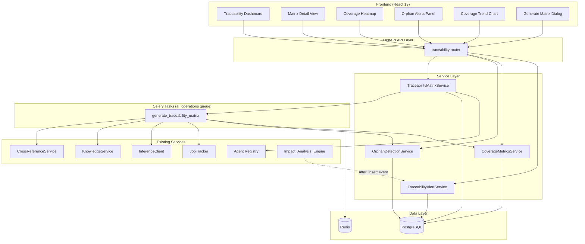
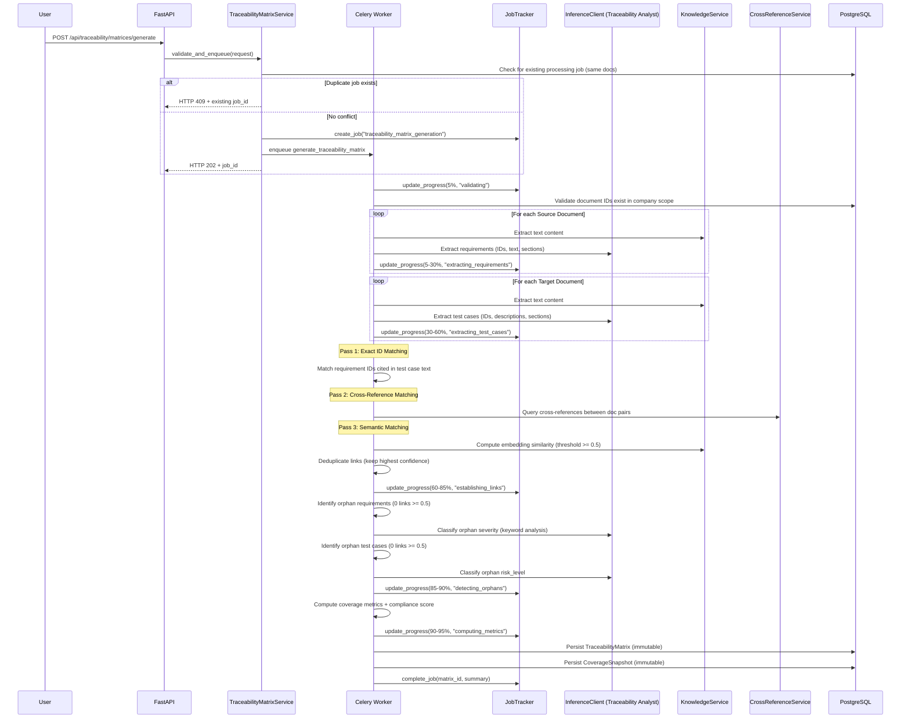
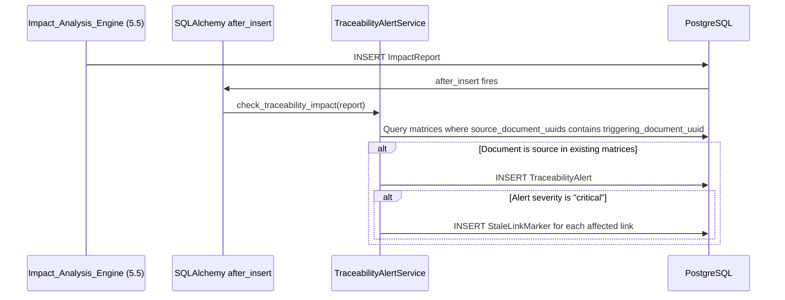
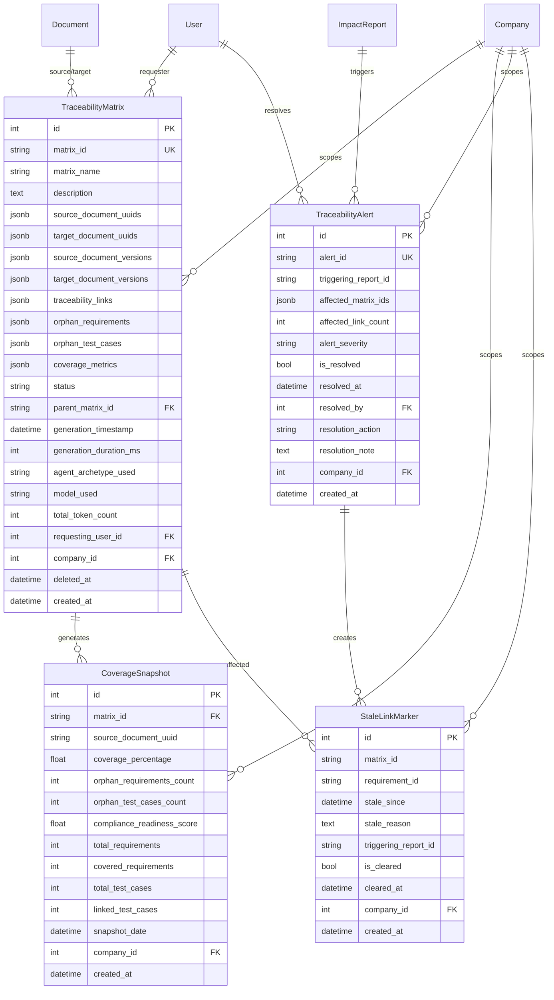

# Design Document: AI-Powered Traceability & Gap Discovery

## Overview

This design implements Phase 5.6 — AI-Powered Traceability & Gap Discovery for AlcoaBase. The system automatically generates Traceability Matrices by crawling requirements documents (URS) and mapping them to test cases and validation results in target documents (IQ, OQ, PQ, MVP). It detects orphan requirements (requirements without test cases) and orphan test cases (tests without justifying requirements), computes coverage metrics, and integrates with the Change Impact Analysis engine (5.5) to flag stale traceability links when requirements change.

The feature integrates with existing infrastructure:
- **CrossReferenceService** (5.4) for document relationship detection
- **KnowledgeService** (4.2) for text extraction and semantic search
- **InferenceClient** (4.3) for AI-powered analysis via vLLM
- **Agent Registry** (5.1) for the Traceability Analyst archetype
- **Impact_Analysis_Engine** (5.5) for integration via ImpactReport `after_insert` event
- **JobTracker** for async task progress tracking
- **Celery + Redis** for background processing on the `ai_operations` queue

### Design Decisions

1. **Three-pass matching strategy**: Links are established via exact ID match (highest confidence), then cross-reference detection, then semantic similarity — ensuring deterministic matches take priority over probabilistic ones.
2. **Immutable matrix records**: `TraceabilityMatrix` and `CoverageSnapshot` use ORM-level event listeners (same pattern as `ImpactReport` in 5.5) to enforce append-only semantics for GxP compliance. Soft-delete via `deleted_at` is the only permitted mutation on matrices.
3. **Event-driven integration with 5.5**: SQLAlchemy `after_insert` on `ImpactReport` triggers alert creation when the changed document is a source in existing matrices, avoiding polling.
4. **JSONB for structured data**: `traceability_links`, `orphan_requirements`, and `orphan_test_cases` are stored as JSONB arrays within the matrix record, avoiding excessive table joins while maintaining queryability.
5. **CoverageSnapshot as separate immutable records**: Enables trend analysis without re-computing metrics from matrix data.
6. **StaleLinkMarker for tracking stale links**: Separate mutable records (with AuditMixin) track which links are stale due to requirement changes, clearable upon resolution.
7. **Bounded execution**: 600s timeout with `partial_success` persistence ensures the system never blocks indefinitely.
8. **Agent fallback**: If Traceability Analyst archetype is missing, fall back to Change Impact Analyst with a prompt suffix for traceability focus.

## Architecture

### High-Level Component Diagram



### Data Flow: Traceability Matrix Generation



### Data Flow: Impact Report → Traceability Alert



## Components and Interfaces

### Backend Components

#### 1. API Router: `api/traceability.py`

Single router file following the one-router-per-domain pattern. Prefix: `/traceability`.

| Method | Path | Description | Returns |
|--------|------|-------------|---------|
| POST | `/matrices/generate` | Trigger async matrix generation | 202 + job_id |
| GET | `/matrices` | List matrices (paginated, filterable) | 200 + matrices[] |
| GET | `/matrices/{matrix_id}` | Get full matrix detail | 200 + matrix |
| GET | `/matrices/{matrix_id}/links` | Get traceability links (paginated) | 200 + links[] |
| GET | `/matrices/{matrix_id}/orphan-requirements` | Get orphan requirements | 200 + orphans[] |
| GET | `/matrices/{matrix_id}/orphan-test-cases` | Get orphan test cases | 200 + orphans[] |
| DELETE | `/matrices/{matrix_id}` | Soft-delete matrix | 204 |
| GET | `/documents/{document_uuid}/coverage` | Get document coverage status | 200 + coverage |
| GET | `/coverage/summary` | Get aggregated coverage summary | 200 + summary |
| GET | `/coverage/history` | Get coverage snapshots over time | 200 + snapshots[] |
| GET | `/alerts` | List unresolved traceability alerts | 200 + alerts[] |
| POST | `/alerts/{alert_id}/resolve` | Resolve a traceability alert | 200 |
| GET | `/jobs/{job_id}/status` | Get job status and progress | 200 + status |

All mutation endpoints require `X-Change-Reason` header. All endpoints require `X-Company-Id` and `Authorization: Bearer`.

#### 2. Service Layer

| Service | File | Responsibility |
|---------|------|----------------|
| `TraceabilityMatrixService` | `services/traceability_matrix.py` | Orchestrates matrix generation: requirement extraction, test case extraction, three-pass matching, deduplication, persistence |
| `OrphanDetectionService` | `services/orphan_detection.py` | Identifies orphan requirements and test cases, classifies severity/risk_level via AI |
| `CoverageMetricsService` | `services/coverage_metrics.py` | Computes coverage metrics, compliance readiness score, persists snapshots |
| `TraceabilityAlertService` | `services/traceability_alert.py` | Creates alerts on ImpactReport events, manages stale link markers, handles resolution |

#### 3. Celery Task: `tasks/traceability_tasks.py`

| Task | Queue | Time Limit | Description |
|------|-------|------------|-------------|
| `generate_traceability_matrix` | ai_operations | 600s | Full matrix generation pipeline: extract → match → classify → compute → persist |

#### 4. Event Listener: `services/traceability_alert_trigger.py`

Registers a SQLAlchemy `after_insert` listener on `ImpactReport` that checks whether the triggering document is a source in any existing non-deleted `TraceabilityMatrix` for the same company, and creates a `TraceabilityAlert` if so.

### Frontend Components

| Component | Path | Description |
|-----------|------|-------------|
| `TraceabilityPage` | `pages/TraceabilityPage.tsx` | Main dashboard with summary cards, matrix list, trend chart |
| `MatrixDetailView` | `components/traceability/MatrixDetailView.tsx` | Tabular view of links with sorting, filtering, stale indicators |
| `CoverageHeatmap` | `components/traceability/CoverageHeatmap.tsx` | Grid visualization of source×target coverage percentages |
| `OrphanAlertsPanel` | `components/traceability/OrphanAlertsPanel.tsx` | Tabbed panel for orphan requirements and test cases |
| `GenerateMatrixDialog` | `components/traceability/GenerateMatrixDialog.tsx` | Multi-select document pickers + name/description inputs |
| `CoverageTrendChart` | `components/traceability/CoverageTrendChart.tsx` | Line chart of coverage % over time with compliance score secondary axis |
| `TraceabilityAlertBanner` | `components/traceability/TraceabilityAlertBanner.tsx` | Banner showing unresolved critical/major alerts |

#### Zustand Store: `stores/traceabilityStore.ts`

```typescript
interface TraceabilityState {
  matrices: TraceabilityMatrix[];
  currentMatrix: TraceabilityMatrix | null;
  links: TraceabilityLink[];
  orphanRequirements: OrphanRequirement[];
  orphanTestCases: OrphanTestCase[];
  coverageSummary: CoverageSummary | null;
  coverageHistory: CoverageSnapshot[];
  alerts: TraceabilityAlert[];
  activeJob: JobStatus | null;
  isLoading: boolean;
  error: string | null;

  // Actions
  fetchMatrices: (params: MatrixFilters) => Promise<void>;
  fetchMatrix: (matrixId: string) => Promise<void>;
  fetchLinks: (matrixId: string, params: LinkFilters) => Promise<void>;
  fetchOrphanRequirements: (matrixId: string, params: OrphanFilters) => Promise<void>;
  fetchOrphanTestCases: (matrixId: string, params: OrphanFilters) => Promise<void>;
  generateMatrix: (request: GenerateRequest, reason: string) => Promise<string>;
  deleteMatrix: (matrixId: string, reason: string) => Promise<void>;
  fetchCoverageSummary: () => Promise<void>;
  fetchCoverageHistory: (params: HistoryFilters) => Promise<void>;
  fetchAlerts: (params: AlertFilters) => Promise<void>;
  resolveAlert: (alertId: string, resolution: ResolveRequest, reason: string) => Promise<void>;
  pollJobStatus: (jobId: string) => Promise<void>;
  fetchDocumentCoverage: (documentUuid: string) => Promise<DocumentCoverage>;
}
```

### Agent Archetype: `agents/archetypes/traceability-analyst.yaml`

```yaml
schema_version: "2.0"
name: "Traceability Analyst"
description: "Specialized agent for requirement-to-test traceability mapping, requirement extraction, test case identification, and semantic link establishment in GxP-regulated environments."
archetype: "Traceability Analyst"
personality_profile:
  tone: "methodical and precise"
  verbosity: "concise"
  strictness: 0.90
  domain_focus:
    - "traceability"
    - "requirements_management"
    - "test_coverage"
    - "regulatory_compliance"
    - "gap_analysis"
  communication_style: "structured extraction results with confidence scores and section references"
contextual_tuning:
  temperature: 0.15
  max_tokens: 4096
  top_p: 0.95
  frequency_penalty: 0.1
  presence_penalty: 0.0
evaluation_rubric:
  criteria:
    - name: "Accuracy of Requirement Extraction"
      weight: 0.25
      description: "Correctly identifies requirement IDs, text, and acceptance criteria from source documents without hallucination"
    - name: "Accuracy of Test Case Identification"
      weight: 0.25
      description: "Correctly identifies test case IDs, descriptions, and expected results from target documents"
    - name: "Correctness of Link Establishment"
      weight: 0.30
      description: "Links between requirements and test cases are valid, with appropriate confidence scoring and no false positives"
    - name: "Completeness of Orphan Detection"
      weight: 0.20
      description: "All orphan requirements and test cases are identified without false negatives"
  severity_thresholds:
    critical: 0.9
    major: 0.7
    minor: 0.4
    informational: 0.2
  scoring_method: "weighted_average"
agent_type: "review"
system_prompt: |
  You are a Traceability Analyst specializing in requirement-to-test mapping for
  regulated document management systems (GxP, FDA, EMA compliance).

  Your primary tasks:
  1. REQUIREMENT EXTRACTION: Identify individual requirements from regulatory
     documents by detecting:
     - Requirement IDs (patterns: REQ-NNN, URS-NNN, R.N.N, FR-NNN)
     - Requirement text (the full statement of what SHALL be done)
     - Acceptance criteria (measurable conditions for verification)
     - Section headings and paragraph indices for traceability

  2. TEST CASE EXTRACTION: Identify individual test cases from validation
     documents by detecting:
     - Test case IDs (patterns: TC-NNN, IQ-NNN, OQ-NNN, PQ-NNN, MVP-NNN)
     - Test descriptions (what is being verified)
     - Expected results (pass/fail criteria)
     - Section headings and paragraph indices

  3. LINK ESTABLISHMENT: Establish traceability links between requirements and
     test cases based on:
     - Explicit ID cross-references (requirement ID cited in test case text)
     - Semantic similarity (minimum confidence 0.75 for link acceptance)
     - Structural document relationships

  4. ORPHAN CLASSIFICATION:
     - Orphan requirement severity:
       * CRITICAL: Contains safety-critical keywords (hazard, safety, sterility,
         biocompatibility, alarm, interlock) or regulatory-mandatory keywords
         (shall comply, regulatory requirement, FDA, EMA, ISO)
       * MAJOR: Contains functional keywords (shall perform, shall calculate,
         shall display)
       * MINOR: Contains only informational keywords (should, may, nice-to-have,
         optional)
     - Orphan test case risk_level:
       * HIGH: Validates safety function, alarm verification, interlock test
       * MEDIUM: Verifies calculation, confirms workflow, validates data entry
       * LOW: Checks display format, verifies label text, cosmetic verification

  Rules:
  1. Extract ALL identifiable requirements/test cases — do not skip items.
  2. Reject candidate links below 0.75 confidence to avoid false positives.
  3. When multiple categories match, assign the highest-precedence severity.
  4. Output structured JSON matching the expected schema exactly.
  5. Include section references for all extracted items.
target_document_tag: "All"
required_chapters:
  - name: "Requirements List"
    required: true
    description: "Extracted requirements with IDs, text, and section references"
  - name: "Test Cases List"
    required: true
    description: "Extracted test cases with IDs, descriptions, and section references"
  - name: "Traceability Links"
    required: true
    description: "Established links between requirements and test cases with confidence scores"
  - name: "Orphan Items"
    required: true
    description: "Requirements and test cases without traceability links"
compliance_checklist:
  - "All requirements in source documents are extracted"
  - "All test cases in target documents are extracted"
  - "Links below 0.75 confidence are rejected"
  - "Orphan severity follows keyword precedence rules"
  - "No false positive links reported"
  - "Section references included for all items"
severity_rules:
  critical: "Safety-critical or regulatory-mandatory requirement without test coverage"
  major: "Functional requirement without test coverage"
  minor: "Informational requirement without test coverage"
  informational: "Optional requirement without explicit test coverage"
dspy_modules:
  - name: "requirement_extraction"
    type: "ChainOfThought"
    params:
      temperature: 0.15
      max_tokens: 4096
  - name: "test_case_extraction"
    type: "ChainOfThought"
    params:
      temperature: 0.15
      max_tokens: 4096
  - name: "link_establishment"
    type: "ChainOfThought"
    params:
      temperature: 0.15
      max_tokens: 4096
knowledge_scopes:
  tags:
    - "Traceability"
    - "Requirements Management"
    - "Test Coverage"
    - "Validation"
    - "Regulatory Compliance"
    - "URS"
    - "IQ"
    - "OQ"
    - "PQ"
```


## Data Models

### Database Schema

#### TraceabilityMatrix

```python
class TraceabilityMatrix(Base):
    """Immutable traceability matrix record.

    Append-only with soft-delete support. Uses before_update event listener
    that permits UPDATE only on deleted_at column and raises ImmutableRecordError
    on any other column mutation. before_delete raises ImmutableRecordError
    unconditionally.
    """
    __tablename__ = "traceability_matrices"
    __table_args__ = (
        Index(
            "ix_traceability_matrix_company_timestamp",
            "company_id", "generation_timestamp",
        ),
        Index(
            "ix_traceability_matrix_company_deleted",
            "company_id", "deleted_at",
        ),
    )

    id: Mapped[int] = mapped_column(primary_key=True)
    matrix_id: Mapped[str] = mapped_column(
        String(36), unique=True, index=True
    )  # UUID stored as string
    matrix_name: Mapped[str] = mapped_column(String(200))
    description: Mapped[str | None] = mapped_column(Text, nullable=True)
    # max 1000 chars enforced at schema level
    source_document_uuids: Mapped[list] = mapped_column(JSONB)
    # Array of String(12) document UUIDs
    target_document_uuids: Mapped[list] = mapped_column(JSONB)
    # Array of String(12) document UUIDs
    source_document_versions: Mapped[list] = mapped_column(JSONB)
    # Array of {document_uuid: str, version_id: int}
    target_document_versions: Mapped[list] = mapped_column(JSONB)
    # Array of {document_uuid: str, version_id: int}
    traceability_links: Mapped[list] = mapped_column(JSONB, default=list)
    # Array of TraceabilityLink structures
    orphan_requirements: Mapped[list] = mapped_column(JSONB, default=list)
    # Array of OrphanRequirement structures
    orphan_test_cases: Mapped[list] = mapped_column(JSONB, default=list)
    # Array of OrphanTestCase structures
    coverage_metrics: Mapped[dict] = mapped_column(JSONB)
    # CoverageMetric structure
    status: Mapped[str] = mapped_column(String(20))
    # Constrained: "completed", "partial_success", "failed"
    parent_matrix_id: Mapped[str | None] = mapped_column(
        String(36), nullable=True
    )  # UUID referencing previous matrix for same doc set
    generation_timestamp: Mapped[datetime] = mapped_column(
        DateTime(timezone=True)
    )
    generation_duration_ms: Mapped[int] = mapped_column()
    agent_archetype_used: Mapped[str] = mapped_column(String(100))
    model_used: Mapped[str] = mapped_column(String(100))
    total_token_count: Mapped[int] = mapped_column()
    requesting_user_id: Mapped[int] = mapped_column(
        ForeignKey("users.id")
    )
    company_id: Mapped[int] = mapped_column(ForeignKey("companies.id"))
    deleted_at: Mapped[datetime | None] = mapped_column(
        DateTime(timezone=True), nullable=True
    )
    created_at: Mapped[datetime] = mapped_column(
        DateTime(timezone=True), server_default=func.now()
    )
```

#### CoverageSnapshot

```python
class CoverageSnapshot(Base):
    """Immutable coverage snapshot for trend analysis.

    Append-only. Uses before_update and before_delete event listeners
    to raise ImmutableRecordError on any attempted mutation.
    """
    __tablename__ = "coverage_snapshots"
    __table_args__ = (
        Index(
            "ix_coverage_snapshot_company_doc_date",
            "company_id", "source_document_uuid", "snapshot_date",
        ),
    )

    id: Mapped[int] = mapped_column(primary_key=True)
    matrix_id: Mapped[str] = mapped_column(
        String(36), index=True
    )  # References TraceabilityMatrix.matrix_id
    source_document_uuid: Mapped[str] = mapped_column(String(12), index=True)
    coverage_percentage: Mapped[float] = mapped_column(Float)
    # Valid range 0.0 to 100.0, enforced at schema level
    orphan_requirements_count: Mapped[int] = mapped_column()
    orphan_test_cases_count: Mapped[int] = mapped_column()
    compliance_readiness_score: Mapped[float] = mapped_column(Float)
    # Valid range 0.0 to 100.0, enforced at schema level
    total_requirements: Mapped[int] = mapped_column()
    covered_requirements: Mapped[int] = mapped_column()
    total_test_cases: Mapped[int] = mapped_column()
    linked_test_cases: Mapped[int] = mapped_column()
    snapshot_date: Mapped[datetime] = mapped_column(
        DateTime(timezone=True)
    )
    company_id: Mapped[int] = mapped_column(ForeignKey("companies.id"))
    created_at: Mapped[datetime] = mapped_column(
        DateTime(timezone=True), server_default=func.now()
    )
```

#### TraceabilityAlert

```python
class TraceabilityAlert(Base, AuditMixin):
    """Alert created when an impact report affects a traceability matrix source.

    Mutable (can be resolved). AuditMixin enables Continuum versioning.
    """
    __tablename__ = "traceability_alerts"
    __table_args__ = (
        UniqueConstraint(
            "triggering_report_id", "company_id",
            name="uq_traceability_alert_report_company",
        ),
        Index(
            "ix_traceability_alert_company_resolved",
            "company_id", "is_resolved",
        ),
    )

    id: Mapped[int] = mapped_column(primary_key=True)
    alert_id: Mapped[str] = mapped_column(
        String(36), unique=True, index=True
    )  # UUID stored as string
    triggering_report_id: Mapped[str] = mapped_column(
        String(36), index=True
    )  # References ImpactReport.report_id
    affected_matrix_ids: Mapped[list] = mapped_column(JSONB)
    # Array of matrix_id UUIDs
    affected_link_count: Mapped[int] = mapped_column()
    alert_severity: Mapped[str] = mapped_column(String(20))
    # Constrained: "critical", "major", "minor"
    is_resolved: Mapped[bool] = mapped_column(default=False)
    resolved_at: Mapped[datetime | None] = mapped_column(
        DateTime(timezone=True), nullable=True
    )
    resolved_by: Mapped[int | None] = mapped_column(
        ForeignKey("users.id"), nullable=True
    )
    resolution_action: Mapped[str | None] = mapped_column(
        String(50), nullable=True
    )  # Constrained: "matrix_regenerated", "links_verified", "no_action_needed"
    resolution_note: Mapped[str | None] = mapped_column(
        Text, nullable=True
    )  # max 500 chars
    company_id: Mapped[int] = mapped_column(ForeignKey("companies.id"))
    created_at: Mapped[datetime] = mapped_column(
        DateTime(timezone=True), server_default=func.now()
    )
```

#### StaleLinkMarker

```python
class StaleLinkMarker(Base, AuditMixin):
    """Tracks stale traceability links when requirements change.

    Mutable (can be cleared on alert resolution). AuditMixin enables
    Continuum versioning.
    """
    __tablename__ = "stale_link_markers"
    __table_args__ = (
        UniqueConstraint(
            "matrix_id", "requirement_id", "triggering_report_id",
            name="uq_stale_link_marker_matrix_req_report",
        ),
        Index(
            "ix_stale_link_marker_matrix_cleared",
            "matrix_id", "is_cleared",
        ),
    )

    id: Mapped[int] = mapped_column(primary_key=True)
    matrix_id: Mapped[str] = mapped_column(String(36), index=True)
    # References TraceabilityMatrix.matrix_id
    requirement_id: Mapped[str] = mapped_column(String(100))
    # Extracted requirement identifier (e.g., "REQ-001")
    stale_since: Mapped[datetime] = mapped_column(
        DateTime(timezone=True)
    )
    stale_reason: Mapped[str] = mapped_column(Text)
    # max 500 chars
    triggering_report_id: Mapped[str] = mapped_column(String(36))
    # References ImpactReport.report_id
    is_cleared: Mapped[bool] = mapped_column(default=False)
    cleared_at: Mapped[datetime | None] = mapped_column(
        DateTime(timezone=True), nullable=True
    )
    company_id: Mapped[int] = mapped_column(ForeignKey("companies.id"))
    created_at: Mapped[datetime] = mapped_column(
        DateTime(timezone=True), server_default=func.now()
    )
```

### Pydantic Schemas (Key Structures)

```python
class TraceabilityLinkSchema(BaseModel):
    """Structure stored in TraceabilityMatrix.traceability_links JSONB."""
    requirement_id: str = Field(max_length=100)
    requirement_text: str = Field(max_length=500)
    source_document_uuid: str = Field(max_length=12)
    source_section: str
    target_document_uuid: str = Field(max_length=12)
    target_section: str
    test_case_id: str = Field(max_length=100)
    test_case_text: str = Field(max_length=500)
    link_confidence: float = Field(ge=0.0, le=1.0)
    link_method: Literal["exact_id_match", "cross_reference", "semantic_match"]
    link_methods: list[str] = []  # All methods that detected this link
    verification_status: Literal["verified", "unverified", "failed"]


class OrphanRequirementSchema(BaseModel):
    """Structure stored in TraceabilityMatrix.orphan_requirements JSONB."""
    requirement_id: str = Field(max_length=100)
    requirement_text: str = Field(max_length=500)
    source_document_uuid: str = Field(max_length=12)
    source_section: str
    severity: Literal["critical", "major", "minor"]
    suggested_action: Literal[
        "create_test_case", "review_requirement", "link_existing_test"
    ]


class OrphanTestCaseSchema(BaseModel):
    """Structure stored in TraceabilityMatrix.orphan_test_cases JSONB."""
    test_case_id: str = Field(max_length=100)
    test_case_text: str = Field(max_length=500)
    target_document_uuid: str = Field(max_length=12)
    target_section: str
    risk_level: Literal["high", "medium", "low"]
    suggested_action: Literal[
        "link_to_requirement", "create_requirement", "remove_test_case"
    ]


class CoverageMetricSchema(BaseModel):
    """Structure stored in TraceabilityMatrix.coverage_metrics JSONB."""
    total_requirements: int = Field(ge=0)
    covered_requirements: int = Field(ge=0)
    orphan_requirements_count: int = Field(ge=0)
    coverage_percentage: float = Field(ge=0.0, le=100.0)
    total_test_cases: int = Field(ge=0)
    linked_test_cases: int = Field(ge=0)
    orphan_test_cases_count: int = Field(ge=0)
    average_link_confidence: float = Field(ge=0.0, le=1.0)
    compliance_readiness_score: float = Field(ge=0.0, le=100.0)


class GenerateMatrixRequest(BaseModel):
    """Request body for POST /api/traceability/matrices/generate."""
    source_document_ids: list[int] = Field(min_length=1, max_length=10)
    target_document_ids: list[int] = Field(min_length=1, max_length=20)
    matrix_name: str = Field(min_length=1, max_length=200)
    description: str | None = Field(default=None, max_length=1000)


class ResolveAlertRequest(BaseModel):
    """Request body for POST /api/traceability/alerts/{alert_id}/resolve."""
    resolution_action: Literal[
        "matrix_regenerated", "links_verified", "no_action_needed"
    ]
    resolution_note: str | None = Field(default=None, max_length=500)


class JobStatusResponse(BaseModel):
    """Response for GET /api/traceability/jobs/{job_id}/status."""
    job_id: str
    status: Literal["processing", "completed", "partial_success", "failed"]
    progress_percent: int = Field(ge=0, le=100)
    current_phase: Literal[
        "validating", "extracting_requirements", "extracting_test_cases",
        "establishing_links", "detecting_orphans", "computing_metrics",
        "persisting_matrix"
    ]
    requirements_extracted: int = Field(ge=0)
    test_cases_extracted: int = Field(ge=0)
    links_established: int = Field(ge=0)
    orphans_detected: int = Field(ge=0)
    error_message: str | None = Field(default=None, max_length=1000)
    # Completion fields (present when status is completed/partial_success)
    matrix_id: str | None = None
    total_requirements: int | None = None
    total_test_cases: int | None = None
    total_links: int | None = None
    coverage_percentage: float | None = None
    orphan_requirements_count: int | None = None
    orphan_test_cases_count: int | None = None
    compliance_readiness_score: float | None = None
    generation_duration_ms: int | None = None
    summary_sentence: str | None = Field(default=None, max_length=200)
```

### Entity Relationship Diagram




## Correctness Properties

*A property is a characteristic or behavior that should hold true across all valid executions of a system — essentially, a formal statement about what the system should do. Properties serve as the bridge between human-readable specifications and machine-verifiable correctness guarantees.*

### Property 1: Confidence Score Assignment

*For any* traceability link detected between a requirement and a test case, the link_confidence SHALL be assigned based on detection method: exactly 1.0 for exact ID matches (requirement ID explicitly cited in test case text), exactly 0.9 for cross-reference matches (CrossReferenceService detects a structural link), and equal to the embedding similarity score (between 0.5 and 1.0 inclusive) for semantic matches. Furthermore, *for any* candidate semantic match with embedding similarity below 0.5, no traceability link SHALL be created.

**Validates: Requirements 1.3**

### Property 2: Link Deduplication

*For any* set of candidate traceability links where the same (requirement_id, test_case_id) pair is detected via multiple matching methods, exactly one link SHALL be retained with the highest link_confidence value, and the link_methods array SHALL contain all detection methods that identified the link. The total number of unique (requirement_id, test_case_id) pairs in the final links list SHALL equal the number of links in the deduplicated output.

**Validates: Requirements 1.7**

### Property 3: Company Isolation

*For any* API query to any traceability endpoint scoped by X-Company-Id, the response SHALL contain only records belonging to that company. No traceability matrices, coverage snapshots, alerts, stale link markers, orphan requirements, or orphan test cases from other companies SHALL appear in the results.

**Validates: Requirements 1.8, 2.6, 3.6, 4.5, 5.6, 7.6, 7.7, 9.6, 11.6**

### Property 4: Orphan Requirement Identification

*For any* set of extracted requirements and established traceability links, a requirement SHALL be classified as orphan if and only if it has zero traceability links with link_confidence >= 0.5. The count of orphan requirements SHALL equal total_requirements minus covered_requirements (where covered means at least one link with confidence >= 0.5).

**Validates: Requirements 1.12, 2.1**

### Property 5: Orphan Test Case Identification

*For any* set of extracted test cases and established traceability links, a test case SHALL be classified as orphan if and only if it has zero traceability links with link_confidence >= 0.5 connecting it to any requirement. The count of orphan test cases SHALL equal total_test_cases minus linked_test_cases.

**Validates: Requirements 3.1**

### Property 6: Orphan Classification by Keyword Analysis

*For any* orphan requirement text containing safety-critical keywords (hazard, safety, sterility, biocompatibility, alarm, interlock) or regulatory-mandatory keywords (shall comply, regulatory requirement, FDA, EMA, ISO), the severity SHALL be "critical". *For any* orphan requirement text containing functional keywords (shall perform, shall calculate, shall display) but no critical keywords, the severity SHALL be "major". *For any* orphan requirement text containing only informational keywords (should, may, nice-to-have, optional), the severity SHALL be "minor". The same precedence logic applies to orphan test case risk_level classification with safety-critical → "high", functional → "medium", informational → "low".

**Validates: Requirements 2.4, 3.4**

### Property 7: Immutability Enforcement

*For any* TraceabilityMatrix or CoverageSnapshot record that has been persisted, any attempt to UPDATE columns other than deleted_at (for TraceabilityMatrix only) or DELETE the record through the ORM SHALL raise an ImmutableRecordError. The record's content SHALL remain unchanged after creation regardless of subsequent operations.

**Validates: Requirements 4.2, 10.1, 10.2**

### Property 8: Parent Matrix Versioning

*For any* matrix generation where the sorted source_document_uuids and sorted target_document_uuids both match those of an existing non-deleted matrix within the same company, the new matrix SHALL have parent_matrix_id set to the matrix_id of the most recent previous matrix for that document set. *For any* first-time generation for a document set, parent_matrix_id SHALL be null.

**Validates: Requirements 4.3**

### Property 9: Soft-Delete Exclusion

*For any* TraceabilityMatrix with a non-null deleted_at timestamp, the matrix SHALL NOT appear in results from the GET /api/traceability/matrices list endpoint. However, the underlying database record SHALL still exist and be accessible for audit purposes via direct query.

**Validates: Requirements 5.5**

### Property 10: Agent Fallback Behavior

*For any* matrix generation execution where the "Traceability Analyst" archetype is not found in the Agent Registry, the system SHALL use the "Change Impact Analyst" archetype with an appended system prompt suffix for traceability focus, and SHALL record the fallback event in the matrix metadata under "fallback_used" field set to true with the fallback archetype name.

**Validates: Requirements 6.5**

### Property 11: Coverage Metrics Computation

*For any* completed matrix generation, the coverage_percentage SHALL equal (covered_requirements / total_requirements * 100) rounded to two decimal places, where covered_requirements is the count of requirements with at least one link with link_confidence >= 0.5. IF total_requirements is zero, THEN coverage_percentage SHALL be 0.00. The average_link_confidence SHALL equal the arithmetic mean of all link_confidence values, rounded to two decimal places (0.00 if no links exist).

**Validates: Requirements 7.1**

### Property 12: Compliance Readiness Score Formula

*For any* set of coverage metrics, the compliance_readiness_score SHALL equal: (coverage_percentage × 0.40) + (average_link_confidence × 100 × 0.25) + (max(0, 100 − orphan_requirements_count × 5 − orphan_test_cases_count × 3) × 0.20) + (completeness_score × 0.15), clamped to the range [0.0, 100.0]. The completeness_score SHALL be 100 if all source and target documents had at least one extraction, otherwise (documents_with_extractions / total_documents × 100).

**Validates: Requirements 7.2**

### Property 13: Stale Link Lifecycle

*For any* TraceabilityAlert with alert_severity "critical", all traceability links originating from the changed document in affected matrices SHALL have corresponding StaleLinkMarker records with stale_since set to the alert creation time. *For any* resolved critical alert with resolution_action "links_verified" or "matrix_regenerated", the corresponding StaleLinkMarker records SHALL have is_cleared set to true and cleared_at set to the resolution timestamp. Resolution with "no_action_needed" SHALL NOT clear stale markers.

**Validates: Requirements 9.4, 9.8**

### Property 14: Monotonic Progress

*For any* sequence of progress updates emitted during a matrix generation job, each progress_percent value SHALL be greater than or equal to the previously reported value. Progress SHALL never decrease from a previously reported value.

**Validates: Requirements 11.2**

## Error Handling

### Error Categories and Responses

| Category | HTTP Status | Behavior |
|----------|-------------|----------|
| Empty source/target document arrays | 422 | Return error indicating both are required |
| Document not found (company scope) | 404 | Return error identifying missing document IDs |
| Document in both source and target | 422 | Return error indicating overlap |
| Document count exceeds limits | 422 | Return error with maximum counts |
| Invalid UUID/matrix_id format | 422 | Return validation error |
| Matrix not found or wrong company | 404 | Return "matrix not found" |
| Concurrent generation conflict | 409 | Return existing job_id |
| Alert already resolved | 409 | Return error indicating already resolved |
| JobTracker unavailable | 503 | Fail request, do not enqueue task |
| InferenceClient unavailable (extraction) | Fail job | Mark job as "failed" with phase info |
| InferenceClient timeout (120s) | Abort request | Record timeout event, return error |
| KnowledgeService unavailable | Partial success | Skip semantic pass, record in metadata |
| CrossReferenceService unavailable | Partial success | Skip cross-ref pass, record in metadata |
| Database write failure (matrix persist) | Fail job | 3 retries with backoff, then fail |
| Generation timeout (600s) | Partial success | Persist links so far, record unprocessed |
| Agent classification timeout (30s) | Default values | Assign "major" severity / "medium" risk_level |
| Alert creation failure | Log + continue | Don't fail impact analysis job |
| Missing X-Company-Id header | 400 | Return error indicating header required |
| Invalid company authorization | 403 | Return insufficient authorization error |
| link_confidence_min out of range | 422 | Return error indicating valid range 0.0-1.0 |
| CoverageSnapshot validation failure | Reject | Prevent persist if values outside 0-100 |

### Retry Strategy

- **InferenceClient**: 3 retries with exponential backoff (1s, 2s, 4s) for HTTP 429/503
- **Database persistence**: 3 retries with exponential backoff (0.5s, 1s, 2s) for write failures
- **Celery tasks**: `max_retries=0` (no automatic retry — failures produce partial_success or failed matrices)
- **Database connections**: Rely on SQLAlchemy connection pool retry (`pool_pre_ping=True`)

### Graceful Degradation Principles

1. **Service-level fallback**: If KnowledgeService or CrossReferenceService is unavailable, the remaining matching passes still execute and produce a partial matrix.
2. **Per-item isolation**: Each requirement/test case extraction is independent. One document's failure doesn't block others.
3. **Partial results over no results**: Timeouts always persist what was discovered so far.
4. **Audit trail preservation**: Even failed generations produce a TraceabilityMatrix record (with empty links and "failed" status).
5. **No silent failures**: All errors are recorded in job metadata or matrix metadata for traceability.
6. **Downstream isolation**: Alert creation failures don't propagate to the impact analysis pipeline.

## Testing Strategy

### Property-Based Tests (Hypothesis)

Property-based testing is appropriate for this feature because it contains significant pure logic (confidence scoring, deduplication, orphan detection, coverage computation, classification, filtering) that can be tested with generated inputs across a wide input space.

**Library**: Hypothesis (Python backend), fast-check (TypeScript frontend)
**Minimum iterations**: 100 per property test
**Location**: `src/backend/tests/properties/test_traceability_properties.py`

Each property test will be tagged with:
```python
# Feature: Step_5-6_ai-powered-traceability-gap-discovery, Property {N}: {title}
```

**Property tests to implement:**

| Property | Test Focus | Generator Strategy |
|----------|-----------|-------------------|
| 1 | Confidence score assignment | Generate link detection results with various methods (exact, cross-ref, semantic with random similarity scores), verify score assignment rules |
| 2 | Link deduplication | Generate sets of candidate links with duplicate (req_id, test_id) pairs via different methods, verify single link retained with highest confidence and all methods recorded |
| 3 | Company isolation | Generate multi-tenant matrix/snapshot/alert data, query with specific company_id, verify no cross-tenant leakage |
| 4 | Orphan requirement identification | Generate random requirements and links with various confidence scores, verify orphan set = requirements with zero links >= 0.5 |
| 5 | Orphan test case identification | Generate random test cases and links with various confidence scores, verify orphan set = test cases with zero links >= 0.5 |
| 6 | Orphan classification | Generate requirement/test case texts with random keyword combinations from each category, verify severity/risk_level follows precedence rules |
| 7 | Immutability enforcement | Create matrix/snapshot records, attempt random column mutations, verify ImmutableRecordError raised (except deleted_at on matrix) |
| 8 | Parent matrix versioning | Generate sequences of matrices for same/different document sets, verify parent_matrix_id chain correctness |
| 9 | Soft-delete exclusion | Generate matrices with random deleted_at values (null or timestamp), verify list queries exclude deleted |
| 10 | Agent fallback | Remove agent from registry, execute with random inputs, verify fallback archetype used and metadata recorded |
| 11 | Coverage metrics computation | Generate random requirement/link sets, verify coverage_percentage = covered/total * 100 and average_link_confidence = mean of all confidences |
| 12 | Compliance readiness score | Generate random metric inputs (coverage %, confidence, orphan counts, completeness), verify formula produces correct clamped result |
| 13 | Stale link lifecycle | Generate critical alerts and resolutions with various actions, verify stale markers created/cleared correctly |
| 14 | Monotonic progress | Generate random progress update sequences, verify non-decreasing invariant |

### Unit Tests (pytest)

**Location**: `src/backend/tests/unit/test_traceability/`

| File | Coverage |
|------|----------|
| `test_traceability_matrix_service.py` | Three-pass matching logic, deduplication, timeout handling, agent fallback |
| `test_orphan_detection_service.py` | Orphan identification, severity/risk classification, default assignment on timeout |
| `test_coverage_metrics_service.py` | Metric computation, compliance score formula, snapshot persistence |
| `test_traceability_alert_service.py` | Alert creation on event, stale link marking, resolution, clearing |
| `test_traceability_models.py` | Model constraints, immutability listeners, soft-delete behavior, JSONB validation |
| `test_traceability_schemas.py` | Pydantic schema validation, field constraints, enum validation, range checks |
| `test_traceability_alert_trigger.py` | Event listener logic, source document matching |

### Integration Tests (pytest)

**Location**: `src/backend/tests/integration/test_traceability/`

| File | Coverage |
|------|----------|
| `test_traceability_api.py` | Full API endpoint testing with database (all 13 endpoints) |
| `test_matrix_generation_integration.py` | End-to-end generation with mocked AI services |
| `test_impact_report_event_integration.py` | ImpactReport insert → TraceabilityAlert creation |
| `test_celery_tasks_integration.py` | Task execution with mocked AI, timeout behavior |
| `test_agent_loading.py` | YAML agent loading, schema validation, fallback behavior |

### Frontend Tests (Vitest + fast-check)

**Location**: `src/frontend/src/__tests__/traceability/`

| File | Coverage |
|------|----------|
| `TraceabilityPage.test.tsx` | Page rendering, data fetching, empty states, loading skeletons |
| `MatrixDetailView.test.tsx` | Link table rendering, sorting, filtering, stale indicators |
| `CoverageHeatmap.test.tsx` | Grid rendering, color coding, tooltip display |
| `OrphanAlertsPanel.test.tsx` | Tab switching, severity badges, suggested action chips |
| `GenerateMatrixDialog.test.tsx` | Form validation, submit disabled state, API call |
| `CoverageTrendChart.test.tsx` | Chart rendering, filtering, dual axis |
| `traceabilityStore.test.ts` | Store state transitions, action sequences (fast-check) |

### Mocking Strategy

- **InferenceClient**: Mocked via `respx` for all unit/property tests. Returns structured JSON responses matching expected AI output format (extracted requirements, test cases, classification results).
- **KnowledgeService**: Mocked to return pre-defined text content for document extraction and embedding similarity scores.
- **CrossReferenceService**: Mocked to return pre-defined cross-reference relationships between document pairs.
- **Celery tasks**: Tested synchronously via `asyncio.run()` pattern (matching existing `review_tasks.py` pattern).
- **Database**: In-memory SQLite for unit tests, PostgreSQL for integration tests.
- **JobTracker**: Real implementation for integration tests, mocked for unit tests.
- **ImpactReport event**: Simulated via direct `after_insert` event emission in integration tests.
