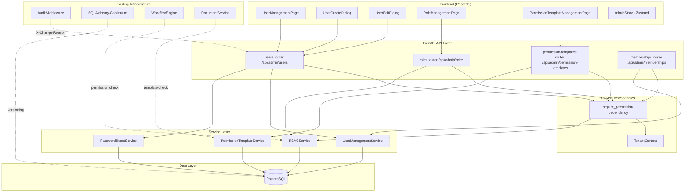
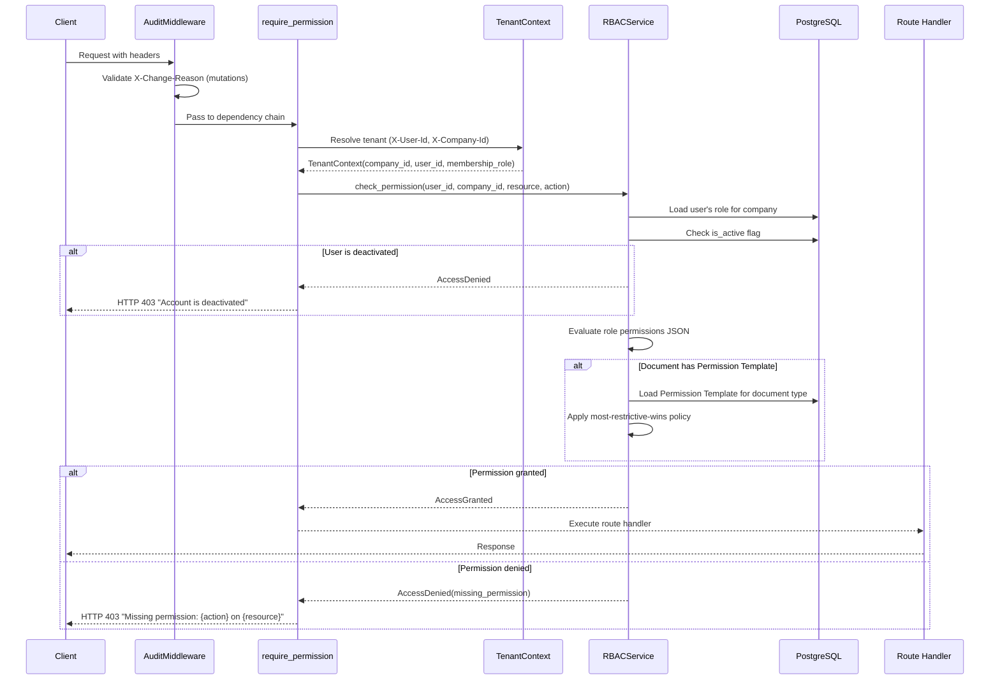
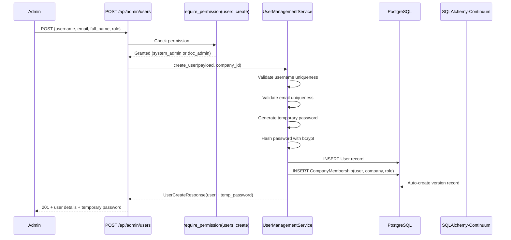

# Design Document: Admin Dashboard — User Management (Phase 6.1)

## Overview

This design implements Phase 6.1 — Admin Dashboard User Management for AlcoaBase. The feature extends the existing role system beyond the simple "admin"/"member"/"viewer" model to introduce granular Role-Based Access Control (RBAC) with five specialized roles (system_admin, doc_admin, it_admin, member, viewer), a permission model based on resource-action pairs, permission templates for document types, and a comprehensive user management UI for administrators.

The feature integrates with existing infrastructure:
- **TenantContext** dependency for multi-tenancy via `X-Company-Id` header
- **AuditMiddleware** for `X-Change-Reason` enforcement on mutations
- **SQLAlchemy-Continuum** for automatic versioning of mutable records
- **Existing User/Company/CompanyMembership** models (extended, not replaced)
- **Workflow Execution** (3.2) for permission-gated transitions
- **Document Access** for template-based permission enforcement

### Design Decisions

1. **Extend existing Role model**: The current `Role` model already has a JSON `permissions` field. We extend it with `company_id` scoping and `is_system` flag rather than creating a new table.
2. **Permission evaluation as FastAPI dependency**: A new `require_permission` dependency factory integrates with the existing `TenantContext` pattern, executing before route handlers.
3. **Permission Templates as separate model**: Templates define document-type-specific overrides that layer on top of base role permissions using a "most restrictive wins" policy.
4. **Soft operations only**: User deactivation sets `is_active=false`; membership revocation sets `revoked_at`. No hard deletes for GxP compliance.
5. **Existing CompanyMembership extended**: Add `role` field migration from the simple string to reference the new role system, maintaining backward compatibility.
6. **Admin-initiated password reset**: Generates a temporary password returned in the API response (no email service required for air-gapped deployments).
7. **AuditMixin on mutable models**: All new mutable models use `AuditMixin` for SQLAlchemy-Continuum versioning.

## Architecture

### High-Level Component Diagram



### Permission Evaluation Flow



### User Creation Flow



## Components and Interfaces

### Backend Components

#### 1. API Router: `api/admin_users.py`

Single router file for user management. Prefix: `/admin/users`.

| Method | Path | Description | Auth Required | Returns |
|--------|------|-------------|---------------|---------|
| GET | `/admin/users` | List users (paginated, searchable, sortable) | `users:read` | 200 + paginated users |
| POST | `/admin/users` | Create new user | `users:create` | 201 + user + temp password |
| GET | `/admin/users/{user_id}` | Get user detail with memberships | `users:read` | 200 + user detail |
| PATCH | `/admin/users/{user_id}` | Update user profile/role | `users:update` | 200 + updated user |
| POST | `/admin/users/{user_id}/deactivate` | Deactivate user | `users:update` | 200 + user |
| POST | `/admin/users/{user_id}/reactivate` | Reactivate user | `users:update` | 200 + user |
| POST | `/admin/users/{user_id}/reset-password` | Reset user password | `users:update` | 200 + temp password |
| GET | `/admin/users/{user_id}/history` | Get user change history | `audit_logs:read` | 200 + history |

#### 2. API Router: `api/admin_roles.py`

Router for role management. Prefix: `/admin/roles`.

| Method | Path | Description | Auth Required | Returns |
|--------|------|-------------|---------------|---------|
| GET | `/admin/roles` | List all roles with user counts | `users:read` | 200 + roles |
| GET | `/admin/roles/{role_id}` | Get role detail with permission matrix | `users:read` | 200 + role detail |

#### 3. API Router: `api/admin_permission_templates.py`

Router for permission template management. Prefix: `/admin/permission-templates`.

| Method | Path | Description | Auth Required | Returns |
|--------|------|-------------|---------------|---------|
| GET | `/admin/permission-templates` | List templates | `templates:read` | 200 + templates |
| POST | `/admin/permission-templates` | Create template | `templates:create` | 201 + template |
| GET | `/admin/permission-templates/{template_id}` | Get template detail | `templates:read` | 200 + template |
| PATCH | `/admin/permission-templates/{template_id}` | Update template | `templates:update` | 200 + template |
| DELETE | `/admin/permission-templates/{template_id}` | Delete template (if no active docs) | `templates:delete` | 204 |

#### 4. API Router: `api/admin_memberships.py`

Router for company membership management. Prefix: `/admin/memberships`.

| Method | Path | Description | Auth Required | Returns |
|--------|------|-------------|---------------|---------|
| GET | `/admin/memberships/user/{user_id}` | List all memberships for a user | `users:read` | 200 + memberships |
| POST | `/admin/memberships` | Assign user to company | `users:create` | 201 + membership |
| DELETE | `/admin/memberships/{membership_id}` | Revoke membership (soft) | `users:delete` | 200 + membership |

All mutation endpoints require `X-Change-Reason` header. All endpoints require `X-Company-Id` and `Authorization: Bearer`.

#### 5. Service Layer

| Service | File | Responsibility |
|---------|------|----------------|
| `UserManagementService` | `services/user_management.py` | User CRUD, uniqueness validation, membership management, audit trail |
| `RBACService` | `services/rbac.py` | Permission evaluation, role lookup, template-aware access checks |
| `PasswordResetService` | `services/password_reset.py` | Temporary password generation, bcrypt hashing, token invalidation |
| `PermissionTemplateService` | `services/permission_template.py` | Template CRUD, deletion guard, default template seeding |

#### 6. Dependency: `dependencies/rbac.py`

```python
def require_permission(resource: str, action: str) -> Callable:
    """Factory that returns a FastAPI dependency enforcing RBAC.

    Usage in route handlers:
        @router.get("/admin/users", dependencies=[Depends(require_permission("users", "read"))])

    The dependency:
    1. Resolves TenantContext (user_id, company_id)
    2. Checks user is_active flag
    3. Loads user's role for the company
    4. Evaluates role permissions JSON for resource:action
    5. Raises HTTP 403 if denied
    """
```

### Frontend Components

| Component | Path | Description |
|-----------|------|-------------|
| `UserManagementPage` | `pages/UserManagementPage.tsx` | Main page with user table, search, sort, pagination |
| `UserCreateDialog` | `components/admin/UserCreateDialog.tsx` | Dialog form for creating new users |
| `UserEditDialog` | `components/admin/UserEditDialog.tsx` | Dialog form for editing user profile and role |
| `UserDetailPanel` | `components/admin/UserDetailPanel.tsx` | Side panel showing user details, memberships, history |
| `RoleManagementPage` | `pages/RoleManagementPage.tsx` | Role list with permission matrix view |
| `PermissionMatrixView` | `components/admin/PermissionMatrixView.tsx` | Grid showing resource×action permissions for a role |
| `PermissionTemplateManagementPage` | `pages/PermissionTemplateManagementPage.tsx` | Template list with CRUD operations |
| `PermissionTemplateDialog` | `components/admin/PermissionTemplateDialog.tsx` | Dialog for creating/editing templates |
| `UserHistoryTimeline` | `components/admin/UserHistoryTimeline.tsx` | Timeline view of user change history |

#### Zustand Store: `stores/adminStore.ts`

```typescript
interface AdminState {
  // User management
  users: UserListItem[];
  totalUsers: number;
  currentUser: UserDetail | null;
  userHistory: UserHistoryEntry[];

  // Roles
  roles: RoleWithCount[];
  currentRole: RoleDetail | null;

  // Permission templates
  permissionTemplates: PermissionTemplate[];
  currentTemplate: PermissionTemplateDetail | null;

  // UI state
  isLoading: boolean;
  error: string | null;
  searchQuery: string;
  sortField: string;
  sortDirection: 'asc' | 'desc';
  page: number;
  pageSize: number;

  // Actions
  fetchUsers: (params: UserListParams) => Promise<void>;
  createUser: (payload: CreateUserPayload, reason: string) => Promise<CreateUserResponse>;
  updateUser: (userId: number, payload: UpdateUserPayload, reason: string) => Promise<void>;
  deactivateUser: (userId: number, reason: string) => Promise<void>;
  reactivateUser: (userId: number, reason: string) => Promise<void>;
  resetPassword: (userId: number, reason: string) => Promise<string>;
  fetchUserDetail: (userId: number) => Promise<void>;
  fetchUserHistory: (userId: number) => Promise<void>;

  fetchRoles: () => Promise<void>;
  fetchRoleDetail: (roleId: number) => Promise<void>;

  fetchPermissionTemplates: () => Promise<void>;
  createPermissionTemplate: (payload: CreateTemplatePayload, reason: string) => Promise<void>;
  updatePermissionTemplate: (id: number, payload: UpdateTemplatePayload, reason: string) => Promise<void>;
  deletePermissionTemplate: (id: number, reason: string) => Promise<void>;

  assignMembership: (payload: AssignMembershipPayload, reason: string) => Promise<void>;
  revokeMembership: (membershipId: number, reason: string) => Promise<void>;
}
```

## Data Models

### Database Schema Changes

#### Extended Role Model (modify existing `models/user.py`)

The existing `Role` model is extended with company scoping and system flag:

```python
class Role(Base, AuditMixin):
    """Role model for RBAC permission grouping.

    Extended for Phase 6.1 with company scoping and system role flag.
    The permissions field stores a structured JSON object:
    {
        "documents": ["create", "read", "update", "delete", "approve"],
        "workflows": ["read", "approve"],
        ...
    }

    Attributes:
        id: Primary key.
        name: Role name (unique within a company scope).
        description: Human-readable description.
        permissions: JSON object mapping resource types to allowed actions.
        company_id: FK to company (NULL for global system roles).
        is_system: Whether this is a system-defined non-editable role.
        created_at: Server-side UTC timestamp.
    """
    __tablename__ = "roles"
    __table_args__ = (
        UniqueConstraint("name", "company_id", name="uq_roles_name_company"),
        Index("ix_roles_company_id", "company_id"),
    )

    id: Mapped[int] = mapped_column(primary_key=True)
    name: Mapped[str] = mapped_column(String(100), index=True)
    description: Mapped[str | None] = mapped_column(String(500), nullable=True)
    permissions: Mapped[dict] = mapped_column(JSON, default=dict)
    company_id: Mapped[int | None] = mapped_column(
        ForeignKey("companies.id"), nullable=True
    )
    is_system: Mapped[bool] = mapped_column(default=False)
    created_at: Mapped[datetime] = mapped_column(
        DateTime(timezone=True), server_default=func.now()
    )

    users: Mapped[list["User"]] = relationship(
        secondary=UserRole, back_populates="roles"
    )
    company: Mapped["Company | None"] = relationship()
```

#### PermissionTemplate Model (new: `models/permission_template.py`)

```python
class PermissionTemplate(Base, AuditMixin):
    """Reusable permission template for document types.

    Defines role-action mappings that override or restrict base role
    permissions for documents of a specific type. Uses "most restrictive
    wins" policy when evaluating access.

    The role_permissions field stores:
    {
        "system_admin": ["read", "write", "approve"],
        "doc_admin": ["read", "write", "approve"],
        "member": ["read"],
        "viewer": ["read"]
    }

    Attributes:
        id: Primary key.
        name: Template name (unique within company).
        description: Human-readable description.
        document_type: The document type this template governs.
        role_permissions: JSON mapping role names to permitted actions.
        company_id: FK to company.
        is_default: Whether this is a system-seeded default template.
        created_by: FK to user who created the template.
        created_at: Server-side UTC timestamp.
    """
    __tablename__ = "permission_templates"
    __table_args__ = (
        UniqueConstraint(
            "name", "company_id",
            name="uq_permission_templates_name_company"
        ),
        Index("ix_permission_templates_company_doctype", "company_id", "document_type"),
    )

    id: Mapped[int] = mapped_column(primary_key=True)
    name: Mapped[str] = mapped_column(String(200))
    description: Mapped[str | None] = mapped_column(Text, nullable=True)
    document_type: Mapped[str] = mapped_column(String(100))
    role_permissions: Mapped[dict] = mapped_column(JSON, default=dict)
    company_id: Mapped[int] = mapped_column(ForeignKey("companies.id"), index=True)
    is_default: Mapped[bool] = mapped_column(default=False)
    created_by: Mapped[int] = mapped_column(ForeignKey("users.id"))
    created_at: Mapped[datetime] = mapped_column(
        DateTime(timezone=True), server_default=func.now()
    )

    company: Mapped["Company"] = relationship()
    creator: Mapped["User"] = relationship()
```

#### Extended CompanyMembership (modify existing `models/company.py`)

The existing `CompanyMembership` model is extended with a foreign key to the new role system:

```python
class CompanyMembership(Base, AuditMixin):
    """Association between a user and a company with a designated role.

    Extended for Phase 6.1: role field now references the Role table
    via role_id FK, while keeping the legacy string role field for
    backward compatibility during migration.

    Attributes:
        id: Primary key.
        user_id: FK to user.
        company_id: FK to company.
        role: Legacy string role (kept for migration compatibility).
        role_id: FK to roles table (new RBAC system).
        created_at: Server-side UTC timestamp.
        revoked_at: Timestamp when membership was revoked (null if active).
    """
    __tablename__ = "company_memberships"
    __table_args__ = (
        UniqueConstraint(
            "user_id", "company_id",
            name="uq_company_memberships_user_company"
        ),
        Index("ix_company_memberships_company_role", "company_id", "role_id"),
    )

    id: Mapped[int] = mapped_column(primary_key=True)
    user_id: Mapped[int] = mapped_column(ForeignKey("users.id"), index=True)
    company_id: Mapped[int] = mapped_column(ForeignKey("companies.id"), index=True)
    role: Mapped[str] = mapped_column(String(50))  # Legacy field
    role_id: Mapped[int | None] = mapped_column(
        ForeignKey("roles.id"), nullable=True
    )  # New RBAC FK (nullable during migration)
    created_at: Mapped[datetime] = mapped_column(
        DateTime(timezone=True), server_default=func.now()
    )
    revoked_at: Mapped[datetime | None] = mapped_column(
        DateTime(timezone=True), nullable=True
    )

    user: Mapped["User"] = relationship()
    company: Mapped["Company"] = relationship(back_populates="memberships")
    role_ref: Mapped["Role | None"] = relationship()
```

#### Default Role Permission Definitions

```python
# services/rbac.py — DEFAULT_ROLE_PERMISSIONS constant

RESOURCE_TYPES = [
    "documents", "workflows", "users", "audit_logs",
    "templates", "training", "signatures", "system_config"
]

ACTIONS = ["create", "read", "update", "delete", "approve"]

DEFAULT_ROLE_PERMISSIONS: dict[str, dict[str, list[str]]] = {
    "system_admin": {
        resource: ACTIONS for resource in RESOURCE_TYPES
    },
    "doc_admin": {
        "documents": ["create", "read", "update", "approve"],
        "workflows": ["create", "read", "update", "approve"],
        "templates": ["create", "read", "update", "approve"],
        "training": ["create", "read", "update", "approve"],
        "audit_logs": ["read"],
        "signatures": ["create", "read", "approve"],
    },
    "it_admin": {
        "system_config": ["read", "update"],
        "audit_logs": ["read"],
        "users": ["read"],
    },
    "member": {
        "documents": ["create", "read", "update"],
        "training": ["create", "read", "update"],
        "workflows": ["read"],
        "templates": ["read"],
    },
    "viewer": {
        "documents": ["read"],
        "workflows": ["read"],
        "templates": ["read"],
        "training": ["read"],
    },
}
```

### Pydantic Schemas

#### User Management Schemas (`schemas/admin_users.py`)

```python
from datetime import datetime
from typing import Literal

from pydantic import BaseModel, EmailStr, Field


# --- Request Schemas ---

class UserCreateRequest(BaseModel):
    """Request body for POST /api/admin/users."""
    username: str = Field(min_length=3, max_length=100, pattern=r"^[a-zA-Z0-9_.-]+$")
    email: EmailStr
    full_name: str = Field(min_length=1, max_length=200)
    role: Literal["system_admin", "doc_admin", "it_admin", "member", "viewer"]


class UserUpdateRequest(BaseModel):
    """Request body for PATCH /api/admin/users/{user_id}."""
    full_name: str | None = Field(default=None, min_length=1, max_length=200)
    email: EmailStr | None = None
    role: Literal["system_admin", "doc_admin", "it_admin", "member", "viewer"] | None = None


class UserListParams(BaseModel):
    """Query parameters for GET /api/admin/users."""
    search: str | None = Field(default=None, max_length=200)
    sort_by: Literal["full_name", "username", "role", "is_active", "created_at"] = "created_at"
    sort_dir: Literal["asc", "desc"] = "desc"
    page: int = Field(default=1, ge=1)
    page_size: int = Field(default=20, ge=1, le=100)
    is_active: bool | None = None


# --- Response Schemas ---

class UserListItem(BaseModel):
    """Single user in the paginated list response."""
    id: int
    username: str
    email: str
    full_name: str
    role: str
    is_active: bool
    created_at: datetime

    model_config = {"from_attributes": True}


class UserListResponse(BaseModel):
    """Paginated response for GET /api/admin/users."""
    users: list[UserListItem]
    total: int
    page: int
    page_size: int
    total_pages: int


class UserCreateResponse(BaseModel):
    """Response for POST /api/admin/users (includes temp password)."""
    id: int
    username: str
    email: str
    full_name: str
    role: str
    is_active: bool
    created_at: datetime
    temporary_password: str  # Returned only on creation

    model_config = {"from_attributes": True}


class MembershipInfo(BaseModel):
    """Membership info nested in user detail."""
    id: int
    company_id: int
    company_name: str
    role: str
    created_at: datetime
    revoked_at: datetime | None = None

    model_config = {"from_attributes": True}


class UserDetailResponse(BaseModel):
    """Detailed user response with memberships."""
    id: int
    username: str
    email: str
    full_name: str
    is_active: bool
    created_at: datetime
    memberships: list[MembershipInfo]

    model_config = {"from_attributes": True}


class PasswordResetResponse(BaseModel):
    """Response for POST /api/admin/users/{user_id}/reset-password."""
    user_id: int
    temporary_password: str
    message: str = "Password reset successful. Communicate the temporary password securely."


class UserHistoryEntry(BaseModel):
    """Single entry in user change history."""
    version_id: int
    changed_at: datetime
    changed_by: int
    changed_by_username: str
    change_reason: str
    changes: dict  # {field_name: {old: value, new: value}}

    model_config = {"from_attributes": True}


class UserHistoryResponse(BaseModel):
    """Response for GET /api/admin/users/{user_id}/history."""
    user_id: int
    entries: list[UserHistoryEntry]
```

#### Role Schemas (`schemas/admin_roles.py`)

```python
class PermissionEntry(BaseModel):
    """Single resource-actions entry in a permission matrix."""
    resource: str
    actions: list[Literal["create", "read", "update", "delete", "approve"]]


class RoleWithCount(BaseModel):
    """Role summary with user count for list view."""
    id: int
    name: str
    description: str | None
    is_system: bool
    user_count: int

    model_config = {"from_attributes": True}


class RoleListResponse(BaseModel):
    """Response for GET /api/admin/roles."""
    roles: list[RoleWithCount]


class RoleDetailResponse(BaseModel):
    """Detailed role response with full permission matrix."""
    id: int
    name: str
    description: str | None
    is_system: bool
    permissions: dict[str, list[str]]  # resource -> actions
    user_count: int

    model_config = {"from_attributes": True}
```

#### Permission Template Schemas (`schemas/admin_permission_templates.py`)

```python
class RoleActionMapping(BaseModel):
    """Mapping of a role to its permitted actions on the template's document type."""
    role: Literal["system_admin", "doc_admin", "it_admin", "member", "viewer"]
    actions: list[Literal["read", "write", "approve"]]


class PermissionTemplateCreateRequest(BaseModel):
    """Request body for POST /api/admin/permission-templates."""
    name: str = Field(min_length=1, max_length=200)
    description: str | None = Field(default=None, max_length=1000)
    document_type: str = Field(min_length=1, max_length=100)
    role_permissions: list[RoleActionMapping] = Field(min_length=1)


class PermissionTemplateUpdateRequest(BaseModel):
    """Request body for PATCH /api/admin/permission-templates/{template_id}."""
    name: str | None = Field(default=None, min_length=1, max_length=200)
    description: str | None = Field(default=None, max_length=1000)
    role_permissions: list[RoleActionMapping] | None = None


class PermissionTemplateResponse(BaseModel):
    """Response for permission template endpoints."""
    id: int
    name: str
    description: str | None
    document_type: str
    role_permissions: dict[str, list[str]]  # role -> actions
    is_default: bool
    created_by: int
    created_at: datetime
    active_document_count: int  # Number of documents using this template

    model_config = {"from_attributes": True}


class PermissionTemplateListResponse(BaseModel):
    """Response for GET /api/admin/permission-templates."""
    templates: list[PermissionTemplateResponse]
```

#### Membership Schemas (`schemas/admin_memberships.py`)

```python
class AssignMembershipRequest(BaseModel):
    """Request body for POST /api/admin/memberships."""
    user_id: int
    company_id: int
    role: Literal["system_admin", "doc_admin", "it_admin", "member", "viewer"]


class MembershipDetailResponse(BaseModel):
    """Response for membership endpoints."""
    id: int
    user_id: int
    user_username: str
    user_full_name: str
    company_id: int
    company_name: str
    role: str
    created_at: datetime
    revoked_at: datetime | None = None

    model_config = {"from_attributes": True}
```

## Correctness Properties

*A property is a characteristic or behavior that should hold true across all valid executions of a system — essentially, a formal statement about what the system should do. Properties serve as the bridge between human-readable specifications and machine-verifiable correctness guarantees.*

### Property 1: Permission evaluation correctness

*For any* role name in the set {system_admin, doc_admin, it_admin, member, viewer}, and *for any* (resource, action) pair, the RBAC engine SHALL grant access if and only if the role's permission definition explicitly includes that action for that resource.

**Validates: Requirements 2.1, 2.4, 3.1, 3.2, 3.3, 3.4, 3.5**

### Property 2: Company role provisioning

*For any* newly created company, the system SHALL provision exactly five roles (system_admin, doc_admin, it_admin, member, viewer) with permission sets matching the predefined defaults.

**Validates: Requirements 1.2**

### Property 3: Role permission structure validity

*For any* role stored in the system, the permissions field SHALL be a valid JSON object where keys are valid resource types and values are arrays of valid action strings.

**Validates: Requirements 1.3, 1.4**

### Property 4: Company-scoped permission evaluation

*For any* user with memberships in multiple companies, permission evaluation using a given X-Company-Id SHALL use only the role assigned in that specific company's membership, ignoring roles from other companies.

**Validates: Requirements 2.5**

### Property 5: Permission template storage round-trip

*For any* valid permission template creation payload (name, description, document_type, role_permissions), creating and then retrieving the template SHALL return an equivalent object with all fields preserved.

**Validates: Requirements 4.1, 4.2**

### Property 6: Template deletion guard

*For any* permission template that has one or more active documents associated with it, attempting to delete the template SHALL fail with an appropriate error, and the template SHALL remain unchanged.

**Validates: Requirements 4.4**

### Property 7: User list pagination correctness

*For any* company with N users and *for any* valid (page, page_size) parameters, the paginated response SHALL return at most page_size users, the total SHALL equal N, and the union of all pages SHALL equal the complete user set.

**Validates: Requirements 5.1**

### Property 8: User search filter correctness

*For any* search query string Q and *for any* user in the company, the user SHALL appear in filtered results if and only if Q is a case-insensitive substring of the user's username, email, or full_name.

**Validates: Requirements 5.3**

### Property 9: User list sorting correctness

*For any* sort field and direction, the returned user list SHALL be ordered according to that field's natural ordering in the specified direction.

**Validates: Requirements 5.4**

### Property 10: Username and email uniqueness enforcement

*For any* username or email that already exists in the system, attempting to create a new user or update an existing user to use that username/email SHALL be rejected with a conflict error.

**Validates: Requirements 6.2, 6.3, 7.3**

### Property 11: Password hashing invariant

*For any* password stored in the system (whether from creation or reset), the stored value SHALL be a valid bcrypt hash, and the original plaintext SHALL NOT appear anywhere in the database.

**Validates: Requirements 6.5, 9.2**

### Property 12: Audit trail completeness

*For any* user management mutation (create, update, deactivate, reactivate, password reset, role change, membership change), an audit record SHALL be created containing the acting user ID, timestamp, and the X-Change-Reason value.

**Validates: Requirements 6.7, 7.5, 8.5, 9.4, 11.5, 14.2**

### Property 13: Deactivated user access denial

*For any* user whose is_active flag is false, and *for any* (resource, action) pair regardless of assigned role, the RBAC engine SHALL deny access.

**Validates: Requirements 8.1, 8.2**

### Property 14: Activation/deactivation round-trip

*For any* active user, deactivating and then reactivating SHALL restore is_active to true and the user's role permissions SHALL function identically to before deactivation.

**Validates: Requirements 8.4**

### Property 15: Token invalidation on password reset

*For any* user with N existing refresh tokens (N ≥ 0), after a password reset, all N tokens SHALL be invalidated (marked as revoked or deleted).

**Validates: Requirements 9.5**

### Property 16: Role change immediate effect

*For any* user whose role is changed from role_A to role_B, all subsequent permission evaluations SHALL use role_B's permissions, with no stale cache of role_A.

**Validates: Requirements 7.4**

### Property 17: Membership uniqueness

*For any* (user_id, company_id) pair that already has an active membership, attempting to create a duplicate membership SHALL be rejected with a conflict error.

**Validates: Requirements 11.2**

### Property 18: Membership soft-delete

*For any* revoked membership, the database record SHALL still exist with a non-null revoked_at timestamp, and the record SHALL be retrievable in membership history queries.

**Validates: Requirements 11.3**

### Property 19: RBAC enforcement on workflow actions

*For any* user attempting a workflow approval transition, access SHALL be granted if and only if the user's role includes the "approve" action on the "workflows" resource. Denied access SHALL return HTTP 403 with a message identifying the missing permission.

**Validates: Requirements 12.1, 12.2, 12.3**

### Property 20: Template-based permission restriction (most restrictive wins)

*For any* document governed by a permission template, and *for any* user, access SHALL be granted only if BOTH the user's base role permissions AND the template's role-action mapping grant the requested action. If either denies, access is denied.

**Validates: Requirements 13.1, 13.2, 13.3**

## Error Handling

### HTTP Error Responses

| Scenario | Status | Detail Message |
|----------|--------|----------------|
| Missing X-Change-Reason on mutation | 400 | "X-Change-Reason header is required for mutating requests to GxP-relevant endpoints." |
| Missing/invalid auth token | 401 | "Authentication required." |
| Permission denied | 403 | "Missing permission: {action} on {resource}" |
| Deactivated account access | 403 | "Account is deactivated. Contact your administrator." |
| User not found | 404 | "User not found." |
| Role not found | 404 | "Role not found." |
| Permission template not found | 404 | "Permission template not found." |
| Duplicate username | 409 | "Username '{username}' is already taken." |
| Duplicate email | 409 | "Email '{email}' is already registered." |
| Duplicate membership | 409 | "User is already a member of this company." |
| Template has active documents | 409 | "Cannot delete template: {count} active documents are using it." |
| Self-deactivation attempt | 422 | "Cannot deactivate your own account." |
| Invalid role for operation | 422 | "Invalid role: {role}" |

### Error Response Schema

```python
class ErrorResponse(BaseModel):
    """Standard error response body."""
    detail: str
    error_code: str | None = None  # Machine-readable error code
    field: str | None = None  # Field that caused the error (for validation)
```

### Service-Level Error Handling

- **UserManagementService**: Catches `IntegrityError` from SQLAlchemy for uniqueness violations, translates to appropriate HTTP 409 responses.
- **RBACService**: Returns structured `AccessDenied` result with the specific missing permission, never raises exceptions for denied access (uses result types).
- **PasswordResetService**: Wraps bcrypt operations in try/except for encoding errors; logs failures without exposing internal details.
- **PermissionTemplateService**: Performs pre-deletion check query for active documents before attempting delete.

## Testing Strategy

### Property-Based Testing (Hypothesis)

Property-based testing is highly applicable to this feature because the RBAC engine is a pure function of (role, resource, action) → allow/deny, and the user management operations have clear invariants around uniqueness, hashing, and audit completeness.

**Library**: Hypothesis (Python backend), fast-check (TypeScript frontend)
**Minimum iterations**: 100 per property test
**Test location**: `src/backend/tests/properties/test_rbac_properties.py`

Each property test is tagged with:
```python
# Feature: Step_6-1_admin-dashboard-user-management, Property {N}: {property_text}
```

**Key property tests to implement:**

1. **Permission evaluation correctness** — Generate random (role, resource, action) tuples, verify evaluation matches the predefined permission matrix.
2. **Company-scoped evaluation** — Generate users with multiple company memberships, verify isolation.
3. **Deactivated user denial** — Generate deactivated users with any role, verify all access denied.
4. **Username/email uniqueness** — Generate random creation attempts with duplicate fields, verify rejection.
5. **Password hashing invariant** — Generate random passwords, verify stored values are valid bcrypt hashes.
6. **Pagination correctness** — Generate user lists of varying sizes, verify pagination math.
7. **Search filter correctness** — Generate users and search queries, verify inclusion/exclusion.
8. **Sorting correctness** — Generate user lists, verify ordering.
9. **Template restriction (most restrictive wins)** — Generate role+template combinations, verify intersection logic.
10. **Membership soft-delete** — Generate and revoke memberships, verify records persist.

### Unit Tests (pytest)

**Test location**: `src/backend/tests/unit/test_admin_*.py`

- Specific examples for each API endpoint (happy path + error cases)
- Edge cases: self-deactivation prevention, template deletion with active docs
- Integration with AuditMiddleware (X-Change-Reason enforcement)
- Password reset token invalidation

### Integration Tests

**Test location**: `src/backend/tests/integration/test_admin_integration.py`

- Full request lifecycle: create user → assign role → verify access → deactivate → verify denial
- SQLAlchemy-Continuum version record creation
- Multi-company permission isolation end-to-end
- Permission template enforcement on document access

### Frontend Tests (Vitest + fast-check)

**Test location**: `src/frontend/src/__tests__/admin/`

- Component rendering tests for UserManagementPage, RoleManagementPage
- Store action tests (mock API responses)
- fast-check property tests for permission matrix display logic
- Form validation tests for UserCreateDialog, UserEditDialog

### Test Data Generators (Hypothesis Strategies)

```python
from hypothesis import strategies as st

# Strategy for generating valid role names
role_names = st.sampled_from(["system_admin", "doc_admin", "it_admin", "member", "viewer"])

# Strategy for generating valid resource types
resource_types = st.sampled_from([
    "documents", "workflows", "users", "audit_logs",
    "templates", "training", "signatures", "system_config"
])

# Strategy for generating valid actions
actions = st.sampled_from(["create", "read", "update", "delete", "approve"])

# Strategy for generating valid usernames
usernames = st.from_regex(r"[a-zA-Z][a-zA-Z0-9_.]{2,99}", fullmatch=True)

# Strategy for generating valid emails
emails = st.emails()

# Strategy for generating permission template role mappings
template_role_permissions = st.dictionaries(
    keys=role_names,
    values=st.lists(st.sampled_from(["read", "write", "approve"]), min_size=1, unique=True),
    min_size=1,
)
```

## Integration Points

### Integration with Workflow Execution (3.2)

The existing `WorkflowEngine` service (`services/workflow_engine.py`) currently does not enforce permission checks on transitions. Phase 6.1 adds:

1. **Before transition hook**: The workflow execution endpoint adds `Depends(require_permission("workflows", "approve"))` for approval transitions and `Depends(require_permission("documents", "update"))` for edit transitions.
2. **Error propagation**: When RBAC denies access, the workflow endpoint returns HTTP 403 with the specific missing permission, allowing the frontend to display an actionable error message.
3. **No workflow engine modification**: Permission checks happen at the API layer (dependency injection), not inside the SpiffWorkflow engine itself.

### Integration with Document Access

The existing `DocumentService` (`services/document_service.py`) is extended:

1. **Template-aware access check**: When a document has a `permission_template_id`, the `RBACService.check_document_access()` method evaluates both base role permissions AND the template's role-action mapping.
2. **Search/listing filter**: Document list queries add a WHERE clause that excludes documents where the user's role lacks "read" in the applicable permission template.
3. **Most restrictive wins**: Access is granted only if BOTH the base role AND the template grant the action.

### Integration with AuditMiddleware and SQLAlchemy-Continuum

1. **AuditMiddleware**: All admin endpoints are under `/api/admin/*` which is NOT in the exempt paths list, so `X-Change-Reason` is enforced automatically on all mutations.
2. **SQLAlchemy-Continuum**: The `AuditMixin` on `CompanyMembership`, `Role`, and `PermissionTemplate` models enables automatic version tracking. The `User` model already has Continuum support.
3. **Change history endpoint**: The `/api/admin/users/{user_id}/history` endpoint queries Continuum's version tables to reconstruct the full change history with diffs.

### Integration with TenantContext

The existing `get_tenant_context` dependency is used as-is. The new `require_permission` dependency chains on top of it:

```python
async def _check_permission(
    resource: str,
    action: str,
    tenant: TenantContext = Depends(get_tenant_context),
    session: AsyncSession = Depends(get_db_session),
) -> TenantContext:
    """Chain dependency: resolves tenant, then checks permission."""
    # 1. Load user from DB to check is_active
    # 2. Load role for company from membership
    # 3. Evaluate permissions
    # 4. Return tenant context (or raise 403)
    ...
```

This ensures all admin endpoints have both tenant resolution AND permission checking in a single dependency chain.

### Migration Strategy

1. **Alembic migration**: Add `role_id` column to `company_memberships`, create `permission_templates` table, add `is_system` and `company_id` to `roles`.
2. **Data migration**: Seed the five default roles per existing company. Map existing `role` string values ("admin" → system_admin, "member" → member, "viewer" → viewer) to `role_id` FK.
3. **Backward compatibility**: Keep the legacy `role` string field populated during transition. New code reads from `role_id`; old code can still read the string field.
4. **Default permission templates**: Seed "Internal SOP" and "External Supplier File" templates for each company.
