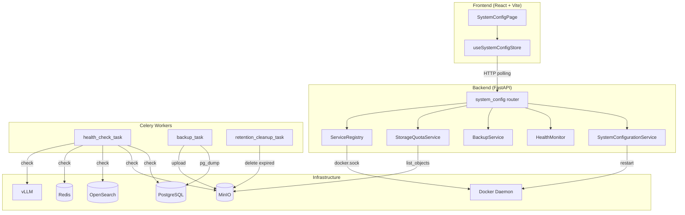
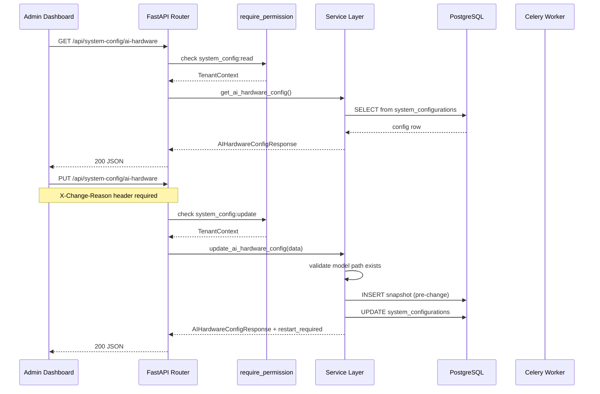
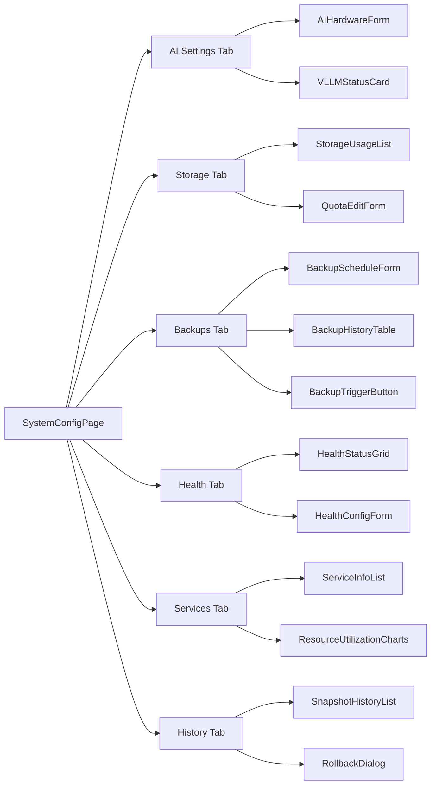

# Design Document: Admin Dashboard — System Configuration

## Overview

This design specifies the architecture for Phase 6.2 of AlcoaBase: a centralized system configuration interface for administrators. The feature enables system_admin and it_admin roles to manage AI hardware settings, storage quotas, backup schedules, health monitoring, and service status — all within the air-gapped deployment model.

The system follows AlcoaBase's layered architecture (API routes → Services → Models/DB) with thin route handlers delegating to service classes. All mutations are audited via SQLAlchemy-Continuum and require X-Change-Reason headers. Configuration is persisted in PostgreSQL (not .env files) to enable rollback, audit trails, and multi-instance consistency. The .env file remains the source of truth for initial bootstrap values; the database overrides take precedence at runtime.

### Key Technical Decisions

| Decision | Choice | Rationale |
|----------|--------|-----------|
| Configuration persistence | PostgreSQL (primary) + .env (bootstrap defaults) | Enables rollback, audit trail, and multi-instance consistency. DB values override .env at runtime. |
| Docker communication | Docker SDK for Python (`docker` package) | Type-safe, well-maintained, avoids subprocess shell injection risks. Backend container mounts `/var/run/docker.sock`. |
| Health check execution | Celery Beat periodic task | Decouples monitoring from request handling. Runs in worker process, stores results in DB. |
| MinIO storage usage | S3 `list_objects_v2` with prefix aggregation per company | Uses existing aioboto3 client. Aggregates object sizes per company prefix. Cached for 60s. |
| Backup strategy | `pg_dump` → compressed file → upload to MinIO `backups/` prefix | Leverages existing MinIO infrastructure. Isolated from document storage. Retention managed by Celery task. |
| Frontend health data | Polling at configurable interval (default 30s) | Simpler than WebSocket for read-only status. Matches health check interval. No persistent connection overhead. |

## Architecture



### Request Flow



## Components and Interfaces

### Backend Services

#### 1. SystemConfigurationService (`services/system_config.py`)

Central service for reading and writing configuration. Manages snapshots and rollback.

```python
class SystemConfigurationService:
    async def get_config(self, category: str, session: AsyncSession) -> dict
    async def update_config(self, category: str, data: dict, user_id: int, reason: str, session: AsyncSession) -> ConfigUpdateResult
    async def create_snapshot(self, session: AsyncSession) -> ConfigurationSnapshot
    async def rollback_to_snapshot(self, snapshot_id: int, user_id: int, reason: str, session: AsyncSession) -> RollbackResult
    async def get_snapshot_history(self, page: int, page_size: int, session: AsyncSession) -> PaginatedSnapshots
    async def get_snapshot_diff(self, snapshot_id: int, session: AsyncSession) -> list[ConfigDiff]
    async def restart_vllm_service(self, user_id: int, reason: str) -> ServiceRestartResult
```

#### 2. HealthMonitor (`services/health_monitor.py`)

Performs periodic health checks and stores results. Runs as a Celery Beat task.

```python
class HealthMonitor:
    MONITORED_SERVICES = ["postgresql", "minio", "opensearch", "redis", "vllm"]

    async def check_all_services(self, session: AsyncSession) -> list[HealthCheckResult]
    async def check_service(self, service_name: str) -> HealthCheckResult
    async def get_current_status(self, session: AsyncSession) -> list[ServiceHealthStatus]
    async def get_service_history(self, service_name: str, limit: int, session: AsyncSession) -> list[HealthCheckResult]
    async def get_uptime_percentage(self, service_name: str, hours: int, session: AsyncSession) -> float

    def classify_status(self, response_time_ms: float, degraded_threshold_ms: float, timeout_ms: float) -> ServiceStatus:
        """Pure function: classifies service status based on response time."""
```

#### 3. BackupService (`services/backup_service.py`)

Manages database backups via pg_dump, uploads to MinIO, and handles retention.

```python
class BackupService:
    async def trigger_backup(self, user_id: int, reason: str, session: AsyncSession) -> BackupRecord
    async def get_backup_history(self, session: AsyncSession) -> list[BackupRecord]
    async def get_backup_status(self, task_id: str) -> BackupTaskStatus
    async def is_backup_running(self, session: AsyncSession) -> bool
    def validate_cron_expression(self, expression: str) -> bool
    def cron_to_human_readable(self, expression: str) -> str
    async def update_schedule(self, cron_expr: str, session: AsyncSession) -> None
    async def update_retention(self, days: int, session: AsyncSession) -> None
    async def cleanup_expired_backups(self, session: AsyncSession) -> int
```

#### 4. StorageQuotaService (`services/storage_quota.py`)

Queries MinIO for per-company storage usage and manages quota configuration.

```python
class StorageQuotaService:
    async def get_usage_per_company(self, session: AsyncSession) -> list[CompanyStorageUsage]
    async def get_total_usage(self) -> StorageTotals
    async def set_quota(self, company_id: int, limit_bytes: int, session: AsyncSession) -> StorageQuota
    async def set_alert_threshold(self, company_id: int, threshold_pct: int, session: AsyncSession) -> StorageQuota
    def compute_quota_status(self, usage_bytes: int, quota_bytes: int | None, threshold_pct: int | None) -> QuotaStatus:
        """Pure function: computes quota status from usage, limit, and threshold."""

    @staticmethod
    def format_bytes_human_readable(size_bytes: int) -> str:
        """Pure function: converts bytes to human-readable binary units (KB, MB, GB, TB)."""
```

#### 5. ServiceRegistry (`services/service_registry.py`)

Tracks Docker Compose services, versions, and resource utilization via Docker SDK.

```python
class ServiceRegistry:
    DOCKER_SERVICES = {
        "postgresql": "alcoabase-postgres",
        "minio": "alcoabase-minio",
        "opensearch": "alcoabase-opensearch",
        "redis": "alcoabase-redis",
        "vllm": "alcoabase-vllm",
        "backend": "alcoabase-backend",
        "celery-worker": "alcoabase-celery-worker",
        "frontend": "alcoabase-frontend",
    }

    async def get_all_services(self) -> list[ServiceInfo]
    async def get_service_stats(self, container_name: str) -> ContainerStats
    async def get_resource_utilization(self) -> list[ResourceMetrics]
    async def restart_container(self, container_name: str) -> RestartResult
    async def get_container_version(self, container_name: str) -> str
```

### API Endpoints

All endpoints are prefixed with `/api/system-config`. Read endpoints require `system_config:read`, mutation endpoints require `system_config:update`.

| Method | Path | Description | Req |
|--------|------|-------------|-----|
| GET | `/ai-hardware` | Get AI hardware configuration | 2 |
| PUT | `/ai-hardware` | Update AI hardware configuration | 3 |
| POST | `/ai-hardware/restart-vllm` | Trigger vLLM container restart | 4 |
| GET | `/ai-hardware/vllm-status` | Get vLLM restart/health status | 4 |
| GET | `/storage/usage` | Get per-company storage usage | 5 |
| GET | `/storage/quotas` | Get all quota configurations | 5, 6 |
| PUT | `/storage/quotas/{company_id}` | Set quota limit and threshold | 6 |
| GET | `/backups/schedule` | Get current backup schedule | 7 |
| PUT | `/backups/schedule` | Update backup schedule (cron) | 7 |
| GET | `/backups/retention` | Get retention policy | 8 |
| PUT | `/backups/retention` | Update retention policy | 8 |
| POST | `/backups/trigger` | Trigger manual backup | 9 |
| GET | `/backups/history` | Get backup history | 9 |
| GET | `/backups/status/{task_id}` | Get backup task status | 9 |
| GET | `/health/status` | Get current health status | 10, 11 |
| GET | `/health/history/{service}` | Get health check history | 10 |
| GET | `/health/config` | Get health check configuration | 15 |
| PUT | `/health/config` | Update health check configuration | 15 |
| GET | `/services` | Get all service info + stats | 12 |
| GET | `/services/{service}/metrics` | Get resource utilization history | 13 |
| GET | `/snapshots` | Get configuration snapshot history | 14 |
| GET | `/snapshots/{id}/diff` | Get diff for a snapshot | 14 |
| POST | `/snapshots/{id}/rollback` | Rollback to a snapshot | 14 |

### Frontend Components

#### SystemConfigPage (`pages/admin/SystemConfigPage.tsx`)

Tab-based layout with five sections:



#### Zustand Store (`stores/useSystemConfigStore.ts`)

```typescript
interface SystemConfigState {
  // AI Hardware
  aiHardware: AIHardwareConfig | null;
  vllmStatus: VLLMStatus | null;

  // Storage
  storageUsage: CompanyStorageUsage[];
  storageTotals: StorageTotals | null;
  quotas: Record<number, StorageQuota>;

  // Backups
  backupSchedule: BackupSchedule | null;
  retentionPolicy: RetentionPolicy | null;
  backupHistory: BackupRecord[];
  activeBackupTaskId: string | null;

  // Health
  healthStatus: ServiceHealthStatus[];
  healthConfig: HealthCheckConfig | null;
  healthPollingInterval: number;

  // Services
  services: ServiceInfo[];
  resourceMetrics: Record<string, ResourceMetrics[]>;

  // Snapshots
  snapshots: ConfigurationSnapshot[];
  snapshotsPagination: PaginationMeta;

  // Loading states
  loading: Record<string, boolean>;
  errors: Record<string, string | null>;

  // Actions
  fetchAIHardware: () => Promise<void>;
  updateAIHardware: (data: AIHardwareUpdate, reason: string) => Promise<void>;
  restartVLLM: (reason: string) => Promise<void>;
  fetchStorageUsage: () => Promise<void>;
  updateQuota: (companyId: number, data: QuotaUpdate, reason: string) => Promise<void>;
  fetchBackupSchedule: () => Promise<void>;
  updateBackupSchedule: (cron: string, reason: string) => Promise<void>;
  triggerBackup: (reason: string) => Promise<void>;
  fetchHealthStatus: () => Promise<void>;
  updateHealthConfig: (data: HealthConfigUpdate, reason: string) => Promise<void>;
  fetchServices: () => Promise<void>;
  fetchSnapshots: (page: number) => Promise<void>;
  rollbackToSnapshot: (snapshotId: number, reason: string) => Promise<void>;
}
```

## Data Models

### SystemConfiguration (`models/system_config.py`)

Stores all configuration as category-keyed JSON rows. Versioned via SQLAlchemy-Continuum.

```python
class SystemConfiguration(Base, AuditMixin):
    """Persisted system configuration, one row per category."""
    __tablename__ = "system_configurations"

    id: Mapped[int] = mapped_column(primary_key=True)
    category: Mapped[str] = mapped_column(String(50), unique=True, index=True)
    # Categories: "ai_hardware", "backup_schedule", "backup_retention", "health_check"
    values: Mapped[dict] = mapped_column(JSON, default=dict)
    updated_at: Mapped[datetime] = mapped_column(DateTime(timezone=True), server_default=func.now(), onupdate=func.now())
    updated_by: Mapped[int | None] = mapped_column(ForeignKey("users.id"), nullable=True)
```

### ConfigurationSnapshot (`models/system_config.py`)

Full point-in-time capture of all configuration values for rollback support.

```python
class ConfigurationSnapshot(Base):
    """Immutable snapshot of all configuration values at a point in time."""
    __tablename__ = "configuration_snapshots"

    id: Mapped[int] = mapped_column(primary_key=True)
    snapshot_data: Mapped[dict] = mapped_column(JSON)
    # snapshot_data = {"ai_hardware": {...}, "backup_schedule": {...}, ...}
    created_at: Mapped[datetime] = mapped_column(DateTime(timezone=True), server_default=func.now())
    created_by: Mapped[int] = mapped_column(ForeignKey("users.id"))
    change_reason: Mapped[str] = mapped_column(String(500))
    is_rollback: Mapped[bool] = mapped_column(default=False)
    rollback_target_id: Mapped[int | None] = mapped_column(ForeignKey("configuration_snapshots.id"), nullable=True)
    changed_keys: Mapped[list] = mapped_column(JSON, default=list)
    # changed_keys = ["ai_hardware.model_chat_name", "ai_hardware.model_chat_path"]
```

### BackupRecord (`models/system_config.py`)

Tracks each backup execution (scheduled or manual).

```python
class BackupRecord(Base):
    """Record of a database backup execution."""
    __tablename__ = "backup_records"

    id: Mapped[int] = mapped_column(primary_key=True)
    task_id: Mapped[str] = mapped_column(String(255), unique=True, index=True)
    backup_type: Mapped[str] = mapped_column(String(20))  # "scheduled" | "manual"
    status: Mapped[str] = mapped_column(String(20))  # "queued" | "running" | "completed" | "failed"
    started_at: Mapped[datetime | None] = mapped_column(DateTime(timezone=True), nullable=True)
    completed_at: Mapped[datetime | None] = mapped_column(DateTime(timezone=True), nullable=True)
    file_size_bytes: Mapped[int | None] = mapped_column(nullable=True)
    storage_path: Mapped[str | None] = mapped_column(String(500), nullable=True)
    duration_seconds: Mapped[float | None] = mapped_column(nullable=True)
    error_message: Mapped[str | None] = mapped_column(nullable=True)
    triggered_by: Mapped[int | None] = mapped_column(ForeignKey("users.id"), nullable=True)
    created_at: Mapped[datetime] = mapped_column(DateTime(timezone=True), server_default=func.now())
```

### StorageQuota (`models/system_config.py`)

Per-company quota configuration.

```python
class StorageQuota(Base, AuditMixin):
    """Per-company storage quota configuration."""
    __tablename__ = "storage_quotas"

    id: Mapped[int] = mapped_column(primary_key=True)
    company_id: Mapped[int] = mapped_column(ForeignKey("companies.id"), unique=True, index=True)
    quota_limit_bytes: Mapped[int | None] = mapped_column(nullable=True)
    alert_threshold_pct: Mapped[int | None] = mapped_column(nullable=True)  # 1-99
    updated_at: Mapped[datetime] = mapped_column(DateTime(timezone=True), server_default=func.now(), onupdate=func.now())
    updated_by: Mapped[int | None] = mapped_column(ForeignKey("users.id"), nullable=True)

    company: Mapped["Company"] = relationship()
```

### HealthCheckResult (`models/system_config.py`)

Individual health check measurement.

```python
class HealthCheckResult(Base):
    """Single health check measurement for a service."""
    __tablename__ = "health_check_results"

    id: Mapped[int] = mapped_column(primary_key=True)
    service_name: Mapped[str] = mapped_column(String(50), index=True)
    status: Mapped[str] = mapped_column(String(20))  # "healthy" | "degraded" | "unreachable"
    response_time_ms: Mapped[float | None] = mapped_column(nullable=True)
    error_message: Mapped[str | None] = mapped_column(nullable=True)
    checked_at: Mapped[datetime] = mapped_column(DateTime(timezone=True), server_default=func.now(), index=True)
    previous_status: Mapped[str | None] = mapped_column(String(20), nullable=True)
    is_transition: Mapped[bool] = mapped_column(default=False)

    __table_args__ = (
        Index("ix_health_check_results_service_checked", "service_name", "checked_at"),
    )
```

### ResourceMetricPoint (`models/system_config.py`)

Time-series resource utilization data point.

```python
class ResourceMetricPoint(Base):
    """Resource utilization data point for a Docker container."""
    __tablename__ = "resource_metric_points"

    id: Mapped[int] = mapped_column(primary_key=True)
    service_name: Mapped[str] = mapped_column(String(50), index=True)
    cpu_percent: Mapped[float] = mapped_column()
    memory_used_mb: Mapped[float] = mapped_column()
    memory_limit_mb: Mapped[float | None] = mapped_column(nullable=True)
    recorded_at: Mapped[datetime] = mapped_column(DateTime(timezone=True), server_default=func.now(), index=True)

    __table_args__ = (
        Index("ix_resource_metrics_service_recorded", "service_name", "recorded_at"),
    )
```

### Celery Tasks (`tasks/system_config_tasks.py`)

```python
@celery_app.task(name="alcoabase.tasks.system_config_tasks.run_health_checks")
def run_health_checks() -> dict:
    """Periodic task: check all services, store results, detect transitions."""

@celery_app.task(name="alcoabase.tasks.system_config_tasks.run_backup")
def run_backup(user_id: int, backup_type: str = "manual") -> dict:
    """Execute pg_dump, compress, upload to MinIO, update BackupRecord."""

@celery_app.task(name="alcoabase.tasks.system_config_tasks.cleanup_expired_backups")
def cleanup_expired_backups() -> dict:
    """Delete backups older than retention period, keeping at least one."""

@celery_app.task(name="alcoabase.tasks.system_config_tasks.collect_resource_metrics")
def collect_resource_metrics() -> dict:
    """Collect CPU/memory stats from Docker for all containers."""
```

#### Celery Beat Schedule Additions

```python
# Added to celery_app.conf.beat_schedule:
"run-health-checks": {
    "task": "alcoabase.tasks.system_config_tasks.run_health_checks",
    "schedule": 30.0,  # Default 30s, dynamically updated from DB config
    "options": {"queue": "default"},
},
"collect-resource-metrics": {
    "task": "alcoabase.tasks.system_config_tasks.collect_resource_metrics",
    "schedule": 30.0,  # Matches health check interval
    "options": {"queue": "default"},
},
"cleanup-expired-backups-daily": {
    "task": "alcoabase.tasks.system_config_tasks.cleanup_expired_backups",
    "schedule": crontab(hour=3, minute=0),  # Daily at 03:00 UTC
    "options": {"queue": "default"},
},
# The backup schedule itself is dynamically registered from DB config
```

### Docker Integration

The backend container requires the Docker socket mounted as a volume:

```yaml
# Addition to docker-compose.yml backend service:
volumes:
  - /var/run/docker.sock:/var/run/docker.sock:ro
```

The `ServiceRegistry` uses the `docker` Python SDK:

```python
import docker

client = docker.DockerClient(base_url="unix:///var/run/docker.sock")

# Restart a container
container = client.containers.get("alcoabase-vllm")
container.restart(timeout=180)

# Get container stats (non-streaming for point-in-time)
stats = container.stats(stream=False)
cpu_percent = calculate_cpu_percent(stats)
memory_used = stats["memory_stats"]["usage"]
memory_limit = stats["memory_stats"]["limit"]
```

### Pydantic Schemas (`schemas/system_config.py`)

Key request/response schemas:

```python
class AIHardwareConfigResponse(BaseModel):
    model_chat_name: str
    model_chat_path: str
    model_chat_max_gpu_memory_gb: int
    model_embedding_name: str
    model_embedding_path: str
    model_embedding_dimension: int
    model_ocr_name: str
    model_ocr_path: str
    inference_mode: Literal["gpu", "cpu", "mock"]
    gpu_device_id: int
    vllm_chat_url: str
    vllm_embedding_url: str
    vllm_chat_status: Literal["reachable", "unreachable"]
    vllm_embedding_status: Literal["reachable", "unreachable"]

class AIHardwareConfigUpdate(BaseModel):
    model_chat_name: str | None = None
    model_chat_path: str | None = None
    model_chat_max_gpu_memory_gb: int | None = Field(None, gt=0)
    model_embedding_name: str | None = None
    model_embedding_path: str | None = None
    model_embedding_dimension: int | None = Field(None, gt=0)
    model_ocr_name: str | None = None
    model_ocr_path: str | None = None
    inference_mode: Literal["gpu", "cpu", "mock"] | None = None
    gpu_device_id: int | None = Field(None, ge=0)

class StorageQuotaUpdate(BaseModel):
    quota_limit_bytes: int | None = Field(None, gt=0)
    alert_threshold_pct: int | None = Field(None, ge=1, le=99)

class BackupScheduleUpdate(BaseModel):
    cron_expression: str = Field(..., min_length=9, max_length=100)

class RetentionPolicyUpdate(BaseModel):
    retention_days: int = Field(..., ge=1, le=365)

class HealthCheckConfigUpdate(BaseModel):
    polling_interval_seconds: int = Field(..., ge=10, le=300)
    degraded_threshold_seconds: int = Field(..., ge=1, le=30)
    unreachable_timeout_seconds: int = Field(..., ge=5, le=60)

class ServiceHealthStatusResponse(BaseModel):
    service_name: str
    status: Literal["healthy", "degraded", "unreachable"]
    response_time_ms: float | None
    last_checked: datetime
    uptime_pct_24h: float
    avg_response_time_5min: float | None

class BackupRecordResponse(BaseModel):
    id: int
    task_id: str
    backup_type: Literal["scheduled", "manual"]
    status: Literal["queued", "running", "completed", "failed"]
    started_at: datetime | None
    completed_at: datetime | None
    file_size_bytes: int | None
    duration_seconds: float | None
    error_message: str | None

class ConfigurationSnapshotResponse(BaseModel):
    id: int
    created_at: datetime
    created_by_name: str
    change_reason: str
    is_rollback: bool
    changed_keys: list[str]

class RollbackConfirmation(BaseModel):
    snapshot_id: int
    snapshot_timestamp: datetime
    acting_user: str
    changed_categories: list[str]
    diff: list[ConfigDiffItem]
    services_requiring_restart: list[str]
```

## Correctness Properties

*A property is a characteristic or behavior that should hold true across all valid executions of a system — essentially, a formal statement about what the system should do. Properties serve as the bridge between human-readable specifications and machine-verifiable correctness guarantees.*

### Property 1: RBAC Permission Enforcement

*For any* user with a role that lacks the "system_config" permission for a given action, attempting that action on any system configuration endpoint SHALL result in HTTP 403. Conversely, *for any* user whose role includes the "system_config" permission for that action, the request SHALL NOT be denied on permission grounds.

**Validates: Requirements 1.1, 1.2**

### Property 2: X-Change-Reason Header Validation

*For any* string submitted as the X-Change-Reason header on a mutation endpoint, the request SHALL be accepted if and only if the string is non-empty (after trimming whitespace) and contains at most 500 characters. Empty strings, whitespace-only strings, and strings exceeding 500 characters SHALL be rejected.

**Validates: Requirements 1.3**

### Property 3: Configuration Value Range Validation

*For any* integer value submitted for a range-constrained configuration field, the system SHALL accept the value if and only if it falls within the defined bounds:
- GPU memory: 1 ≤ value ≤ available_gpu_memory
- Alert threshold: 1 ≤ value ≤ 99
- Retention days: 1 ≤ value ≤ 365
- Health polling interval: 10 ≤ value ≤ 300
- Degraded threshold: 1 ≤ value ≤ 30
- Unreachable timeout: 5 ≤ value ≤ 60

**Validates: Requirements 3.3, 6.2, 8.1, 10.2, 15.1, 15.2, 15.3**

### Property 4: Inference Mode Enum Validation

*For any* string submitted as the inference_mode value, the system SHALL accept it if and only if it is exactly one of "gpu", "cpu", or "mock". All other strings SHALL be rejected with HTTP 422.

**Validates: Requirements 3.2**

### Property 5: Human-Readable Byte Formatting

*For any* non-negative integer representing bytes, the `format_bytes_human_readable` function SHALL produce a string using binary units (KB, MB, GB, TB) rounded to two decimal places, such that parsing the numeric portion and multiplying by the unit factor yields a value within 0.01 of the original byte count divided by the unit factor.

**Validates: Requirements 5.1**

### Property 6: Quota Status Classification

*For any* tuple of (usage_bytes, quota_limit_bytes, alert_threshold_pct), the `compute_quota_status` function SHALL return:
- "normal" if quota is None OR usage ≤ (threshold/100) × quota
- "quota_warning" if usage > (threshold/100) × quota AND usage ≤ quota
- "quota_exceeded" if usage > quota

These three states are mutually exclusive and exhaustive for all valid inputs.

**Validates: Requirements 5.3, 5.5, 6.3, 6.4**

### Property 7: Cron Expression Validation

*For any* string, the `validate_cron_expression` function SHALL return True if and only if the string is a syntactically valid 5-field cron expression (minute, hour, day-of-month, month, day-of-week). Invalid syntax, out-of-range values, and malformed fields SHALL return False.

**Validates: Requirements 7.1, 7.2**

### Property 8: Backup Expiration Logic

*For any* backup record with a creation timestamp and *for any* retention period in days, the backup SHALL be marked as expired if and only if the current time minus the backup creation timestamp exceeds the retention period in days.

**Validates: Requirements 8.2**

### Property 9: Minimum One Backup Retained

*For any* non-empty list of backup records, after applying the retention cleanup logic, at least one backup SHALL remain regardless of the retention period or the ages of the backups.

**Validates: Requirements 8.3**

### Property 10: No Concurrent Backup Executions

*For any* sequence of backup trigger requests, if a backup is currently in "queued" or "running" status, all subsequent trigger requests SHALL be rejected until the active backup reaches "completed" or "failed" status.

**Validates: Requirements 9.6**

### Property 11: Health Status Classification

*For any* measured response time (in milliseconds), degraded threshold, and unreachable timeout, the `classify_status` function SHALL return:
- "healthy" if response_time < degraded_threshold
- "degraded" if degraded_threshold ≤ response_time < timeout
- "unreachable" if response_time ≥ timeout or a connection error occurred

These three states are mutually exclusive and exhaustive.

**Validates: Requirements 10.3, 10.4, 10.5**

### Property 12: Health Check History Bounded Buffer

*For any* service, after any number of health check executions, the stored health check results for that service SHALL never exceed 100 entries. When a new result is stored and the count would exceed 100, the oldest entry SHALL be evicted.

**Validates: Requirements 10.6**

### Property 13: Health Status Transition Detection

*For any* sequence of health check results for a service, a transition event SHALL be recorded if and only if the current status differs from the immediately preceding status AND the transition is from "healthy" to either "degraded" or "unreachable".

**Validates: Requirements 10.9**

### Property 14: Memory Utilization Warning Threshold

*For any* pair of (memory_used_mb, memory_limit_mb) where memory_limit_mb > 0, the memory warning flag SHALL be set if and only if memory_used_mb / memory_limit_mb > 0.9.

**Validates: Requirements 13.4**

### Property 15: Configuration Diff Computation

*For any* two configuration state dictionaries (current and snapshot), the diff function SHALL return exactly the set of keys whose values differ between the two states. Keys present in one but not the other SHALL be included. Keys with identical values SHALL not be included.

**Validates: Requirements 14.2**

### Property 16: Configuration Rollback Round-Trip

*For any* valid configuration state, if a snapshot is taken, arbitrary valid changes are applied, and then a rollback to that snapshot is performed, the resulting configuration state SHALL be identical to the original snapshot state.

**Validates: Requirements 14.3**

### Property 17: Atomic Rollback on Validation Failure

*For any* configuration snapshot containing at least one value that would fail current validation rules, attempting a rollback to that snapshot SHALL leave all configuration values unchanged (no partial application). The system state after the failed rollback SHALL be identical to the state before the attempt.

**Validates: Requirements 14.6**

## Error Handling

| Scenario | HTTP Code | Response | Recovery |
|----------|-----------|----------|----------|
| Missing auth token | 401 | `{"detail": "Not authenticated"}` | Frontend redirects to login |
| Insufficient permissions | 403 | `{"detail": "Missing permission: {action} on system_config"}` | Display permission error |
| Missing X-Change-Reason | 400 | `{"detail": "X-Change-Reason header is required..."}` | Frontend prompts for reason |
| Invalid model path | 422 | `{"detail": "Model path does not exist: /models/..."}` | Display validation error |
| Invalid cron expression | 422 | `{"detail": "Invalid cron expression: ..."}` | Display syntax help |
| Range validation failure | 422 | `{"detail": "Value must be between X and Y"}` | Display field error |
| Concurrent backup rejected | 409 | `{"detail": "A backup is already in progress", "task_id": "..."}` | Show active backup status |
| vLLM restart timeout | 504 | `{"detail": "vLLM failed to restart within 180s", "last_error": "..."}` | Show error + retry button |
| Docker socket unavailable | 503 | `{"detail": "Docker daemon unreachable"}` | Display service unavailable |
| MinIO timeout (storage usage) | 504 | `{"detail": "Storage data temporarily unavailable", "last_success": "..."}` | Show cached data + timestamp |
| Rollback validation failure | 422 | `{"detail": "Rollback rejected: {key} failed validation: {reason}"}` | Show which key failed |
| Snapshot not found | 404 | `{"detail": "Configuration snapshot not found"}` | Refresh snapshot list |

### Error Handling Patterns

1. **Service-level try/except**: Each service method catches specific exceptions (Docker errors, connection timeouts, validation errors) and raises domain-specific exceptions that the router maps to HTTP codes.
2. **Timeout handling**: All external service checks (MinIO, Docker, vLLM) use `asyncio.wait_for` with configurable timeouts.
3. **Graceful degradation**: If Docker socket is unavailable, service status endpoints return cached data with a staleness indicator rather than failing entirely.
4. **Atomic operations**: Configuration updates and rollbacks use database transactions. If any step fails, the entire operation is rolled back.

## Testing Strategy

### Property-Based Tests (Hypothesis — Backend)

Library: **Hypothesis** (already in project dependencies)

Each property test runs a minimum of 100 iterations. Tests are located in `src/backend/tests/properties/test_system_config_properties.py`.

Tag format: `# Feature: Step_6-2_admin-system-configuration, Property {N}: {title}`

Properties to implement:
- Properties 1–17 as defined in the Correctness Properties section above
- Focus on pure functions: `classify_status`, `compute_quota_status`, `format_bytes_human_readable`, `validate_cron_expression`, config diff, range validators

### Property-Based Tests (fast-check — Frontend)

Library: **fast-check** (already in project dependencies)

Located in `src/frontend/src/__tests__/system-config.property.test.ts`.

Frontend properties to test:
- Byte formatting utility (Property 5)
- Quota status display logic (Property 6)
- Percentage calculation correctness

### Unit Tests

- **Backend** (`tests/unit/test_system_config_service.py`): Service method behavior with mocked DB/Docker
- **Frontend** (`__tests__/SystemConfigPage.test.tsx`): Component rendering, form validation, store actions

### Integration Tests

- **Backend** (`tests/integration/test_system_config_api.py`): Full API endpoint tests with real DB
- **Docker integration** (`tests/smoke/test_docker_integration.py`): Tests against running Docker stack

### Test Coverage Focus

| Area | Test Type | Priority |
|------|-----------|----------|
| RBAC enforcement | Property + Integration | High |
| Configuration validation | Property | High |
| Quota status logic | Property | High |
| Health classification | Property | High |
| Rollback atomicity | Property + Integration | High |
| Backup concurrency | Property + Integration | High |
| Docker restart | Integration + Smoke | Medium |
| Frontend rendering | Unit (Testing Library) | Medium |
| Celery task execution | Integration | Medium |
