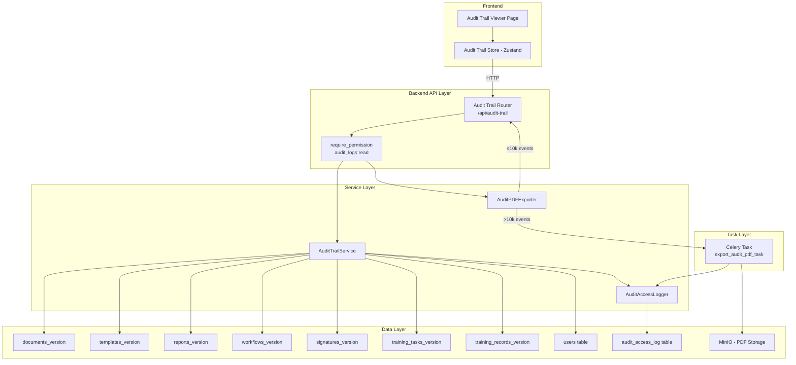

# Design Document: Audit Trail Viewer

## Overview

The Audit Trail Viewer provides a centralized, searchable, and filterable audit log UI that aggregates all audit events across AlcoaBase's versioned record types. It extends the existing per-record `AuditService` and SQLAlchemy-Continuum version tables into a cross-record, cross-type aggregated view with PDF export capabilities for FDA/EMA regulatory submissions.

The system consists of three main components:
1. **Audit Trail Service** (backend) — Aggregates, filters, paginates, and searches audit events across all version tables
2. **Audit PDF Exporter** (backend) — Generates regulatory-compliant PDF exports using ReportLab, with Celery for large datasets
3. **Audit Trail Viewer** (frontend) — React page at `/admin/audit-trail` with data table, filters, search, and export controls

### Key Design Decisions

- **Cursor-based pagination** over offset-based: Version tables can grow to millions of rows; cursor pagination avoids the performance cliff of `OFFSET` on large datasets.
- **Union query approach** over materialized view: Queries each version table individually and merges in-application. This avoids maintaining a separate denormalized table and leverages existing Continuum infrastructure.
- **Synchronous export for ≤10,000 events, async Celery task for >10,000**: Balances responsiveness for typical use with reliability for large exports.
- **Dedicated `audit_access_log` table** for meta-auditing: Separates access logging from the version tables to avoid circular dependencies.

## Architecture



### Request Flow

1. Frontend sends GET request with filters/search/pagination params
2. `require_permission("audit_logs", "read")` enforces RBAC
3. `AuditTrailService` queries version tables with filters, aggregates results
4. Access is logged to `audit_access_log`
5. Response returned with paginated events + metadata

## Components and Interfaces

### Backend Components

#### 1. Audit Trail Router (`api/audit_trail.py`)

New router at prefix `/audit-trail` registered on the main `api_router`.

```python
# Endpoints:
GET  /api/audit-trail              # List/filter/search audit events (paginated)
GET  /api/audit-trail/{event_id}   # Get full event detail (version snapshot)
POST /api/audit-trail/export       # Trigger PDF export
GET  /api/audit-trail/export/{job_id}  # Check export status / download

# All mutation methods blocked:
PUT/PATCH/DELETE /api/audit-trail/* → HTTP 403
```

All endpoints protected by `Depends(require_permission("audit_logs", "read"))`.

#### 2. AuditTrailService (`services/audit_trail_service.py`)

Core service responsible for aggregation, filtering, pagination, and search.

```python
class AuditTrailService:
    async def list_events(
        self,
        session: AsyncSession,
        company_id: int,
        filters: AuditTrailFilters,
        search_query: str | None,
        cursor: str | None,
        page_size: int = 50,
        cross_company: bool = False,
    ) -> AuditTrailPage:
        """Aggregate and return paginated audit events."""

    async def get_event_detail(
        self,
        session: AsyncSession,
        company_id: int,
        record_type: str,
        record_id: int,
        transaction_id: int,
    ) -> AuditEventDetail:
        """Return full version snapshot for a specific event."""

    async def get_total_count(
        self,
        session: AsyncSession,
        company_id: int,
        filters: AuditTrailFilters,
        search_query: str | None,
    ) -> int:
        """Return total count of matching events."""
```

**Aggregation Strategy:**
- Query each version table individually with applied filters
- Each query includes a JOIN to the `transaction` table for timestamp and user metadata
- Results are merged in-memory and sorted by timestamp descending
- For pagination, use composite cursor `(timestamp, transaction_id, record_type)` to ensure stable ordering

#### 3. AuditPDFExporter (`services/audit_pdf_exporter.py`)

Generates regulatory-compliant PDF documents using ReportLab.

```python
class AuditPDFExporter:
    def generate_pdf(
        self,
        events: list[AuditEvent],
        metadata: ExportMetadata,
    ) -> bytes:
        """Generate PDF bytes from audit events (synchronous)."""

    async def export_async(
        self,
        session: AsyncSession,
        company_id: int,
        filters: AuditTrailFilters,
        search_query: str | None,
        requesting_user_id: int,
    ) -> str:
        """Dispatch Celery task for large exports. Returns job_id."""
```

#### 4. AuditAccessLogger (`services/audit_access_logger.py`)

Logs all access to the audit trail for meta-auditing.

```python
class AuditAccessLogger:
    async def log_access(
        self,
        session: AsyncSession,
        user_id: int,
        company_id: int,
        action: str,  # "view" | "export"
        filters_applied: dict | None,
        event_count: int | None = None,
    ) -> None:
        """Record an audit trail access event."""
```

#### 5. Celery Task (`tasks/audit_export_tasks.py`)

```python
@celery_app.task(
    bind=True,
    soft_time_limit=300,
    max_retries=0,
    queue="default",
    name="alcoabase.tasks.audit_export_tasks.export_audit_pdf_task",
)
def export_audit_pdf_task(
    self: Task,
    job_id: str,
    company_id: int,
    filters: dict,
    search_query: str | None,
    requesting_user_id: int,
) -> dict[str, Any]:
    """Generate PDF export asynchronously for large datasets."""
```

### Frontend Components

#### 1. Audit Trail Page (`pages/AuditTrailPage.tsx`)

Main page component at route `/admin/audit-trail`.

#### 2. Audit Trail Store (`stores/auditTrailStore.ts`)

Zustand store managing:
- `events: AuditEvent[]`
- `filters: AuditTrailFilters`
- `searchQuery: string`
- `cursor: string | null`
- `totalCount: number`
- `isLoading: boolean`
- `selectedEvent: AuditEventDetail | null`
- `exportStatus: ExportStatus | null`

#### 3. UI Components

- `AuditTrailTable` — shadcn/ui DataTable with sortable columns
- `AuditTrailFilters` — Filter bar with user select, date range picker, record type dropdown, operation type dropdown
- `AuditEventDetailPanel` — Slide-over panel showing full change details
- `AuditExportButton` — Export to PDF trigger with status feedback

## Data Models

### Backend Schemas (Pydantic)

```python
class AuditEvent(BaseModel):
    """Single audit event in the aggregated view."""
    transaction_id: int
    timestamp: datetime
    user_id: int
    user_display_name: str | None
    record_type: str
    record_id: int
    operation_type: Literal["INSERT", "UPDATE", "DELETE"]
    change_reason: str | None
    changed_fields: list[str]  # max 10
    total_changed_fields: int  # actual count if > 10
    company_id: int

class AuditTrailFilters(BaseModel):
    """Filter criteria for audit trail queries."""
    user_id: int | None = None
    date_start: datetime | None = None
    date_end: datetime | None = None
    record_type: str | None = None
    operation_type: Literal["INSERT", "UPDATE", "DELETE"] | None = None

class AuditTrailPage(BaseModel):
    """Paginated response for audit trail listing."""
    events: list[AuditEvent]
    next_cursor: str | None
    total_count: int
    warnings: list[str] | None = None  # failed record types

class AuditEventDetail(BaseModel):
    """Full detail view of a single audit event."""
    transaction_id: int
    timestamp: datetime
    user_id: int
    user_display_name: str | None
    record_type: str
    record_id: int
    operation_type: Literal["INSERT", "UPDATE", "DELETE"]
    change_reason: str | None
    field_changes: list[FieldChange]
    company_id: int

class FieldChange(BaseModel):
    """Single field change within an audit event."""
    field_name: str
    old_value: Any | None
    new_value: Any | None

class ExportMetadata(BaseModel):
    """Metadata included in PDF export header."""
    company_name: str
    export_timestamp: datetime
    filters_applied: AuditTrailFilters
    total_event_count: int
    requesting_user_name: str

class ExportStatusResponse(BaseModel):
    """Response for export status check."""
    job_id: str
    status: Literal["pending", "processing", "completed", "failed"]
    download_url: str | None = None
    error_message: str | None = None
```

### Database Model

```python
class AuditAccessLog(Base):
    """Immutable log of audit trail access events."""
    __tablename__ = "audit_access_log"

    id: Mapped[int] = mapped_column(primary_key=True)
    user_id: Mapped[int] = mapped_column(ForeignKey("users.id"), index=True)
    company_id: Mapped[int] = mapped_column(ForeignKey("companies.id"), index=True)
    action: Mapped[str]  # "view" | "export"
    filters_applied: Mapped[dict | None] = mapped_column(JSON, nullable=True)
    event_count: Mapped[int | None] = mapped_column(nullable=True)
    timestamp: Mapped[datetime] = mapped_column(
        server_default=func.now(), index=True
    )

    # No update/delete allowed — enforced at API layer
```

### Frontend Types (TypeScript)

```typescript
interface AuditEvent {
  transaction_id: number;
  timestamp: string;
  user_id: number;
  user_display_name: string | null;
  record_type: string;
  record_id: number;
  operation_type: "INSERT" | "UPDATE" | "DELETE";
  change_reason: string | null;
  changed_fields: string[];
  total_changed_fields: number;
  company_id: number;
}

interface AuditTrailFilters {
  user_id?: number;
  date_start?: string;
  date_end?: string;
  record_type?: string;
  operation_type?: "INSERT" | "UPDATE" | "DELETE";
}

interface AuditTrailPage {
  events: AuditEvent[];
  next_cursor: string | null;
  total_count: number;
  warnings?: string[];
}

interface AuditEventDetail {
  transaction_id: number;
  timestamp: string;
  user_id: number;
  user_display_name: string | null;
  record_type: string;
  record_id: number;
  operation_type: "INSERT" | "UPDATE" | "DELETE";
  change_reason: string | null;
  field_changes: FieldChange[];
  company_id: number;
}

interface FieldChange {
  field_name: string;
  old_value: unknown;
  new_value: unknown;
}
```

## Correctness Properties

*A property is a characteristic or behavior that should hold true across all valid executions of a system — essentially, a formal statement about what the system should do. Properties serve as the bridge between human-readable specifications and machine-verifiable correctness guarantees.*

### Property 1: Aggregation completeness and ordering

*For any* set of audit events distributed across all version tables, the aggregation function SHALL return every event exactly once, ordered by timestamp descending (most recent first).

**Validates: Requirements 1.1, 1.2**

### Property 2: Event serialization includes required fields with truncation

*For any* version table entry with N changed fields (where N ≥ 0), the serialized AuditEvent SHALL include all required fields (user_id, timestamp, record_type, record_id, operation_type, change_reason) and SHALL include at most 10 changed field names with `total_changed_fields` reflecting the actual count.

**Validates: Requirements 1.3**

### Property 3: User identity resolution with fallback

*For any* audit event, if the associated user record exists, the `user_display_name` SHALL be the user's display name; if the user record is unavailable, `user_display_name` SHALL be null and `user_id` SHALL be the numeric identifier.

**Validates: Requirements 1.4**

### Property 4: Transaction grouping

*For any* set of audit events where multiple events share the same `transaction_id`, those events SHALL be presented with the `transaction_id` as a correlation identifier enabling grouping.

**Validates: Requirements 1.5**

### Property 5: Graceful degradation on partial failure

*For any* subset of version tables that fail during aggregation, the service SHALL return events from all non-failing tables and SHALL include a warning listing exactly the record types that could not be retrieved.

**Validates: Requirements 1.6**

### Property 6: Pagination completeness with page size clamping

*For any* dataset of audit events and any sequence of cursor-based page requests with page_size clamped to [1, 200], iterating through all pages SHALL yield every matching event exactly once with no duplicates and no gaps.

**Validates: Requirements 2.1, 2.2**

### Property 7: Total count accuracy

*For any* combination of filters and search query, the `total_count` returned SHALL equal the number of events that satisfy all applied criteria.

**Validates: Requirements 2.3**

### Property 8: Filter correctness

*For any* single filter (user_id, date_range, record_type, or operation_type) applied to a dataset, every event in the response SHALL satisfy that filter criterion, and no event satisfying the criterion SHALL be excluded from the response.

**Validates: Requirements 3.1, 3.2, 3.3, 3.4**

### Property 9: Filter AND-combination with search

*For any* combination of filters and search query applied simultaneously, the result set SHALL equal the intersection of applying each filter and the search individually.

**Validates: Requirements 3.5, 5.3**

### Property 10: Tenant scoping

*For any* audit trail query scoped to a specific company_id, every returned event SHALL belong to that company, and no event from another company SHALL appear in the results.

**Validates: Requirements 4.1**

### Property 11: Substring search completeness

*For any* audit event and any substring of its searchable fields (change_reason, record_type, user_display_name, record_id as string), searching for that substring SHALL include the event in the results.

**Validates: Requirements 5.1, 5.2**

### Property 12: PDF content consistency with API

*For any* set of filter criteria, the events included in the generated PDF SHALL be exactly the same set of events that the list API would return for those same criteria.

**Validates: Requirements 7.1**

### Property 13: PDF header metadata completeness

*For any* export request, the generated PDF header SHALL contain: company name, export timestamp (UTC), all applied filters, total event count, and the requesting user's identity.

**Validates: Requirements 7.2**

### Property 14: PDF event formatting with truncation

*For any* audit event with a change_reason of length L, the PDF-formatted entry SHALL include sequential number, timestamp, user identity, record type, record ID, and operation_type. If L > 500, the change_reason SHALL be truncated to 500 characters followed by an ellipsis indicator.

**Validates: Requirements 7.3**

### Property 15: Immutability enforcement

*For any* HTTP request using PUT, PATCH, or DELETE methods against any audit trail endpoint, regardless of the requesting user's role or permissions, the service SHALL return HTTP 403 with the message "Audit records are immutable per ALCOA+ and CFR 21 Part 11".

**Validates: Requirements 8.1, 8.2, 8.4**

### Property 16: Access logging completeness

*For any* audit trail interaction (view or export), the system SHALL create an entry in the `audit_access_log` table containing the user_id, timestamp, action type, and applied filters.

**Validates: Requirements 11.1, 11.2**

## Error Handling

| Scenario | Behavior | HTTP Status |
|----------|----------|-------------|
| Missing X-Company-Id header | Reject with tenant resolution error | 400 |
| Unauthorized role | Reject via `require_permission` | 403 |
| Mutation attempt (PUT/PATCH/DELETE) | Reject with immutability message | 403 |
| Invalid record_type in filter | Reject with validation error | 422 |
| Invalid cursor format | Reject with validation error | 422 |
| page_size out of range (< 1 or > 200) | Clamp to [1, 200] silently | 200 |
| Partial version table failure | Return available results + warning | 200 |
| Event detail not found | Record not found | 404 |
| PDF export with zero events | Return error message, no PDF generated | 400 |
| PDF generation timeout (>300s) | Celery task fails, error notification sent | — |
| PDF generation error | No partial PDF stored, error returned | 500 |
| Export job not found | Job ID not recognized | 404 |

### Error Response Format

```python
class ErrorResponse(BaseModel):
    detail: str
    code: str | None = None  # machine-readable error code
```

## Testing Strategy

### Property-Based Tests (Backend — Hypothesis)

Property-based testing is appropriate for this feature because the core logic involves:
- Pure filtering/aggregation functions with clear input/output behavior
- Universal properties that hold across a wide input space (any events, any filters)
- Data transformation (version entries → AuditEvent schema)
- Pagination correctness across arbitrary datasets

**Library**: Hypothesis (Python)
**Location**: `src/backend/tests/properties/test_audit_trail_properties.py`
**Configuration**: Minimum 100 iterations per property (`@settings(max_examples=100)`)

Each property test references its design document property:
- Tag format: `Feature: Step_6-3_audit-trail-viewer, Property {N}: {title}`

### Property-Based Tests (Frontend — fast-check)

**Library**: fast-check (TypeScript)
**Location**: `src/frontend/src/__tests__/audit-trail.property.test.ts`
**Configuration**: `{ numRuns: 100 }`

Frontend property tests focus on:
- Filter state management correctness
- Event formatting/truncation logic
- Pagination cursor handling

### Unit Tests (Backend — pytest)

- Endpoint routing and RBAC enforcement
- Immutability blocking (PUT/PATCH/DELETE → 403)
- PDF formatting (A4, portrait, fixed-width font, headers per page)
- Async export threshold detection (>10,000 events → Celery)
- Access logging writes to `audit_access_log`
- Error cases (invalid filters, missing headers, not found)

### Unit Tests (Frontend — Vitest)

- Component rendering (table, filters, detail panel, export button)
- Loading/empty/error states
- Column sorting interaction
- Export button behavior (sync vs async feedback)
- Route guard enforcement

### Integration Tests

- Full request flow: API → Service → DB → Response
- Multi-tenant isolation verification
- PDF generation end-to-end (small dataset)
- Celery task dispatch and completion for large exports
- Access log creation on each request
