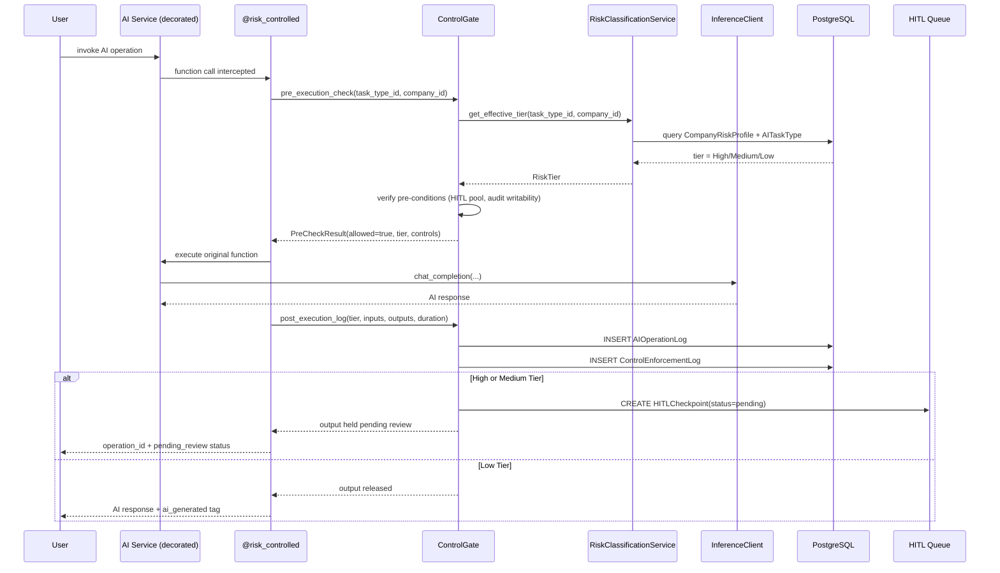
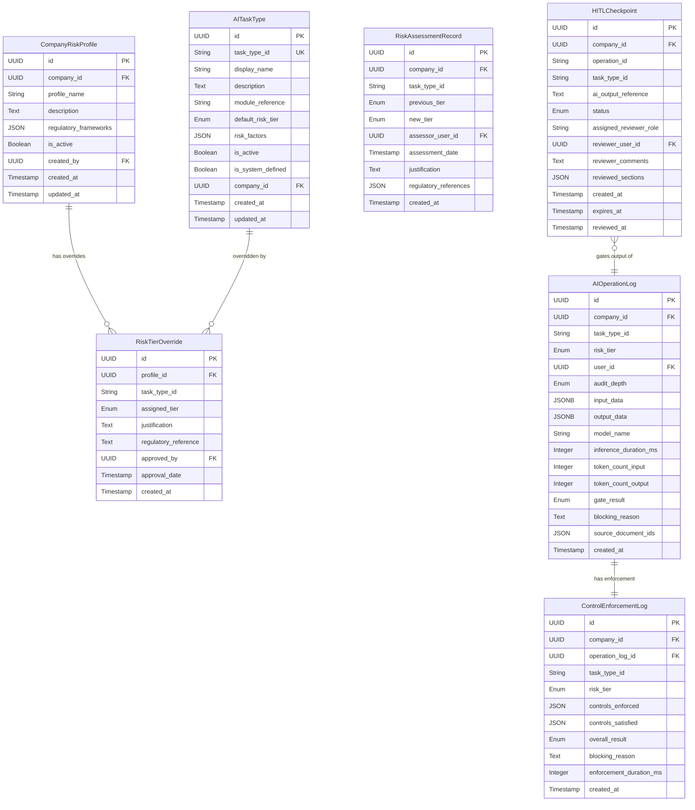

# Design Document: AI Risk & Compliance Framework

## Overview

The AI Risk & Compliance Framework introduces a governance layer that classifies all AI-powered operations in AlcoaBase into risk tiers (High, Medium, Low) and enforces tier-appropriate controls at runtime. The framework operates as a cross-cutting concern that wraps existing AI services via a Python decorator (`@risk_controlled`), intercepting inference calls to enforce validation, HITL checkpoints, and audit logging proportional to the operation's risk classification.

The design follows AlcoaBase's layered architecture: a new `risk_framework` API router exposes REST endpoints, a `RiskClassificationService` encapsulates business logic, and new SQLAlchemy models persist risk classifications, company profiles, HITL checkpoints, and operation logs. The framework integrates with existing infrastructure (audit middleware, multi-tenancy headers, SQLAlchemy-Continuum) without modifying the InferenceClient interface.

Key design decisions:
- **Decorator-based integration**: The `@risk_controlled` decorator wraps existing service functions, avoiding rewrites of Document Generator, Multi-Agent Auditing, RAG, etc.
- **Immutable operation logs**: AIOperationLog and ControlEnforcementLog use the same SQLAlchemy event listener pattern as GenerationProvenance for GxP compliance.
- **Company-scoped profiles**: Multi-tenancy via X-Company-Id header with fallback to system-defined defaults.
- **Synchronous audit logging for High/Medium tiers**: Ensures audit trail integrity before returning results to callers.

## Architecture

```mermaid
graph TB
    subgraph "Frontend"
        UI[Risk Framework Admin Page]
    end

    subgraph "API Layer"
        RF_ROUTER[/api/risk-framework/*]
    end

    subgraph "Service Layer"
        RCS[RiskClassificationService]
        CG[ControlGate]
        DEC["@risk_controlled decorator"]
    end

    subgraph "Existing AI Services"
        DG[Document Generator 5.4]
        MA[Multi-Agent Auditing 5.2]
        RAG[RAG Knowledge 4.2]
        TS[Training Ecosystem 5.3]
        CIA[Change Impact Analysis 5.5]
        TD[Traceability Discovery 5.6]
    end

    subgraph "Data Layer"
        ATT[AITaskType]
        CRP[CompanyRiskProfile]
        RTO[RiskTierOverride]
        RAR[RiskAssessmentRecord]
        HC[HITLCheckpoint]
        AOL[AIOperationLog]
        CEL[ControlEnforcementLog]
    end

    subgraph "Infrastructure"
        IC[InferenceClient]
        AT[Audit Trail 6.3]
        PG[(PostgreSQL)]
    end

    UI --> RF_ROUTER
    RF_ROUTER --> RCS
    RCS --> CG
    DEC --> CG
    DEC --> DG
    DEC --> MA
    DEC --> RAG
    DEC --> TS
    DEC --> CIA
    DEC --> TD
    CG --> ATT
    CG --> CRP
    CG --> RTO
    CG --> HC
    CG --> AOL
    CG --> CEL
    CG --> AT
    RCS --> RAR
    DG --> IC
    MA --> IC
    RAG --> IC
    TS --> IC
    CIA --> IC
    TD --> IC
    ATT --> PG
    CRP --> PG
    AOL --> PG
```

### Request Flow: AI Operation with Risk Controls



## Components and Interfaces

### Backend Components

#### 1. RiskClassificationService (`services/risk_classification_service.py`)

Primary service class encapsulating all risk framework business logic.

```python
class RiskClassificationService:
    """Manages AI task type registry, risk profiles, and tier resolution."""

    async def get_task_types(
        self, company_id: UUID, limit: int = 20, offset: int = 0
    ) -> PaginatedResult[AITaskTypeResponse]: ...

    async def get_task_type(
        self, task_type_id: str, company_id: UUID
    ) -> AITaskTypeDetailResponse: ...

    async def get_effective_tier(
        self, task_type_id: str, company_id: UUID
    ) -> RiskTier: ...

    async def create_profile(
        self, company_id: UUID, data: CreateProfileRequest, user_id: UUID
    ) -> CompanyRiskProfileResponse: ...

    async def update_profile(
        self, profile_id: UUID, company_id: UUID, data: UpdateProfileRequest
    ) -> CompanyRiskProfileResponse: ...

    async def get_active_profile(
        self, company_id: UUID
    ) -> CompanyRiskProfileResponse | None: ...

    async def get_profile_history(
        self, company_id: UUID, limit: int = 20, offset: int = 0
    ) -> PaginatedResult[CompanyRiskProfileResponse]: ...

    async def get_dashboard_stats(
        self, company_id: UUID
    ) -> DashboardStatsResponse: ...
```

#### 2. ControlGate (`services/control_gate.py`)

Runtime enforcement engine that checks pre-conditions and logs post-execution.

```python
class ControlGate:
    """Enforces tier-appropriate controls before and after AI operations."""

    async def pre_execution_check(
        self,
        task_type_id: str,
        company_id: UUID,
        user_id: UUID,
    ) -> PreCheckResult: ...

    async def post_execution_log(
        self,
        task_type_id: str,
        company_id: UUID,
        user_id: UUID,
        tier: RiskTier,
        input_data: dict | None,
        output_data: dict | None,
        model_name: str | None,
        inference_duration_ms: int | None,
        token_count_input: int | None,
        token_count_output: int | None,
        source_document_ids: list[str] | None,
        gate_result: GateResult,
        blocking_reason: str | None,
        controls_enforced: list[str],
        controls_satisfied: dict[str, bool],
    ) -> AIOperationLog: ...

    async def create_hitl_checkpoint(
        self,
        company_id: UUID,
        operation_id: str,
        task_type_id: str,
        ai_output_reference: str,
        tier: RiskTier,
    ) -> HITLCheckpoint: ...
```

#### 3. `@risk_controlled` Decorator (`services/risk_controlled.py`)

```python
def risk_controlled(task_type_id: str):
    """Decorator that wraps async AI service functions with risk controls.

    Invokes ControlGate pre-execution checks, executes the wrapped function,
    then logs the operation at the appropriate audit depth. For High/Medium
    tiers, creates a HITL checkpoint blocking output visibility.

    Args:
        task_type_id: The registered AI_Task_Type identifier.

    Usage:
        @risk_controlled(task_type_id="document_generation")
        async def generate_document(self, ...): ...
    """
```

#### 4. HITLCheckpointService (`services/hitl_checkpoint_service.py`)

```python
class HITLCheckpointService:
    """Manages HITL checkpoint lifecycle: creation, review, expiration."""

    async def list_checkpoints(
        self, company_id: UUID, filters: CheckpointFilters, limit: int, offset: int
    ) -> PaginatedResult[HITLCheckpointResponse]: ...

    async def review_checkpoint(
        self, checkpoint_id: UUID, company_id: UUID, user_id: UUID,
        action: str, comments: str, reviewed_sections: list[str] | None
    ) -> HITLCheckpointResponse: ...

    async def expire_stale_checkpoints(self) -> int: ...
```

#### 5. Risk Framework Router (`api/risk_framework.py`)

FastAPI router with prefix `/risk-framework` registered on the main `api_router`.

All endpoints require `X-Company-Id` header and `system_admin` or `doc_admin` role. Mutating endpoints require `X-Change-Reason` header.

### Frontend Components

#### 1. AIRiskFrameworkPage (`pages/AIRiskFrameworkPage.tsx`)

Top-level page component at route `/admin/ai-risk-framework` with tab navigation:
- **Dashboard** tab: Summary stats, risk matrix visualization
- **Task Types** tab: Paginated table of AI task types with expandable rows
- **Risk Profile** tab: Profile management with override forms
- **HITL Queue** tab: Pending checkpoints sorted by expiry
- **Operation Logs** tab: Filterable log viewer

#### 2. Zustand Store (`stores/riskFrameworkStore.ts`)

State management for risk framework data: task types, active profile, checkpoints, operation logs, dashboard stats.

#### 3. API Client Extensions (`lib/riskFrameworkApi.ts`)

Typed API functions wrapping `apiClient` for all `/api/risk-framework/*` endpoints.

## Data Models

### Entity Relationship Diagram



### Immutability Strategy

Following the existing `immutability.py` pattern:
- **Versioned (AuditMixin)**: AITaskType, CompanyRiskProfile, HITLCheckpoint — these models support updates and use SQLAlchemy-Continuum for audit trail.
- **Immutable (event listeners)**: RiskAssessmentRecord, AIOperationLog, ControlEnforcementLog — append-only, no UPDATE/DELETE permitted at the application layer.

### Enum Definitions

```python
class RiskTier(str, Enum):
    HIGH = "high"
    MEDIUM = "medium"
    LOW = "low"

class AuditDepth(str, Enum):
    FULL = "full"
    STANDARD = "standard"
    MINIMAL = "minimal"

class GateResult(str, Enum):
    PASSED = "passed"
    BLOCKED = "blocked"

class CheckpointStatus(str, Enum):
    PENDING = "pending"
    APPROVED = "approved"
    REJECTED = "rejected"
    EXPIRED = "expired"
```

### Tier-to-Control Mapping (Static Configuration)

```python
TIER_CONTROL_SETS: dict[RiskTier, ControlSet] = {
    RiskTier.HIGH: ControlSet(
        hitl_required=True,
        hitl_blocks_visibility=True,
        audit_depth=AuditDepth.FULL,
        validations=["format_validation", "cross_reference_check", "completeness_check"],
        provenance_required=True,
        expiry_hours=72,
        rate_limit=None,
        output_label=None,
    ),
    RiskTier.MEDIUM: ControlSet(
        hitl_required=True,
        hitl_blocks_visibility=False,  # blocks automated actions, not visibility
        audit_depth=AuditDepth.STANDARD,
        validations=["format_validation"],
        provenance_required=False,
        expiry_hours=72,
        rate_limit=None,
        output_label="ai_assisted",
    ),
    RiskTier.LOW: ControlSet(
        hitl_required=False,
        hitl_blocks_visibility=False,
        audit_depth=AuditDepth.MINIMAL,
        validations=[],
        provenance_required=False,
        expiry_hours=None,
        rate_limit=100,  # per user per hour
        output_label="ai_generated",
    ),
}
```

## Correctness Properties

*A property is a characteristic or behavior that should hold true across all valid executions of a system—essentially, a formal statement about what the system should do. Properties serve as the bridge between human-readable specifications and machine-verifiable correctness guarantees.*

### Property 1: Multi-tenancy Isolation

*For any* two distinct companies A and B, and any risk framework query (task types, profiles, checkpoints, operation logs) executed in the context of company A, the results SHALL never contain records belonging to company B (where company B's custom task types, profiles, checkpoints, or logs are excluded from company A's result set).

**Validates: Requirements 1.6, 3.9, 5.8, 6.7, 10.13**

### Property 2: Task Type Field Validation

*For any* AI task type creation payload, the system SHALL accept the payload if and only if: task_type_id matches `^[a-z0-9_]{1,100}$`, display_name is 1–200 characters, description is 1–2000 characters, module_reference is 1–100 characters, default_risk_tier is one of {High, Medium, Low}, risk_factors has 0–20 entries each ≤500 characters, and is_active is boolean.

**Validates: Requirements 1.1**

### Property 3: Pagination Correctness

*For any* collection of N records and valid pagination parameters (limit ∈ [1,100], offset ∈ [0, N]), the paginated response SHALL contain exactly min(limit, N - offset) items, total SHALL equal N, and the items SHALL be the correct ordered slice of the full collection.

**Validates: Requirements 1.3, 5.1, 6.5, 10.1, 10.9, 10.11**

### Property 4: Unregistered Task Type Blocking

*For any* task_type_id string that does not exist in the AI_Task_Type registry (neither system-defined nor company-custom), the Control_Gate SHALL block the operation and return an error indicating the task type is not registered, without executing any inference call.

**Validates: Requirements 1.7, 4.7**

### Property 5: Checkpoint Expiry Invalidates Output

*For any* HITL checkpoint with status "pending" whose expires_at timestamp is in the past (created_at + 72 hours < current_time), the system SHALL treat the checkpoint as expired, mark the associated AI output as invalid, prevent approval or rejection actions on that checkpoint, and prevent the output from being referenced by downstream workflows.

**Validates: Requirements 2.7, 4.10, 5.6**

### Property 6: Profile Creation Validation

*For any* profile creation request, the system SHALL accept it if and only if: profile_name is 3–200 characters, regulatory_frameworks has 1–20 entries, overrides has 1–50 entries with no duplicate task_type_ids, each override references a valid task_type_id, and de-escalation overrides include justification ≥50 characters with regulatory_reference and approved_by fields.

**Validates: Requirements 3.2, 3.10, 3.11**

### Property 7: Escalation/De-escalation Enforcement

*For any* risk tier override, if the assigned_tier is higher than or equal to the task type's default_risk_tier (escalation: Low→Medium, Low→High, Medium→High), the override SHALL be accepted without additional approval. If the assigned_tier is lower (de-escalation: High→Medium, High→Low, Medium→Low), the override SHALL require a justification of ≥50 characters, a regulatory_reference, and an approved_by user with system_admin or doc_admin role.

**Validates: Requirements 3.5, 8.3, 8.10**

### Property 8: Risk Assessment Record on Tier Change

*For any* tier assignment change (both escalation and de-escalation), the system SHALL create a RiskAssessmentRecord containing the task_type_id, previous_tier, new_tier, assessor_user_id, assessment_date, justification, and regulatory_references. The record SHALL be immutable once created.

**Validates: Requirements 3.6**

### Property 9: Single Active Profile Per Company

*For any* company and any sequence of profile creation operations, at most one CompanyRiskProfile SHALL have is_active=true at any point in time. Creating a new profile SHALL set the previous active profile's is_active to false.

**Validates: Requirements 3.7, 8.2**

### Property 10: Tier Resolution with Fallback

*For any* task_type_id and company_id, `get_effective_tier` SHALL return the company's overridden tier if a CompanyRiskProfile with an override for that task_type_id exists, otherwise SHALL return the default_risk_tier from the AITaskType registry. If the task_type_id is not found in either, it SHALL raise a ValueError.

**Validates: Requirements 3.8, 9.7**

### Property 11: Tier-Appropriate Output Handling

*For any* AI operation completing successfully: if the effective tier is High, the output SHALL be blocked from user-visible persistence until a HITL checkpoint is approved; if Medium, the output SHALL be tagged "ai_assisted" and blocked from triggering automated actions until HITL review; if Low, the output SHALL be immediately available to the user with an "ai_generated" tag.

**Validates: Requirements 4.2, 4.3, 4.4, 5.4, 5.5**

### Property 12: Control Enforcement Log Invariant

*For any* AI operation (regardless of tier, success, or failure), the system SHALL create exactly one ControlEnforcementLog record containing: task_type_id, risk_tier_applied, company_id, user_id, operation_timestamp, controls_enforced, controls_satisfied (boolean per control), overall_gate_result, and blocking_reason (if blocked).

**Validates: Requirements 4.5**

### Property 13: Gate Blocks on Unavailable Controls

*For any* AI operation where a required control cannot be enforced (HITL reviewer pool empty, audit trail unreachable, validation service unavailable), the Control_Gate SHALL block the operation, return an error identifying the unsatisfied control, and SHALL NOT execute the inference call.

**Validates: Requirements 4.6**

### Property 14: Audit Depth Matches Tier

*For any* AI operation, the AIOperationLog entry SHALL contain fields matching the tier's audit depth specification: "full" includes all inputs/outputs/intermediate steps/model params/token counts/source docs; "standard" includes input summary/output/model_name/token counts/source doc IDs; "minimal" includes only task_type_id/user_id/company_id/timestamp/status/duration/token_count_output.

**Validates: Requirements 4.8, 6.1, 6.2, 6.3**

### Property 15: Checkpoint Review State Machine

*For any* HITL checkpoint, the only valid state transition from "pending" is to "approved", "rejected", or "expired". Attempts to review a checkpoint in any state other than "pending" SHALL be rejected. Only users with system_admin or doc_admin role SHALL be permitted to perform reviews. Rejections SHALL require non-empty reviewer_comments.

**Validates: Requirements 5.2, 5.7, 5.9, 5.11, 8.9**

### Property 16: Immutable Operation Logs

*For any* AIOperationLog or ControlEnforcementLog record, any attempt to UPDATE or DELETE the record SHALL raise an ImmutableRecordError, preserving the append-only GxP audit trail guarantee.

**Validates: Requirements 6.4, 8.8**

### Property 17: Audit Logging Resilience

*For any* High-tier or Medium-tier AI operation, the audit log entry SHALL be written synchronously before the response is returned. If the log write fails, the operation result SHALL NOT be returned to the caller. For any AI operation that fails during execution, the system SHALL still log the operation at the same audit depth with status "failure" and available fields up to the point of failure.

**Validates: Requirements 6.8, 6.9**

## Error Handling

### API Error Responses

| Scenario | HTTP Status | Error Body |
|----------|-------------|------------|
| Missing X-Company-Id header | 400 | `{"detail": "X-Company-Id header is required"}` |
| Missing X-Change-Reason on mutation | 400 | `{"detail": "X-Change-Reason header is required for mutating requests to GxP-relevant endpoints."}` |
| Insufficient role (not system_admin/doc_admin) | 403 | `{"detail": "Insufficient permissions. Requires system_admin or doc_admin role."}` |
| Resource not found (task type, profile, checkpoint) | 404 | `{"detail": "Resource not found: {resource_type} with id {id}"}` |
| Checkpoint already reviewed (not pending) | 409 | `{"detail": "Checkpoint is already in state '{status}'. Only pending checkpoints can be reviewed."}` |
| Concurrent review race condition | 409 | `{"detail": "Checkpoint was already reviewed by another user."}` |
| Validation failure (invalid fields, duplicates) | 422 | `{"detail": "Validation error", "errors": [...]}` |

### Service-Layer Error Handling

| Scenario | Behavior |
|----------|----------|
| Unregistered task_type_id in Control_Gate | Raise `UnregisteredTaskTypeError`; gate blocks operation |
| HITL reviewer pool empty for company | Raise `ControlUnavailableError`; gate blocks operation |
| Audit trail service unreachable | Raise `ControlUnavailableError`; gate blocks operation |
| Audit log write failure (High/Medium) | Raise `AuditWriteError`; do NOT return AI output to caller |
| Decorated function raises exception | Log operation as "failure" in AIOperationLog; re-raise original exception |
| Pre-execution check exceeds 500ms | Log performance warning; complete check (do NOT bypass controls) |
| Profile de-escalation without approval | Raise `DeEscalationApprovalRequired` with details of missing fields |

### Retry and Recovery

- **Audit log write failures**: No retry at the request level. The caller receives an error and must retry the entire operation. This ensures no AI output is delivered without audit trail.
- **Checkpoint expiry**: A scheduled Celery task runs every 15 minutes to scan for expired checkpoints and transition their status. This is idempotent — running it multiple times on the same checkpoint has no additional effect.
- **Concurrent checkpoint reviews**: Handled via optimistic locking (version column check on UPDATE WHERE status='pending'). The first successful UPDATE wins; subsequent attempts get 0 rows affected and return 409.

## Testing Strategy

### Property-Based Tests (Hypothesis)

The framework uses **Hypothesis** for property-based testing on the backend. Each correctness property maps to one or more Hypothesis test functions in `src/backend/tests/properties/test_risk_framework_properties.py`.

**Configuration**:
- Minimum 100 examples per property test (`@settings(max_examples=100)`)
- Each test tagged with: `# Feature: Step_8-1_ai-risk-compliance-framework, Property {N}: {title}`
- Custom strategies for generating valid/invalid AITaskType payloads, profile configurations, tier transitions, and checkpoint states

**Key Strategies**:
```python
# Strategy for valid task_type_id
valid_task_type_ids = st.from_regex(r"[a-z0-9_]{1,100}", fullmatch=True)

# Strategy for risk tier transitions
tier_transitions = st.tuples(
    st.sampled_from(["high", "medium", "low"]),  # from
    st.sampled_from(["high", "medium", "low"]),  # to
).filter(lambda t: t[0] != t[1])

# Strategy for checkpoint states
checkpoint_states = st.sampled_from(["pending", "approved", "rejected", "expired"])
```

### Unit Tests (pytest)

Located in `src/backend/tests/unit/test_risk_framework/`:
- `test_risk_classification_service.py` — Service logic, tier resolution, profile CRUD
- `test_control_gate.py` — Pre-execution checks, post-execution logging
- `test_risk_controlled_decorator.py` — Decorator behavior, exception handling
- `test_hitl_checkpoint_service.py` — Checkpoint lifecycle, state transitions
- `test_risk_framework_api.py` — Endpoint validation, error responses

### Frontend Tests (Vitest + fast-check)

Located in `src/frontend/src/pages/__tests__/`:
- `AIRiskFrameworkPage.test.tsx` — Page rendering, tab navigation, role-based access
- `riskFrameworkStore.test.ts` — Zustand store actions and state management

### Integration Tests

Located in `src/backend/tests/integration/test_risk_framework/`:
- `test_risk_framework_endpoints.py` — Full request/response cycle with database
- `test_control_gate_integration.py` — Gate enforcement with real service dependencies
- `test_checkpoint_concurrency.py` — Race condition handling with concurrent requests
- `test_decorator_integration.py` — Decorator applied to mock AI service functions

### Smoke Tests

Located in `src/backend/tests/smoke/`:
- `test_risk_framework_smoke.py` — Default task types seeded, tier definitions accessible, endpoints respond

