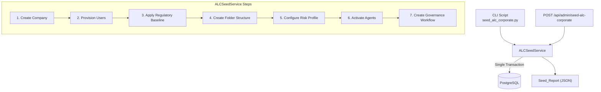
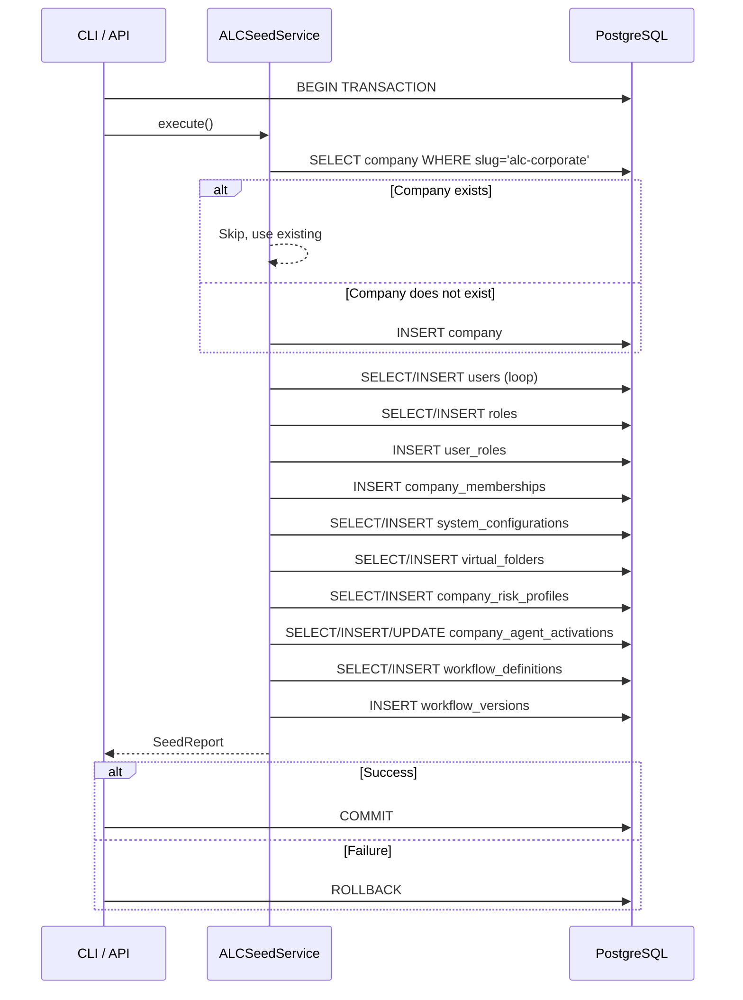

# Design Document: ALC Corporate Environment Setup

## Overview

This design describes the `ALC_Seed_Service` — a backend service that initializes the dedicated "ALC" company tenant within AlcoaBase's multi-tenancy framework. The service provisions a complete corporate environment including company entity, user pool, regulatory configuration, governance folder structure, AI risk profile, agent activations, and a governance workflow definition.

The service is designed around two core principles:
1. **Atomicity**: All operations execute within a single database transaction. Any failure triggers a complete rollback.
2. **Idempotency**: Repeated invocations produce no duplicate data. Existing entities are detected and skipped.

The service is accessible via both a CLI script (`uv run python -m alcoabase.scripts.seed_alc_corporate`) and a REST API endpoint (`POST /api/admin/seed-alc-corporate`), returning a structured `Seed_Report` summarizing all actions taken.

### Design Decisions

| Decision | Rationale |
|----------|-----------|
| Single transaction for all operations | Prevents partial state that would be difficult to diagnose and clean up in a regulated environment |
| Idempotent skip-on-exist pattern | Allows safe re-execution after partial failures or environment resets |
| Service class with step methods | Each seeding step is a testable unit; the orchestrator calls them in sequence |
| SystemConfiguration scoped by compound category | Avoids schema migration by using category names like `alc_regulatory_baseline` that are inherently company-specific |
| BPMN XML generated as a constant | The governance workflow is a fixed definition; no dynamic generation needed |
| Environment variable for default password | Follows existing pattern in `config.py`; avoids hardcoding secrets |

## Architecture



The service follows the existing layered architecture:
- **API Layer**: Thin route handler in `api/admin_seed.py` — validates auth, extracts headers, delegates to service
- **Service Layer**: `ALCSeedService` class in `services/alc_seed_service.py` — all business logic
- **CLI Layer**: Script in `scripts/seed_alc_corporate.py` — creates async session, calls service, prints report

## Components and Interfaces

### ALCSeedService

The core service class orchestrating the seeding sequence.

```python
class ALCSeedService:
    """Orchestrates ALC corporate environment seeding.
    
    All operations run within the caller-provided session transaction.
    The service does NOT commit — the caller (API route or CLI) manages
    the transaction boundary.
    """
    
    def __init__(self, session: AsyncSession) -> None: ...
    
    async def execute(self) -> SeedReport:
        """Run the full seeding sequence. Returns a SeedReport."""
        ...
    
    async def _create_company(self) -> tuple[Company, bool]:
        """Create or retrieve the ALC company. Returns (company, was_created)."""
        ...
    
    async def _provision_users(self, company: Company) -> UserPoolResult:
        """Create corporate user pool. Returns created/skipped lists."""
        ...
    
    async def _apply_regulatory_baseline(self, company: Company) -> tuple[bool, bool]:
        """Create SystemConfiguration rows. Returns (baseline_created, audit_created)."""
        ...
    
    async def _create_folder_structure(self, company: Company, it_admin: User) -> FolderResult:
        """Create governance virtual folders. Returns created/skipped lists."""
        ...
    
    async def _configure_risk_profile(self, company: Company, it_admin: User) -> bool:
        """Create CompanyRiskProfile. Returns was_created."""
        ...
    
    async def _activate_agents(self, company: Company) -> AgentResult:
        """Activate all global agents for the company. Returns activated/skipped lists."""
        ...
    
    async def _create_governance_workflow(self, company: Company, it_admin: User) -> bool:
        """Create governance WorkflowDefinition + WorkflowVersion. Returns was_created."""
        ...
```

### CLI Script Interface

```python
# src/backend/src/alcoabase/scripts/seed_alc_corporate.py
"""ALC Corporate Environment Seed Script.

Usage:
    uv run python -m alcoabase.scripts.seed_alc_corporate

Exit codes:
    0 — Success (Seed_Report printed to stdout as JSON)
    1 — Failure (error details printed to stderr)
"""
```

### API Endpoint Interface

```
POST /api/admin/seed-alc-corporate
Headers:
    Authorization: Bearer {token}  (system_administrator role required)
    X-Change-Reason: {reason}      (required by audit middleware)
Response 200: SeedReport JSON
Response 400: Missing X-Change-Reason
Response 401: Unauthorized
Response 500: Seeding failed (with error details)
```

### Slug Reservation

The slug `"alc-corporate"` must be reserved system-wide. This is enforced by:
1. A check in `SetupService.create_initial_company()` that rejects the reserved slug
2. A check in any company creation API endpoint

```python
RESERVED_SLUGS = frozenset({"alc-corporate"})

def validate_company_slug(slug: str) -> None:
    """Raise ValueError if slug is reserved."""
    if slug in RESERVED_SLUGS:
        raise ValueError(f"Slug '{slug}' is reserved for the ALC corporate environment")
```

### Configuration Extension

A new environment variable is added to `Settings`:

```python
alc_seed_default_password: str = Field(
    default="AlcCorp2024!",
    description="Default password for ALC corporate seed user accounts.",
    alias="ALC_SEED_DEFAULT_PASSWORD",
)
```

## Data Models

### Seed_Report Schema

```python
class UserPoolResult(BaseModel):
    """Result of user pool provisioning step."""
    users_created: list[str]    # Usernames of newly created users
    users_skipped: list[str]    # Usernames that already existed

class FolderResult(BaseModel):
    """Result of folder structure creation step."""
    folders_created: list[str]  # Folder names created
    folders_skipped: list[str]  # Folder names that already existed

class AgentResult(BaseModel):
    """Result of agent activation step."""
    agents_activated: list[str]  # Agent names newly activated or re-activated
    agents_skipped: list[str]    # Agent names already active

class SeedReport(BaseModel):
    """Complete report of ALC corporate environment seeding."""
    company_id: int
    company_slug: str = "alc-corporate"
    users_created: list[str]
    users_skipped: list[str]
    folders_created: list[str]
    folders_skipped: list[str]
    risk_profile_created: bool
    regulatory_baseline_created: bool
    audit_config_created: bool
    agents_activated: list[str]
    agents_skipped: list[str]
    workflow_created: bool
    total_duration_ms: int
```

### Seed Data Constants

```python
ALC_COMPANY_DATA = {
    "slug": "alc-corporate",
    "display_name": "AlcoaBase Corporate",
    "regulatory_framework": "ISO_27001",
    "audit_config": {
        "review_quorum": 2,
        "auto_audit_on_upload": True,
        "severity_threshold": "medium",
    },
}

ALC_USER_POOL = [
    {"username": "alc-it-admin", "full_name": "ALC IT Administrator",
     "email": "it-admin@alc.local", "role": "system_administrator"},
    {"username": "alc-doc-admin", "full_name": "ALC Document Administrator",
     "email": "doc-admin@alc.local", "role": "document_administrator"},
    {"username": "alc-quality-mgr", "full_name": "ALC Quality Manager",
     "email": "quality@alc.local", "role": "quality_manager"},
    {"username": "alc-user", "full_name": "ALC Standard User",
     "email": "user@alc.local", "role": "user"},
]

ALC_GOVERNANCE_FOLDERS = [
    {"name": "Governance — User Requirement Specifications",
     "tag_filter": {"tags": ["URS", "ALC-GOV"]}, "sort_order": "created_at_desc"},
    {"name": "Governance — AI Regulatory Guidelines",
     "tag_filter": {"tags": ["AI-Guidelines", "ALC-GOV"]}, "sort_order": "created_at_desc"},
    {"name": "Governance — User Guides",
     "tag_filter": {"tags": ["User-Guide", "ALC-GOV"]}, "sort_order": "created_at_desc"},
    {"name": "Governance — Admin Guides",
     "tag_filter": {"tags": ["Admin-Guide", "ALC-GOV"]}, "sort_order": "created_at_desc"},
    {"name": "Governance — Risk Framework",
     "tag_filter": {"tags": ["Risk-Framework", "ALC-GOV"]}, "sort_order": "created_at_desc"},
    {"name": "Governance — All Documents",
     "tag_filter": {"tags": ["ALC-GOV"]}, "sort_order": "created_at_desc"},
]

ALC_REGULATORY_BASELINE = {
    "applicable_frameworks": ["ISO_27001", "ISO_9001", "EU_AI_Act"],
    "document_retention_years": 10,
    "signature_required_for_approval": True,
    "training_required_before_access": True,
    "audit_log_retention_years": 7,
    "review_cycle_days": 365,
}

ALC_AUDIT_CONFIG = {
    "review_quorum": 2,
    "auto_audit_on_upload": True,
    "severity_threshold": "medium",
    "default_workflow_tag": "ALC-GOV",
}
```

### BPMN XML for Governance Workflow

The governance workflow defines a 6-state lifecycle: Draft → Review → Approved → InTraining → Active → Retired.

```python
ALC_GOVERNANCE_BPMN_XML = """<?xml version="1.0" encoding="UTF-8"?>
<definitions xmlns="http://www.omg.org/spec/BPMN/20100524/MODEL"
             xmlns:bpmndi="http://www.omg.org/spec/BPMN/20100524/DI"
             id="ALC_Governance_Definitions"
             targetNamespace="http://alcoabase.local/bpmn/governance">
  <process id="alc_governance_lifecycle" name="ALC Governance Document Lifecycle" isExecutable="true">
    <startEvent id="start" name="Start"/>
    <userTask id="draft" name="Draft"/>
    <userTask id="review" name="Review"/>
    <userTask id="approved" name="Approved"/>
    <userTask id="in_training" name="InTraining"/>
    <userTask id="active" name="Active"/>
    <endEvent id="retired" name="Retired"/>
    <sequenceFlow id="flow_start_draft" sourceRef="start" targetRef="draft"/>
    <sequenceFlow id="flow_draft_review" sourceRef="draft" targetRef="review"/>
    <sequenceFlow id="flow_review_approved" sourceRef="review" targetRef="approved"/>
    <sequenceFlow id="flow_approved_training" sourceRef="approved" targetRef="in_training"/>
    <sequenceFlow id="flow_training_active" sourceRef="in_training" targetRef="active"/>
    <sequenceFlow id="flow_active_retired" sourceRef="active" targetRef="retired"/>
  </process>
</definitions>"""
```

### Database Interaction Pattern



### SystemConfiguration Scoping

The existing `SystemConfiguration` model has a globally unique `category` field. Since the requirements specify company-scoped configuration rows, the design uses category names that are inherently ALC-specific (`"alc_regulatory_baseline"`, `"alc_audit_config"`). This avoids a schema migration while maintaining clear ownership. The `updated_by` field will reference the ALC IT Administrator user.

**Note**: If future phases require per-company SystemConfiguration rows with the same category name, a migration adding a nullable `company_id` FK and changing the unique constraint to `(category, company_id)` would be needed. For Phase 8.2, the ALC-prefixed categories are sufficient.

## Correctness Properties

*A property is a characteristic or behavior that should hold true across all valid executions of a system — essentially, a formal statement about what the system should do. Properties serve as the bridge between human-readable specifications and machine-verifiable correctness guarantees.*

### Property 1: Idempotency — repeated execution preserves state

*For any* initial database state (with any subset of ALC entities already existing), executing the `ALCSeedService` twice in succession SHALL produce the same final database state as executing it once, and the second execution's `Seed_Report` SHALL report all entities as skipped (not created).

**Validates: Requirements 1.2, 2.3, 3.3, 3.4, 4.3, 5.3, 6.7, 7.2, 8.3**

### Property 2: Transaction atomicity — failure causes complete rollback

*For any* step in the seeding sequence that raises an exception, the database SHALL contain zero records from any step of the current seeding attempt (complete rollback), and the state SHALL be identical to the state before the seed was invoked.

**Validates: Requirements 1.5, 2.9, 6.3**

### Property 3: Seed_Report accuracy — report reflects actual database changes

*For any* initial database state, the `Seed_Report` returned by `ALCSeedService.execute()` SHALL accurately reflect the actual database changes: every entity listed in `*_created` arrays SHALL exist in the database as a new record, and every entity listed in `*_skipped` arrays SHALL have existed prior to execution with no modifications applied.

**Validates: Requirements 6.4, 7.5, 8.4**

### Property 4: Slug reservation — reserved slug is always rejected

*For any* company creation request (via Setup Wizard or API) that specifies slug `"alc-corporate"`, the system SHALL reject the request with an error response, regardless of other request attributes.

**Validates: Requirements 1.3**

### Property 5: Password configuration — seed users authenticate with configured password

*For any* non-empty string value of `ALC_SEED_DEFAULT_PASSWORD`, all newly created Corporate_User_Pool accounts SHALL have their `hashed_password` field set to a bcrypt hash that verifies against that configured value.

**Validates: Requirements 2.2**

### Property 6: Agent activation completeness — all global agents are activated

*For any* set of global `AgentDefinition` records (where `company_id IS NULL` and `is_active=True`), after seed execution, there SHALL exist exactly one active `CompanyAgentActivation` record per agent for the ALC_Company, and deactivated activations SHALL be reactivated.

**Validates: Requirements 7.1, 7.2, 7.3, 7.4**

## Error Handling

| Failure Scenario | Behavior | Recovery |
|-----------------|----------|----------|
| Database unreachable | Abort immediately, exit code 1, error to stderr/response | Fix DB connection, re-run (idempotent) |
| Transaction failure mid-sequence | Full rollback, report which step failed | Fix underlying issue, re-run |
| Missing AITaskType records | Abort at risk profile step, report missing types | Run `risk_framework_seed` first, then re-run |
| Missing ALC IT Admin user | Abort at folder/workflow step, report missing user | Indicates user provisioning failed — investigate |
| Email conflict during user creation | Skip that user, log warning, continue | Manual resolution of email conflict |
| Duplicate slug attempt (external) | Reject with 422/ValueError | Inform caller the slug is reserved |
| API called without auth | HTTP 401, no operations executed | Authenticate with system_administrator role |
| API called without X-Change-Reason | HTTP 400, no operations executed | Include required header |

### Error Response Schema

```python
class SeedError(BaseModel):
    """Error response when seeding fails."""
    error: str                    # Human-readable error message
    failed_step: str              # Step name that failed
    detail: str | None = None     # Additional context (e.g., missing task types)
```

### Logging Strategy

- **INFO**: Each entity created or skipped (entity type + name)
- **WARNING**: Email conflicts, unexpected states
- **ERROR**: Transaction failures, missing prerequisites, abort conditions

All log entries include a structured `seed_step` field for filtering.

## Testing Strategy

### Property-Based Tests (Hypothesis)

Property-based testing is appropriate for this feature because the `ALCSeedService` has clear input/output behavior (initial DB state → final DB state + report) and universal properties (idempotency, atomicity, report accuracy) that should hold across all valid inputs.

**Library**: Hypothesis (already in project dependencies)
**Location**: `src/backend/tests/properties/test_alc_seed_properties.py`
**Configuration**: Minimum 100 iterations per property test

Each property test will:
- Generate random initial database states (subsets of pre-existing entities)
- Execute the seed service
- Assert the property holds

Tag format: `Feature: Step_8-2_alc-corporate-environment-setup, Property {N}: {title}`

### Unit Tests

**Location**: `src/backend/tests/unit/test_alc_seed_service.py`

| Test | What it verifies |
|------|-----------------|
| `test_create_company_fresh` | Company created with exact expected attributes |
| `test_create_company_exists` | Existing company reused without modification |
| `test_provision_users_all_new` | All 4 users created with correct roles and memberships |
| `test_provision_users_partial_exist` | Pre-existing users skipped, others created |
| `test_provision_users_email_conflict` | Conflicting email causes skip with warning |
| `test_root_admin_membership_created` | Root admin gets ALC membership if not present |
| `test_root_admin_membership_exists` | Root admin membership not duplicated |
| `test_regulatory_baseline_created` | SystemConfiguration rows created with correct values |
| `test_regulatory_baseline_exists` | Existing config rows not overwritten |
| `test_folders_created` | All 6 governance folders created with correct attributes |
| `test_folders_partial_exist` | Pre-existing folders skipped |
| `test_folders_abort_no_it_admin` | Error raised when IT admin missing |
| `test_risk_profile_created` | CompanyRiskProfile created with correct attributes |
| `test_risk_profile_exists` | Existing active profile not duplicated |
| `test_risk_profile_missing_task_types` | Error raised when AITaskTypes missing |
| `test_agent_activation_new` | All global agents activated |
| `test_agent_activation_reactivate` | Deactivated agents reactivated |
| `test_agent_activation_no_agents` | Empty agent table handled gracefully |
| `test_workflow_created` | WorkflowDefinition + WorkflowVersion created |
| `test_workflow_exists` | Existing workflow not duplicated |
| `test_seed_report_structure` | Report contains all required fields with correct types |
| `test_slug_reservation_rejected` | Company creation with reserved slug raises error |

### Integration Tests

**Location**: `src/backend/tests/integration/test_alc_seed_integration.py`

| Test | What it verifies |
|------|-----------------|
| `test_cli_success` | CLI script exits 0, stdout is valid JSON SeedReport |
| `test_cli_failure` | CLI script exits 1 on DB failure, stderr has error |
| `test_api_endpoint_success` | POST returns 200 with SeedReport |
| `test_api_endpoint_unauthorized` | POST without auth returns 401 |
| `test_api_endpoint_missing_header` | POST without X-Change-Reason returns 400 |
| `test_full_idempotent_run` | Two consecutive runs produce same DB state |
| `test_transaction_rollback` | Simulated failure leaves DB unchanged |
