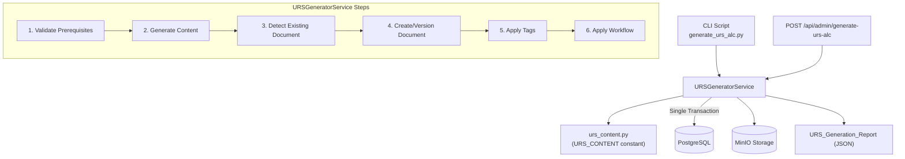
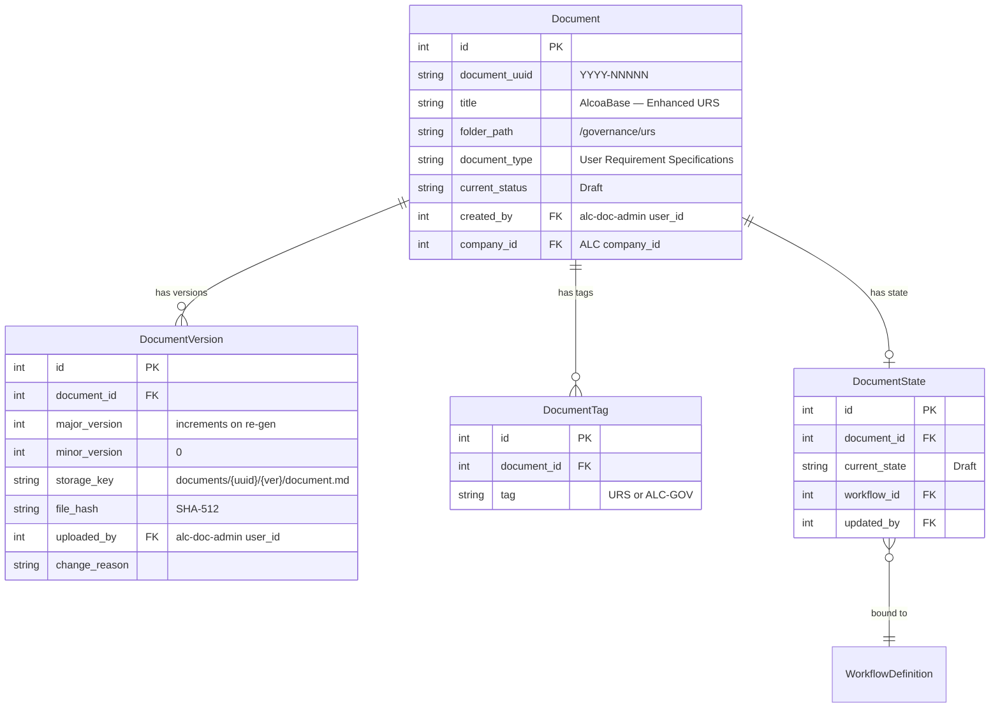
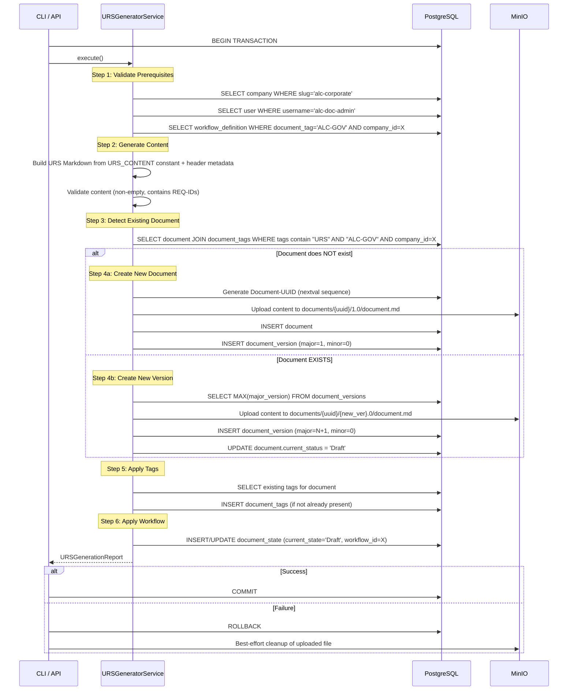

# Design Document: URS for ALC Corporate

## Overview

This design describes the `URS_Generator_Service` — a backend service that programmatically generates the Enhanced User Requirement Specifications (URS) document, uploads it into the ALC corporate governance environment, applies tags and the governance workflow, and supports versioning on re-execution.

The service follows the same architectural pattern established by `ALCSeedService` in Phase 8.2:
1. **Atomicity**: All operations execute within a single database transaction. Any failure triggers a complete rollback.
2. **Idempotency**: First invocation creates a new Document; subsequent invocations create new DocumentVersion records for the existing document rather than duplicates.
3. **Dual Interface**: Accessible via CLI script and REST API endpoint.

The URS content itself is a deterministic Python string constant — not AI-generated at runtime. This ensures version-controlled, reproducible output suitable for a regulated GxP environment.

### Design Decisions

| Decision | Rationale |
|----------|-----------|
| URS content as a Python constant | Deterministic, version-controlled, auditable — no runtime AI generation needed for a governance document |
| Separate `urs_content.py` module | Isolates the large Markdown constant from service logic; easy to update independently |
| Reuse existing `DocumentService` pattern (not the class) | The service directly creates Document/DocumentVersion/DocumentTag records following the same patterns, but without MinIO storage (content stored as file bytes in MinIO) |
| Version detection by tags + company_id | Tags ["URS", "ALC-GOV"] combined with company_id uniquely identify the URS document for versioning |
| Workflow state reset on new version | Ensures every new version goes through the full governance lifecycle (Draft → Review → Approved → ...) |
| `alc-doc-admin` as document owner | The Document Administrator role is the appropriate owner for governance documents |
| SHA-512 hash of content | Integrity verification consistent with existing DocumentVersion pattern |

## Architecture



The service follows the existing layered architecture:
- **Content Layer**: `services/urs_content.py` — the `URS_CONTENT` Markdown string constant
- **Service Layer**: `services/urs_generator_service.py` — orchestrates generation, upload, tagging, workflow
- **API Layer**: `api/admin_urs.py` — thin route handler with auth and error handling
- **CLI Layer**: `scripts/generate_urs_alc.py` — async main, session management, JSON report

## Components and Interfaces

### URSGeneratorService

The core service class orchestrating URS generation and upload.

```python
class URSGeneratorService:
    """Orchestrates URS document generation, upload, and workflow application.
    
    All operations run within the caller-provided session transaction.
    The service does NOT commit — the caller (API route or CLI) manages
    the transaction boundary.
    """
    
    def __init__(
        self,
        session: AsyncSession,
        storage_service: StorageService | None = None,
        uuid_service: UUIDService | None = None,
    ) -> None: ...
    
    async def execute(self) -> URSGenerationReport:
        """Run the full URS generation sequence. Returns a URSGenerationReport."""
        ...
    
    async def _validate_prerequisites(self) -> tuple[Company, User, WorkflowDefinition]:
        """Validate ALC company, doc-admin user, and governance workflow exist.
        
        Returns:
            Tuple of (company, doc_admin_user, workflow_definition).
        
        Raises:
            RuntimeError: If any prerequisite is missing.
        """
        ...
    
    async def _generate_content(self, version_number: int) -> str:
        """Generate the URS Markdown content with version metadata injected.
        
        Args:
            version_number: The version number to embed in the header.
        
        Returns:
            Complete URS Markdown string with header metadata.
        """
        ...
    
    async def _detect_existing_document(self, company: Company) -> Document | None:
        """Find existing URS document by tags ["URS", "ALC-GOV"] + company_id.
        
        Returns:
            The existing Document if found, None otherwise.
        """
        ...
    
    async def _create_new_document(
        self, content: str, company: Company, doc_admin: User
    ) -> tuple[Document, DocumentVersion]:
        """Create a new Document + initial DocumentVersion + upload to MinIO.
        
        Returns:
            Tuple of (document, version).
        """
        ...
    
    async def _create_new_version(
        self, document: Document, content: str, doc_admin: User, version_number: int
    ) -> DocumentVersion:
        """Create a new DocumentVersion for an existing document.
        
        Returns:
            The new DocumentVersion record.
        """
        ...
    
    async def _apply_tags(self, document: Document, is_new: bool) -> list[str]:
        """Apply "URS" and "ALC-GOV" tags to the document (skip if already present).
        
        Returns:
            List of tag strings applied.
        """
        ...
    
    async def _apply_workflow(
        self, document: Document, workflow: WorkflowDefinition, doc_admin: User
    ) -> str:
        """Create/reset DocumentState to "Draft" for the governance workflow.
        
        Returns:
            The workflow state string ("Draft").
        """
        ...
```

### URS Content Module

```python
# src/backend/src/alcoabase/services/urs_content.py
"""Enhanced URS content constant for ALC Corporate governance.

Contains the complete User Requirement Specifications document as a
Markdown string constant. This is deterministic, version-controlled
content — not AI-generated at runtime.

The content covers all implemented platform phases (1-8.2) with
traceable Requirement_IDs in REQ-{MODULE}-{NN} format.
"""

URS_CONTENT: str = """...large markdown string..."""

URS_DOCUMENT_TITLE: str = "AlcoaBase — Enhanced User Requirement Specifications"

URS_DOCUMENT_TYPE: str = "User Requirement Specifications"

URS_TAGS: list[str] = ["URS", "ALC-GOV"]
```

### CLI Script Interface

```python
# src/backend/src/alcoabase/scripts/generate_urs_alc.py
"""ALC URS Generation Script.

Usage:
    uv run python -m alcoabase.scripts.generate_urs_alc

Exit codes:
    0 — Success (URSGenerationReport printed to stdout as JSON)
    1 — Failure (error details printed to stderr)
"""
```

### API Endpoint Interface

```
POST /api/admin/generate-urs-alc
Headers:
    Authorization: Bearer {token}  (system_administrator or document_administrator role)
    X-Change-Reason: {reason}      (required by audit middleware)
Response 200: URSGenerationReport JSON
Response 400: Missing X-Change-Reason
Response 401: Unauthorized
Response 403: Insufficient permissions
Response 500: Generation failed (with error details)
```

## Data Models

### URSGenerationReport Schema

```python
class URSGenerationReport(BaseModel):
    """Complete report of URS generation and upload."""
    document_id: int
    document_uuid: str
    document_title: str
    version_number: int
    tags_applied: list[str]
    workflow_state: str  # "Draft"
    requirement_count: int
    module_count: int
    is_new_document: bool
    total_duration_ms: int


class URSGenerationError(BaseModel):
    """Error response when URS generation fails."""
    error: str
    failed_step: str  # content_generation | document_upload | tag_application | workflow_assignment
    detail: str | None = None
```

### Document Storage Pattern

The URS document is stored following the existing Document/DocumentVersion pattern:



### Execution Flow



### Content Validation

Before uploading, the service validates the generated content:

```python
def _validate_content(self, content: str) -> None:
    """Validate URS content is non-empty and well-formed.
    
    Raises:
        RuntimeError: If content is empty or contains no valid Requirement_IDs.
    """
    if not content or not content.strip():
        raise RuntimeError("URS content generation produced empty output")
    
    req_id_pattern = re.compile(r"REQ-[A-Z]+-\d{2}")
    matches = req_id_pattern.findall(content)
    if not matches:
        raise RuntimeError(
            "URS content generation produced invalid output: "
            "no valid Requirement_IDs found"
        )
```

## Correctness Properties

*A property is a characteristic or behavior that should hold true across all valid executions of a system — essentially, a formal statement about what the system should do. Properties serve as the bridge between human-readable specifications and machine-verifiable correctness guarantees.*

### Property 1: Requirement ID format and uniqueness

*For any* Requirement_ID extracted from the generated URS content, it SHALL match the regex pattern `REQ-[A-Z]+-[0-9]{2,}`, and *for any* two Requirement_IDs in the document, they SHALL be distinct (no duplicates exist).

**Validates: Requirements 1.2, 5.1, 5.4**

### Property 2: Document creation completeness

*For any* valid initial state where the ALC company, doc-admin user, and governance workflow exist, after successful execution of the URSGeneratorService, there SHALL exist exactly one Document record with tags ["URS", "ALC-GOV"] for the ALC company, with `created_by` set to the doc-admin user ID, at least one DocumentVersion record, and a DocumentState record with `current_state` = "Draft" linked to the governance workflow.

**Validates: Requirements 3.1, 3.2, 3.4, 4.1, 4.2**

### Property 3: Transaction atomicity — failure causes complete rollback

*For any* step in the generation sequence that raises an exception, the database SHALL contain zero records from the current generation attempt (complete rollback), and the state SHALL be identical to the state before the service was invoked.

**Validates: Requirements 6.3, 8.4**

### Property 4: Versioning idempotency

*For any* number of successive invocations N (where N ≥ 1) of the URSGeneratorService against the same ALC company, there SHALL exist exactly one Document record with tags ["URS", "ALC-GOV"], exactly N DocumentVersion records with strictly increasing major_version numbers, and the DocumentState SHALL have `current_state` = "Draft" after each invocation. The URSGenerationReport SHALL report `is_new_document=True` for the first invocation and `is_new_document=False` for all subsequent invocations.

**Validates: Requirements 1.6, 7.1, 7.4, 7.5**

### Property 5: Report accuracy

*For any* successful execution of the URSGeneratorService, the returned URSGenerationReport SHALL contain: a `document_id` matching the persisted Document's ID, a `document_uuid` matching the Document's UUID, `tags_applied` equal to ["URS", "ALC-GOV"], `workflow_state` equal to "Draft", `requirement_count` equal to the actual number of distinct Requirement_IDs in the generated content, and `module_count` equal to the actual number of requirement modules.

**Validates: Requirements 6.4**

## Error Handling

| Failure Scenario | Behavior | Recovery |
|-----------------|----------|----------|
| ALC company not found | Abort immediately with "ALC corporate environment not provisioned. Run Phase 8.2 seed first." | Run `seed_alc_corporate` first |
| Doc-admin user not found | Abort with "ALC Document Administrator user not found. Run Phase 8.2 seed first." | Run `seed_alc_corporate` first |
| Governance workflow not found | Abort with "ALC Governance workflow not found. Run Phase 8.2 seed first." | Run `seed_alc_corporate` first |
| Content validation fails | Abort with "URS content generation produced invalid output" | Fix `urs_content.py` constant |
| MinIO upload fails | Abort, no DB records created (upload happens before INSERT) | Fix MinIO connectivity, re-run |
| DB transaction failure | Full rollback, best-effort MinIO cleanup | Fix DB issue, re-run (idempotent) |
| UUID sequence failure | Abort at document creation step | Fix PostgreSQL sequence |
| API called without auth | HTTP 401, no operations executed | Authenticate with appropriate role |
| API called without X-Change-Reason | HTTP 400, no operations executed | Include required header |

### Error Response Schema

```python
class URSGenerationError(BaseModel):
    """Error response when URS generation fails."""
    error: str                    # Human-readable error message
    failed_step: str              # Step name that failed
    detail: str | None = None     # Additional context
```

### Logging Strategy

- **INFO**: Each step completion (prerequisites validated, content generated, document created/versioned, tags applied, workflow applied)
- **WARNING**: Unexpected states (e.g., tags partially present)
- **ERROR**: Prerequisites missing, transaction failures, content validation failures

All log entries include a structured `urs_step` field for filtering.

## Testing Strategy

### Property-Based Tests (Hypothesis)

Property-based testing is appropriate for this feature because the `URSGeneratorService` has clear input/output behavior (initial DB state → final DB state + report) and universal properties (ID uniqueness, document completeness, versioning idempotency, atomicity, report accuracy) that should hold across all valid inputs.

**Library**: Hypothesis (already in project dependencies)
**Location**: `src/backend/tests/properties/test_urs_generator_properties.py`
**Configuration**: Minimum 100 iterations per property test

Each property test will:
- Generate random initial database states (e.g., varying numbers of pre-existing versions)
- Execute the URS generator service
- Assert the property holds

Tag format: `Feature: Step_8-3_urs-alc-corporate, Property {N}: {title}`

**Property tests to implement:**
1. Property 1: Requirement ID format and uniqueness — extract all IDs from `URS_CONTENT`, verify regex match and uniqueness
2. Property 2: Document creation completeness — run service with valid prerequisites, verify all expected records exist
3. Property 3: Transaction atomicity — simulate failures at each step, verify rollback leaves no partial state
4. Property 4: Versioning idempotency — run service N times, verify single Document with N versions
5. Property 5: Report accuracy — run service, verify report fields match actual DB state

### Unit Tests

**Location**: `src/backend/tests/unit/test_urs_generator_service.py`

| Test | What it verifies |
|------|-----------------|
| `test_validate_prerequisites_all_present` | Returns company, user, workflow when all exist |
| `test_validate_prerequisites_no_company` | Raises RuntimeError with expected message |
| `test_validate_prerequisites_no_doc_admin` | Raises RuntimeError with expected message |
| `test_validate_prerequisites_no_workflow` | Raises RuntimeError with expected message |
| `test_generate_content_includes_header` | Content starts with title, version, timestamp |
| `test_generate_content_includes_all_modules` | Content contains all expected module sections |
| `test_generate_content_minimum_40_requirements` | At least 40 distinct REQ-IDs present |
| `test_detect_existing_document_found` | Returns existing Document when tags match |
| `test_detect_existing_document_not_found` | Returns None when no matching document |
| `test_create_new_document_attributes` | Document has correct title, type, company_id, created_by |
| `test_create_new_document_version` | Initial version is major=1, minor=0 |
| `test_create_new_version_increments_major` | New version has major_version = previous + 1 |
| `test_apply_tags_new_document` | Both "URS" and "ALC-GOV" tags created |
| `test_apply_tags_existing_document` | Tags not duplicated on re-run |
| `test_apply_workflow_new_document` | DocumentState created with state="Draft" |
| `test_apply_workflow_version_reset` | DocumentState reset to "Draft" on new version |
| `test_report_structure_new_document` | Report has is_new_document=True, correct fields |
| `test_report_structure_existing_document` | Report has is_new_document=False, incremented version |
| `test_content_validation_empty` | Raises RuntimeError for empty content |
| `test_content_validation_no_req_ids` | Raises RuntimeError for content without REQ-IDs |
| `test_urs_content_constant_valid` | URS_CONTENT is non-empty and well-formed |

### Integration Tests

**Location**: `src/backend/tests/integration/test_urs_generator_integration.py`

| Test | What it verifies |
|------|-----------------|
| `test_cli_success` | CLI exits 0, stdout is valid JSON URSGenerationReport |
| `test_cli_failure_no_prerequisites` | CLI exits 1, stderr has error message |
| `test_api_endpoint_success` | POST returns 200 with URSGenerationReport |
| `test_api_endpoint_unauthorized` | POST without auth returns 401 |
| `test_api_endpoint_forbidden` | POST with non-admin role returns 403 |
| `test_api_endpoint_missing_header` | POST without X-Change-Reason returns 400 |
| `test_full_idempotent_run` | Two consecutive runs produce one Document with two versions |
| `test_document_appears_in_governance_folder` | Document with tags appears in virtual folder query |
