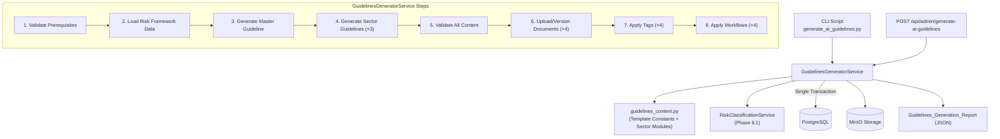
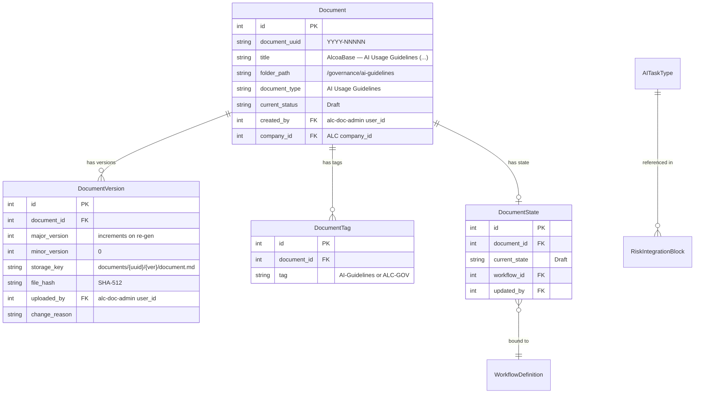
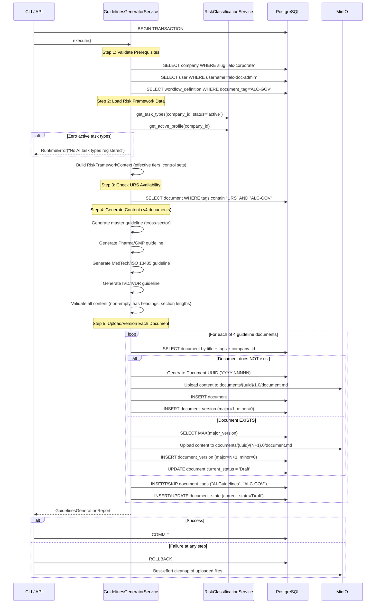

# Design Document: Cross-Sector AI Regulatory Guidelines

## Overview

This design describes the `Guidelines_Generator_Service` — a backend service that programmatically generates AI usage guideline documents (1 master cross-sector + 3 sector-specific), uploads them into the ALC corporate governance environment, applies tags and the governance workflow, and supports versioning on re-execution.

The service follows the same architectural pattern established by `URSGeneratorService` in Phase 8.3 and `ALCSeedService` in Phase 8.2:
1. **Atomicity**: All operations (4 document generations + uploads + tags + workflows) execute within a single database transaction. Any failure triggers a complete rollback.
2. **Idempotency**: First invocation creates new Documents; subsequent invocations create new DocumentVersion records for existing documents (matched by title + tags + company_id) rather than duplicates.
3. **Dual Interface**: Accessible via CLI script (`uv run python -m alcoabase.scripts.generate_ai_guidelines`) and REST API endpoint (`POST /api/admin/generate-ai-guidelines`).
4. **Risk Integration**: Dynamically queries the Risk_Classification_Service (Phase 8.1) for active AI_Task_Types, their effective risk tiers, and control sets to compose Risk_Integration_Blocks within each guideline.

The guideline content is generated from deterministic Python template constants combined with dynamic risk framework data — not AI-generated at runtime. This ensures version-controlled, reproducible output suitable for a regulated GxP environment while reflecting the current risk classification state.

### Design Decisions

| Decision | Rationale |
|----------|-----------|
| Guideline content as Python template constants + dynamic risk data | Regulatory text is deterministic and auditable; risk tier data is dynamic to reflect current classifications |
| Separate `guidelines_content.py` module | Isolates large Markdown template constants and sector module definitions from service orchestration logic |
| Four documents in one transaction | Ensures all-or-nothing consistency — partial guideline sets would be confusing for governance |
| Reuse `URSGeneratorService` pattern | Proven pattern for document creation, versioning, tagging, and workflow application |
| Per-document existence detection by title + tags | Each of the 4 documents is independently versioned; allows partial re-generation if one document's title changes |
| Risk data queried at generation time | Guidelines always reflect current risk profile; no stale cached data |
| Sector modules as configuration objects | Easy to add new sectors (e.g., Food/HACCP) without changing service logic |
| Content validation with Markdown heading check | Catches template rendering failures before upload |
| Concurrency guard via DB advisory lock | Prevents duplicate generation if triggered simultaneously from CLI and API |

## Architecture



The service follows the existing layered architecture:
- **Content Layer**: `services/guidelines_content.py` — template constants, sector module definitions, content assembly functions
- **Service Layer**: `services/guidelines_generator_service.py` — orchestrates generation, risk integration, upload, tagging, workflow
- **API Layer**: `api/admin_guidelines.py` — thin route handler with auth and error handling
- **CLI Layer**: `scripts/generate_ai_guidelines.py` — async main, session management, JSON report

## Components and Interfaces

### GuidelinesGeneratorService

The core service class orchestrating guideline generation and upload for all 4 documents.

```python
class GuidelinesGeneratorService:
    """Orchestrates AI regulatory guideline generation, upload, and workflow application.
    
    Generates 4 documents (1 master + 3 sector-specific) within a single
    database transaction. The service does NOT commit — the caller (API route
    or CLI) manages the transaction boundary.
    
    Follows the same pattern as URSGeneratorService (Phase 8.3).
    """
    
    def __init__(
        self,
        session: AsyncSession,
        storage_service: StorageService | None = None,
        uuid_service: UUIDService | None = None,
    ) -> None: ...
    
    async def execute(self) -> GuidelinesGenerationReport:
        """Run the full guidelines generation sequence for all 4 documents.
        
        Returns a GuidelinesGenerationReport summarizing all created/versioned documents.
        
        Raises:
            RuntimeError: If any prerequisite is missing, risk data unavailable,
                or content validation fails.
        """
        ...
    
    async def _validate_prerequisites(self) -> tuple[Company, User, WorkflowDefinition]:
        """Validate ALC company, doc-admin user, and governance workflow exist.
        
        Checks in order: company → doc-admin → workflow → AI task types.
        Halts on first failure with a descriptive error message.
        
        Returns:
            Tuple of (company, doc_admin_user, workflow_definition).
        
        Raises:
            RuntimeError: If any prerequisite is missing.
        """
        ...
    
    async def _load_risk_framework_data(
        self, company: Company
    ) -> RiskFrameworkContext:
        """Query the Risk Classification Service for active AI task types and tiers.
        
        Retrieves all active AI_Task_Types, the active Company_Risk_Profile
        (or defaults), and TIER_DEFINITIONS to compose Risk_Integration_Blocks.
        
        Args:
            company: The ALC company entity.
        
        Returns:
            RiskFrameworkContext containing task types, effective tiers, and control sets.
        
        Raises:
            RuntimeError: If zero active AI_Task_Types are found.
        """
        ...
    
    async def _check_urs_availability(self, company: Company) -> bool:
        """Check if the Enhanced_URS document exists for URS cross-references.
        
        Returns:
            True if URS document with tags ["URS", "ALC-GOV"] exists, False otherwise.
        """
        ...
    
    async def _generate_master_guideline(
        self,
        risk_context: RiskFrameworkContext,
        version_number: int,
        urs_available: bool,
    ) -> str:
        """Generate the cross-sector master guideline Markdown content.
        
        Assembles: header, purpose/scope, regulatory framework overview,
        risk classification summary, AI feature usage policies (one per task type),
        human oversight requirements, audit/evidence requirements, prohibited uses,
        glossary, and URS traceability references.
        
        Args:
            risk_context: Risk framework data for Risk_Integration_Blocks.
            version_number: Version number to embed in header.
            urs_available: Whether to include URS_Reference_Blocks.
        
        Returns:
            Complete master guideline Markdown string.
        """
        ...
    
    async def _generate_sector_guideline(
        self,
        sector: SectorModule,
        risk_context: RiskFrameworkContext,
        version_number: int,
        urs_available: bool,
    ) -> str:
        """Generate a sector-specific guideline Markdown content.
        
        Assembles: header, sector regulatory context, sector-specific risk
        considerations, AI feature usage policies with sector restrictions,
        validation requirements, record keeping requirements, and cross-references.
        
        Args:
            sector: The sector module configuration (Pharma/MedTech/IVD).
            risk_context: Risk framework data for sector risk mapping table.
            version_number: Version number to embed in header.
            urs_available: Whether to include URS cross-references.
        
        Returns:
            Complete sector guideline Markdown string.
        
        Raises:
            RuntimeError: If any section has fewer than 100 characters of content.
        """
        ...
    
    def _validate_content(self, content: str, document_title: str) -> None:
        """Validate guideline content is non-empty and contains Markdown headings.
        
        Args:
            content: The generated Markdown content.
            document_title: Title for error reporting.
        
        Raises:
            RuntimeError: If content is empty or contains no Markdown headings.
        """
        ...
    
    def _validate_section_lengths(self, content: str, document_title: str) -> None:
        """Validate that no section in a sector guideline has < 100 chars of content.
        
        Args:
            content: The generated Markdown content.
            document_title: Title for error reporting.
        
        Raises:
            RuntimeError: If any section fails the minimum content check.
        """
        ...
    
    async def _upload_or_version_document(
        self,
        title: str,
        content: str,
        company: Company,
        doc_admin: User,
        workflow: WorkflowDefinition,
    ) -> DocumentResult:
        """Create a new document or new version, apply tags and workflow.
        
        Detects existing document by title + tags ["AI-Guidelines", "ALC-GOV"]
        + company_id. Creates new Document if not found, or new DocumentVersion
        if found.
        
        Args:
            title: Document title for matching and creation.
            content: Markdown content to upload.
            company: ALC company entity.
            doc_admin: Document administrator user.
            workflow: Governance workflow definition.
        
        Returns:
            DocumentResult with document_id, uuid, version, is_new, tags, state.
        """
        ...
    
    async def _detect_existing_document(
        self, title: str, company: Company
    ) -> Document | None:
        """Find existing guideline document by title + tags + company_id.
        
        Returns:
            The existing Document if found, None otherwise.
        """
        ...
    
    async def _apply_tags(self, document: Document, is_new: bool) -> list[str]:
        """Apply "AI-Guidelines" and "ALC-GOV" tags (skip if already present).
        
        Returns:
            List of tag strings applied.
        """
        ...
    
    async def _apply_workflow(
        self, document: Document, workflow: WorkflowDefinition, doc_admin: User
    ) -> str:
        """Create/reset DocumentState to "Draft" for the governance workflow.
        
        Returns:
            The workflow state string ("Draft").
        """
        ...
```

### Guidelines Content Module

```python
# src/backend/src/alcoabase/services/guidelines_content.py
"""AI Regulatory Guidelines content templates and sector module definitions.

Contains the template constants, sector module configurations, and content
assembly functions for generating AI usage guideline documents. Content is
deterministic and version-controlled; dynamic risk data is injected at
generation time from the Risk Classification Service (Phase 8.1).

The module defines:
- MASTER_GUIDELINE_TITLE: Title for the cross-sector master document
- SECTOR_MODULES: List of SectorModule configurations (Pharma, MedTech, IVD)
- REGULATORY_FRAMEWORKS: Static regulatory framework reference data
- PROHIBITED_USES: List of universally prohibited AI operations
- Template assembly functions for each document section
"""

from dataclasses import dataclass, field


@dataclass(frozen=True)
class RegulatoryFramework:
    """A regulatory framework referenced in guidelines."""
    identifier: str          # e.g., "EU_AI_Act"
    display_name: str        # e.g., "EU AI Act (Regulation 2024/1689)"
    key_articles: list[str]  # e.g., ["Article 14 — Human Oversight"]


@dataclass(frozen=True)
class SectorModule:
    """Configuration for a sector-specific guideline document."""
    sector_id: str           # e.g., "pharma_gmp"
    title: str               # Full document title
    sector_label: str        # e.g., "Pharma / GMP"
    applicable_regulations: list[RegulatoryFramework]
    dedicated_subsections: list[str]  # Required subsection topics
    risk_elevation_rules: dict[str, str]  # task_type_id -> elevation rationale


MASTER_GUIDELINE_TITLE: str = "AlcoaBase — AI Usage Guidelines (Cross-Sector)"

PHARMA_GUIDELINE_TITLE: str = "AlcoaBase — AI Usage Guidelines (Pharma / GMP)"

MEDTECH_GUIDELINE_TITLE: str = "AlcoaBase — AI Usage Guidelines (MedTech / ISO 13485)"

IVD_GUIDELINE_TITLE: str = "AlcoaBase — AI Usage Guidelines (IVD / IVDR)"

GUIDELINE_TAGS: list[str] = ["AI-Guidelines", "ALC-GOV"]

GUIDELINE_DOCUMENT_TYPE: str = "AI Usage Guidelines"

REGULATORY_FRAMEWORKS: list[RegulatoryFramework] = [...]  # EU AI Act, 21 CFR 11, etc.

PROHIBITED_USES: list[str] = [
    "Using AI outputs as sole basis for batch release decisions without human verification",
    "Bypassing HITL checkpoints for High-tier operations",
    "Using AI-generated content in regulatory submissions without formal review and approval",
    "Disabling audit logging for any AI operation",
]

SECTOR_MODULES: list[SectorModule] = [...]  # Pharma, MedTech, IVD configs
```

### RiskFrameworkContext (Internal Data Transfer Object)

```python
@dataclass
class RiskFrameworkContext:
    """Aggregated risk framework data for guideline content assembly.
    
    Loaded once at the start of generation and passed to all content
    assembly functions to avoid repeated DB queries.
    """
    task_types: list[AITaskType]           # All active AI task types
    effective_tiers: dict[str, str]        # task_type_id -> effective tier level
    tier_definitions: dict[str, TierDefinitionResponse]  # tier_level -> controls
    company_profile_active: bool           # Whether a company-specific profile exists
    risk_factors_map: dict[str, list[str]] # task_type_id -> risk_factors array
```

### DocumentResult (Internal Result Object)

```python
@dataclass
class DocumentResult:
    """Result of a single document upload/version operation."""
    document_id: int
    document_uuid: str
    title: str
    sector: str              # "cross-sector", "pharma_gmp", "medtech_iso13485", "ivd_ivdr"
    version_number: int
    is_new_document: bool
    tags_applied: list[str]
    workflow_state: str
```

### CLI Script Interface

```python
# src/backend/src/alcoabase/scripts/generate_ai_guidelines.py
"""ALC AI Regulatory Guidelines Generation Script.

Generates 4 AI usage guideline documents (1 master + 3 sector-specific),
uploads them into the ALC corporate governance environment, applies tags
and the governance workflow, and supports versioning on re-execution.

All operations execute within a single database transaction.

Usage:
    uv run python -m alcoabase.scripts.generate_ai_guidelines

Exit codes:
    0 — Success (GuidelinesGenerationReport printed to stdout as JSON)
    1 — Failure (error details printed to stderr as JSON)
"""
```

### API Endpoint Interface

```
POST /api/admin/generate-ai-guidelines
Headers:
    Authorization: Bearer {token}  (system_administrator or document_administrator role)
    X-Change-Reason: {reason}      (required by audit middleware)
Response 200: GuidelinesGenerationReport JSON
Response 400: Missing X-Change-Reason
Response 401: Unauthorized
Response 403: Insufficient permissions
Response 409: Generation already in progress
Response 500: Generation failed (with error details)
```

## Data Models

### GuidelinesGenerationReport Schema

```python
class GuidelinesGenerationReport(BaseModel):
    """Complete report of AI guidelines generation and upload."""
    documents_created: list[DocumentReportEntry]
    total_documents: int                    # Always 4 on success
    total_policy_sections: int              # Sum across all documents
    risk_tiers_referenced: list[str]        # e.g., ["high", "medium", "low"]
    regulatory_frameworks_covered: list[str] # Framework identifiers used
    total_duration_ms: int


class DocumentReportEntry(BaseModel):
    """Report entry for a single generated guideline document."""
    document_id: int
    document_uuid: str
    title: str
    sector: str                  # "cross-sector" | "pharma_gmp" | "medtech_iso13485" | "ivd_ivdr"
    version_number: int
    tags_applied: list[str]
    workflow_state: str          # "Draft"
    is_new_document: bool
    policy_section_count: int


class GuidelinesGenerationError(BaseModel):
    """Error response when guidelines generation fails."""
    error: str
    failed_operation: str        # prerequisite_check | risk_data_load | content_generation | document_upload | tag_application | workflow_assignment
    document_title: str | None = None
    detail: str | None = None
```

### Document Storage Pattern

Each guideline document follows the existing Document/DocumentVersion pattern:



### Execution Flow



### Content Structure — Master Guideline

```
# AlcoaBase — AI Usage Guidelines (Cross-Sector)
## Document Header
  - Version: {N}
  - Generated: {ISO 8601 timestamp}
  - Applicable Regulations: EU AI Act, 21 CFR Part 11, EU GMP Annex 11, ISO 13485, IVDR 2017/746
  - Revision History Table

## Purpose and Scope
## Regulatory Framework Overview
## Risk Classification Summary
  - Risk_Integration_Block per AI_Task_Type (display_name, tier, controls, HITL, audit depth)
## AI Feature Usage Policies
  - Policy_Section per AI_Task_Type:
    - (a) Permitted Uses
    - (b) Restrictions
    - (c) Compliance Procedure (3–15 steps)
    - (d) Required Evidence and Documentation
    - (e) Consequences of Non-Compliance
## Human Oversight Requirements
## Audit and Evidence Requirements
## Prohibited Uses
## Roles and Responsibilities
## Periodic Review
## Glossary
## URS Traceability References (or notice if URS unavailable)
## Regulatory Reference Table
```

### Content Structure — Sector Guideline (Pharma/GMP example)

```
# AlcoaBase — AI Usage Guidelines (Pharma / GMP)
## Document Header
  - Version: {N}
  - Generated: {ISO 8601 timestamp}
  - Applicable Regulations: GMP Annex 11, 21 CFR Part 11, EU GMP Chapter 4, ICH Q9/Q10

## Sector Regulatory Context
  - Per-regulation article references
## Sector-Specific Risk Considerations
  - Additional risk factors per AI_Task_Type
## AI Feature Usage Policies (sector-specific restrictions)
  - Policy_Section per AI_Task_Type with sector overlay
## Sector Risk Mapping Table
  - AI_Task_Type | Base Tier | Elevation Recommendation | Additional Controls | Regulatory Reference
## Validation Requirements
## Record Keeping Requirements
## Dedicated Subsections:
  - GMP Data Integrity (ALCOA+ applied to AI, EU GMP Annex 11 §7)
  - CSV Expectations (GAMP 5 categories 3/4/5)
  - AI Model Qualification (ICH Q9 risk assessment)
  - Change Control for AI Updates (EU GMP Chapter 4)
## Roles and Responsibilities
## Periodic Review
## Cross-References (master guideline + URS)
## Regulatory Reference Table
```


## Correctness Properties

*A property is a characteristic or behavior that should hold true across all valid executions of a system — essentially, a formal statement about what the system should do. Properties serve as the bridge between human-readable specifications and machine-verifiable correctness guarantees.*

### Property 1: Document structure invariant

*For any* set of N active AI_Task_Types (where N ≥ 1), the generated master guideline SHALL contain all required sections (Document Header, Purpose and Scope, Regulatory Framework Overview, Risk Classification Summary, AI Feature Usage Policies, Human Oversight Requirements, Audit and Evidence Requirements, Prohibited Uses, Roles and Responsibilities, Periodic Review, Glossary, URS Traceability References, Regulatory Reference Table) in the specified order, and *for any* sector guideline, it SHALL contain all required sector sections (Document Header, Sector Regulatory Context, Sector-Specific Risk Considerations, AI Feature Usage Policies, Sector Risk Mapping Table, Validation Requirements, Record Keeping Requirements, Cross-References, Regulatory Reference Table) in the specified order.

**Validates: Requirements 1.2, 2.2**

### Property 2: Risk data completeness in guidelines

*For any* active AI_Task_Type with an assigned effective tier, the generated guideline SHALL contain a Risk_Integration_Block with: the task_type display_name, the effective tier level, all controls from the tier's Control_Set (HITL requirements, audit depth, validations, output labeling, expiry windows, rate limits), and the risk_factors array from the AI_Task_Type registry.

**Validates: Requirements 1.3, 4.2, 4.3**

### Property 3: Policy section structural completeness

*For any* active AI_Task_Type and *for any* guideline document (master or sector), the generated Policy_Section SHALL contain exactly 5 subsections in order: (a) permitted uses, (b) restrictions, (c) compliance procedure with 3–15 numbered steps, (d) required evidence and documentation, and (e) consequences of non-compliance.

**Validates: Requirements 1.4, 7.3**

### Property 4: Sector non-contradiction invariant

*For any* AI_Task_Type and *for any* sector-specific guideline, the sector's risk tier recommendation SHALL be greater than or equal to the master guideline's tier for that task type, and the sector's control set SHALL be a superset of (or equal to) the master guideline's control set. Where additional requirements exist, they SHALL be annotated as "Supplementary to base policy".

**Validates: Requirements 2.7**

### Property 5: Section minimum content validation

*For any* sector-specific guideline and *for any* section within that guideline, if the section content (excluding the section header) contains fewer than 100 characters, the content validation SHALL raise a RuntimeError identifying the section name and the sector guideline title.

**Validates: Requirements 2.8**

### Property 6: Document governance completeness

*For any* successfully generated guideline document, there SHALL exist: a Document record with content_type "text/markdown" and created_by referencing the alc-doc-admin user, a document_uuid matching the pattern `\d{4}-\d{5}`, DocumentTag records for both "AI-Guidelines" and "ALC-GOV", and a DocumentState record with current_state="Draft" linked to the ALC Governance workflow.

**Validates: Requirements 3.1, 3.2, 3.3, 3.4, 3.5**

### Property 7: Effective tier resolution

*For any* AI_Task_Type, if the active Company_Risk_Profile contains a tier override for that task type, the effective tier used in guideline generation SHALL be the override value; otherwise it SHALL be the AI_Task_Type's default_risk_tier. If no active Company_Risk_Profile exists, all task types SHALL resolve to their default_risk_tier and the guideline SHALL include a notice indicating default classifications are applied.

**Validates: Requirements 4.1, 4.5**

### Property 8: Transaction atomicity on failure

*For any* step in the generation sequence (prerequisite validation, risk data loading, content generation, document upload, tag application, or workflow assignment) that raises an exception, the database SHALL contain zero new Document, DocumentVersion, DocumentTag, or DocumentState records from the current generation attempt after rollback, and the state SHALL be identical to the state before the service was invoked.

**Validates: Requirements 5.3, 6.7, 8.5**

### Property 9: Versioning idempotency

*For any* number of successive invocations N (where N ≥ 1) of the GuidelinesGeneratorService against the same ALC company, there SHALL exist exactly one Document record per guideline title (4 total) with tags ["AI-Guidelines", "ALC-GOV"], each with exactly N DocumentVersion records with strictly increasing major_version numbers. After each invocation, the DocumentState for each document SHALL have current_state="Draft". The report SHALL indicate is_new_document=true for the first invocation and is_new_document=false for all subsequent invocations.

**Validates: Requirements 6.1, 6.3, 6.4, 6.5**

### Property 10: Report accuracy

*For any* successful execution of the GuidelinesGeneratorService, the returned GuidelinesGenerationReport SHALL contain: documents_created with exactly 4 entries (one per guideline), total_documents equal to 4, total_policy_sections equal to the actual sum of Policy_Sections across all 4 documents, risk_tiers_referenced containing exactly the set of tier levels used in generation, regulatory_frameworks_covered containing all framework identifiers referenced, and total_duration_ms as a positive integer.

**Validates: Requirements 5.4, 6.5**

### Property 11: Content validation correctness

*For any* string passed to content validation, the validation SHALL pass if and only if the string is non-empty AND contains at least one Markdown heading (matching the pattern `^#{1,3}\s`). For any string that fails validation, the error message SHALL include the document title that produced the invalid output.

**Validates: Requirements 8.6, 8.7**

### Property 12: Regulatory citation completeness

*For any* control requirement stated in a guideline, there SHALL be an inline citation containing a regulation name and specific article/section number, OR the annotation "Regulatory reference: Industry best practice — no specific article applicable". *For any* generated guideline, the Regulatory Reference Table SHALL contain at minimum one row per distinct regulation cited in the document body, with each row containing: regulation name, article/section number, requirement summary (≤500 characters), and ALC response (≤1000 characters).

**Validates: Requirements 7.1, 7.2, 7.7**

### Property 13: Policy section count invariant

*For any* set of N active AI_Task_Types (where N ≥ 8), the master guideline SHALL contain exactly N Policy_Sections. *For any* sector guideline, it SHALL contain at least 6 Policy_Sections. The total_policy_sections in the report SHALL equal the actual count of Policy_Sections across all 4 documents.

**Validates: Requirements 1.1, 7.5**

## Error Handling

| Failure Scenario | Behavior | Recovery |
|-----------------|----------|----------|
| ALC company not found | Abort immediately with "ALC corporate environment not provisioned. Run Phase 8.2 seed first." | Run `seed_alc_corporate` first |
| Doc-admin user not found | Abort with "ALC Document Administrator user not found. Run Phase 8.2 seed first." | Run `seed_alc_corporate` first |
| Governance workflow not found | Abort with "ALC Governance workflow not found. Run Phase 8.2 seed first." | Run `seed_alc_corporate` first |
| Zero active AI_Task_Types | Abort with "No AI task types registered. Run Phase 8.1 seed first." | Run Phase 8.1 risk framework seed |
| Risk framework data unavailable | Abort with "Risk framework data unavailable" | Fix DB connectivity, re-run |
| Content validation fails (empty/no headings) | Abort with "{title} produced invalid output" | Fix template constants |
| Section content < 100 chars | Abort with "Section '{name}' in '{title}' has insufficient content" | Fix sector module template |
| MinIO upload fails | Abort, no DB records created (upload before INSERT) | Fix MinIO connectivity, re-run |
| DB transaction failure | Full rollback, best-effort MinIO cleanup | Fix DB issue, re-run (idempotent) |
| Concurrent generation attempt | Reject with "Generation already in progress" (HTTP 409) | Wait for current generation to complete |
| URS document not found | Proceed with generation, omit URS_Reference_Blocks, include notice | Generate URS (Phase 8.3) for full traceability |
| API called without auth | HTTP 401, no operations executed | Authenticate with appropriate role |
| API called without X-Change-Reason | HTTP 400, no operations executed | Include required header |
| API called with insufficient role | HTTP 403, no operations executed | Use system_administrator or document_administrator role |

### Error Response Schema

```python
class GuidelinesGenerationError(BaseModel):
    """Error response when guidelines generation fails."""
    error: str                        # Human-readable error message
    failed_operation: str             # Step name that failed
    document_title: str | None = None # Which document failed (if applicable)
    detail: str | None = None         # Additional context
```

### Prerequisite Check Order

Prerequisites are validated in this strict order (halts on first failure):
1. ALC_Company existence (slug "alc-corporate")
2. ALC Document Administrator existence (username "alc-doc-admin")
3. Governance_Workflow existence (document_tag "ALC-GOV")
4. AI_Task_Types availability (at least 1 active)

### Logging Strategy

- **INFO**: Each step completion (prerequisites validated, risk data loaded, content generated per document, document created/versioned, tags applied, workflow applied)
- **WARNING**: URS document not found (proceeding without cross-references), no active Company_Risk_Profile (using defaults)
- **ERROR**: Prerequisites missing, transaction failures, content validation failures, concurrent generation rejection

All log entries include a structured `guidelines_step` field for filtering.

## Testing Strategy

### Property-Based Tests (Hypothesis)

Property-based testing is appropriate for this feature because the `GuidelinesGeneratorService` has clear input/output behavior (risk framework state + DB prerequisites → generated content + DB records + report) and universal properties (structural invariants, tier resolution, non-contradiction, atomicity, idempotency, report accuracy) that should hold across varying sets of AI_Task_Types and tier configurations.

**Library**: Hypothesis (already in project dependencies)
**Location**: `src/backend/tests/properties/test_guidelines_generator_properties.py`
**Configuration**: Minimum 100 iterations per property test

Each property test will:
- Generate random sets of AI_Task_Types with varying tiers, risk_factors, and module_references
- Generate random Company_Risk_Profile overrides (or no profile)
- Execute the guidelines generator service (or content assembly functions)
- Assert the property holds

Tag format: `Feature: Step_8-4_cross-sector-ai-regulatory-guidelines, Property {N}: {title}`

**Property tests to implement:**
1. Property 1: Document structure invariant — generate content with random task type sets, verify section ordering
2. Property 2: Risk data completeness — generate Risk_Integration_Blocks with random task types/tiers, verify all fields present
3. Property 3: Policy section structural completeness — generate Policy_Sections with random task types, verify 5 subsections in order
4. Property 4: Sector non-contradiction — generate sector guidelines with random tier assignments, verify no sector assigns lower tier
5. Property 5: Section minimum content validation — generate content with varying section lengths, verify validation catches short sections
6. Property 6: Document governance completeness — run service with valid prerequisites, verify all expected records exist
7. Property 7: Effective tier resolution — generate random default tiers and overrides, verify correct resolution
8. Property 8: Transaction atomicity — simulate failures at each step, verify rollback leaves no partial state
9. Property 9: Versioning idempotency — run service N times (N drawn from 1–5), verify single Document per title with N versions
10. Property 10: Report accuracy — run service, verify report fields match actual DB state and content
11. Property 11: Content validation correctness — generate random strings (some valid, some invalid), verify validation logic
12. Property 12: Regulatory citation completeness — generate content with random task types, verify citations present for all controls
13. Property 13: Policy section count invariant — generate with N task types, verify correct counts in master and sector guidelines

### Unit Tests

**Location**: `src/backend/tests/unit/test_guidelines_generator_service.py`

| Test | What it verifies |
|------|-----------------|
| `test_validate_prerequisites_all_present` | Returns company, user, workflow when all exist |
| `test_validate_prerequisites_no_company` | Raises RuntimeError with "Run Phase 8.2 seed first" |
| `test_validate_prerequisites_no_doc_admin` | Raises RuntimeError with expected message |
| `test_validate_prerequisites_no_workflow` | Raises RuntimeError with expected message |
| `test_validate_prerequisites_order` | Checks company before doc-admin before workflow |
| `test_load_risk_framework_zero_task_types` | Raises RuntimeError with "No AI task types registered" |
| `test_load_risk_framework_with_profile` | Uses company override tiers |
| `test_load_risk_framework_no_profile` | Uses default tiers, sets company_profile_active=False |
| `test_check_urs_available` | Returns True when URS document exists |
| `test_check_urs_unavailable` | Returns False when URS document missing |
| `test_generate_master_guideline_structure` | Content has all required sections |
| `test_generate_master_guideline_risk_blocks` | Risk_Integration_Blocks present for each task type |
| `test_generate_master_guideline_prohibited_uses` | All 4 prohibited operations listed |
| `test_generate_master_guideline_urs_notice` | Notice included when URS unavailable |
| `test_generate_sector_guideline_pharma` | Pharma guideline has 4 dedicated subsections |
| `test_generate_sector_guideline_medtech` | MedTech guideline has 4 dedicated subsections |
| `test_generate_sector_guideline_ivd` | IVD guideline has 4 dedicated subsections |
| `test_generate_sector_guideline_mapping_table` | Mapping table has all task types with required columns |
| `test_generate_sector_no_lower_tier` | Sector never assigns lower tier than master |
| `test_validate_content_valid` | Passes for non-empty content with headings |
| `test_validate_content_empty` | Raises RuntimeError for empty content |
| `test_validate_content_no_headings` | Raises RuntimeError for content without headings |
| `test_validate_section_lengths_valid` | Passes when all sections ≥ 100 chars |
| `test_validate_section_lengths_short` | Raises RuntimeError identifying short section |
| `test_detect_existing_document_found` | Returns Document when title + tags match |
| `test_detect_existing_document_not_found` | Returns None when no match |
| `test_upload_new_document_attributes` | Document has correct title, type, company_id, created_by |
| `test_upload_new_version_increments` | New version has major_version = previous + 1 |
| `test_apply_tags_new_document` | Both "AI-Guidelines" and "ALC-GOV" tags created |
| `test_apply_tags_existing_no_duplicates` | Tags not duplicated on re-run |
| `test_apply_workflow_new_document` | DocumentState created with state="Draft" |
| `test_apply_workflow_version_reset` | DocumentState reset to "Draft" on new version |
| `test_report_structure_all_new` | Report has 4 entries, all is_new_document=True |
| `test_report_structure_mixed` | Report correctly identifies new vs versioned |
| `test_header_contains_version_and_timestamp` | Header has version N and ISO 8601 timestamp |
| `test_header_contains_regulatory_frameworks` | Header lists all 5 frameworks |
| `test_policy_section_subsection_count` | Each Policy_Section has exactly 5 subsections |
| `test_roles_and_responsibilities_mappings` | Correct role-to-responsibility mappings |
| `test_periodic_review_section` | References review_cycle_days setting |
| `test_regulatory_reference_table_present` | Table exists with required columns |
| `test_urs_reference_block_pattern` | References match "Implements: REQ-{MODULE}-{NN}" |

### Integration Tests

**Location**: `src/backend/tests/integration/test_guidelines_generator_integration.py`

| Test | What it verifies |
|------|-----------------|
| `test_cli_success` | CLI exits 0, stdout is valid JSON GuidelinesGenerationReport |
| `test_cli_failure_no_prerequisites` | CLI exits 1, stderr has JSON error with failed_operation |
| `test_api_endpoint_success` | POST returns 200 with GuidelinesGenerationReport |
| `test_api_endpoint_unauthorized` | POST without auth returns 401 |
| `test_api_endpoint_forbidden` | POST with non-admin role returns 403 |
| `test_api_endpoint_missing_header` | POST without X-Change-Reason returns 400 |
| `test_full_idempotent_run` | Two consecutive runs produce 4 Documents with 2 versions each |
| `test_partial_existence` | Some documents exist, others don't — correct new/version behavior |
| `test_documents_appear_in_governance_folder` | Documents with tags appear in virtual folder query |
| `test_concurrent_generation_rejected` | Simultaneous requests — second gets 409 |
| `test_generation_with_urs_available` | URS_Reference_Blocks included when URS exists |
| `test_generation_without_urs` | Notice included when URS missing |
| `test_generation_with_company_risk_profile` | Overrides reflected in guidelines |
| `test_generation_with_default_tiers` | Defaults used with notice when no profile |
| `test_rollback_on_upload_failure` | No partial documents after MinIO failure |
