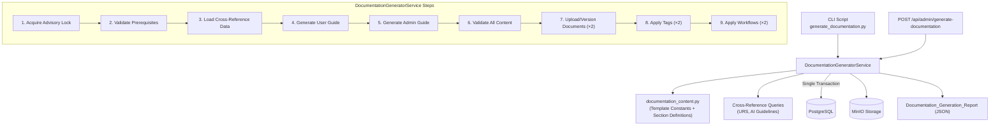
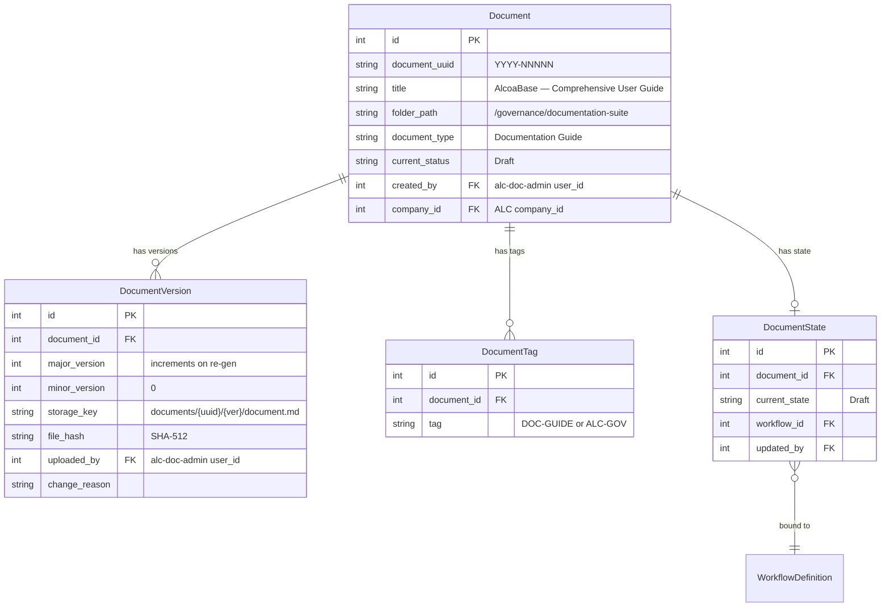
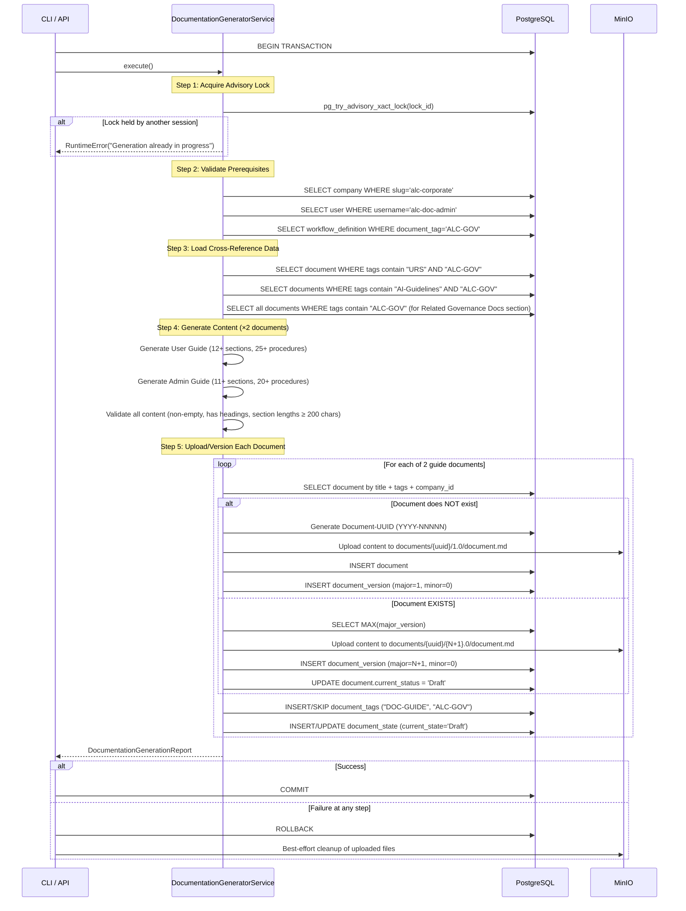

# Design Document: Documentation Suite — User & Admin Guides

## Overview

This design describes the `Documentation_Generator_Service` — a backend service that programmatically generates two comprehensive guide documents (User Guide + Admin Guide), uploads them into the ALC corporate governance environment, applies tags and the governance workflow, and supports versioning on re-execution.

The service follows the same architectural pattern established by `GuidelinesGeneratorService` in Phase 8.4 and `URSGeneratorService` in Phase 8.3:
1. **Atomicity**: All operations (2 document generations + uploads + tags + workflows) execute within a single database transaction. Any failure triggers a complete rollback.
2. **Idempotency**: First invocation creates new Documents; subsequent invocations create new DocumentVersion records for existing documents (matched by title + tags + company_id) rather than duplicates.
3. **Dual Interface**: Accessible via CLI script (`uv run python -m alcoabase.scripts.generate_documentation`) and REST API endpoint (`POST /api/admin/generate-documentation`).
4. **Cross-Reference Integration**: Dynamically queries for existing governance documents (URS, AI Guidelines) to include cross-references where available.

The guide content is generated from deterministic Python template constants combined with dynamic cross-reference data — not AI-generated at runtime. This ensures version-controlled, reproducible output suitable for a regulated GxP environment.

### Design Decisions

| Decision | Rationale |
|----------|-----------|
| Guide content as Python template constants + dynamic cross-refs | Documentation text is deterministic and auditable; cross-reference data is dynamic to reflect current governance state |
| Separate `documentation_content.py` module | Isolates large Markdown template constants and section definitions from service orchestration logic |
| Two documents in one transaction | Ensures all-or-nothing consistency — partial guide sets would be confusing for governance |
| Reuse `GuidelinesGeneratorService` pattern | Proven pattern for document creation, versioning, tagging, and workflow application |
| Per-document existence detection by title + tags | Each of the 2 documents is independently versioned; allows partial re-generation if one document's title changes |
| Cross-reference data queried at generation time | Guides always reflect current governance document state; no stale cached data |
| Guide sections as configuration objects | Easy to add new sections without changing service logic |
| Content validation with Markdown heading check + minimum section length (200 chars) | Catches template rendering failures before upload |
| Concurrency guard via DB advisory lock | Prevents duplicate generation if triggered simultaneously from CLI and API |
| Screenshot placeholders as Markdown image refs | Allows manual screenshot insertion during review without blocking automated generation |
| Procedure_Block formatting with bold action verbs and italic outcomes | Consistent, scannable format for regulated documentation |

## Architecture



The service follows the existing layered architecture:
- **Content Layer**: `services/documentation_content.py` — template constants, section definitions, content assembly functions for both guides
- **Service Layer**: `services/documentation_generator_service.py` — orchestrates generation, cross-reference integration, upload, tagging, workflow
- **API Layer**: `api/admin_documentation.py` — thin route handler with auth and error handling
- **CLI Layer**: `scripts/generate_documentation.py` — async main, session management, JSON report

## Components and Interfaces

### DocumentationGeneratorService

The core service class orchestrating guide generation and upload for both documents.

```python
class DocumentationGeneratorService:
    """Orchestrates User Guide and Admin Guide generation, upload, and workflow application.
    
    Generates 2 documents (User Guide + Admin Guide) within a single
    database transaction. The service does NOT commit — the caller (API route
    or CLI) manages the transaction boundary.
    
    Follows the same pattern as GuidelinesGeneratorService (Phase 8.4).
    """
    
    def __init__(
        self,
        session: AsyncSession,
        storage_service: StorageService | None = None,
        uuid_service: UUIDService | None = None,
    ) -> None: ...
    
    async def execute(self) -> DocumentationGenerationReport:
        """Run the full documentation generation sequence for both guides.
        
        Returns a DocumentationGenerationReport summarizing all created/versioned documents.
        
        Raises:
            RuntimeError: If any prerequisite is missing or content validation fails.
        """
        ...
    
    async def _acquire_advisory_lock(self) -> None:
        """Acquire a PostgreSQL advisory lock to prevent concurrent generation.
        
        Uses a fixed lock ID derived from the service name. Non-blocking —
        raises RuntimeError immediately if lock is held by another session.
        
        Raises:
            RuntimeError: If another generation is already in progress.
        """
        ...
    
    async def _validate_prerequisites(self) -> tuple[Company, User, WorkflowDefinition]:
        """Validate ALC company, doc-admin user, and governance workflow exist.
        
        Checks in order: company → doc-admin → workflow.
        Halts on first failure with a descriptive error message.
        
        Returns:
            Tuple of (company, doc_admin_user, workflow_definition).
        
        Raises:
            RuntimeError: If any prerequisite is missing.
        """
        ...
    
    async def _load_cross_reference_data(
        self, company: Company
    ) -> CrossReferenceContext:
        """Query for existing governance documents to build cross-references.
        
        Checks for:
        - Enhanced_URS document (tags ["URS", "ALC-GOV"])
        - AI Usage Guidelines documents (tags ["AI-Guidelines", "ALC-GOV"])
        
        Args:
            company: The ALC company entity.
        
        Returns:
            CrossReferenceContext with availability flags and document metadata.
        """
        ...
    
    async def _generate_user_guide(
        self,
        cross_refs: CrossReferenceContext,
        version_number: int,
    ) -> str:
        """Generate the User Guide Markdown content.
        
        Assembles: header, table of contents, getting started, document management,
        template builder, report data entry, workflows, training management,
        electronic signatures, search and knowledge base, AI agent interaction,
        AI document generator, and appendices.
        
        Args:
            cross_refs: Cross-reference data for URS/AI Guidelines links.
            version_number: Version number to embed in header.
        
        Returns:
            Complete User Guide Markdown string.
        """
        ...
    
    async def _generate_admin_guide(
        self,
        cross_refs: CrossReferenceContext,
        version_number: int,
    ) -> str:
        """Generate the Admin Guide Markdown content.
        
        Assembles: header, table of contents, administration overview,
        user management, RBAC, system configuration, AI model layer,
        storage and backup, audit trail, compliance monitoring,
        agent registry, workflow administration, and appendices.
        
        Args:
            cross_refs: Cross-reference data for URS/AI Guidelines links.
            version_number: Version number to embed in header.
        
        Returns:
            Complete Admin Guide Markdown string.
        """
        ...
    
    def _validate_content(self, content: str, document_title: str) -> None:
        """Validate guide content is non-empty and contains Markdown headings.
        
        Args:
            content: The generated Markdown content.
            document_title: Title for error reporting.
        
        Raises:
            RuntimeError: If content is empty or contains no Markdown headings.
        """
        ...
    
    def _validate_section_lengths(self, content: str, document_title: str) -> None:
        """Validate that no section has < 200 chars of content (excluding headers/placeholders).
        
        Args:
            content: The generated Markdown content.
            document_title: Title for error reporting.
        
        Raises:
            RuntimeError: If any section fails the minimum content check.
        """
        ...
    
    async def _upload_or_version_document(
        self,
        title: str,
        content: str,
        guide_type: str,
        company: Company,
        doc_admin: User,
        workflow: WorkflowDefinition,
    ) -> DocumentReportEntry:
        """Create a new document or new version, apply tags and workflow.
        
        Detects existing document by title + tags ["DOC-GUIDE", "ALC-GOV"]
        + company_id. Creates new Document if not found, or new DocumentVersion
        if found.
        
        Args:
            title: Document title for matching and creation.
            content: Markdown content to upload.
            guide_type: "user_guide" or "admin_guide".
            company: ALC company entity.
            doc_admin: Document administrator user.
            workflow: Governance workflow definition.
        
        Returns:
            DocumentReportEntry with document_id, uuid, version, is_new, tags, state.
        """
        ...
    
    async def _detect_existing_document(
        self, title: str, company: Company
    ) -> Document | None:
        """Find existing guide document by title + tags + company_id.
        
        Returns:
            The existing Document if found, None otherwise.
        """
        ...
    
    async def _apply_tags(self, document: Document, is_new: bool) -> list[str]:
        """Apply "DOC-GUIDE" and "ALC-GOV" tags (skip if already present).
        
        Returns:
            List of tag strings applied.
        """
        ...
    
    async def _apply_workflow(
        self, document: Document, workflow: WorkflowDefinition, doc_admin: User
    ) -> str:
        """Create/reset DocumentState to "Draft" for the governance workflow.
        
        Returns:
            The workflow state string ("Draft").
        """
        ...
    
    async def _get_next_version_number(self, document: Document) -> int:
        """Get the next version number for an existing document.
        
        Returns:
            The next major_version number (current max + 1).
        """
        ...
    
    def _count_sections(self, content: str) -> int:
        """Count level-2 headings (## ) in the generated content.
        
        Returns:
            Number of Guide_Sections.
        """
        ...
    
    def _count_procedures(self, content: str) -> int:
        """Count Procedure_Blocks in the generated content.
        
        Procedure_Blocks are identified by the pattern '### Procedure:' or
        numbered step sequences starting with '1. **'.
        
        Returns:
            Number of Procedure_Blocks.
        """
        ...
    
    def _count_screenshot_placeholders(self, content: str) -> int:
        """Count screenshot placeholder image references.
        
        Matches pattern: 
        
        Returns:
            Number of Screenshot_Placeholders.
        """
        ...
```

### Documentation Content Module

```python
# src/backend/src/alcoabase/services/documentation_content.py
"""Documentation Suite content templates and section definitions.

Contains the template constants, section configurations, and content
assembly functions for generating User Guide and Admin Guide documents.
Content is deterministic and version-controlled; dynamic cross-reference
data is injected at generation time from governance document queries.

The module defines:
- USER_GUIDE_TITLE: Title for the User Guide document
- ADMIN_GUIDE_TITLE: Title for the Admin Guide document
- USER_GUIDE_SECTIONS: Ordered list of UserGuideSection configurations
- ADMIN_GUIDE_SECTIONS: Ordered list of AdminGuideSection configurations
- DOCUMENTATION_TAGS: Tags applied to both documents ["DOC-GUIDE", "ALC-GOV"]
- Template assembly functions for each document section
"""

from dataclasses import dataclass, field


@dataclass(frozen=True)
class ProcedureBlock:
    """A numbered procedure within a guide section."""
    title: str                    # e.g., "Uploading a Document"
    steps: list[str]              # 3-15 numbered steps, each starting with action verb
    screenshot_slug: str          # kebab-case slug for screenshot path


@dataclass(frozen=True)
class UserGuideSection:
    """Configuration for a section in the User Guide."""
    section_id: str              # e.g., "document-management"
    title: str                   # e.g., "Document Management"
    overview: str                # Plain language overview (min 50 chars)
    procedures: list[ProcedureBlock]
    tips: list[str]              # At least 2 practical recommendations
    cross_ref_sections: list[str]  # Related section IDs within the guide
    urs_requirement_ids: list[str]  # e.g., ["REQ-DOC-01", "REQ-DOC-02"]
    ai_guidelines_ref: bool = False  # Whether to include AI guidelines cross-ref


@dataclass(frozen=True)
class AdminGuideSection:
    """Configuration for a section in the Admin Guide."""
    section_id: str              # e.g., "user-management"
    title: str                   # e.g., "User Management"
    overview: str                # Administrative function overview (min 80 chars)
    prerequisites: list[str]     # Required roles/permissions
    procedures: list[ProcedureBlock]
    security_considerations: str  # Audit implications and compliance impact
    cross_ref_sections: list[str]  # Related admin section IDs
    user_guide_refs: list[str]   # Related User Guide section IDs
    urs_requirement_ids: list[str]
    ai_guidelines_ref: bool = False


@dataclass
class CrossReferenceContext:
    """Aggregated cross-reference data for guide content assembly.
    
    Loaded once at the start of generation and passed to all content
    assembly functions to avoid repeated DB queries.
    """
    urs_available: bool                    # Whether Enhanced_URS exists
    urs_document_uuid: str | None = None   # URS document UUID if available
    urs_document_title: str | None = None  # URS document title if available
    ai_guidelines_available: bool = False  # Whether AI Guidelines exist
    ai_guidelines_documents: list[dict] = field(default_factory=list)  # [{title, uuid, state}]
    governance_documents: list[dict] = field(default_factory=list)     # All ALC-GOV docs for reference section


USER_GUIDE_TITLE: str = "AlcoaBase — Comprehensive User Guide"

ADMIN_GUIDE_TITLE: str = "AlcoaBase — Technical Administrator Guide"

DOCUMENTATION_TAGS: list[str] = ["DOC-GUIDE", "ALC-GOV"]

DOCUMENTATION_DOCUMENT_TYPE: str = "Documentation Guide"

USER_GUIDE_SECTIONS: list[UserGuideSection] = [...]  # 12 sections defined

ADMIN_GUIDE_SECTIONS: list[AdminGuideSection] = [...]  # 11 sections defined
```

### CLI Script Interface

```python
# src/backend/src/alcoabase/scripts/generate_documentation.py
"""ALC Documentation Suite Generation Script.

Generates 2 guide documents (User Guide + Admin Guide), uploads them into
the ALC corporate governance environment, applies tags and the governance
workflow, and supports versioning on re-execution.

All operations execute within a single database transaction.

Usage:
    uv run python -m alcoabase.scripts.generate_documentation

Exit codes:
    0 — Success (DocumentationGenerationReport printed to stdout as JSON)
    1 — Failure (error details printed to stderr as JSON)
"""
```

### API Endpoint Interface

```
POST /api/admin/generate-documentation
Headers:
    Authorization: Bearer {token}  (system_administrator or document_administrator role)
    X-Change-Reason: {reason}      (required by audit middleware)
Response 200: DocumentationGenerationReport JSON
Response 400: Missing X-Change-Reason
Response 401: Unauthorized
Response 403: Insufficient permissions
Response 409: Generation already in progress
Response 500: Generation failed (with error details)
```

## Data Models

### DocumentationGenerationReport Schema

```python
class DocumentationGenerationReport(BaseModel):
    """Complete report of documentation suite generation and upload."""
    documents_created: list[DocumentReportEntry]
    total_documents: int                          # Always 2 on success
    total_sections: int                           # Sum of sections across both guides
    total_procedures: int                         # Sum of Procedure_Blocks across both guides
    cross_references_included: CrossReferenceSummary
    total_duration_ms: int


class DocumentReportEntry(BaseModel):
    """Report entry for a single generated guide document."""
    document_id: int
    document_uuid: str
    title: str
    guide_type: str                  # "user_guide" | "admin_guide"
    version_number: int
    tags_applied: list[str]
    workflow_state: str              # "Draft"
    is_new_document: bool
    section_count: int
    procedure_count: int
    screenshot_placeholder_count: int


class CrossReferenceSummary(BaseModel):
    """Summary of cross-references included in generated guides."""
    urs_references: bool             # Whether URS cross-refs were included
    ai_guidelines_references: bool   # Whether AI Guidelines cross-refs were included


class DocumentationGenerationError(BaseModel):
    """Error response when documentation generation fails."""
    error: str
    failed_operation: str            # prerequisite_check | cross_reference_load | content_generation | document_upload | tag_application | workflow_assignment
    document_title: str | None = None
    detail: str | None = None
```

### Document Storage Pattern

Each guide document follows the existing Document/DocumentVersion pattern:



### Execution Flow



### Content Structure — User Guide

```
# AlcoaBase — Comprehensive User Guide
## Document Header
  - Title, Version: {N}, Generated: {ISO 8601}, Target Audience: End-Users
  - Applicable Platform Version, Revision History Table

## Table of Contents
  - Auto-generated from level-2 and level-3 headings with section numbers

## 1. Getting Started
  - System access prerequisites (browser, network)
  - Login procedure with re-authentication explanation
  - Main navigation overview (sidebar menu items)
  - Quick-start workflow: upload first document → view in virtual folder
  - Screenshot_Placeholders, Tips, Cross_Reference_Block

## 2. Document Management
  - Single document upload (file, title, folder, type, tags)
  - Bulk upload overview (CLI tool reference)
  - Virtual folder creation and navigation
  - Document versioning (new versions, change reason, version history)
  - Document metadata editing
  - Screenshot_Placeholders, Tips, Cross_Reference_Block

## 3. Template Builder
  - Creating forms, field types, drag-and-drop layout, saving templates
  - Screenshot_Placeholders, Tips, Cross_Reference_Block

## 4. Report Data Entry and PDF Extraction
  - Filling forms, uploading offline PDFs, Dual-UUID extraction
  - Screenshot_Placeholders, Tips, Cross_Reference_Block

## 5. Workflows
  - Understanding document states, triggering transitions, viewing history
  - Screenshot_Placeholders, Tips, Cross_Reference_Block

## 6. Training Management
  - Viewing assigned training, completing tasks, quiz interaction
  - Screenshot_Placeholders, Tips, Cross_Reference_Block

## 7. Electronic Signatures
  - Re-authentication, signing documents, viewing signature status
  - Screenshot_Placeholders, Tips, Cross_Reference_Block

## 8. Search and Knowledge Base
  - Hybrid search (queries, relevance scores, faceted filters)
  - RAG Knowledge Base (asking questions, source citations, conversation history)
  - Understanding AI-generated answers with source attribution
  - AI Guidelines cross-reference (if available)
  - Screenshot_Placeholders, Tips, Cross_Reference_Block

## 9. AI Agent Interaction
  - Understanding multi-agent review reports
  - Interpreting compliance scorecards and finding severity ratings
  - Master auditor summary
  - Training ecosystem integration (quizzes, materials, role-play)
  - AI Guidelines cross-reference (if available)
  - Screenshot_Placeholders, Tips, Cross_Reference_Block

## 10. AI Document Generator
  - Selecting templates, generating documents, reviewing AI output
  - AI Guidelines cross-reference (if available)
  - Screenshot_Placeholders, Tips, Cross_Reference_Block

## 11. Related Governance Documents
  - List of all ALC-GOV documents with title, UUID, workflow state

## 12. Appendices
  - Keyboard Shortcuts
  - Glossary (all technical terms, acronyms, platform terminology)
  - Troubleshooting
  - URS Traceability References (or notice if URS unavailable)
```

### Content Structure — Admin Guide

```
# AlcoaBase — Technical Administrator Guide
## Document Header
  - Title, Version: {N}, Generated: {ISO 8601}, Target Audience: Administrators
  - Applicable Platform Version, Revision History Table

## Table of Contents
  - Auto-generated from level-2 and level-3 headings with section numbers

## 1. Administration Overview
  - Admin roles, responsibilities, access levels
  - Prerequisites, Security Considerations, Cross_Reference_Block

## 2. User Management
  - CRUD operations, role assignment, company assignment
  - Activation/deactivation, password reset, permission templates
  - Prerequisites, Security Considerations, Cross_Reference_Block

## 3. Role-Based Access Control
  - RBAC model, predefined roles, custom role creation, permission inheritance
  - Prerequisites, Security Considerations, Cross_Reference_Block

## 4. System Configuration
  - AI hardware settings (GPU/CPU/mock modes, performance implications)
  - Storage quotas, backup configuration
  - System health monitoring, service status (DB, Redis, OpenSearch, MinIO, vLLM)
  - Prerequisites, Security Considerations, Cross_Reference_Block

## 5. AI Model Layer Management
  - vLLM service configuration, model weight management
  - GPU allocation, CPU fallback, mock mode
  - Embedding model configuration, OCR pipeline settings
  - Inference timeout and rate limit configuration
  - Prerequisites, Security Considerations, Cross_Reference_Block

## 6. Storage and Backup
  - MinIO configuration, storage quotas, backup schedules, data retention
  - Prerequisites, Security Considerations, Cross_Reference_Block

## 7. Audit Trail Administration
  - Viewing audit logs, filtering/search, export to PDF
  - Interpreting audit entries
  - Prerequisites, Security Considerations, Cross_Reference_Block

## 8. Compliance Monitoring
  - Compliance scorecards, agent review configuration
  - Regulatory framework settings, AI Risk and Compliance Framework tiers
  - AI Guidelines cross-reference (if available)
  - Prerequisites, Security Considerations, Cross_Reference_Block

## 9. Agent Registry Management
  - Agent archetype YAML structure (personality, domain, prompts, temperature, etc.)
  - Adding/modifying agents, hot-reload mechanism
  - Company-specific audit profiles (agent assignment, frameworks, thresholds, quorum)
  - Prerequisites, Security Considerations, Cross_Reference_Block

## 10. Workflow Administration
  - BPMN editor usage, workflow definition management
  - Document lifecycle configuration
  - Prerequisites, Security Considerations, Cross_Reference_Block

## 11. Related Governance Documents
  - List of all ALC-GOV documents with title, UUID, workflow state

## 12. Appendices
  - CLI Reference (generate_urs_alc, generate_ai_guidelines, generate_documentation, bulk_upload, ensure_tables)
  - API Endpoints Summary
  - Environment Variables (name, description, default, component)
  - Glossary
  - Troubleshooting
  - URS Traceability References (or notice if URS unavailable)
```


## Correctness Properties

*A property is a characteristic or behavior that should hold true across all valid executions of a system — essentially, a formal statement about what the system should do. Properties serve as the bridge between human-readable specifications and machine-verifiable correctness guarantees.*

### Property 1: Document structure invariant

*For any* CrossReferenceContext (with URS available or not, AI Guidelines available or not), the generated User Guide SHALL contain all 12 required top-level sections (Getting Started, Document Management, Template Builder, Report Data Entry and PDF Extraction, Workflows, Training Management, Electronic Signatures, Search and Knowledge Base, AI Agent Interaction, AI Document Generator, Related Governance Documents, Appendices) in the specified order, and the generated Admin Guide SHALL contain all 12 required top-level sections (Administration Overview, User Management, Role-Based Access Control, System Configuration, AI Model Layer Management, Storage and Backup, Audit Trail Administration, Compliance Monitoring, Agent Registry Management, Workflow Administration, Related Governance Documents, Appendices) in the specified order.

**Validates: Requirements 1.2, 2.2**

### Property 2: Section subsection completeness

*For any* section in the generated User Guide, it SHALL contain: (a) an overview paragraph of at least 50 characters, (b) at least one Procedure_Block, (c) at least one Screenshot_Placeholder per Procedure_Block, (d) a "Tips and Best Practices" subsection with at least 2 recommendations, and (e) a Cross_Reference_Block. *For any* section in the generated Admin Guide, it SHALL contain: (a) an overview paragraph of at least 80 characters, (b) a "Prerequisites" subsection, (c) at least one Procedure_Block, (d) at least one Screenshot_Placeholder per Procedure_Block, (e) a "Security Considerations" subsection, and (f) a Cross_Reference_Block.

**Validates: Requirements 1.3, 2.3**

### Property 3: Procedure_Block structural validity

*For any* Procedure_Block in any generated guide (User Guide or Admin Guide), it SHALL contain between 3 and 15 numbered steps (inclusive), each step SHALL begin with a bold action verb (e.g., **Click**, **Navigate**, **Enter**, **Select**, **Verify**), and each step SHALL include an expected outcome or visual confirmation in italics following the action description.

**Validates: Requirements 1.4, 6.3**

### Property 4: Screenshot_Placeholder format invariant

*For any* Screenshot_Placeholder in any generated guide, it SHALL match the pattern `` where section-slug and action-slug are non-empty kebab-case identifiers (matching `[a-z0-9]+(-[a-z0-9]+)*`).

**Validates: Requirements 6.4**

### Property 5: Cross-reference conditional inclusion

*For any* CrossReferenceContext where urs_available=True, the generated guides SHALL include Requirement_ID cross-references matching the pattern "Implements: REQ-{MODULE}-{NN}" in relevant sections. *For any* CrossReferenceContext where urs_available=False, the guides SHALL omit URS cross-references and include the notice "URS cross-references unavailable — generate URS (Phase 8.3) for full traceability." *For any* CrossReferenceContext where ai_guidelines_available=True, the AI-related sections (Search and Knowledge Base, AI Agent Interaction, AI Document Generator in User Guide; Compliance Monitoring in Admin Guide) SHALL include explicit cross-references to the AI Guidelines documents. *For any* CrossReferenceContext where ai_guidelines_available=False, those sections SHALL include the notice "AI Usage Guidelines cross-references unavailable — generate guidelines (Phase 8.4) for compliance context."

**Validates: Requirements 1.9, 1.10, 7.2, 7.3, 7.6, 7.7**

### Property 6: Document governance completeness

*For any* successfully generated guide document, there SHALL exist: a Document record with content_type "text/markdown" and created_by referencing the alc-doc-admin user, a document_uuid matching the pattern `\d{4}-\d{5}`, DocumentTag records for both "DOC-GUIDE" and "ALC-GOV", a DocumentState record with current_state="Draft" linked to the ALC Governance workflow, and a change_reason containing "Documentation Suite Generation — Phase 8.5 automated governance document creation".

**Validates: Requirements 3.1, 3.2, 3.3, 3.4, 3.5**

### Property 7: Transaction atomicity on failure

*For any* step in the generation sequence (advisory lock acquisition, prerequisite validation, cross-reference loading, content generation, document upload, tag application, or workflow assignment) that raises an exception, the database SHALL contain zero new Document, DocumentVersion, DocumentTag, or DocumentState records from the current generation attempt after rollback, and the state SHALL be identical to the state before the service was invoked.

**Validates: Requirements 4.3, 5.7, 8.4, 8.8**

### Property 8: Versioning idempotency

*For any* number of successive invocations N (where N ≥ 1) of the DocumentationGeneratorService against the same ALC company, there SHALL exist exactly one Document record per guide title (2 total) with tags ["DOC-GUIDE", "ALC-GOV"], each with exactly N DocumentVersion records with strictly increasing major_version numbers (1, 2, ..., N). After each invocation, the DocumentState for each document SHALL have current_state="Draft". The report SHALL indicate is_new_document=true for the first invocation and is_new_document=false for all subsequent invocations. Each of the two guide documents SHALL be evaluated independently for existence.

**Validates: Requirements 5.1, 5.4, 5.5, 5.6**

### Property 9: Report accuracy

*For any* successful execution of the DocumentationGeneratorService, the returned DocumentationGenerationReport SHALL contain: documents_created with exactly 2 entries (one per guide), total_documents equal to 2, total_sections equal to the actual count of level-2 headings across both documents (with User Guide ≥ 10 and Admin Guide ≥ 10), total_procedures equal to the actual count of Procedure_Blocks across both documents (with User Guide ≥ 25 and Admin Guide ≥ 20), cross_references_included.urs_references matching whether URS was available, cross_references_included.ai_guidelines_references matching whether AI Guidelines were available, and total_duration_ms as a positive integer.

**Validates: Requirements 4.4, 6.5, 6.6**

### Property 10: Document header completeness

*For any* generated guide document with version number N, the document header SHALL contain: the document title, version number N (integer), generation timestamp in ISO 8601 format with timezone offset, target audience ("End-Users" for User Guide, "Administrators" for Admin Guide), applicable platform version, and a revision history table.

**Validates: Requirements 5.3, 6.1**

### Property 11: Table of Contents consistency

*For any* generated guide document, the Table of Contents section SHALL list all level-2 and level-3 headings present in the document body with their section numbers, and every entry in the Table of Contents SHALL correspond to an actual heading in the document.

**Validates: Requirements 6.2**

### Property 12: Content validation correctness

*For any* string passed to content validation, the validation SHALL pass if and only if the string is non-empty AND contains at least one Markdown heading (matching the pattern `^#{1,3}\s`). *For any* section in a guide that contains fewer than 200 characters of content (excluding section headers and Screenshot_Placeholders), the section length validation SHALL raise a RuntimeError identifying the section name and the guide title. For any string that fails validation, the error message SHALL include the document title that produced the invalid output.

**Validates: Requirements 6.8, 8.5, 8.6**

### Property 13: Prerequisite check ordering

*For any* combination of missing prerequisites (ALC_Company, alc-doc-admin user, Governance_Workflow), the service SHALL check in the order: company → doc-admin → workflow, SHALL halt on the first failing check, and SHALL return the error message corresponding to the first missing prerequisite without executing subsequent checks.

**Validates: Requirements 8.7**

### Property 14: Inter-guide cross-references

*For any* generated User Guide, sections where administrative action is required SHALL contain a cross-reference to the Admin Guide (pattern: "see Admin Guide Section"). *For any* generated Admin Guide, sections where end-user impact is described SHALL contain a cross-reference to the User Guide (pattern: "see User Guide Section").

**Validates: Requirements 7.4, 7.5**

### Property 15: Related Governance Documents completeness

*For any* set of documents with tag "ALC-GOV" in the ALC_Company at generation time, the "Related Governance Documents" section in each guide SHALL list every such document with its title, document UUID, and current workflow state.

**Validates: Requirements 7.1**

## Error Handling

| Failure Scenario | Behavior | Recovery |
|-----------------|----------|----------|
| ALC company not found | Abort immediately with "ALC corporate environment not provisioned. Run Phase 8.2 seed first." | Run `seed_alc_corporate` first |
| Doc-admin user not found | Abort with "ALC Document Administrator user not found. Run Phase 8.2 seed first." | Run `seed_alc_corporate` first |
| Governance workflow not found | Abort with "ALC Governance workflow not found. Run Phase 8.2 seed first." | Run `seed_alc_corporate` first |
| Content validation fails (empty/no headings) | Abort with "{title} produced invalid output" | Fix template constants |
| Section content < 200 chars | Abort with "Section '{name}' in '{title}' has insufficient content ({N} chars, minimum 200)" | Fix section template content |
| MinIO upload fails | Abort, no DB records created (upload before INSERT) | Fix MinIO connectivity, re-run |
| DB transaction failure | Full rollback, best-effort MinIO cleanup | Fix DB issue, re-run (idempotent) |
| Concurrent generation attempt | Reject with "Generation already in progress" (HTTP 409) | Wait for current generation to complete |
| URS document not found | Proceed with generation, omit URS cross-references, include notice | Generate URS (Phase 8.3) for full traceability |
| AI Guidelines not found | Proceed with generation, omit AI Guidelines cross-references, include notice | Generate AI Guidelines (Phase 8.4) for compliance context |
| One guide fails after other succeeds | Roll back entire transaction (both guides) | Fix the failing template, re-run |
| API called without auth | HTTP 401, no operations executed | Authenticate with appropriate role |
| API called without X-Change-Reason | HTTP 400, no operations executed | Include required header |
| API called with insufficient role | HTTP 403, no operations executed | Use system_administrator or document_administrator role |

### Error Response Schema

```python
class DocumentationGenerationError(BaseModel):
    """Error response when documentation generation fails."""
    error: str                        # Human-readable error message
    failed_operation: str             # Step name that failed
    document_title: str | None = None # Which document failed (if applicable)
    detail: str | None = None         # Additional context
```

### Prerequisite Check Order

Prerequisites are validated in this strict order (halts on first failure):
1. ALC_Company existence (slug "alc-corporate")
2. ALC Document Administrator existence (username "alc-doc-admin")
3. Governance_Workflow existence (document_tag "ALC-GOV")

### Logging Strategy

- **INFO**: Each step completion (prerequisites validated, cross-references loaded, content generated per guide, document created/versioned, tags applied, workflow applied)
- **WARNING**: URS document not found (proceeding without cross-references), AI Guidelines not found (proceeding without cross-references)
- **ERROR**: Prerequisites missing, transaction failures, content validation failures, concurrent generation rejection

All log entries include a structured `documentation_step` field for filtering.

## Testing Strategy

### Property-Based Tests (Hypothesis)

Property-based testing is appropriate for this feature because the `DocumentationGeneratorService` has clear input/output behavior (cross-reference state + DB prerequisites → generated content + DB records + report) and universal properties (structural invariants, formatting rules, conditional cross-references, atomicity, idempotency, report accuracy) that should hold across varying cross-reference states.

**Library**: Hypothesis (already in project dependencies)
**Location**: `src/backend/tests/properties/test_documentation_generator_properties.py`
**Configuration**: Minimum 100 iterations per property test

Each property test will:
- Generate random CrossReferenceContext states (URS available/unavailable, AI Guidelines available/unavailable, varying governance document sets)
- Execute the documentation generator service (or content assembly functions)
- Assert the property holds

Tag format: `Feature: Step_8-5_documentation-suite-user-admin-guides, Property {N}: {title}`

**Property tests to implement:**
1. Property 1: Document structure invariant — generate content with random cross-ref states, verify section ordering
2. Property 2: Section subsection completeness — generate sections with random cross-ref states, verify all required subsections present
3. Property 3: Procedure_Block structural validity — generate procedure blocks, verify step count (3-15), bold action verbs, italic outcomes
4. Property 4: Screenshot_Placeholder format — generate content, verify all placeholders match required pattern with kebab-case slugs
5. Property 5: Cross-reference conditional inclusion — generate with random urs_available/ai_guidelines_available flags, verify correct inclusion/omission
6. Property 6: Document governance completeness — run service with valid prerequisites, verify all expected records exist
7. Property 7: Transaction atomicity — simulate failures at each step, verify rollback leaves no partial state
8. Property 8: Versioning idempotency — run service N times (N drawn from 1–5), verify single Document per title with N versions
9. Property 9: Report accuracy — run service, verify report fields match actual DB state and content counts
10. Property 10: Document header completeness — generate with random version numbers, verify all required header fields present
11. Property 11: Table of Contents consistency — generate content, verify ToC entries match actual headings bidirectionally
12. Property 12: Content validation correctness — generate random strings (some valid, some invalid), verify validation logic
13. Property 13: Prerequisite check ordering — test with random combinations of missing prerequisites, verify correct ordering
14. Property 14: Inter-guide cross-references — generate both guides, verify bidirectional cross-references present
15. Property 15: Related Governance Documents completeness — generate with random sets of ALC-GOV documents, verify all listed

### Unit Tests

**Location**: `src/backend/tests/unit/test_documentation_generator_service.py`

| Test | What it verifies |
|------|-----------------|
| `test_validate_prerequisites_all_present` | Returns company, user, workflow when all exist |
| `test_validate_prerequisites_no_company` | Raises RuntimeError with "Run Phase 8.2 seed first" |
| `test_validate_prerequisites_no_doc_admin` | Raises RuntimeError with expected message |
| `test_validate_prerequisites_no_workflow` | Raises RuntimeError with expected message |
| `test_validate_prerequisites_order` | Checks company before doc-admin before workflow |
| `test_load_cross_references_urs_available` | Returns context with urs_available=True and document metadata |
| `test_load_cross_references_urs_unavailable` | Returns context with urs_available=False |
| `test_load_cross_references_guidelines_available` | Returns context with ai_guidelines_available=True |
| `test_load_cross_references_guidelines_unavailable` | Returns context with ai_guidelines_available=False |
| `test_generate_user_guide_structure` | Content has all 12 required sections in order |
| `test_generate_user_guide_getting_started` | Getting Started has prerequisites, login, navigation, quick-start |
| `test_generate_user_guide_document_management` | Document Management covers upload, bulk, folders, versioning, metadata |
| `test_generate_user_guide_search_section` | Search section covers hybrid search, RAG, AI answers |
| `test_generate_user_guide_ai_agent_section` | AI Agent section covers reports, scorecards, severity, master auditor |
| `test_generate_user_guide_minimum_counts` | ≥10 sections, ≥25 procedures |
| `test_generate_admin_guide_structure` | Content has all 12 required sections in order |
| `test_generate_admin_guide_user_management` | User Management covers CRUD, roles, activation, password, permissions |
| `test_generate_admin_guide_system_config` | System Config covers AI hardware, quotas, backup, health, services |
| `test_generate_admin_guide_ai_model_layer` | AI Model covers vLLM, weights, GPU/CPU/mock, embedding, OCR, timeouts |
| `test_generate_admin_guide_agent_registry` | Agent Registry covers YAML, add/modify, hot-reload, audit profiles |
| `test_generate_admin_guide_compliance` | Compliance covers scorecards, thresholds, findings, risk workflow, tiers |
| `test_generate_admin_guide_cli_reference` | CLI appendix lists all 5 required commands with syntax and examples |
| `test_generate_admin_guide_env_vars` | Env vars appendix has name, description, default, component columns |
| `test_generate_admin_guide_minimum_counts` | ≥10 sections, ≥20 procedures |
| `test_validate_content_valid` | Passes for non-empty content with headings |
| `test_validate_content_empty` | Raises RuntimeError for empty content |
| `test_validate_content_no_headings` | Raises RuntimeError for content without headings |
| `test_validate_section_lengths_valid` | Passes when all sections ≥ 200 chars |
| `test_validate_section_lengths_short` | Raises RuntimeError identifying short section and guide |
| `test_detect_existing_document_found` | Returns Document when title + tags match |
| `test_detect_existing_document_not_found` | Returns None when no match |
| `test_upload_new_document_attributes` | Document has correct title, type, company_id, created_by |
| `test_upload_new_version_increments` | New version has major_version = previous + 1 |
| `test_apply_tags_new_document` | Both "DOC-GUIDE" and "ALC-GOV" tags created |
| `test_apply_tags_existing_no_duplicates` | Tags not duplicated on re-run |
| `test_apply_workflow_new_document` | DocumentState created with state="Draft" |
| `test_apply_workflow_version_reset` | DocumentState reset to "Draft" on new version |
| `test_report_structure_all_new` | Report has 2 entries, all is_new_document=True |
| `test_report_structure_mixed` | Report correctly identifies new vs versioned |
| `test_report_section_counts` | section_count matches actual level-2 headings per guide |
| `test_report_procedure_counts` | procedure_count matches actual Procedure_Blocks per guide |
| `test_report_screenshot_counts` | screenshot_placeholder_count matches actual placeholders |
| `test_report_cross_references_flags` | cross_references_included matches actual availability |
| `test_header_contains_version_and_timestamp` | Header has version N and ISO 8601 timestamp |
| `test_header_contains_target_audience` | User Guide says "End-Users", Admin Guide says "Administrators" |
| `test_toc_matches_headings` | ToC entries correspond to actual document headings |
| `test_procedure_block_step_count_bounds` | Each procedure has 3-15 steps |
| `test_procedure_block_action_verb_format` | Steps start with bold action verb |
| `test_procedure_block_outcome_format` | Steps include italic expected outcome |
| `test_screenshot_placeholder_pattern` | Placeholders match required format |
| `test_screenshot_placeholder_kebab_case` | Slugs are valid kebab-case |
| `test_urs_cross_refs_included_when_available` | REQ-{MODULE}-{NN} patterns present |
| `test_urs_cross_refs_omitted_when_unavailable` | Notice included instead |
| `test_ai_guidelines_refs_in_ai_sections` | Cross-refs in AI sections when available |
| `test_ai_guidelines_notice_when_unavailable` | Notice in AI sections when unavailable |
| `test_inter_guide_refs_user_to_admin` | User Guide references Admin Guide sections |
| `test_inter_guide_refs_admin_to_user` | Admin Guide references User Guide sections |
| `test_related_governance_docs_section` | Lists all ALC-GOV documents with title, UUID, state |
| `test_glossary_appendix_present` | Both guides have Glossary appendix |
| `test_count_sections_method` | _count_sections returns correct level-2 heading count |
| `test_count_procedures_method` | _count_procedures returns correct Procedure_Block count |
| `test_count_screenshot_placeholders_method` | _count_screenshot_placeholders returns correct count |
| `test_advisory_lock_acquired` | Lock acquired successfully on first call |
| `test_advisory_lock_concurrent_rejection` | Second call raises RuntimeError |

### Integration Tests

**Location**: `src/backend/tests/integration/test_documentation_generator_integration.py`

| Test | What it verifies |
|------|-----------------|
| `test_cli_success` | CLI exits 0, stdout is valid JSON DocumentationGenerationReport |
| `test_cli_failure_no_prerequisites` | CLI exits 1, stderr has JSON error with failed_operation |
| `test_api_endpoint_success` | POST returns 200 with DocumentationGenerationReport |
| `test_api_endpoint_unauthorized` | POST without auth returns 401 |
| `test_api_endpoint_forbidden` | POST with non-admin role returns 403 |
| `test_api_endpoint_missing_header` | POST without X-Change-Reason returns 400 |
| `test_full_idempotent_run` | Two consecutive runs produce 2 Documents with 2 versions each |
| `test_partial_existence` | One guide exists, other doesn't — correct new/version behavior |
| `test_documents_appear_in_governance_folder` | Documents with tags appear in virtual folder query |
| `test_concurrent_generation_rejected` | Simultaneous requests — second gets 409 |
| `test_generation_with_urs_available` | URS cross-references included when URS exists |
| `test_generation_without_urs` | Notice included when URS missing |
| `test_generation_with_ai_guidelines` | AI Guidelines cross-references included when guidelines exist |
| `test_generation_without_ai_guidelines` | Notice included when AI Guidelines missing |
| `test_rollback_on_upload_failure` | No partial documents after MinIO failure |
| `test_rollback_on_second_guide_failure` | First guide rolled back when second fails |
| `test_generation_timing_under_120s` | Both guides generated within 120 seconds |
