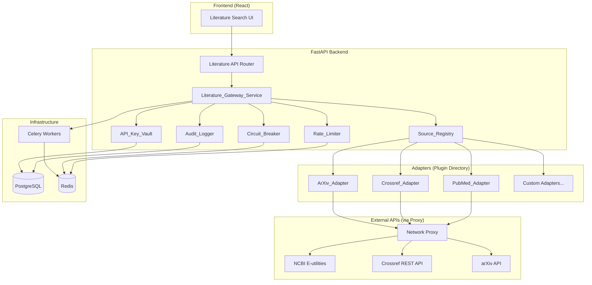
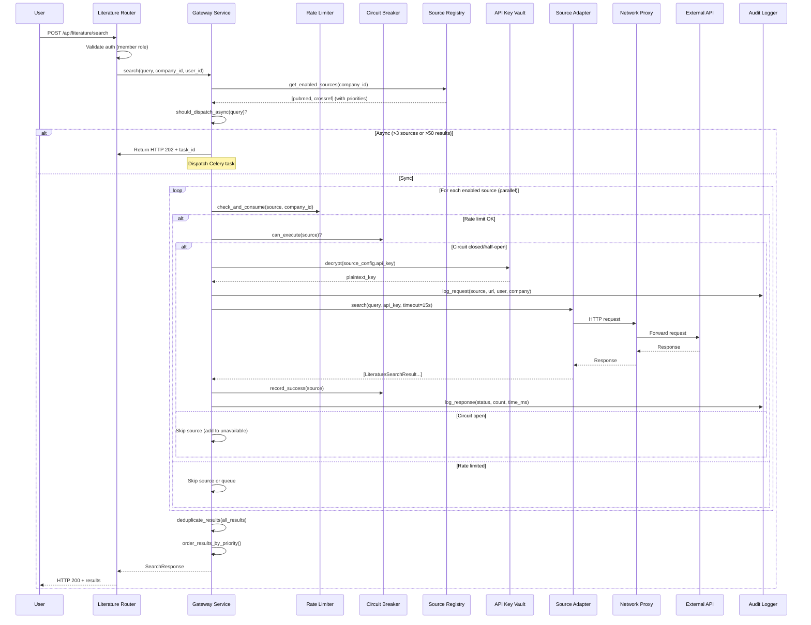
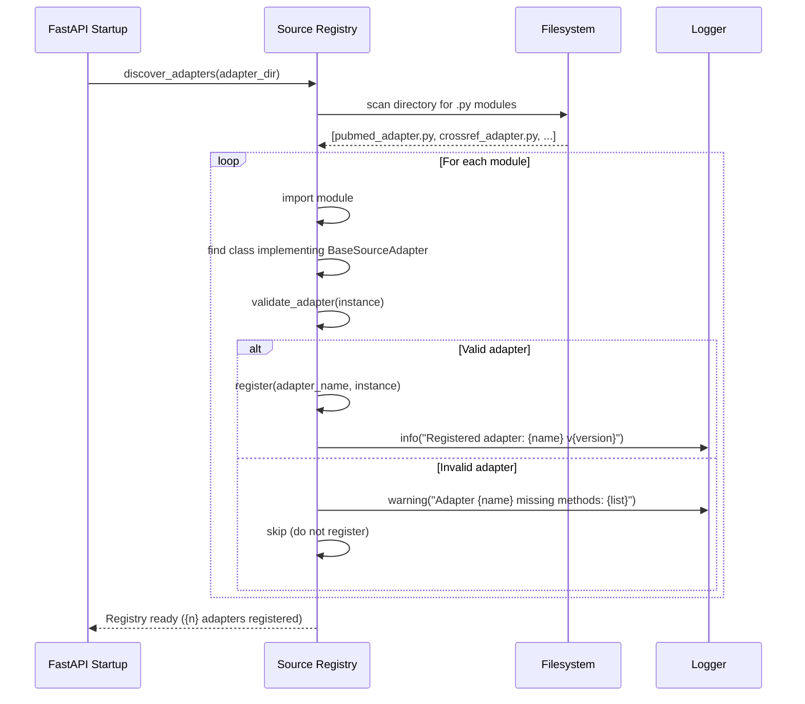
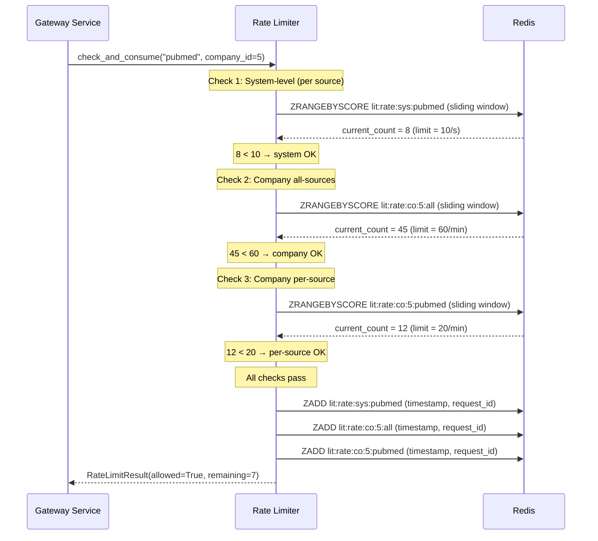

# Design Document: Literature Search Engine & External API Gateways (Phase 9.1)

## Overview

This design specifies the architecture for AlcoaBase's first controlled external network access feature — a multi-tenant literature search gateway that integrates with PubMed, Crossref, and arXiv. The system uses a plugin/adapter architecture for extensibility, encrypts API keys at rest with AES-256-GCM, enforces hierarchical rate limiting (system-wide and per-company), and provides circuit breaker resilience. All external interactions are audit-logged for GxP compliance.

### Key Design Decisions

| Decision | Choice | Rationale |
|----------|--------|-----------|
| Adapter discovery | Directory scanning at startup | Allows adding sources without code changes; restart-only avoids hot-reload complexity in regulated environment |
| Encryption | AES-256-GCM via `cryptography` library | NIST-approved AEAD cipher; nonce provides uniqueness; GCM tag provides integrity |
| Rate limiting backend | Redis sliding window (sorted sets) | Consistent across multiple workers; sub-second precision; existing infrastructure |
| Circuit breaker | In-memory + Redis hybrid | Fast local checks with Redis for cross-worker state sharing |
| Async search | Celery tasks with Redis result backend | Existing infrastructure; proven pattern in codebase |
| Result normalization | Pydantic models with strict validation | Type safety; automatic JSON serialization; round-trip guarantees |
| Proxy routing | httpx with proxy parameter | httpx already in stack; native proxy support; async-compatible |

## Architecture

### High-Level Architecture Diagram



### Package Layout

```
src/backend/src/alcoabase/
├── literature/                    # New top-level package for Phase 9.1
│   ├── __init__.py
│   ├── adapters/                  # Plugin directory (scanned at startup)
│   │   ├── __init__.py
│   │   ├── base.py               # Abstract base adapter interface
│   │   ├── pubmed_adapter.py     # Built-in PubMed adapter
│   │   ├── crossref_adapter.py   # Built-in Crossref adapter
│   │   └── arxiv_adapter.py      # Built-in arXiv adapter
│   ├── services/
│   │   ├── __init__.py
│   │   ├── gateway_service.py    # Literature_Gateway_Service orchestrator
│   │   ├── source_registry.py    # Source_Registry (discovery + health)
│   │   ├── rate_limiter.py       # Rate_Limiter (Redis-backed)
│   │   ├── circuit_breaker.py    # Circuit breaker logic
│   │   ├── api_key_vault.py      # AES-256-GCM encryption
│   │   ├── audit_logger.py       # External API audit logging
│   │   └── proxy_manager.py      # Proxy configuration management
│   ├── schemas/
│   │   ├── __init__.py
│   │   ├── search.py             # Search query/result schemas
│   │   ├── configuration.py      # Source config schemas
│   │   ├── profiles.py           # Search profile schemas
│   │   └── admin.py              # Admin endpoint schemas
│   └── models/
│       ├── __init__.py
│       └── literature.py         # All SQLAlchemy models for this feature
├── api/
│   └── literature_router.py      # New router file for /api/literature/*
├── tasks/
│   └── literature_search_tasks.py # Celery tasks for async search
└── config.py                      # Extended with literature settings
```

## Components and Interfaces

### Source Adapter Interface (Abstract Base)

```python
"""Abstract base class for all literature source adapters.

All adapters (built-in and custom) must implement this interface.
The Source_Registry validates compliance at registration time.

References:
    - Requirements 1.1, 1.4, 2.4
"""

from abc import ABC, abstractmethod
from dataclasses import dataclass
from typing import Any

from alcoabase.literature.schemas.search import (
    AdapterCapabilities,
    LiteratureSearchResult,
    SearchQuery,
)


@dataclass(frozen=True)
class AdapterMetadata:
    """Immutable metadata describing a source adapter.

    Attributes:
        name: Unique identifier for the adapter (e.g., "pubmed").
        version: Semantic version string (e.g., "1.0.0").
        display_name: Human-readable name (e.g., "PubMed / MEDLINE").
        requires_api_key: Whether this source requires an API key.
    """

    name: str
    version: str
    display_name: str
    requires_api_key: bool


class BaseSourceAdapter(ABC):
    """Abstract interface for literature source adapters.

    Implementations must provide all four methods. The Source_Registry
    validates this at startup via hasattr checks on the required methods.
    """

    @abstractmethod
    async def search(
        self,
        query: SearchQuery,
        api_key: str | None = None,
        timeout: float = 15.0,
    ) -> list[LiteratureSearchResult]:
        """Execute a search against the external API.

        Args:
            query: Structured search query with terms and filters.
            api_key: Decrypted API key (None for unauthenticated sources).
            timeout: Per-request timeout in seconds.

        Returns:
            List of normalized search results.

        Raises:
            AdapterAuthError: On HTTP 401/403 from external API.
            AdapterTimeoutError: On request timeout.
            AdapterParseError: On unparseable response.
            AdapterConnectionError: On network failure.
        """
        ...

    @abstractmethod
    async def get_metadata(self, external_id: str) -> dict[str, Any]:
        """Retrieve detailed metadata for a specific record.

        Args:
            external_id: Source-specific identifier (PMID, DOI, arXiv ID).

        Returns:
            Dict of metadata fields from the source.
        """
        ...

    @abstractmethod
    async def health_check(self) -> float:
        """Perform a lightweight health check against the external API.

        Returns:
            Response time in seconds. Raises on failure.

        Raises:
            AdapterConnectionError: If the source is unreachable.
        """
        ...

    @abstractmethod
    def get_capabilities(self) -> AdapterCapabilities:
        """Declare the query capabilities supported by this adapter.

        Returns:
            AdapterCapabilities describing supported fields and filters.
        """
        ...

    @abstractmethod
    def get_adapter_metadata(self) -> AdapterMetadata:
        """Return immutable metadata about this adapter.

        Returns:
            AdapterMetadata with name, version, display_name, requires_api_key.
        """
        ...
```

### Source Registry

```python
"""Source registry for adapter discovery, validation, and health monitoring.

References:
    - Requirements 1.1–1.8, 11.1–11.6
"""

from enum import StrEnum


class SourceStatus(StrEnum):
    """Health status classification for a source adapter."""

    AVAILABLE = "available"      # Responds within 5 seconds
    DEGRADED = "degraded"        # Responds but exceeds 5 seconds
    UNREACHABLE = "unreachable"  # Fails to respond or returns error


class SourceRegistry:
    """Manages adapter lifecycle: discovery, validation, health monitoring.

    Attributes:
        _adapters: Dict mapping adapter name to adapter instance.
        _health_status: Dict mapping adapter name to current SourceStatus.
        _health_history: Dict mapping adapter name to last 50 check results.
    """

    async def discover_adapters(self, adapter_dir: str) -> None:
        """Scan adapter directory and register valid adapters.

        Args:
            adapter_dir: Filesystem path to scan for adapter modules.
        """
        ...

    def validate_adapter(self, adapter: object) -> tuple[bool, list[str]]:
        """Validate that an object implements the full adapter interface.

        Args:
            adapter: Candidate adapter instance.

        Returns:
            Tuple of (is_valid, list_of_missing_methods).
        """
        ...

    def get_adapter(self, name: str) -> "BaseSourceAdapter | None":
        """Retrieve a registered adapter by name.

        Args:
            name: Adapter identifier.

        Returns:
            Adapter instance or None if not registered.
        """
        ...

    def list_adapters(self) -> list[dict]:
        """List all registered adapters with metadata and health status.

        Returns:
            List of dicts with name, version, capabilities, status.
        """
        ...

    async def run_health_check(self, adapter_name: str) -> SourceStatus:
        """Execute health check for a specific adapter.

        Args:
            adapter_name: Name of the adapter to check.

        Returns:
            Updated SourceStatus based on response time.
        """
        ...

    def classify_response_time(self, response_time_seconds: float) -> SourceStatus:
        """Classify a response time into a SourceStatus.

        Args:
            response_time_seconds: Measured response time.

        Returns:
            AVAILABLE if < 5s, DEGRADED if 5-15s, UNREACHABLE if > 15s.
        """
        ...
```

### API Key Vault

```python
"""AES-256-GCM encryption for API keys at rest.

References:
    - Requirements 4.1–4.6
"""

from dataclasses import dataclass


@dataclass(frozen=True)
class EncryptedKey:
    """Stored representation of an encrypted API key.

    Attributes:
        ciphertext: AES-256-GCM encrypted key bytes (base64-encoded for DB storage).
        nonce: 12-byte GCM nonce (base64-encoded).
        tag: 16-byte GCM authentication tag (base64-encoded).
    """

    ciphertext: str
    nonce: str
    tag: str


class APIKeyVault:
    """Manages encryption and decryption of API keys.

    The master key is derived from the ALC_LITERATURE_ENCRYPTION_KEY
    environment variable. Keys are only decrypted at the moment of
    outbound request construction.
    """

    def __init__(self, master_key: bytes) -> None:
        """Initialize vault with the master encryption key.

        Args:
            master_key: 32-byte AES-256 key derived from env var.

        Raises:
            ValueError: If master_key is not exactly 32 bytes.
        """
        ...

    def encrypt(self, plaintext_key: str) -> EncryptedKey:
        """Encrypt an API key using AES-256-GCM.

        Args:
            plaintext_key: The API key to encrypt (1–512 characters).

        Returns:
            EncryptedKey containing ciphertext, nonce, and tag.

        Raises:
            ValueError: If plaintext_key is empty or exceeds 512 characters.
        """
        ...

    def decrypt(self, encrypted: EncryptedKey) -> str:
        """Decrypt an API key from its stored representation.

        Args:
            encrypted: The EncryptedKey to decrypt.

        Returns:
            The original plaintext API key.

        Raises:
            InvalidTag: If the ciphertext has been tampered with.
        """
        ...

    @staticmethod
    def mask_key(plaintext_key: str) -> str:
        """Return a masked representation showing only last 4 characters.

        Args:
            plaintext_key: The key to mask.

        Returns:
            String like "****abcd" (asterisks + last 4 chars).
            For keys shorter than 4 chars, returns all asterisks.
        """
        ...
```

### Rate Limiter

```python
"""Redis-backed hierarchical rate limiter using sliding window.

References:
    - Requirements 5.1–5.7, 6.1–6.6
"""

from dataclasses import dataclass
from enum import StrEnum


class RateLimitScope(StrEnum):
    """Scope at which rate limiting is applied."""

    SYSTEM_PER_SOURCE = "system_per_source"
    COMPANY_ALL_SOURCES = "company_all_sources"
    COMPANY_PER_SOURCE = "company_per_source"


@dataclass
class RateLimitResult:
    """Result of a rate limit check.

    Attributes:
        allowed: Whether the request is permitted.
        remaining: Requests remaining in current window.
        retry_after_seconds: Seconds until next window (if not allowed).
        queued: Whether the request was queued for later execution.
        queue_position: Position in queue (if queued).
    """

    allowed: bool
    remaining: int
    retry_after_seconds: float | None = None
    queued: bool = False
    queue_position: int | None = None


class RateLimiter:
    """Hierarchical rate limiter with Redis-backed sliding windows.

    Enforces limits at three levels:
    1. System-wide per-source (requests/second)
    2. Per-company across all sources (requests/minute)
    3. Per-company per-source (requests/minute)

    All checks must pass for a request to proceed.
    """

    def __init__(self, redis_url: str) -> None:
        """Initialize with Redis connection.

        Args:
            redis_url: Redis connection URL for counter storage.
        """
        ...

    async def check_and_consume(
        self,
        source_name: str,
        company_id: int,
    ) -> RateLimitResult:
        """Check all rate limit levels and consume a token if allowed.

        Args:
            source_name: The adapter name being called.
            company_id: The requesting company's ID.

        Returns:
            RateLimitResult indicating whether the request can proceed.
        """
        ...

    async def get_system_limit(self, source_name: str) -> int:
        """Get the current system-level rate limit for a source.

        Args:
            source_name: Adapter name.

        Returns:
            Requests per second allowed at system level.
        """
        ...

    async def set_system_limit(self, source_name: str, rps: int) -> None:
        """Update the system-level rate limit for a source.

        Args:
            source_name: Adapter name.
            rps: New requests-per-second limit (1–1000).

        Raises:
            ValueError: If rps is outside valid range.
        """
        ...

    async def get_company_usage(
        self, company_id: int
    ) -> dict[str, int]:
        """Get usage metrics for a company.

        Args:
            company_id: Company to query.

        Returns:
            Dict with requests_made, requests_queued, requests_rate_limited.
        """
        ...

    def calculate_default_company_limit(
        self, system_limit: int, active_company_count: int
    ) -> int:
        """Calculate the default per-company limit.

        Formula: max(5, system_limit // active_company_count)

        Args:
            system_limit: System-level limit for the source.
            active_company_count: Number of active companies.

        Returns:
            Per-company requests-per-minute limit (minimum 5).
        """
        ...
```

### Circuit Breaker

```python
"""Circuit breaker for external API resilience.

Implements the standard closed → open → half-open state machine.

References:
    - Requirements 9.1–9.6
"""

from enum import StrEnum


class CircuitState(StrEnum):
    """Circuit breaker states."""

    CLOSED = "closed"        # Normal operation, requests pass through
    OPEN = "open"            # Failures exceeded threshold, requests blocked
    HALF_OPEN = "half_open"  # Probing with single request to test recovery


class CircuitBreaker:
    """Per-source circuit breaker with Redis-backed state.

    Configuration:
        - failure_threshold: 5 consecutive failures
        - failure_window: 5 minutes
        - recovery_timeout: 5 minutes (open → half-open)
    """

    def __init__(
        self,
        redis_url: str,
        failure_threshold: int = 5,
        failure_window_seconds: int = 300,
        recovery_timeout_seconds: int = 300,
    ) -> None:
        """Initialize circuit breaker.

        Args:
            redis_url: Redis connection for state storage.
            failure_threshold: Consecutive failures to open circuit.
            failure_window_seconds: Window for counting failures.
            recovery_timeout_seconds: Time before half-open probe.
        """
        ...

    async def can_execute(self, source_name: str) -> bool:
        """Check if a request to the source is allowed.

        Args:
            source_name: Adapter name to check.

        Returns:
            True if circuit is closed or half-open (probe allowed).
        """
        ...

    async def record_success(self, source_name: str) -> None:
        """Record a successful request, potentially closing the circuit.

        Args:
            source_name: Adapter that succeeded.
        """
        ...

    async def record_failure(self, source_name: str) -> None:
        """Record a failed request, potentially opening the circuit.

        Args:
            source_name: Adapter that failed.
        """
        ...

    async def get_state(self, source_name: str) -> CircuitState:
        """Get the current circuit state for a source.

        Args:
            source_name: Adapter name.

        Returns:
            Current CircuitState.
        """
        ...

    async def get_estimated_recovery_time(self, source_name: str) -> float | None:
        """Get estimated seconds until circuit transitions to half-open.

        Args:
            source_name: Adapter name.

        Returns:
            Seconds remaining, or None if circuit is not open.
        """
        ...
```

### Literature Gateway Service (Orchestrator)

```python
"""Main orchestrator for literature search operations.

Coordinates adapters, rate limiting, circuit breaking, deduplication,
normalization, and audit logging.

References:
    - Requirements 8.1–8.8, 12.1–12.6
"""


class LiteratureGatewayService:
    """Orchestrates multi-source literature searches.

    Responsibilities:
        - Dispatch queries to enabled adapters in parallel
        - Enforce rate limits and circuit breaker policies
        - Normalize and deduplicate results
        - Handle partial failures gracefully
        - Delegate long-running searches to Celery
    """

    def __init__(
        self,
        source_registry: "SourceRegistry",
        rate_limiter: "RateLimiter",
        circuit_breaker: "CircuitBreaker",
        api_key_vault: "APIKeyVault",
        audit_logger: "AuditLogger",
        proxy_manager: "ProxyManager",
    ) -> None:
        """Initialize with all required service dependencies.

        Args:
            source_registry: For adapter lookup and health status.
            rate_limiter: For request throttling.
            circuit_breaker: For failure isolation.
            api_key_vault: For decrypting API keys at request time.
            audit_logger: For recording all external interactions.
            proxy_manager: For proxy configuration.
        """
        ...

    async def search(
        self,
        query: "SearchQuery",
        company_id: int,
        user_id: int,
    ) -> "SearchResponse":
        """Execute a literature search across enabled sources.

        Dispatches to all enabled sources in parallel, deduplicates by DOI,
        and returns normalized results ordered by source priority.

        Args:
            query: Structured search query.
            company_id: Requesting company (for config and rate limits).
            user_id: Requesting user (for audit trail).

        Returns:
            SearchResponse with results, metadata, and partial_results info.

        Raises:
            AllSourcesUnavailableError: If no sources can be reached (HTTP 503).
            RateLimitExceededError: If company rate limit hit (HTTP 429).
        """
        ...

    def deduplicate_results(
        self,
        results: list["LiteratureSearchResult"],
        source_priorities: dict[str, int],
    ) -> list["LiteratureSearchResult"]:
        """Deduplicate results by DOI, keeping highest-priority source.

        Results with null DOI are never deduplicated.

        Args:
            results: Combined results from all sources.
            source_priorities: Mapping of source_name → priority (1=highest).

        Returns:
            Deduplicated list ordered by source priority.
        """
        ...

    def should_dispatch_async(self, query: "SearchQuery", company_id: int) -> bool:
        """Determine if a search should be dispatched as a Celery task.

        Criteria: > 3 sources targeted OR > 50 results requested.

        Args:
            query: The search query to evaluate.
            company_id: Company context for source count.

        Returns:
            True if the search should be async.
        """
        ...

    def order_results_by_priority(
        self,
        results: list["LiteratureSearchResult"],
        source_priorities: dict[str, int],
    ) -> list["LiteratureSearchResult"]:
        """Order results by source priority (lowest number first).

        Tie-breaking: alphabetical by source adapter name.

        Args:
            results: Results to order.
            source_priorities: Priority mapping.

        Returns:
            Ordered results list.
        """
        ...
```

## Data Models

### SQLAlchemy Models

```python
"""SQLAlchemy models for the Literature Search Engine.

All models follow existing project patterns:
- Inherit from Base (alcoabase.database)
- Use AuditMixin for versioned models (SQLAlchemy-Continuum)
- Use mapped_column with type annotations
- Include proper indexes and constraints

References:
    - Requirements 3, 4, 5, 6, 10, 11, 13
"""

from datetime import datetime
from typing import TYPE_CHECKING

from sqlalchemy import (
    DateTime,
    Float,
    ForeignKey,
    Index,
    Integer,
    String,
    Text,
    UniqueConstraint,
    func,
)
from sqlalchemy.dialects.postgresql import JSON, JSONB
from sqlalchemy.orm import Mapped, mapped_column, relationship

from alcoabase.database import Base
from alcoabase.models.audit import AuditMixin

if TYPE_CHECKING:
    from alcoabase.models.company import Company


class SourceConfiguration(Base, AuditMixin):
    """Per-company configuration for a literature source adapter.

    Stores enabled state, encrypted API key, rate limit overrides,
    priority ranking, and proxy settings for a specific company+source.

    Attributes:
        id: Primary key.
        company_id: FK to companies table.
        source_adapter_name: Name of the registered adapter.
        is_enabled: Whether this source is active for the company.
        api_key_ciphertext: AES-256-GCM encrypted API key (base64).
        api_key_nonce: GCM nonce for decryption (base64).
        api_key_tag: GCM authentication tag (base64).
        priority: Search priority ranking (1=highest, 100=lowest).
        rate_limit_rpm: Custom per-company rate limit (requests/minute).
        proxy_override_url: Optional per-source proxy URL.
        contact_email: Contact email for polite-pool APIs (e.g., Crossref).
        extra_config: JSON blob for adapter-specific settings.
        created_at: Creation timestamp.
        updated_at: Last modification timestamp.
    """

    __tablename__ = "literature_source_configurations"
    __versioned__ = {}  # Enable SQLAlchemy-Continuum auditing

    id: Mapped[int] = mapped_column(primary_key=True)
    company_id: Mapped[int] = mapped_column(
        ForeignKey("companies.id"), index=True
    )
    source_adapter_name: Mapped[str] = mapped_column(String(100), index=True)
    is_enabled: Mapped[bool] = mapped_column(default=True)

    # Encrypted API key components (all nullable — some sources don't need keys)
    api_key_ciphertext: Mapped[str | None] = mapped_column(Text, nullable=True)
    api_key_nonce: Mapped[str | None] = mapped_column(String(32), nullable=True)
    api_key_tag: Mapped[str | None] = mapped_column(String(32), nullable=True)

    priority: Mapped[int] = mapped_column(Integer, default=50)
    rate_limit_rpm: Mapped[int | None] = mapped_column(Integer, nullable=True)
    proxy_override_url: Mapped[str | None] = mapped_column(String(500), nullable=True)
    contact_email: Mapped[str | None] = mapped_column(String(320), nullable=True)
    extra_config: Mapped[dict] = mapped_column(JSONB, default=dict)

    created_at: Mapped[datetime] = mapped_column(
        DateTime(timezone=True), server_default=func.now()
    )
    updated_at: Mapped[datetime] = mapped_column(
        DateTime(timezone=True), server_default=func.now(), onupdate=func.now()
    )

    company: Mapped["Company"] = relationship()

    __table_args__ = (
        UniqueConstraint(
            "company_id",
            "source_adapter_name",
            name="uq_lit_source_config_company_adapter",
        ),
        Index(
            "ix_lit_source_config_company_enabled",
            "company_id",
            "is_enabled",
        ),
    )
```


```python
class SearchProfile(Base, AuditMixin):
    """Named search profile for a company defining default search behavior.

    Attributes:
        id: Primary key.
        company_id: FK to companies table.
        name: Profile name (unique per company).
        is_default: Whether this is the company's default profile.
        enabled_sources: JSON list of source adapter names to include.
        source_priorities: JSON dict of source_name → priority overrides.
        default_filters: JSON dict of default query filters.
        created_at: Creation timestamp.
        updated_at: Last modification timestamp.
    """

    __tablename__ = "literature_search_profiles"
    __versioned__ = {}

    id: Mapped[int] = mapped_column(primary_key=True)
    company_id: Mapped[int] = mapped_column(
        ForeignKey("companies.id"), index=True
    )
    name: Mapped[str] = mapped_column(String(200))
    is_default: Mapped[bool] = mapped_column(default=False)
    enabled_sources: Mapped[list] = mapped_column(JSONB, default=list)
    source_priorities: Mapped[dict] = mapped_column(JSONB, default=dict)
    default_filters: Mapped[dict] = mapped_column(JSONB, default=dict)

    created_at: Mapped[datetime] = mapped_column(
        DateTime(timezone=True), server_default=func.now()
    )
    updated_at: Mapped[datetime] = mapped_column(
        DateTime(timezone=True), server_default=func.now(), onupdate=func.now()
    )

    company: Mapped["Company"] = relationship()

    __table_args__ = (
        UniqueConstraint(
            "company_id", "name", name="uq_lit_search_profile_company_name"
        ),
        Index("ix_lit_search_profile_company_default", "company_id", "is_default"),
    )


class SystemRateLimitConfig(Base, AuditMixin):
    """System-level rate limit configuration per source.

    Attributes:
        id: Primary key.
        source_adapter_name: Adapter this limit applies to.
        requests_per_second: Maximum RPS at system level.
        max_queue_size: Maximum queued requests before rejection.
        updated_at: Last modification timestamp.
    """

    __tablename__ = "literature_system_rate_limits"
    __versioned__ = {}

    id: Mapped[int] = mapped_column(primary_key=True)
    source_adapter_name: Mapped[str] = mapped_column(
        String(100), unique=True, index=True
    )
    requests_per_second: Mapped[int] = mapped_column(Integer, default=10)
    max_queue_size: Mapped[int] = mapped_column(Integer, default=500)

    updated_at: Mapped[datetime] = mapped_column(
        DateTime(timezone=True), server_default=func.now(), onupdate=func.now()
    )


class ProxyConfiguration(Base, AuditMixin):
    """Global proxy configuration for outbound literature API requests.

    Attributes:
        id: Primary key.
        proxy_url: HTTP/HTTPS proxy URL.
        username_ciphertext: Encrypted proxy username.
        username_nonce: Nonce for username decryption.
        username_tag: Auth tag for username.
        password_ciphertext: Encrypted proxy password.
        password_nonce: Nonce for password decryption.
        password_tag: Auth tag for password.
        no_proxy_list: JSON list of hostnames/IPs to bypass proxy.
        is_active: Whether proxy is currently enabled.
        updated_at: Last modification timestamp.
    """

    __tablename__ = "literature_proxy_configuration"
    __versioned__ = {}

    id: Mapped[int] = mapped_column(primary_key=True)
    proxy_url: Mapped[str] = mapped_column(String(500))
    username_ciphertext: Mapped[str | None] = mapped_column(Text, nullable=True)
    username_nonce: Mapped[str | None] = mapped_column(String(32), nullable=True)
    username_tag: Mapped[str | None] = mapped_column(String(32), nullable=True)
    password_ciphertext: Mapped[str | None] = mapped_column(Text, nullable=True)
    password_nonce: Mapped[str | None] = mapped_column(String(32), nullable=True)
    password_tag: Mapped[str | None] = mapped_column(String(32), nullable=True)
    no_proxy_list: Mapped[list] = mapped_column(JSONB, default=list)
    is_active: Mapped[bool] = mapped_column(default=True)

    updated_at: Mapped[datetime] = mapped_column(
        DateTime(timezone=True), server_default=func.now(), onupdate=func.now()
    )


class ExternalAPIAuditLog(Base):
    """Immutable audit record for external API interactions.

    NOT versioned via Continuum — these are append-only audit records.

    Attributes:
        id: Primary key.
        query_id: UUID linking to the originating search query.
        company_id: Company that initiated the request.
        user_id: User that initiated the request.
        source_adapter_name: Which adapter made the call.
        request_url: Target URL (API keys redacted).
        request_timestamp: When the request was sent.
        response_timestamp: When the response was received.
        http_status_code: Response status code (null if connection failed).
        result_count: Number of results returned.
        response_time_ms: Response time in milliseconds.
        error_type: Type of error if failed (null on success).
        error_message: Error details (never contains secrets).
        retry_attempt: Which retry attempt this was (0 = first try).
    """

    __tablename__ = "literature_external_api_audit_log"

    id: Mapped[int] = mapped_column(primary_key=True)
    query_id: Mapped[str] = mapped_column(String(36), index=True)
    company_id: Mapped[int] = mapped_column(
        ForeignKey("companies.id"), index=True
    )
    user_id: Mapped[int] = mapped_column(ForeignKey("users.id"))
    source_adapter_name: Mapped[str] = mapped_column(String(100), index=True)
    request_url: Mapped[str] = mapped_column(Text)
    request_timestamp: Mapped[datetime] = mapped_column(DateTime(timezone=True))
    response_timestamp: Mapped[datetime | None] = mapped_column(
        DateTime(timezone=True), nullable=True
    )
    http_status_code: Mapped[int | None] = mapped_column(Integer, nullable=True)
    result_count: Mapped[int | None] = mapped_column(Integer, nullable=True)
    response_time_ms: Mapped[int | None] = mapped_column(Integer, nullable=True)
    error_type: Mapped[str | None] = mapped_column(String(100), nullable=True)
    error_message: Mapped[str | None] = mapped_column(Text, nullable=True)
    retry_attempt: Mapped[int] = mapped_column(Integer, default=0)

    __table_args__ = (
        Index(
            "ix_lit_audit_log_company_timestamp",
            "company_id",
            "request_timestamp",
        ),
    )


class SourceHealthCheck(Base):
    """Health check result record for trend analysis.

    Stores the last 50 results per source (managed by application logic).

    Attributes:
        id: Primary key.
        source_adapter_name: Adapter that was checked.
        status: Result status (available, degraded, unreachable).
        response_time_ms: Response time in milliseconds (null if unreachable).
        checked_at: When the check was performed.
        error_message: Error details if check failed.
    """

    __tablename__ = "literature_source_health_checks"

    id: Mapped[int] = mapped_column(primary_key=True)
    source_adapter_name: Mapped[str] = mapped_column(String(100), index=True)
    status: Mapped[str] = mapped_column(String(20))
    response_time_ms: Mapped[int | None] = mapped_column(Integer, nullable=True)
    checked_at: Mapped[datetime] = mapped_column(
        DateTime(timezone=True), server_default=func.now()
    )
    error_message: Mapped[str | None] = mapped_column(Text, nullable=True)

    __table_args__ = (
        Index(
            "ix_lit_health_check_source_time",
            "source_adapter_name",
            "checked_at",
        ),
    )
```

### Pydantic Schemas

```python
"""Pydantic v2 schemas for Literature Search API request/response.

References:
    - Requirements 8, 12, 14
"""

from datetime import date, datetime
from enum import StrEnum
from typing import Literal

from pydantic import BaseModel, Field, field_validator


# ─── Enums ────────────────────────────────────────────────────────────────

class PublicationType(StrEnum):
    """Normalized publication type classification."""

    JOURNAL_ARTICLE = "journal_article"
    PREPRINT = "preprint"
    CONFERENCE_PAPER = "conference_paper"
    REVIEW = "review"
    OTHER = "other"


class DatePrecision(StrEnum):
    """Precision of the publication date as provided by the source."""

    DAY = "day"
    MONTH = "month"
    YEAR = "year"


class TaskStatus(StrEnum):
    """Status of an async search task."""

    QUEUED = "queued"
    RUNNING = "running"
    COMPLETED = "completed"
    FAILED = "failed"


# ─── Search Query ─────────────────────────────────────────────────────────

class SearchQuery(BaseModel):
    """Structured literature search request.

    Attributes:
        terms: Free-text search terms.
        author: Optional author name filter.
        date_from: Optional start date for publication date range.
        date_to: Optional end date for publication date range.
        publication_types: Optional filter by publication type.
        sources: Optional list of specific sources to query.
        page: Page number (1-indexed).
        page_size: Results per page (1–100, default 20).
        profile_name: Optional search profile to apply.
    """

    terms: str = Field(..., min_length=1, max_length=2000)
    author: str | None = Field(None, max_length=500)
    date_from: date | None = None
    date_to: date | None = None
    publication_types: list[PublicationType] | None = None
    sources: list[str] | None = Field(None, max_length=20)
    page: int = Field(1, ge=1)
    page_size: int = Field(20, ge=1, le=100)
    profile_name: str | None = None

    @field_validator("date_to")
    @classmethod
    def date_to_after_date_from(cls, v: date | None, info) -> date | None:
        """Validate date_to is not before date_from."""
        if v and info.data.get("date_from") and v < info.data["date_from"]:
            msg = "date_to must not be before date_from"
            raise ValueError(msg)
        return v


# ─── Search Results ───────────────────────────────────────────────────────

class LiteratureSearchResult(BaseModel):
    """Normalized search result from any literature source.

    This is the canonical result format returned to consumers.
    All source-specific data is mapped into these fields.

    Attributes:
        title: Publication title (max 2000 chars).
        authors: List of author names preserving source ordering.
        abstract: Publication abstract (may be empty).
        doi: Digital Object Identifier (may be null).
        publication_date: Normalized to ISO 8601 date.
        date_precision: Original date granularity from source.
        source_id: Adapter name that produced this result.
        external_id: Source-specific identifier (PMID, arXiv ID, etc.).
        journal_or_venue: Journal or conference name.
        publication_type: Normalized publication type.
        url: Direct link to source record (may be null).
        source_adapter_name: Name of the adapter that retrieved this.
        retrieval_timestamp: When this result was fetched (UTC).
        query_id: ID of the originating search query.
    """

    title: str = Field(..., max_length=2000)
    authors: list[str] = Field(default_factory=list, max_length=500)
    abstract: str = Field("", max_length=50000)
    doi: str | None = None
    publication_date: date
    date_precision: DatePrecision = DatePrecision.DAY
    source_id: str
    external_id: str
    journal_or_venue: str = ""
    publication_type: PublicationType = PublicationType.OTHER
    url: str | None = None
    source_adapter_name: str
    retrieval_timestamp: datetime
    query_id: str

    model_config = {"frozen": True}


class PartialResultInfo(BaseModel):
    """Information about sources that failed during a search."""

    timed_out_sources: list[str] = Field(default_factory=list)
    errored_sources: list[str] = Field(default_factory=list)
    unavailable_sources: list[str] = Field(default_factory=list)


class SearchResponse(BaseModel):
    """Complete search response with results and metadata."""

    results: list[LiteratureSearchResult]
    total_estimate: int
    page: int
    page_size: int
    partial_results: PartialResultInfo | None = None
    query_id: str
    search_duration_ms: int
    sources_queried: list[str]


# ─── Configuration Schemas ────────────────────────────────────────────────

class SourceConfigurationCreate(BaseModel):
    """Request schema for creating a source configuration."""

    source_adapter_name: str = Field(..., max_length=100)
    is_enabled: bool = True
    api_key: str | None = Field(None, min_length=1, max_length=512)
    priority: int = Field(50, ge=1, le=100)
    rate_limit_rpm: int | None = Field(None, ge=1)
    proxy_override_url: str | None = Field(None, max_length=500)
    contact_email: str | None = Field(None, max_length=320)
    extra_config: dict = Field(default_factory=dict)


class SourceConfigurationUpdate(BaseModel):
    """Request schema for updating a source configuration."""

    is_enabled: bool | None = None
    api_key: str | None = Field(None, min_length=1, max_length=512)
    priority: int | None = Field(None, ge=1, le=100)
    rate_limit_rpm: int | None = Field(None, ge=1)
    proxy_override_url: str | None = Field(None, max_length=500)
    contact_email: str | None = Field(None, max_length=320)
    extra_config: dict | None = None


class SourceConfigurationResponse(BaseModel):
    """Response schema for source configuration (API key masked)."""

    id: int
    company_id: int
    source_adapter_name: str
    is_enabled: bool
    api_key_masked: str | None  # e.g., "****abcd"
    priority: int
    rate_limit_rpm: int | None
    proxy_override_url: str | None
    contact_email: str | None
    extra_config: dict
    created_at: datetime
    updated_at: datetime


# ─── Adapter Capabilities ─────────────────────────────────────────────────

class AdapterCapabilities(BaseModel):
    """Declares what query fields and filters an adapter supports."""

    supported_fields: list[str]  # e.g., ["keyword", "author", "date_range"]
    supported_publication_types: list[PublicationType]
    max_results_per_request: int
    supports_pagination: bool


class AdapterRegistryEntry(BaseModel):
    """Public representation of a registered adapter."""

    name: str
    version: str
    display_name: str
    requires_api_key: bool
    capabilities: AdapterCapabilities
    status: str  # SourceStatus value
    last_health_check: datetime | None


# ─── Task Status ──────────────────────────────────────────────────────────

class AsyncTaskResponse(BaseModel):
    """Response for async task creation (HTTP 202)."""

    task_id: str
    status: TaskStatus
    status_url: str


class AsyncTaskStatus(BaseModel):
    """Response for task status polling."""

    task_id: str
    status: TaskStatus
    progress_percent: int = 0
    partial_results: SearchResponse | None = None
    error_message: str | None = None
```

### Configuration Settings Extension

```python
"""Extension to alcoabase.config.Settings for literature gateway.

Added to the existing Settings class in config.py.
"""

# ─── Literature Gateway Settings (added to Settings class) ────────────────

# In config.py, add these fields to the Settings class:

literature_enabled: bool = Field(
    default=True,
    description="Master switch for literature search feature.",
    alias="ALC_LITERATURE_ENABLED",
)
literature_encryption_key: str | None = Field(
    default=None,
    description="32-byte hex-encoded AES-256 master key for API key encryption.",
    alias="ALC_LITERATURE_ENCRYPTION_KEY",
)
literature_adapter_dir: str = Field(
    default="src/alcoabase/literature/adapters/",
    description="Directory path to scan for source adapter plugins.",
    alias="ALC_LITERATURE_ADAPTER_DIR",
)
literature_proxy_url: str | None = Field(
    default=None,
    description="Default HTTP/HTTPS proxy URL for outbound requests.",
    alias="ALC_LITERATURE_PROXY_URL",
)
literature_proxy_user: str | None = Field(
    default=None,
    description="Proxy authentication username.",
    alias="ALC_LITERATURE_PROXY_USER",
)
literature_proxy_password: str | None = Field(
    default=None,
    description="Proxy authentication password.",
    alias="ALC_LITERATURE_PROXY_PASSWORD",
)
literature_health_check_interval_seconds: int = Field(
    default=300,
    description="Interval between source health checks (seconds).",
    alias="ALC_LITERATURE_HEALTH_CHECK_INTERVAL",
)
literature_async_result_ttl_seconds: int = Field(
    default=3600,
    description="TTL for async search results stored in Redis.",
    alias="ALC_LITERATURE_ASYNC_RESULT_TTL",
)
```

## API Endpoint Specifications

### Endpoint Summary

| Method | Path | Auth | Description |
|--------|------|------|-------------|
| GET | `/api/literature/sources` | member | List registered adapters |
| POST | `/api/literature/search` | member | Execute literature search |
| GET | `/api/literature/sources/{company_id}/configurations` | document_admin | List source configs |
| POST | `/api/literature/sources/{company_id}/configurations` | document_admin | Create source config |
| PUT | `/api/literature/sources/{company_id}/configurations/{id}` | document_admin | Update source config |
| DELETE | `/api/literature/sources/{company_id}/configurations/{id}` | document_admin | Delete source config |
| GET | `/api/literature/sources/{company_id}/profiles` | document_admin | List search profiles |
| POST | `/api/literature/sources/{company_id}/profiles` | document_admin | Create search profile |
| PUT | `/api/literature/sources/{company_id}/profiles/{id}` | document_admin | Update search profile |
| DELETE | `/api/literature/sources/{company_id}/profiles/{id}` | document_admin | Delete search profile |
| GET | `/api/literature/admin/rate-limits` | system_admin | Get system rate limits |
| PUT | `/api/literature/admin/rate-limits/{source_name}` | system_admin | Update system rate limit |
| GET | `/api/literature/admin/proxy` | system_admin | Get proxy configuration |
| PUT | `/api/literature/admin/proxy` | system_admin | Update proxy configuration |
| GET | `/api/literature/health` | system_admin | Get source health status |
| GET | `/api/literature/tasks/{task_id}` | member | Get async task status |
| DELETE | `/api/literature/tasks/{task_id}` | member | Cancel async task |
| GET | `/api/literature/usage/{company_id}` | document_admin | Get company usage metrics |

### Key Endpoint Details

#### POST `/api/literature/search`

**Request Body:** `SearchQuery` schema

**Response (synchronous):** `SearchResponse` (HTTP 200)

**Response (async dispatch):** `AsyncTaskResponse` (HTTP 202)

**Headers Required:**
- `Authorization: Bearer {token}`
- `X-User-Id`
- `X-Company-Id`

**Error Responses:**
- 400: Invalid query parameters or page_size out of range
- 403: User lacks `member` role in company
- 429: Company rate limit exceeded (includes `Retry-After` header)
- 503: All sources unavailable (includes estimated recovery time)

## Sequence Diagrams

### Search Execution Flow



### Adapter Registration Flow



### Rate Limiting Flow



## Correctness Properties

*A property is a characteristic or behavior that should hold true across all valid executions of a system — essentially, a formal statement about what the system should do. Properties serve as the bridge between human-readable specifications and machine-verifiable correctness guarantees.*

### Property 1: API Key Encryption Round-Trip

*For any* valid API key string between 1 and 512 characters (inclusive of all printable Unicode), encrypting with `APIKeyVault.encrypt()` and then decrypting with `APIKeyVault.decrypt()` SHALL produce a string identical to the original input.

**Validates: Requirements 3.4, 4.1, 4.2**

### Property 2: API Key Masking

*For any* API key string of length N ≥ 4, `APIKeyVault.mask_key()` SHALL return a string where the first N-4 characters are asterisks and the last 4 characters match the last 4 characters of the input. For keys shorter than 4 characters, the result SHALL be all asterisks of the same length.

**Validates: Requirements 4.3**

### Property 3: Secrets Never Leak

*For any* API key value, proxy credential, or authentication token used in a request, the string SHALL NOT appear in: (a) any `ExternalAPIAuditLog.request_url` field, (b) any `ExternalAPIAuditLog.error_message` field, (c) any `SourceConfigurationResponse` returned by the API, or (d) any adapter error message propagated to the caller.

**Validates: Requirements 2.8, 4.3, 10.4**

### Property 4: Source Priority Ordering

*For any* list of `LiteratureSearchResult` items from sources with assigned integer priorities (1–100), `order_results_by_priority()` SHALL return results sorted by ascending priority number. When two results share the same priority, they SHALL be ordered alphabetically by `source_adapter_name`.

**Validates: Requirements 3.5, 8.1**

### Property 5: DOI Deduplication

*For any* list of `LiteratureSearchResult` items where multiple results share the same non-null DOI, `deduplicate_results()` SHALL retain exactly one result per unique DOI (the one from the highest-priority source, i.e., lowest priority number). Results with a null DOI SHALL never be removed regardless of other results present.

**Validates: Requirements 8.3**

### Property 6: Sliding Window Rate Limit Enforcement

*For any* sequence of N requests arriving within a 1-second window for a source with system limit L, the rate limiter SHALL allow at most L requests and either queue or reject the remainder. The count of allowed requests SHALL never exceed L within any contiguous 1-second interval.

**Validates: Requirements 5.1, 5.2, 5.3**

### Property 7: Per-Company Rate Limit Derivation

*For any* system-level limit S (requests/second) and active company count C (≥ 1), `calculate_default_company_limit(S, C)` SHALL return `max(5, S // C)`. When a custom limit is configured, it SHALL be used if ≤ S × 60 (converted to per-minute), otherwise capped at S × 60.

**Validates: Requirements 6.4, 6.5**

### Property 8: Circuit Breaker State Transitions

*For any* sequence of success/failure events for a source, the circuit breaker SHALL transition from CLOSED to OPEN after exactly 5 consecutive failures within a 5-minute window. From OPEN, it SHALL transition to HALF_OPEN after exactly 5 minutes. From HALF_OPEN, a single success SHALL transition to CLOSED, and a single failure SHALL transition back to OPEN.

**Validates: Requirements 9.5**

### Property 9: Health Status Classification

*For any* response time T (in seconds) from a health check, `classify_response_time(T)` SHALL return AVAILABLE if T < 5.0, DEGRADED if 5.0 ≤ T < 15.0, and UNREACHABLE if T ≥ 15.0 or if the check raised an exception.

**Validates: Requirements 11.2**

### Property 10: Search Result Normalization Schema Conformance

*For any* valid source API response that contains at least a title and external_id, the adapter's normalization logic SHALL produce a `LiteratureSearchResult` that passes Pydantic validation, includes non-empty `source_adapter_name`, a valid UTC `retrieval_timestamp`, and a non-empty `query_id`.

**Validates: Requirements 12.1, 12.4**

### Property 11: Missing Required Fields Exclusion

*For any* source API response where a result is missing either `title` or `external_id` (or both), the adapter SHALL exclude that result from the normalized output. The count of normalized results SHALL always be ≤ the count of raw source results.

**Validates: Requirements 12.3**

### Property 12: Partial Date Normalization

*For any* publication date string with year-only precision (e.g., "2023"), normalization SHALL produce the date 2023-01-01 with `date_precision=YEAR`. For year-month precision (e.g., "2023-03"), normalization SHALL produce 2023-03-01 with `date_precision=MONTH`. For full dates, `date_precision=DAY`.

**Validates: Requirements 12.5**

### Property 13: Literature Search Result JSON Round-Trip

*For any* valid `LiteratureSearchResult` instance, serializing to JSON via `model_dump_json()` and deserializing via `LiteratureSearchResult.model_validate_json()` SHALL produce an object that is field-by-field equal to the original, with identical types, values, and list ordering.

**Validates: Requirements 12.6**

### Property 14: Pagination Validation

*For any* integer page_size value, the `SearchQuery` schema SHALL accept values in [1, 100] and reject values outside this range. Page numbers SHALL be accepted for any value ≥ 1.

**Validates: Requirements 8.5**

### Property 15: Partial Results on Source Timeout

*For any* search dispatched to N sources where K sources (0 ≤ K < N) respond successfully and (N-K) sources time out, the response SHALL contain results from the K responding sources and the `partial_results.timed_out_sources` list SHALL contain exactly the names of the (N-K) timed-out sources.

**Validates: Requirements 8.6**

### Property 16: Source Filter Dispatch Correctness

*For any* `SearchQuery` with a non-empty `sources` filter list, the gateway SHALL dispatch only to sources that are BOTH present in the filter list AND enabled for the requesting company in the Source_Registry. Sources in the filter list that are not registered or not enabled SHALL appear in the response warnings.

**Validates: Requirements 8.4**

### Property 17: Default Profile Application

*For any* company with a default search profile and a `SearchQuery` that does not specify `profile_name` or explicit source overrides, the gateway SHALL apply the default profile's `enabled_sources` and `source_priorities` to the query. When the query explicitly specifies sources, the profile SHALL NOT override them.

**Validates: Requirements 13.2**

### Property 18: Async Dispatch Threshold

*For any* `SearchQuery` targeting more than 3 enabled sources OR requesting more than 50 results (page_size > 50), `should_dispatch_async()` SHALL return True. For queries targeting ≤ 3 sources AND requesting ≤ 50 results, it SHALL return False.

**Validates: Requirements 15.1**

### Property 19: Adapter Validation and Isolation

*For any* set of candidate adapter objects where some implement all required interface methods and some do not, `discover_adapters()` SHALL register exactly those that pass validation. Invalid adapters SHALL not affect the registration of valid adapters, and the final registry SHALL contain only valid adapters.

**Validates: Requirements 1.4, 1.5**

## Error Handling

### Error Hierarchy

```python
"""Custom exceptions for the literature gateway.

All exceptions inherit from a common base for consistent handling.
"""


class LiteratureGatewayError(Exception):
    """Base exception for all literature gateway errors."""
    pass


class AdapterError(LiteratureGatewayError):
    """Base for adapter-specific errors."""

    def __init__(self, adapter_name: str, message: str) -> None:
        self.adapter_name = adapter_name
        super().__init__(f"[{adapter_name}] {message}")


class AdapterAuthError(AdapterError):
    """External API returned 401/403. Never includes the API key."""
    pass


class AdapterTimeoutError(AdapterError):
    """External API did not respond within timeout."""
    pass


class AdapterParseError(AdapterError):
    """External API returned unparseable response."""

    def __init__(self, adapter_name: str, content_type: str, size: int) -> None:
        self.content_type = content_type
        self.response_size = size
        super().__init__(
            adapter_name,
            f"Unparseable response (content_type={content_type}, size={size})"
        )


class AdapterConnectionError(AdapterError):
    """Network-level failure (DNS, TCP, proxy)."""
    pass


class RateLimitExceededError(LiteratureGatewayError):
    """Company or system rate limit exceeded."""

    def __init__(self, retry_after_seconds: float) -> None:
        self.retry_after_seconds = retry_after_seconds
        super().__init__(f"Rate limit exceeded. Retry after {retry_after_seconds}s")


class AllSourcesUnavailableError(LiteratureGatewayError):
    """All enabled sources are unreachable or circuit-broken."""

    def __init__(self, estimated_recovery_seconds: float | None) -> None:
        self.estimated_recovery_seconds = estimated_recovery_seconds
        super().__init__("All literature sources are currently unavailable")


class EncryptionKeyMissingError(LiteratureGatewayError):
    """Master encryption key environment variable not set."""
    pass


class QueueFullError(LiteratureGatewayError):
    """Source request queue has reached maximum capacity."""

    def __init__(self, source_name: str, estimated_wait: float) -> None:
        self.source_name = source_name
        self.estimated_wait = estimated_wait
        super().__init__(
            f"Queue full for {source_name}. Estimated wait: {estimated_wait}s"
        )
```

### Error Response Mapping

| Exception | HTTP Status | Response Body |
|-----------|-------------|---------------|
| `RateLimitExceededError` | 429 | `{"detail": "...", "retry_after": N}` + `Retry-After` header |
| `AllSourcesUnavailableError` | 503 | `{"detail": "...", "estimated_recovery_seconds": N}` |
| `EncryptionKeyMissingError` | 500 (startup failure) | Service refuses to start |
| `QueueFullError` | 429 | `{"detail": "...", "estimated_wait": N}` |
| `AdapterAuthError` | Included in `partial_results` | Source excluded from results |
| `AdapterTimeoutError` | Included in `partial_results` | Source listed in `timed_out_sources` |

### Retry Strategy

| Error Type | Retry? | Strategy |
|------------|--------|----------|
| HTTP 429 from external API | Yes | Respect `Retry-After` header, requeue |
| HTTP 5xx from external API | Yes | 3 retries with exponential backoff (1s, 2s, 4s) |
| Connection timeout | No | Mark source unreachable, await health check |
| DNS failure | No | Mark source unreachable, await health check |
| Parse error | No | Log and skip (no retry for malformed data) |

## Testing Strategy

### Dual Testing Approach

This feature uses both unit/example-based tests and property-based tests (Hypothesis) for comprehensive coverage.

### Property-Based Tests (Hypothesis)

**Library:** Hypothesis (already in project dependencies)
**Location:** `src/backend/tests/properties/test_literature_properties.py`
**Configuration:** Minimum 100 examples per property (`@settings(max_examples=100)`)

Each property test references its design document property:

```python
# Tag format for each test:
# Feature: Step_9-1_literature-search-engine, Property {N}: {title}
```

**Properties to implement:**

| # | Property | Key Generators |
|---|----------|----------------|
| 1 | Encryption round-trip | `st.text(min_size=1, max_size=512, alphabet=st.characters(categories=("L","N","P","S")))` |
| 2 | API key masking | `st.text(min_size=1, max_size=512)` |
| 3 | Secrets never leak | `st.text(min_size=8, max_size=128)` for keys + mock adapter errors |
| 4 | Priority ordering | `st.lists(st.tuples(st.text(min_size=1), st.integers(1, 100)))` |
| 5 | DOI deduplication | `st.lists(search_result_strategy())` with shared DOIs |
| 6 | Sliding window enforcement | `st.lists(st.floats(0, 1))` for timestamps + `st.integers(1, 100)` for limits |
| 7 | Per-company limit derivation | `st.integers(1, 1000)` for system limit + `st.integers(1, 100)` for company count |
| 8 | Circuit breaker transitions | `st.lists(st.booleans())` for success/failure sequences |
| 9 | Health status classification | `st.floats(0, 60)` for response times |
| 10 | Normalization schema conformance | Custom strategy generating raw API responses |
| 11 | Missing fields exclusion | Custom strategy with optional title/external_id |
| 12 | Partial date normalization | `st.dates()` + `st.sampled_from(DatePrecision)` |
| 13 | JSON round-trip | `search_result_strategy()` generating full LiteratureSearchResult |
| 14 | Pagination validation | `st.integers(-100, 200)` for page_size |
| 15 | Partial results on timeout | `st.lists(st.booleans())` for source success/timeout |
| 16 | Source filter dispatch | `st.lists(st.text())` for filter + registry state |
| 17 | Default profile application | Custom strategy for queries with/without overrides |
| 18 | Async dispatch threshold | `st.integers(1, 10)` for source count + `st.integers(1, 100)` for page_size |
| 19 | Adapter validation isolation | `st.lists(st.booleans())` for valid/invalid adapter mix |

### Unit Tests (pytest)

**Location:** `src/backend/tests/unit/test_literature/`

Focus areas:
- Specific adapter response parsing (PubMed XML, Crossref JSON, arXiv Atom)
- Error handling paths (401, 403, 5xx, timeout, parse failure)
- Configuration CRUD operations
- Profile template loading
- Proxy routing logic
- Task status transitions

### Integration Tests (pytest + respx)

**Location:** `src/backend/tests/integration/test_literature/`

Focus areas:
- Full search flow with mocked external APIs (respx)
- Rate limiter with real Redis
- Circuit breaker state persistence
- Audit log creation and query traceability
- Celery task dispatch and result retrieval
- API endpoint authorization checks

### Smoke Tests

**Location:** `src/backend/tests/smoke/test_literature_smoke.py`

Focus areas:
- Service starts with valid configuration
- Service refuses to start without encryption key
- Adapter directory scanning on startup
- Health endpoint responds

