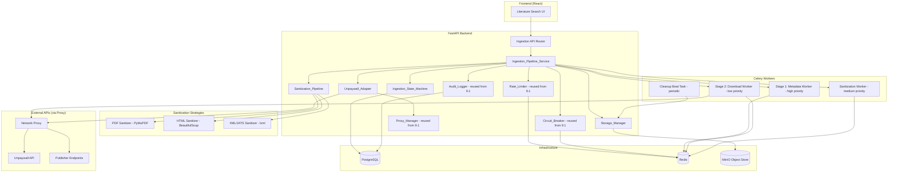
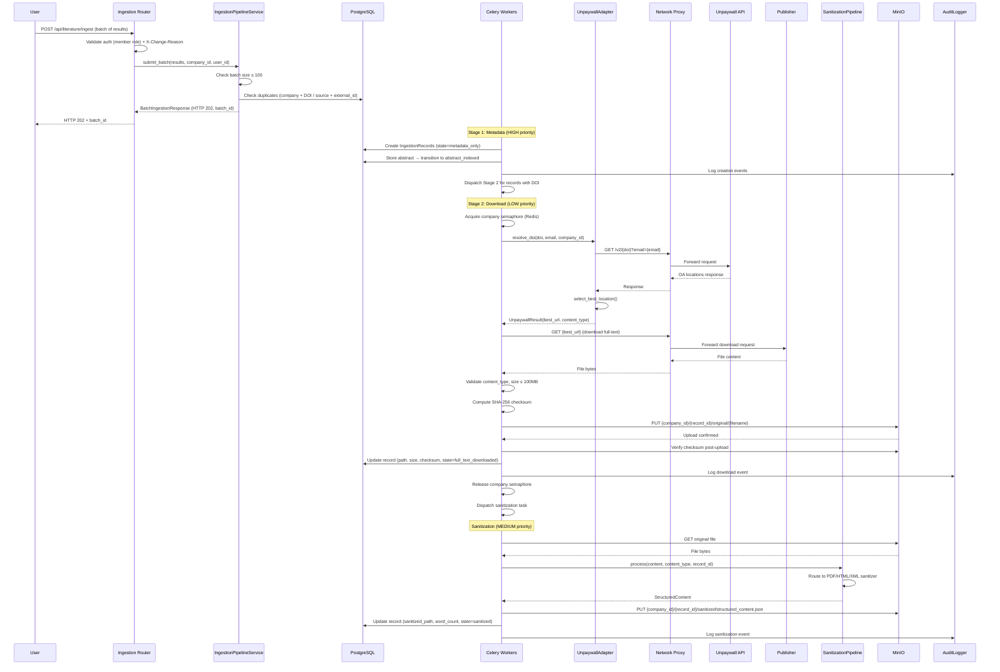
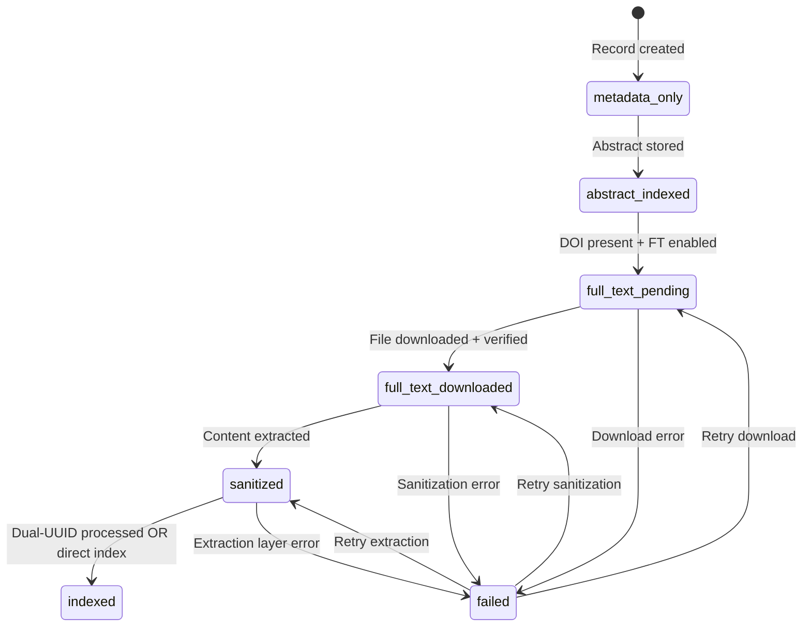

# Design Document: Automated Ingestion Pipeline (Phase 9.2)

## Overview

This design specifies the architecture for AlcoaBase's automated ingestion pipeline that consumes `LiteratureSearchResult` objects from Phase 9.1, implements dual-stage asynchronous processing (metadata → full-text), sanitizes downloaded content into a unified `Structured_Content` format, and stores all artifacts in MinIO with company-level isolation. The pipeline reuses Phase 9.1's rate limiter, circuit breaker, audit logger, proxy manager, and API key vault infrastructure, adding an Unpaywall adapter for DOI resolution, a state machine for lifecycle tracking, and format-specific sanitization processors.

### Key Design Decisions

| Decision | Choice | Rationale |
|----------|--------|-----------|
| State machine | Python `StrEnum` + service-layer transition enforcement | Simple, testable; no external workflow engine needed for linear states |
| Unpaywall adapter | `BaseSourceAdapter`-inspired pattern (not a search adapter) | Reuses httpx/proxy/circuit-breaker infra; DOI resolution is single-item lookup, not paginated search |
| File storage | MinIO with `{company_id}/{record_id}/{file_type}/{filename}` paths | Company isolation at path level; aligns with existing aioboto3 usage |
| Sanitization dispatch | Content-type → strategy mapping (PyMuPDF, BeautifulSoup, lxml) | Each format needs distinct extraction; strategy pattern keeps pipeline uniform |
| Structured_Content | Pydantic model serialized as JSON in MinIO | Schema-validated; downstream consumers (9.3 embeddings, 9.4 agents) get a guaranteed contract |
| Concurrency control | Redis-based semaphore per company | Prevents single company from monopolizing download workers; configurable limit |
| Deduplication | (company_id + DOI) OR (company_id + source_id + external_id) composite uniqueness | Covers papers with and without DOIs; scoped to company for multi-tenant isolation |
| Task priorities | Celery priority queues (high/medium/low) on `literature_ingestion` queue | Metadata ingestion is fast (high), sanitization is CPU-bound (medium), downloads are IO-bound and deferrable (low) |
| Checksum verification | SHA-256 computed at download, verified after MinIO upload | Detects corruption in transit or storage; industry standard for integrity |
| Retention cleanup | Celery beat periodic task (daily) in batches of 100 | Avoids bulk MinIO deletions; configurable via env var cron expression |

## Architecture

### High-Level Architecture Diagram



### Package Layout

```
src/backend/src/alcoabase/
├── literature/                         # Extended from Phase 9.1
│   ├── ingestion/                      # New sub-package for Phase 9.2
│   │   ├── __init__.py
│   │   ├── adapters/
│   │   │   ├── __init__.py
│   │   │   └── unpaywall_adapter.py    # DOI → full-text URL resolution
│   │   ├── services/
│   │   │   ├── __init__.py
│   │   │   ├── ingestion_service.py    # Ingestion_Pipeline_Service orchestrator
│   │   │   ├── state_machine.py        # IngestionState enum + transition logic
│   │   │   ├── storage_manager.py      # MinIO operations + checksum verification
│   │   │   └── sanitization/
│   │   │       ├── __init__.py
│   │   │       ├── pipeline.py         # Sanitization_Pipeline dispatcher
│   │   │       ├── pdf_sanitizer.py    # PyMuPDF-based PDF extraction
│   │   │       ├── html_sanitizer.py   # BeautifulSoup-based HTML extraction
│   │   │       └── xml_sanitizer.py    # lxml-based JATS XML extraction
│   │   ├── schemas/
│   │   │   ├── __init__.py
│   │   │   ├── ingestion.py            # Ingestion request/response schemas
│   │   │   ├── structured_content.py   # Structured_Content Pydantic model
│   │   │   └── configuration.py        # Ingestion_Configuration schemas
│   │   └── models/
│   │       ├── __init__.py
│   │       └── ingestion.py            # SQLAlchemy models (IngestionRecord, IngestionConfiguration)
│   ├── adapters/                        # Existing from 9.1 (unchanged)
│   ├── services/                        # Existing from 9.1 (reused)
│   │   ├── rate_limiter.py
│   │   ├── circuit_breaker.py
│   │   ├── audit_logger.py
│   │   └── proxy_manager.py
│   └── schemas/                         # Existing from 9.1 (LiteratureSearchResult reused)
├── api/
│   └── ingestion_router.py             # New router for /api/literature/ingest/*
├── tasks/
│   ├── literature_search_tasks.py       # Existing from 9.1
│   └── literature_ingestion_tasks.py    # New Celery tasks for ingestion pipeline
└── config.py                            # Extended with ingestion settings
```

## Components and Interfaces

### Ingestion State Machine

```python
"""Ingestion lifecycle state machine with enforced transitions.

The state machine is a pure function — no side effects, no database access.
Transition validation is called by the service layer before persisting state changes.

References:
    - Requirements 2.1–2.7
"""

from enum import StrEnum


class IngestionState(StrEnum):
    """Lifecycle states for an Ingestion_Record."""

    METADATA_ONLY = "metadata_only"
    ABSTRACT_INDEXED = "abstract_indexed"
    FULL_TEXT_PENDING = "full_text_pending"
    FULL_TEXT_DOWNLOADED = "full_text_downloaded"
    SANITIZED = "sanitized"
    INDEXED = "indexed"
    FAILED = "failed"


# Valid transitions as a frozenset of (from_state, to_state) tuples
VALID_TRANSITIONS: frozenset[tuple[IngestionState, IngestionState]] = frozenset({
    (IngestionState.METADATA_ONLY, IngestionState.ABSTRACT_INDEXED),
    (IngestionState.ABSTRACT_INDEXED, IngestionState.FULL_TEXT_PENDING),
    (IngestionState.FULL_TEXT_PENDING, IngestionState.FULL_TEXT_DOWNLOADED),
    (IngestionState.FULL_TEXT_PENDING, IngestionState.FAILED),
    (IngestionState.FULL_TEXT_DOWNLOADED, IngestionState.SANITIZED),
    (IngestionState.FULL_TEXT_DOWNLOADED, IngestionState.FAILED),
    (IngestionState.SANITIZED, IngestionState.INDEXED),
    (IngestionState.SANITIZED, IngestionState.FAILED),
})

# Retry transitions: from FAILED back to the state from which failure occurred
RETRY_TRANSITIONS: frozenset[tuple[IngestionState, IngestionState]] = frozenset({
    (IngestionState.FAILED, IngestionState.FULL_TEXT_PENDING),
    (IngestionState.FAILED, IngestionState.FULL_TEXT_DOWNLOADED),
    (IngestionState.FAILED, IngestionState.SANITIZED),
})


def is_valid_transition(
    current_state: IngestionState,
    target_state: IngestionState,
) -> bool:
    """Check if a state transition is valid.

    Args:
        current_state: The current state of the Ingestion_Record.
        target_state: The desired next state.

    Returns:
        True if the transition is allowed, False otherwise.
    """
    return (current_state, target_state) in VALID_TRANSITIONS


def is_valid_retry_transition(
    current_state: IngestionState,
    target_state: IngestionState,
) -> bool:
    """Check if a retry transition from FAILED is valid.

    Args:
        current_state: Must be FAILED.
        target_state: The state to retry from.

    Returns:
        True if the retry is allowed, False otherwise.
    """
    return (current_state, target_state) in RETRY_TRANSITIONS


def get_valid_next_states(current_state: IngestionState) -> list[IngestionState]:
    """Get all valid target states from the current state.

    Args:
        current_state: The current state.

    Returns:
        List of valid target states.
    """
    return [
        target for (source, target) in VALID_TRANSITIONS
        if source == current_state
    ]
```

### Unpaywall Adapter

```python
"""Unpaywall API adapter for DOI-to-full-text resolution.

Unlike Phase 9.1 search adapters, this adapter resolves a single DOI to
an open-access download URL. It does not implement BaseSourceAdapter's
search() method but reuses the same httpx/proxy/circuit-breaker infrastructure.

References:
    - Requirements 3.1–3.8
"""

from dataclasses import dataclass
from enum import StrEnum


class OALocationPriority(StrEnum):
    """Priority ranking for open-access location selection."""

    PUBLISHER_PDF_BEST = "publisher_pdf_best"
    REPOSITORY_PDF = "repository_pdf"
    PUBLISHER_HTML = "publisher_html"
    ANY_PDF = "any_pdf"
    ANY_HTML_XML = "any_html_xml"


@dataclass(frozen=True)
class UnpaywallResult:
    """Result of a DOI resolution via Unpaywall.

    Attributes:
        doi: The resolved DOI.
        is_oa: Whether an open-access version was found.
        best_url: The selected download URL (None if not OA).
        content_type: Expected content type (pdf, html, xml).
        host_type: Where the OA version is hosted (publisher, repository).
        version: Version of the article (publishedVersion, submittedVersion, etc.).
    """

    doi: str
    is_oa: bool
    best_url: str | None
    content_type: str | None
    host_type: str | None
    version: str | None


class UnpaywallAdapter:
    """Resolves DOIs to open-access full-text URLs via Unpaywall API.

    Uses the existing Rate_Limiter, Circuit_Breaker, and Proxy_Manager
    from Phase 9.1 infrastructure.
    """

    def __init__(
        self,
        base_url: str,
        rate_limiter: "RateLimiter",
        circuit_breaker: "CircuitBreaker",
        proxy_manager: "ProxyManager",
        audit_logger: "AuditLogger",
    ) -> None:
        """Initialize the Unpaywall adapter.

        Args:
            base_url: Unpaywall API base URL (from ALC_UNPAYWALL_API_URL env var).
            rate_limiter: Shared rate limiter instance.
            circuit_breaker: Shared circuit breaker instance.
            proxy_manager: Shared proxy configuration.
            audit_logger: Shared audit logger.
        """
        ...

    async def resolve_doi(
        self,
        doi: str,
        email: str,
        company_id: int,
        timeout: float = 15.0,
    ) -> UnpaywallResult:
        """Resolve a DOI to an open-access full-text URL.

        Queries Unpaywall API at GET /v2/{doi}?email={email} and selects
        the best available location using OALocationPriority ordering.

        Args:
            doi: The DOI to resolve (e.g., "10.1000/xyz123").
            email: Contact email required by Unpaywall fair use policy.
            company_id: For rate limiting and audit purposes.
            timeout: HTTP request timeout in seconds.

        Returns:
            UnpaywallResult with best_url populated if OA version found.

        Raises:
            DOINotFoundError: Unpaywall returned 404 for this DOI.
            NoOpenAccessError: DOI found but no OA version available.
            AdapterTimeoutError: Request timed out.
            AdapterConnectionError: Network failure.
        """
        ...

    def select_best_location(
        self,
        oa_locations: list[dict],
    ) -> tuple[str, str] | None:
        """Select the best download URL from Unpaywall OA locations.

        Priority order:
        1. Publisher-hosted PDF with is_best=True
        2. Repository PDF
        3. Publisher-hosted HTML
        4. Any available PDF URL
        5. Any available HTML or XML URL

        Args:
            oa_locations: List of OA location dicts from Unpaywall response.

        Returns:
            Tuple of (url, content_type) or None if no suitable location.
        """
        ...

    async def health_check(self) -> float:
        """Perform lightweight connectivity check to Unpaywall API.

        Returns:
            Response time in seconds.
        """
        ...
```

### Ingestion Pipeline Service (Orchestrator)

```python
"""Main orchestrator for the ingestion pipeline.

Coordinates state transitions, task dispatch, deduplication,
storage management, and audit logging.

References:
    - Requirements 1.1–1.8, 2.1–2.7, 4.1–4.9, 7.1–7.6, 8.1–8.8
"""


class IngestionPipelineService:
    """Orchestrates the dual-stage ingestion pipeline.

    Responsibilities:
        - Accept LiteratureSearchResult submissions
        - Create/deduplicate IngestionRecords
        - Enforce state machine transitions
        - Dispatch Celery tasks per stage
        - Coordinate with storage manager
        - Enforce company quotas
    """

    def __init__(
        self,
        session_factory: "async_sessionmaker",
        storage_manager: "StorageManager",
        unpaywall_adapter: "UnpaywallAdapter",
        sanitization_pipeline: "SanitizationPipeline",
        audit_logger: "AuditLogger",
        rate_limiter: "RateLimiter",
        circuit_breaker: "CircuitBreaker",
    ) -> None:
        """Initialize with all required dependencies.

        Args:
            session_factory: SQLAlchemy async session factory.
            storage_manager: MinIO storage operations.
            unpaywall_adapter: DOI resolution.
            sanitization_pipeline: Format-specific content extraction.
            audit_logger: Audit trail recording.
            rate_limiter: Unpaywall rate limiting.
            circuit_breaker: Unpaywall circuit breaker.
        """
        ...

    async def submit_batch(
        self,
        results: list["LiteratureSearchResult"],
        company_id: int,
        user_id: int,
    ) -> "BatchIngestionResponse":
        """Submit a batch of search results for ingestion.

        Creates IngestionRecords, deduplicates, and dispatches Stage 1 tasks.
        Returns HTTP 202-compatible response with batch ID.

        Args:
            results: Up to 100 LiteratureSearchResult objects.
            company_id: Requesting company (tenant scope).
            user_id: Requesting user (audit attribution).

        Returns:
            BatchIngestionResponse with batch_id and per-item status.

        Raises:
            BatchTooLargeError: If more than 100 results submitted.
            QuotaExceededError: If company storage quota is full.
        """
        ...

    async def check_duplicate(
        self,
        company_id: int,
        doi: str | None,
        source_id: str | None,
        external_id: str | None,
    ) -> int | None:
        """Check if an equivalent IngestionRecord already exists.

        Deduplication key: (company_id + DOI) OR (company_id + source_id + external_id).

        Args:
            company_id: Tenant scope.
            doi: Digital Object Identifier (may be None).
            source_id: Source adapter name.
            external_id: Source-specific identifier.

        Returns:
            Existing IngestionRecord ID if duplicate found, None otherwise.
        """
        ...

    async def transition_state(
        self,
        record_id: int,
        target_state: "IngestionState",
        company_id: int,
        triggering_event: str,
        error_details: dict | None = None,
    ) -> bool:
        """Attempt a state transition for an IngestionRecord.

        Validates the transition, persists the new state, records history,
        and logs the audit event. Returns False if transition is invalid.

        Args:
            record_id: IngestionRecord to transition.
            target_state: Desired new state.
            company_id: For audit and validation.
            triggering_event: Description of what caused the transition.
            error_details: Error info if transitioning to FAILED.

        Returns:
            True if transition succeeded, False if invalid.
        """
        ...

    async def retry_failed_record(
        self,
        record_id: int,
        company_id: int,
        user_id: int,
    ) -> bool:
        """Retry a failed IngestionRecord from its last successful state.

        Args:
            record_id: The failed record to retry.
            company_id: Tenant scope.
            user_id: Who initiated the retry.

        Returns:
            True if retry was queued successfully.

        Raises:
            InvalidStateError: If record is not in FAILED state.
            MaxRetriesExceededError: If retry limit reached.
        """
        ...

    async def get_state_counts(
        self,
        company_id: int,
    ) -> dict["IngestionState", int]:
        """Get aggregated counts of records per state for a company.

        Args:
            company_id: Tenant scope.

        Returns:
            Dict mapping IngestionState → count.
        """
        ...
```

### Storage Manager

```python
"""MinIO storage management for ingestion pipeline.

Handles file upload, checksum verification, path construction,
quota tracking, and retention cleanup.

References:
    - Requirements 4.4–4.6, 9.1–9.7
"""

from dataclasses import dataclass


@dataclass(frozen=True)
class StorageResult:
    """Result of a file storage operation.

    Attributes:
        object_path: Full MinIO object key.
        file_size_bytes: Size of the stored file.
        sha256_checksum: Hex-encoded SHA-256 hash.
        content_type: MIME type of the stored file.
        upload_timestamp: When the file was stored (UTC ISO 8601).
    """

    object_path: str
    file_size_bytes: int
    sha256_checksum: str
    content_type: str
    upload_timestamp: str


class StorageManager:
    """Manages MinIO operations for the literature object store.

    All paths are constructed as:
    {bucket}/{company_id}/{ingestion_record_id}/{file_type}/{filename}

    Where file_type is one of: original, sanitized, extracted.
    """

    def __init__(
        self,
        bucket_name: str,
        s3_client: "aioboto3.Session",
        redis_client: "redis.asyncio.Redis",
    ) -> None:
        """Initialize storage manager.

        Args:
            bucket_name: MinIO bucket (from ALC_LITERATURE_BUCKET env var).
            s3_client: aioboto3 session for MinIO operations.
            redis_client: For quota caching.
        """
        ...

    def build_object_path(
        self,
        company_id: int,
        record_id: int,
        file_type: str,
        filename: str,
    ) -> str:
        """Construct the MinIO object path with company isolation.

        Args:
            company_id: Tenant scope.
            record_id: IngestionRecord ID.
            file_type: One of 'original', 'sanitized', 'extracted'.
            filename: File name with extension.

        Returns:
            Full object key string.
        """
        ...

    async def store_file(
        self,
        content: bytes,
        company_id: int,
        record_id: int,
        file_type: str,
        filename: str,
        content_type: str,
        expected_checksum: str | None = None,
    ) -> StorageResult:
        """Store a file in MinIO with checksum verification.

        Computes SHA-256 before upload, verifies after upload by re-reading
        the object metadata. Attaches metadata tags for auditing.

        Args:
            content: File bytes to store.
            company_id: Tenant scope (included in path and metadata).
            record_id: IngestionRecord ID.
            file_type: 'original', 'sanitized', or 'extracted'.
            filename: Target filename.
            content_type: MIME type.
            expected_checksum: Pre-computed checksum to verify against (optional).

        Returns:
            StorageResult with path, size, checksum, and timestamp.

        Raises:
            ChecksumMismatchError: If post-upload verification fails.
            StorageQuotaExceededError: If company quota would be exceeded.
        """
        ...

    async def get_company_usage_bytes(self, company_id: int) -> int:
        """Get total storage usage for a company (cached in Redis, 5-min TTL).

        Args:
            company_id: Tenant scope.

        Returns:
            Total bytes stored for this company.
        """
        ...

    async def delete_object(self, object_path: str) -> bool:
        """Delete an object from MinIO.

        Args:
            object_path: Full object key to delete.

        Returns:
            True if deletion succeeded.
        """
        ...

    async def cleanup_expired_files(
        self,
        batch_size: int = 100,
    ) -> int:
        """Delete original files past their retention expiry.

        Processes up to batch_size records per invocation.
        Retains sanitized content and metadata.

        Args:
            batch_size: Maximum records to process per run.

        Returns:
            Number of files deleted.
        """
        ...

    def validate_company_isolation(
        self,
        object_path: str,
        requesting_company_id: int,
    ) -> bool:
        """Validate that an object path belongs to the requesting company.

        Args:
            object_path: MinIO object key.
            requesting_company_id: Company making the request.

        Returns:
            True if the path's company_id matches the requesting company.
        """
        ...
```

### Sanitization Pipeline

```python
"""Format-dispatching sanitization pipeline.

Routes downloaded files to format-specific sanitizers and produces
a unified Structured_Content output regardless of input format.

References:
    - Requirements 5.1–5.6, 6.1–6.7, 16.1–16.6
"""

from abc import ABC, abstractmethod


class BaseSanitizer(ABC):
    """Abstract base for format-specific sanitizers."""

    @abstractmethod
    async def sanitize(
        self,
        content: bytes,
        content_type: str,
    ) -> "StructuredContent":
        """Extract structured content from raw file bytes.

        Args:
            content: Raw file bytes.
            content_type: MIME type for validation.

        Returns:
            StructuredContent with extracted sections.

        Raises:
            SanitizationError: If content cannot be processed.
        """
        ...


class PDFSanitizer(BaseSanitizer):
    """PyMuPDF-based PDF text and structure extraction.

    Extracts: title, abstract, section headings, body paragraphs,
    figure/table captions, reference lists. Strips headers, footers,
    page numbers, watermarks.
    """

    async def sanitize(
        self,
        content: bytes,
        content_type: str,
    ) -> "StructuredContent":
        ...


class HTMLSanitizer(BaseSanitizer):
    """BeautifulSoup-based HTML content extraction.

    Removes: navigation, scripts, stylesheets, ads, cookie banners,
    malicious elements (script, iframe, object, embed, form), and
    dangerous attributes (onclick, onerror, javascript: URLs).
    """

    async def sanitize(
        self,
        content: bytes,
        content_type: str,
    ) -> "StructuredContent":
        ...


class XMLJATSSanitizer(BaseSanitizer):
    """lxml-based JATS XML parsing.

    Maps JATS elements:
    - front/article-meta → title, abstract
    - body → body_sections
    - back/ref-list → references
    """

    async def sanitize(
        self,
        content: bytes,
        content_type: str,
    ) -> "StructuredContent":
        ...


class SanitizationPipeline:
    """Dispatcher that routes content to the appropriate sanitizer.

    Determines the correct sanitizer based on content_type and delegates.
    """

    CONTENT_TYPE_MAP: dict[str, type[BaseSanitizer]] = {
        "application/pdf": PDFSanitizer,
        "text/html": HTMLSanitizer,
        "application/xml": XMLJATSSanitizer,
        "text/xml": XMLJATSSanitizer,
        "application/jats+xml": XMLJATSSanitizer,
    }

    async def process(
        self,
        content: bytes,
        content_type: str,
        record_id: int,
    ) -> "StructuredContent":
        """Route content to the appropriate sanitizer.

        Args:
            content: Raw file bytes.
            content_type: MIME type to select sanitizer.
            record_id: For logging and metadata attachment.

        Returns:
            StructuredContent with all extracted sections.

        Raises:
            UnsupportedContentTypeError: If no sanitizer handles this type.
            SanitizationError: If processing fails.
        """
        ...
```

## Data Models

### SQLAlchemy Models

```python
"""SQLAlchemy models for the Automated Ingestion Pipeline.

All models follow existing project patterns:
- Inherit from Base (alcoabase.database)
- Use AuditMixin for versioned models (SQLAlchemy-Continuum)
- Use mapped_column with type annotations
- Include proper indexes and constraints

References:
    - Requirements 1, 2, 4, 8, 9, 10, 13, 16
"""

from datetime import datetime
from typing import TYPE_CHECKING

from sqlalchemy import (
    Boolean,
    DateTime,
    Float,
    ForeignKey,
    Index,
    Integer,
    String,
    Text,
    UniqueConstraint,
    func,
)
from sqlalchemy.dialects.postgresql import JSONB
from sqlalchemy.orm import Mapped, mapped_column, relationship

from alcoabase.database import Base
from alcoabase.models.audit import AuditMixin

if TYPE_CHECKING:
    from alcoabase.models.company import Company


class IngestionRecord(Base, AuditMixin):
    """Tracks the lifecycle of a single ingested literature item.

    Each record is scoped to a company and tracks state transitions
    from initial metadata capture through full-text retrieval,
    sanitization, and indexing.

    Attributes:
        id: Primary key.
        company_id: FK to companies table (tenant isolation).
        batch_id: UUID grouping records from the same submission.
        state: Current lifecycle state (IngestionState enum value).
        failed_from_state: State from which failure occurred (for retry).
        error_type: Classification of failure (nullable).
        error_message: Human-readable error detail (nullable).
        retry_count: Number of retry attempts made.

        # Metadata fields (from LiteratureSearchResult)
        title: Publication title.
        authors: JSON list of author names.
        doi: Digital Object Identifier (nullable).
        publication_date: Normalized publication date.
        journal_or_venue: Journal or conference name.
        publication_type: Normalized type (journal_article, preprint, etc.).
        external_id: Source-specific identifier.
        source_id: Source adapter name that found this result.
        url: Direct link to source record.
        abstract: Abstract text (nullable).

        # File storage fields
        storage_path: MinIO object path for the original file.
        file_size_bytes: Size of the downloaded file.
        content_type: MIME type of the downloaded file.
        sha256_checksum: Hex-encoded SHA-256 hash of the file.
        download_url: URL from which the file was downloaded (redacted).
        download_timestamp: When the file was downloaded.

        # Sanitized content reference
        sanitized_storage_path: MinIO object path for structured_content.json.
        word_count: Word count from sanitized content.

        # Dual-UUID integration
        document_record_id: FK to created document record (nullable).

        # Retention
        retention_expiry_date: When the original file should be purged.
        original_file_purged: Whether the original file has been deleted.
        purge_timestamp: When the file was purged.

        # State history
        state_history: JSON list of transition records.

        # Timestamps
        created_at: Record creation timestamp.
        updated_at: Last modification timestamp.
    """

    __tablename__ = "literature_ingestion_records"
    __versioned__ = {}

    id: Mapped[int] = mapped_column(primary_key=True)
    company_id: Mapped[int] = mapped_column(
        ForeignKey("companies.id"), index=True
    )
    batch_id: Mapped[str] = mapped_column(String(36), index=True)
    state: Mapped[str] = mapped_column(String(30), index=True, default="metadata_only")
    failed_from_state: Mapped[str | None] = mapped_column(String(30), nullable=True)
    error_type: Mapped[str | None] = mapped_column(String(50), nullable=True)
    error_message: Mapped[str | None] = mapped_column(Text, nullable=True)
    retry_count: Mapped[int] = mapped_column(Integer, default=0)

    # Metadata fields
    title: Mapped[str] = mapped_column(Text)
    authors: Mapped[list] = mapped_column(JSONB, default=list)
    doi: Mapped[str | None] = mapped_column(String(255), nullable=True, index=True)
    publication_date: Mapped[datetime | None] = mapped_column(
        DateTime(timezone=True), nullable=True
    )
    journal_or_venue: Mapped[str] = mapped_column(String(500), default="")
    publication_type: Mapped[str] = mapped_column(String(50), default="other")
    external_id: Mapped[str] = mapped_column(String(255), index=True)
    source_id: Mapped[str] = mapped_column(String(100))
    url: Mapped[str | None] = mapped_column(Text, nullable=True)
    abstract: Mapped[str | None] = mapped_column(Text, nullable=True)

    # File storage fields
    storage_path: Mapped[str | None] = mapped_column(Text, nullable=True)
    file_size_bytes: Mapped[int | None] = mapped_column(Integer, nullable=True)
    content_type: Mapped[str | None] = mapped_column(String(100), nullable=True)
    sha256_checksum: Mapped[str | None] = mapped_column(String(64), nullable=True)
    download_url: Mapped[str | None] = mapped_column(Text, nullable=True)
    download_timestamp: Mapped[datetime | None] = mapped_column(
        DateTime(timezone=True), nullable=True
    )

    # Sanitized content
    sanitized_storage_path: Mapped[str | None] = mapped_column(Text, nullable=True)
    word_count: Mapped[int | None] = mapped_column(Integer, nullable=True)

    # Dual-UUID integration
    document_record_id: Mapped[int | None] = mapped_column(
        Integer, nullable=True
    )

    # Retention
    retention_expiry_date: Mapped[datetime | None] = mapped_column(
        DateTime(timezone=True), nullable=True
    )
    original_file_purged: Mapped[bool] = mapped_column(Boolean, default=False)
    purge_timestamp: Mapped[datetime | None] = mapped_column(
        DateTime(timezone=True), nullable=True
    )

    # State history (append-only JSON array)
    state_history: Mapped[list] = mapped_column(JSONB, default=list)

    # Timestamps
    created_at: Mapped[datetime] = mapped_column(
        DateTime(timezone=True), server_default=func.now()
    )
    updated_at: Mapped[datetime] = mapped_column(
        DateTime(timezone=True), server_default=func.now(), onupdate=func.now()
    )

    company: Mapped["Company"] = relationship()

    __table_args__ = (
        # Deduplication: company + DOI
        UniqueConstraint(
            "company_id", "doi",
            name="uq_lit_ingestion_company_doi",
        ),
        # Deduplication: company + source + external_id
        UniqueConstraint(
            "company_id", "source_id", "external_id",
            name="uq_lit_ingestion_company_source_extid",
        ),
        Index(
            "ix_lit_ingestion_company_state",
            "company_id", "state",
        ),
        Index(
            "ix_lit_ingestion_batch",
            "batch_id",
        ),
        Index(
            "ix_lit_ingestion_retention",
            "retention_expiry_date", "original_file_purged",
        ),
    )


class IngestionConfiguration(Base, AuditMixin):
    """Per-company ingestion pipeline configuration.

    Controls full-text retrieval, storage quotas, retention policies,
    and concurrency limits for a specific company.

    Attributes:
        id: Primary key.
        company_id: FK to companies table (one config per company).
        full_text_retrieval_enabled: Whether to attempt full-text downloads.
        storage_quota_mb: Maximum storage in MB for this company.
        retention_days: Days to retain original files (0 = indefinite).
        unpaywall_email: Contact email for Unpaywall API (required if FT enabled).
        dual_uuid_integration_enabled: Whether to pipe through Phase 2.5.
        max_concurrent_downloads: Concurrent download task limit.
        created_at: Creation timestamp.
        updated_at: Last modification timestamp.
    """

    __tablename__ = "literature_ingestion_configurations"
    __versioned__ = {}

    id: Mapped[int] = mapped_column(primary_key=True)
    company_id: Mapped[int] = mapped_column(
        ForeignKey("companies.id"), unique=True, index=True
    )
    full_text_retrieval_enabled: Mapped[bool] = mapped_column(Boolean, default=True)
    storage_quota_mb: Mapped[int] = mapped_column(Integer, default=10240)
    retention_days: Mapped[int] = mapped_column(Integer, default=365)
    unpaywall_email: Mapped[str | None] = mapped_column(String(320), nullable=True)
    dual_uuid_integration_enabled: Mapped[bool] = mapped_column(Boolean, default=False)
    max_concurrent_downloads: Mapped[int] = mapped_column(Integer, default=5)

    created_at: Mapped[datetime] = mapped_column(
        DateTime(timezone=True), server_default=func.now()
    )
    updated_at: Mapped[datetime] = mapped_column(
        DateTime(timezone=True), server_default=func.now(), onupdate=func.now()
    )

    company: Mapped["Company"] = relationship()

    __table_args__ = (
        Index("ix_lit_ingestion_config_company", "company_id"),
    )


class IngestionAuditLog(Base):
    """Append-only audit log for ingestion pipeline operations.

    Extends the ExternalAPIAuditLog pattern from Phase 9.1 with
    ingestion-specific fields.

    NOT versioned via Continuum — these are append-only audit records.

    Attributes:
        id: Primary key.
        ingestion_record_id: FK to the ingestion record.
        company_id: Tenant scope.
        user_id: Acting user (or 'system' for automated).
        event_type: Type of event (created, state_transition, download, sanitize, etc.).
        previous_state: State before transition (nullable).
        new_state: State after transition (nullable).
        triggering_event: What caused this event.
        details: JSON blob with event-specific data.
        timestamp: When the event occurred.
    """

    __tablename__ = "literature_ingestion_audit_log"

    id: Mapped[int] = mapped_column(primary_key=True)
    ingestion_record_id: Mapped[int] = mapped_column(
        ForeignKey("literature_ingestion_records.id"), index=True
    )
    company_id: Mapped[int] = mapped_column(
        ForeignKey("companies.id"), index=True
    )
    user_id: Mapped[str] = mapped_column(String(50))  # int user_id or "system"
    event_type: Mapped[str] = mapped_column(String(50), index=True)
    previous_state: Mapped[str | None] = mapped_column(String(30), nullable=True)
    new_state: Mapped[str | None] = mapped_column(String(30), nullable=True)
    triggering_event: Mapped[str | None] = mapped_column(String(200), nullable=True)
    details: Mapped[dict] = mapped_column(JSONB, default=dict)
    timestamp: Mapped[datetime] = mapped_column(
        DateTime(timezone=True), server_default=func.now()
    )

    __table_args__ = (
        Index(
            "ix_lit_ingestion_audit_company_time",
            "company_id", "timestamp",
        ),
        Index(
            "ix_lit_ingestion_audit_record",
            "ingestion_record_id", "timestamp",
        ),
    )
```

## Pydantic Schemas

```python
"""Pydantic v2 schemas for Ingestion Pipeline API request/response.

References:
    - Requirements 1, 2, 8, 11, 16
"""

from datetime import date, datetime
from enum import StrEnum

from pydantic import BaseModel, Field, field_validator


# ─── Enums ────────────────────────────────────────────────────────────────

class IngestionStateSchema(StrEnum):
    """API-facing ingestion state enum."""

    METADATA_ONLY = "metadata_only"
    ABSTRACT_INDEXED = "abstract_indexed"
    FULL_TEXT_PENDING = "full_text_pending"
    FULL_TEXT_DOWNLOADED = "full_text_downloaded"
    SANITIZED = "sanitized"
    INDEXED = "indexed"
    FAILED = "failed"


class SourceFormat(StrEnum):
    """Content format of the sanitized source."""

    PDF = "pdf"
    HTML = "html"
    XML = "xml"


# ─── Structured Content ──────────────────────────────────────────────────

class BodySection(BaseModel):
    """A section within the structured content body.

    Attributes:
        heading: Section heading text (may be empty for intro paragraphs).
        text: Section body text content.
    """

    heading: str = ""
    text: str = ""


class StructuredContent(BaseModel):
    """Normalized output from the sanitization pipeline.

    This is the canonical schema consumed by downstream features
    (9.3 embedding generation, 9.4 literature review agents).

    Invariants:
        - word_count == len(raw_plaintext.split())
        - raw_plaintext == "\\n".join([extracted_title, extracted_abstract, *[s.text for s in body_sections]])

    Attributes:
        extracted_title: Title extracted from content.
        extracted_abstract: Abstract extracted from content.
        body_sections: Ordered list of heading+text sections.
        references: List of citation strings.
        figure_count: Number of figures detected.
        table_count: Number of tables detected.
        word_count: Whitespace-delimited token count in raw_plaintext.
        raw_plaintext: Concatenation of title + abstract + body section texts.
        source_format: Original format (pdf, html, xml).
        processing_timestamp: When sanitization completed (UTC ISO 8601).
        ingestion_record_id: Linking back to the IngestionRecord.
    """

    extracted_title: str = ""
    extracted_abstract: str = ""
    body_sections: list[BodySection] = Field(default_factory=list)
    references: list[str] = Field(default_factory=list)
    figure_count: int = Field(default=0, ge=0)
    table_count: int = Field(default=0, ge=0)
    word_count: int = Field(default=0, ge=0)
    raw_plaintext: str = ""
    source_format: SourceFormat
    processing_timestamp: datetime
    ingestion_record_id: str

    model_config = {"frozen": True}

    @field_validator("word_count")
    @classmethod
    def validate_word_count(cls, v: int, info) -> int:
        """Validate word_count matches raw_plaintext token count."""
        raw = info.data.get("raw_plaintext", "")
        if raw and v != len(raw.split()):
            msg = "word_count must equal whitespace-delimited token count of raw_plaintext"
            raise ValueError(msg)
        return v


# ─── Ingestion Request Schemas ────────────────────────────────────────────

class IngestionSubmitRequest(BaseModel):
    """Request body for batch ingestion submission.

    Accepts up to 100 LiteratureSearchResult-compatible objects.
    """

    results: list["LiteratureSearchResultInput"] = Field(
        ..., min_length=1, max_length=100
    )


class LiteratureSearchResultInput(BaseModel):
    """Input schema for a single result to ingest.

    Maps 1:1 from LiteratureSearchResult (Phase 9.1).
    """

    title: str = Field(..., min_length=1, max_length=2000)
    authors: list[str] = Field(default_factory=list)
    abstract: str = Field("", max_length=50000)
    doi: str | None = None
    publication_date: date
    source_id: str = Field(..., min_length=1)
    external_id: str = Field(..., min_length=1)
    journal_or_venue: str = ""
    publication_type: str = "other"
    url: str | None = None


# ─── Ingestion Response Schemas ───────────────────────────────────────────

class BatchIngestionResponse(BaseModel):
    """Response for batch ingestion submission (HTTP 202)."""

    batch_id: str
    total_submitted: int
    created: int
    duplicates_skipped: int
    task_ids: list[str]


class IngestionRecordResponse(BaseModel):
    """Full ingestion record response with state history."""

    id: int
    company_id: int
    batch_id: str
    state: IngestionStateSchema
    failed_from_state: str | None = None
    error_type: str | None = None
    error_message: str | None = None
    retry_count: int

    # Metadata
    title: str
    authors: list[str]
    doi: str | None = None
    publication_date: date | None = None
    journal_or_venue: str
    publication_type: str
    external_id: str
    source_id: str
    url: str | None = None
    abstract: str | None = None

    # File info
    storage_path: str | None = None
    file_size_bytes: int | None = None
    content_type: str | None = None
    sha256_checksum: str | None = None
    download_timestamp: datetime | None = None
    word_count: int | None = None

    # Retention
    retention_expiry_date: datetime | None = None
    original_file_purged: bool = False

    # History
    state_history: list[dict] = Field(default_factory=list)

    # Timestamps
    created_at: datetime
    updated_at: datetime


class IngestionRecordListResponse(BaseModel):
    """Paginated list of ingestion records."""

    records: list[IngestionRecordResponse]
    total: int
    page: int
    page_size: int


class BatchStatusResponse(BaseModel):
    """Status of all records in a batch."""

    batch_id: str
    total: int
    state_counts: dict[str, int]
    records: list[IngestionRecordResponse]


class StateCounts(BaseModel):
    """Aggregated state counts for monitoring."""

    metadata_only: int = 0
    abstract_indexed: int = 0
    full_text_pending: int = 0
    full_text_downloaded: int = 0
    sanitized: int = 0
    indexed: int = 0
    failed: int = 0


class StorageUsageResponse(BaseModel):
    """Company storage usage information."""

    company_id: int
    used_bytes: int
    used_mb: float
    quota_mb: int
    usage_percent: float
    quota_warning: bool
    file_counts: dict[str, int]  # per-state file counts


# ─── Configuration Schemas ────────────────────────────────────────────────

class IngestionConfigurationCreate(BaseModel):
    """Request schema for creating ingestion configuration."""

    full_text_retrieval_enabled: bool = True
    storage_quota_mb: int = Field(10240, ge=100)
    retention_days: int = Field(365, ge=0)
    unpaywall_email: str | None = Field(None, max_length=320)
    dual_uuid_integration_enabled: bool = False
    max_concurrent_downloads: int = Field(5, ge=1, le=20)

    @field_validator("unpaywall_email")
    @classmethod
    def validate_email_when_ft_enabled(cls, v: str | None, info) -> str | None:
        """Require email when full-text retrieval is enabled."""
        ft_enabled = info.data.get("full_text_retrieval_enabled", True)
        if ft_enabled and not v:
            msg = "unpaywall_email is required when full_text_retrieval_enabled is true"
            raise ValueError(msg)
        if v and "@" not in v:
            msg = "unpaywall_email must be a valid email address"
            raise ValueError(msg)
        return v


class IngestionConfigurationUpdate(BaseModel):
    """Request schema for updating ingestion configuration."""

    full_text_retrieval_enabled: bool | None = None
    storage_quota_mb: int | None = Field(None, ge=100)
    retention_days: int | None = Field(None, ge=0)
    unpaywall_email: str | None = Field(None, max_length=320)
    dual_uuid_integration_enabled: bool | None = None
    max_concurrent_downloads: int | None = Field(None, ge=1, le=20)


class IngestionConfigurationResponse(BaseModel):
    """Response schema for ingestion configuration."""

    id: int
    company_id: int
    full_text_retrieval_enabled: bool
    storage_quota_mb: int
    retention_days: int
    unpaywall_email: str | None
    dual_uuid_integration_enabled: bool
    max_concurrent_downloads: int
    created_at: datetime
    updated_at: datetime


# ─── Health Endpoint ──────────────────────────────────────────────────────

class IngestionHealthResponse(BaseModel):
    """Health status for ingestion pipeline."""

    celery_workers: int
    queue_depths: dict[str, int]  # priority → depth
    circuit_breaker_state: str
    minio_connected: bool
    redis_connected: bool
```

## API Endpoint Specifications

### Endpoint Summary

| Method | Path | Auth | Description |
|--------|------|------|-------------|
| POST | `/api/literature/ingest` | member | Submit batch of results for ingestion |
| GET | `/api/literature/ingest` | member | List ingestion records (filtered, paginated) |
| GET | `/api/literature/ingest/{ingestion_record_id}` | member | Get single ingestion record with history |
| GET | `/api/literature/ingest/batch/{batch_id}` | member | Get batch status |
| POST | `/api/literature/ingest/{ingestion_record_id}/retry` | document_admin | Retry failed record |
| GET | `/api/literature/ingest/config` | document_admin | Get company ingestion configuration |
| PUT | `/api/literature/ingest/config` | document_admin | Update company ingestion configuration |
| GET | `/api/literature/ingest/storage` | member | Get company storage usage |
| GET | `/api/literature/ingest/states` | member | Get aggregated state counts |
| GET | `/api/literature/ingest/health` | system_admin | Get pipeline health status |

### Key Endpoint Details

#### POST `/api/literature/ingest`

**Request Body:** `IngestionSubmitRequest` (list of up to 100 results)

**Response:** HTTP 202 + `BatchIngestionResponse`

**Headers Required:**
- `Authorization: Bearer {token}`
- `X-User-Id`
- `X-Company-Id`
- `X-Change-Reason`

**Error Responses:**
- 400: Invalid request body, missing X-Change-Reason, or batch exceeds 100 items
- 403: User lacks `member` role
- 409: Storage quota exceeded for company
- 413: Batch too large (>100 items)

#### GET `/api/literature/ingest`

**Query Parameters:**
- `state` (optional): Filter by IngestionState
- `date_from` (optional): Created after this date
- `date_to` (optional): Created before this date
- `doi` (optional): Filter by DOI
- `source_id` (optional): Filter by source adapter name
- `page` (default: 1, min: 1)
- `page_size` (default: 20, min: 1, max: 100)

**Response:** HTTP 200 + `IngestionRecordListResponse`

#### POST `/api/literature/ingest/{ingestion_record_id}/retry`

**Response:** HTTP 202 + task ID for the retry operation

**Error Responses:**
- 400: Record not in FAILED state or max retries exceeded
- 403: User lacks `document_admin` role
- 404: Record not found or not in requesting company's scope

## Celery Tasks

```python
"""Celery tasks for the ingestion pipeline.

All tasks use the 'literature_ingestion' queue (separate from 'literature_search').
Priority levels: high (1), medium (5), low (9) — lower number = higher priority.

References:
    - Requirements 12.1–12.7, 13.1–13.6, 14.1–14.7
"""

from celery import shared_task


@shared_task(
    name="literature.ingest.stage1_metadata",
    queue="literature_ingestion",
    priority=1,  # High priority — executes within seconds
    max_retries=3,
    default_retry_delay=30,
)
def ingest_stage1_metadata(
    batch_id: str,
    results_payload: list[dict],
    company_id: int,
    user_id: int,
) -> dict:
    """Stage 1: Create IngestionRecords and store metadata/abstract.

    Creates records, deduplicates, stores metadata, transitions to
    abstract_indexed if abstract present, and dispatches Stage 2 tasks
    for records with DOIs when full-text retrieval is enabled.

    Args:
        batch_id: UUID for this batch submission.
        results_payload: Serialized LiteratureSearchResultInput list.
        company_id: Tenant scope.
        user_id: Audit attribution.

    Returns:
        Dict with created_count, duplicate_count, stage2_dispatched_count.
    """
    ...


@shared_task(
    name="literature.ingest.stage2_download",
    queue="literature_ingestion",
    priority=9,  # Low priority — background processing
    max_retries=3,
    default_retry_delay=5,
    rate_limit="10/m",  # Max 10 download tasks per minute per worker
)
def ingest_stage2_download(
    ingestion_record_id: int,
    company_id: int,
) -> dict:
    """Stage 2: Resolve DOI via Unpaywall and download full-text.

    Acquires company semaphore, resolves DOI, downloads content,
    validates content type and size, computes checksum, stores in MinIO,
    and transitions state to full_text_downloaded.

    Uses Redis-based semaphore to enforce max_concurrent_downloads per company.

    Args:
        ingestion_record_id: Record to process.
        company_id: Tenant scope (for semaphore and quota checks).

    Returns:
        Dict with download_url, content_type, file_size_bytes, checksum.

    Raises:
        self.retry(): On acquirable semaphore failure (30s delay).
        MaxRetriesExceededError: After 3 failed download attempts.
    """
    ...


@shared_task(
    name="literature.ingest.sanitize",
    queue="literature_ingestion",
    priority=5,  # Medium priority
    max_retries=2,
    default_retry_delay=15,
)
def ingest_sanitize(
    ingestion_record_id: int,
    company_id: int,
) -> dict:
    """Sanitize downloaded content into Structured_Content.

    Reads the original file from MinIO, dispatches to format-specific
    sanitizer, stores structured_content.json in MinIO under the
    sanitized prefix, and transitions state to sanitized.

    Args:
        ingestion_record_id: Record with downloaded content.
        company_id: Tenant scope.

    Returns:
        Dict with word_count, sections_count, sanitized_path.
    """
    ...


@shared_task(
    name="literature.ingest.dual_uuid_extract",
    queue="literature_ingestion",
    priority=5,  # Medium priority
    max_retries=1,
    default_retry_delay=30,
)
def ingest_dual_uuid_extract(
    ingestion_record_id: int,
    company_id: int,
) -> dict:
    """Pipe sanitized content through Dual-UUID Extraction Layer (Phase 2.5).

    Only dispatched when dual_uuid_integration_enabled is true for the company.
    Creates a literature-type document record and transitions to indexed.

    Args:
        ingestion_record_id: Record with sanitized content.
        company_id: Tenant scope.

    Returns:
        Dict with document_record_id.
    """
    ...


@shared_task(
    name="literature.ingest.retention_cleanup",
    queue="literature_ingestion",
    priority=9,  # Low priority — background maintenance
)
def retention_cleanup_task() -> dict:
    """Periodic task: delete expired original files from MinIO.

    Runs daily via Celery beat. Processes up to 100 records per run.
    Deletes original files only; retains sanitized content and metadata.

    Returns:
        Dict with files_purged count, bytes_freed.
    """
    ...


@shared_task(
    name="literature.ingest.check_company_health",
    queue="literature_ingestion",
    priority=1,  # High priority — circuit breaker for company
)
def check_company_health(company_id: int) -> dict:
    """Check if a company's ingestion should be paused.

    Called when >10 consecutive failures occur within 10 minutes.
    Pauses ingestion for 15 minutes and logs critical alert.

    Args:
        company_id: Company to check.

    Returns:
        Dict with paused status and resume_at timestamp.
    """
    ...
```

### Configuration Settings Extension

```python
"""Extension to alcoabase.config.Settings for ingestion pipeline.

Added to the existing Settings class in config.py alongside the
Phase 9.1 literature settings.
"""

# ─── Ingestion Pipeline Settings (added to Settings class) ────────────────

# In config.py, add these fields to the Settings class:

ingestion_unpaywall_api_url: str = Field(
    default="https://api.unpaywall.org/v2",
    description="Unpaywall API base URL.",
    alias="ALC_UNPAYWALL_API_URL",
)
ingestion_literature_bucket: str = Field(
    default="alcoabase-literature",
    description="MinIO bucket for literature files.",
    alias="ALC_LITERATURE_BUCKET",
)
ingestion_max_file_size_mb: int = Field(
    default=100,
    description="Maximum file download size in MB.",
    alias="ALC_LITERATURE_MAX_FILE_SIZE_MB",
)
ingestion_retention_days: int = Field(
    default=365,
    description="Default retention period for original files.",
    alias="ALC_LITERATURE_RETENTION_DAYS",
)
ingestion_storage_quota_mb: int = Field(
    default=10240,
    description="Default per-company storage quota in MB.",
    alias="ALC_LITERATURE_STORAGE_QUOTA_MB",
)
ingestion_queue_name: str = Field(
    default="literature_ingestion",
    description="Celery queue name for ingestion tasks.",
    alias="ALC_LITERATURE_INGESTION_QUEUE",
)
ingestion_cleanup_cron: str = Field(
    default="0 2 * * *",
    description="Cron expression for retention cleanup schedule.",
    alias="ALC_LITERATURE_CLEANUP_CRON",
)
ingestion_user_agent: str = Field(
    default="AlcoaBase/1.0 (Literature Ingestion Pipeline)",
    description="User-Agent header for publisher downloads.",
    alias="ALC_LITERATURE_USER_AGENT",
)
```

## Sequence Diagrams

### Full Ingestion Flow (Happy Path)



### State Machine Transitions




## Correctness Properties

*A property is a characteristic or behavior that should hold true across all valid executions of a system — essentially, a formal statement about what the system should do. Properties serve as the bridge between human-readable specifications and machine-verifiable correctness guarantees.*

### Property 1: Ingestion State Machine Transition Validity

*For any* pair of `(current_state, target_state)` drawn from the `IngestionState` enum, `is_valid_transition(current_state, target_state)` SHALL return `True` if and only if the pair exists in the `VALID_TRANSITIONS` frozenset. For retry transitions, `is_valid_retry_transition(FAILED, target_state)` SHALL return `True` if and only if `target_state` is one of `full_text_pending`, `full_text_downloaded`, or `sanitized`. All other combinations SHALL return `False`.

**Validates: Requirements 2.1, 2.2, 2.4**

### Property 2: Metadata Preservation Round-Trip

*For any* valid `LiteratureSearchResultInput` with non-empty title, non-empty external_id, and valid publication_date, creating an `IngestionRecord` SHALL preserve all metadata fields: the record's title, authors, doi, publication_date, journal_or_venue, publication_type, external_id, source_id, and url SHALL be field-by-field equal to the corresponding input fields.

**Validates: Requirements 1.2**

### Property 3: Structured_Content JSON Round-Trip

*For any* valid `StructuredContent` instance (with consistent word_count and raw_plaintext), serializing to JSON via `model_dump_json()` and deserializing via `StructuredContent.model_validate_json()` SHALL produce an object that is field-by-field equal to the original, with identical types, values, list ordering, and nested object structure.

**Validates: Requirements 16.3, 6.7**

### Property 4: Structured_Content Internal Consistency

*For any* valid `StructuredContent` instance, the following invariants SHALL hold simultaneously:
1. `word_count` equals `len(raw_plaintext.split())`
2. `raw_plaintext` equals the concatenation of `extracted_title`, `extracted_abstract`, and all `body_sections[i].text` values, joined by newline characters (`"\n"`)
3. If `raw_plaintext` is non-empty, then `word_count` is greater than zero

**Validates: Requirements 16.4, 16.5, 5.6**

### Property 5: SHA-256 Checksum Integrity

*For any* byte sequence of length 1 to 10 MB, computing the SHA-256 checksum before storage and recomputing it from the stored bytes SHALL produce identical 64-character hexadecimal strings. The checksum function SHALL be deterministic: computing SHA-256 of the same bytes twice SHALL always produce the same result.

**Validates: Requirements 4.5, 9.5**

### Property 6: Deduplication Idempotency

*For any* `LiteratureSearchResultInput` submitted to `check_duplicate()` with a given `(company_id, doi)` or `(company_id, source_id, external_id)`, if a matching `IngestionRecord` already exists, the function SHALL return the existing record's ID. Submitting the same input N times (N ≥ 2) SHALL result in exactly 1 `IngestionRecord` being created (the first submission) and N-1 duplicate detections returning the same ID.

**Validates: Requirements 1.6, 14.4**

### Property 7: Storage Path Company Isolation

*For any* `company_id` (positive integer) and `record_id` (positive integer), `build_object_path(company_id, record_id, file_type, filename)` SHALL produce a path starting with `"{company_id}/"`. Furthermore, `validate_company_isolation(path, requesting_company_id)` SHALL return `True` if and only if the path's leading company_id segment equals `requesting_company_id`. A company SHALL never be able to access objects belonging to a different company.

**Validates: Requirements 4.4, 9.1, 9.3**

### Property 8: OA Location Priority Selection

*For any* non-empty list of Unpaywall OA location objects, `select_best_location()` SHALL return the URL from the highest-priority location according to the ordering: (1) publisher PDF with `is_best=True` > (2) repository PDF > (3) publisher HTML > (4) any PDF > (5) any HTML/XML. If the list is empty or contains no locations with valid URLs, it SHALL return `None`.

**Validates: Requirements 3.2**

### Property 9: Storage Quota Threshold Enforcement

*For any* company with `storage_quota_mb = Q` and current usage `U` bytes:
1. If `U >= 0.9 * Q * 1024 * 1024`, the `quota_warning` flag SHALL be `True`
2. If `U >= Q * 1024 * 1024`, new download tasks SHALL be rejected
3. If `U < 0.9 * Q * 1024 * 1024`, the `quota_warning` flag SHALL be `False` and downloads SHALL be permitted

**Validates: Requirements 8.3, 8.4**

### Property 10: Content Type Validation

*For any* string `content_type`, the download worker's content type validation SHALL accept it if and only if it is one of: `application/pdf`, `text/html`, `application/xml`, `text/xml`, `application/jats+xml`. All other content type strings SHALL be rejected.

**Validates: Requirements 4.2, 4.3**

### Property 11: HTML Sanitization Security

*For any* HTML string containing elements from the set `{script, iframe, object, embed, form}` or attributes from the set `{onclick, onerror, onload, onmouseover}` or `javascript:` URLs, the `HTMLSanitizer` output's `raw_plaintext` and `body_sections` text SHALL NOT contain any of these elements, attributes, or URL schemes.

**Validates: Requirements 6.3**

### Property 12: Audit Log Secret Exclusion

*For any* ingestion operation that uses a URL containing authentication tokens (API keys, Bearer tokens, session IDs), the resulting `IngestionAuditLog` entry's `details` JSON field SHALL NOT contain the raw token value. URLs stored in audit logs SHALL have authentication parameters replaced with `[REDACTED]`.

**Validates: Requirements 10.6**

### Property 13: Conditional Email Validation

*For any* `IngestionConfigurationCreate` where `full_text_retrieval_enabled` is `True`, the `unpaywall_email` field SHALL be required (non-null, non-empty, containing "@"). When `full_text_retrieval_enabled` is `False`, `unpaywall_email` MAY be null. Invalid email formats SHALL be rejected regardless of the retrieval setting.

**Validates: Requirements 8.8**

### Property 14: Word Count Consistency

*For any* non-empty string `text`, the word count computed as `len(text.split())` SHALL be deterministic and equal to the number of maximal whitespace-separated substrings. For the empty string, word count SHALL be zero. The `StructuredContent.word_count` field SHALL always equal the word count of its `raw_plaintext` field.

**Validates: Requirements 5.6, 16.4**

## Error Handling

### Error Hierarchy

```python
"""Custom exceptions for the ingestion pipeline.

All exceptions inherit from a common base for consistent handling.
Extends the LiteratureGatewayError hierarchy from Phase 9.1.
"""


class IngestionPipelineError(Exception):
    """Base exception for all ingestion pipeline errors."""
    pass


class InvalidStateTransitionError(IngestionPipelineError):
    """Attempted state transition is not valid."""

    def __init__(
        self, record_id: int, current_state: str, target_state: str
    ) -> None:
        self.record_id = record_id
        self.current_state = current_state
        self.target_state = target_state
        super().__init__(
            f"Invalid transition for record {record_id}: "
            f"{current_state} → {target_state}"
        )


class DuplicateRecordError(IngestionPipelineError):
    """Submitted result matches an existing IngestionRecord."""

    def __init__(self, existing_record_id: int) -> None:
        self.existing_record_id = existing_record_id
        super().__init__(f"Duplicate detected: existing record {existing_record_id}")


class StorageQuotaExceededError(IngestionPipelineError):
    """Company storage quota would be exceeded by this operation."""

    def __init__(self, company_id: int, used_mb: float, quota_mb: int) -> None:
        self.company_id = company_id
        self.used_mb = used_mb
        self.quota_mb = quota_mb
        super().__init__(
            f"Storage quota exceeded for company {company_id}: "
            f"{used_mb:.1f}MB used of {quota_mb}MB quota"
        )


class ChecksumMismatchError(IngestionPipelineError):
    """SHA-256 checksum verification failed after upload."""

    def __init__(self, expected: str, actual: str, object_path: str) -> None:
        self.expected = expected
        self.actual = actual
        self.object_path = object_path
        super().__init__(
            f"Checksum mismatch for {object_path}: "
            f"expected={expected[:16]}..., actual={actual[:16]}..."
        )


class DOINotFoundError(IngestionPipelineError):
    """Unpaywall returned 404 for the given DOI."""

    def __init__(self, doi: str) -> None:
        self.doi = doi
        super().__init__(f"DOI not found in Unpaywall: {doi}")


class NoOpenAccessError(IngestionPipelineError):
    """DOI exists in Unpaywall but no open-access version is available."""

    def __init__(self, doi: str) -> None:
        self.doi = doi
        super().__init__(f"No open-access version available for DOI: {doi}")


class UnsupportedContentTypeError(IngestionPipelineError):
    """Downloaded content type is not in the allowed set."""

    def __init__(self, content_type: str, allowed: list[str]) -> None:
        self.content_type = content_type
        self.allowed = allowed
        super().__init__(
            f"Unsupported content type: {content_type}. "
            f"Allowed: {', '.join(allowed)}"
        )


class FileTooLargeError(IngestionPipelineError):
    """File exceeds the maximum allowed download size."""

    def __init__(self, size_bytes: int, max_bytes: int) -> None:
        self.size_bytes = size_bytes
        self.max_bytes = max_bytes
        super().__init__(
            f"File too large: {size_bytes / 1024 / 1024:.1f}MB "
            f"exceeds maximum {max_bytes / 1024 / 1024:.0f}MB"
        )


class SanitizationError(IngestionPipelineError):
    """Content sanitization/extraction failed."""

    def __init__(self, record_id: int, error_type: str, detail: str) -> None:
        self.record_id = record_id
        self.error_type = error_type
        super().__init__(f"Sanitization failed for record {record_id}: {detail}")


class BatchTooLargeError(IngestionPipelineError):
    """Batch submission exceeds maximum of 100 items."""

    def __init__(self, count: int) -> None:
        self.count = count
        super().__init__(f"Batch size {count} exceeds maximum of 100")


class MaxRetriesExceededError(IngestionPipelineError):
    """Maximum retry attempts exhausted for a record."""

    def __init__(self, record_id: int, retry_count: int) -> None:
        self.record_id = record_id
        self.retry_count = retry_count
        super().__init__(
            f"Max retries ({retry_count}) exceeded for record {record_id}"
        )


class CompanyPausedError(IngestionPipelineError):
    """Company ingestion is temporarily paused due to excessive failures."""

    def __init__(self, company_id: int, resume_at: str) -> None:
        self.company_id = company_id
        self.resume_at = resume_at
        super().__init__(
            f"Ingestion paused for company {company_id} until {resume_at}"
        )
```

### Error Response Mapping

| Exception | HTTP Status | Response Body |
|-----------|-------------|---------------|
| `BatchTooLargeError` | 413 | `{"detail": "Batch size exceeds maximum of 100"}` |
| `StorageQuotaExceededError` | 409 | `{"detail": "...", "used_mb": N, "quota_mb": N}` |
| `InvalidStateTransitionError` | 400 | `{"detail": "...", "current_state": "...", "target_state": "..."}` |
| `MaxRetriesExceededError` | 400 | `{"detail": "...", "retry_count": N}` |
| `CompanyPausedError` | 429 | `{"detail": "...", "resume_at": "..."}` + `Retry-After` header |
| `DOINotFoundError` | Logged in record | Record transitions to `failed` |
| `NoOpenAccessError` | Logged in record | Record transitions to `failed` |
| `ChecksumMismatchError` | Logged in record | Retry once, then `failed` |
| `SanitizationError` | Logged in record | Record transitions to `failed` |

### Retry Strategy

| Error Type | Retry? | Strategy |
|------------|--------|----------|
| Download timeout (publisher) | Yes | 3 retries, exponential backoff (5s, 15s, 45s) |
| Unpaywall HTTP 429 | Yes | Respect Retry-After, requeue task |
| Unpaywall HTTP 5xx | Yes | 3 retries via circuit breaker |
| Unpaywall circuit open | Yes | Retain in `full_text_pending`, requeue with backoff |
| MinIO upload failure | Yes | 3 retries at 10s intervals |
| Checksum mismatch | Yes | Delete + retry once |
| Publisher HTTP 4xx (non-429) | No | Transition to `failed` |
| No OA available | No | Transition to `failed` (no retry) |
| DOI not found | No | Transition to `failed` (no retry) |
| Unsupported content type | No | Transition to `failed` |
| Corrupt/encrypted PDF | No | Transition to `failed` |
| Parse error (HTML/XML) | No | Transition to `failed` |
| Unhandled exception in task | No | Catch, transition to `failed`, audit |

## Testing Strategy

### Dual Testing Approach

This feature uses both unit/example-based tests and property-based tests (Hypothesis) for comprehensive coverage.

### Property-Based Tests (Hypothesis)

**Library:** Hypothesis (already in project dependencies)
**Location:** `src/backend/tests/properties/test_ingestion_properties.py`
**Configuration:** Minimum 100 examples per property (`@settings(max_examples=100)`)

Each property test references its design document property:

```python
# Tag format for each test:
# Feature: Step_9-2_automated-ingestion-pipeline, Property {N}: {title}
```

**Properties to implement:**

| # | Property | Key Generators |
|---|----------|----------------|
| 1 | State machine transition validity | `st.sampled_from(IngestionState)` for both current and target states |
| 2 | Metadata preservation round-trip | Custom strategy generating `LiteratureSearchResultInput` with random fields |
| 3 | Structured_Content JSON round-trip | Custom `structured_content_strategy()` generating valid instances |
| 4 | Structured_Content internal consistency | `st.text(min_size=1)` for title/abstract/sections, computed word_count |
| 5 | SHA-256 checksum integrity | `st.binary(min_size=1, max_size=10_000_000)` for file content |
| 6 | Deduplication idempotency | Custom strategy with `(company_id, doi, source_id, external_id)` tuples |
| 7 | Storage path company isolation | `st.integers(min_value=1, max_value=999999)` for company_id and record_id |
| 8 | OA location priority selection | `st.lists(oa_location_strategy())` with varying host_type, url, is_best |
| 9 | Storage quota threshold enforcement | `st.integers(1, 100000)` for quota_mb + `st.integers(0, 200000)` for usage_mb |
| 10 | Content type validation | `st.text(min_size=1, max_size=100)` for random content types |
| 11 | HTML sanitization security | Custom strategy injecting malicious elements into valid HTML |
| 12 | Audit log secret exclusion | `st.text(min_size=8, max_size=128)` for tokens + URL strategy |
| 13 | Conditional email validation | `st.booleans()` for ft_enabled + `st.from_regex(r'[^@]*@?[^@]*')` for email |
| 14 | Word count consistency | `st.text(alphabet=st.characters(categories=("L","N","P","Z")))` for plaintext |

### Unit Tests (pytest)

**Location:** `src/backend/tests/unit/test_ingestion/`

Focus areas:
- State machine: all valid transitions succeed, all invalid transitions fail
- Unpaywall adapter: response parsing, URL selection priority
- Sanitization: specific PDF/HTML/XML extraction scenarios
- Configuration: default values, validation rules, email requirement
- Storage manager: path construction, checksum computation
- Deduplication: DOI-based and source+external_id-based matching
- Batch submission: size limits, partial failures, duplicate handling
- Retry logic: retry count enforcement, state restoration

### Integration Tests (pytest + respx)

**Location:** `src/backend/tests/integration/test_ingestion/`

Focus areas:
- Full ingestion flow with mocked Unpaywall + publisher (respx)
- Celery task dispatch and completion
- Redis semaphore for concurrency control
- MinIO upload/download with real MinIO (Docker)
- Audit log creation and completeness
- API endpoint authorization (role checks)
- Rate limiter integration for Unpaywall
- Circuit breaker with consecutive failures
- Quota enforcement with storage tracking

### Smoke Tests

**Location:** `src/backend/tests/smoke/test_ingestion_smoke.py`

Focus areas:
- Service starts with valid configuration
- Celery workers connect to `literature_ingestion` queue
- MinIO bucket exists and is accessible
- Ingestion health endpoint responds with valid status
- Environment variables are loaded with correct defaults
