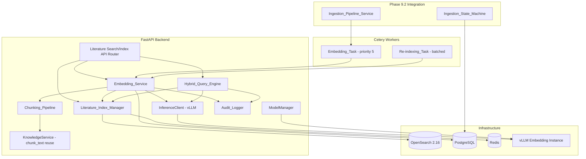
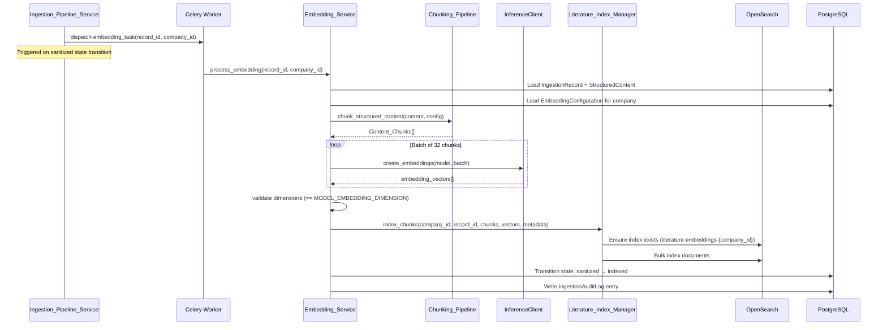
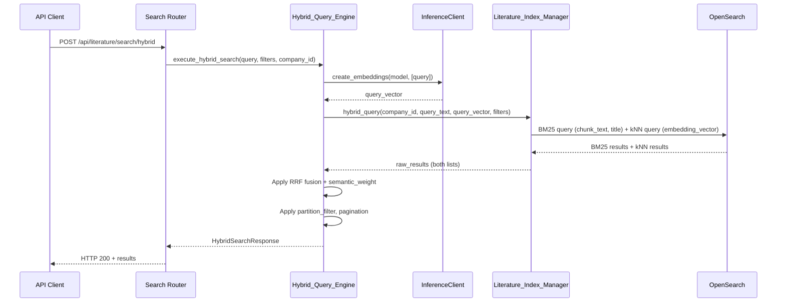

# Design Document: High-Dimensional Embedding Generation & Hybrid Indexing (Phase 9.3)

## Overview

This design specifies the architecture for generating high-dimensional semantic embedding vectors from ingested literature content (Phase 9.2) and indexing them in OpenSearch alongside BM25 keyword fields for hybrid search. The system provides complete multi-tenant isolation via per-company OpenSearch indices (Corporate_Vector_Spaces), automatic partition tagging to distinguish public literature from private knowledge, and a unified hybrid search engine combining BM25 lexical matching with kNN semantic similarity using reciprocal rank fusion (RRF).

The design integrates with existing infrastructure:
- **InferenceClient** (Phase 4.3): Routes embedding requests to the dedicated vLLM embedding instance at `VLLM_EMBEDDING_URL`
- **ModelManager** (Phase 4.3): Ensures the embedding model is loaded before generation
- **KnowledgeService.chunk_text()**: Reused for consistent chunking (512 tokens, 50 overlap, whitespace-split approximation)
- **Ingestion_Pipeline_Service** (Phase 9.2): State machine extended with `sanitized → indexed` transition trigger
- **Celery + Redis**: Async task execution on the `literature_ingestion` queue

### Key Design Decisions

| Decision | Choice | Rationale |
|----------|--------|-----------|
| Index isolation | One OpenSearch index per company (`literature-embeddings-{company_id}`) | Physical isolation prevents cross-tenant leakage at infrastructure level |
| Vector algorithm | HNSW with cosine similarity | Industry standard for high-recall approximate nearest neighbor; cosine normalizes for varying text lengths |
| Hybrid fusion | Reciprocal Rank Fusion (RRF) | Simple, robust, parameter-light; avoids score normalization issues between BM25 and kNN |
| Chunking reuse | Delegate to `KnowledgeService.chunk_text()` | Ensures embedding space consistency between literature and internal documents |
| Embedding batching | 32 chunks per vLLM request | Balances throughput vs. memory on vLLM instance; matches existing `_generate_embeddings_real` batch size |
| Re-indexing atomicity | Delete-then-insert per record with retry | Prevents stale vectors; retry handles transient OpenSearch failures |
| Configuration scope | Per-company `EmbeddingConfiguration` model | Different teams have different needs (chunk size, auto-embed behavior) |
| Partition tagging | `partition_tag` keyword field on each chunk | Enables filtered search without separate indices per content type |
| Graceful degradation | BM25-only fallback when vLLM unavailable | Search remains functional (albeit without semantic) during model outages |
| Task dispatch | Celery task on state transition | Decouples embedding generation from the synchronous ingestion flow |

## Architecture

### High-Level System Diagram



### Data Flow: Embedding Generation Pipeline



### Data Flow: Hybrid Search



### Package Layout

```
src/backend/src/alcoabase/
├── literature/
│   ├── embedding/                      # NEW — Phase 9.3 sub-package
│   │   ├── __init__.py
│   │   ├── services/
│   │   │   ├── __init__.py
│   │   │   ├── embedding_service.py    # Embedding_Service orchestrator
│   │   │   ├── chunking_pipeline.py    # Chunking_Pipeline (extends KnowledgeService)
│   │   │   ├── index_manager.py        # Literature_Index_Manager (OpenSearch ops)
│   │   │   └── hybrid_query_engine.py  # Hybrid_Query_Engine (search execution)
│   │   ├── schemas/
│   │   │   ├── __init__.py
│   │   │   ├── search.py              # Search request/response Pydantic schemas
│   │   │   ├── indexing.py            # Indexing request/response schemas
│   │   │   └── configuration.py      # EmbeddingConfiguration schemas
│   │   ├── models/
│   │   │   ├── __init__.py
│   │   │   ├── embedding_config.py    # EmbeddingConfiguration SQLAlchemy model
│   │   │   └── reindex_job.py         # ReindexJob SQLAlchemy model
│   │   └── exceptions.py              # Embedding/indexing specific exceptions
│   ├── ingestion/                      # Existing (Phase 9.2)
│   ├── adapters/                       # Existing (Phase 9.1)
│   ├── services/                       # Existing (Phase 9.1)
│   └── schemas/                        # Existing (Phase 9.1)
├── api/
│   ├── literature_search_router.py     # NEW — Search API endpoints
│   └── literature_index_router.py      # NEW — Index management endpoints
├── tasks/
│   ├── literature_ingestion_tasks.py   # Existing (extended with embedding dispatch)
│   └── literature_embedding_tasks.py   # NEW — Embedding + re-indexing Celery tasks
├── services/
│   ├── knowledge_service.py            # Existing (chunk_text reused)
│   ├── inference_client.py             # Existing (create_embeddings reused)
│   └── model_manager.py               # Existing (ensure_model reused)
└── config.py                           # Extended with Phase 9.3 settings
```

## Components and Interfaces

### Embedding_Service (Orchestrator)

```python
"""Orchestrates embedding generation, indexing, and re-indexing.

Coordinates chunking, vLLM inference, OpenSearch indexing, state transitions,
and audit logging. Entry point for both automatic (Celery task) and manual
(API-triggered) embedding operations.

References:
    - Requirements 1, 8, 9, 11, 12
"""

from __future__ import annotations

from typing import TYPE_CHECKING

if TYPE_CHECKING:
    from sqlalchemy.ext.asyncio import async_sessionmaker

    from alcoabase.literature.embedding.services.chunking_pipeline import ChunkingPipeline
    from alcoabase.literature.embedding.services.index_manager import LiteratureIndexManager
    from alcoabase.services.inference_client import InferenceClient
    from alcoabase.services.model_manager import ModelManager


class EmbeddingService:
    """Orchestrates embedding generation and indexing for literature content.

    Responsibilities:
        - Generate embeddings for IngestionRecords (abstract or full-text)
        - Respect per-company EmbeddingConfiguration settings
        - Manage batch re-indexing operations with progress tracking
        - Enforce idempotent indexing (delete-then-insert per record)
        - Validate embedding dimensions before indexing
        - Handle retries and state transitions on failure
    """

    def __init__(
        self,
        session_factory: "async_sessionmaker",
        inference_client: InferenceClient,
        model_manager: ModelManager,
        index_manager: LiteratureIndexManager,
        chunking_pipeline: ChunkingPipeline,
    ) -> None:
        """Initialize with all required dependencies."""
        ...

    async def generate_and_index_embeddings(
        self,
        record_id: int,
        company_id: int,
        user_id: int | None = None,
        triggering_event: str = "auto",
    ) -> dict[str, Any]:
        """Generate embeddings for an IngestionRecord and index into OpenSearch.

        Steps:
            1. Load IngestionRecord and EmbeddingConfiguration
            2. Load StructuredContent from MinIO (or use abstract)
            3. Chunk content via ChunkingPipeline
            4. Generate embeddings in batches of 32 via InferenceClient
            5. Validate all vectors have correct dimension
            6. Delete existing chunks for this record (idempotent)
            7. Bulk index new chunks into OpenSearch
            8. Transition state to 'indexed'
            9. Write audit log entries

        Args:
            record_id: IngestionRecord to process.
            company_id: Tenant scope.
            user_id: Triggering user (None for automated).
            triggering_event: 'auto' or 'manual'.

        Returns:
            Dict with status, chunk_count, duration_ms.

        Raises:
            EmbeddingDimensionMismatchError: If vectors have wrong dimension.
            EmbeddingGenerationError: If vLLM fails after retries.
            IndexingUnavailableError: If OpenSearch fails after retries.
        """
        ...

    async def initiate_reindex(
        self,
        company_id: int,
        user_id: int,
        reason: str,
        state_filter: list[str] | None = None,
        record_ids: list[int] | None = None,
    ) -> str:
        """Initiate a batch re-indexing job for a company.

        Creates a ReindexJob record and dispatches the first batch.

        Args:
            company_id: Company to re-index.
            user_id: Initiating admin.
            reason: X-Change-Reason value.
            state_filter: Optional list of states to include.
            record_ids: Optional specific record IDs.

        Returns:
            task_id (UUID string) for progress tracking.

        Raises:
            ReindexAlreadyActiveError: If a job is already running.
        """
        ...

    async def cancel_reindex(
        self,
        task_id: str,
        company_id: int,
        user_id: int,
    ) -> bool:
        """Cancel an active re-indexing job.

        Sets status to 'cancelled', stops dispatching new batches.

        Args:
            task_id: UUID of the re-indexing job.
            company_id: Tenant scope.
            user_id: Requesting admin.

        Returns:
            True if cancellation was recorded.
        """
        ...

    async def get_reindex_progress(
        self,
        task_id: str,
        company_id: int,
    ) -> dict[str, Any]:
        """Get progress information for a re-indexing job.

        Returns:
            Dict with percentage, records_processed, records_failed,
            estimated_remaining_seconds.
        """
        ...
```

### Chunking_Pipeline

```python
"""Content chunking for literature embedding generation.

Extends the existing KnowledgeService.chunk_text() with literature-specific
features: section-boundary awareness, title/heading prepending, and
per-company configurable chunk sizes.

References:
    - Requirement 2
"""

from __future__ import annotations

from dataclasses import dataclass

from alcoabase.literature.ingestion.schemas.structured_content import StructuredContent


@dataclass(frozen=True)
class ContentChunk:
    """A single chunk of content ready for embedding.

    Attributes:
        text: The chunk text (with prepended context).
        chunk_index: 0-based position in the document's chunk sequence.
        section_heading: Source section heading (empty for abstract).
        source_field: 'abstract' or 'body'.
    """

    text: str
    chunk_index: int
    section_heading: str
    source_field: str


class ChunkingPipeline:
    """Segments StructuredContent into ContentChunks for embedding.

    Reuses KnowledgeService.chunk_text() for the core splitting algorithm,
    adding section-boundary awareness and title/heading prepending.
    """

    def __init__(
        self,
        chunk_size_tokens: int = 512,
        chunk_overlap_tokens: int = 50,
        max_context_tokens: int = 64,
    ) -> None:
        """Initialize with chunking parameters.

        Args:
            chunk_size_tokens: Maximum tokens per chunk (default 512).
            chunk_overlap_tokens: Overlap between consecutive chunks (default 50).
            max_context_tokens: Maximum tokens for prepended title/heading (default 64).
        """
        ...

    def chunk_structured_content(
        self,
        content: StructuredContent,
        max_chunks: int = 500,
        embed_abstract_only: bool = False,
    ) -> list[ContentChunk]:
        """Chunk a StructuredContent into ContentChunks.

        Processing order:
            1. Abstract → chunks (always if non-empty)
            2. Body sections → chunks (unless embed_abstract_only=True)

        Each chunk has title + section_heading prepended (max 64 tokens).
        Respects section boundaries where possible.
        Truncates to max_chunks if exceeded.

        Args:
            content: StructuredContent from Phase 9.2.
            max_chunks: Maximum chunks to produce.
            embed_abstract_only: If True, skip body sections.

        Returns:
            Ordered list of ContentChunks.
        """
        ...

    def chunk_abstract(
        self,
        abstract: str,
        title: str = "",
    ) -> list[ContentChunk]:
        """Chunk an abstract text (for abstract-only embedding).

        Used when an IngestionRecord has abstract but no full-text.

        Args:
            abstract: Abstract text.
            title: Document title for prepending.

        Returns:
            List of ContentChunks from the abstract.
        """
        ...

    def _prepend_context(
        self,
        chunk_text: str,
        title: str,
        section_heading: str,
    ) -> str:
        """Prepend title and section heading to a chunk.

        Context is truncated to max_context_tokens at word boundary.

        Args:
            chunk_text: Raw chunk text.
            title: Document title.
            section_heading: Section heading.

        Returns:
            Chunk text with prepended context.
        """
        ...

    def _split_at_section_boundaries(
        self,
        text: str,
    ) -> list[str]:
        """Split text at paragraph or section heading boundaries.

        Identifies boundaries as double-newlines or heading patterns.

        Args:
            text: Section text to split.

        Returns:
            List of paragraph/subsection texts.
        """
        ...

    def _split_at_sentence_boundary(
        self,
        text: str,
        max_tokens: int,
    ) -> tuple[str, str]:
        """Split text at nearest sentence boundary within token limit.

        Falls back to word boundary if no sentence boundary found.

        Args:
            text: Text to split.
            max_tokens: Maximum tokens for the first part.

        Returns:
            Tuple of (first_part, remainder).
        """
        ...
```

### Literature_Index_Manager

```python
"""OpenSearch operations for literature embedding indices.

Manages index lifecycle (create, delete, template), bulk indexing,
deletion, and raw query execution. Enforces company isolation at
every operation.

References:
    - Requirements 3, 4, 5, 12, 14
"""

from __future__ import annotations

from dataclasses import dataclass
from typing import Any


@dataclass(frozen=True)
class IndexedChunk:
    """A chunk document to be stored in OpenSearch.

    Attributes:
        embedding_vector: Float32 embedding vector.
        chunk_text: Raw text of the chunk.
        title: Document title.
        abstract_snippet: First 200 chars of abstract.
        authors: List of author names.
        doi: Digital Object Identifier.
        publication_date: ISO-8601 date string.
        source_id: Source adapter name.
        external_id: Source-specific identifier.
        ingestion_record_id: FK to IngestionRecord.
        company_id: Tenant identifier.
        partition_tag: 'public_literature' or 'private_knowledge'.
        section_heading: Source section heading.
        chunk_index: Position in document chunk sequence.
    """

    embedding_vector: list[float]
    chunk_text: str
    title: str
    abstract_snippet: str
    authors: list[str]
    doi: str | None
    publication_date: str | None
    source_id: str | None
    external_id: str | None
    ingestion_record_id: int
    company_id: int
    partition_tag: str
    section_heading: str
    chunk_index: int


class LiteratureIndexManager:
    """Manages OpenSearch indices for literature embeddings.

    One index per company: literature-embeddings-{company_id}.
    Uses HNSW for kNN with cosine similarity.
    """

    INDEX_PREFIX = "literature-embeddings"
    TEMPLATE_NAME = "literature-embeddings-template"

    def __init__(
        self,
        opensearch_client: Any,  # opensearch-py OpenSearch client
        embedding_dimension: int = 1024,
        shards: int = 1,
        replicas: int = 1,
        hnsw_ef_construction: int = 256,
        hnsw_m: int = 16,
    ) -> None:
        """Initialize with OpenSearch client and index settings."""
        ...

    def _index_name(self, company_id: int) -> str:
        """Construct index name for a company.

        Returns:
            'literature-embeddings-{company_id}'
        """
        return f"{self.INDEX_PREFIX}-{company_id}"

    async def ensure_index_exists(self, company_id: int) -> None:
        """Create company index if it doesn't exist.

        Applies the index template mapping with kNN vector field,
        BM25 text fields, and metadata fields.

        Retries up to 3 times with 10s intervals on failure.

        Args:
            company_id: Company whose index to ensure.

        Raises:
            IndexCreationError: If all retries exhausted.
        """
        ...

    async def apply_index_template(self) -> None:
        """Create/update the index template for literature-embeddings-* pattern.

        Configures: kNN vector field (HNSW, cosine), BM25 text fields,
        keyword metadata fields, date fields.
        """
        ...

    async def bulk_index_chunks(
        self,
        company_id: int,
        chunks: list[IndexedChunk],
    ) -> int:
        """Bulk index chunks into a company's literature index.

        Validates company_id matches for all chunks before indexing.

        Args:
            company_id: Target company index.
            chunks: List of IndexedChunk documents.

        Returns:
            Number of chunks successfully indexed.

        Raises:
            TenantIsolationError: If any chunk's company_id doesn't match.
            IndexingUnavailableError: If OpenSearch unreachable after retries.
        """
        ...

    async def delete_record_chunks(
        self,
        company_id: int,
        ingestion_record_id: int,
    ) -> int:
        """Delete all chunks belonging to a specific IngestionRecord.

        Uses delete-by-query with ingestion_record_id filter.

        Args:
            company_id: Company scope.
            ingestion_record_id: Record whose chunks to delete.

        Returns:
            Number of chunks deleted.
        """
        ...

    async def update_partition_tags(
        self,
        company_id: int,
        ingestion_record_id: int,
        new_tag: str,
    ) -> int:
        """Atomically update partition_tag for all chunks of a record.

        Uses update-by-query with scripted field update.
        Rolls back on partial failure.

        Args:
            company_id: Company scope.
            ingestion_record_id: Target record.
            new_tag: New partition_tag value.

        Returns:
            Number of chunks updated.

        Raises:
            PartitionTagUpdateError: If update fails or partial.
        """
        ...

    async def delete_company_index(self, company_id: int) -> bool:
        """Delete entire company index on company removal.

        Retries 3 times with 30s intervals.

        Args:
            company_id: Company whose index to delete.

        Returns:
            True if deletion succeeded.
        """
        ...

    async def get_index_stats(self, company_id: int) -> dict[str, Any]:
        """Get index health, document count, size for a company.

        Returns:
            Dict with health, doc_count, chunks_indexed, size_bytes,
            last_indexing_timestamp.
        """
        ...

    def _build_index_mapping(self) -> dict[str, Any]:
        """Build the OpenSearch index mapping with all fields.

        Returns:
            Complete mapping dict for index creation.
        """
        return {
            "settings": {
                "index": {
                    "knn": True,
                    "number_of_shards": self._shards,
                    "number_of_replicas": self._replicas,
                }
            },
            "mappings": {
                "properties": {
                    "embedding_vector": {
                        "type": "knn_vector",
                        "dimension": self._embedding_dimension,
                        "method": {
                            "name": "hnsw",
                            "space_type": "cosinesimil",
                            "engine": "nmslib",
                            "parameters": {
                                "ef_construction": self._hnsw_ef_construction,
                                "m": self._hnsw_m,
                            },
                        },
                    },
                    "chunk_text": {"type": "text", "analyzer": "standard"},
                    "title": {"type": "text", "analyzer": "standard"},
                    "abstract_snippet": {"type": "text"},
                    "authors": {"type": "keyword"},
                    "doi": {"type": "keyword"},
                    "publication_date": {"type": "date"},
                    "source_id": {"type": "keyword"},
                    "external_id": {"type": "keyword"},
                    "ingestion_record_id": {"type": "integer"},
                    "company_id": {"type": "integer"},
                    "partition_tag": {"type": "keyword"},
                    "section_heading": {"type": "keyword"},
                    "chunk_index": {"type": "integer"},
                    "created_at": {"type": "date"},
                }
            },
        }
```

### Hybrid_Query_Engine

```python
"""Hybrid search combining BM25 keyword + kNN semantic with RRF fusion.

Executes dual queries against OpenSearch, merges results via reciprocal
rank fusion, applies partition filters, and handles graceful degradation.

References:
    - Requirements 6, 7, 10
"""

from __future__ import annotations

from dataclasses import dataclass, field
from typing import Any


@dataclass
class HybridSearchRequest:
    """Validated search request parameters.

    Attributes:
        query: Search query text (1-1000 chars).
        company_id: Requesting company (from X-Company-Id header).
        user_id: Requesting user.
        partition_filter: 'public_literature', 'private_knowledge', or 'all'.
        semantic_weight: Float 0.0-1.0 (default 0.5).
        rrf_k: RRF k parameter (default 60).
        page: Page number (1-based, default 1).
        page_size: Results per page (1-100, default 20).
        literature_boost: Boost for literature results (default 1.0).
        internal_boost: Boost for internal results (default 1.0).
        date_range_start: Optional start date filter.
        date_range_end: Optional end date filter.
        source_id: Optional source filter.
        authors: Optional author filter list.
        publication_type: Optional type filter.
        include_internal: Whether to include internal docs (unified only).
    """

    query: str
    company_id: int
    user_id: int
    partition_filter: str = "all"
    semantic_weight: float = 0.5
    rrf_k: int = 60
    page: int = 1
    page_size: int = 20
    literature_boost: float = 1.0
    internal_boost: float = 1.0
    date_range_start: str | None = None
    date_range_end: str | None = None
    source_id: str | None = None
    authors: list[str] = field(default_factory=list)
    publication_type: str | None = None
    include_internal: bool = False


@dataclass
class HybridSearchResult:
    """A single search result with RRF-fused relevance score."""

    chunk_text: str
    title: str
    authors: list[str]
    doi: str | None
    publication_date: str | None
    source_id: str | None
    relevance_score: float
    partition_tag: str
    section_heading: str
    ingestion_record_id: int


@dataclass
class HybridSearchResponse:
    """Complete search response with metadata."""

    results: list[HybridSearchResult]
    total_count: int
    page: int
    page_size: int
    degraded_mode: bool = False
    partial_results: bool = False
    unavailable_index: str | None = None


class HybridQueryEngine:
    """Executes hybrid BM25 + kNN searches with RRF fusion.

    Handles:
        - Query embedding generation via InferenceClient
        - Dual-query execution (BM25 + kNN) against OpenSearch
        - Reciprocal rank fusion scoring
        - Partition filtering and boosting
        - Graceful degradation (BM25-only fallback)
        - Unified search across literature + internal indices
    """

    def __init__(
        self,
        index_manager: "LiteratureIndexManager",
        inference_client: "InferenceClient",
        model_manager: "ModelManager",
        model_name: str,
        default_rrf_k: int = 60,
    ) -> None:
        """Initialize with dependencies."""
        ...

    async def search(
        self,
        request: HybridSearchRequest,
    ) -> HybridSearchResponse:
        """Execute a hybrid search request.

        Steps:
            1. Generate query embedding (or fallback to BM25-only)
            2. Build OpenSearch query (BM25 + kNN)
            3. Execute against company index
            4. Apply RRF fusion with semantic_weight
            5. Apply pagination

        Args:
            request: Validated search parameters.

        Returns:
            HybridSearchResponse with fused results.

        Raises:
            SearchServiceUnavailableError: If OpenSearch unreachable.
        """
        ...

    async def unified_search(
        self,
        request: HybridSearchRequest,
    ) -> HybridSearchResponse:
        """Execute unified search across literature + internal indices.

        Queries both indices, applies ABAC for internal docs,
        merges with RRF, applies partition boosting.

        Args:
            request: Search parameters with include_internal=True.

        Returns:
            HybridSearchResponse with merged results.
        """
        ...

    def _apply_rrf(
        self,
        bm25_results: list[dict[str, Any]],
        knn_results: list[dict[str, Any]],
        k: int,
        semantic_weight: float,
    ) -> list[dict[str, Any]]:
        """Apply reciprocal rank fusion to merge two result lists.

        RRF score = (1-w) * 1/(k + bm25_rank) + w * 1/(k + knn_rank)

        Where w = semantic_weight.
        Documents appearing in only one list get 0 contribution from
        the other list.

        Args:
            bm25_results: BM25-ranked results with doc IDs.
            knn_results: kNN-ranked results with doc IDs.
            k: RRF k parameter (default 60).
            semantic_weight: Weight for semantic score (0.0-1.0).

        Returns:
            Merged list sorted by RRF score descending.
        """
        ...

    def _build_bm25_query(
        self,
        query_text: str,
        company_id: int,
        filters: dict[str, Any],
    ) -> dict[str, Any]:
        """Build OpenSearch BM25 query with mandatory company_id filter.

        Searches chunk_text and title fields.
        Always includes bool filter for company_id (defense-in-depth).

        Args:
            query_text: User's search query.
            company_id: Tenant scope (mandatory filter).
            filters: Additional filters (partition_tag, date_range, etc.).

        Returns:
            OpenSearch query DSL dict.
        """
        ...

    def _build_knn_query(
        self,
        query_vector: list[float],
        company_id: int,
        filters: dict[str, Any],
        k: int = 100,
    ) -> dict[str, Any]:
        """Build OpenSearch kNN query with mandatory company_id filter.

        Args:
            query_vector: Query embedding vector.
            company_id: Tenant scope (mandatory filter).
            filters: Additional filters.
            k: Number of nearest neighbors to retrieve.

        Returns:
            OpenSearch kNN query DSL dict.
        """
        ...
```

### Celery Tasks

```python
"""Celery tasks for embedding generation and re-indexing.

References:
    - Requirements 1.8, 8.2, 8.9, 12.1, 12.6
"""


@celery_app.task(
    bind=True,
    name="alcoabase.tasks.literature_embedding_tasks.generate_embeddings",
    queue="literature_ingestion",
    max_retries=3,
    acks_late=True,
    priority=5,
    soft_time_limit=600,  # 10 minutes
)
def generate_embeddings(
    self,
    *,
    record_id: int,
    company_id: int,
    user_id: int | None = None,
    triggering_event: str = "auto",
) -> dict[str, Any]:
    """Generate embeddings for an IngestionRecord.

    Exponential backoff: 30s, 120s, 600s.

    Args:
        record_id: IngestionRecord to embed.
        company_id: Tenant scope.
        user_id: Triggering user (None for automated).
        triggering_event: 'auto' or 'manual'.

    Returns:
        Dict with status and chunk_count.
    """
    ...


@celery_app.task(
    bind=True,
    name="alcoabase.tasks.literature_embedding_tasks.reindex_batch",
    queue="literature_ingestion",
    max_retries=0,
    acks_late=True,
    priority=7,
    soft_time_limit=600,  # 10 minutes per batch
)
def reindex_batch(
    self,
    *,
    job_id: str,
    company_id: int,
    record_ids: list[int],
    batch_number: int,
) -> dict[str, Any]:
    """Re-index a batch of records as part of a re-indexing job.

    Processes each record: delete existing chunks → re-chunk → embed → index.
    Updates ReindexJob progress after each record.

    Args:
        job_id: UUID of the ReindexJob.
        company_id: Tenant scope.
        record_ids: Records in this batch.
        batch_number: Batch sequence number for progress.

    Returns:
        Dict with processed_count, failed_count, failed_ids.
    """
    ...
```

## Data Models

### EmbeddingConfiguration (SQLAlchemy)

```python
"""Per-company embedding configuration model.

References:
    - Requirement 9
"""

from sqlalchemy import Boolean, ForeignKey, Integer, UniqueConstraint
from sqlalchemy.orm import Mapped, mapped_column

from alcoabase.database import Base
from alcoabase.models.audit import AuditMixin


class EmbeddingConfiguration(Base, AuditMixin):
    """Per-company embedding generation settings.

    Attributes:
        id: Primary key.
        company_id: FK to companies table (unique per company).
        chunk_size_tokens: Max tokens per chunk (128-2048, default 512).
        chunk_overlap_tokens: Overlap tokens (0-256, default 50).
        auto_embed_on_ingest: Auto-generate on state transition (default True).
        embed_abstract_only: Skip body sections (default False).
        max_chunks_per_document: Cap chunks per record (1-5000, default 500).
    """

    __tablename__ = "literature_embedding_configurations"
    __versioned__ = {}

    id: Mapped[int] = mapped_column(primary_key=True)
    company_id: Mapped[int] = mapped_column(
        ForeignKey("companies.id"), unique=True, index=True
    )
    chunk_size_tokens: Mapped[int] = mapped_column(Integer, default=512)
    chunk_overlap_tokens: Mapped[int] = mapped_column(Integer, default=50)
    auto_embed_on_ingest: Mapped[bool] = mapped_column(Boolean, default=True)
    embed_abstract_only: Mapped[bool] = mapped_column(Boolean, default=False)
    max_chunks_per_document: Mapped[int] = mapped_column(Integer, default=500)

    __table_args__ = (
        UniqueConstraint("company_id", name="uq_embedding_config_company"),
    )
```

### ReindexJob (SQLAlchemy)

```python
"""Re-indexing job progress tracking model.

References:
    - Requirement 8.3
"""

from datetime import datetime

from sqlalchemy import DateTime, ForeignKey, Integer, String, func
from sqlalchemy.orm import Mapped, mapped_column

from alcoabase.database import Base


class ReindexJob(Base):
    """Tracks batch re-indexing job progress per company.

    Attributes:
        id: Primary key.
        task_id: UUID for external reference.
        company_id: FK to companies table.
        status: queued | in_progress | completed | failed | cancelled.
        total_records: Total records targeted.
        total_batches: Total batches computed.
        current_batch: Current batch number.
        records_processed: Successfully re-indexed count.
        records_failed: Failed record count.
        started_at: Job start timestamp.
        updated_at: Last progress update.
        cancelled_by: User who cancelled (nullable).
        cancel_reason: Cancellation reason (nullable).
    """

    __tablename__ = "literature_reindex_jobs"

    id: Mapped[int] = mapped_column(primary_key=True)
    task_id: Mapped[str] = mapped_column(String(36), unique=True, index=True)
    company_id: Mapped[int] = mapped_column(
        ForeignKey("companies.id"), index=True
    )
    status: Mapped[str] = mapped_column(String(20), default="queued")
    total_records: Mapped[int] = mapped_column(Integer, default=0)
    total_batches: Mapped[int] = mapped_column(Integer, default=0)
    current_batch: Mapped[int] = mapped_column(Integer, default=0)
    records_processed: Mapped[int] = mapped_column(Integer, default=0)
    records_failed: Mapped[int] = mapped_column(Integer, default=0)
    started_at: Mapped[datetime] = mapped_column(
        DateTime(timezone=True), server_default=func.now()
    )
    updated_at: Mapped[datetime] = mapped_column(
        DateTime(timezone=True), server_default=func.now(), onupdate=func.now()
    )
    cancelled_by: Mapped[int | None] = mapped_column(Integer, nullable=True)
    cancel_reason: Mapped[str | None] = mapped_column(String(500), nullable=True)
```

### OpenSearch Document Schema (Indexed Chunk)

```json
{
  "embedding_vector": [0.123, -0.456, ...],
  "chunk_text": "The experiment demonstrated that...",
  "title": "Impact of Temperature on Catalyst Performance",
  "abstract_snippet": "This paper investigates the effect of...",
  "authors": ["Smith, J.", "Doe, A."],
  "doi": "10.1000/xyz123",
  "publication_date": "2024-03-15",
  "source_id": "pubmed",
  "external_id": "PMID:12345678",
  "ingestion_record_id": 42,
  "company_id": 1,
  "partition_tag": "public_literature",
  "section_heading": "Results",
  "chunk_index": 3,
  "created_at": "2024-12-01T10:30:00Z"
}
```

### Pydantic Response Schemas

```python
"""Search and indexing response schemas.

References:
    - Requirement 10
"""

from pydantic import BaseModel, Field


class HybridSearchResultSchema(BaseModel):
    """Single search result in API response."""

    chunk_text: str
    title: str
    authors: list[str]
    doi: str | None
    publication_date: str | None
    source_id: str | None
    relevance_score: float = Field(ge=0.0, le=1.0)
    partition_tag: str
    section_heading: str
    ingestion_record_id: int


class HybridSearchResponseSchema(BaseModel):
    """Complete search response."""

    results: list[HybridSearchResultSchema]
    total_count: int = Field(ge=0)
    page: int = Field(ge=1)
    page_size: int = Field(ge=1, le=100)
    degraded_mode: bool = False
    partial_results: bool = False
    unavailable_index: str | None = None


class IndexStatusSchema(BaseModel):
    """Index health and statistics."""

    health: str  # green | yellow | red
    document_count: int = Field(ge=0)
    chunks_indexed: int = Field(ge=0)
    size_bytes: int = Field(ge=0)
    last_indexing_timestamp: str | None


class ReindexProgressSchema(BaseModel):
    """Re-indexing job progress."""

    task_id: str
    status: str
    percentage: int = Field(ge=0, le=100)
    records_processed: int = Field(ge=0)
    records_failed: int = Field(ge=0)
    estimated_remaining_seconds: int | None


class EmbeddingConfigurationSchema(BaseModel):
    """Embedding configuration read/write schema."""

    chunk_size_tokens: int = Field(default=512, ge=128, le=2048)
    chunk_overlap_tokens: int = Field(default=50, ge=0, le=256)
    auto_embed_on_ingest: bool = True
    embed_abstract_only: bool = False
    max_chunks_per_document: int = Field(default=500, ge=1, le=5000)
```

### Configuration Extensions (config.py)

```python
# New settings to add to the Settings class in config.py:

# Phase 9.3: Embedding & Hybrid Indexing
literature_index_shards: int = Field(
    default=1, ge=1,
    alias="ALC_LITERATURE_INDEX_SHARDS",
)
literature_index_replicas: int = Field(
    default=1, ge=1,
    alias="ALC_LITERATURE_INDEX_REPLICAS",
)
literature_hnsw_ef_construction: int = Field(
    default=256, ge=1,
    alias="ALC_LITERATURE_HNSW_EF_CONSTRUCTION",
)
literature_hnsw_m: int = Field(
    default=16, ge=1,
    alias="ALC_LITERATURE_HNSW_M",
)
literature_rrf_k: int = Field(
    default=60, ge=1,
    alias="ALC_LITERATURE_RRF_K",
)
literature_embedding_queue: str = Field(
    default="literature_ingestion",
    alias="ALC_LITERATURE_EMBEDDING_QUEUE",
)
reindex_batch_size: int = Field(
    default=50, ge=10, le=200,
    alias="ALC_REINDEX_BATCH_SIZE",
)
```

## Correctness Properties

*A property is a characteristic or behavior that should hold true across all valid executions of a system — essentially, a formal statement about what the system should do. Properties serve as the bridge between human-readable specifications and machine-verifiable correctness guarantees.*

### Property 1: Chunking token limit and overlap

*For any* non-empty text input and configured chunk_size (128–2048) and overlap (0–256 where overlap < chunk_size), every chunk produced by the Chunking_Pipeline SHALL contain at most chunk_size whitespace-delimited tokens, and consecutive chunks SHALL share exactly overlap tokens at their boundaries.

**Validates: Requirements 1.3, 2.1**

### Property 2: Chunking completeness (round-trip)

*For any* non-empty text input, the concatenation of the unique (non-overlapping) text portions from all chunks produced by the Chunking_Pipeline SHALL reconstruct the entire original input text without omission or reordering.

**Validates: Requirements 2.7**

### Property 3: Non-empty input produces chunks; whitespace produces none

*For any* string containing at least one non-whitespace character, the Chunking_Pipeline SHALL produce at least one Content_Chunk; *for any* string consisting solely of whitespace characters (or empty string), the Chunking_Pipeline SHALL produce zero Content_Chunks.

**Validates: Requirements 2.6**

### Property 4: Context prepending bounded at 64 tokens

*For any* title string and section_heading string, the prepended context added to a chunk SHALL contain at most 64 whitespace-delimited tokens; if the combined title and heading exceed 64 tokens, the prepended text SHALL be truncated at a word boundary.

**Validates: Requirements 2.5**

### Property 5: Tenant isolation on indexing and search

*For any* company_id used in an indexing operation, the target OpenSearch index name SHALL be exactly `literature-embeddings-{company_id}`; *for any* search query construction, the query SHALL contain a mandatory boolean filter clause for `company_id` equal to the authenticated tenant's ID, and the target index SHALL be constructed exclusively from the authenticated company_id.

**Validates: Requirements 4.1, 4.2, 4.4, 4.5**

### Property 6: Source-based partition tagging

*For any* Content_Chunk derived from an Ingestion_Record (literature pipeline), the `partition_tag` field SHALL be `public_literature`; *for any* Content_Chunk derived from an internal document upload, the `partition_tag` field SHALL be `private_knowledge`.

**Validates: Requirements 5.1, 5.2**

### Property 7: RRF fusion computation correctness

*For any* two ranked result lists (BM25 and kNN), a k parameter (integer ≥ 1), and a semantic_weight w (0.0–1.0), the reciprocal rank fusion score for each document SHALL equal `(1-w) * 1/(k + bm25_rank) + w * 1/(k + knn_rank)` where rank is 1-based position; documents appearing in only one list receive 0 contribution from the missing list. The final list SHALL be sorted by RRF score descending.

**Validates: Requirements 6.1, 6.3**

### Property 8: Semantic weight boundary behavior

*For any* set of BM25 and kNN results, when `semantic_weight` = 0.0 the final ranking SHALL be determined entirely by BM25 ranks (pure keyword), and when `semantic_weight` = 1.0 the final ranking SHALL be determined entirely by kNN ranks (pure semantic).

**Validates: Requirements 6.4**

### Property 9: Pagination correctness

*For any* ranked result list of N items, page number p (≥1), and page_size s (1–100), the returned results SHALL be the slice `[(p-1)*s : p*s]` of the full ranked list, and the total_count SHALL equal N.

**Validates: Requirements 6.5**

### Property 10: Embedding batch size correctness

*For any* list of N Content_Chunks where N ≥ 1, the Embedding_Service SHALL invoke InferenceClient.create_embeddings in exactly `ceil(N/32)` calls, each with at most 32 chunks, and the concatenated results SHALL maintain the original chunk ordering.

**Validates: Requirements 1.4**

### Property 11: Idempotent indexing

*For any* Ingestion_Record, indexing it once and then re-indexing it (delete + re-insert) SHALL produce an identical set of indexed chunks in OpenSearch — same chunk count, same chunk texts, same embedding vectors — as a single fresh indexing of the same source content.

**Validates: Requirements 8.4, 12.4**

### Property 12: Deletion scoping by record_id

*For any* set of indexed records belonging to the same company, deleting chunks for one `ingestion_record_id` SHALL remove only the chunks with that specific record_id and SHALL leave all other records' chunks unchanged.

**Validates: Requirements 12.5**

### Property 13: Embedding dimension validation

*For any* embedding vector returned by the vLLM instance, if its length does not equal the configured `MODEL_EMBEDDING_DIMENSION` value, the Embedding_Service SHALL reject the entire batch and transition the Ingestion_Record to `failed` with error_type `embedding_dimension_mismatch`.

**Validates: Requirements 1.5, 12.7**

### Property 14: Embedding vector round-trip precision

*For any* embedding vector generated by the Embedding_Service and stored in OpenSearch, retrieving the stored vector and comparing it element-by-element to the original SHALL yield values equal within floating-point precision tolerance (absolute difference < 1e-6 per element) across all dimensions.

**Validates: Requirements 14.1**

### Property 15: Self-retrieval property

*For any* text input between 1 and 8192 characters containing at least one alphabetic character, generating an embedding, indexing it, refreshing the index, and performing a kNN search with the same text as query SHALL return the indexed chunk as the top-1 result with a cosine similarity score of 1.0 (within floating-point tolerance).

**Validates: Requirements 14.3**

### Property 16: Configuration range validation

*For any* embedding configuration update request, if `chunk_size_tokens` is outside 128–2048, or `chunk_overlap_tokens` is outside 0–256, or `max_chunks_per_document` is outside 1–5000, the system SHALL reject the request with HTTP 422.

**Validates: Requirements 9.9**

### Property 17: Max chunks truncation

*For any* Ingestion_Record whose chunked content produces N Content_Chunks where N exceeds the company's configured `max_chunks_per_document` value M, the Embedding_Service SHALL index exactly M chunks (the first M in document order) and record the truncation in the audit trail.

**Validates: Requirements 9.6**

## Error Handling

### Embedding Generation Failures

| Failure Mode | Behavior | Recovery |
|-------------|----------|----------|
| vLLM unavailable | Retry 3x with exponential backoff (30s, 2min, 10min) | Record stays in `sanitized`; transition to `failed` after exhaustion |
| vLLM returns error (non-503) | Immediate failure, no retry | Transition to `failed` with `embedding_generation_error` |
| Dimension mismatch | Reject entire batch | Transition to `failed` with `embedding_dimension_mismatch` |
| Partial batch failure | Roll back all indexed chunks for this record | Retry entire record (up to 3 attempts) |

### Indexing Failures

| Failure Mode | Behavior | Recovery |
|-------------|----------|----------|
| OpenSearch unavailable | Retry 3x with 10s intervals | Transition to `failed` with `indexing_unavailable` |
| Index doesn't exist | Auto-create before indexing | Retry creation 3x with 10s intervals |
| Bulk index partial failure | Roll back all chunks for the record | Retry full delete+insert (up to 2 additional attempts) |
| Delete succeeds but insert fails | Must not leave zero chunks | Retry delete+insert sequence |

### Search Failures

| Failure Mode | Behavior | Recovery |
|-------------|----------|----------|
| vLLM unavailable for query embedding | Fall back to BM25-only | Return results with `degraded_mode: true` |
| OpenSearch unreachable | Return HTTP 503 | Client retries |
| One index unreachable (unified) | Return partial results | Include `partial_results: true` + `unavailable_index` field |
| Query validation failure | Return HTTP 422 | Client corrects request |

### Re-indexing Failures

| Failure Mode | Behavior | Recovery |
|-------------|----------|----------|
| Single record fails | Log failure, skip, continue batch | Record can be manually retried later |
| Batch exceeds 10-min timeout | Mark batch as failed | Next batch dispatched automatically |
| All retries exhausted for record | Mark record as failed in progress | Preserve source content for manual retry |
| Cancellation requested | Set status to `cancelled`, stop new batches | Currently executing batch completes |

### Tenant Isolation Violations

| Failure Mode | Behavior | Recovery |
|-------------|----------|----------|
| company_id mismatch in payload | Reject with HTTP 403 | Log security violation to audit trail |
| Missing X-Company-Id header | Reject with HTTP 400 | Client adds header |
| Index deletion fails on company removal | Retry 3x with 30s intervals | Log critical error; manual cleanup required |

## Testing Strategy

### Property-Based Tests (Hypothesis)

Property-based tests are the primary verification mechanism for this feature's core algorithms. Each property test maps to a correctness property defined above.

**Library**: Hypothesis (Python)
**Minimum iterations**: 100 per property (configured via `@settings(max_examples=100)`)
**Location**: `src/backend/tests/properties/test_embedding_properties.py`

**Tag format**: `# Feature: Step_9-3_high-dimensional-embedding-hybrid-indexing, Property {N}: {title}`

Properties to implement as Hypothesis tests:
- Properties 1–4: Chunking behavior (pure functions, highly suitable for PBT)
- Property 5: Tenant isolation query construction (pure function)
- Property 6: Partition tagging (pure function of source type)
- Properties 7–9: RRF fusion, weight, and pagination (pure math functions)
- Property 10: Batch size computation (pure math)
- Properties 11–12: Idempotent indexing and deletion scoping (with mocked OpenSearch)
- Property 13: Dimension validation (pure validation)
- Properties 14–15: Round-trip and self-retrieval (integration with OpenSearch; use Docker fixture)
- Properties 16–17: Configuration validation and truncation (pure logic)

### Unit Tests (pytest)

Focus on specific examples, edge cases, and integration points:

- State transitions: `sanitized → indexed`, `sanitized → failed`
- Retry logic: Verify exponential backoff timing (30s, 2min, 10min)
- Graceful degradation: BM25-only fallback when vLLM down
- Authorization: Role-based endpoint access (member, document_admin, system_admin)
- Configuration CRUD: Create, read, update with audit trail
- Re-indexing lifecycle: initiate → progress → complete/cancel
- Error responses: 400, 403, 422, 503 for various failure conditions

### Integration Tests (pytest + Docker)

Require running OpenSearch and Redis:

- End-to-end embedding pipeline: StructuredContent → chunks → embeddings → indexed → searchable
- Hybrid search accuracy: BM25 + kNN results merge correctly
- Unified search: Both indices queried and merged
- Company index isolation: Data in company A's index not visible to company B
- Re-tagging: Atomic partition_tag updates
- Index lifecycle: Create → populate → delete on company removal
- Audit trail: Verify entries for all operations

### Smoke Tests

- Configuration loading: All env vars parsed correctly by Pydantic
- OpenSearch connectivity: Template creation succeeds
- Celery task registration: Tasks registered with correct queues and priorities
- vLLM health check: Embedding instance reachable
