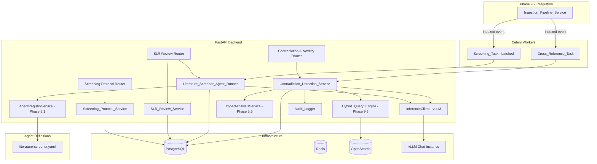
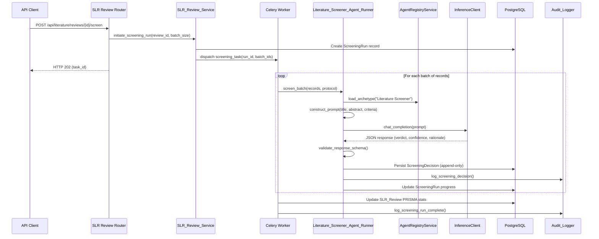
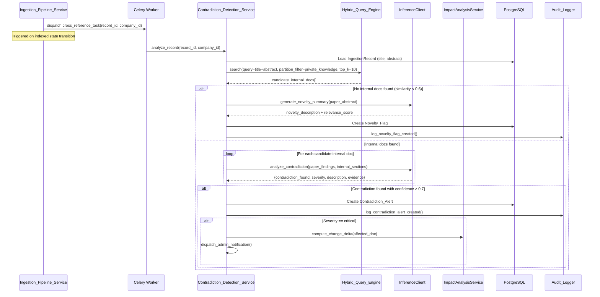

# Design Document: AI-Powered Literature Review & Synthesis Agents (Phase 9.4)

## Overview

This design specifies the architecture for intelligent literature screening agents and contradiction detection services that automate systematic literature review (SLR) workflows. The system builds on Phase 9.2 (Automated Ingestion Pipeline) and Phase 9.3 (High-Dimensional Embedding & Hybrid Indexing) by introducing an agent-driven screening pipeline and cross-referencing newly indexed literature against internal corporate documents to surface contradictions and knowledge gaps.

The design integrates with existing infrastructure:
- **IngestionPipelineService** (Phase 9.2): State machine hook on `indexed` state transition to trigger cross-referencing
- **HybridQueryEngine** (Phase 9.3): Semantic + keyword search for finding related internal documents
- **InferenceClient** (Phase 4.3): Chat completion for LLM-based screening and contradiction analysis
- **AgentRegistryService** (Phase 5.1): Hot-reload of the new Literature Screener archetype
- **ImpactAnalysisService** (Phase 5.5): Automatic escalation for critical contradictions
- **ReviewPipelineService** (Phase 5.2): Extended to support literature contradiction workflows
- **Celery + Redis**: Async task execution on `ai_operations` queue

### Key Design Decisions

| Decision | Choice | Rationale |
|----------|--------|-----------|
| Agent archetype format | YAML v2 schema in `agents/archetypes/` | Consistent with existing archetypes (master-auditor, etc.); hot-reloaded via watchfiles |
| Screening execution | Celery tasks on `ai_operations` queue | Decouples long-running LLM inference from API response cycle; matches existing pattern |
| Batch processing | Configurable batch size (1–100, default 20) | Balances throughput vs. vLLM memory pressure; enables progress tracking per batch |
| Screening decisions | Append-only with versioning | Preserves audit trail; enables re-screening without data loss |
| Contradiction trigger | Event-driven on `indexed` state transition | Immediate cross-referencing as soon as semantic search is available for the paper |
| Internal doc search | HybridQueryEngine with `partition_tag: private_knowledge` | Leverages existing RRF fusion for high-recall retrieval of related SOPs/URS |
| Severity classification | LLM-based with structured JSON output | Matches ImpactAnalysisService pattern; enables nuanced classification beyond keyword heuristics |
| Novelty detection | Zero-result check from HybridQueryEngine | Simple, effective: if no internal doc is semantically similar, the topic is novel |
| PRISMA statistics | Computed from Screening_Decision aggregates | Real-time, consistent, no separate denormalized counters |
| Protocol versioning | Auto-increment on update; old version preserved for in-progress reviews | Ensures reproducibility of completed reviews |
| Retry strategy | 3 retries, exponential backoff (30s, 2min, 10min) | Matches existing vLLM retry pattern in EmbeddingService |
| Per-company configuration | `ScreeningConfiguration` model | Different organizations have different review workloads and automation preferences |

## Architecture

### High-Level System Diagram



### Data Flow: Literature Screening Pipeline



### Data Flow: Contradiction Detection Pipeline



### Package Layout

```
src/backend/src/alcoabase/
├── literature/
│   ├── review/                         # NEW — Phase 9.4 sub-package
│   │   ├── __init__.py
│   │   ├── services/
│   │   │   ├── __init__.py
│   │   │   ├── screening_protocol_service.py   # Screening_Protocol CRUD + versioning
│   │   │   ├── slr_review_service.py           # SLR_Review lifecycle management
│   │   │   ├── screener_agent_runner.py        # LLM prompt construction + response parsing
│   │   │   ├── contradiction_detection_service.py  # Cross-reference + contradiction analysis
│   │   │   └── screening_config_service.py     # Per-company screening configuration
│   │   ├── schemas/
│   │   │   ├── __init__.py
│   │   │   ├── protocol.py            # Screening Protocol Pydantic schemas
│   │   │   ├── review.py              # SLR Review + PRISMA schemas
│   │   │   ├── decision.py            # Screening Decision schemas
│   │   │   ├── contradiction.py       # Contradiction Alert schemas
│   │   │   ├── novelty.py             # Novelty Flag schemas
│   │   │   └── configuration.py       # Screening Configuration schemas
│   │   ├── models/
│   │   │   ├── __init__.py
│   │   │   ├── screening_protocol.py  # ScreeningProtocol SQLAlchemy model
│   │   │   ├── screening_decision.py  # ScreeningDecision SQLAlchemy model
│   │   │   ├── slr_review.py          # SLRReview SQLAlchemy model
│   │   │   ├── screening_run.py       # ScreeningRun SQLAlchemy model
│   │   │   ├── contradiction_alert.py # ContradictionAlert SQLAlchemy model
│   │   │   ├── novelty_flag.py        # NoveltyFlag SQLAlchemy model
│   │   │   └── screening_config.py    # ScreeningConfiguration SQLAlchemy model
│   │   └── exceptions.py              # Review-specific exceptions
│   ├── embedding/                      # Existing (Phase 9.3)
│   ├── ingestion/                      # Existing (Phase 9.2)
│   ├── adapters/                       # Existing (Phase 9.1)
│   ├── services/                       # Existing (Phase 9.1)
│   └── schemas/                        # Existing (Phase 9.1)
├── api/
│   ├── literature_screening_router.py  # NEW — Screening Protocol + Config endpoints
│   ├── literature_review_router.py     # NEW — SLR Review + Decisions endpoints
│   └── literature_contradiction_router.py  # NEW — Contradiction + Novelty endpoints
├── tasks/
│   ├── literature_screening_tasks.py   # NEW — Screening + Cross-Reference Celery tasks
│   └── ...existing tasks...
├── services/
│   ├── impact_analysis.py             # Existing (extended: trigger from contradiction)
│   └── ...existing services...
└── config.py                           # Extended with Phase 9.4 settings
```

## Components and Interfaces

### Literature_Screener_Agent_Runner

```python
"""Orchestrates LLM-based literature screening against protocols.

Loads the Literature Screener archetype, constructs screening prompts,
dispatches to vLLM via InferenceClient, parses structured JSON responses,
and persists ScreeningDecisions.

References:
    - Requirements 1, 3, 15
"""

from __future__ import annotations

from dataclasses import dataclass
from typing import TYPE_CHECKING, Any

if TYPE_CHECKING:
    from sqlalchemy.ext.asyncio import AsyncSession

    from alcoabase.services.agent_registry import AgentRegistryService
    from alcoabase.services.inference_client import InferenceClient


@dataclass(frozen=True)
class ScreeningResult:
    """Structured result from a single screening evaluation.

    Attributes:
        verdict: "include", "exclude", or "uncertain".
        confidence: Float 0.0–1.0.
        rationale: Explanation text (max 2000 chars).
        matched_inclusion_criteria: Indices of matched inclusion criteria.
        matched_exclusion_criteria: Indices of matched exclusion criteria.
        screening_duration_ms: Time to produce this decision.
    """

    verdict: str
    confidence: float
    rationale: str
    matched_inclusion_criteria: list[int]
    matched_exclusion_criteria: list[int]
    screening_duration_ms: int


class LiteratureScreenerAgentRunner:
    """Runs the Literature Screener Agent against individual papers.

    Responsibilities:
        - Load the Literature Screener archetype from AgentRegistryService
        - Construct structured prompts with paper metadata + protocol criteria
        - Dispatch to vLLM and parse JSON response
        - Validate response schema (verdict enum, confidence range, rationale presence)
        - Handle malformed responses gracefully (fallback to uncertain/0.0)
    """

    ARCHETYPE_NAME = "Literature Screener"
    FALLBACK_TEMPERATURE = 0.1
    FALLBACK_MAX_TOKENS = 4096

    def __init__(
        self,
        inference_client: InferenceClient,
        agent_registry: AgentRegistryService,
        model_name: str,
    ) -> None:
        """Initialize with LLM client and agent registry.

        Args:
            inference_client: Client for vLLM chat completion.
            agent_registry: Service for loading agent archetypes.
            model_name: Chat model identifier for inference.
        """
        ...

    async def screen_record(
        self,
        title: str,
        abstract: str,
        body_sections: list[dict[str, str]] | None,
        protocol_criteria: dict[str, Any],
    ) -> ScreeningResult:
        """Screen a single paper against protocol criteria.

        Steps:
            1. Load archetype system prompt and tuning params
            2. Construct user prompt with paper content + criteria
            3. Dispatch to InferenceClient.chat_completion
            4. Parse and validate JSON response
            5. Return ScreeningResult or fallback on parse failure

        Args:
            title: Paper title.
            abstract: Paper abstract text.
            body_sections: Optional list of {heading, text} body sections.
            protocol_criteria: Dict with pico, inclusion, exclusion, etc.

        Returns:
            ScreeningResult with verdict, confidence, rationale.

        Raises:
            InferenceConnectionError: If vLLM unreachable (caller handles retry).
        """
        ...

    async def screen_batch(
        self,
        records: list[dict[str, Any]],
        protocol_criteria: dict[str, Any],
    ) -> list[tuple[int, ScreeningResult]]:
        """Screen a batch of records sequentially.

        Processes each record, collecting results. On per-record failure,
        returns uncertain/0.0 fallback for that record and continues.

        Args:
            records: List of dicts with record_id, title, abstract, body_sections.
            protocol_criteria: Protocol criteria for this screening run.

        Returns:
            List of (record_id, ScreeningResult) tuples.
        """
        ...

    def _construct_prompt(
        self,
        title: str,
        abstract: str,
        body_sections: list[dict[str, str]] | None,
        protocol_criteria: dict[str, Any],
    ) -> str:
        """Build the user prompt for screening evaluation.

        Includes: paper title, abstract (truncated to 4000 chars),
        body sections (truncated to 8000 chars total), PICO criteria,
        inclusion/exclusion patterns, date range, publication types.

        Args:
            title: Paper title.
            abstract: Paper abstract.
            body_sections: Optional body sections.
            protocol_criteria: Full protocol criteria dict.

        Returns:
            Formatted prompt string.
        """
        ...

    def _parse_response(self, response_text: str) -> ScreeningResult | None:
        """Parse and validate the LLM JSON response.

        Expected schema:
            {
                "verdict": "include" | "exclude" | "uncertain",
                "confidence": 0.0–1.0,
                "rationale": "...",
                "matched_inclusion_criteria": [0, 2, 5],
                "matched_exclusion_criteria": [1]
            }

        Returns None if parsing fails or required fields are missing/invalid.

        Args:
            response_text: Raw LLM response text.

        Returns:
            ScreeningResult or None on validation failure.
        """
        ...

    def _get_agent_config(self) -> tuple[str, float, int]:
        """Load Literature Screener archetype configuration.

        Falls back to built-in defaults if archetype not found.

        Returns:
            Tuple of (system_prompt, temperature, max_tokens).
        """
        ...
```

### Screening_Protocol_Service

```python
"""CRUD operations and versioning for Screening Protocols.

Manages creation, updates (with auto-versioning), activation, archival,
and validation of screening criteria definitions.

References:
    - Requirements 2, 8
"""

from __future__ import annotations

from typing import TYPE_CHECKING, Any

if TYPE_CHECKING:
    from sqlalchemy.ext.asyncio import AsyncSession


class ScreeningProtocolService:
    """Manages Screening Protocol lifecycle with versioning.

    Responsibilities:
        - Create protocols with validated PICO + custom criteria
        - Auto-increment version on updates
        - Preserve old versions for in-progress reviews
        - Enforce at-least-one-criterion validation
        - Manage status transitions (draft → active → archived)
    """

    async def create_protocol(
        self,
        session: AsyncSession,
        *,
        company_id: int,
        user_id: int,
        name: str,
        description: str | None,
        pico_criteria: dict[str, str | None],
        inclusion_criteria: list[str],
        exclusion_criteria: list[str],
        publication_date_from: str | None,
        publication_date_to: str | None,
        allowed_publication_types: list[str] | None,
        allowed_languages: list[str] | None,
    ) -> dict[str, Any]:
        """Create a new Screening Protocol in draft status.

        Validates that at least one criterion is defined.
        Records audit trail entry.

        Args:
            session: Active async DB session.
            company_id: Tenant scope.
            user_id: Creating user.
            name: Protocol name (1–200 chars).
            description: Optional description (max 5000 chars).
            pico_criteria: Dict with population, intervention, comparison, outcome.
            inclusion_criteria: List of keyword/regex patterns (max 20).
            exclusion_criteria: List of keyword/regex patterns (max 20).
            publication_date_from: Optional ISO-8601 start date.
            publication_date_to: Optional ISO-8601 end date.
            allowed_publication_types: Optional list of allowed types.
            allowed_languages: Optional list of ISO 639-1 codes.

        Returns:
            Dict with created protocol fields + id + version.

        Raises:
            ValidationError: If no criteria defined (HTTP 422).
        """
        ...

    async def update_protocol(
        self,
        session: AsyncSession,
        *,
        protocol_id: int,
        company_id: int,
        user_id: int,
        **fields: Any,
    ) -> dict[str, Any]:
        """Update a protocol, auto-incrementing version.

        If protocol is active with in-progress reviews, creates new version
        while preserving original for those reviews.

        Args:
            protocol_id: Target protocol.
            company_id: Tenant scope.
            user_id: Updating user.
            **fields: Fields to update.

        Returns:
            Updated protocol dict with new version number.

        Raises:
            NotFoundError: If protocol not found in this company.
            ValidationError: If update leaves zero criteria.
        """
        ...

    async def activate_protocol(
        self,
        session: AsyncSession,
        *,
        protocol_id: int,
        company_id: int,
        user_id: int,
    ) -> dict[str, Any]:
        """Transition protocol from draft to active.

        Args:
            protocol_id: Target protocol.
            company_id: Tenant scope.
            user_id: Activating user.

        Returns:
            Updated protocol dict.

        Raises:
            InvalidStateTransitionError: If not in draft status.
        """
        ...

    async def archive_protocol(
        self,
        session: AsyncSession,
        *,
        protocol_id: int,
        company_id: int,
        user_id: int,
    ) -> dict[str, Any]:
        """Soft-delete protocol by transitioning to archived.

        Args:
            protocol_id: Target protocol.
            company_id: Tenant scope.
            user_id: Archiving user.

        Returns:
            Updated protocol dict.
        """
        ...

    async def list_protocols(
        self,
        session: AsyncSession,
        *,
        company_id: int,
        status: str | None = None,
        page: int = 1,
        page_size: int = 20,
    ) -> tuple[list[dict[str, Any]], int]:
        """List protocols for a company with pagination and optional status filter.

        Returns:
            Tuple of (protocols_list, total_count).
        """
        ...

    async def get_protocol(
        self,
        session: AsyncSession,
        *,
        protocol_id: int,
        company_id: int,
    ) -> dict[str, Any]:
        """Get full protocol details including version history.

        Raises:
            NotFoundError: If not found in this company.
        """
        ...
```

### SLR_Review_Service

```python
"""Manages SLR Review lifecycle, PRISMA statistics, and human overrides.

References:
    - Requirements 4, 9
"""

from __future__ import annotations

from typing import TYPE_CHECKING, Any

if TYPE_CHECKING:
    from sqlalchemy.ext.asyncio import AsyncSession


class SLRReviewService:
    """Manages Systematic Literature Review workflows.

    Responsibilities:
        - Create SLR Reviews linked to protocols and record sets
        - Enforce state machine transitions
        - Compute PRISMA_Flow statistics in real-time
        - Record human overrides of AI screening decisions
        - Compute inter-rater reliability (agreement rate, Cohen's kappa)
        - Generate SLR summary reports
    """

    # Valid state transitions
    VALID_TRANSITIONS: dict[str, list[str]] = {
        "protocol_defined": ["screening_in_progress"],
        "screening_in_progress": ["screening_complete"],
        "screening_complete": ["human_review_in_progress"],
        "human_review_in_progress": ["completed"],
    }

    async def create_review(
        self,
        session: AsyncSession,
        *,
        company_id: int,
        user_id: int,
        protocol_id: int,
        name: str,
        description: str | None,
        record_filter: dict[str, Any],
    ) -> dict[str, Any]:
        """Create a new SLR Review in protocol_defined state.

        Resolves the record_filter into a set of IngestionRecord IDs.
        Validates the referenced protocol exists and belongs to this company.

        Args:
            session: Active async DB session.
            company_id: Tenant scope.
            user_id: Creating user.
            protocol_id: Associated ScreeningProtocol ID.
            name: Review name (1–200 chars).
            description: Optional description.
            record_filter: Filter to resolve record set.

        Returns:
            Created review dict with PRISMA_Flow initial stats.
        """
        ...

    async def initiate_screening(
        self,
        session: AsyncSession,
        *,
        review_id: int,
        company_id: int,
        user_id: int,
        batch_size: int = 20,
        re_screen_uncertain: bool = False,
    ) -> str:
        """Initiate a screening run for this review.

        Creates a ScreeningRun record, transitions review to
        screening_in_progress, and dispatches Celery task.

        Args:
            review_id: Target SLR Review.
            company_id: Tenant scope.
            user_id: Initiating user.
            batch_size: Records per batch (1–100).
            re_screen_uncertain: If True, only re-screen uncertain records.

        Returns:
            task_id (UUID string) for progress tracking.
        """
        ...

    async def record_human_override(
        self,
        session: AsyncSession,
        *,
        review_id: int,
        decision_id: int,
        company_id: int,
        user_id: int,
        human_verdict: str,
        human_rationale: str,
    ) -> dict[str, Any]:
        """Record a human override for a screening decision.

        Stores human_verdict, human_rationale, reviewer_user_id, timestamp.
        Triggers audit trail entry.

        Args:
            review_id: Parent SLR Review.
            decision_id: ScreeningDecision to override.
            company_id: Tenant scope.
            user_id: Reviewer user.
            human_verdict: "include" or "exclude".
            human_rationale: Explanation (max 2000 chars).

        Returns:
            Updated decision dict.

        Raises:
            NotFoundError: If decision not in this review/company.
        """
        ...

    async def get_prisma_flow(
        self,
        session: AsyncSession,
        *,
        review_id: int,
        company_id: int,
    ) -> dict[str, Any]:
        """Compute PRISMA Flow statistics for a review.

        Returns:
            Dict with records_identified, records_screened,
            records_eligible, records_included_final,
            records_excluded_with_reasons.
        """
        ...

    async def get_progress(
        self,
        session: AsyncSession,
        *,
        review_id: int,
        company_id: int,
    ) -> dict[str, Any]:
        """Get real-time screening progress.

        Returns:
            Dict with total_records, screened_count, pending_count,
            include_count, exclude_count, uncertain_count,
            estimated_time_remaining_seconds.
        """
        ...

    async def compute_inter_rater_reliability(
        self,
        session: AsyncSession,
        *,
        review_id: int,
        company_id: int,
    ) -> dict[str, Any]:
        """Compute agreement rate and Cohen's kappa.

        Only meaningful when human overrides exist.

        Returns:
            Dict with agreement_rate, cohens_kappa,
            false_positive_rate, false_negative_rate.
        """
        ...

    async def generate_report(
        self,
        session: AsyncSession,
        *,
        review_id: int,
        company_id: int,
    ) -> dict[str, Any]:
        """Generate complete SLR summary report.

        Includes: metadata, PRISMA flow, statistics, rationale summaries,
        inter-rater reliability. Exportable as JSON.

        Returns:
            Full report dict for regulatory submissions.
        """
        ...

    def _check_auto_completion(
        self,
        review_data: dict[str, Any],
        confidence_threshold: float,
    ) -> bool:
        """Check if review can auto-transition to screening_complete.

        All records must have either:
        - A final human verdict, OR
        - An uncontested AI verdict with confidence >= threshold

        Args:
            review_data: Review state with decision summaries.
            confidence_threshold: Company's auto-include threshold.

        Returns:
            True if all records are resolved.
        """
        ...
```

### Contradiction_Detection_Service

```python
"""Cross-references newly indexed literature against internal documents.

Uses HybridQueryEngine to find related internal SOPs/URS, dispatches
LLM-based contradiction analysis, creates alerts and novelty flags.

References:
    - Requirements 5, 6, 7
"""

from __future__ import annotations

from dataclasses import dataclass
from typing import TYPE_CHECKING, Any

if TYPE_CHECKING:
    from sqlalchemy.ext.asyncio import AsyncSession, async_sessionmaker

    from alcoabase.literature.embedding.services.hybrid_query_engine import (
        HybridQueryEngine,
    )
    from alcoabase.services.impact_analysis import ImpactAnalysisService
    from alcoabase.services.inference_client import InferenceClient


@dataclass(frozen=True)
class ContradictionAnalysisResult:
    """Result of analyzing one literature-vs-internal-doc pair.

    Attributes:
        contradiction_found: Whether a contradiction was detected.
        contradiction_description: Description of the contradiction.
        severity: "critical", "major", or "minor".
        affected_internal_sections: Section identifiers in internal doc.
        evidence_from_literature: Supporting evidence text.
        recommended_action: Suggested corrective action.
        confidence: Analysis confidence (0.0–1.0).
    """

    contradiction_found: bool
    contradiction_description: str
    severity: str
    affected_internal_sections: list[str]
    evidence_from_literature: str
    recommended_action: str
    confidence: float


class ContradictionDetectionService:
    """Detects contradictions between external literature and internal docs.

    Responsibilities:
        - Search for related internal documents via HybridQueryEngine
        - Construct contradiction analysis prompts
        - Parse structured analysis results from LLM
        - Create ContradictionAlerts for confirmed contradictions
        - Create NoveltyFlags when no related internal docs exist
        - Trigger ImpactAnalysisService for critical contradictions
        - Handle partial failures (persist successful, retry failed)
    """

    SIMILARITY_THRESHOLD = 0.6
    CONFIDENCE_THRESHOLD = 0.7
    MAX_CANDIDATES = 10

    def __init__(
        self,
        session_factory: "async_sessionmaker",
        hybrid_query_engine: HybridQueryEngine,
        inference_client: InferenceClient,
        impact_analysis_service: ImpactAnalysisService,
        model_name: str,
        similarity_threshold: float = 0.6,
        confidence_threshold: float = 0.7,
        max_candidates: int = 10,
    ) -> None:
        """Initialize with all dependencies.

        Args:
            session_factory: Async session factory for DB operations.
            hybrid_query_engine: For searching internal documents.
            inference_client: For LLM-based contradiction analysis.
            impact_analysis_service: For escalating critical contradictions.
            model_name: Chat model identifier.
            similarity_threshold: Min similarity for internal doc match.
            confidence_threshold: Min confidence to create an alert.
            max_candidates: Max internal docs to compare per paper.
        """
        ...

    async def analyze_record(
        self,
        record_id: int,
        company_id: int,
    ) -> dict[str, Any]:
        """Analyze a newly indexed record for contradictions and novelty.

        Steps:
            1. Load IngestionRecord (title, abstract, body)
            2. Search internal docs via HybridQueryEngine
            3. If no results: create NoveltyFlag
            4. If results: analyze each pair for contradictions
            5. Create ContradictionAlerts for confirmed findings
            6. Escalate critical contradictions via ImpactAnalysisService
            7. Log all operations to audit trail

        Args:
            record_id: IngestionRecord to analyze.
            company_id: Tenant scope.

        Returns:
            Dict with contradiction_count, novelty_flagged,
            alerts_created, analysis_duration_ms.

        Raises:
            InferenceConnectionError: After retries exhausted.
            SearchServiceUnavailableError: After retries exhausted.
        """
        ...

    async def _search_internal_documents(
        self,
        query_text: str,
        company_id: int,
    ) -> list[dict[str, Any]]:
        """Search for related internal documents.

        Uses HybridQueryEngine with partition_filter='private_knowledge'
        and minimum similarity threshold.

        Args:
            query_text: Paper title + abstract as query.
            company_id: Tenant scope.

        Returns:
            List of internal document result dicts (max MAX_CANDIDATES).
        """
        ...

    async def _analyze_contradiction(
        self,
        paper_findings: str,
        internal_doc_sections: str,
        internal_doc_title: str,
    ) -> ContradictionAnalysisResult:
        """Analyze a single literature-vs-internal-document pair.

        Constructs prompt using Master Auditor archetype extended with
        contradiction-specific instructions.

        Args:
            paper_findings: Extracted key findings from the paper.
            internal_doc_sections: Relevant sections of internal document.
            internal_doc_title: Title of internal document (for context).

        Returns:
            ContradictionAnalysisResult with structured fields.
        """
        ...

    async def _create_novelty_flag(
        self,
        session: "AsyncSession",
        record_id: int,
        company_id: int,
        paper_abstract: str,
    ) -> dict[str, Any]:
        """Create a NoveltyFlag when no internal docs match.

        Dispatches LLM to generate novelty_description and relevance_score.
        Groups with existing flags by topic similarity if applicable.

        Args:
            session: Active DB session.
            record_id: The novel paper's IngestionRecord ID.
            company_id: Tenant scope.
            paper_abstract: Abstract for novelty summary generation.

        Returns:
            Created NoveltyFlag dict.
        """
        ...

    async def _escalate_critical(
        self,
        session: "AsyncSession",
        alert_id: int,
        internal_document_id: str,
        company_id: int,
    ) -> None:
        """Escalate a critical contradiction via ImpactAnalysisService.

        Triggers impact analysis on the affected internal document.
        Dispatches notifications to document_admin and system_admin users.

        Args:
            session: Active DB session.
            alert_id: The ContradictionAlert being escalated.
            internal_document_id: UUID of the affected internal document.
            company_id: Tenant scope.
        """
        ...

    def _construct_contradiction_prompt(
        self,
        paper_findings: str,
        internal_doc_sections: str,
        internal_doc_title: str,
    ) -> str:
        """Build the contradiction analysis prompt.

        Uses severity classification criteria:
        - critical: contradicts validated process steps/safety parameters
        - major: invalidates assumptions but no direct contradiction
        - minor: suggests improvements without contradicting

        Returns:
            Formatted prompt string with expected JSON output schema.
        """
        ...

    def _parse_contradiction_response(
        self,
        response_text: str,
    ) -> ContradictionAnalysisResult | None:
        """Parse LLM contradiction analysis response.

        Expected JSON schema:
            {
                "contradiction_found": bool,
                "contradiction_description": str,
                "severity": "critical" | "major" | "minor",
                "affected_internal_sections": [str],
                "evidence_from_literature": str,
                "recommended_action": str,
                "confidence": float
            }

        Returns None on parse failure.
        """
        ...
```

### Celery Tasks

```python
"""Celery tasks for literature screening and contradiction detection.

References:
    - Requirements 3, 5, 11, 13
"""

from alcoabase.tasks.celery_app import celery_app


@celery_app.task(
    bind=True,
    name="alcoabase.tasks.literature_screening_tasks.execute_screening_batch",
    queue="ai_operations",
    max_retries=3,
    acks_late=True,
    priority=5,
    soft_time_limit=1800,  # 30 minutes
)
def execute_screening_batch(
    self,
    *,
    screening_run_id: int,
    company_id: int,
    record_ids: list[int],
    protocol_id: int,
    batch_number: int,
) -> dict[str, Any]:
    """Screen a batch of records as part of a ScreeningRun.

    Exponential backoff: 30s, 120s, 600s on vLLM failure.

    Processes each record via LiteratureScreenerAgentRunner, persists
    ScreeningDecisions, updates ScreeningRun progress.

    Idempotent: skips records that already have a decision in this run.

    Args:
        screening_run_id: Parent ScreeningRun record.
        company_id: Tenant scope.
        record_ids: IngestionRecord IDs to screen in this batch.
        protocol_id: ScreeningProtocol to apply.
        batch_number: Batch sequence number for progress.

    Returns:
        Dict with screened_count, include_count, exclude_count,
        uncertain_count, failed_count.
    """
    ...


@celery_app.task(
    bind=True,
    name="alcoabase.tasks.literature_screening_tasks.execute_cross_reference",
    queue="ai_operations",
    max_retries=3,
    acks_late=True,
    priority=4,
    soft_time_limit=600,  # 10 minutes
)
def execute_cross_reference(
    self,
    *,
    record_id: int,
    company_id: int,
) -> dict[str, Any]:
    """Cross-reference a newly indexed record against internal documents.

    Exponential backoff: 30s, 120s, 600s on vLLM/OpenSearch failure.

    Dispatched when IngestionRecord transitions to 'indexed' state.
    Does NOT affect the IngestionRecord's state on failure.

    Args:
        record_id: IngestionRecord to cross-reference.
        company_id: Tenant scope.

    Returns:
        Dict with contradiction_count, novelty_flagged, alerts_created.
    """
    ...


@celery_app.task(
    bind=True,
    name="alcoabase.tasks.literature_screening_tasks.auto_screen_on_index",
    queue="ai_operations",
    max_retries=1,
    acks_late=True,
    priority=6,
)
def auto_screen_on_index(
    self,
    *,
    record_id: int,
    company_id: int,
) -> dict[str, Any]:
    """Auto-screen a newly indexed record against all active protocols.

    Only dispatched when company config has auto_screen_on_index=True.

    Creates ScreeningRun per active protocol and dispatches batch tasks.

    Args:
        record_id: Newly indexed IngestionRecord.
        company_id: Tenant scope.

    Returns:
        Dict with protocols_screened, runs_created.
    """
    ...
```

## Data Models

### ScreeningProtocol (SQLAlchemy)

```python
"""Screening Protocol model with PICO criteria and custom rules.

References:
    - Requirement 2
"""

from datetime import datetime

from sqlalchemy import (
    DateTime,
    ForeignKey,
    Integer,
    String,
    Text,
    func,
)
from sqlalchemy.dialects.postgresql import ARRAY, JSONB
from sqlalchemy.orm import Mapped, mapped_column

from alcoabase.database import Base
from alcoabase.models.audit import AuditMixin


class ScreeningProtocol(Base, AuditMixin):
    """Defines inclusion/exclusion criteria for systematic literature reviews.

    Attributes:
        id: Primary key.
        company_id: FK to companies table (tenant isolation).
        name: Protocol name (1–200 chars).
        description: Optional description (max 5000 chars).
        version: Auto-incremented on updates.
        status: "draft", "active", or "archived".
        created_by: FK to users table.
        pico_population: PICO population criteria (max 2000 chars).
        pico_intervention: PICO intervention criteria (max 2000 chars).
        pico_comparison: PICO comparison criteria (max 2000 chars, optional).
        pico_outcome: PICO outcome criteria (max 2000 chars).
        inclusion_criteria: JSONB array of keyword/regex patterns (max 20).
        exclusion_criteria: JSONB array of keyword/regex patterns (max 20).
        publication_date_from: Optional start date filter.
        publication_date_to: Optional end date filter.
        allowed_publication_types: Optional array of allowed types.
        allowed_languages: Optional array of ISO 639-1 codes.
        created_at: Creation timestamp.
        updated_at: Last update timestamp.
    """

    __tablename__ = "literature_screening_protocols"
    __versioned__ = {}

    id: Mapped[int] = mapped_column(primary_key=True)
    company_id: Mapped[int] = mapped_column(
        ForeignKey("companies.id"), index=True
    )
    name: Mapped[str] = mapped_column(String(200))
    description: Mapped[str | None] = mapped_column(Text, nullable=True)
    version: Mapped[int] = mapped_column(Integer, default=1)
    status: Mapped[str] = mapped_column(String(20), default="draft")
    created_by: Mapped[int] = mapped_column(ForeignKey("users.id"))
    pico_population: Mapped[str | None] = mapped_column(
        String(2000), nullable=True
    )
    pico_intervention: Mapped[str | None] = mapped_column(
        String(2000), nullable=True
    )
    pico_comparison: Mapped[str | None] = mapped_column(
        String(2000), nullable=True
    )
    pico_outcome: Mapped[str | None] = mapped_column(
        String(2000), nullable=True
    )
    inclusion_criteria: Mapped[list | None] = mapped_column(
        JSONB, nullable=True, default=list
    )
    exclusion_criteria: Mapped[list | None] = mapped_column(
        JSONB, nullable=True, default=list
    )
    publication_date_from: Mapped[str | None] = mapped_column(
        String(10), nullable=True
    )
    publication_date_to: Mapped[str | None] = mapped_column(
        String(10), nullable=True
    )
    allowed_publication_types: Mapped[list | None] = mapped_column(
        ARRAY(String), nullable=True
    )
    allowed_languages: Mapped[list | None] = mapped_column(
        ARRAY(String), nullable=True
    )
    created_at: Mapped[datetime] = mapped_column(
        DateTime(timezone=True), server_default=func.now()
    )
    updated_at: Mapped[datetime] = mapped_column(
        DateTime(timezone=True), server_default=func.now(), onupdate=func.now()
    )
```

### ScreeningDecision (SQLAlchemy)

```python
"""Screening Decision model (append-only).

References:
    - Requirements 3, 4, 15
"""

from datetime import datetime

from sqlalchemy import DateTime, Float, ForeignKey, Integer, String, Text, func
from sqlalchemy.dialects.postgresql import ARRAY, JSONB
from sqlalchemy.orm import Mapped, mapped_column

from alcoabase.database import Base


class ScreeningDecision(Base):
    """Records a single screening verdict for an IngestionRecord.

    Append-only: new decisions are always inserted, never updated.
    Human overrides stored as separate fields on the same record.

    Attributes:
        id: Primary key.
        screening_run_id: FK to ScreeningRun.
        ingestion_record_id: FK to IngestionRecord being screened.
        protocol_id: FK to ScreeningProtocol used.
        company_id: Tenant isolation.
        verdict: "include", "exclude", or "uncertain".
        confidence: Float 0.0–1.0.
        rationale: Agent explanation text (max 2000 chars).
        matched_inclusion_criteria: JSONB array of criterion indices.
        matched_exclusion_criteria: JSONB array of criterion indices.
        screening_duration_ms: Time for this individual screening.
        human_verdict: Optional human override ("include" or "exclude").
        human_rationale: Optional human explanation (max 2000 chars).
        human_reviewer_id: FK to user who overrode.
        human_override_at: Timestamp of override.
        created_at: Decision creation timestamp.
    """

    __tablename__ = "literature_screening_decisions"

    id: Mapped[int] = mapped_column(primary_key=True)
    screening_run_id: Mapped[int] = mapped_column(
        ForeignKey("literature_screening_runs.id"), index=True
    )
    ingestion_record_id: Mapped[int] = mapped_column(
        ForeignKey("literature_ingestion_records.id"), index=True
    )
    protocol_id: Mapped[int] = mapped_column(
        ForeignKey("literature_screening_protocols.id"), index=True
    )
    company_id: Mapped[int] = mapped_column(
        ForeignKey("companies.id"), index=True
    )
    verdict: Mapped[str] = mapped_column(String(20))
    confidence: Mapped[float] = mapped_column(Float)
    rationale: Mapped[str] = mapped_column(Text)
    matched_inclusion_criteria: Mapped[list | None] = mapped_column(
        JSONB, nullable=True, default=list
    )
    matched_exclusion_criteria: Mapped[list | None] = mapped_column(
        JSONB, nullable=True, default=list
    )
    screening_duration_ms: Mapped[int] = mapped_column(Integer)
    human_verdict: Mapped[str | None] = mapped_column(
        String(20), nullable=True
    )
    human_rationale: Mapped[str | None] = mapped_column(Text, nullable=True)
    human_reviewer_id: Mapped[int | None] = mapped_column(
        Integer, nullable=True
    )
    human_override_at: Mapped[datetime | None] = mapped_column(
        DateTime(timezone=True), nullable=True
    )
    created_at: Mapped[datetime] = mapped_column(
        DateTime(timezone=True), server_default=func.now()
    )
```

### SLRReview (SQLAlchemy)

```python
"""SLR Review workflow model with state machine and PRISMA tracking.

References:
    - Requirement 4
"""

from datetime import datetime

from sqlalchemy import DateTime, ForeignKey, Integer, String, Text, func
from sqlalchemy.dialects.postgresql import JSONB
from sqlalchemy.orm import Mapped, mapped_column

from alcoabase.database import Base
from alcoabase.models.audit import AuditMixin


class SLRReview(Base, AuditMixin):
    """Systematic Literature Review workflow instance.

    Attributes:
        id: Primary key.
        company_id: Tenant isolation.
        protocol_id: FK to ScreeningProtocol.
        name: Review name (1–200 chars).
        description: Optional description.
        status: Lifecycle state.
        record_filter: JSONB filter used to resolve record set.
        created_by: Initiating user.
        completed_by: User who completed the review (nullable).
        records_identified: Total records submitted.
        created_at: Creation timestamp.
        updated_at: Last update timestamp.
        completed_at: Completion timestamp (nullable).
    """

    __tablename__ = "literature_slr_reviews"
    __versioned__ = {}

    id: Mapped[int] = mapped_column(primary_key=True)
    company_id: Mapped[int] = mapped_column(
        ForeignKey("companies.id"), index=True
    )
    protocol_id: Mapped[int] = mapped_column(
        ForeignKey("literature_screening_protocols.id"), index=True
    )
    name: Mapped[str] = mapped_column(String(200))
    description: Mapped[str | None] = mapped_column(Text, nullable=True)
    status: Mapped[str] = mapped_column(String(30), default="protocol_defined")
    record_filter: Mapped[dict | None] = mapped_column(JSONB, nullable=True)
    created_by: Mapped[int] = mapped_column(ForeignKey("users.id"))
    completed_by: Mapped[int | None] = mapped_column(Integer, nullable=True)
    records_identified: Mapped[int] = mapped_column(Integer, default=0)
    created_at: Mapped[datetime] = mapped_column(
        DateTime(timezone=True), server_default=func.now()
    )
    updated_at: Mapped[datetime] = mapped_column(
        DateTime(timezone=True), server_default=func.now(), onupdate=func.now()
    )
    completed_at: Mapped[datetime | None] = mapped_column(
        DateTime(timezone=True), nullable=True
    )
```

### ScreeningRun (SQLAlchemy)

```python
"""Screening Run execution tracking model.

References:
    - Requirement 3
"""

from datetime import datetime

from sqlalchemy import DateTime, ForeignKey, Integer, String, func
from sqlalchemy.orm import Mapped, mapped_column

from alcoabase.database import Base


class ScreeningRun(Base):
    """Tracks a single execution of screening against a batch of records.

    Attributes:
        id: Primary key.
        review_id: FK to SLRReview.
        protocol_id: FK to ScreeningProtocol (version at time of run).
        company_id: Tenant isolation.
        status: "queued", "in_progress", "completed", "failed".
        total_records: Total records in this run.
        screened_count: Successfully screened.
        include_count: Records with "include" verdict.
        exclude_count: Records with "exclude" verdict.
        uncertain_count: Records with "uncertain" verdict.
        failed_count: Records that failed to screen.
        batch_size: Configured batch size.
        total_batches: Computed number of batches.
        current_batch: Current batch being processed.
        started_at: Run start timestamp.
        completed_at: Run completion timestamp.
        total_duration_ms: Total runtime in milliseconds.
        celery_task_id: Celery task identifier for tracking.
    """

    __tablename__ = "literature_screening_runs"

    id: Mapped[int] = mapped_column(primary_key=True)
    review_id: Mapped[int] = mapped_column(
        ForeignKey("literature_slr_reviews.id"), index=True
    )
    protocol_id: Mapped[int] = mapped_column(
        ForeignKey("literature_screening_protocols.id")
    )
    company_id: Mapped[int] = mapped_column(
        ForeignKey("companies.id"), index=True
    )
    status: Mapped[str] = mapped_column(String(20), default="queued")
    total_records: Mapped[int] = mapped_column(Integer, default=0)
    screened_count: Mapped[int] = mapped_column(Integer, default=0)
    include_count: Mapped[int] = mapped_column(Integer, default=0)
    exclude_count: Mapped[int] = mapped_column(Integer, default=0)
    uncertain_count: Mapped[int] = mapped_column(Integer, default=0)
    failed_count: Mapped[int] = mapped_column(Integer, default=0)
    batch_size: Mapped[int] = mapped_column(Integer, default=20)
    total_batches: Mapped[int] = mapped_column(Integer, default=0)
    current_batch: Mapped[int] = mapped_column(Integer, default=0)
    started_at: Mapped[datetime] = mapped_column(
        DateTime(timezone=True), server_default=func.now()
    )
    completed_at: Mapped[datetime | None] = mapped_column(
        DateTime(timezone=True), nullable=True
    )
    total_duration_ms: Mapped[int | None] = mapped_column(
        Integer, nullable=True
    )
    celery_task_id: Mapped[str | None] = mapped_column(
        String(36), nullable=True, index=True
    )
```

### ContradictionAlert (SQLAlchemy)

```python
"""Contradiction Alert model.

References:
    - Requirements 5, 6
"""

from datetime import datetime

from sqlalchemy import DateTime, Float, ForeignKey, Integer, String, Text, func
from sqlalchemy.dialects.postgresql import ARRAY
from sqlalchemy.orm import Mapped, mapped_column

from alcoabase.database import Base
from alcoabase.models.audit import AuditMixin


class ContradictionAlert(Base, AuditMixin):
    """Records a detected contradiction between literature and internal docs.

    Attributes:
        id: Primary key.
        ingestion_record_id: FK to the literature paper.
        internal_document_id: UUID of the affected internal document.
        company_id: Tenant isolation.
        severity: "critical", "major", or "minor".
        contradiction_description: Full description (max 3000 chars).
        evidence_from_literature: Supporting evidence (max 2000 chars).
        recommended_action: Suggested action (max 1000 chars).
        confidence: Analysis confidence (0.0–1.0).
        affected_internal_sections: Array of section identifiers.
        status: "new", "acknowledged", "resolved", "dismissed".
        acknowledged_by: User who acknowledged.
        acknowledged_at: Acknowledgment timestamp.
        resolution_note: Resolution explanation (max 3000 chars).
        change_request_id: Optional linked change request.
        resolved_by: User who resolved.
        resolved_at: Resolution timestamp.
        dismissal_reason: Dismissal explanation (max 2000 chars).
        dismissed_by: User who dismissed.
        dismissed_at: Dismissal timestamp.
        impact_report_id: Linked ImpactReport (for critical alerts).
        created_at: Alert creation timestamp.
    """

    __tablename__ = "literature_contradiction_alerts"
    __versioned__ = {}

    id: Mapped[int] = mapped_column(primary_key=True)
    ingestion_record_id: Mapped[int] = mapped_column(
        ForeignKey("literature_ingestion_records.id"), index=True
    )
    internal_document_id: Mapped[str] = mapped_column(String(36), index=True)
    company_id: Mapped[int] = mapped_column(
        ForeignKey("companies.id"), index=True
    )
    severity: Mapped[str] = mapped_column(String(20))
    contradiction_description: Mapped[str] = mapped_column(Text)
    evidence_from_literature: Mapped[str] = mapped_column(Text)
    recommended_action: Mapped[str] = mapped_column(String(1000))
    confidence: Mapped[float] = mapped_column(Float)
    affected_internal_sections: Mapped[list | None] = mapped_column(
        ARRAY(String), nullable=True
    )
    status: Mapped[str] = mapped_column(String(20), default="new")
    acknowledged_by: Mapped[int | None] = mapped_column(Integer, nullable=True)
    acknowledged_at: Mapped[datetime | None] = mapped_column(
        DateTime(timezone=True), nullable=True
    )
    resolution_note: Mapped[str | None] = mapped_column(Text, nullable=True)
    change_request_id: Mapped[int | None] = mapped_column(
        Integer, nullable=True
    )
    resolved_by: Mapped[int | None] = mapped_column(Integer, nullable=True)
    resolved_at: Mapped[datetime | None] = mapped_column(
        DateTime(timezone=True), nullable=True
    )
    dismissal_reason: Mapped[str | None] = mapped_column(Text, nullable=True)
    dismissed_by: Mapped[int | None] = mapped_column(Integer, nullable=True)
    dismissed_at: Mapped[datetime | None] = mapped_column(
        DateTime(timezone=True), nullable=True
    )
    impact_report_id: Mapped[str | None] = mapped_column(
        String(36), nullable=True
    )
    created_at: Mapped[datetime] = mapped_column(
        DateTime(timezone=True), server_default=func.now()
    )
```

### NoveltyFlag (SQLAlchemy)

```python
"""Novelty Flag model for knowledge gap identification.

References:
    - Requirement 7
"""

from datetime import datetime

from sqlalchemy import Boolean, DateTime, Float, ForeignKey, Integer, String, Text, func
from sqlalchemy.dialects.postgresql import ARRAY
from sqlalchemy.orm import Mapped, mapped_column

from alcoabase.database import Base
from alcoabase.models.audit import AuditMixin


class NoveltyFlag(Base, AuditMixin):
    """Records when a paper covers topics not addressed internally.

    Attributes:
        id: Primary key.
        ingestion_record_id: FK to the novel paper.
        company_id: Tenant isolation.
        novelty_description: LLM-generated summary (max 2000 chars).
        suggested_document_types: Array of doc types to create.
        relevance_score: Float 0.0–1.0 (relevance to company domain).
        high_priority: True if relevance_score >= 0.8.
        status: "new", "acknowledged", "integrated", "dismissed".
        linked_document_id: UUID of created internal doc (optional).
        dismissal_reason: Reason for dismissal (optional).
        acknowledged_by: User who acknowledged.
        acknowledged_at: Acknowledgment timestamp.
        integrated_by: User who integrated findings.
        integrated_at: Integration timestamp.
        dismissed_by: User who dismissed.
        dismissed_at: Dismissal timestamp.
        group_id: Optional group UUID for topic-similar flags.
        created_at: Flag creation timestamp.
    """

    __tablename__ = "literature_novelty_flags"
    __versioned__ = {}

    id: Mapped[int] = mapped_column(primary_key=True)
    ingestion_record_id: Mapped[int] = mapped_column(
        ForeignKey("literature_ingestion_records.id"), index=True
    )
    company_id: Mapped[int] = mapped_column(
        ForeignKey("companies.id"), index=True
    )
    novelty_description: Mapped[str] = mapped_column(Text)
    suggested_document_types: Mapped[list | None] = mapped_column(
        ARRAY(String), nullable=True
    )
    relevance_score: Mapped[float] = mapped_column(Float)
    high_priority: Mapped[bool] = mapped_column(Boolean, default=False)
    status: Mapped[str] = mapped_column(String(20), default="new")
    linked_document_id: Mapped[str | None] = mapped_column(
        String(36), nullable=True
    )
    dismissal_reason: Mapped[str | None] = mapped_column(Text, nullable=True)
    acknowledged_by: Mapped[int | None] = mapped_column(Integer, nullable=True)
    acknowledged_at: Mapped[datetime | None] = mapped_column(
        DateTime(timezone=True), nullable=True
    )
    integrated_by: Mapped[int | None] = mapped_column(Integer, nullable=True)
    integrated_at: Mapped[datetime | None] = mapped_column(
        DateTime(timezone=True), nullable=True
    )
    dismissed_by: Mapped[int | None] = mapped_column(Integer, nullable=True)
    dismissed_at: Mapped[datetime | None] = mapped_column(
        DateTime(timezone=True), nullable=True
    )
    group_id: Mapped[str | None] = mapped_column(String(36), nullable=True)
    created_at: Mapped[datetime] = mapped_column(
        DateTime(timezone=True), server_default=func.now()
    )
```

### ScreeningConfiguration (SQLAlchemy)

```python
"""Per-company screening configuration model.

References:
    - Requirement 11
"""

from sqlalchemy import Boolean, Float, ForeignKey, Integer, UniqueConstraint
from sqlalchemy.orm import Mapped, mapped_column

from alcoabase.database import Base
from alcoabase.models.audit import AuditMixin


class ScreeningConfiguration(Base, AuditMixin):
    """Per-company screening behavior settings.

    Attributes:
        id: Primary key.
        company_id: FK to companies (unique per company).
        auto_screen_on_index: Auto-screen newly indexed papers.
        default_batch_size: Default batch size for screening runs.
        confidence_threshold_for_auto_include: AI decisions above this skip human review.
        max_concurrent_screening_tasks: Max parallel screening tasks.
        contradiction_detection_enabled: Enable cross-reference tasks.
    """

    __tablename__ = "literature_screening_configurations"
    __versioned__ = {}

    id: Mapped[int] = mapped_column(primary_key=True)
    company_id: Mapped[int] = mapped_column(
        ForeignKey("companies.id"), unique=True, index=True
    )
    auto_screen_on_index: Mapped[bool] = mapped_column(Boolean, default=False)
    default_batch_size: Mapped[int] = mapped_column(Integer, default=20)
    confidence_threshold_for_auto_include: Mapped[float] = mapped_column(
        Float, default=0.8
    )
    max_concurrent_screening_tasks: Mapped[int] = mapped_column(
        Integer, default=5
    )
    contradiction_detection_enabled: Mapped[bool] = mapped_column(
        Boolean, default=True
    )

    __table_args__ = (
        UniqueConstraint("company_id", name="uq_screening_config_company"),
    )
```

### Configuration Extensions (config.py)

```python
# New settings to add to the Settings class in config.py:

# Phase 9.4: Literature Review & Synthesis Agents
literature_screening_queue: str = Field(
    default="ai_operations",
    alias="ALC_LITERATURE_SCREENING_QUEUE",
)
literature_contradiction_queue: str = Field(
    default="ai_operations",
    alias="ALC_LITERATURE_CONTRADICTION_QUEUE",
)
contradiction_similarity_threshold: float = Field(
    default=0.6, ge=0.1, le=1.0,
    alias="ALC_CONTRADICTION_SIMILARITY_THRESHOLD",
)
contradiction_max_candidates: int = Field(
    default=10, ge=1, le=50,
    alias="ALC_CONTRADICTION_MAX_CANDIDATES",
)
contradiction_confidence_threshold: float = Field(
    default=0.7, ge=0.1, le=1.0,
    alias="ALC_CONTRADICTION_CONFIDENCE_THRESHOLD",
)
screening_task_timeout: int = Field(
    default=1800, ge=60,
    alias="ALC_SCREENING_TASK_TIMEOUT",
)
screening_max_concurrent: int = Field(
    default=5, ge=1, le=50,
    alias="ALC_SCREENING_MAX_CONCURRENT",
)
```

### Pydantic Schemas (Key Examples)

```python
"""Core Pydantic schemas for Phase 9.4 API endpoints.

References:
    - Requirements 8, 9, 10
"""

from pydantic import BaseModel, Field


class PICOCriteriaSchema(BaseModel):
    """PICO framework criteria."""

    population: str | None = Field(None, max_length=2000)
    intervention: str | None = Field(None, max_length=2000)
    comparison: str | None = Field(None, max_length=2000)
    outcome: str | None = Field(None, max_length=2000)


class ScreeningProtocolCreateSchema(BaseModel):
    """Request schema for creating a Screening Protocol."""

    name: str = Field(min_length=1, max_length=200)
    description: str | None = Field(None, max_length=5000)
    pico_criteria: PICOCriteriaSchema | None = None
    inclusion_criteria: list[str] = Field(default_factory=list, max_length=20)
    exclusion_criteria: list[str] = Field(default_factory=list, max_length=20)
    publication_date_from: str | None = None
    publication_date_to: str | None = None
    allowed_publication_types: list[str] | None = None
    allowed_languages: list[str] | None = None


class ScreeningProtocolResponseSchema(BaseModel):
    """Response schema for Screening Protocol."""

    id: int
    name: str
    description: str | None
    version: int
    status: str
    pico_criteria: PICOCriteriaSchema | None
    inclusion_criteria: list[str]
    exclusion_criteria: list[str]
    publication_date_from: str | None
    publication_date_to: str | None
    allowed_publication_types: list[str] | None
    allowed_languages: list[str] | None
    created_by: int
    created_at: str
    updated_at: str


class ScreeningDecisionResponseSchema(BaseModel):
    """Response schema for a Screening Decision."""

    id: int
    ingestion_record_id: int
    verdict: str
    confidence: float = Field(ge=0.0, le=1.0)
    rationale: str
    matched_inclusion_criteria: list[int]
    matched_exclusion_criteria: list[int]
    screening_duration_ms: int
    human_verdict: str | None = None
    human_rationale: str | None = None
    human_reviewer_id: int | None = None
    human_override_at: str | None = None
    created_at: str


class PRISMAFlowSchema(BaseModel):
    """PRISMA Flow statistics."""

    records_identified: int = Field(ge=0)
    records_screened: int = Field(ge=0)
    records_eligible: int = Field(ge=0)
    records_included_final: int = Field(ge=0)
    records_excluded_with_reasons: dict[str, int] = Field(default_factory=dict)


class ContradictionAlertResponseSchema(BaseModel):
    """Response schema for a Contradiction Alert."""

    id: int
    ingestion_record_id: int
    internal_document_id: str
    severity: str
    contradiction_description: str
    evidence_from_literature: str
    recommended_action: str
    confidence: float = Field(ge=0.0, le=1.0)
    affected_internal_sections: list[str]
    status: str
    impact_report_id: str | None = None
    created_at: str


class NoveltyFlagResponseSchema(BaseModel):
    """Response schema for a Novelty Flag."""

    id: int
    ingestion_record_id: int
    novelty_description: str
    suggested_document_types: list[str]
    relevance_score: float = Field(ge=0.0, le=1.0)
    high_priority: bool
    status: str
    linked_document_id: str | None = None
    group_id: str | None = None
    created_at: str


class ScreeningProgressSchema(BaseModel):
    """Real-time screening progress."""

    total_records: int = Field(ge=0)
    screened_count: int = Field(ge=0)
    pending_count: int = Field(ge=0)
    include_count: int = Field(ge=0)
    exclude_count: int = Field(ge=0)
    uncertain_count: int = Field(ge=0)
    estimated_time_remaining_seconds: int | None = None


class InterRaterReliabilitySchema(BaseModel):
    """Inter-rater reliability metrics."""

    agreement_rate: float = Field(ge=0.0, le=1.0)
    cohens_kappa: float = Field(ge=-1.0, le=1.0)
    false_positive_rate: float = Field(ge=0.0, le=1.0)
    false_negative_rate: float = Field(ge=0.0, le=1.0)


class ContradictionSummarySchema(BaseModel):
    """Aggregate contradiction statistics."""

    total_open_by_severity: dict[str, int]
    resolved_this_month: int = Field(ge=0)
    average_time_to_resolution_hours: float | None = None
    top_affected_documents: list[dict[str, Any]]


class ScreeningConfigurationSchema(BaseModel):
    """Per-company screening configuration."""

    auto_screen_on_index: bool = False
    default_batch_size: int = Field(default=20, ge=1, le=100)
    confidence_threshold_for_auto_include: float = Field(
        default=0.8, ge=0.5, le=1.0
    )
    max_concurrent_screening_tasks: int = Field(default=5, ge=1, le=20)
    contradiction_detection_enabled: bool = True
```


## Correctness Properties

*A property is a characteristic or behavior that should hold true across all valid executions of a system — essentially, a formal statement about what the system should do. Properties serve as the bridge between human-readable specifications and machine-verifiable correctness guarantees.*

### Property 1: Screening Protocol serialization round-trip

*For any* valid Screening Protocol with PICO criteria (population, intervention, comparison, outcome each 0–2000 characters), inclusion criteria (0–20 patterns of 1–500 characters), exclusion criteria (0–20 patterns), and metadata fields (name, description, version, status), serializing the protocol to JSON for API response and deserializing it back SHALL produce an object with identical field values.

**Validates: Requirements 2.1, 2.7, 15.2**

### Property 2: Screening Decision persistence round-trip

*For any* Screening Decision with a valid verdict (include, exclude, uncertain), confidence (float 0.0–1.0), rationale (0–2000 characters), matched_inclusion_criteria (array of 0–20 integers), and matched_exclusion_criteria (array of 0–20 integers), persisting the decision to the database and retrieving it by ID SHALL yield a record with identical verdict, confidence (within 1e-6 tolerance), rationale text, and criteria arrays.

**Validates: Requirements 3.2, 15.1**

### Property 3: Contradiction Alert persistence round-trip

*For any* Contradiction Alert with valid severity (critical, major, minor), confidence (float 0.0–1.0 within 1e-6 tolerance), contradiction_description (1–3000 characters), evidence_from_literature (1–2000 characters), and affected_internal_sections (array of 0–20 section identifiers), persisting and retrieving the alert SHALL yield identical field values.

**Validates: Requirements 5.5, 15.3**

### Property 4: PRISMA flow monotonic invariant

*For any* SLR Review with a set of Screening Decisions, the PRISMA Flow statistics SHALL satisfy the invariant: `records_identified >= records_screened >= records_eligible >= records_included_final`, and the sum of `records_excluded_with_reasons` across all reason categories plus `records_included_final` SHALL equal `records_screened`.

**Validates: Requirements 4.2, 15.4**

### Property 5: Screening batch count computation

*For any* list of N Ingestion Records (N ≥ 1) and a configured batch_size B (1–100), the screening system SHALL dispatch exactly `ceil(N / B)` batch tasks, each containing at most B record IDs, and the union of all batch record IDs SHALL equal the original set without duplicates or omissions.

**Validates: Requirements 3.3**

### Property 6: Malformed LLM response produces uncertain fallback

*For any* LLM response text that does not conform to the expected JSON schema (missing verdict field, confidence outside 0.0–1.0, missing rationale, or unparseable JSON), the response parser SHALL return a ScreeningResult with verdict "uncertain", confidence 0.0, and a rationale containing "Agent response parsing failed".

**Validates: Requirements 3.6**

### Property 7: Screening decisions are append-only and idempotent

*For any* batch of Ingestion Record IDs within a specific Screening Run, if a Screening Decision already exists for a record in that run, re-executing the screening task for the same batch SHALL NOT create a duplicate decision, and all previously persisted decisions SHALL remain unmodified.

**Validates: Requirements 3.7, 13.4**

### Property 8: State machine transitions enforce valid paths only

*For any* entity with a lifecycle state (SLR Review, Contradiction Alert, or Novelty Flag), a transition request to a target state SHALL succeed if and only if the (current_state, target_state) pair is in the valid transitions set. All other transition attempts SHALL be rejected. Valid transitions: SLR Review (protocol_defined→screening_in_progress→screening_complete→human_review_in_progress→completed), Contradiction Alert (new→acknowledged→resolved|dismissed), Novelty Flag (new→acknowledged→integrated|dismissed).

**Validates: Requirements 4.1, 6.4, 7.4**

### Property 9: Auto-completion threshold logic

*For any* SLR Review where every record has either (a) a human override verdict, or (b) an AI verdict with confidence ≥ the company's confidence_threshold_for_auto_include that has not been flagged for human review, the system SHALL automatically transition the review to screening_complete state. If any record lacks such resolution, the transition SHALL NOT occur.

**Validates: Requirements 4.5**

### Property 10: Cohen's kappa computation correctness

*For any* set of (AI_verdict, human_verdict) pairs where both are drawn from {include, exclude}, the computed Cohen's kappa SHALL equal `(P_observed - P_expected) / (1 - P_expected)` where P_observed is the proportion of agreements and P_expected is the probability of chance agreement. When P_expected equals 1.0, kappa SHALL be defined as 0.0.

**Validates: Requirements 4.6**

### Property 11: Contradiction alert creation threshold

*For any* contradiction analysis result, a Contradiction Alert SHALL be created if and only if `contradiction_found` is True AND `confidence >= contradiction_confidence_threshold` (default 0.7). Results below the threshold or with `contradiction_found` False SHALL NOT produce alerts.

**Validates: Requirements 5.6**

### Property 12: Novelty flag creation and priority classification

*For any* newly indexed Ingestion Record where the Hybrid Query Engine returns zero internal documents with similarity ≥ the configured threshold, the system SHALL create a Novelty Flag. The flag's `high_priority` field SHALL be True if and only if `relevance_score >= 0.8`.

**Validates: Requirements 5.7, 7.1, 7.3**

### Property 13: Critical contradiction escalates to impact analysis

*For any* Contradiction Alert created with severity "critical", the system SHALL invoke the ImpactAnalysisService for the affected internal document. Alerts with severity "major" or "minor" SHALL NOT trigger automatic impact analysis.

**Validates: Requirements 6.2**

### Property 14: Open alerts aggregate count correctness

*For any* set of Contradiction Alerts for a company, the summary endpoint's `total_open_by_severity` counts SHALL equal the actual count of alerts where status is "new" or "acknowledged", grouped by severity. Resolved and dismissed alerts SHALL NOT be counted.

**Validates: Requirements 6.7**

### Property 15: Configuration range enforcement

*For any* screening configuration update where `default_batch_size` is outside 1–100, `confidence_threshold_for_auto_include` is outside 0.5–1.0, or `max_concurrent_screening_tasks` is outside 1–20, the system SHALL reject the request with HTTP 422. Values within ranges SHALL be accepted.

**Validates: Requirements 11.6**

### Property 16: Protocol requires at least one criterion

*For any* Screening Protocol creation or update request, if all PICO fields are empty/null AND inclusion_criteria is empty AND exclusion_criteria is empty, the system SHALL reject the request with HTTP 422. If at least one PICO field is non-empty OR at least one inclusion/exclusion criterion exists, the request SHALL be accepted.

**Validates: Requirements 2.10**

## Error Handling

### Screening Execution Failures

| Failure Mode | Behavior | Recovery |
|-------------|----------|----------|
| vLLM unavailable during screening | Retry 3x with exponential backoff (30s, 2min, 10min) | Mark batch as failed; preserve unscreened records for later resume |
| vLLM returns non-JSON response | Mark record as uncertain/0.0; log malformed response | Continue to next record in batch |
| vLLM returns partial JSON (missing fields) | Mark record as uncertain/0.0; log fields missing | Continue to next record |
| Screening batch timeout (30 min) | Mark batch as failed | Next batch dispatched; failed batch available for retry |
| Worker crash mid-batch | Detect incomplete run on startup | Resume from last completed batch |
| Concurrent task limit exceeded | Queue task; do not dispatch | Process when slot available |

### Contradiction Detection Failures

| Failure Mode | Behavior | Recovery |
|-------------|----------|----------|
| vLLM unavailable | Retry 3x with exponential backoff (30s, 2min, 10min) | Mark task as failed; log to audit; IngestionRecord stays `indexed` |
| HybridQueryEngine/OpenSearch unavailable | Retry 3x with 10s intervals; then schedule auto-retry at 5min | Mark task as failed with scheduled retry |
| Partial pair failure (some docs analyzed, others fail) | Persist successful results | Retry only failed pairs (up to 2 additional attempts) |
| LLM returns unparseable contradiction response | Skip this pair; log malformed response | Continue with remaining candidate documents |
| ImpactAnalysisService unavailable for escalation | Create alert without linked impact report | Flag for manual escalation; log failure |

### SLR Review Workflow Failures

| Failure Mode | Behavior | Recovery |
|-------------|----------|----------|
| Invalid state transition | Return HTTP 409 Conflict | Client retries with correct state |
| Protocol not found for review | Return HTTP 404 | Client verifies protocol ID |
| Record filter resolves to zero records | Return HTTP 422 with message | Client adjusts filter |
| Human override for non-existent decision | Return HTTP 404 | Client verifies decision ID |
| PRISMA computation overflow (invalid aggregates) | Log warning; return last valid stats | Self-heals on next successful decision |

### Tenant Isolation Violations

| Failure Mode | Behavior | Recovery |
|-------------|----------|----------|
| Cross-company protocol access | Return HTTP 404 (not 403) | No information leakage |
| Cross-company alert access | Return HTTP 404 | No information leakage |
| Missing X-Company-Id header | Return HTTP 400 | Client adds header |
| Missing X-Change-Reason on mutation | Return HTTP 400 | Client adds header |

## Testing Strategy

### Property-Based Tests (Hypothesis)

Property-based tests are the primary verification mechanism for this feature's core logic. Each test maps to a correctness property defined above.

**Library**: Hypothesis (Python)
**Minimum iterations**: 100 per property (configured via `@settings(max_examples=100)`)
**Location**: `src/backend/tests/properties/test_literature_review_properties.py`

**Tag format**: `# Feature: Step_9-4_literature-review-synthesis-agents, Property {N}: {title}`

Properties to implement as Hypothesis tests:
- **Property 1**: Protocol serialization round-trip (pure function — generate random protocols, serialize/deserialize)
- **Property 2**: ScreeningDecision persistence round-trip (with mocked async DB session)
- **Property 3**: ContradictionAlert persistence round-trip (with mocked async DB session)
- **Property 4**: PRISMA flow monotonic invariant (pure math — generate random decision sets, compute stats)
- **Property 5**: Batch count computation (pure math — generate N and B, verify ceil(N/B) batches)
- **Property 6**: Malformed LLM response fallback (generate random non-conforming strings, verify uncertain/0.0)
- **Property 7**: Append-only idempotent screening (with mocked DB — insert twice, verify no duplicates)
- **Property 8**: State machine valid transitions (generate random state pairs, verify against allowed map)
- **Property 9**: Auto-completion threshold logic (generate review states with varying confidence, verify transition)
- **Property 10**: Cohen's kappa computation (generate random verdict pairs, verify formula)
- **Property 11**: Contradiction alert threshold (generate results with varying confidence, verify alert creation)
- **Property 12**: Novelty flag + priority classification (generate relevance scores, verify high_priority flag)
- **Property 13**: Critical escalation triggers impact analysis (generate alerts with varying severity, verify dispatch)
- **Property 14**: Open alerts aggregate correctness (generate alerts with varying statuses, verify counts)
- **Property 15**: Configuration range enforcement (generate boundary values, verify accept/reject)
- **Property 16**: At-least-one-criterion validation (generate empty/non-empty criterion combos)

### Unit Tests (pytest)

Focus on specific examples, edge cases, and integration points:

- **Agent archetype validation**: YAML loads, passes JSON schema, contains required fields
- **Prompt construction**: Verify prompt contains paper title, abstract, PICO criteria, inclusion/exclusion patterns
- **Response parsing**: Specific JSON examples (valid, partially valid, malformed)
- **Authorization**: Role-based endpoint access (member read, document_admin write, system_admin config)
- **Date range validation**: ISO-8601 parsing, from > to rejection
- **Publication type enum**: Accept valid types, reject unknown types
- **Retry logic**: Verify exponential backoff timing (30s, 2min, 10min)
- **Notification dispatch**: Critical alert → admin notification with correct fields
- **Audit trail entries**: Verify all required fields in audit log entries
- **PICO field length limits**: Exactly 2000 chars accepted, 2001 rejected

### Integration Tests (pytest + Docker)

Require running PostgreSQL, Redis, and mocked vLLM:

- End-to-end screening pipeline: Create protocol → Create review → Initiate screen → Verify decisions
- Contradiction detection pipeline: Index record → Cross-reference → Verify alert/novelty flag
- Human override workflow: Screen → Override → Verify inter-rater metrics
- SLR lifecycle: protocol_defined → screening → complete → human_review → completed
- Multi-tenant isolation: Data in company A not visible to company B
- Auto-screen on index: Enable config → Index record → Verify screening tasks dispatched
- Report generation: Complete review → Generate report → Verify all sections present
- API endpoint access control: Test all endpoints with correct/incorrect roles

### Smoke Tests

- Configuration loading: All Phase 9.4 env vars parsed correctly by Pydantic Settings
- Agent archetype hot-reload: Literature Screener YAML picked up by watchfiles
- Celery task registration: screening and cross-reference tasks registered on `ai_operations` queue
- Database migration: All new tables created successfully
- vLLM connectivity: InferenceClient health check passes
