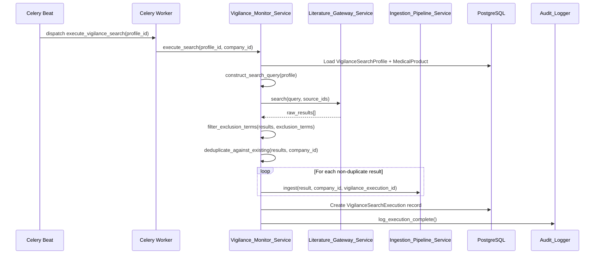
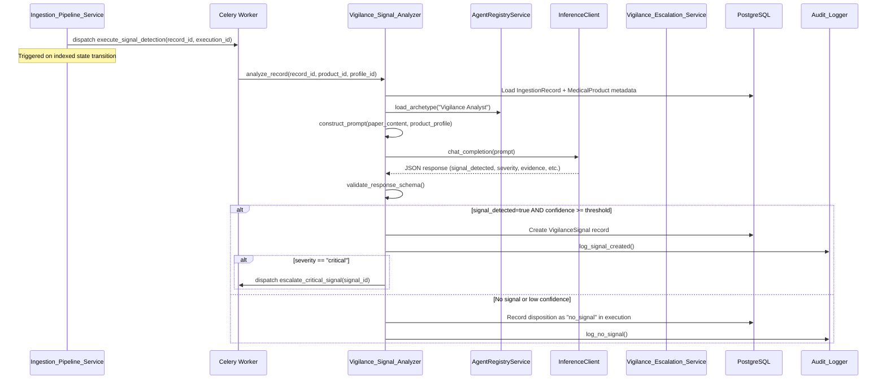
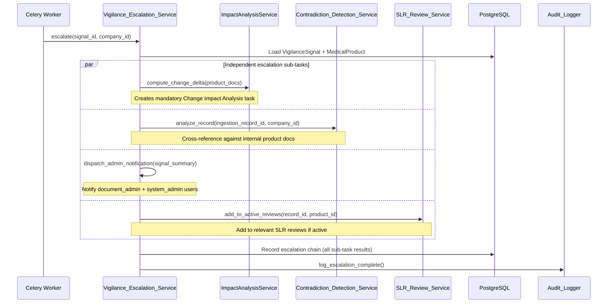

# Design Document: Regulatory Medical Device Vigilance & Post-Market Surveillance (Phase 9.5)

## Overview

This design specifies the architecture for continuous, automated medical device vigilance monitoring and post-market surveillance (PMS) within AlcoaBase. The system introduces "always-on" background workers that execute scheduled literature searches scoped to a company's medical device portfolio, AI-driven signal detection for adverse events, regulatory severity classification aligned with MDR/IVDR, automated escalation workflows for critical findings, and periodic safety report generation for regulatory submissions.

The design integrates with existing infrastructure:
- **LiteratureGatewayService** (Phase 9.1): Executes vigilance search queries against external APIs (PubMed, Crossref, arXiv)
- **IngestionPipelineService** (Phase 9.2): Auto-ingests vigilance search results through metadata → full-text → indexed pipeline
- **HybridQueryEngine** (Phase 9.3): Cross-references vigilance findings against internal product documentation
- **LiteratureScreenerAgentRunner / ContradictionDetectionService** (Phase 9.4): Reused for contradiction alerts on critical signals; pattern for agent-driven analysis
- **AgentRegistryService** (Phase 5.1): Hot-reload of the new Vigilance Analyst archetype
- **ImpactAnalysisService** (Phase 5.5): Automatic escalation for critical vigilance signals
- **BPMN Workflow Engine** (Phase 3.1): Risk-based pathing for critical escalations
- **Celery + Redis**: Async task execution on `literature_ingestion` and `ai_operations` queues; Celery beat for scheduled execution
- **Audit Logger**: ALCOA+ compliant append-only audit entries for all vigilance operations

### Key Design Decisions

| Decision | Choice | Rationale |
|----------|--------|-----------|
| Agent archetype format | YAML v2 schema in `agents/archetypes/` | Consistent with existing archetypes (literature-screener, master-auditor); hot-reloaded via watchfiles |
| Signal detection execution | Celery tasks on `ai_operations` queue | Decouples long-running LLM inference from API cycle; matches Phase 9.4 pattern |
| Vigilance search execution | Celery tasks on `literature_ingestion` queue | Consistent with Phase 9.2 ingestion tasks; separate queue from AI operations |
| Schedule management | Dynamic Celery beat registration via `register_vigilance_schedules` | No hardcoded beat_schedule entries; profiles loaded from DB on startup/restart |
| Signal severity classification | LLM-based with MDR Article 87 criteria | Regulatory-aligned; nuanced beyond keyword heuristics; consistent with ImpactAnalysisService pattern |
| Escalation architecture | Independent sub-tasks (notification, impact analysis, contradiction, SLR inclusion) | Partial failure isolation — one unavailable service doesn't block others |
| Product portfolio scope | Company-scoped with `X-Company-Id` header | Multi-tenancy isolation consistent with all AlcoaBase patterns |
| Periodic reports | Structured JSON with status lifecycle | Enables versioning, audit trail, and progressive approval workflow |
| Deduplication strategy | Match on (company_id, DOI) or (company_id, source_id, external_id) | Prevents re-ingestion of already-known literature; consistent with Phase 9.2 |
| Query construction | Boolean AND/OR: terms ORed within category, categories ANDed with adverse_event_keywords | Maximizes recall for safety-relevant literature while maintaining specificity |
| Exclusion filtering | Case-insensitive substring match in title/abstract | Simple, fast, deterministic; runs before expensive ingestion pipeline |
| Confidence threshold | Configurable (default 0.7) via env var | Different companies may have different sensitivity requirements |
| Batch signal detection | Configurable batch size (1–50, default 10) | Balances vLLM throughput vs. memory pressure; smaller than Phase 9.4 screening (safety-first) |
| Retry strategy | 3 retries, exponential backoff (service-specific intervals) | Matches existing vLLM/gateway retry patterns in Phase 9.2/9.4 |
| Idempotent execution | Skip if same profile already executing | Prevents duplicate work from Celery beat clock skew or restart overlap |

## Architecture

### High-Level System Diagram

```mermaid
graph TB
    subgraph "FastAPI Backend"
        VPR[Vigilance Product Router]
        VSR[Vigilance Signal Router]
        VRR[Vigilance Report Router]

        VMS[Vigilance_Monitor_Service]
        VSA[Vigilance_Signal_Analyzer]
        PPS[Product_Portfolio_Service]
        VSPS[Vigilance_Search_Profile_Service]
        PRS[Periodic_Report_Service]
        VES[Vigilance_Escalation_Service]

        IC[InferenceClient - vLLM]
        HQE[Hybrid_Query_Engine - Phase 9.3]
        IAS[ImpactAnalysisService - Phase 5.5]
        CDS[Contradiction_Detection_Service - Phase 9.4]
        ARS[AgentRegistryService - Phase 5.1]
        LGS[Literature_Gateway_Service - Phase 9.1]
        IPS[Ingestion_Pipeline_Service - Phase 9.2]
        AL[Audit_Logger]
    end

    subgraph "Celery Workers"
        VST[execute_vigilance_search]
        SDT[execute_signal_detection]
        EST[escalate_critical_signal]
        GRT[generate_periodic_report]
        RST[register_vigilance_schedules]
    end

    subgraph "Infrastructure"
        PG[(PostgreSQL)]
        Redis[(Redis)]
        OS[(OpenSearch)]
        vLLM[vLLM Chat Instance]
    end

    subgraph "Agent Definitions"
        YAML[vigilance-analyst.yaml]
    end

    VPR --> PPS
    VPR --> VSPS
    VSR --> VMS
    VSR --> VES
    VRR --> PRS

    VMS --> LGS
    VMS --> IPS
    VMS --> AL

    VSA --> IC
    VSA --> ARS
    VSA --> AL

    VES --> IAS
    VES --> CDS
    VES --> AL

    PRS --> PG
    PRS --> AL

    VST --> VMS
    SDT --> VSA
    EST --> VES
    GRT --> PRS
    RST --> VSPS

    LGS --> OS
    IC --> vLLM
    ARS --> YAML
    HQE --> OS

    PPS --> PG
    VSPS --> PG
    VMS --> PG
    VSA --> PG
    VES --> PG
```



### Data Flow: Scheduled Vigilance Search Pipeline



### Data Flow: Signal Detection Pipeline



### Data Flow: Critical Signal Escalation



### Package Layout

```
src/backend/src/alcoabase/
├── literature/
│   ├── vigilance/                        # NEW — Phase 9.5 sub-package
│   │   ├── __init__.py
│   │   ├── services/
│   │   │   ├── __init__.py
│   │   │   ├── vigilance_monitor_service.py      # Orchestrates scheduled searches, query construction, dedup
│   │   │   ├── vigilance_signal_analyzer.py      # LLM-based signal detection + severity classification
│   │   │   ├── product_portfolio_service.py      # Medical product CRUD + validation
│   │   │   ├── vigilance_search_profile_service.py  # Profile CRUD + Celery beat registration
│   │   │   ├── periodic_report_service.py        # Report generation + status lifecycle
│   │   │   └── vigilance_escalation_service.py   # Critical signal escalation orchestration
│   │   ├── schemas/
│   │   │   ├── __init__.py
│   │   │   ├── product.py              # MedicalProduct Pydantic schemas
│   │   │   ├── profile.py             # VigilanceSearchProfile schemas
│   │   │   ├── execution.py           # VigilanceSearchExecution schemas
│   │   │   ├── signal.py              # VigilanceSignal schemas
│   │   │   ├── report.py              # PeriodicSafetyReport schemas
│   │   │   └── configuration.py       # VigilanceConfiguration schemas
│   │   ├── models/
│   │   │   ├── __init__.py
│   │   │   ├── medical_product.py      # MedicalProduct SQLAlchemy model
│   │   │   ├── vigilance_search_profile.py  # VigilanceSearchProfile SQLAlchemy model
│   │   │   ├── vigilance_search_execution.py  # VigilanceSearchExecution SQLAlchemy model
│   │   │   ├── vigilance_signal.py     # VigilanceSignal SQLAlchemy model
│   │   │   ├── vigilance_configuration.py  # VigilanceConfiguration SQLAlchemy model
│   │   │   └── periodic_safety_report.py   # PeriodicSafetyReport SQLAlchemy model
│   │   └── exceptions.py              # Vigilance-specific exceptions
│   ├── review/                          # Existing (Phase 9.4)
│   ├── embedding/                       # Existing (Phase 9.3)
│   ├── ingestion/                       # Existing (Phase 9.2)
│   ├── adapters/                        # Existing (Phase 9.1)
│   ├── services/                        # Existing (Phase 9.1)
│   └── schemas/                         # Existing (Phase 9.1)
├── api/
│   ├── vigilance_product_router.py      # NEW — Product + Profile endpoints
│   ├── vigilance_signal_router.py       # NEW — Signal + Execution endpoints
│   ├── vigilance_report_router.py       # NEW — Report endpoints
│   └── router.py                        # Extended: include vigilance routers
├── tasks/
│   ├── vigilance_tasks.py               # NEW — All Phase 9.5 Celery tasks
│   └── ...existing tasks...
├── services/
│   ├── impact_analysis.py              # Existing (invoked by escalation)
│   └── ...existing services...
├── config.py                            # Extended with Phase 9.5 settings
└── main.py                              # Extended: register vigilance routers
```


## Components and Interfaces

### VigilanceMonitorService

```python
"""Orchestrates scheduled vigilance searches, query construction, and deduplication.

Responsible for constructing Boolean search queries from profile configurations,
dispatching searches via LiteratureGatewayService, filtering exclusion terms,
deduplicating against existing records, and triggering ingestion.

References:
    - Requirements 4, 13
"""

from __future__ import annotations

from dataclasses import dataclass
from typing import TYPE_CHECKING, Any

if TYPE_CHECKING:
    from sqlalchemy.ext.asyncio import AsyncSession, async_sessionmaker

    from alcoabase.literature.ingestion.services.ingestion_pipeline_service import (
        IngestionPipelineService,
    )
    from alcoabase.literature.services.literature_gateway_service import (
        LiteratureGatewayService,
    )


@dataclass(frozen=True)
class SearchExecutionResult:
    """Result of a single vigilance search execution.

    Attributes:
        execution_id: ID of the created VigilanceSearchExecution record.
        total_results_found: Total raw results from all sources.
        results_after_exclusion: Results remaining after exclusion filtering.
        results_ingested: Results successfully ingested.
        results_duplicate: Results matching existing records (skipped).
        execution_duration_ms: Total execution time.
        status: "completed", "partial_failure", or "failed".
    """

    execution_id: int
    total_results_found: int
    results_after_exclusion: int
    results_ingested: int
    results_duplicate: int
    execution_duration_ms: int
    status: str


class VigilanceMonitorService:
    """Orchestrates vigilance search execution lifecycle.

    Responsibilities:
        - Construct Boolean search queries from profile configuration
        - Execute queries via LiteratureGatewayService
        - Filter results against exclusion terms (case-insensitive substring)
        - Deduplicate against existing IngestionRecords (DOI or source+external_id)
        - Dispatch non-duplicate results to IngestionPipelineService
        - Create VigilanceSearchExecution audit records
        - Handle retries with exponential backoff
        - Enforce idempotent execution (skip if already running)
        - Enforce 60-minute execution timeout
    """

    MAX_RETRIES = 3
    BACKOFF_INTERVALS = (300, 900, 3600)  # 5min, 15min, 60min
    EXECUTION_TIMEOUT_S = 3600  # 60 minutes

    def __init__(
        self,
        session_factory: "async_sessionmaker",
        literature_gateway: "LiteratureGatewayService",
        ingestion_pipeline: "IngestionPipelineService",
        search_queue: str = "literature_ingestion",
        execution_timeout: int = 3600,
    ) -> None:
        """Initialize with all dependencies.

        Args:
            session_factory: Async session factory for DB operations.
            literature_gateway: Service for executing literature searches.
            ingestion_pipeline: Service for ingesting search results.
            search_queue: Celery queue name for search tasks.
            execution_timeout: Max execution time in seconds.
        """
        ...

    async def execute_search(
        self,
        profile_id: int,
        company_id: int,
    ) -> SearchExecutionResult:
        """Execute a vigilance search for the given profile.

        Steps:
            1. Check idempotency (skip if already running for this profile)
            2. Load profile + product metadata
            3. Construct Boolean query
            4. Execute via LiteratureGatewayService
            5. Filter exclusion terms
            6. Deduplicate against existing records
            7. Ingest non-duplicates via IngestionPipelineService
            8. Create VigilanceSearchExecution record
            9. Log to audit trail

        Args:
            profile_id: VigilanceSearchProfile to execute.
            company_id: Tenant scope.

        Returns:
            SearchExecutionResult with counts and status.

        Raises:
            GatewayUnavailableError: After all retries exhausted.
            ExecutionTimeoutError: If execution exceeds timeout.
            DuplicateExecutionError: If same profile already running.
        """
        ...

    def construct_search_query(
        self,
        search_terms: list[str],
        mesh_terms: list[str],
        adverse_event_keywords: list[str],
        device_identifiers: list[str],
    ) -> dict[str, Any]:
        """Construct a Boolean search query from profile fields.

        Logic:
            - Terms within each category are ORed together
            - Categories are ANDed with adverse_event_keywords
            - Final query: (search_terms OR mesh_terms OR device_identifiers) AND adverse_event_keywords

        Args:
            search_terms: Product names, brand names, synonyms.
            mesh_terms: MeSH descriptors.
            adverse_event_keywords: Adverse event descriptors.
            device_identifiers: UDIs, catalog numbers, model numbers.

        Returns:
            Structured query dict for LiteratureGatewayService.
        """
        ...

    def filter_exclusion_terms(
        self,
        results: list[dict[str, Any]],
        exclusion_terms: list[str],
    ) -> list[dict[str, Any]]:
        """Filter out results matching exclusion terms.

        Case-insensitive substring match against title and abstract.

        Args:
            results: Raw search results with title and abstract fields.
            exclusion_terms: Terms to exclude.

        Returns:
            Filtered results with exclusion matches removed.
        """
        ...

    async def deduplicate_results(
        self,
        session: "AsyncSession",
        results: list[dict[str, Any]],
        company_id: int,
    ) -> tuple[list[dict[str, Any]], int]:
        """Deduplicate results against existing IngestionRecords.

        Match on (company_id, DOI) or (company_id, source_id, external_id).

        Args:
            session: Active DB session.
            results: Results after exclusion filtering.
            company_id: Tenant scope.

        Returns:
            Tuple of (non_duplicate_results, duplicate_count).
        """
        ...

    async def _check_idempotency(
        self,
        session: "AsyncSession",
        profile_id: int,
    ) -> bool:
        """Check if an execution is already in progress for this profile.

        Returns:
            True if safe to proceed, False if already running.
        """
        ...
```

### VigilanceSignalAnalyzer

```python
"""LLM-based signal detection and severity classification.

Loads the Vigilance Analyst archetype, constructs signal detection prompts,
dispatches to vLLM, parses structured JSON responses, and creates
VigilanceSignal records when thresholds are met.

References:
    - Requirements 1, 5, 6
"""

from __future__ import annotations

from dataclasses import dataclass
from typing import TYPE_CHECKING, Any

if TYPE_CHECKING:
    from sqlalchemy.ext.asyncio import AsyncSession, async_sessionmaker

    from alcoabase.services.agent_registry import AgentRegistryService
    from alcoabase.services.inference_client import InferenceClient


@dataclass(frozen=True)
class SignalAnalysisResult:
    """Structured result from vigilance signal analysis.

    Attributes:
        signal_detected: Whether a safety signal was identified.
        severity: "critical", "major", "minor", or None.
        evidence_summary: Explanation of findings (max 3000 chars).
        affected_product_aspects: Device functions/components implicated.
        regulatory_references: Applicable regulation articles.
        recommended_actions: Suggested next steps (max 5).
        confidence: Analysis confidence (0.0–1.0).
        analysis_duration_ms: Time to produce this analysis.
    """

    signal_detected: bool
    severity: str | None
    evidence_summary: str
    affected_product_aspects: list[str]
    regulatory_references: list[str]
    recommended_actions: list[str]
    confidence: float
    analysis_duration_ms: int


class VigilanceSignalAnalyzer:
    """Runs the Vigilance Analyst Agent for signal detection.

    Responsibilities:
        - Load the Vigilance Analyst archetype from AgentRegistryService
        - Construct prompts with paper content + product safety profile
        - Dispatch to vLLM and parse JSON response
        - Validate response schema (severity enum, confidence range, required fields)
        - Handle malformed responses (fallback to uncertain/manual review)
        - Create VigilanceSignal records when threshold met
        - Support batch processing of multiple records
    """

    ARCHETYPE_NAME = "Vigilance Analyst"
    FALLBACK_TEMPERATURE = 0.05
    FALLBACK_MAX_TOKENS = 6144

    def __init__(
        self,
        session_factory: "async_sessionmaker",
        inference_client: "InferenceClient",
        agent_registry: "AgentRegistryService",
        model_name: str,
        confidence_threshold: float = 0.7,
        batch_size: int = 10,
    ) -> None:
        """Initialize with LLM client and agent registry.

        Args:
            session_factory: Async session factory for DB operations.
            inference_client: Client for vLLM chat completion.
            agent_registry: Service for loading agent archetypes.
            model_name: Chat model identifier for inference.
            confidence_threshold: Min confidence to create signal (0.1–1.0).
            batch_size: Records per batch (1–50).
        """
        ...

    async def analyze_record(
        self,
        record_id: int,
        product_id: int,
        profile_id: int,
        company_id: int,
    ) -> SignalAnalysisResult:
        """Analyze a single ingestion record for safety signals.

        Steps:
            1. Load IngestionRecord content (title, abstract, body)
            2. Load MedicalProduct metadata (class, intended purpose, risks)
            3. Load archetype system prompt and tuning params
            4. Construct user prompt with paper content + product profile
            5. Dispatch to InferenceClient.chat_completion
            6. Parse and validate JSON response
            7. If signal detected and confidence >= threshold: create VigilanceSignal
            8. Return analysis result

        Args:
            record_id: IngestionRecord to analyze.
            product_id: Associated MedicalProduct.
            profile_id: Originating VigilanceSearchProfile.
            company_id: Tenant scope.

        Returns:
            SignalAnalysisResult with detection outcome.

        Raises:
            InferenceConnectionError: If vLLM unreachable (caller handles retry).
        """
        ...

    async def analyze_batch(
        self,
        record_ids: list[int],
        product_id: int,
        profile_id: int,
        company_id: int,
    ) -> list[tuple[int, SignalAnalysisResult]]:
        """Analyze a batch of records sequentially.

        Processes each record; on per-record failure, marks as uncertain
        and continues with remaining records.

        Args:
            record_ids: IngestionRecord IDs to analyze.
            product_id: Associated MedicalProduct.
            profile_id: Originating VigilanceSearchProfile.
            company_id: Tenant scope.

        Returns:
            List of (record_id, SignalAnalysisResult) tuples.
        """
        ...

    def _construct_prompt(
        self,
        title: str,
        abstract: str,
        body_text: str | None,
        product_name: str,
        device_class: str,
        intended_purpose: str,
        predicate_devices: list[str] | None,
    ) -> str:
        """Build the signal detection prompt.

        Includes: paper content, product metadata, MDR severity criteria,
        expected JSON output schema.

        Returns:
            Formatted prompt string.
        """
        ...

    def _parse_response(self, response_text: str) -> SignalAnalysisResult | None:
        """Parse and validate the LLM JSON response.

        Expected schema:
            {
                "signal_detected": bool,
                "severity": "critical" | "major" | "minor" | null,
                "evidence_summary": str (max 3000),
                "affected_product_aspects": [str],
                "regulatory_references": [str],
                "recommended_actions": [str] (max 5),
                "confidence": float (0.0–1.0)
            }

        Returns None if parsing fails or required fields are missing/invalid.
        """
        ...

    def _get_agent_config(self) -> tuple[str, float, int, float]:
        """Load Vigilance Analyst archetype configuration.

        Falls back to built-in defaults if archetype not found.

        Returns:
            Tuple of (system_prompt, temperature, max_tokens, top_p).
        """
        ...
```

### ProductPortfolioService

```python
"""CRUD operations and validation for Medical Products.

Manages product registration, status transitions, UDI uniqueness,
and association with vigilance search profiles.

References:
    - Requirements 2, 9
"""

from __future__ import annotations

from typing import TYPE_CHECKING, Any

if TYPE_CHECKING:
    from sqlalchemy.ext.asyncio import AsyncSession


class ProductPortfolioService:
    """Manages Medical Product lifecycle.

    Responsibilities:
        - Create products with validated fields (name, device_class, intended_purpose required)
        - Enforce UDI uniqueness within company
        - Manage status transitions (active → discontinued/recalled)
        - Suspend associated profiles when product discontinued/recalled
        - List products with pagination and filtering
        - Expose signal counts per product
    """

    VALID_DEVICE_CLASSES = ("I", "IIa", "IIb", "III", "IVDR_A", "IVDR_B", "IVDR_C", "IVDR_D")
    VALID_STATUSES = ("active", "discontinued", "recalled")

    async def create_product(
        self,
        session: AsyncSession,
        *,
        company_id: int,
        user_id: int,
        name: str,
        device_class: str,
        intended_purpose: str,
        udi: str | None = None,
        gmdn_code: str | None = None,
        manufacturer_name: str | None = None,
        predicate_devices: list[str] | None = None,
        risk_class_justification: str | None = None,
    ) -> dict[str, Any]:
        """Create a new Medical Product.

        Validates required fields, UDI uniqueness, field lengths.
        Records audit trail entry.

        Args:
            session: Active async DB session.
            company_id: Tenant scope.
            user_id: Creating user (must have document_admin or system_admin role).
            name: Product name (1–300 chars).
            device_class: One of VALID_DEVICE_CLASSES.
            intended_purpose: Text (max 5000 chars).
            udi: Optional unique device identifier (1–128 chars, unique per company).
            gmdn_code: Optional GMDN code (1–20 chars).
            manufacturer_name: Optional (1–300 chars).
            predicate_devices: Optional array (max 10, each 1–300 chars).
            risk_class_justification: Optional (max 3000 chars).

        Returns:
            Dict with created product fields + id.

        Raises:
            ValidationError: If required fields missing or invalid (HTTP 422).
            DuplicateUDIError: If UDI exists within company (HTTP 409).
        """
        ...

    async def update_product(
        self,
        session: AsyncSession,
        *,
        product_id: int,
        company_id: int,
        user_id: int,
        **fields: Any,
    ) -> dict[str, Any]:
        """Update a Medical Product.

        On status change to discontinued/recalled: suspends associated profiles.

        Args:
            product_id: Target product.
            company_id: Tenant scope.
            user_id: Updating user.
            **fields: Fields to update.

        Returns:
            Updated product dict.

        Raises:
            NotFoundError: If product not found in this company.
            DuplicateUDIError: If new UDI conflicts.
        """
        ...

    async def soft_delete_product(
        self,
        session: AsyncSession,
        *,
        product_id: int,
        company_id: int,
        user_id: int,
    ) -> dict[str, Any]:
        """Soft-delete product by transitioning to 'discontinued'.

        Suspends all associated vigilance search profiles.

        Returns:
            Updated product dict with status='discontinued'.
        """
        ...

    async def list_products(
        self,
        session: AsyncSession,
        *,
        company_id: int,
        page: int = 1,
        page_size: int = 20,
        status: str | None = None,
        device_class: str | None = None,
    ) -> tuple[list[dict[str, Any]], int]:
        """List products with pagination and filters.

        Returns:
            Tuple of (products_list, total_count).
        """
        ...

    async def get_product(
        self,
        session: AsyncSession,
        *,
        product_id: int,
        company_id: int,
    ) -> dict[str, Any]:
        """Get full product details with associated profiles and signal counts.

        Raises:
            NotFoundError: If not found in this company (HTTP 404).
        """
        ...
```

### VigilanceSearchProfileService

```python
"""CRUD and scheduling for Vigilance Search Profiles.

Manages profile lifecycle, cron validation, Celery beat registration,
and dynamic schedule management.

References:
    - Requirements 3, 4
"""

from __future__ import annotations

from typing import TYPE_CHECKING, Any

if TYPE_CHECKING:
    from sqlalchemy.ext.asyncio import AsyncSession, async_sessionmaker


class VigilanceSearchProfileService:
    """Manages Vigilance Search Profile lifecycle and scheduling.

    Responsibilities:
        - Create profiles with validated cron expressions and required arrays
        - Register/deregister profiles with Celery beat scheduler
        - Manage status transitions (active → paused → archived)
        - Auto-pause profiles for discontinued/recalled products
        - Support manual (on-demand) execution regardless of status
        - Load all active profiles on startup for dynamic beat registration
    """

    VALID_STATUSES = ("active", "paused", "archived")

    async def create_profile(
        self,
        session: AsyncSession,
        *,
        company_id: int,
        user_id: int,
        product_id: int,
        name: str,
        search_terms: list[str],
        adverse_event_keywords: list[str],
        mesh_terms: list[str] | None = None,
        device_identifiers: list[str] | None = None,
        exclusion_terms: list[str] | None = None,
        source_ids: list[str] | None = None,
        schedule_cron: str = "0 6 * * 1",
    ) -> dict[str, Any]:
        """Create a new Vigilance Search Profile.

        Validates cron expression, required arrays, product existence.
        If product is discontinued/recalled, sets status to 'paused'.

        Args:
            session: Active async DB session.
            company_id: Tenant scope.
            user_id: Creating user.
            product_id: FK to MedicalProduct.
            name: Profile name (1–200 chars).
            search_terms: Product names/synonyms (1–50, each 1–500 chars).
            adverse_event_keywords: AE descriptors (1–50, each 1–500 chars).
            mesh_terms: Optional MeSH terms (0–30, each 1–200 chars).
            device_identifiers: Optional UDIs/catalog numbers (0–20, each 1–200 chars).
            exclusion_terms: Optional exclusion terms (0–30, each 1–500 chars).
            source_ids: Optional source adapter IDs (empty = all).
            schedule_cron: 5-field cron expression.

        Returns:
            Dict with created profile fields + id.

        Raises:
            ValidationError: If cron invalid, required arrays empty (HTTP 422).
            NotFoundError: If product_id not found in company (HTTP 404).
        """
        ...

    async def activate_profile(
        self,
        session: AsyncSession,
        *,
        profile_id: int,
        company_id: int,
        user_id: int,
    ) -> dict[str, Any]:
        """Activate a profile and register with Celery beat.

        Returns:
            Updated profile dict.

        Raises:
            InvalidStateError: If product is discontinued/recalled.
        """
        ...

    async def pause_profile(
        self,
        session: AsyncSession,
        *,
        profile_id: int,
        company_id: int,
        user_id: int,
    ) -> dict[str, Any]:
        """Pause a profile and remove from Celery beat.

        Preserves all historical execution records.

        Returns:
            Updated profile dict.
        """
        ...

    async def trigger_manual_execution(
        self,
        session: AsyncSession,
        *,
        profile_id: int,
        company_id: int,
        user_id: int,
    ) -> str:
        """Trigger immediate execution regardless of profile status.

        Dispatches Celery task and returns task_id.

        Returns:
            task_id (UUID string) for progress tracking.
        """
        ...

    async def register_all_active_schedules(self) -> int:
        """Load all active profiles and register with Celery beat.

        Called on application/worker startup and scheduler restart.

        Returns:
            Number of profiles registered.
        """
        ...

    def validate_cron_expression(self, expression: str) -> bool:
        """Validate a 5-field cron expression.

        Checks syntax for minute, hour, day-of-month, month, day-of-week.

        Returns:
            True if valid, raises ValidationError if invalid.
        """
        ...
```

### PeriodicReportService

```python
"""Generates and manages Periodic Safety Reports.

Auto-generates PMSR/PSUR-format reports documenting all vigilance
activity within configurable time windows.

References:
    - Requirements 8, 11
"""

from __future__ import annotations

from datetime import date
from typing import TYPE_CHECKING, Any

if TYPE_CHECKING:
    from sqlalchemy.ext.asyncio import AsyncSession, async_sessionmaker


class PeriodicReportService:
    """Manages Periodic Safety Report generation and lifecycle.

    Responsibilities:
        - Auto-generate reports on configured schedule
        - Include all search executions, signals, and dispositions in period
        - Build regulatory compliance section with MDR/IVDR references
        - Build disposition matrix (every result classified exactly once)
        - Compute statistical summary
        - Manage report status lifecycle (generated → reviewed → approved → submitted)
        - Handle empty periods (no searches executed)
    """

    VALID_PERIODS = ("monthly", "quarterly", "annually")
    VALID_STATUS_TRANSITIONS = {
        "generated": ["reviewed"],
        "reviewed": ["approved"],
        "approved": ["submitted"],
    }

    async def generate_report(
        self,
        session: AsyncSession,
        *,
        product_id: int,
        company_id: int,
        period_start: date,
        period_end: date,
    ) -> dict[str, Any]:
        """Generate a Periodic Safety Report for the given period.

        Sections:
            1. Product metadata (name, UDI, device class, intended purpose)
            2. Reporting period dates
            3. Search executions within period (params, sources, counts)
            4. Signals detected (severity, disposition, resolution notes)
            5. Search strategy documentation (active profiles, query construction)
            6. Disposition matrix (every result classified)
            7. Statistical summary (totals, trends)
            8. Regulatory compliance section (MDR/IVDR references)

        Args:
            session: Active DB session.
            product_id: Target MedicalProduct.
            company_id: Tenant scope.
            period_start: Report period start (inclusive).
            period_end: Report period end (inclusive).

        Returns:
            Created report dict with full content.
        """
        ...

    async def advance_status(
        self,
        session: AsyncSession,
        *,
        report_id: int,
        company_id: int,
        user_id: int,
        new_status: str,
        comment: str | None = None,
    ) -> dict[str, Any]:
        """Advance report through status lifecycle.

        Valid transitions: generated → reviewed → approved → submitted.

        Args:
            report_id: Target report.
            company_id: Tenant scope.
            user_id: Acting user (must have document_admin or system_admin).
            new_status: Target status.
            comment: Optional comment (max 2000 chars).

        Returns:
            Updated report dict.

        Raises:
            InvalidStateTransitionError: If transition not valid.
            NotFoundError: If report not found.
        """
        ...

    async def list_reports(
        self,
        session: AsyncSession,
        *,
        company_id: int,
        product_id: int | None = None,
        status: str | None = None,
        period: str | None = None,
        page: int = 1,
        page_size: int = 20,
    ) -> tuple[list[dict[str, Any]], int]:
        """List reports with pagination and filters.

        Returns:
            Tuple of (reports_list, total_count).
        """
        ...

    async def get_report(
        self,
        session: AsyncSession,
        *,
        report_id: int,
        company_id: int,
    ) -> dict[str, Any]:
        """Get full report content.

        Raises:
            NotFoundError: If not found in this company.
        """
        ...

    def _build_disposition_matrix(
        self,
        executions: list[dict[str, Any]],
        signals: list[dict[str, Any]],
    ) -> dict[str, int]:
        """Build the disposition matrix.

        Categories: no_signal, signal_dismissed, signal_confirmed, signal_escalated.
        Invariant: sum of all categories == total results_ingested across executions.

        Returns:
            Dict mapping disposition category to count.
        """
        ...

    def _build_statistical_summary(
        self,
        executions: list[dict[str, Any]],
        signals: list[dict[str, Any]],
    ) -> dict[str, Any]:
        """Build statistical summary section.

        Includes: total_searches, total_results, signals_by_severity,
        disposition_breakdown, average_time_to_disposition.

        Returns:
            Statistical summary dict.
        """
        ...
```

### VigilanceEscalationService

```python
"""Orchestrates critical signal escalation with independent sub-tasks.

Dispatches impact analysis, contradiction detection, notifications, and
SLR inclusion as independent parallel operations with individual retry logic.

References:
    - Requirements 7
"""

from __future__ import annotations

from typing import TYPE_CHECKING, Any

if TYPE_CHECKING:
    from sqlalchemy.ext.asyncio import AsyncSession, async_sessionmaker

    from alcoabase.literature.review.services.contradiction_detection_service import (
        ContradictionDetectionService,
    )
    from alcoabase.literature.review.services.slr_review_service import (
        SLRReviewService,
    )
    from alcoabase.services.impact_analysis import ImpactAnalysisService


class VigilanceEscalationService:
    """Orchestrates the full escalation chain for critical signals.

    Responsibilities:
        - Invoke ImpactAnalysisService for affected product documents
        - Invoke ContradictionDetectionService for cross-referencing
        - Dispatch immediate notifications to admin users
        - Add records to active SLR reviews for the same product
        - Execute sub-tasks independently (partial failure isolation)
        - Record full escalation chain in audit trail
        - Support per-company escalation configuration
    """

    MAX_RETRIES = 3
    RETRY_INTERVAL_S = 300  # 5 minutes between retries

    def __init__(
        self,
        session_factory: "async_sessionmaker",
        impact_analysis_service: "ImpactAnalysisService",
        contradiction_detection_service: "ContradictionDetectionService",
        slr_review_service: "SLRReviewService",
        escalation_retries: int = 3,
    ) -> None:
        """Initialize with all escalation target services.

        Args:
            session_factory: Async session factory for DB operations.
            impact_analysis_service: For change impact analysis tasks.
            contradiction_detection_service: For cross-referencing.
            slr_review_service: For SLR inclusion.
            escalation_retries: Max retries per sub-task.
        """
        ...

    async def escalate_signal(
        self,
        signal_id: int,
        company_id: int,
    ) -> dict[str, Any]:
        """Execute full escalation chain for a critical signal.

        Sub-tasks run independently:
            1. Impact Analysis → creates Change Impact Analysis task
            2. Contradiction Detection → cross-references against internal docs
            3. Admin Notification → immediate in-app notification
            4. SLR Inclusion → adds to active reviews (if any)

        Each sub-task has independent retry logic; failure in one does NOT
        block the others.

        Args:
            signal_id: VigilanceSignal to escalate.
            company_id: Tenant scope.

        Returns:
            Dict with sub-task results:
                impact_analysis_task_id, contradiction_alert_ids,
                notification_recipient_ids, slr_reviews_updated,
                failed_subtasks (list of failed sub-task names).
        """
        ...

    async def _invoke_impact_analysis(
        self,
        session: AsyncSession,
        signal_id: int,
        product_id: int,
        company_id: int,
    ) -> int | None:
        """Create mandatory Change Impact Analysis task.

        Returns task_id on success, None on failure (queued for retry).
        """
        ...

    async def _invoke_contradiction_detection(
        self,
        record_id: int,
        company_id: int,
    ) -> list[int]:
        """Cross-reference literature against internal product docs.

        Returns list of created ContradictionAlert IDs.
        """
        ...

    async def _dispatch_notifications(
        self,
        session: AsyncSession,
        signal_id: int,
        company_id: int,
        product_name: str,
        severity: str,
        evidence_summary: str,
        regulatory_references: list[str],
    ) -> list[int]:
        """Send immediate notifications to document_admin + system_admin users.

        Returns list of notified user IDs.
        """
        ...

    async def _add_to_slr_reviews(
        self,
        session: AsyncSession,
        record_id: int,
        product_id: int,
        company_id: int,
    ) -> list[int]:
        """Add record to active SLR reviews for the same product.

        Returns list of updated SLR review IDs.
        """
        ...
```

### Celery Tasks

```python
"""Celery tasks for vigilance monitoring, signal detection, and reporting.

References:
    - Requirements 4, 5, 7, 8, 13
"""

from typing import Any

from alcoabase.tasks.celery_app import celery_app


@celery_app.task(
    bind=True,
    name="alcoabase.tasks.vigilance_tasks.execute_vigilance_search",
    queue="literature_ingestion",
    max_retries=3,
    acks_late=True,
    priority=5,
    soft_time_limit=3600,  # 60 minutes
)
def execute_vigilance_search(
    self,
    *,
    profile_id: int,
    company_id: int,
) -> dict[str, Any]:
    """Execute a scheduled or manual vigilance search.

    Exponential backoff: 5min, 15min, 60min on gateway failure.
    Idempotent: skips if same profile already executing.

    Args:
        profile_id: VigilanceSearchProfile to execute.
        company_id: Tenant scope.

    Returns:
        Dict with total_results_found, results_ingested,
        results_duplicate, status.
    """
    ...


@celery_app.task(
    bind=True,
    name="alcoabase.tasks.vigilance_tasks.execute_signal_detection",
    queue="ai_operations",
    max_retries=3,
    acks_late=True,
    priority=4,
    soft_time_limit=1800,  # 30 minutes
)
def execute_signal_detection(
    self,
    *,
    record_ids: list[int],
    product_id: int,
    profile_id: int,
    execution_id: int,
    company_id: int,
) -> dict[str, Any]:
    """Analyze a batch of records for safety signals.

    Exponential backoff: 30s, 2min, 10min on vLLM failure.
    Processes batch sequentially; individual record failures don't
    block remaining records.

    Args:
        record_ids: IngestionRecord IDs to analyze.
        product_id: Associated MedicalProduct.
        profile_id: Originating VigilanceSearchProfile.
        execution_id: Parent VigilanceSearchExecution.
        company_id: Tenant scope.

    Returns:
        Dict with signals_created, no_signal_count, failed_count,
        critical_count (triggers escalation).
    """
    ...


@celery_app.task(
    bind=True,
    name="alcoabase.tasks.vigilance_tasks.escalate_critical_signal",
    queue="ai_operations",
    max_retries=3,
    acks_late=True,
    priority=9,  # High priority for safety
    soft_time_limit=600,  # 10 minutes
)
def escalate_critical_signal(
    self,
    *,
    signal_id: int,
    company_id: int,
) -> dict[str, Any]:
    """Execute full escalation chain for a critical signal.

    Independent sub-tasks: impact analysis, contradiction detection,
    notification, SLR inclusion. Failures in one don't block others.
    Retries: 3 attempts with 5-minute intervals per sub-task.

    Args:
        signal_id: VigilanceSignal to escalate.
        company_id: Tenant scope.

    Returns:
        Dict with escalation_results (sub-task outcomes).
    """
    ...


@celery_app.task(
    bind=True,
    name="alcoabase.tasks.vigilance_tasks.generate_periodic_report",
    queue="literature_ingestion",
    max_retries=2,
    acks_late=True,
    priority=3,
    soft_time_limit=1800,  # 30 minutes
)
def generate_periodic_report(
    self,
    *,
    product_id: int,
    company_id: int,
    period_start: str,  # ISO-8601 date
    period_end: str,    # ISO-8601 date
) -> dict[str, Any]:
    """Generate a Periodic Safety Report for a product.

    Collects all search executions, signals, and dispositions within
    the period. Builds regulatory compliance section and disposition matrix.

    Args:
        product_id: Target MedicalProduct.
        company_id: Tenant scope.
        period_start: Period start date (ISO-8601).
        period_end: Period end date (ISO-8601).

    Returns:
        Dict with report_id, sections_generated, status.
    """
    ...


@celery_app.task(
    name="alcoabase.tasks.vigilance_tasks.register_vigilance_schedules",
    queue="literature_ingestion",
    acks_late=True,
)
def register_vigilance_schedules() -> dict[str, Any]:
    """Load all active profiles and register with Celery beat.

    Called on worker startup and beat scheduler restart.
    Detects in-progress executions and re-queues them.

    Returns:
        Dict with profiles_registered, executions_recovered.
    """
    ...
```

## Data Models

### MedicalProduct (SQLAlchemy)

```python
"""Medical Product model for product portfolio management.

References:
    - Requirement 2
"""

from datetime import datetime

from sqlalchemy import DateTime, ForeignKey, Integer, String, Text, func
from sqlalchemy.dialects.postgresql import ARRAY
from sqlalchemy.orm import Mapped, mapped_column

from alcoabase.database import Base
from alcoabase.models.audit import AuditMixin


class MedicalProduct(Base, AuditMixin):
    """Registered medical device in a company's portfolio.

    Attributes:
        id: Primary key.
        company_id: FK to companies table (tenant isolation).
        name: Product name (1–300 chars).
        udi: Unique Device Identifier (1–128 chars, unique per company, optional).
        device_class: Regulatory classification enum.
        gmdn_code: GMDN nomenclature code (1–20 chars, optional).
        intended_purpose: Product intended purpose (max 5000 chars).
        manufacturer_name: Optional manufacturer (1–300 chars).
        predicate_devices: Array of predicate device names (max 10).
        risk_class_justification: Optional justification text (max 3000 chars).
        status: "active", "discontinued", or "recalled".
        created_by: FK to users table.
        created_at: Creation timestamp.
        updated_at: Last update timestamp.
    """

    __tablename__ = "vigilance_medical_products"
    __versioned__ = {}

    id: Mapped[int] = mapped_column(primary_key=True)
    company_id: Mapped[int] = mapped_column(
        ForeignKey("companies.id"), index=True
    )
    name: Mapped[str] = mapped_column(String(300))
    udi: Mapped[str | None] = mapped_column(String(128), nullable=True)
    device_class: Mapped[str] = mapped_column(String(10))
    gmdn_code: Mapped[str | None] = mapped_column(String(20), nullable=True)
    intended_purpose: Mapped[str] = mapped_column(Text)
    manufacturer_name: Mapped[str | None] = mapped_column(
        String(300), nullable=True
    )
    predicate_devices: Mapped[list | None] = mapped_column(
        ARRAY(String(300)), nullable=True
    )
    risk_class_justification: Mapped[str | None] = mapped_column(
        Text, nullable=True
    )
    status: Mapped[str] = mapped_column(String(20), default="active")
    created_by: Mapped[int] = mapped_column(ForeignKey("users.id"))
    created_at: Mapped[datetime] = mapped_column(
        DateTime(timezone=True), server_default=func.now()
    )
    updated_at: Mapped[datetime] = mapped_column(
        DateTime(timezone=True), server_default=func.now(), onupdate=func.now()
    )
```

### VigilanceSearchProfile (SQLAlchemy)

```python
"""Vigilance Search Profile model for scheduled monitoring configuration.

References:
    - Requirement 3
"""

from datetime import datetime

from sqlalchemy import DateTime, ForeignKey, Integer, String, Text, func
from sqlalchemy.dialects.postgresql import ARRAY
from sqlalchemy.orm import Mapped, mapped_column

from alcoabase.database import Base
from alcoabase.models.audit import AuditMixin


class VigilanceSearchProfile(Base, AuditMixin):
    """Per-product search configuration for automated vigilance monitoring.

    Attributes:
        id: Primary key.
        company_id: FK to companies table.
        product_id: FK to MedicalProduct.
        name: Profile name (1–200 chars).
        search_terms: Product names, brand names, synonyms (1–50 entries).
        mesh_terms: MeSH descriptors (0–30 entries).
        adverse_event_keywords: AE descriptors (1–50 entries).
        device_identifiers: UDIs, catalog numbers (0–20 entries).
        exclusion_terms: Terms to exclude from results (0–30 entries).
        source_ids: Source adapter IDs to search (empty = all).
        schedule_cron: 5-field cron expression.
        status: "active", "paused", or "archived".
        created_by: FK to users table.
        created_at: Creation timestamp.
        updated_at: Last update timestamp.
    """

    __tablename__ = "vigilance_search_profiles"
    __versioned__ = {}

    id: Mapped[int] = mapped_column(primary_key=True)
    company_id: Mapped[int] = mapped_column(
        ForeignKey("companies.id"), index=True
    )
    product_id: Mapped[int] = mapped_column(
        ForeignKey("vigilance_medical_products.id"), index=True
    )
    name: Mapped[str] = mapped_column(String(200))
    search_terms: Mapped[list] = mapped_column(ARRAY(String(500)))
    mesh_terms: Mapped[list | None] = mapped_column(
        ARRAY(String(200)), nullable=True, default=list
    )
    adverse_event_keywords: Mapped[list] = mapped_column(ARRAY(String(500)))
    device_identifiers: Mapped[list | None] = mapped_column(
        ARRAY(String(200)), nullable=True, default=list
    )
    exclusion_terms: Mapped[list | None] = mapped_column(
        ARRAY(String(500)), nullable=True, default=list
    )
    source_ids: Mapped[list | None] = mapped_column(
        ARRAY(String(100)), nullable=True, default=list
    )
    schedule_cron: Mapped[str] = mapped_column(String(100))
    status: Mapped[str] = mapped_column(String(20), default="active")
    created_by: Mapped[int] = mapped_column(ForeignKey("users.id"))
    created_at: Mapped[datetime] = mapped_column(
        DateTime(timezone=True), server_default=func.now()
    )
    updated_at: Mapped[datetime] = mapped_column(
        DateTime(timezone=True), server_default=func.now(), onupdate=func.now()
    )
```

### VigilanceSearchExecution (SQLAlchemy)

```python
"""Vigilance Search Execution audit record.

References:
    - Requirements 4, 15
"""

from datetime import datetime

from sqlalchemy import DateTime, Float, ForeignKey, Integer, String, func
from sqlalchemy.dialects.postgresql import ARRAY, JSONB
from sqlalchemy.orm import Mapped, mapped_column

from alcoabase.database import Base


class VigilanceSearchExecution(Base):
    """Records a single execution of a vigilance search profile.

    Append-only: executions are never updated after completion
    (except status transitions from running → completed/failed).

    Attributes:
        id: Primary key.
        profile_id: FK to VigilanceSearchProfile.
        company_id: Tenant isolation.
        execution_timestamp: When execution started (UTC).
        search_parameters: Full query as JSON.
        sources_queried: Array of source adapter names.
        total_results_found: Raw result count.
        results_after_exclusion: After exclusion filtering.
        results_ingested: Successfully ingested count.
        results_duplicate: Skipped duplicate count.
        execution_duration_ms: Total time in milliseconds.
        status: "running", "completed", "partial_failure", or "failed".
    """

    __tablename__ = "vigilance_search_executions"

    id: Mapped[int] = mapped_column(primary_key=True)
    profile_id: Mapped[int] = mapped_column(
        ForeignKey("vigilance_search_profiles.id"), index=True
    )
    company_id: Mapped[int] = mapped_column(
        ForeignKey("companies.id"), index=True
    )
    execution_timestamp: Mapped[datetime] = mapped_column(
        DateTime(timezone=True), server_default=func.now()
    )
    search_parameters: Mapped[dict] = mapped_column(JSONB)
    sources_queried: Mapped[list] = mapped_column(ARRAY(String(100)))
    total_results_found: Mapped[int] = mapped_column(Integer, default=0)
    results_after_exclusion: Mapped[int] = mapped_column(Integer, default=0)
    results_ingested: Mapped[int] = mapped_column(Integer, default=0)
    results_duplicate: Mapped[int] = mapped_column(Integer, default=0)
    execution_duration_ms: Mapped[int] = mapped_column(Integer, default=0)
    status: Mapped[str] = mapped_column(String(20), default="running")
```

### VigilanceSignal (SQLAlchemy)

```python
"""Vigilance Signal model for detected safety signals.

References:
    - Requirements 5, 6, 15
"""

from datetime import datetime

from sqlalchemy import DateTime, Float, ForeignKey, Integer, String, Text, func
from sqlalchemy.dialects.postgresql import ARRAY, JSONB
from sqlalchemy.orm import Mapped, mapped_column

from alcoabase.database import Base
from alcoabase.models.audit import AuditMixin


class VigilanceSignal(Base, AuditMixin):
    """A detected safety signal from vigilance literature analysis.

    Attributes:
        id: Primary key.
        ingestion_record_id: FK to the source literature record.
        product_id: FK to MedicalProduct.
        profile_id: FK to originating VigilanceSearchProfile.
        company_id: Tenant isolation.
        severity: "critical", "major", or "minor".
        evidence_summary: Agent explanation (max 3000 chars).
        affected_product_aspects: Device functions/components implicated.
        regulatory_references: Applicable regulation articles.
        recommended_actions: Suggested next steps (max 5).
        confidence: Analysis confidence (0.0–1.0).
        disposition: "under_review", "confirmed", "dismissed", "escalated".
        dismissal_reason: Required when disposition = dismissed (max 2000 chars).
        confirmation_note: Required when disposition = confirmed (max 3000 chars).
        reviewer_user_id: User who changed disposition.
        detection_timestamp: When signal was detected (UTC).
        created_at: Record creation timestamp.
        updated_at: Last update timestamp.
    """

    __tablename__ = "vigilance_signals"
    __versioned__ = {}

    id: Mapped[int] = mapped_column(primary_key=True)
    ingestion_record_id: Mapped[int] = mapped_column(
        ForeignKey("literature_ingestion_records.id"), index=True
    )
    product_id: Mapped[int] = mapped_column(
        ForeignKey("vigilance_medical_products.id"), index=True
    )
    profile_id: Mapped[int] = mapped_column(
        ForeignKey("vigilance_search_profiles.id"), index=True
    )
    company_id: Mapped[int] = mapped_column(
        ForeignKey("companies.id"), index=True
    )
    severity: Mapped[str] = mapped_column(String(20))
    evidence_summary: Mapped[str] = mapped_column(Text)
    affected_product_aspects: Mapped[list] = mapped_column(
        ARRAY(String(500)), default=list
    )
    regulatory_references: Mapped[list] = mapped_column(
        ARRAY(String(200)), default=list
    )
    recommended_actions: Mapped[list] = mapped_column(
        ARRAY(String(500)), default=list
    )
    confidence: Mapped[float] = mapped_column(Float)
    disposition: Mapped[str] = mapped_column(
        String(20), default="under_review"
    )
    dismissal_reason: Mapped[str | None] = mapped_column(Text, nullable=True)
    confirmation_note: Mapped[str | None] = mapped_column(Text, nullable=True)
    reviewer_user_id: Mapped[int | None] = mapped_column(
        Integer, nullable=True
    )
    detection_timestamp: Mapped[datetime] = mapped_column(
        DateTime(timezone=True), server_default=func.now()
    )
    created_at: Mapped[datetime] = mapped_column(
        DateTime(timezone=True), server_default=func.now()
    )
    updated_at: Mapped[datetime] = mapped_column(
        DateTime(timezone=True), server_default=func.now(), onupdate=func.now()
    )
```

### VigilanceConfiguration (SQLAlchemy)

```python
"""Per-company vigilance configuration model.

References:
    - Requirements 7, 8, 14
"""

from sqlalchemy import Boolean, ForeignKey, Integer, String
from sqlalchemy.dialects.postgresql import ARRAY
from sqlalchemy.orm import Mapped, mapped_column

from alcoabase.database import Base
from alcoabase.models.audit import AuditMixin


class VigilanceConfiguration(Base, AuditMixin):
    """Company-level vigilance monitoring configuration.

    Attributes:
        id: Primary key.
        company_id: FK to companies table (unique per company).
        critical_signal_auto_escalate: Auto-escalate critical signals (default True).
        major_signal_daily_digest: Daily digest for major signals (default True).
        escalation_notification_channels: Notification channels (default ["in_app"]).
        report_period: Default report period (monthly, quarterly, annually).
        report_generation_day: Day of period for auto-generation (1–28).
        auto_report_enabled: Whether auto-generation is active.
    """

    __tablename__ = "vigilance_configurations"
    __versioned__ = {}

    id: Mapped[int] = mapped_column(primary_key=True)
    company_id: Mapped[int] = mapped_column(
        ForeignKey("companies.id"), unique=True, index=True
    )
    critical_signal_auto_escalate: Mapped[bool] = mapped_column(
        Boolean, default=True
    )
    major_signal_daily_digest: Mapped[bool] = mapped_column(
        Boolean, default=True
    )
    escalation_notification_channels: Mapped[list] = mapped_column(
        ARRAY(String(50)), default=list
    )
    report_period: Mapped[str] = mapped_column(String(20), default="quarterly")
    report_generation_day: Mapped[int] = mapped_column(Integer, default=1)
    auto_report_enabled: Mapped[bool] = mapped_column(Boolean, default=True)
```

### PeriodicSafetyReport (SQLAlchemy)

```python
"""Periodic Safety Report model for regulatory documentation.

References:
    - Requirements 8, 15
"""

from datetime import date, datetime

from sqlalchemy import Date, DateTime, ForeignKey, Integer, String, Text, func
from sqlalchemy.dialects.postgresql import JSONB
from sqlalchemy.orm import Mapped, mapped_column

from alcoabase.database import Base
from alcoabase.models.audit import AuditMixin


class PeriodicSafetyReport(Base, AuditMixin):
    """Auto-generated periodic safety report for regulatory submissions.

    Attributes:
        id: Primary key.
        product_id: FK to MedicalProduct.
        company_id: Tenant isolation.
        period_start: Reporting period start date.
        period_end: Reporting period end date.
        generated_at: When the report was auto-generated.
        report_content: Full JSON body with all sections.
        status: "generated", "reviewed", "approved", "submitted".
        version: Auto-incremented on edits.
        status_history: JSONB array of status transitions with user/timestamp.
    """

    __tablename__ = "vigilance_periodic_safety_reports"
    __versioned__ = {}

    id: Mapped[int] = mapped_column(primary_key=True)
    product_id: Mapped[int] = mapped_column(
        ForeignKey("vigilance_medical_products.id"), index=True
    )
    company_id: Mapped[int] = mapped_column(
        ForeignKey("companies.id"), index=True
    )
    period_start: Mapped[date] = mapped_column(Date)
    period_end: Mapped[date] = mapped_column(Date)
    generated_at: Mapped[datetime] = mapped_column(
        DateTime(timezone=True), server_default=func.now()
    )
    report_content: Mapped[dict] = mapped_column(JSONB)
    status: Mapped[str] = mapped_column(String(20), default="generated")
    version: Mapped[int] = mapped_column(Integer, default=1)
    status_history: Mapped[list] = mapped_column(JSONB, default=list)
```


## Correctness Properties

*A property is a characteristic or behavior that should hold true across all valid executions of a system — essentially, a formal statement about what the system should do. Properties serve as the bridge between human-readable specifications and machine-verifiable correctness guarantees.*

### Property 1: Medical Product serialization round-trip

*For any* valid Medical Product with device_class drawn from the valid enum set, name (1–300 characters), intended_purpose (1–5000 characters), optional udi (1–128 characters), optional predicate_devices (0–10 entries each 1–300 characters), and optional gmdn_code (1–20 characters), serializing the product to JSON for API response and deserializing it back SHALL produce an object with identical field values including array order preservation.

**Validates: Requirements 2.1, 15.2**

### Property 2: Vigilance Search Profile serialization round-trip

*For any* valid Vigilance Search Profile with search_terms (1–50 entries, each 1–500 characters), adverse_event_keywords (1–50 entries, each 1–500 characters), mesh_terms (0–30 entries), device_identifiers (0–20 entries), exclusion_terms (0–30 entries), and a valid 5-field cron expression, serializing the profile to JSON and deserializing it back SHALL produce an equivalent object with identical field values and array ordering preserved.

**Validates: Requirements 3.1, 15.3**

### Property 3: Vigilance Signal persistence round-trip

*For any* Vigilance Signal with valid severity (critical, major, minor), confidence (float 0.0–1.0), evidence_summary (0–3000 characters), affected_product_aspects (0–10 entries), regulatory_references (0–10 entries), and recommended_actions (0–5 entries), persisting the signal to the database and retrieving it by ID SHALL yield a record with identical severity, confidence (within floating-point precision tolerance of 1e-6), evidence_summary, and all array fields preserving content and order.

**Validates: Requirements 5.3, 15.1**

### Property 4: Signal creation threshold logic

*For any* signal analysis result with `signal_detected` (boolean) and `confidence` (float 0.0–1.0), a Vigilance Signal record SHALL be created if and only if `signal_detected` is True AND `confidence >= confidence_threshold` (default 0.7). Results where `signal_detected` is False OR `confidence < confidence_threshold` SHALL NOT produce a Vigilance Signal record.

**Validates: Requirements 5.3, 5.4**

### Property 5: Malformed LLM response produces uncertain fallback

*For any* LLM response text that does not conform to the expected JSON schema (missing signal_detected field, severity not in valid enum, confidence outside 0.0–1.0, missing evidence_summary, or unparseable JSON), the response parser SHALL return None, and the system SHALL mark the analysis as `uncertain` and flag the record for manual review.

**Validates: Requirements 5.5**

### Property 6: Search query Boolean construction

*For any* Vigilance Search Profile with non-empty search_terms (S), mesh_terms (M), adverse_event_keywords (A), and device_identifiers (D), the constructed Boolean query SHALL have the structure: `(S₁ OR S₂ OR ... OR Sₙ OR M₁ OR ... OR Mₘ OR D₁ OR ... OR Dₖ) AND (A₁ OR A₂ OR ... OR Aⱼ)`, where all terms from search_terms, mesh_terms, and device_identifiers are ORed in the product identification clause, and all adverse_event_keywords are ORed in the safety clause, with the two clauses ANDed together.

**Validates: Requirements 4.1**

### Property 7: Exclusion term filtering completeness

*For any* set of search results and any set of exclusion terms, the filtered result set SHALL contain zero results where any exclusion term appears as a case-insensitive substring in either the title or abstract. Furthermore, the filtered set SHALL contain all results from the original set that do not match any exclusion term.

**Validates: Requirements 4.3**

### Property 8: Search execution count invariant

*For any* Vigilance Search Execution record, the invariant `total_results_found >= results_after_exclusion >= results_ingested + results_duplicate` SHALL hold, and `results_after_exclusion == results_ingested + results_duplicate` (every non-excluded result is either ingested or identified as a duplicate).

**Validates: Requirements 4.4, 15.5**

### Property 9: Deduplication correctness

*For any* set of search results and existing ingestion records, after deduplication, the non-duplicate set SHALL contain zero records that share (company_id, DOI) or (company_id, source_id, external_id) with any existing ingestion record. The duplicate count SHALL equal the total results minus the non-duplicate count.

**Validates: Requirements 4.7**

### Property 10: Signal disposition state machine

*For any* Vigilance Signal with a current disposition, a transition request SHALL succeed if and only if the (current, target) pair is in the valid transitions set: `under_review → confirmed`, `under_review → dismissed`, `under_review → escalated`, `confirmed → escalated`. All other transition attempts SHALL be rejected. Transitions to `dismissed` SHALL require a non-empty dismissal_reason, and transitions to `confirmed` SHALL require a non-empty confirmation_note.

**Validates: Requirements 6.4**

### Property 11: Report status lifecycle state machine

*For any* Periodic Safety Report with a current status, a status advancement SHALL succeed if and only if the transition is valid: `generated → reviewed → approved → submitted`. Each transition SHALL record the acting user_id and timestamp. Backward or skip transitions SHALL be rejected.

**Validates: Requirements 8.6**

### Property 12: Disposition matrix completeness invariant

*For any* Periodic Safety Report covering a set of Vigilance Search Executions, the disposition matrix SHALL satisfy: `sum(no_signal + signal_dismissed + signal_confirmed + signal_escalated) == total_results_ingested` across all executions in the period. Every ingested result is classified exactly once.

**Validates: Requirements 8.4, 15.4**

### Property 13: Report statistical monotonic invariant

*For any* Periodic Safety Report, the statistical summary SHALL satisfy: `total_results_found >= results_after_exclusion >= results_ingested` across all included search executions, consistent with the per-execution invariant (Property 8).

**Validates: Requirements 15.4**

### Property 14: Critical signal escalation triggers

*For any* Vigilance Signal, the ImpactAnalysisService and ContradictionDetectionService SHALL be invoked if and only if the signal's severity is "critical" AND the company's `critical_signal_auto_escalate` configuration is True. Signals with severity "major" or "minor" SHALL NOT trigger automatic escalation.

**Validates: Requirements 7.1, 7.3**

### Property 15: Open signals aggregate count correctness

*For any* set of Vigilance Signals for a company, the summary endpoint's counts per product per severity SHALL equal the actual count of signals where disposition is "under_review" or "confirmed", grouped by severity and product. Signals with disposition "dismissed" or "escalated" (with completed escalation) SHALL NOT be counted as open.

**Validates: Requirements 6.6**

### Property 16: Signal detection batch computation

*For any* set of N Ingestion Records (N ≥ 1) from a Vigilance Search Execution and a configured batch_size B (1–50), the system SHALL dispatch exactly `ceil(N / B)` signal detection tasks, each containing at most B record IDs, and the union of all batch record IDs SHALL equal the original set without duplicates or omissions.

**Validates: Requirements 5.7**

### Property 17: Idempotent vigilance search execution

*For any* Vigilance Search Profile, if an execution with status "running" already exists for that profile, a new execution request for the same profile SHALL be skipped (not created), and the system SHALL log an informational message. Only one execution per profile may be in "running" status at any time.

**Validates: Requirements 13.4**

### Property 18: Configuration range enforcement

*For any* environment variable configuration where `ALC_VIGILANCE_SIGNAL_CONFIDENCE_THRESHOLD` is outside 0.1–1.0, `ALC_VIGILANCE_MAX_CONCURRENT_DETECTIONS` is outside 1–50, `ALC_VIGILANCE_SEARCH_TIMEOUT` is less than 300, or `ALC_VIGILANCE_SIGNAL_BATCH_SIZE` is outside 1–50, the system SHALL refuse to start and log an error. Values within their respective ranges SHALL be accepted.

**Validates: Requirements 14.3, 14.4, 14.5, 14.6**

### Property 19: Required field validation for Medical Products

*For any* Medical Product creation request, if `name` is empty/missing, `device_class` is empty/missing/not in the valid enum, or `intended_purpose` is empty/missing, the system SHALL reject with HTTP 422. If all three required fields are present and valid, the request SHALL be accepted (assuming no other constraint violations).

**Validates: Requirements 2.6**

### Property 20: Required array validation for Search Profiles

*For any* Vigilance Search Profile creation request, if `search_terms` is empty and `adverse_event_keywords` is empty, the system SHALL reject with HTTP 422. If both contain at least one entry, the request SHALL be accepted (assuming valid cron and other fields).

**Validates: Requirements 3.6**

## Error Handling

### Vigilance Search Execution Failures

| Failure Mode | Behavior | Recovery |
|-------------|----------|----------|
| LiteratureGatewayService unavailable | Retry 3x with exponential backoff (5min, 15min, 60min) | Mark execution as `failed`; audit log; auto-retry at next scheduled interval |
| All source adapters fail | Same as gateway unavailable | Same recovery path |
| IngestionPipelineService unavailable | Queue ingestion for retry (5 attempts over 2 hours) | Do NOT mark execution as failed until retries exhausted |
| Execution timeout (60 min) | Mark as `partial_failure`; persist results obtained so far | Log timeout in audit trail; partial results available |
| Duplicate execution (same profile already running) | Skip; log informational message | No action needed; existing execution continues |
| Worker crash mid-execution | Detect `running` status on restart | Re-queue from last successful step |
| Zero results returned | Record as `completed` with `total_results_found: 0` | Normal operation; no error |

### Signal Detection Failures

| Failure Mode | Behavior | Recovery |
|-------------|----------|----------|
| vLLM unavailable | Retry 3x with exponential backoff (30s, 2min, 10min) | Mark detection as failed; flag record for manual review |
| vLLM returns non-JSON response | Mark as `uncertain`; log malformed response | Flag for manual review; continue with next record in batch |
| vLLM returns partial JSON (missing fields) | Mark as `uncertain`; log fields missing | Flag for manual review; continue with next record |
| Signal detection batch timeout (30 min) | Mark batch as failed | Persist successful detections; failed records available for retry |
| Individual record failure in batch | Record failure; continue with remaining | Failed records flagged for manual review |
| Concurrent detection limit exceeded | Queue task; do not dispatch | Process when slot available |

### Escalation Failures

| Failure Mode | Behavior | Recovery |
|-------------|----------|----------|
| ImpactAnalysisService unavailable | Queue for retry (3 attempts, 5-min intervals) | Do NOT block notification or contradiction steps |
| ContradictionDetectionService unavailable | Queue for retry independently | Do NOT block other sub-tasks |
| Notification dispatch failure | Log failure; retry up to 3x | Record partial escalation in audit trail |
| SLR Review not found for product | Skip SLR inclusion step | Log informational; not an error |
| Partial sub-task failures | Record successful sub-tasks; retry failed ones | Full escalation chain recorded in audit |

### Report Generation Failures

| Failure Mode | Behavior | Recovery |
|-------------|----------|----------|
| Database query timeout | Retry 2x with 30s backoff | Mark generation as failed; log error |
| Empty period (no executions) | Generate report with "No searches executed" section | Normal operation per requirement 8.7 |
| Invalid status transition | Return HTTP 409 Conflict | Client retries with correct current status |
| Unauthorized status change | Return HTTP 403 | Only document_admin/system_admin can advance |

### Tenant Isolation Violations

| Failure Mode | Behavior | Recovery |
|-------------|----------|----------|
| Cross-company product/profile/signal access | Return HTTP 404 (not 403) | No information leakage |
| Missing X-Company-Id header | Return HTTP 400 | Client adds header |
| Missing X-Change-Reason on mutation | Return HTTP 400 | Client adds header |
| Unauthorized role for mutation | Return HTTP 403 | Client authenticates with proper role |

## Testing Strategy

### Property-Based Tests (Hypothesis)

Property-based tests are the primary verification mechanism for this feature's core logic. Each test maps to a correctness property defined above.

**Library**: Hypothesis (Python)
**Minimum iterations**: 100 per property (configured via `@settings(max_examples=100)`)
**Location**: `src/backend/tests/properties/test_vigilance_properties.py`

**Tag format**: `# Feature: Step_9-5_regulatory-medical-device-vigilance-pms, Property {N}: {title}`

Properties to implement as Hypothesis tests:
- **Property 1**: Medical Product serialization round-trip (pure function — generate random products, serialize/deserialize)
- **Property 2**: Vigilance Search Profile serialization round-trip (pure function — generate random profiles, serialize/deserialize)
- **Property 3**: Vigilance Signal persistence round-trip (with mocked async DB session)
- **Property 4**: Signal creation threshold logic (pure function — generate random analysis results, verify threshold)
- **Property 5**: Malformed LLM response fallback (generate random non-conforming strings, verify None/uncertain)
- **Property 6**: Search query Boolean construction (pure function — generate random profile fields, verify query structure)
- **Property 7**: Exclusion term filtering (pure function — generate random results and exclusion terms, verify filter)
- **Property 8**: Search execution count invariant (pure math — generate random counts, verify invariant)
- **Property 9**: Deduplication correctness (generate random result sets with known duplicates, verify removal)
- **Property 10**: Signal disposition state machine (generate random state pairs, verify against allowed map)
- **Property 11**: Report status lifecycle state machine (generate random transitions, verify valid/invalid)
- **Property 12**: Disposition matrix completeness (generate random execution/signal data, verify sum)
- **Property 13**: Report statistical monotonic invariant (generate random counts, verify ordering)
- **Property 14**: Critical signal escalation triggers (generate signals with varying severity, verify dispatch)
- **Property 15**: Open signals aggregate count (generate signals with varying dispositions, verify counts)
- **Property 16**: Signal detection batch computation (pure math — generate N and B, verify ceil(N/B))
- **Property 17**: Idempotent execution (generate concurrent scenarios, verify single running execution)
- **Property 18**: Configuration range enforcement (generate boundary values, verify accept/reject)
- **Property 19**: Required field validation for products (generate combinations of present/absent fields)
- **Property 20**: Required array validation for profiles (generate empty/non-empty array combinations)

### Unit Tests (pytest)

Focus on specific examples, edge cases, and integration points:

- **Agent archetype validation**: YAML loads, passes agent-definition-v2 schema, contains required fields (personality_profile, evaluation_rubric, contextual_tuning, knowledge_scopes)
- **Cron expression parsing**: Valid expressions (e.g., `0 6 * * 1`, `*/5 * * * *`) accepted; invalid rejected (e.g., `60 * * * *`, `abc`)
- **Prompt construction**: Verify prompt contains product name, device class, intended purpose, MDR severity criteria, expected JSON schema
- **Response parsing**: Specific JSON examples (valid signal, valid no-signal, missing fields, wrong types, empty string)
- **Authorization**: Role-based endpoint access (member read, document_admin write/disposition, system_admin all)
- **UDI uniqueness**: Same UDI in same company → 409; same UDI in different company → OK
- **Product status transitions**: Active → discontinued suspends profiles; active → recalled suspends profiles
- **Escalation chain**: Critical signal → all 4 sub-tasks dispatched; major signal → no automatic escalation
- **Audit trail entries**: Verify all required fields present for each vigilance operation type
- **Notification content**: Critical signal notification contains required fields (signal_id, product_name, severity, evidence_summary truncated to 500 chars)
- **Report generation with no executions**: Verify "No searches executed" section present

### Integration Tests (pytest + Docker)

Require running PostgreSQL, Redis, and mocked vLLM:

- End-to-end vigilance pipeline: Create product → Create profile → Execute search → Signal detection → Verify signal
- Escalation pipeline: Critical signal → Impact analysis + Contradiction + Notification + SLR inclusion
- Product lifecycle: Create → Update → Discontinue → Verify profiles paused
- Periodic report generation: Execute searches over period → Generate report → Verify all sections
- Report status lifecycle: generated → reviewed → approved → submitted with audit trail
- Multi-tenant isolation: Data in company A not visible to company B
- Manual execution: Trigger search on paused profile → Verify execution runs
- Deduplication: Ingest same result twice → Verify second is counted as duplicate
- Dynamic schedule registration: Start worker → Verify active profiles registered with Celery beat
- Crash recovery: Simulate in-progress execution on restart → Verify re-queued
- API endpoint access control: Test all endpoints with correct/incorrect roles and headers

### Smoke Tests

- Configuration loading: All Phase 9.5 env vars parsed correctly by Pydantic Settings
- Agent archetype hot-reload: `vigilance-analyst.yaml` picked up by watchfiles on change
- Celery task registration: All 5 tasks registered on correct queues
- Database migration: All 6 new tables created successfully
- vLLM connectivity: InferenceClient health check passes
- Celery beat dynamic schedule: Active profiles appear in beat schedule after startup
