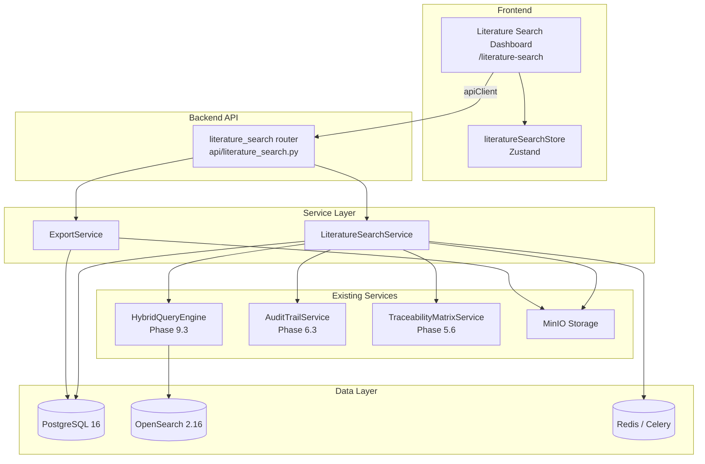
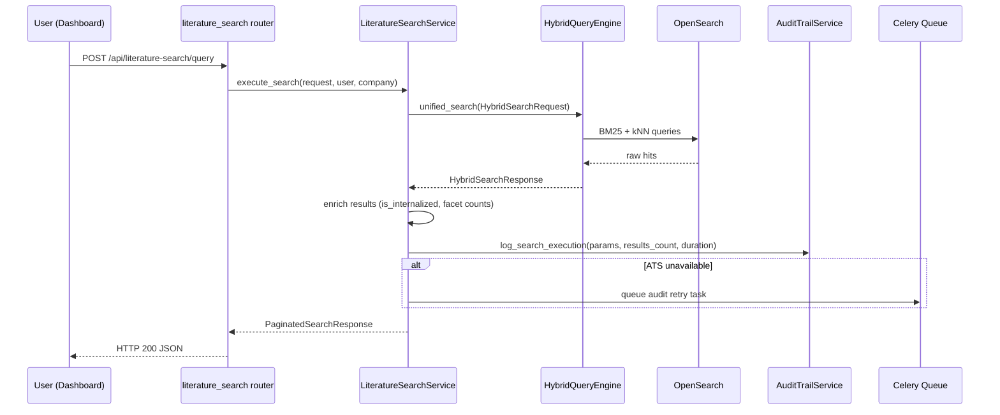
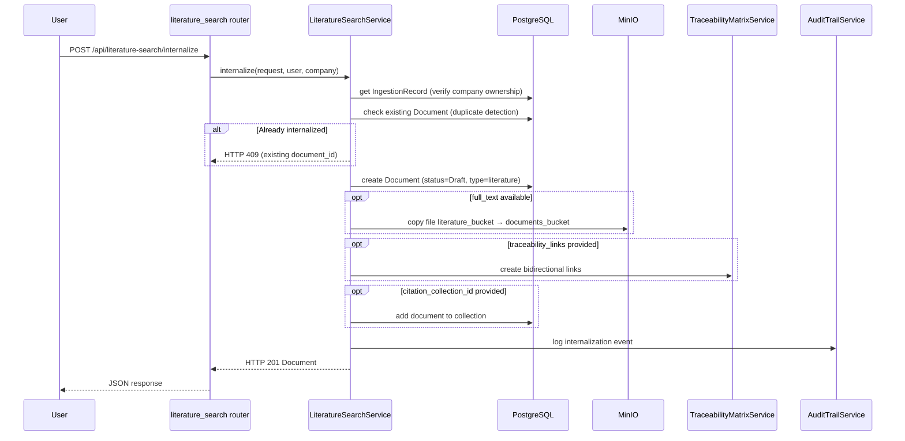
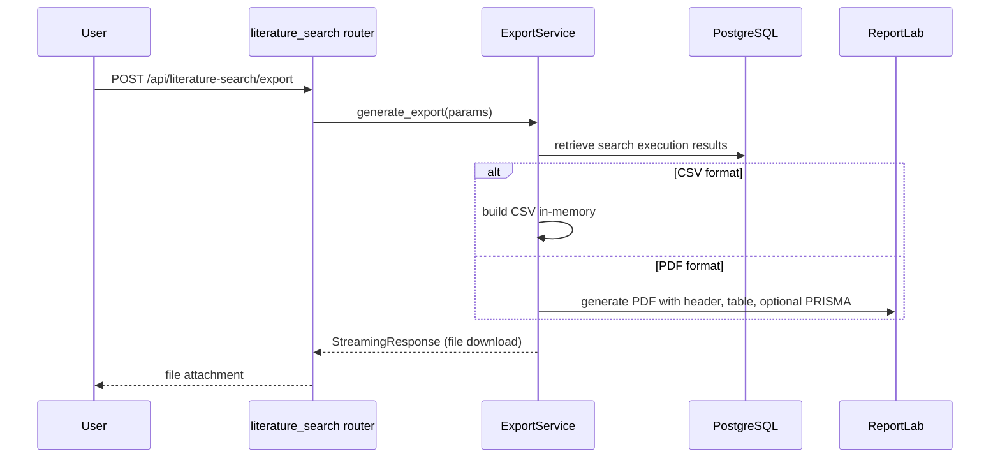
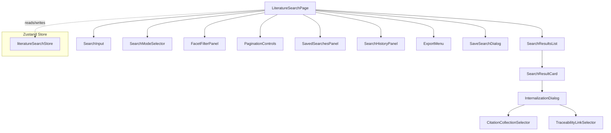

# Design Document — Phase 9.6: Literature Search, Citation UI, & Audit Trail Mapping

## Overview

Phase 9.6 delivers the user-facing search interface and backend APIs that connect the literature search infrastructure (Phases 9.1–9.5) to a dedicated Faceted Search Dashboard with One-Click Internalization, Citation Collection management, and full Traceability Matrix integration.

**Key design goals:**

1. **Thin API layer** — The new `literature_search` router delegates all logic to `LiteratureSearchService`, which orchestrates existing services (`HybridQueryEngine`, `AuditTrailService`, `TraceabilityMatrixService`).
2. **Reuse over reinvention** — Search uses the existing `HybridQueryEngine.unified_search()` method; audit logging uses the existing `AuditMiddleware` + dedicated `record_type`; traceability uses the `TraceabilityMatrixService` link creation.
3. **Audit-first** — Every search execution, result view, internalization, traceability link creation, and citation operation is logged immutably. Audit logging is async-safe with Celery retry on failure.
4. **Multi-tenant isolation** — All queries scoped by `X-Company-Id`; foreign-key relationships encode `company_id` for defense-in-depth.

## Architecture



## Data Flow Diagrams

### Search Execution Flow



### Internalization Flow



### Export Flow



## Package Layout (New Files)

```
src/backend/src/alcoabase/
├── api/
│   └── literature_search.py              # NEW: Router with all endpoints
├── literature/
│   └── search/                           # NEW: Search sub-package
│       ├── __init__.py
│       ├── models/
│       │   ├── __init__.py
│       │   ├── saved_search.py           # SavedSearch ORM model
│       │   ├── citation_collection.py    # CitationCollection + junction table
│       │   └── search_execution_log.py   # SearchExecutionLog (immutable)
│       ├── schemas/
│       │   ├── __init__.py
│       │   ├── query.py                  # Search request/response schemas
│       │   ├── internalization.py        # Internalization request/response
│       │   ├── saved_search.py           # Saved search CRUD schemas
│       │   ├── citation_collection.py    # Collection CRUD schemas
│       │   ├── traceability.py           # Traceability link schemas
│       │   └── export.py                 # Export request schemas
│       └── services/
│           ├── __init__.py
│           ├── literature_search_service.py  # Main orchestration service
│           └── export_service.py             # CSV/PDF export generation
├── tasks/
│   └── literature_search_tasks.py        # NEW: Celery tasks (audit retry)

src/frontend/src/
├── pages/
│   └── LiteratureSearchPage.tsx          # NEW: Main dashboard page
├── components/
│   └── literature-search/                # NEW: Feature components
│       ├── SearchInput.tsx
│       ├── SearchModeSelector.tsx
│       ├── FacetFilterPanel.tsx
│       ├── SearchResultCard.tsx
│       ├── SearchResultsList.tsx
│       ├── PaginationControls.tsx
│       ├── InternalizationDialog.tsx
│       ├── SaveSearchDialog.tsx
│       ├── SavedSearchesPanel.tsx
│       ├── SearchHistoryPanel.tsx
│       ├── CitationCollectionSelector.tsx
│       ├── TraceabilityLinkSelector.tsx
│       └── ExportMenu.tsx
├── stores/
│   └── literatureSearchStore.ts          # NEW: Zustand store
├── hooks/
│   └── useLiteratureSearch.ts            # NEW: API integration hook
└── types/
    └── literatureSearch.ts               # NEW: TypeScript types
```

## Components and Interfaces

### Backend Service: `LiteratureSearchService`

```python
class LiteratureSearchService:
    """Orchestrates literature search, internalization, saved searches, and citations.

    Coordinates between HybridQueryEngine, AuditTrailService, TraceabilityMatrixService,
    and MinIO storage to provide the complete Phase 9.6 feature set.

    Args:
        db: AsyncSession for PostgreSQL queries.
        query_engine: HybridQueryEngine instance (Phase 9.3).
        audit_service: AuditTrailService instance (Phase 6.3).
        traceability_service: TraceabilityMatrixService instance (Phase 5.6).
        storage_client: aioboto3 S3 client for MinIO operations.
    """

    def __init__(
        self,
        db: AsyncSession,
        query_engine: HybridQueryEngine,
        audit_service: AuditTrailService,
        traceability_service: TraceabilityMatrixService,
        storage_client: Any,
    ) -> None: ...

    async def execute_search(
        self,
        request: LiteratureSearchQueryRequest,
        user_id: int,
        company_id: int,
    ) -> PaginatedSearchResponse:
        """Execute a hybrid literature search with faceted filtering.

        Delegates to HybridQueryEngine, enriches results with internalization
        status, computes facet counts, and logs execution to audit trail.

        Returns:
            PaginatedSearchResponse with results, pagination, and facet counts.

        Raises:
            SearchUnavailableError: If OpenSearch is unreachable.
        """
        ...

    async def internalize(
        self,
        request: InternalizationRequest,
        user_id: int,
        company_id: int,
    ) -> InternalizedDocumentResponse:
        """Convert an IngestionRecord into a managed Document.

        Steps: verify ownership → duplicate check → create Document →
        copy file → create traceability links → add to collection → audit log.

        Returns:
            InternalizedDocumentResponse with the new Document details.

        Raises:
            DuplicateInternalizationError: If already internalized (HTTP 409).
            IngestionRecordNotFoundError: If record doesn't exist (HTTP 404).
            InsufficientPermissionsError: If user lacks role (HTTP 403).
        """
        ...

    async def create_saved_search(
        self,
        request: CreateSavedSearchRequest,
        user_id: int,
        company_id: int,
    ) -> SavedSearchResponse:
        """Persist a search configuration for later re-execution."""
        ...

    async def list_saved_searches(
        self,
        user_id: int,
        company_id: int,
        page: int = 1,
        page_size: int = 20,
    ) -> PaginatedSavedSearchResponse:
        """List saved searches for the current user, ordered by last_executed_at."""
        ...

    async def execute_saved_search(
        self,
        saved_search_id: int,
        user_id: int,
        company_id: int,
    ) -> PaginatedSearchResponse:
        """Re-execute a saved search and update its execution metadata."""
        ...

    async def delete_saved_search(
        self,
        saved_search_id: int,
        user_id: int,
        company_id: int,
    ) -> None:
        """Soft-delete (archive) a saved search."""
        ...

    async def create_citation_collection(
        self,
        request: CreateCitationCollectionRequest,
        user_id: int,
        company_id: int,
    ) -> CitationCollectionResponse:
        """Create a new citation collection for organizing literature."""
        ...

    async def add_documents_to_collection(
        self,
        collection_id: int,
        document_ids: list[int],
        user_id: int,
        company_id: int,
    ) -> CitationCollectionDetailResponse:
        """Add internalized documents to a citation collection."""
        ...

    async def remove_document_from_collection(
        self,
        collection_id: int,
        document_id: int,
        user_id: int,
        company_id: int,
    ) -> None:
        """Remove a document from a collection (does not delete the Document)."""
        ...

    async def create_traceability_links(
        self,
        request: CreateTraceabilityLinksRequest,
        user_id: int,
        company_id: int,
    ) -> list[TraceabilityLinkResponse]:
        """Create literature-evidence traceability links via TraceabilityMatrixService."""
        ...

    async def list_traceability_links(
        self,
        document_id: int | None,
        target_id: int | None,
        user_id: int,
        company_id: int,
        page: int = 1,
        page_size: int = 20,
    ) -> PaginatedTraceabilityLinksResponse:
        """List traceability links filtered by document or target."""
        ...

    async def delete_traceability_link(
        self,
        link_id: int,
        user_id: int,
        company_id: int,
    ) -> None:
        """Remove a traceability link."""
        ...
```

### Backend Service: `ExportService`

```python
class ExportService:
    """Generates CSV and PDF exports of search results.

    Args:
        db: AsyncSession for retrieving search execution data.
    """

    def __init__(self, db: AsyncSession) -> None: ...

    async def generate_csv_export(
        self,
        search_execution_id: int | None,
        saved_search_id: int | None,
        user_id: int,
        company_id: int,
    ) -> StreamingResponse:
        """Generate a CSV file with search results.

        Returns:
            FastAPI StreamingResponse with CSV content.
        """
        ...

    async def generate_pdf_export(
        self,
        search_execution_id: int | None,
        saved_search_id: int | None,
        include_prisma_flow: bool,
        user_id: int,
        company_id: int,
    ) -> StreamingResponse:
        """Generate a PDF report with search parameters, results, and optional PRISMA diagram.

        Uses ReportLab for PDF generation.

        Returns:
            FastAPI StreamingResponse with PDF content.
        """
        ...
```

### Frontend Component Hierarchy



### Frontend Zustand Store: `literatureSearchStore`

```typescript
interface LiteratureSearchState {
  // Query state
  queryText: string;
  searchMode: 'hybrid' | 'keyword' | 'semantic';
  includeInternal: boolean;
  filters: SearchFilters;

  // Results state
  results: LiteratureSearchResult[];
  pagination: PaginationMeta | null;
  facetCounts: FacetCounts | null;
  isLoading: boolean;
  error: string | null;

  // Saved searches
  savedSearches: SavedSearch[];
  savedSearchesLoading: boolean;

  // Search history
  searchHistory: SearchHistoryEntry[];

  // Actions
  setQueryText: (text: string) => void;
  setSearchMode: (mode: 'hybrid' | 'keyword' | 'semantic') => void;
  setIncludeInternal: (include: boolean) => void;
  setFilters: (filters: Partial<SearchFilters>) => void;
  executeSearch: (page?: number) => Promise<void>;
  loadSavedSearches: () => Promise<void>;
  saveCurrentSearch: (name: string, description?: string) => Promise<void>;
  executeSavedSearch: (id: string) => Promise<void>;
  deleteSavedSearch: (id: string) => Promise<void>;
  loadSearchHistory: () => Promise<void>;
  resetSearch: () => void;
}
```

## Data Models

### New Tables

#### `saved_searches`

| Column | Type | Constraints | Description |
|--------|------|-------------|-------------|
| `id` | `SERIAL` | PK | Primary key |
| `name` | `VARCHAR(200)` | NOT NULL | User-provided name |
| `description` | `TEXT` | NULLABLE | Optional description |
| `query_text` | `TEXT` | NOT NULL | Search query text |
| `filters` | `JSONB` | NOT NULL, DEFAULT `{}` | Complete filter object |
| `search_mode` | `VARCHAR(20)` | NOT NULL, DEFAULT `'hybrid'` | hybrid/keyword/semantic |
| `include_internal` | `BOOLEAN` | NOT NULL, DEFAULT `false` | Include internal docs |
| `user_id` | `INTEGER` | FK → `users.id`, NOT NULL | Creator |
| `company_id` | `INTEGER` | FK → `companies.id`, NOT NULL | Tenant |
| `last_executed_at` | `TIMESTAMPTZ` | NULLABLE | Last execution timestamp |
| `last_result_count` | `INTEGER` | NULLABLE | Results at last execution |
| `status` | `VARCHAR(20)` | NOT NULL, DEFAULT `'active'` | active/archived |
| `created_at` | `TIMESTAMPTZ` | NOT NULL, DEFAULT `now()` | Creation time |
| `updated_at` | `TIMESTAMPTZ` | NOT NULL, DEFAULT `now()` | Last update time |

**Indexes:** `(company_id, user_id, status)`, `(company_id, user_id, last_executed_at DESC)`

#### `citation_collections`

| Column | Type | Constraints | Description |
|--------|------|-------------|-------------|
| `id` | `SERIAL` | PK | Primary key |
| `name` | `VARCHAR(300)` | NOT NULL | Collection name |
| `description` | `TEXT` | NULLABLE | Collection description |
| `purpose` | `VARCHAR(50)` | NOT NULL | Enum: clinical_evaluation, post_market_surveillance, systematic_literature_review, risk_assessment, other |
| `company_id` | `INTEGER` | FK → `companies.id`, NOT NULL | Tenant |
| `created_by` | `INTEGER` | FK → `users.id`, NOT NULL | Creator |
| `status` | `VARCHAR(20)` | NOT NULL, DEFAULT `'active'` | active/archived |
| `created_at` | `TIMESTAMPTZ` | NOT NULL, DEFAULT `now()` | Creation time |
| `updated_at` | `TIMESTAMPTZ` | NOT NULL, DEFAULT `now()` | Last update time |

**Indexes:** `(company_id, status)`, `(company_id, purpose, status)`

#### `citation_collection_documents`

| Column | Type | Constraints | Description |
|--------|------|-------------|-------------|
| `id` | `SERIAL` | PK | Primary key |
| `collection_id` | `INTEGER` | FK → `citation_collections.id`, NOT NULL | Parent collection |
| `document_id` | `INTEGER` | FK → `documents.id`, NOT NULL | Internalized document |
| `position` | `INTEGER` | NOT NULL | Ordering within collection |
| `added_at` | `TIMESTAMPTZ` | NOT NULL, DEFAULT `now()` | When added |
| `added_by` | `INTEGER` | FK → `users.id`, NOT NULL | Who added it |

**Indexes:** `UNIQUE (collection_id, document_id)`, `(collection_id, position)`

#### `search_execution_logs`

| Column | Type | Constraints | Description |
|--------|------|-------------|-------------|
| `id` | `SERIAL` | PK | Primary key |
| `user_id` | `INTEGER` | FK → `users.id`, NOT NULL | Executor |
| `company_id` | `INTEGER` | FK → `companies.id`, NOT NULL | Tenant |
| `query_text` | `TEXT` | NOT NULL | Search query |
| `filters` | `JSONB` | NOT NULL, DEFAULT `{}` | Applied filters |
| `search_mode` | `VARCHAR(20)` | NOT NULL | hybrid/keyword/semantic |
| `include_internal` | `BOOLEAN` | NOT NULL | Whether internal included |
| `total_results` | `INTEGER` | NOT NULL | Total results returned |
| `sources_queried` | `JSONB` | NOT NULL | List of sources queried |
| `execution_duration_ms` | `INTEGER` | NOT NULL | Query time in ms |
| `saved_search_id` | `INTEGER` | FK → `saved_searches.id`, NULLABLE | If from saved search |
| `executed_at` | `TIMESTAMPTZ` | NOT NULL, DEFAULT `now()` | Execution timestamp |

**Indexes:** `(company_id, user_id, executed_at DESC)`, `(saved_search_id)`
**Immutability:** This table uses the `ImmutableRecordMixin` — rows cannot be updated or deleted.

### Modified Tables

#### `documents` (existing — add column)

| Column | Type | Constraints | Description |
|--------|------|-------------|-------------|
| `source_ingestion_record_id` | `INTEGER` | FK → `literature_ingestion_records.id`, NULLABLE | Links internalized doc back to source |
| `full_text_status` | `VARCHAR(20)` | NULLABLE, DEFAULT `NULL` | `'available'`, `'unavailable'`, `NULL` |

**Index:** `UNIQUE (company_id, source_ingestion_record_id)` WHERE `source_ingestion_record_id IS NOT NULL`

## API Endpoint Specifications

All endpoints are prefixed with `/api/literature-search`.

### Search

| Method | Path | Auth | Headers | Description |
|--------|------|------|---------|-------------|
| `POST` | `/query` | member+ | `X-Company-Id`, `X-Change-Reason` | Execute faceted hybrid search |

**Request Body:**
```json
{
  "query_text": "string (1-1000 chars, required)",
  "filters": {
    "date_from": "ISO date (optional)",
    "date_to": "ISO date (optional)",
    "journals": ["string array, max 20"],
    "sources": ["string array, max 10"],
    "publication_types": ["string array, max 10"],
    "mesh_terms": ["string array, max 30"],
    "device_class": ["string array, max 5"]
  },
  "search_mode": "hybrid | keyword | semantic (default: hybrid)",
  "include_internal": "boolean (default: false)",
  "page": "integer (default: 1)",
  "page_size": "integer (1-100, default: 20)"
}
```

**Response (200):**
```json
{
  "results": [
    {
      "id": "integer",
      "title": "string",
      "authors": ["string"],
      "abstract": "string (max 500 chars)",
      "publication_date": "ISO date",
      "journal": "string",
      "source": "string",
      "publication_type": "string",
      "mesh_terms": ["string"],
      "doi": "string | null",
      "relevance_score": "float (0.0-1.0)",
      "provenance": "external | internal",
      "full_text_available": "boolean",
      "is_internalized": "boolean"
    }
  ],
  "pagination": {
    "total_results": "integer",
    "page": "integer",
    "page_size": "integer",
    "total_pages": "integer"
  },
  "facets": {
    "journals": [{"value": "string", "count": "integer"}],
    "sources": [{"value": "string", "count": "integer"}],
    "publication_types": [{"value": "string", "count": "integer"}]
  },
  "search_execution_id": "integer"
}
```

### Saved Searches

| Method | Path | Auth | Headers | Description |
|--------|------|------|---------|-------------|
| `POST` | `/saved-searches` | member+ | `X-Company-Id`, `X-Change-Reason` | Save a search configuration |
| `GET` | `/saved-searches` | member+ | `X-Company-Id` | List user's saved searches |
| `POST` | `/saved-searches/{id}/execute` | owner/admin | `X-Company-Id`, `X-Change-Reason` | Re-execute saved search |
| `DELETE` | `/saved-searches/{id}` | owner/admin | `X-Company-Id`, `X-Change-Reason` | Archive saved search |

### Internalization

| Method | Path | Auth | Headers | Description |
|--------|------|------|---------|-------------|
| `POST` | `/internalize` | document_admin+ | `X-Company-Id`, `X-Change-Reason` | Internalize a literature record |

### Citation Collections

| Method | Path | Auth | Headers | Description |
|--------|------|------|---------|-------------|
| `POST` | `/citation-collections` | document_admin+ | `X-Company-Id`, `X-Change-Reason` | Create collection |
| `GET` | `/citation-collections` | member+ | `X-Company-Id` | List collections |
| `GET` | `/citation-collections/{id}` | member+ | `X-Company-Id` | Get collection detail |
| `PUT` | `/citation-collections/{id}` | document_admin+ | `X-Company-Id`, `X-Change-Reason` | Update collection |
| `DELETE` | `/citation-collections/{id}` | document_admin+ | `X-Company-Id`, `X-Change-Reason` | Archive collection |
| `POST` | `/citation-collections/{id}/documents` | document_admin+ | `X-Company-Id`, `X-Change-Reason` | Add documents |
| `DELETE` | `/citation-collections/{id}/documents/{doc_id}` | document_admin+ | `X-Company-Id`, `X-Change-Reason` | Remove document |

### Traceability Links

| Method | Path | Auth | Headers | Description |
|--------|------|------|---------|-------------|
| `POST` | `/traceability-links` | document_admin+ | `X-Company-Id`, `X-Change-Reason` | Create links |
| `GET` | `/traceability-links` | member+ | `X-Company-Id` | List links (filtered) |
| `DELETE` | `/traceability-links/{id}` | document_admin+ | `X-Company-Id`, `X-Change-Reason` | Delete link |

### Export

| Method | Path | Auth | Headers | Description |
|--------|------|------|---------|-------------|
| `POST` | `/export` | member+ | `X-Company-Id`, `X-Change-Reason` | Generate CSV/PDF export |

## Key Design Decisions

| # | Decision | Rationale | Alternatives Considered |
|---|----------|-----------|------------------------|
| 1 | Place new models under `literature/search/models/` | Keeps Phase 9.6 models co-located with other literature sub-packages; follows existing pattern (`literature/ingestion/models/`, `literature/review/models/`) | Top-level `models/` — rejected because it would mix literature-specific models with core models |
| 2 | Use `SearchExecutionLog` as a PostgreSQL table (immutable) rather than only relying on AuditTrailService | Enables efficient querying for re-execution, export references, and search history display without parsing the generic audit trail | Pure audit trail only — rejected because structured queries (JOIN with saved_searches) would be impractical |
| 3 | Post-filter approach for faceted search | OpenSearch post_filter preserves relevance scoring while narrowing results; facet counts remain meaningful across the full corpus | Pre-filter — rejected because it distorts relevance scores |
| 4 | Async audit logging with Celery retry (up to 3 attempts) | Search results are returned immediately even if audit service is down; no user-facing degradation for non-critical logging failures | Synchronous audit — rejected because it blocks user on audit infra availability |
| 5 | Soft-delete (archive) for saved searches and collections | Preserves regulatory evidence trail; archived items still available for historical audit queries | Hard delete — rejected for GxP compliance |
| 6 | `source_ingestion_record_id` on `documents` table with partial unique index | Prevents duplicate internalization; enables efficient is_internalized lookups; single FK avoids separate junction table | Junction table — over-engineering for a 1:1 relationship |
| 7 | Single Zustand store for all search state | Search, filters, results, saved searches, and history are tightly coupled in the UI; single store avoids sync issues | Multiple stores — rejected due to complex inter-store dependencies |
| 8 | Export generates files synchronously (not via Celery) | Typical exports are <1000 results and complete in <5s; avoids complexity of polling/WebSocket for file readiness | Celery async export — reserved for future if large exports become common |
| 9 | Citation collection max 500 documents | Practical limit for PDF export performance and UI rendering; covers largest regulatory submissions | No limit — rejected due to memory/performance concerns at scale |
| 10 | `position` column for ordered collections | Enables drag-and-drop reordering in future; preserves user-defined citation order for exports | Array ordering via JSONB — rejected due to concurrent modification issues |

## Integration Points with Phases 9.1–9.5

| Phase | Component | Integration |
|-------|-----------|-------------|
| 9.1 | `LiteratureGatewayService` / Source Adapters | Adapter names populate the "sources" facet filter; source registry provides available adapter list |
| 9.2 | `IngestionRecord` model | Source data for internalization; `source_ingestion_record_id` FK on Document |
| 9.3 | `HybridQueryEngine` | Primary search interface; `unified_search()` handles BM25 + kNN + RRF + ABAC |
| 9.4 | Screening / SLR Review | Screening decisions enrich search results (future: show screening status badge) |
| 9.5 | Vigilance / Medical Products | `device_class` facet filter values come from `MedicalProduct` enum; vigilance-linked records searchable |
| 5.6 | `TraceabilityMatrixService` | Creates `literature_evidence` links between Documents and requirements/test cases |
| 6.3 | `AuditTrailService` / `AuditMiddleware` | All mutations logged via middleware; search execution logs recorded programmatically |
| 3.1 | BPMN Workflow Engine | Internalized documents start in "Draft" workflow state |


## Correctness Properties

*A property is a characteristic or behavior that should hold true across all valid executions of a system — essentially, a formal statement about what the system should do. Properties serve as the bridge between human-readable specifications and machine-verifiable correctness guarantees.*

### Property 1: Search result schema validity

*For any* valid search request (non-empty query, valid filters, valid pagination), every result in the response SHALL have: `relevance_score` in [0.0, 1.0], `provenance` in {"external", "internal"}, `abstract` with length ≤ 500 characters, and all required fields non-null (id, title, authors, source, publication_type).

**Validates: Requirements 1.4, 1.5**

### Property 2: Pagination metadata correctness

*For any* search response with `total_results`, `page`, and `page_size`, the `total_pages` SHALL equal `ceil(total_results / page_size)`, the number of results on the current page SHALL be `min(page_size, total_results - (page - 1) * page_size)`, and `page` SHALL be ≤ `total_pages` (or results empty when page > total_pages).

**Validates: Requirements 1.6**

### Property 3: Tenant isolation

*For any* two companies A and B, and any read operation (search, list saved searches, list collections, list traceability links) executed in company A's context, no results belonging to company B SHALL ever appear in the response.

**Validates: Requirements 1.8, 8.1, 8.5**

### Property 4: Whitespace query rejection

*For any* string composed entirely of whitespace characters (spaces, tabs, newlines) or the empty string, submitting it as `query_text` to the search endpoint SHALL return HTTP 422 and the response SHALL contain zero results.

**Validates: Requirements 1.10**

### Property 5: Search execution creates audit log

*For any* successful search execution, there SHALL exist a corresponding `SearchExecutionLog` record with matching `user_id`, `company_id`, `query_text`, `filters`, `search_mode`, `include_internal`, and `total_results` matching the response `pagination.total_results`, and `execution_duration_ms` > 0.

**Validates: Requirements 2.1**

### Property 6: Audit log immutability

*For any* existing `SearchExecutionLog` record, attempting to UPDATE any field or DELETE the record SHALL raise an error, and the record SHALL remain unchanged.

**Validates: Requirements 2.2**

### Property 7: Saved search round-trip

*For any* valid saved search creation request (name 1–200 chars, query_text 1–1000 chars, valid filters), creating and then retrieving the saved search SHALL return a record where `name`, `query_text`, `filters`, `search_mode`, and `include_internal` exactly match the original input.

**Validates: Requirements 3.1, 3.5**

### Property 8: Saved search listing order

*For any* set of active saved searches belonging to a user, listing them SHALL return entries ordered by `last_executed_at` descending, with entries where `last_executed_at` is NULL appearing at the end of the list.

**Validates: Requirements 3.2**

### Property 9: Saved search execution updates metadata

*For any* saved search, executing it SHALL update `last_executed_at` to a timestamp within 5 seconds of the current time and set `last_result_count` to the actual number of results returned by the search.

**Validates: Requirements 3.3, 3.6**

### Property 10: Internalization metadata preservation

*For any* valid IngestionRecord with fields (title, authors, abstract, publication_date, doi, source_id), internalizing it SHALL produce a Document where the `title`, `document_type` ("literature"), and `source_ingestion_record_id` match the source record, and the Document's `current_status` SHALL be "Draft".

**Validates: Requirements 4.1, 4.2**

### Property 11: Duplicate internalization detection

*For any* IngestionRecord that has already been internalized within the same company (a Document with matching `source_ingestion_record_id` exists), a second internalization attempt SHALL return HTTP 409 and the response SHALL contain the existing Document's ID.

**Validates: Requirements 4.3**

### Property 12: Citation collection document ordering

*For any* citation collection, adding N documents SHALL result in those documents appearing at positions after all previously existing entries, and retrieving the collection detail SHALL return documents in ascending `position` order.

**Validates: Requirements 5.3, 5.4**

### Property 13: Collection removal preserves Document entity

*For any* document removed from a citation collection, the Document record SHALL continue to exist in the `documents` table with all its data intact — only the junction record in `citation_collection_documents` SHALL be deleted.

**Validates: Requirements 5.5**

### Property 14: Only internalized documents in citation collections

*For any* Document without a non-null `source_ingestion_record_id`, attempting to add it to a Citation Collection SHALL return HTTP 422 and the collection's document list SHALL remain unchanged.

**Validates: Requirements 5.9**

### Property 15: Only internalized documents for traceability links

*For any* Document without a non-null `source_ingestion_record_id`, attempting to create a traceability link for it SHALL return HTTP 422 and no link SHALL be created.

**Validates: Requirements 6.5**

### Property 16: Traceability link filtering correctness

*For any* set of traceability links and a filter query (by `document_id` or `target_id`), the returned results SHALL contain only links where the filter field matches, and SHALL contain all such matching links (completeness).

**Validates: Requirements 6.3**

### Property 17: CSV export contains all required columns

*For any* set of search results exported as CSV, the output SHALL contain columns: title, authors, publication_date, journal, source, publication_type, doi, abstract, relevance_score, provenance, and mesh_terms — and each row SHALL have a value for every column (empty string if null in source).

**Validates: Requirements 7.2**

### Property 18: All mutations create audit events

*For any* successful mutation operation (internalization, citation collection modification, traceability link creation/deletion), there SHALL exist a corresponding audit event with the correct `user_id`, `company_id`, action type, and timestamp within 5 seconds of the operation.

**Validates: Requirements 4.6, 5.11, 6.8**

## Error Handling

| Error Condition | HTTP Code | Response | Recovery |
|----------------|-----------|----------|----------|
| OpenSearch unavailable (timeout > 10s or 503) | 503 | `{"detail": "Search index is temporarily unavailable. Please retry."}` | Client retries with exponential backoff |
| Empty/whitespace query | 422 | `{"detail": "A search query is required."}` | Client-side validation |
| IngestionRecord not found or wrong company | 404 | `{"detail": "Literature record not found."}` | — |
| Already internalized | 409 | `{"detail": "Already internalized.", "existing_document_id": <id>}` | Client navigates to existing doc |
| Insufficient permissions | 403 | `{"detail": "Insufficient permissions for this operation."}` | — |
| Saved search limit exceeded (200) | 422 | `{"detail": "Maximum saved searches limit (200) reached."}` | User archives old searches |
| Collection document limit (500) | 422 | `{"detail": "Collection capacity (500 documents) reached."}` | User creates new collection |
| Non-internalized doc in collection/traceability | 422 | `{"detail": "Only internalized literature documents can be used."}` | — |
| Invalid traceability target | 404 | `{"detail": "Specified requirement or test case not found."}` | — |
| Missing X-Company-Id | 400 | `{"detail": "X-Company-Id header is required."}` | Client fix |
| Missing X-Change-Reason on mutation | 400 | `{"detail": "X-Change-Reason header is required..."}` | Client fix |
| Audit service unavailable during search | — | Search still succeeds; audit queued to Celery (3 retries, 1min intervals) | Automatic retry |
| MinIO copy failure during internalization | 201 | Document created; `full_text_status: "unavailable"`; warning in audit log | Manual file upload later |
| Export reference not found/wrong company | 404 | `{"detail": "Search execution not found."}` | — |
| Neither search_execution_id nor saved_search_id | 422 | `{"detail": "At least one search reference is required."}` | Client validation |

## Testing Strategy

### Property-Based Tests (Backend — Hypothesis)

Property-based tests validate universal correctness properties across randomized inputs. Each test runs **minimum 100 iterations** and references the design property it validates.

**Library:** `hypothesis` (Python)
**Location:** `src/backend/tests/properties/test_literature_search_properties.py`

| Property | Test Description | Generator Strategy |
|----------|-----------------|-------------------|
| P1 | Result schema validation | Random search results with varying field values |
| P2 | Pagination math | Random (total, page, page_size) triples |
| P3 | Tenant isolation | Random data for 2+ companies, query from one |
| P4 | Whitespace rejection | `st.text(alphabet=st.characters(whitespace_categories=...))` |
| P5 | Audit log creation | Random valid search requests |
| P6 | Audit log immutability | Random existing log records + mutation attempts |
| P7 | Saved search round-trip | Random valid creation payloads |
| P8 | Listing order | Random saved searches with mixed timestamps |
| P9 | Execution metadata update | Random saved search + execution |
| P10 | Internalization metadata | Random IngestionRecord field values |
| P11 | Duplicate detection | Any record internalized twice |
| P12 | Collection ordering | Random document additions |
| P13 | Remove preserves entity | Random document in collection |
| P14 | Non-internalized rejection (collection) | Random Documents without source FK |
| P15 | Non-internalized rejection (traceability) | Random Documents without source FK |
| P16 | Link filter correctness | Random links + filter queries |
| P17 | CSV export columns | Random result sets |
| P18 | Mutation audit events | Random mutation operations |

**Tag format:** `# Feature: Step_9-6_literature-search-citation-ui, Property N: <property_text>`

### Property-Based Tests (Frontend — fast-check)

**Library:** `fast-check`
**Location:** `src/frontend/src/__tests__/literatureSearch.property.test.ts`

| Property | Test Description |
|----------|-----------------|
| P2 (frontend) | Pagination component renders correct page numbers for any (total, page, pageSize) |
| P4 (frontend) | Search input rejects any whitespace-only string and disables submit |

### Unit Tests (Example-Based)

- Search mode routing (keyword-only, semantic-only, hybrid)
- Role-based access matrix (member, document_admin, system_admin × endpoint)
- Saved search access control (owner vs other user vs admin)
- MinIO copy failure graceful handling
- Audit service unavailability with Celery fallback
- Export format selection (CSV vs PDF)
- PRISMA flow diagram inclusion toggle

### Integration Tests

- Full search flow against mocked OpenSearch
- Internalization with file copy against mocked MinIO
- Traceability link creation via mocked TraceabilityMatrixService
- Export PDF generation with ReportLab
- Celery task dispatch and retry for audit logging

### Smoke Tests

- X-Company-Id missing → 400
- X-Change-Reason missing on mutations → 400
- Database schema has all expected columns
- Router registration in main app
